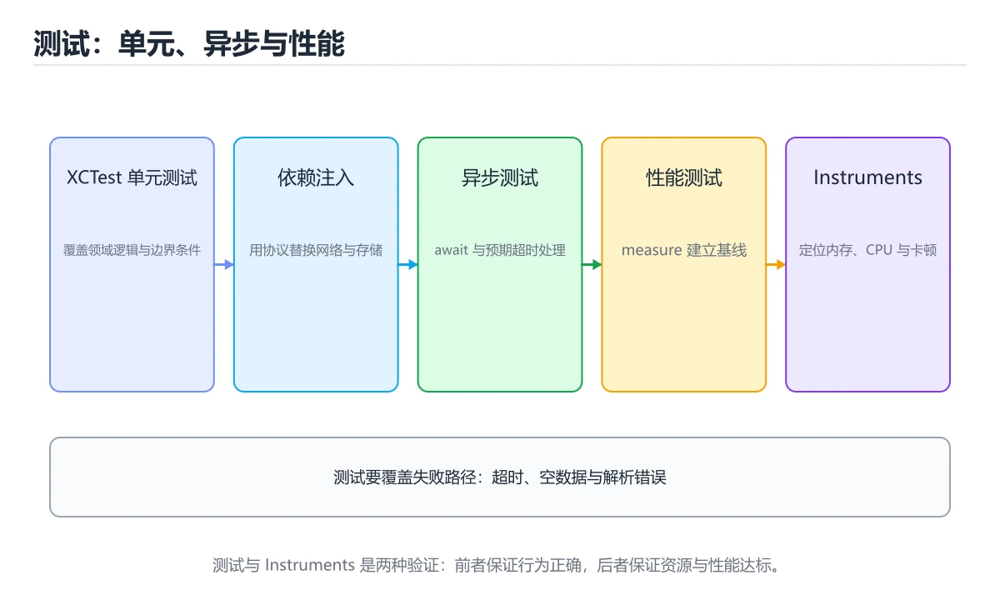

# Swift 测试与性能




> 内容更新时间：2026-10-06 · 学习阶段：高级 · 预计用时：35 分钟

## 本节知识框架

**课程定位**：所属分类 `swift`（Swift），课程主题 `Swift 测试与性能`，学习阶段 高级，建议用时 45 分钟。

本课主线：用 XCTest、异步测试、依赖注入和 Instruments 验证质量。

**学完本课应当能够**
- 说清 `XCTest` 与 `异步测试` 的含义与区别，并各举一个正例和一个反例。
- 用本课示例验证 `测试替身` 的行为，记录输入、输出与失败条件。
- 遇到「只测正常路径」这类问题时，能说出触发条件与修复顺序。

### 从概念到验证的学习链条

1. `XCTest`：先掌握 Xcode 自带的测试框架：用 XCTestCase 写断言与异步测试，配合依赖注入隔离外部依赖，再用它解释 `异步测试` 为什么会出现。
2. `异步测试`：先掌握 二、运行时与内存模型：围绕「XCTest、异步测试、Instruments、依赖注入」说明变量生命周期、资源释放、并发模型和错误传播，再用它解释 `测试替身` 为什么会出现。
3. `测试替身`：先掌握 用 mock 或 stub 模拟网络与存储，让单元测试可重复且不依赖外部服务，再用它解释 `覆盖率` 为什么会出现。
4. `覆盖率`：先掌握 衡量被测试执行到的代码比例，只看数字会漏掉断言质量，要配合边界用例一起看，再用它解释 本课示例的观察结果 为什么会出现。

**先修与衔接**：本课是「Swift」分类的第 12 课。先修内容：《SwiftUI 与状态管理》。《SwiftUI 与状态管理》里的 `SwiftUI`、`状态` 是本课的前提。相关或后续课程：《实战：SwiftUI iOS 客户端》。

### 完成判据

- **定义关**：不看正文也能说明 `XCTest` 是 Xcode 自带的测试框架：用 XCTestCase 写断言与异步测试，配合依赖注入隔离外部依赖，并指出一个反例。
- **机制关**：能按“输入 → 转换 → 输出 → 验证”复述 `Swift 测试与性能`，而不是只背结论。
- **示例关**：能运行或推演 `Swift 测试与性能` 的 `text` 示例，并说明一个真实出现的标识符或字面量。
- **证据关**：能指出 `Swift 测试与性能` 示例里的 调用了 `square()`，并说明它支持或反驳了本课的哪一条结论。
- **排错关**：能复现 只测正常路径，记录现象并按 覆盖失败、超时与空数据 修复。
- **迁移关**：能把 `XCTest`、`异步测试`、`Instruments`、`依赖注入` 放进一个与 `Swift 测试与性能` 不同的项目场景，并保持输入与验证条件可追踪。
- **复盘关**：学完 `Swift 测试与性能` 后，用一句话写下仍然不确定的结论，并列出下一次验证需要的输入、环境和成功判据。

### 复习清单

- [ ] 能不看正文复述本课核心术语，并指出一个边界或反例。
- [ ] 能运行或推演本课示例，记录输入、输出与失败现象。
- [ ] 能完成一次自测，并把错题对照错误表定位原因。

## 核心概念定义

| 术语 | 操作性定义 | 常见边界与风险 |
| --- | --- | --- |
| XCTest | Xcode 自带的测试框架：用 XCTestCase 写断言与异步测试，配合依赖注入隔离外部依赖。 | 不同版本与依赖组合的行为可能不同，升级或换环境前要按官方变更说明重新验证。 |
| 异步测试 | 二、运行时与内存模型：围绕「XCTest、异步测试、Instruments、依赖注入」说明变量生命周期、资源释放、并发模型和错误传播。 | 不同版本与依赖组合的行为可能不同，升级或换环境前要按官方变更说明重新验证。 |
| 测试替身 | 用 mock 或 stub 模拟网络与存储，让单元测试可重复且不依赖外部服务。 | 不同版本与依赖组合的行为可能不同，升级或换环境前要按官方变更说明重新验证。 |
| 覆盖率 | 衡量被测试执行到的代码比例，只看数字会漏掉断言质量，要配合边界用例一起看。 | 只在「衡量被测试执行到的代码比例，只看数字会漏掉断言质量，要配合边界用例一起看」这一前提下成立，换输入或换环境要重新验证。 |

## 原理与运行机制

### 机制总览

**教材衔接：核心知识**

### 1. 测试通过协议和依赖注入隔离网络、时间和文件系统。

- 关键做法：先用 square 建立 XCTest 的基线，再逐步加入边界与失败条件。
- 验证标准：XCTest 的结果可复现、错误可解释、失败能恢复。

### 2. 异步测试要等待确定性条件，不能用固定 sleep。

把这条结论放回「Swift 测试与性能」的完整流程里展开：

- 正文依据：能用自己的话解释：测试通过协议和依赖注入隔离网络、时间和文件系统。
- 落地检查：把「2. 异步测试要等待确定性条件，不能用固定 sleep。」改写成一条可执行的核对项，逐条验证输入、超时与失败路径。

### 3. 性能问题用 Instruments 观察 CPU、内存、线程和主线程阻塞。

把这条结论放回「Swift 测试与性能」的完整流程里展开：

- 正文依据：能用自己的话解释：异步测试要等待确定性条件，不能用固定 sleep。
- 落地检查：把「3. 性能问题用 Instruments 观察 CPU、内存、线程和主线程阻塞。」改写成一条可执行的核对项，逐条验证输入、超时与失败路径。

**教材衔接：关键流程**

**教材衔接：实践路径**

**教材衔接：版本与时效**

- Swift 6.x 默认开启更严格的数据竞争检查；XCTest 的并发边界要先梳理。
- 升级前先用 square 建立基线：记录版本、命令和输出，升级后只比较这些可观察量。
- 把 异步测试 的 UI 与测试代码分开，降低版本升级的影响面。
- 官方发布说明：https://www.swift.org/blog/

### 升级检查清单

- 先固定当前版本，跑通全部示例与测验，再升级工具链。
- 只改 XCTest 的版本变量，记录编译、测试与产物体积的变化。
- 升级后重点回归 XCTest 的默认值、警告信息与错误格式。
- 升级后把 square 的实测版本写进「内容元数据」，再更新复核日期。

**教材衔接：验证步骤**

### 机制拆解：每一步的输入、动作与输出

#### 1. `XCTest`
- 输入：`XCTest`；本步把 Xcode 自带的测试框架：用 XCTestCase 写断言与异步测试，配合依赖注入隔离外部依赖 当作判断规则。
- 动作：围绕 `XCTest` 保留中间状态，并记录它与 `异步测试` 的对应关系。
- 输出：`异步测试`，它可以被下一段代码、测试或记录继续使用。
- `XCTest` 的失败条件：不同版本与依赖组合的行为可能不同，升级或换环境前要按官方变更说明重新验证。

#### 2. `异步测试`
- 输入：`XCTest`；本步把 二、运行时与内存模型：围绕「XCTest、异步测试、Instruments、依赖注入」说明变量生命周期、资源释放、并发模型和错误传播 当作判断规则。
- 动作：围绕 `异步测试` 保留中间状态，并记录它与 `测试替身` 的对应关系。
- 输出：`测试替身`，它可以被下一段代码、测试或记录继续使用。
- `异步测试` 的失败条件：不同版本与依赖组合的行为可能不同，升级或换环境前要按官方变更说明重新验证。

#### 3. `测试替身`
- 输入：`异步测试`；本步把 用 mock 或 stub 模拟网络与存储，让单元测试可重复且不依赖外部服务 当作判断规则。
- 动作：围绕 `测试替身` 保留中间状态，并记录它与 `覆盖率` 的对应关系。
- 输出：`覆盖率`，它可以被下一段代码、测试或记录继续使用。
- `测试替身` 的失败条件：不同版本与依赖组合的行为可能不同，升级或换环境前要按官方变更说明重新验证。

#### 4. `覆盖率`
- 输入：`测试替身`；本步把 衡量被测试执行到的代码比例，只看数字会漏掉断言质量，要配合边界用例一起看 当作判断规则。
- 动作：围绕 `覆盖率` 保留中间状态，并记录它与 `square` 的对应关系。
- 输出：`square`，它可以被下一段代码、测试或记录继续使用。
- `覆盖率` 的失败条件：只在「衡量被测试执行到的代码比例，只看数字会漏掉断言质量，要配合边界用例一起看」这一前提下成立，换输入或换环境要重新验证。

### 示例中的可观察事实

1. 调用了 `square()`；它对应的课程主题是 `Swift 测试与性能`。
2. 调用了 `assert()`；它对应的课程主题是 `Swift 测试与性能`。
3. 调用了 `print()`；它对应的课程主题是 `Swift 测试与性能`。
4. 出现字面量 `test passed`；它对应的课程主题是 `Swift 测试与性能`。

### 复现实验记录

- 环境：`Swift 测试与性能` 使用 `text` 示例，固定 `XCTest`、`异步测试`、`Instruments`、`依赖注入` 作为第一组条件。
- 首轮输入：先确认 调用了 `square()`，预测 `XCTest` 会怎样变化。
- 基线观察：记录命令、输入、输出和错误原文，不用截图代替可复制的文本。
- 单变量修改：只改变 `XCTest`，观察 `覆盖率` 是否仍满足定义。
- 失败注入：复现 只测正常路径，确认现象是 异常分支没有覆盖。
- 记录结论：把“修改前、修改后、预期变化、实际变化”写成四列表，这样复盘 `Swift 测试与性能` 时才能区分概念错误与实现错误。

## 典型应用场景

**课程内置实验入口**：`sandbox:swift`，用于动手验证《Swift 测试与性能》的机制；实验结论不替代概念定义与复杂度分析。

**教材衔接：深度拓展与实战**

这一节把 XCTest 的定义、square 的代码与常见失败串成一条复习路线。

### 机制拆解

- **1. 测试通过协议和依赖注入隔离网络、时间和文件系统。**：在「Swift 测试与性能」里，「1. 测试通过协议和依赖注入隔离网络、时间和文件系统。」这一步要先写清输入与预期，再记录实际结果和差异；结果不符时回到对应小节核对前提。
- **2. 异步测试要等待确定性条件，不能用固定 sleep。**：在「Swift 测试与性能」里，「2. 异步测试要等待确定性条件，不能用固定 sleep。」这一步要先写清输入与预期，再记录实际结果和差异；结果不符时回到对应小节核对前提。
- **3. 性能问题用 Instruments 观察 CPU、内存、线程和主线程阻塞。**：在「Swift 测试与性能」里，「3. 性能问题用 Instruments 观察 CPU、内存、线程和主线程阻塞。」这一步要先写清输入与预期，再记录实际结果和差异；结果不符时回到对应小节核对前提。
- 一、工具链：XCTest 的阶段、推荐工具与验收标准
- **二、运行时与内存模型**：围绕「XCTest、异步测试、Instruments、依赖注入」说明变量生命周期、资源释放、并发模型和错误传播

### 边界条件与常见反例

「Swift 测试与性能」的边界不只包括最大最小值，还要覆盖空、重复和失败：

### 工程检查表

- [ ] 能否用自己的话说明Swift 测试与性能解决什么问题，以及它不负责什么？
- [ ] 能否说明 XCTest 的正常输出，以及失败时留下的错误信息？
- [ ] 能否解释本课关键词在真实项目中的边界与取舍？
- [ ] 换一个输入后，square 的判断依据是否仍然成立？

### 迁移练习

1. 保持正文示例不变，写出它的输入、处理步骤和预期输出。
2. 只改变 XCTest 的一个条件，预测结果并说明依据；再运行或手算验证。
3. 结合XCTest、异步测试、Instruments、依赖注入，写出一个真实项目中的使用场景。
4. 写下一个反例，说明它在什么条件下会使朴素做法失效。

<!-- p0-depth-v2:start -->

- **只测正常路径**：典型现象是异常分支没有覆盖；正确做法是覆盖失败、超时与空数据。
- **测试依赖真实网络**：典型现象是测试慢且不稳定；正确做法是用假实现替换外部依赖。
- **性能测试没有基线**：典型现象是无法判断是否回归；正确做法是记录基线并在流水线中自动比较。

### 最小验证场景

- 准备：保留 `text` 示例的原始输入，先记录 `Swift 测试与性能` 的基线输出和完整运行命令。
- 观察：先核对 调用了 `square()`，再改变一个与 `XCTest` 相关的条件。
- 判定：新结果与 `Swift 测试与性能` 的基线不同不等于错误；只有当差异破坏了 `XCTest` 的定义或错误表中的约束，才判定为失败。

### 选择与边界

- 使用 `XCTest` 时，先满足它的定义：Xcode 自带的测试框架：用 XCTestCase 写断言与异步测试，配合依赖注入隔离外部依赖；不同版本与依赖组合的行为可能不同，升级或换环境前要按官方变更说明重新验证。
- 使用 `异步测试` 时，先满足它的定义：二、运行时与内存模型：围绕「XCTest、异步测试、Instruments、依赖注入」说明变量生命周期、资源释放、并发模型和错误传播；不同版本与依赖组合的行为可能不同，升级或换环境前要按官方变更说明重新验证。
- 使用 `测试替身` 时，先满足它的定义：用 mock 或 stub 模拟网络与存储，让单元测试可重复且不依赖外部服务；不同版本与依赖组合的行为可能不同，升级或换环境前要按官方变更说明重新验证。
- 使用 `覆盖率` 时，先满足它的定义：衡量被测试执行到的代码比例，只看数字会漏掉断言质量，要配合边界用例一起看；只在「衡量被测试执行到的代码比例，只看数字会漏掉断言质量，要配合边界用例一起看」这一前提下成立，换输入或换环境要重新验证。

## 代码/协议/SQL 示例

### 最小可验证示例

**教材衔接：最小可运行示例**

先用 square 跑通最小示例，然后只改一个与 XCTest 相关的取值：

```swift
func square(_ n: Int) -> Int { n * n }

assert(square(7) == 49)
print("test passed")
```

**教材衔接：预期输出**

```text
test passed
```

### 示例精读：先找证据，再改一个条件

1. 调用了 `square()`；它出现在 `Swift 测试与性能` 的示例中，阅读时先确认它前后各发生了什么。
2. 调用了 `assert()`；它出现在 `Swift 测试与性能` 的示例中，阅读时先确认它前后各发生了什么。
3. 调用了 `print()`；它出现在 `Swift 测试与性能` 的示例中，阅读时先确认它前后各发生了什么。
4. 出现字面量 `test passed`；它出现在 `Swift 测试与性能` 的示例中，阅读时先确认它前后各发生了什么。
- 在 `Swift 测试与性能` 中与 `XCTest` 对照：示例必须能支持 Xcode 自带的测试框架：用 XCTestCase 写断言与异步测试，配合依赖注入隔离外部依赖，否则说明这一段还缺少实现或验证步骤。
- 在 `Swift 测试与性能` 中与 `异步测试` 对照：示例必须能支持 二、运行时与内存模型：围绕「XCTest、异步测试、Instruments、依赖注入」说明变量生命周期、资源释放、并发模型和错误传播，否则说明这一段还缺少实现或验证步骤。
- 在 `Swift 测试与性能` 中与 `测试替身` 对照：示例必须能支持 用 mock 或 stub 模拟网络与存储，让单元测试可重复且不依赖外部服务，否则说明这一段还缺少实现或验证步骤。
- 在 `Swift 测试与性能` 中与 `覆盖率` 对照：示例必须能支持 衡量被测试执行到的代码比例，只看数字会漏掉断言质量，要配合边界用例一起看，否则说明这一段还缺少实现或验证步骤。

## 时间/空间复杂度或性能分析

### 二、运行时与内存模型

- 参考判断：性能问题用 Instruments 观察 CPU、内存、线程和主线程阻塞。

1. 把 XCTest 的实现压缩到一个进程内，去掉所有外部依赖后再谈扩展。
2. 扩大 异步测试 的规模，记录本课结论在哪一个量级开始不成立。
3. 把 异步测试 换成失败输入，记录错误信息与恢复动作。
5. 把 XCTest 的一个前提改成不成立，说明本课哪条结论先失效。
6. 限制 CPU 与内存上限后重跑 square，观察哪一项参数需要重新设定。

**测量方法**：以 `Swift 测试与性能` 的 `XCTest` 场景为对象，固定输入跑一遍记录基线，再把规模或并发度提高一个数量级复测；两次结果的差值与波动范围才是结论依据。

### 需要控制的变量与记录项

- `Swift 测试与性能` 的 `XCTest`：固定它的版本、输入范围和资源上限，分别记录速度、内存与失败率的变化。
- `Swift 测试与性能` 的 `异步测试`：固定它的版本、输入范围和资源上限，分别记录速度、内存与失败率的变化。
- `Swift 测试与性能` 的 `Instruments`：固定它的版本、输入范围和资源上限，分别记录速度、内存与失败率的变化。
- `Swift 测试与性能` 的 `依赖注入`：固定它的版本、输入范围和资源上限，分别记录速度、内存与失败率的变化。
- `Swift 测试与性能` 中 `XCTest` 的边界：不同版本与依赖组合的行为可能不同，升级或换环境前要按官方变更说明重新验证。达到边界时不要外推，必须重新测量。
- `Swift 测试与性能` 中 `异步测试` 的边界：不同版本与依赖组合的行为可能不同，升级或换环境前要按官方变更说明重新验证。达到边界时不要外推，必须重新测量。
- `Swift 测试与性能` 中 `测试替身` 的边界：不同版本与依赖组合的行为可能不同，升级或换环境前要按官方变更说明重新验证。达到边界时不要外推，必须重新测量。
- `Swift 测试与性能` 中 `覆盖率` 的边界：只在「衡量被测试执行到的代码比例，只看数字会漏掉断言质量，要配合边界用例一起看」这一前提下成立，换输入或换环境要重新验证。达到边界时不要外推，必须重新测量。
- `Swift 测试与性能` 的代码证据：先验证 调用了 `square()`，再记录该路径的输入规模与耗时；只看代码行数不能推出复杂度。

## 常见误区与易错点

| 容易写错的做法 | 实际现象 | 原因与正确做法 |
| --- | --- | --- |
| 只测正常路径 | 异常分支没有覆盖。 | 覆盖失败、超时与空数据。 |
| 测试依赖真实网络 | 测试慢且不稳定。 | 用假实现替换外部依赖。 |
| 性能测试没有基线 | 无法判断是否回归。 | 记录基线并在流水线中自动比较。 |

### 现场 1：只测正常路径

**症状**：异常分支没有覆盖。

**根因与修复**：覆盖失败、超时与空数据。

**自检**：在本课示例里复现「只测正常路径」，改成覆盖失败、超时与空数据后重跑；如果症状消失且失败路径按预期变化，说明定位正确。

### 现场 2：测试依赖真实网络

**症状**：测试慢且不稳定。

**根因与修复**：用假实现替换外部依赖。

**自检**：在本课示例里复现「测试依赖真实网络」，改成用假实现替换外部依赖后重跑；如果症状消失且失败路径按预期变化，说明定位正确。

### 现场 3：性能测试没有基线

**症状**：无法判断是否回归。

**根因与修复**：记录基线并在流水线中自动比较。

**自检**：在本课示例里复现「性能测试没有基线」，改成记录基线并在流水线中自动比较后重跑；如果症状消失且失败路径按预期变化，说明定位正确。

## 与其他知识点的关系

**教材衔接：复习与迁移**

### 概念复述

- 用一句话说明「Swift 测试与性能」解决什么问题：用 XCTest、异步测试、依赖注入和 Instruments 验证质量。
- 写出XCTest、异步测试、Instruments之间的关系，并各举一个例子。
- 说出本课最容易混淆的两个概念，以及区分它们的判据。

### 正文逐节复核

- **语言专项实践：Swift 测试与性能**：围绕「XCTest、异步测试、Instruments、依赖注入」说明变量生命周期、资源释放、并发模型和错误传播。
- **实践任务**：本节围绕Swift 测试与性能安排 3 个可交付任务，每个任务都要求留下可以复查的记录。
- **零基础精讲：把Swift 测试与性能真正讲透**：本课的摘要可以当作一张地图：用 XCTest、异步测试、依赖注入和 Instruments 验证质量。


### 迁移练习

把「Swift 测试与性能」的结论迁移到相邻主题，每次迁移都写清预测与证据：

- **先修**：`SwiftUI 与状态管理`。本课默认这些内容已经掌握。
- **相关或后续**：`实战：SwiftUI iOS 客户端`。本课术语会在这些课程里继续使用。
- **术语归属**：`XCTest`、`异步测试`、`测试替身` 的定义以本课「核心概念定义」为准，换到其他课程时先确认定义是否被改写。

### 先修与后续术语接口

- `SwiftUI 与状态管理`：两者通过本分类的学习顺序衔接，阅读时重点比较各自的输入与失败条件。
- `实战：SwiftUI iOS 客户端`：两者通过本分类的学习顺序衔接，阅读时重点比较各自的输入与失败条件。

### 容易混淆的相邻概念

- `XCTest` 与 `异步测试`：前者强调 Xcode 自带的测试框架：用 XCTestCase 写断言与异步测试，配合依赖注入隔离外部依赖；后者强调 二、运行时与内存模型：围绕「XCTest、异步测试、Instruments、依赖注入」说明变量生命周期、资源释放、并发模型和错误传播。判断时分别检查两条定义的适用范围，不要只看名称相似就互换。
- `异步测试` 与 `测试替身`：前者强调 二、运行时与内存模型：围绕「XCTest、异步测试、Instruments、依赖注入」说明变量生命周期、资源释放、并发模型和错误传播；后者强调 用 mock 或 stub 模拟网络与存储，让单元测试可重复且不依赖外部服务。判断时分别检查两条定义的适用范围，不要只看名称相似就互换。
- `测试替身` 与 `覆盖率`：前者强调 用 mock 或 stub 模拟网络与存储，让单元测试可重复且不依赖外部服务；后者强调 衡量被测试执行到的代码比例，只看数字会漏掉断言质量，要配合边界用例一起看。判断时分别检查两条定义的适用范围，不要只看名称相似就互换。

## 自测题与参考答案

> 先独立作答，再对照参考答案；答案都能在本课正文、术语表或错误表里找到依据。

### 自测 1（概念复述）

不看正文，写出 `XCTest` 的操作性定义，并说明它与 `异步测试` 的区别。

**参考答案**：Xcode 自带的测试框架：用 XCTestCase 写断言与异步测试，配合依赖注入隔离外部依赖。

`异步测试` 的定位是：二、运行时与内存模型：围绕「XCTest、异步测试、Instruments、依赖注入」说明变量生命周期、资源释放、并发模型和错误传播；两者的差别要从适用对象与失败模式上说明。

### 自测 2（排错）

本课错误表记录了「只测正常路径」这类做法。请写出它会出现的现象、根因，以及修复顺序。

**参考答案**：现象是异常分支没有覆盖；正确做法是覆盖失败、超时与空数据。修复时先复现现象并保留证据，再改动一处假设重跑，确认现象消失。

### 自测 3（动手验证）

运行本课的 `text` 示例，改动其中一个输入后重新运行，记录输出与错误信息。

**参考答案**：正常输入下 `text` 示例应当复现正文给出的结果；改动输入后，如果结果改变或报错，先核对它是否满足 `Swift 测试与性能` 中`XCTest` 的适用范围，再检查错误表里是否有同类现象。

### 自测 4（代码阅读）

阅读本课开头的 `text` 示例，说明它体现了`XCTest` 的哪一条性质，并指出改动哪个输入会让这条性质不再成立。

**参考答案**：`XCTest` 的定义是 Xcode 自带的测试框架：用 XCTestCase 写断言与异步测试，配合依赖注入隔离外部依赖，示例正是在实现这条定义。改动与 `XCTest` 有关的一个输入后，如果结果不再符合 `Swift 测试与性能` 的正文描述，就说明该性质只在当前前提成立。

### 自测 5（迁移）

把 `Swift 测试与性能` 的方法迁移到自己的项目：围绕 `XCTest` 写出一个与错误表同类的风险点，并说明触发条件和检验方式。

**参考答案**：例如「性能测试没有基线」，它会导致无法判断是否回归；检验方式是按记录基线并在流水线中自动比较改一处再复现，确认现象消失且没有引入新的失败分支。

### 自测 6（对比）

用一个表格对比 `XCTest` 与 `异步测试`：各写一行适用场景、一行失败表现。

**参考答案**：`XCTest` 的定义是Xcode 自带的测试框架：用 XCTestCase 写断言与异步测试，配合依赖注入隔离外部依赖；`异步测试` 的定义是二、运行时与内存模型：围绕「XCTest、异步测试、Instruments、依赖注入」说明变量生命周期、资源释放、并发模型和错误传播。两者的失败表现分别对应本课错误表里与本术语相关的行。

### 自测 7（排错顺序）

面对「只测正常路径」引发的问题，请把“复现 异常分支没有覆盖 → 保留证据 → 覆盖失败、超时与空数据 → 回归验证”四步写成可执行的检查清单。

**参考答案**：第一步按异常分支没有覆盖复现；第二步记录输入、版本与完整报错；第三步按覆盖失败、超时与空数据只改一处；第四步重跑并确认失败路径也按预期变化。

### 自测 8（边界判断）

针对 `覆盖率`，分别写出“可以使用”的条件和“结论不再成立”的条件。

**参考答案**：只在「衡量被测试执行到的代码比例，只看数字会漏掉断言质量，要配合边界用例一起看」这一前提下成立，换输入或换环境要重新验证。 同时要把 `覆盖率` 的定义 衡量被测试执行到的代码比例，只看数字会漏掉断言质量，要配合边界用例一起看 与实际输入逐项对照。

### 自测 9（机制重建）

不看正文，按输入、转换、输出、验证四段重建 `XCTest` → `异步测试` → `测试替身` → `覆盖率` 的作用链。

**参考答案**：起点是 `XCTest` 的定义 Xcode 自带的测试框架：用 XCTestCase 写断言与异步测试，配合依赖注入隔离外部依赖；中间每一步都保留可观察状态；终点由 `覆盖率` 检查，失败时回到错误表定位第一个偏离定义的步骤。

### 自测 10（综合排错）

在 `Swift 测试与性能` 中，现象是 无法判断是否回归。请围绕 性能测试没有基线 写出最小复现、关键证据、修复动作和回归验证，并说明为什么不能只凭一次运行下结论。

**参考答案**：先复现 性能测试没有基线，记录输入与完整错误；再按 记录基线并在流水线中自动比较 只改一处。回归时同时跑正常路径和边界路径，只有两次结果都可解释，才把修复视为完成。

### 自测 11（一分钟复述）

用每分钟约 200 字的速度复述 `Swift 测试与性能`：先给主问题，再按顺序说出 `XCTest`、`异步测试`、`测试替身`、`覆盖率`，最后给一个失败案例。

**自评标准**：主问题必须对应 用 XCTest、异步测试、依赖注入和 Instruments 验证质量；每个术语都要能接上一句定义或边界；失败案例必须写成可观察现象，不能用“可能有风险”代替证据。

## 术语速查

| 术语 | 一句话说明 |
| --- | --- |
| `XCTest` | Xcode 自带的测试框架：用 XCTestCase 写断言与异步测试，配合依赖注入隔离外部依赖。 |
| `异步测试` | 二、运行时与内存模型：围绕「XCTest、异步测试、Instruments、依赖注入」说明变量生命周期、资源释放、并发模型和错误传播。 |
| `测试替身` | 用 mock 或 stub 模拟网络与存储，让单元测试可重复且不依赖外部服务。 |
| `覆盖率` | 衡量被测试执行到的代码比例，只看数字会漏掉断言质量，要配合边界用例一起看。 |

**术语关系**：`XCTest`（Xcode 自带的测试框架：用 XCTestCase 写断言与异步测试） → `异步测试`（二、运行时与内存模型：围绕「XCTest、异步测试、Instruments、依赖注入」说明变量生命周期、资源释放、并发模型和错误传播） → `测试替身`（用 mock 或 stub 模拟网络与存储） → `覆盖率`（衡量被测试执行到的代码比例）。

## 考点精讲

`Swift 测试与性能` 的题库有 5 道题，下面逐题给出题干、正确项与判断依据：先自己作答，再核对正确项，最后回到正文对应小节复核。

### 考点 1：第 1 题

- **题目**：代码语言为 `swift`，选自 `Swift 测试与性能` 的 `XCTest` 部分。课程问题为用 XCTest、异步测试、依赖注入和 Instruments 验证质量。哪一项描述与代码一致？
- **正确项**：调用了 `assert()`
- **判断依据**：这道题落在术语 `XCTest` 上：Xcode 自带的测试框架：用 XCTestCase 写断言与异步测试，配合依赖注入隔离外部依赖。复习时把 `XCTest` 的定义、适用边界和一个反例一起说清楚，再回到「核心概念定义」核对原文。

### 考点 2：第 2 题

- **题目**：在 `Swift 测试与性能` 里，与 `XCTest` 有关的说法中，哪一项最符合用 XCTest、异步测试、依赖注入和 Instruments 验证质量。？
- **正确项**：异步测试要等待确定性条件，不能用固定 sleep。
- **判断依据**：这道题落在术语 `XCTest` 上：Xcode 自带的测试框架：用 XCTestCase 写断言与异步测试，配合依赖注入隔离外部依赖。复习时把 `XCTest` 的定义、适用边界和一个反例一起说清楚，再回到「核心概念定义」核对原文。

### 考点 3：第 3 题

- **题目**：按“Swift 测试与性能”中 XCTest、异步测试、Instruments 的实践顺序，把四个步骤排成从准备到复盘的合理顺序。
- **正确项**：先明确 XCTest 的输入、输出与约束 → 写出最小示例并核对 异步测试 的基线结果 → 只改一个变量，记录边界与失败路径的变化 → 固定版本与证据，把“Swift 测试与性能”的结论写成可复现记录
- **判断依据**：这道题落在术语 `XCTest` 上：Xcode 自带的测试框架：用 XCTestCase 写断言与异步测试，配合依赖注入隔离外部依赖。复习时把 `XCTest` 的定义、适用边界和一个反例一起说清楚，再回到「核心概念定义」核对原文。

### 考点 4：第 4 题

- **题目**：`Swift 测试与性能` 的主线是：用 XCTest、异步测试、依赖注入和 Instruments 验证质量。下面哪一项与这条主线一致？
- **正确项**：用 XCTest，异步测试
- **判断依据**：这道题落在术语 `XCTest` 上：Xcode 自带的测试框架：用 XCTestCase 写断言与异步测试，配合依赖注入隔离外部依赖。复习时把 `XCTest` 的定义、适用边界和一个反例一起说清楚，再回到「核心概念定义」核对原文。

### 考点 5：第 5 题

- **题目**：课程 `用 XCTest、异步测试、依赖注入和 Instruments 验证质量。`。在 `Swift 测试与性能` 里，`XCTest`、`异步测试` 与下面哪些选项属于同一层概念？（多选）
- **正确项**：XCTest；异步测试
- **判断依据**：这道题落在术语 `XCTest` 上：Xcode 自带的测试框架：用 XCTestCase 写断言与异步测试，配合依赖注入隔离外部依赖。复习时把 `XCTest` 的定义、适用边界和一个反例一起说清楚，再回到「核心概念定义」核对原文。

### 考点 6：`XCTest`

- **要点**：Xcode 自带的测试框架：用 XCTestCase 写断言与异步测试，配合依赖注入隔离外部依赖。
- **XCTest 的边界**：不同版本与依赖组合的行为可能不同，升级或换环境前要按官方变更说明重新验证。

### 考点 7：`异步测试`

- **要点**：二、运行时与内存模型：围绕「XCTest、异步测试、Instruments、依赖注入」说明变量生命周期、资源释放、并发模型和错误传播。
- **异步测试 的边界**：不同版本与依赖组合的行为可能不同，升级或换环境前要按官方变更说明重新验证。

### 考点 8：`测试替身`

- **要点**：用 mock 或 stub 模拟网络与存储，让单元测试可重复且不依赖外部服务。
- **测试替身 的边界**：不同版本与依赖组合的行为可能不同，升级或换环境前要按官方变更说明重新验证。

### 考点 9：`覆盖率`

- **要点**：衡量被测试执行到的代码比例，只看数字会漏掉断言质量，要配合边界用例一起看。
- **覆盖率 的边界**：只在「衡量被测试执行到的代码比例，只看数字会漏掉断言质量，要配合边界用例一起看」这一前提下成立，换输入或换环境要重新验证。

### 考点 10：排错——只测正常路径

- **现象**：异常分支没有覆盖。
- **处理**：覆盖失败、超时与空数据。

### 考点 11：排错——测试依赖真实网络

- **现象**：测试慢且不稳定。
- **处理**：用假实现替换外部依赖。

### 考点 12：综合辨析——`XCTest` 与 `覆盖率`

- **辨析点**：`XCTest` 的定义是 Xcode 自带的测试框架：用 XCTestCase 写断言与异步测试，配合依赖注入隔离外部依赖；`覆盖率` 的定义是 衡量被测试执行到的代码比例，只看数字会漏掉断言质量，要配合边界用例一起看。
- **答题要求**：面对 `Swift 测试与性能` 的题目，先判断描述的是 `XCTest` 还是 `覆盖率`，再归到对应定义，最后写出一个会让该定义失效的边界输入。

### 考点 13：排错评分点

- **现象分**：能写出 异常分支没有覆盖，而不是只写“程序有错”。
- **证据分**：保留触发 只测正常路径 的输入、版本和错误原文。
- **修复分**：按 覆盖失败、超时与空数据 只改一处，并同时回归正常路径与边界路径。

## 内容元数据

- 内容版本：v2.0
- 最后更新：2026-10-06
- 学习阶段：高级
- 适用环境：Swift 6 / Xcode 16+；本课聚焦 XCTest。
- 内容来源：内置结构化课程与工程实践整理
- 相关主题：XCTest、异步测试、Instruments、依赖注入
- 质量版本：P0 测验标准 + P1 覆盖扩展 + P2 体验补全

## 参考资料与复核

- 最后复核：2026-10-04
- 下次复核：2026-12-17
- 复核范围：版本兼容、API 行为、安全建议与工程实践
- 来源性质：官方文档、标准或权威教材；本课核对关键词：XCTest、异步测试、Instruments、依赖注入。

| 参考资料 | 本课用途 |
| --- | --- |
| [XCTest 文档](https://developer.apple.com/documentation/xctest) | 单元测试与 UI 测试 |
| [Swift Package Manager](https://www.swift.org/documentation/package-manager/) | 依赖与模块化 |
| [Apple 人机界面指南](https://developer.apple.com/design/human-interface-guidelines/) | iOS 设计规范与可访问性 |

| [本课术语索引：Swift 测试与性能](#核心概念定义) | 按本课输入、术语边界和错误表现逐项核对 |
> 「Swift 测试与性能」的链接用于离线阅读后的延伸核对；App 不会自动联网。