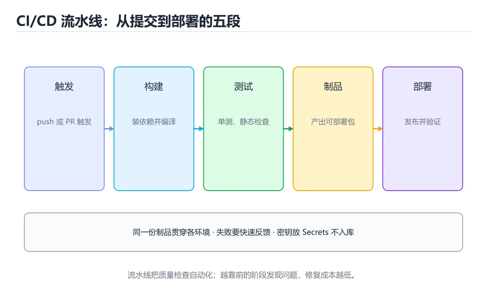
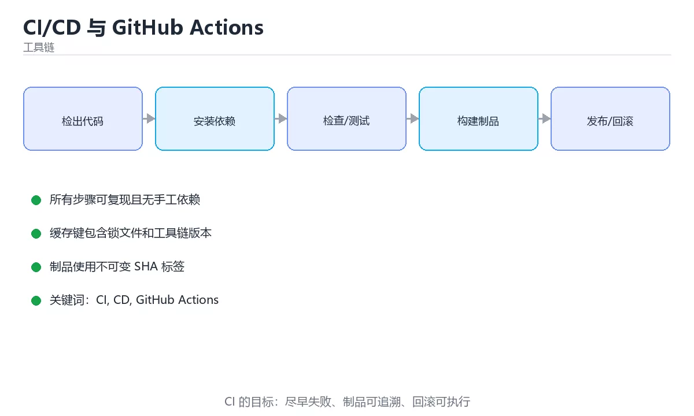

# CI/CD 与 GitHub Actions

> 内容更新时间：2026-10-06 · 学习阶段：进阶 · 预计用时：25 分钟





## 学习目标

- 能用自己的话解释CI/CD 与 GitHub Actions解决了什么问题，而不是只背术语。
- 能说清 「CI」、「CD」、「GitHub Actions」、「workflow」 之间的关系，并分别举出一个例子。
- 能把本课知识放回「工具链」的知识体系，说明它和相邻主题的边界。
- 能完成本课练习，并用验收标准检查自己的结果。

> 一句话摘要：流水线结构、缓存、密钥与构建部署实践。

## 前置知识

- 先完成上一课《Docker 容器基础》；如果已经掌握，可以直接用本课练习自测。
- 本课阶段：进阶。建议先掌握同一分类的基础课程，并能独立运行正文中的最小示例。
- 开始前先复习：CI、CD、GitHub Actions。
- 如果某一步看不懂，先记录具体卡点，完成练习后再回头读一遍。

## 持续集成与持续交付

- **CI（持续集成）**：每次提交自动构建 + 跑测试，尽早发现问题。
- **CD（持续交付/部署）**：流水线产出可发布版本，或自动部署到环境。

核心原则：**流水线要快、结果要可靠、失败要立刻可见**。

## GitHub Actions 基本结构

```yaml
name: CI
on:
  push:
    branches: [main]
  pull_request:
jobs:
  test:
    runs-on: ubuntu-latest
    steps:
      - uses: actions/checkout@v4
      - uses: actions/setup-node@v4
        with:
          node-version: 20
          cache: npm
      - run: npm ci
      - run: npm run lint
      - run: npm test -- --coverage
```

关键概念：

| 概念 | 说明 |
| --- | --- |
| workflow | `.github/workflows/*.yml` 定义的一条流水线 |
| job | 一组步骤，默认并行执行，可声明依赖 |
| step | 单个命令或 action |
| runner | 执行环境（GitHub 托管或自建） |
| secrets | 加密的敏感配置，如 `${{ secrets.TOKEN }}` |
| cache | 缓存依赖目录，显著缩短构建时间 |

## 构建与部署示例

```yaml
  build:
    needs: test
    runs-on: ubuntu-latest
    steps:
      - uses: actions/checkout@v4
      - run: docker build -t ghcr.io/${{ github.repository }}:${{ github.sha }} .
      - run: echo "${{ secrets.GITHUB_TOKEN }}" | docker login ghcr.io -u ${{ github.actor }} --password-stdin
      - run: docker push ghcr.io/${{ github.repository }}:${{ github.sha }}
```

生产部署建议使用**环境（environment）**加人工审批，并保留可回滚的镜像标签。

## 流水线设计建议

1. 先快后慢：lint 与单测在前，集成测试与打包在后。
2. 失败即停止，不要带病继续。
3. 构建产物只产出一次，各环境复用同一份（避免「测试的不是发布的那份」）。
4. 敏感信息只放 Secrets，绝不写进仓库。
5. 主分支保护：必须通过检查才能合并。

## 一份可直接用的完整 workflow

```yaml
name: CI
on:
  push: { branches: [main] }
  pull_request:
jobs:
  quality:
    runs-on: ubuntu-latest
    steps:
      - uses: actions/checkout@v4
      - uses: actions/setup-node@v4
        with:
          node-version: 20
          cache: npm                       # 自动缓存 npm 依赖
      - run: npm ci                        # 用 lock 文件安装，保证可复现
      - run: npm run lint
      - run: npx tsc --noEmit              # 类型检查（打包器不做）
      - run: npm test -- --coverage
      - uses: actions/upload-artifact@v4
        if: always()                       # 失败也保留覆盖率报告
        with: { name: coverage, path: coverage/ }

  build:
    needs: quality                         # 质量通过才构建
    runs-on: ubuntu-latest
    steps:
      - run: docker build -t app:${{ github.sha }} .
      - run: echo "${{ secrets.REGISTRY_TOKEN }}" | docker login -u ${{ github.actor }} --password-stdin
      - run: docker push app:${{ github.sha }}
```

要点：`npm ci` 与 lock 文件保证可复现；`needs` 建立阶段依赖；镜像用 `github.sha` 做不可变标签；密钥一律走 `secrets`。缓存依赖通常能让 CI 从数分钟压缩到一分钟内。

## 本课小结
CI/CD 把「人肉发布流程」变成可重复的自动化脚本；最小可用版本就是**检出代码 → 装依赖 → 跑测试 → 构建产物**。

## GitHub Actions 速查

| 概念 | 作用 | 示例 |
| --- | --- | --- |
| `on` | 触发条件 | `push`、`pull_request`、`schedule`、`workflow_dispatch` |
| `jobs` | 并行任务集合 | 测试、构建、部署各自一个 job |
| `needs` | 依赖关系 | `deploy` 依赖 `test` |
| `runs-on` | 运行环境 | `ubuntu-latest`、`windows-latest` |
| `steps` | 顺序步骤 | 每个 `run` 或 `uses` 一步 |
| `actions/checkout` | 拉取代码 | 必装第一步 |
| `actions/setup-node` | 安装语言环境 | 配合 `cache: npm` |
| `actions/cache` | 缓存依赖 | key 包含 lock 文件哈希 |
| `secrets` | 密钥 | 只注入环境变量，不落盘 |
| `matrix` | 多版本并行 | 一次跑 Node 18/20/22 |
| `concurrency` | 并发控制 | 同一分支只保留最新一次运行 |
| `if` | 条件执行 | `if: github.ref == 'refs/heads/main'` |
| `environment` | 部署环境 | 配置审批与环境保护规则 |
| `artifacts` | 传递产物 | `actions/upload-artifact` / `download-artifact` |

```yaml
name: ci
on:
  push: { branches: [main] }
  pull_request:

concurrency:
  group: ci-${{ github.ref }}
  cancel-in-progress: true

jobs:
  test:
    runs-on: ubuntu-latest
    strategy:
      matrix:
        node: [20, 22]
    steps:
      - uses: actions/checkout@v4
      - uses: actions/setup-node@v4
        with:
          node-version: ${{ matrix.node }}
          cache: npm
      - run: npm ci
      - run: npm run lint
      - run: npm test -- --coverage

  build:
    needs: test
    runs-on: ubuntu-latest
    steps:
      - run: npm ci && npm run build
      - uses: actions/upload-artifact@v4
        with:
          name: dist
          path: dist/
```

## 流水线设计速查

| 阶段 | 目标 | 建议 |
| --- | --- | --- |
| 快速反馈 | 秒级发现问题 | 先跑格式与 lint，再跑单元测试 |
| 构建 | 产出不可变制品 | 只构建一次，后续环境复用同一产物 |
| 集成测试 | 验证跨组件 | 用容器起依赖，测试可重复 |
| 安全扫描 | 依赖漏洞与密钥 | 依赖扫描、SAST、密钥扫描接入门禁 |
| 部署 | 灰度到全量 | 先 staging 再生产，带自动回滚条件 |
| 观测 | 部署后验证 | 关注错误率与关键业务指标 |

## 常见错误对照表

| 容易写错的做法 | 实际现象 | 原因与正确做法 |
| --- | --- | --- |
| 在 workflow 里打印 secrets | 日志泄漏密钥 | Actions 会自动打码，但仍禁止主动输出；用 `add-mask` 处理派生值 |
| 每个 job 重复构建 | 流水线时间长 | 构建一次，用 artifacts 传递产物 |
| 缓存 key 不含 lock 文件哈希 | 用到过期依赖 | key 用 `hashFiles('**/package-lock.json')` |
| `npm install` 代替 `npm ci` | 依赖版本漂移 | CI 中用 `npm ci` 保证可复现 |
| 未设置 `concurrency` | 同分支多次运行互相干扰 | 加并发组并取消旧运行 |
| 部署不等测试完成 | 带缺陷上线 | 用 `needs` 明确依赖 |
| 用 `pull_request_target` 跑不可信代码 | 严重安全风险 | 避免它对 PR 代码执行，或用最小权限 |
| 权限没限制 | 令牌权限过大 | 显式 `permissions: contents: read` |
| 用例偶发失败直接重试 | 掩盖真实问题 | 先定位不稳定原因，必要时隔离标记 |
| 只在 main 上测试 | 问题合并后才暴露 | PR 阶段就跑测试 |

## 自测清单

- [ ] PR 触发测试，合并前必须通过门禁。
- [ ] 构建一次，多环境复用同一制品。
- [ ] 依赖缓存 key 包含 lock 文件哈希。
- [ ] secrets 只通过环境变量注入，绝不写入日志。
- [ ] 部署配有健康检查与回滚条件。

## 动手练习

> 本课练习重点：围绕「CI、CD、GitHub Actions」完成复述、实验和交付，每个结果都要能被别人检查。

先在临时环境执行完整命令链，再模拟失败，最后验证回滚和清理。

### 练习 1：建立心智模型（10 分钟）

合上教程，用 3～5 句话回答：

1. CI/CD 与 GitHub Actions解决了什么问题？
2. 如果没有它，会出现什么具体后果？
3. 它和「CD」是什么关系？

**验收标准**：至少出现一个本课关键词，并写出一个反例、边界条件或失效场景。

### 练习 2：做一次可控实验（20 分钟）

从正文中选一个最小示例，完成以下操作：

1. 先预测修改一个参数、输入或步骤后的结果。
2. 再实际执行或逐步推演，记录真实结果。
3. 如果结果与预测不同，写出差异原因。

**验收标准**：留下「原例 → 改动 → 预测 → 结果 → 原因」五步记录。

### 练习 3：交付一个小结果（30 分钟）

在一个临时目录或本地仓库执行完整命令链，并记录失败时的回滚办法。

任务要求：

- 结果必须能被别人检查，不能只写“我已经理解了”。
- 至少覆盖「CI」和「CD」两个关键词。
- 写出 1 个仍然不确定的问题，以及下一步如何验证。

> 提示：时间有限时优先做练习 1 和练习 2；练习 3 可以拆成两次完成。

## 实践任务

本节围绕CI/CD 与 GitHub Actions安排 3 个可交付任务，每个任务都要求留下可以复查的记录。

### 任务 1：用自己的话画出结构

不看书，用一张图说清「CI/CD 与 GitHub Actions」的结构，画完再对照骨架：

- 主干：持续集成与持续交付 → GitHub Actions 基本结构 → 构建与部署示例 → 流水线设计建议
- 连接线：在每条边上标出输入、输出与失败路径。
- 自检：能否用一句话说明CI与CD的关系？

### 任务 2：做一次对比实验

**验收标准**：表格里两个方案的结论不能完全一样；写下“在什么条件下应该换方案”。

### 任务 3：迁移到自己的场景

**验收标准**：至少有一个可复现的命令、代码片段或数据样例；结论能被别人独立检查。

## 故障现场

### 现场 1：本课的 CI 常规用例通过，但边界用例失败

**症状**：在本课的练习或生产场景里出现“本课的 CI 常规用例通过，但边界用例失败”。

**复现**：准备一组最小输入，只保留触发“本课的 CI 常规用例通过，但边界用例失败”的必要条件，连续运行两次确认结果稳定。

**定位**：围绕“CI 的前置条件与取值边界没有写进代码，默认值掩盖了空值和极值”检查调用链、输入数据和环境配置，先验证假设再改代码。

**预防**：把“本课的 CI 常规用例通过，但边界用例失败”写成一条自动化用例，并在本课的验收清单里保留对应检查项。

### 现场 2：本课的 CD 结果在两次运行之间不一致

**症状**：在本课的练习或生产场景里出现“本课的 CD 结果在两次运行之间不一致”。

**复现**：准备一组最小输入，只保留触发“本课的 CD 结果在两次运行之间不一致”的必要条件，连续运行两次确认结果稳定。

**定位**：围绕“CD 依赖了当前版本、执行顺序或共享状态，单次运行无法暴露差异”检查调用链、输入数据和环境配置，先验证假设再改代码。

**预防**：把“本课的 CD 结果在两次运行之间不一致”写成一条自动化用例，并在本课的验收清单里保留对应检查项。

### 现场 3：本课的验证只在开发机通过

**症状**：在本课的练习或生产场景里出现“本课的验证只在开发机通过”。

**定位**：围绕“环境版本、配置和输入规模与目标环境不同，CI 缺少可重复的验证记录”检查调用链、输入数据和环境配置，先验证假设再改代码。

## 本课复习清单

离开本课前，逐项确认：

- [ ] 不看解析，能说出「持续集成（CI）的核心目的是？」的判断依据。
- [ ] 不看解析，能说出「GitHub Actions 中 secrets 用于？」的判断依据。
- [ ] 不看解析，能说出「job 中使用 needs 关键字的作用是？」的判断依据。
- [ ] 不看解析，能说出「CI 中配置依赖缓存的价值是？」的判断依据。
- [ ] 不看解析，能说出「把测试拆成多个并行 job 的代价是？」的判断依据。
- [ ] 不看解析，能说出的判断依据。
- [ ] 至少运行一次本课示例，记录输入、输出和一个边界情况。
- [ ] 把本课最容易混淆的两个概念写成一句话对照。

| 复盘项 | 记录 |
| --- | --- |
| 已经能独立解释的考点 |  |
| 仍然说不清的概念 |  |
| 下一步验证动作 |  |

## 术语速查

| 术语 | 本课语境 |
| --- | --- |
| `.github/workflows/*.yml` | \| workflow \| `.github/workflows/*.yml` 定义的一条流水线 \| |
| `${{ secrets.TOKEN }}` | \| secrets \| 加密的敏感配置，如 `${{ secrets.TOKEN }}` \| |
| `npm ci` | 要点：`npm ci` 与 lock 文件保证可复现；`needs` 建立阶段依赖；镜像用 `github.sha` 做不可变标签；密钥一律走 `secrets`。缓存依赖通常能让 CI 从数分钟压缩到一分钟内。 |
| `needs` | 要点：`npm ci` 与 lock 文件保证可复现；`needs` 建立阶段依赖；镜像用 `github.sha` 做不可变标签；密钥一律走 `secrets`。缓存依赖通常能让 CI 从数分钟压缩到一分钟内。 |
| `github.sha` | 要点：`npm ci` 与 lock 文件保证可复现；`needs` 建立阶段依赖；镜像用 `github.sha` 做不可变标签；密钥一律走 `secrets`。缓存依赖通常能让 CI 从数分钟压缩到一分钟内。 |
| `secrets` | 要点：`npm ci` 与 lock 文件保证可复现；`needs` 建立阶段依赖；镜像用 `github.sha` 做不可变标签；密钥一律走 `secrets`。缓存依赖通常能让 CI 从数分钟压缩到一分钟内。 |

## 考点精讲

### 考点 1：顺序排列·CI

- **题目**：按“CI/CD 与 GitHub Actions”中 CI、CD、GitHub Actions 的实践顺序，把四个步骤排成从准备到复盘的合理顺序。
- **判断依据**：在「CI/CD 与 GitHub Actions」里，在本课的练习里，顺序应当是：先明确 CI 的输入、输出与约束 → 写出最小示例并核对 CD 的基线结果 → 只改一个变量，记录边界与失败路径的变化 → 固定版本与证据，把本课的结论写成可复现记录。这个顺序把 CI 的输入、输出和约束放在最前面，在CI/CD 与 GitHub Actions里避免概念没对齐就开始调参。第二步用 CD 建立可核对的基线，在CI/CD 与 GitHub Actions里第三步才允许改变一个变量并观察失败路径。

### 考点 2：多选辨析·CI

- **题目**：围绕“CI/CD 与 GitHub Actions”中的 CI、CD、GitHub Actions，下列哪两项是本课强调的实践判断？
- **判断依据**：本课把CI/CD 与 GitHub Actions拆成概念、示例与故障现场三部分，因此判断 CI 时必须同时交代输入、输出和失败路径，这使“学习 CI 时要同时说明输入、输出和失败路径，不能只看正常流程”成立。在CI/CD 与 GitHub Actions里，判断 CD 时要固定版本与边界输入，所以“验证 CD 时要固定版本并覆盖边界输入，结论才可复现”才可复现。

### 考点 3：概念判断·CI

- **题目**：job 中使用 needs 关键字的作用是？
- **判断依据**：在「CI/CD 与 GitHub Actions」里，声明依赖的 job，等待其完成。needs 建立 job 之间的依赖顺序，例如测试通过后再构建部署。回到「CI/CD 与 GitHub Actions」的正文示例，用“job 中使用 needs 关键字的”走一遍CI、CD、GitHub Actions的完整流程，能复现的结论才可以保留。

### 考点 4：概念判断·CI

- **题目**：CI 中配置依赖缓存的价值是？
- **判断依据**：缓存键要包含锁文件哈希，依赖变更时自动失效，避免用到过期缓存。在「CI/CD 与 GitHub Actions」里，作答时，先用CI建立输入与输出的基线，再把复用已下载的依赖代入边界条件核对，结论才能复现。在「CI/CD 与 GitHub Actions」里，这道题要求区分概念与边界，「复用已下载的依赖」只有在题干给出的前提下才成立，而「提升测试覆盖率」、「减少代码体积」缺少同一组条件。

### 考点 5：概念判断·CI

- **题目**：把测试拆成多个并行 job 的代价是？
- **判断依据**：在「CI/CD 与 GitHub Actions」里，需要额外传递构建产物。并行度、缓存与制品传递策略共同决定流水线的总时长。「CI/CD 与 GitHub Actions」要求先交代CI、CD、GitHub Actions的前提再下结论，所以“需要额外传递构建产物”只在题干“把测试拆成多个并行 job 的代价是”给定的条件下成立。

### 考点 6：排错·CI

- **题目**：阅读「CI/CD 与 GitHub Actions」的代码片段，下面哪项判断是正确的？
- **判断依据**：在「CI/CD 与 GitHub Actions」里，每次提交自动构建与测试。CI 让问题在提交后几分钟内暴露，而不是等到发布前。「CI/CD 与 GitHub Actions」要求先交代CI、CD、GitHub Actions的前提再下结论，所以“每次提交自动构建与测试”只在题干“阅读CI/CD 与 GitHub Actions的代码片段”给定的条件下成立。

## English Overview

**Title:** CI/CD & GitHub Actions

**Summary:** Pipelines, caching, secrets and deployment.

**Category:** Toolchain
**Level:** 进阶
**Key terms:** CI, CD, GitHub Actions, workflow, secrets

## 内容元数据

- 内容版本：v2.0
- 最后更新：2026-10-06
- 学习阶段：进阶
- 适用环境：Git / Docker / Kubernetes / CI 平台
- 内容来源：内置结构化课程与工程实践整理
- 相关主题：CI、CD、GitHub Actions、workflow、secrets
- 质量版本：P0 测验标准 + P1 覆盖扩展 + P2 体验补全

## 参考资料与复核

- 最后复核：2026-10-04
- 下次复核：2027-04-04
- 复核范围：版本兼容、API 行为、安全建议与工程实践
- 来源性质：官方文档、标准或权威教材；正文为离线教学重组

| 参考资料 | 本课用途 |
| --- | --- |
| [GitHub Actions](https://docs.github.com/actions) | CI/CD 工作流 |
| [CMake 文档](https://cmake.org/documentation/) | 跨平台构建与依赖 |
| [Maven 指南](https://maven.apache.org/guides/) | Java 构建与依赖 |

> 「CI/CD 与 GitHub Actions」的链接用于离线阅读后的延伸核对；App 不会自动联网。
