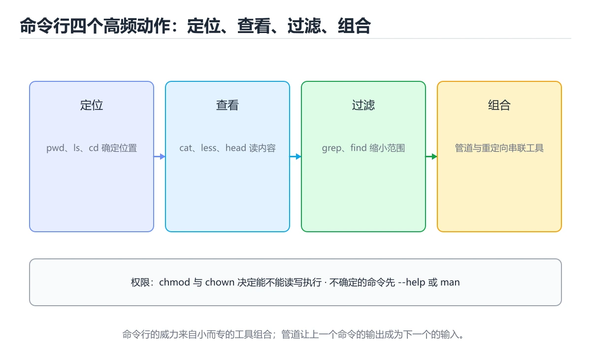
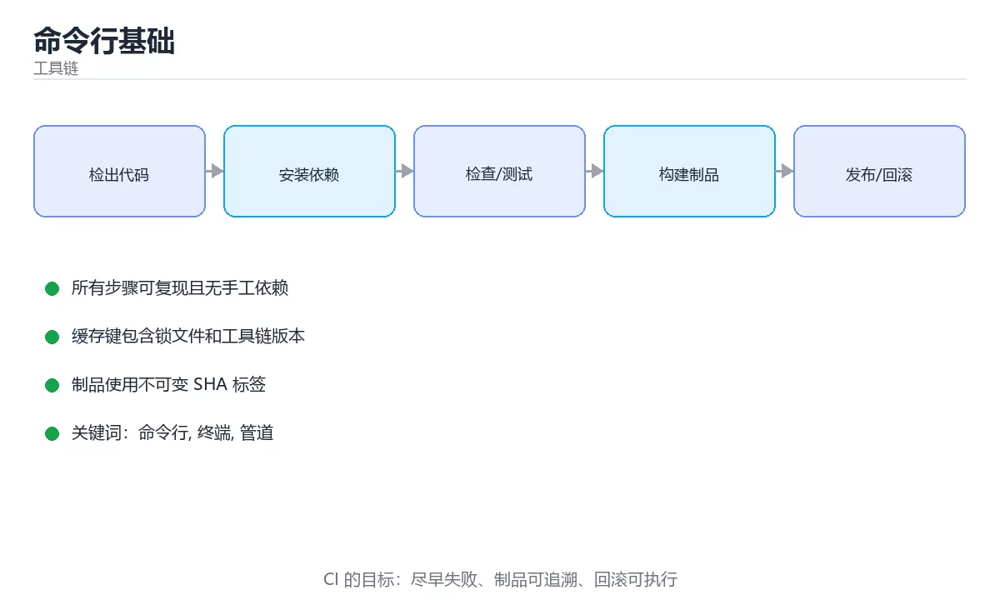

# 命令行基础





> 内容更新时间：2026-10-06 · 学习阶段：基础 · 预计用时：14 分钟

## 学习目标

- 能用自己的话解释命令行基础解决了什么问题，而不是只背术语。
- 能说清 「命令行」、「终端」、「管道」、「重定向」 之间的关系，并分别举出一个例子。
- 能把本课知识放回「工具链」的知识体系，说明它和相邻主题的边界。
- 能完成本课练习，并用验收标准检查自己的结果。

> 一句话摘要：文件操作、搜索、管道与重定向。

## 前置知识

- 先完成上一课《Git 版本控制》；如果已经掌握，可以直接用本课练习自测。
- 本课阶段：基础。建议会读写简单代码或命令，并理解变量、输入输出等基本概念。
- 开始前先复习：命令行、终端、管道。
- 如果某一步看不懂，先记录具体卡点，完成练习后再回头读一遍。

## 为什么要用命令行

命令行可以组合、可以脚本化、可以远程操作。很多开发工具（构建、部署、Git、容器）都以命令行为主要接口。

## 文件与目录

```bash
pwd                 # 显示当前目录
ls -al              # 列出文件（含隐藏文件与详细信息）
cd /path/to/dir     # 切换目录
cd ..               # 返回上一级
mkdir -p a/b/c      # 递归创建目录
cp source target    # 复制
mv old new          # 移动或重命名
rm -r dir           # 递归删除（谨慎使用）
```

Windows PowerShell 对应命令：

```powershell
Get-Location                    # 相当于 pwd
Get-ChildItem -Force            # 相当于 ls -al
New-Item -ItemType Directory -Force a\b\c
Copy-Item source target
Move-Item old new
Remove-Item -Recurse dir
```

## 查看与搜索

```bash
cat file.txt                    # 查看文件内容
less file.txt                   # 分页查看（q 退出）
head -n 20 file.txt             # 前 20 行
tail -f app.log                 # 实时跟踪日志

grep -rn "TODO" src/            # 递归搜索
find . -name "*.dart"           # 按文件名查找
```

推荐安装 `rg`（ripgrep）替代 `grep`，速度更快：

```bash
rg "class .*Provider" lib/
```

## 管道与重定向

```bash
ps aux | grep python            # 管道：把前一个命令的输出交给后一个
ls > files.txt                  # 覆盖写入
echo "log" >> app.log           # 追加写入
command 2>&1 | tee out.log      # 同时输出到屏幕和文件
```

## 权限

```bash
chmod +x script.sh              # 添加可执行权限
chmod 644 file.txt              # rw-r--r--
chown user:group file           # 修改所有者
```

权限数字含义：读 4、写 2、执行 1，三位分别对应所有者、组、其他用户。

## 组合起来解决实际问题

```bash
# 找出占用 8080 端口的进程并结束它
lsof -i :8080
kill -9 <PID>

# 统计代码行数
find . -name "*.dart" | xargs wc -l | tail -n 1
```

## 本课小结
命令行的核心是**小工具 + 管道组合**。先掌握导航、查看、搜索、管道四类命令，效率就会明显提升。

## 常用命令速查

| 目的 | 命令 |
| --- | --- |
| 查看目录内容 | `ls -lah` |
| 递归查找文件 | `find . -type f -name '*.log'` |
| 查找并执行 | `find . -name '*.tmp' -delete` |
| 按内容搜索 | `rg 'pattern' -n` 或 `grep -rn` |
| 查看文件 | `less +F app.log` |
| 查看磁盘占用 | `du -sh * \| sort -h` |
| 查看空间 | `df -hT` |
| 查看进程 | `ps aux \| head`、`pgrep -af app` |
| 查看端口 | `ss -tlnp` |
| 强制结束 | `kill -TERM <pid>`（先优雅，超时再 `-KILL`） |
| 权限 | `chmod 640 f`、`chown app:app f` |
| 打包压缩 | `tar -czf a.tgz dir/`、`tar -xzf a.tgz` |
| 网络请求 | `curl -fsSL -o out url` |
| 校验 | `sha256sum f`、`md5sum f` |

## 重定向与管道速查

| 写法 | 含义 |
| --- | --- |
| `>` | 覆盖写入文件 |
| `>>` | 追加写入 |
| `2>` | 重定向标准错误 |
| `&>` | 同时重定向标准输出与错误 |
| `\|` | 管道，前一命令输出作为后一命令输入 |
| `tee` | 同时写入文件与屏幕 |
| `xargs` | 把输入转换为命令行参数 |
| `$(...)` | 命令替换 |
| `<` | 从文件读入标准输入 |

```bash
# 安全删除：先校验变量与目标路径
target="/data/tmp"
[[ -n "$target" && "$target" != "/" ]] || { echo "目标不合法" >&2; exit 1; }
find "$target" -type f -name '*.tmp' -print -delete | wc -l

# 处理带空格的文件名
find . -name '*.log' -print0 | xargs -0 -n1 gzip

# 日志排查三段式：过滤、统计、定位
grep -c 'ERROR' app.log
awk '/ERROR/ {print $1}' app.log | sort | uniq -c | sort -nr | head
tail -n 200 app.log | grep -A2 -B2 'Exception'

# 批量重命名（先 dry-run 再执行）
for f in ./*.jpeg; do echo mv -- "$f" "${f%.jpeg}.jpg"; done
for f in ./*.jpeg; do mv -- "$f" "${f%.jpeg}.jpg"; done
```

## 常见错误对照表

| 容易踩的做法 | 实际现象 | 原因与正确做法 |
| --- | --- | --- |
| `rm -rf $dir/` 且变量为空 | 误删根目录 | 删除前断言变量非空且路径合法 |
| 变量不加引号 | 含空格路径被拆开 | 一律 `"$var"` |
| 用 `for f in $(ls)` | 文件名含空格出错 | 用通配符或 `find -print0` |
| `xargs` 不加 `-0` | 空格文件名被拆分 | 配合 `-print0` 与 `-0` |
| `cd` 失败后继续执行 | 在错误目录操作 | `cd -- "$dir" \|\| exit 1` |
| 直接 `kill -9` | 数据未落盘 | 先 `TERM`，超时再 `KILL` |
| 重定向覆盖重要文件 | 数据丢失 | 追加用 `>>`，重要文件先备份 |
| `>` 与 `\|` 混淆 | 命令行为不符 | 明确输出流向 |
| 忘记 `--` 分隔选项 | 以 `-` 开头的文件被当选项 | 用 `--` 结束选项解析 |
| 不检查退出码 | 失败被忽略 | 用 `$?`、`&&` 或 `set -e` |

## 自测清单

- [ ] 熟悉文件、进程、网络、权限四类常用命令。
- [ ] 处理含空格文件名时使用 `-print0` 与 `-0`。
- [ ] 删除操作前校验变量与路径。
- [ ] 停止进程先优雅后强制。
- [ ] 脚本检查退出码，避免失败被忽略。

## 动手练习

> 本课练习重点：围绕「命令行、终端、管道」完成复述、实验和交付，每个结果都要能被别人检查。

先在临时环境执行完整命令链，再模拟失败，最后验证回滚和清理。

### 练习 1：建立心智模型（10 分钟）

合上教程，用 3～5 句话回答：

1. 命令行基础解决了什么问题？
2. 如果没有它，会出现什么具体后果？
3. 它和「终端」是什么关系？

**验收标准**：至少出现一个本课关键词，并写出一个反例、边界条件或失效场景。

### 练习 2：做一次可控实验（20 分钟）

从正文中选一个最小示例，完成以下操作：

1. 先预测修改一个参数、输入或步骤后的结果。
2. 再实际执行或逐步推演，记录真实结果。
3. 如果结果与预测不同，写出差异原因。

**验收标准**：留下「原例 → 改动 → 预测 → 结果 → 原因」五步记录。

### 练习 3：交付一个小结果（30 分钟）

在一个临时目录或本地仓库执行完整命令链，并记录失败时的回滚办法。

任务要求：

- 结果必须能被别人检查，不能只写“我已经理解了”。
- 至少覆盖「命令行」和「终端」两个关键词。
- 写出 1 个仍然不确定的问题，以及下一步如何验证。

> 提示：时间有限时优先做练习 1 和练习 2；练习 3 可以拆成两次完成。

## 可运行练习

### 任务 1：先跑通，再解释

```bash
ps aux | grep python            # 管道：把前一个命令的输出交给后一个
ls > files.txt                  # 覆盖写入
echo "log" >> app.log           # 追加写入
command 2>&1 | tee out.log      # 同时输出到屏幕和文件
```

**预期输出**：log

### 任务 2：只改一个条件

把「命令行基础」的最小示例复制一份，只改一个条件再跑一次：

- 改动点：只把命令行的输入换成空值、极值或错误输入，其余保持不变。
- 预测：先写下「命令行基础」在改动后的输出或错误信息，再运行。
- 记录：对照改动前后的结果，指出差异出在哪一步。
- 验收：换回原条件能复现原结果，改动只影响命令行。

### 任务 3：迁移到自己的数据

用同一套思路处理一组你自己的数据或场景，保持输出格式与任务 1 一致。

## 故障现场

### 现场 1：本课的 命令行 常规用例通过，但边界用例失败

**症状**：在本课的练习或生产场景里出现“本课的 命令行 常规用例通过，但边界用例失败”。

**复现**：准备一组最小输入，只保留触发“本课的 命令行 常规用例通过，但边界用例失败”的必要条件，连续运行两次确认结果稳定。

**定位**：围绕“命令行 的前置条件与取值边界没有写进代码，默认值掩盖了空值和极值”检查调用链、输入数据和环境配置，先验证假设再改代码。

**预防**：把“本课的 命令行 常规用例通过，但边界用例失败”写成一条自动化用例，并在本课的验收清单里保留对应检查项。

### 现场 2：本课的 终端 结果在两次运行之间不一致

**症状**：在本课的练习或生产场景里出现“本课的 终端 结果在两次运行之间不一致”。

**复现**：准备一组最小输入，只保留触发“本课的 终端 结果在两次运行之间不一致”的必要条件，连续运行两次确认结果稳定。

**定位**：围绕“终端 依赖了当前版本、执行顺序或共享状态，单次运行无法暴露差异”检查调用链、输入数据和环境配置，先验证假设再改代码。

**预防**：把“本课的 终端 结果在两次运行之间不一致”写成一条自动化用例，并在本课的验收清单里保留对应检查项。

### 现场 3：本课的验证只在开发机通过

**症状**：在本课的练习或生产场景里出现“本课的验证只在开发机通过”。

**定位**：围绕“环境版本、配置和输入规模与目标环境不同，命令行 缺少可重复的验证记录”检查调用链、输入数据和环境配置，先验证假设再改代码。

## 本课复习清单

离开本课前，逐项确认：

- [ ] 不看解析，能说出「管道符 | 的作用是什么？」的判断依据。
- [ ] 不看解析，能说出「想在不覆盖原内容的前提下追加写入文件，应使用？」的判断依据。
- [ ] 不看解析，能说出「chmod 644 file.txt 设置出的权限是？」的判断依据。
- [ ] 不看解析，能说出「grep -r 与 grep -i 分别表示？」的判断依据。
- [ ] 不看解析，能说出「type 命令相比 which 的优势是？」的判断依据。
- [ ] 至少运行一次本课示例，记录输入、输出和一个边界情况。
- [ ] 把本课最容易混淆的两个概念写成一句话对照。

| 复盘项 | 记录 |
| --- | --- |
| 已经能独立解释的考点 |  |
| 仍然说不清的概念 |  |
| 下一步验证动作 |  |

## 术语速查

| 术语 | 本课语境 |
| --- | --- |
| `rg` | 推荐安装 `rg`（ripgrep）替代 `grep`，速度更快： |
| `grep` | 推荐安装 `rg`（ripgrep）替代 `grep`，速度更快： |
| `ls -lah` | \| 查看目录内容 \| `ls -lah` \| |
| `find . -type f -name '*.log'` | \| 递归查找文件 \| `find . -type f -name '*.log'` \| |
| `find . -name '*.tmp' -delete` | \| 查找并执行 \| `find . -name '*.tmp' -delete` \| |
| `rg 'pattern' -n` | \| 按内容搜索 \| `rg 'pattern' -n` 或 `grep -rn` \| |

## 考点精讲

### 考点 1：代码补全·命令行

- **题目**：阅读「命令行基础」正文里的这段代码代码，下面哪一项判断是正确的？
- **判断依据**：在「命令行基础」里，题干的正确项是这段代码会产生可观察的输出，运行后能看到结果，在「命令行基础」里要结合命令行核对输出是否符合预期。把输入或边界换成空值、极值或失败情况后，结论要以「命令行基础」的实际运行结果为准。把“这段代码会产生可观察的输出”代回「命令行基础」里“阅读命令行基础正文里的这段代码代码”的例子核对，条件一旦改变，结论就要用命令行、终端、管道重新推导。

### 考点 2：顺序排列·命令行

- **题目**：按“命令行基础”中 命令行、终端、管道 的实践顺序，把四个步骤排成从准备到复盘的合理顺序。
- **判断依据**：题干的正确项是固定版本与证据，把“命令行基础”的结论写成可复现记录。在「命令行基础」里，在本课的练习里，顺序应当是：先明确 命令行 的输入、输出与约束 → 写出最小示例并核对 终端 的基线结果 → 只改一个变量，记录边界与失败路径的变化 → 固定版本与证据，把本课的结论写成可复现记录。这个顺序把 命令行 的输入、输出和约束放在最前面，在命令行基础里避免概念没对齐就开始调参。第二步用 终端 建立可核对的基线，在命令行基础里第三步才允许改变一个变量并观察失败路径。

### 考点 3：概念判断·命令行

- **题目**：chmod 644 file.txt 设置出的权限是？
- **判断依据**：6 = 4+2（读写），4 = 只读，因此所有者可读写，组和其他用户只读。在「命令行基础」里，如果只凭关键词作答，很容易把「r--r--r--」、「rwxr-xr-x」与「rw-r--r--」混在一起；“chmod”与「命令行基础」的术语表相呼应，只有符合命令行、终端、管道约束的“rw-r--r--”才是正文支持的结论。

### 考点 4：概念判断·命令行

- **题目**：grep -r 与 grep -i 分别表示？
- **判断依据**：配合 -n 显示行号、-w 匹配整词，能快速定位代码中的符号。在「命令行基础」里，其他选项：两个选项作用并不相同：-r 递归搜索目录，-i 忽略大小写。在「命令行基础」里，这道题要求区分概念与边界，「-r 递归搜索目录，-i 忽略大小写」只有在题干给出的前提下才成立，而「都表示统计行数」、「-r 忽略大小写，-i 递归搜索」缺少同一组条件。

### 考点 5：概念判断·命令行

- **题目**：type 命令相比 which 的优势是？
- **判断依据**：在「命令行基础」里，type 能识别别名。排查「命令行为与预期不符」时，type -a 能看到同名命令的全部来源。这道题的关键在「命令行基础」的命令行、终端、管道：先确认题干“type 命令相比 which 的优”问的是哪一步，再排除偷换前提的选项。

### 考点 6：多选辨析·命令行

- **题目**：关于「命令行基础」，下列哪些说法是正确的？（多选）
- **判断依据**：在「命令行基础」里，题干的正确项是把前一个命令的输出作为后一个命令的输入。把“>>”代回「命令行基础」里“命令行基础”的例子核对，条件一旦改变，结论就要用命令行、终端、管道重新推导。这道题的关键在命令行、终端、管道：先确认题干“>>”问的是哪一步，再排除偷换前提的选项。“>>”是否可用，取决于命令行、终端、管道在题干条件下的表现，不能直接套用相邻结论。

## English Overview

**Title:** Command Line

**Summary:** Files, search, pipes and redirection.

**Category:** Toolchain
**Level:** 基础
**Key terms:** 命令行, 终端, 管道, 重定向, grep, chmod

## 内容元数据

- 内容版本：v2.0
- 最后更新：2026-10-06
- 学习阶段：基础
- 适用环境：Git / Docker / Kubernetes / CI 平台
- 内容来源：内置结构化课程与工程实践整理
- 相关主题：命令行、终端、管道、重定向、grep、chmod
- 质量版本：P0 测验标准 + P1 覆盖扩展 + P2 体验补全

## 参考资料与复核

- 最后复核：2026-10-04
- 下次复核：2027-04-04
- 复核范围：版本兼容、API 行为、安全建议与工程实践
- 来源性质：官方文档、标准或权威教材；正文为离线教学重组

| 参考资料 | 本课用途 |
| --- | --- |
| [CMake 文档](https://cmake.org/documentation/) | 跨平台构建与依赖 |
| [Docker 文档](https://docs.docker.com/) | 镜像、容器与网络 |
| [Gradle 文档](https://docs.gradle.org/current/userguide/userguide.html) | 构建脚本与插件 |

> 「命令行基础」的链接用于离线阅读后的延伸核对；App 不会自动联网。

## 复习与迁移

复习目标：把「命令行基础」的判断标准放回可复现的例子里。先自己作答，再对照依据；如果结论正确但理由不完整，回到正文补足前提。

### 概念复述

- 用一句话说明「命令行基础」解决什么问题：文件操作、搜索、管道与重定向。
- 写出命令行、终端、管道之间的关系，并各举一个例子。
- 说出本课最容易混淆的两个概念，以及区分它们的判据。

### 正文逐节复核

- **查看与搜索**：推荐安装 `rg`（ripgrep）替代 `grep`，速度更快：。

### 测验回顾

1. 阅读「命令行基础」正文里的这段代码代码，下面哪一项判断是正确的？
   - 依据：在「命令行基础」里，题干的正确项是这段代码会产生可观察的输出，运行后能看到结果，在「命令行基础」里要结合命令行核对输出是否符合预期。把输入或边界换成空值、极值或失败情况后，结论要以「命令行基础」的实际运行结果为准。把“这段代码会产生可观察的输出”代回「命令行基础」里“阅读命令行基础正文里的这段代码代码”的例子核对，条件一旦改变，结论就要用命令行、终端、管道重新推导。
2. 按“命令行基础”中 命令行、终端、管道 的实践顺序，把四个步骤排成从准备到复盘的合理顺序。
   - 依据：题干的正确项是固定版本与证据，把“命令行基础”的结论写成可复现记录。在「命令行基础」里，在本课的练习里，顺序应当是：先明确 命令行 的输入、输出与约束 → 写出最小示例并核对 终端 的基线结果 → 只改一个变量，记录边界与失败路径的变化 → 固定版本与证据，把本课的结论写成可复现记录。这个顺序把 命令行 的输入、输出和约束放在最前面，在命令行基础里避免概念没对齐就开始调参。第二步用 终端 建立可核对的基线，在命令行基础里第三步才允许改变一个变量并观察失败路径。
3. chmod 644 file.txt 设置出的权限是？
   - 依据：6 = 4+2（读写），4 = 只读，因此所有者可读写，组和其他用户只读。在「命令行基础」里，如果只凭关键词作答，很容易把「r--r--r--」、「rwxr-xr-x」与「rw-r--r--」混在一起；“chmod”与「命令行基础」的术语表相呼应，只有符合命令行、终端、管道约束的“rw-r--r--”才是正文支持的结论。
4. grep -r 与 grep -i 分别表示？
   - 依据：配合 -n 显示行号、-w 匹配整词，能快速定位代码中的符号。在「命令行基础」里，其他选项：两个选项作用并不相同：-r 递归搜索目录，-i 忽略大小写。在「命令行基础」里，这道题要求区分概念与边界，「-r 递归搜索目录，-i 忽略大小写」只有在题干给出的前提下才成立，而「都表示统计行数」、「-r 忽略大小写，-i 递归搜索」缺少同一组条件。
5. type 命令相比 which 的优势是？
   - 依据：在「命令行基础」里，type 能识别别名。排查「命令行为与预期不符」时，type -a 能看到同名命令的全部来源。这道题的关键在「命令行基础」的命令行、终端、管道：先确认题干“type 命令相比 which 的优”问的是哪一步，再排除偷换前提的选项。
6. 关于「命令行基础」，下列哪些说法是正确的？（多选）
   - 依据：在「命令行基础」里，题干的正确项是把前一个命令的输出作为后一个命令的输入。把“>>”代回「命令行基础」里“命令行基础”的例子核对，条件一旦改变，结论就要用命令行、终端、管道重新推导。这道题的关键在命令行、终端、管道：先确认题干“>>”问的是哪一步，再排除偷换前提的选项。“>>”是否可用，取决于命令行、终端、管道在题干条件下的表现，不能直接套用相邻结论。

### 迁移练习

把「命令行基础」的结论迁移到相邻主题，每次迁移都写清预测与证据：

1. 换输入：用命令行处理一组你自己的数据，对比教材示例的结果差异。
2. 换失败条件：制造一个终端相关的错误，说明如何从错误信息定位根因。
3. 换规模：把数据量或并发度提高一个数量级，说明「命令行基础」的结论是否仍成立。
