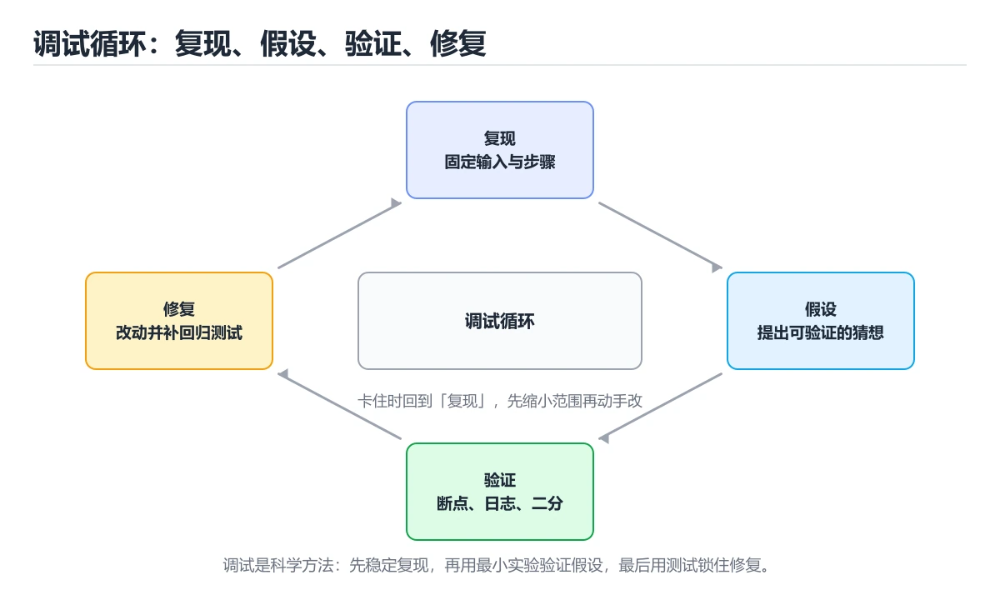
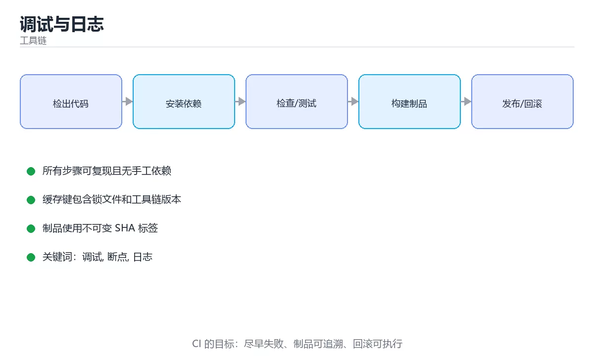

# 调试与日志





> 内容更新时间：2026-10-06 · 学习阶段：进阶 · 预计用时：30 分钟

## 学习目标

- 能用自己的话解释调试与日志解决了什么问题，而不是只背术语。
- 能说清 「调试」、「断点」、「日志」、「异常」 之间的关系，并分别举出一个例子。
- 能把 调试 放回「调试与日志」的知识体系，说明它和 断点 的边界。
- 能完成本课练习，并用验收标准检查自己的结果。

> 一句话摘要：复现、定位、假设、验证的调试循环。

## 前置知识

- 先完成上一课《命令行基础》；如果已经掌握，可以直接用本课练习自测。
- 本课阶段：进阶。建议先完成「命令行基础」，或确认自己能独立跑通正文里的 RangeError 示例。
- 开始前先复习：调试、断点、日志。
- 看不懂就直接缩小例子：只保留 调试 相关的两行输入，跑通后再加回其余部分。

## 调试的基本思路

调试不是「猜哪里错了」，而是一个假设—验证的循环：

1. **复现**：找到稳定触发问题的步骤。
2. **定位**：通过日志、断点、二分排查缩小范围。
3. **假设**：推断最可能的原因。
4. **验证**：修改后确认问题消失且未引入新问题。
5. **回归**：补一条测试，防止问题再次出现。

## 读异常信息

```text
Exception has occurred: RangeError (index)
Invalid value: Not in inclusive range 0..4: 10

  at main (package:demo/main.dart:12:20)
```

异常信息从下往上看调用链，从上往下看错误类型。这里说明访问了长度为 5 的列表中下标 10。

## 断点调试

在 VS Code / Android Studio 中：

- **行断点**：执行到该行暂停，查看变量。
- **条件断点**：满足条件才暂停，适合循环中的特定一轮。
- **日志断点**：不暂停，只打印表达式，避免反复改代码。
- **单步**：Step Over 跳过函数，Step Into 进入函数，Step Out 返回上层。

## 日志

```dart
import 'dart:developer' as developer;

void loadUser(String id) {
  developer.log('开始加载用户', name: 'user', error: null);
  try {
    // ...业务代码
  } catch (error, stackTrace) {
    developer.log(
      '加载用户失败',
      name: 'user',
      error: error,
      stackTrace: stackTrace,
    );
  }
}
```

日志要包含**上下文**（谁、什么参数）和**级别**。避免用 `print` 输出敏感信息，生产环境应关闭详细日志。

## 常见缺陷类型

| 类型 | 例子 |
| --- | --- |
| 边界错误 | 循环多执行一次、空列表未处理 |
| 空值错误 | 对象为 `null` 时直接调用方法 |
| 并发错误 | 共享数据未加锁 |
| 状态错误 | 界面状态与数据不一致 |
| 资源泄漏 | 未关闭文件、数据库连接 |

## 二分定位法

代码很长找不到问题源头时，可以在中间打印或注释掉一半逻辑，判断问题在前半段还是后半段，重复几次就能快速缩小范围。

## 本课小结

好的调试依赖三件事：**可复现的步骤、清晰的日志、可靠的测试**。

## 调试手段速查

| 手段 | 适用 | 说明 |
| --- | --- | --- |
| 断点 | 逻辑分支 | 逐行观察变量 |
| 条件断点 | 循环中特定情况 | 表达式为真才暂停 |
| 日志 | 生产环境 | 结构化、带追踪 ID |
| 二分定位 | 大范围改动 | 逐步缩小到具体变更 |
| 最小复现 | 复杂问题 | 剥离无关依赖 |
| 对比实验 | 环境差异 | 只改一个变量 |
| 抓包/追踪 | 跨服务问题 | 全链路观察 |
| 性能剖析 | 慢 | profiler 找热点 |
| 内存分析 | 泄漏 | 堆快照对比 |

## 日志设计速查

| 要点 | 做法 |
| --- | --- |
| 结构化 | JSON 或键值对，便于检索 |
| 级别 | ERROR、WARN、INFO、DEBUG 分级 |
| 追踪 | 每请求一个 trace ID 并全链路透传 |
| 上下文 | 记录关键参数与用户标识（脱敏） |
| 不记录 | 口令、令牌、身份证等敏感信息 |
| 采样 | 高频日志采样，避免成本失控 |
| 轮转 | 按大小与时间轮转并保留期限 |

```python
import bisect
import logging
import uuid
from contextlib import contextmanager

logging.basicConfig(
    level=logging.INFO,
    format="%(asctime)s %(levelname)s trace=%(trace_id)s %(message)s",
)

@contextmanager
def log_context(**fields):
    """给一次操作绑定 trace id 与上下文，便于全链路检索。"""
    logger = logging.LoggerAdapter(
        logging.getLogger("app"),
        {"trace_id": fields.pop("trace_id", uuid.uuid4().hex[:8]), **fields},
    )
    try:
        yield logger
    except Exception:
        logger.exception("操作失败")
        raise

def bisect_change(items: list, is_bad) -> int:
    """二分定位：找出第一个判定为「坏」的提交或输入。"""
    low, high = 0, len(items)
    while low < high:
        mid = (low + high) // 2
        if is_bad(items[mid]):
            high = mid
        else:
            low = mid + 1
    return low

def minimal_repro(cases: list, reproduces) -> list:
    """最小复现：逐项剔除仍能复现的输入。"""
    result = list(cases)
    index = 0
    while index < len(result):
        candidate = result[:index] + result[index + 1:]
        if candidate and reproduces(candidate):
            result = candidate
        else:
            index += 1
    return result

with log_context(request_id="r-1") as log:
    log.info("开始处理")

print(bisect_change([1, 2, 3, 4, 5], lambda x: x >= 4))
print(minimal_repro([1, 2, 3, 4], lambda c: 4 in c))
```

## 常见错误与排查

| 容易踩的做法 | 实际现象 | 原因与正确做法 |
| --- | --- | --- |
| 靠猜改代码 | 问题反复出现 | 先复现，再定位，最后修复 |
| 一次改多处 | 无法归因 | 一次只改一个变量 |
| 只看报错最后一行 | 漏掉根因 | 从最底层 `Caused by` 看起 |
| 日志无追踪 ID | 跨服务无法串起来 | 全链路透传 trace ID |
| 日志打印敏感信息 | 泄漏 | 脱敏并禁止记录凭证 |
| 用 `print` 调试生产 | 无法检索与轮转 | 用日志框架分级输出 |
| 生产开启 DEBUG | 磁盘与性能受影响 | 按需动态调整级别 |
| 忽略时间同步 | 时序错乱 | 统一 NTP 与时区 |
| 只修症状不修根因 | 同类问题再发 | 找到根因并加回归测试 |
| 不复盘不沉淀 | 重复排查 | 记 runbook 与自动化脚本 |

## 复习与自测

- [ ] 调试遵循「复现、定位、修复、验证、沉淀」流程。
- [ ] 日志结构化并带 trace ID，敏感信息脱敏。
- [ ] 会用二分定位与最小复现缩小范围。
- [ ] 生产环境按需调整日志级别并做好轮转。
- [ ] 每次问题都沉淀为文档或自动化脚本。

## 动手练习

> 本课练习重点：围绕「调试、断点、日志」完成复述、实验和交付，每个结果都要能被别人检查。

把 RangeError 的部署命令在临时环境跑通，再注入一次失败。

### 练习 1：建立心智模型（10 分钟）

合上教程，用 3～5 句话回答：

1. 调试与日志解决了什么问题？
2. 如果没有它，会出现什么具体后果？
3. 它和「断点」是什么关系？

验收标准：回答里必须出现 调试，并写出一个让结论失效的边界条件。

### 练习 2：做一次可控实验（20 分钟）

从正文中选一个最小示例，完成以下操作：

1. 先预测修改一个参数、输入或步骤后的结果。
2. 再实际执行或逐步推演，记录真实结果。
3. 如果结果与预测不同，写出差异原因。

**验收标准**：先原样跑通正文里的 `RangeError`，再只改调试相关的输入，按「原例 → 改动 → 预测 → 结果 → 原因」记录；预测必须写在实际运行之前。

### 练习 3：交付一个小结果（30 分钟）

先记录 断点 的失败回滚步骤，再执行变更。

任务要求：

- 结果必须能被别人检查，不能只写“我已经理解了”。
- 至少覆盖「调试」和「断点」两个关键词。
- 写出 1 个仍然不确定的问题，以及下一步如何验证。

> 提示：时间有限时优先做练习 1 和练习 2；练习 3 可以拆成两次完成。

## 可运行练习

### 任务 1：先跑通，再解释

```python
import bisect
import logging
import uuid
from contextlib import contextmanager

logging.basicConfig(
    level=logging.INFO,
    format="%(asctime)s %(levelname)s trace=%(trace_id)s %(message)s",
)

@contextmanager
def log_context(**fields):
    """给一次操作绑定 trace id 与上下文，便于全链路检索。"""
    logger = logging.LoggerAdapter(
        logging.getLogger("app"),
        {"trace_id": fields.pop("trace_id", uuid.uuid4().hex[:8]), **fields},
    )
    try:
        yield logger
    except Exception:
        logger.exception("操作失败")
        raise

def bisect_change(items: list, is_bad) -> int:
    """二分定位：找出第一个判定为「坏」的提交或输入。"""
    low, high = 0, len(items)
    while low < high:
        mid = (low + high) // 2
        if is_bad(items[mid]):
            high = mid
        else:
            low = mid + 1
    return low

def minimal_repro(cases: list, reproduces) -> list:
    """最小复现：逐项剔除仍能复现的输入。"""
    result = list(cases)
    index = 0
    while index < len(result):
        candidate = result[:index] + result[index + 1:]
        if candidate and reproduces(candidate):
            result = candidate
        else:
            index += 1
    return result

with log_context(request_id="r-1") as log:
    log.info("开始处理")

print(bisect_change([1, 2, 3, 4, 5], lambda x: x >= 4))
print(minimal_repro([1, 2, 3, 4], lambda c: 4 in c))
```

### 任务 2：只改一个条件

把「调试与日志」的最小示例复制一份，只改一个条件再跑一次：

- 改动点：只调整 RangeError 的一个参数，其余条件一律不动。
- 预测：先写下「调试与日志」在改动后的输出或错误信息，再运行。
- 记录：对照改动前后的结果，指出差异出在哪一步。
- 验收：换回原条件能复现原结果，改动只影响调试。

### 任务 3：迁移到自己的数据

把 RangeError 换成你自己的输入，先保持步骤不变，再比较输出差异。

## 故障现场

### 现场 1：日志无追踪 ID

**症状**：在《调试与日志》的复现场景中，跨服务无法串起来。

**根因**：触发点是把“日志无追踪 ID”当成安全做法。它没有满足《调试与日志》要求的前提，因此先表现为“跨服务无法串起来”；排查时先完整复现这一段，再核对输入、配置与依赖。

**修复**：针对《调试与日志》的问题，全链路透传 trace ID。

**验证**：保留《调试与日志》里触发“跨服务无法串起来”的输入、版本和日志，按“全链路透传 trace ID”完成修改后原样重放；只有失败现象消失且相邻场景仍可解释，才保留改动。

### 现场 2：用 print 调试生产

**症状**：在《调试与日志》的复现场景中，无法检索与轮转。

**根因**：“无法检索与轮转”只是表层结果。向上追溯会落到“用 print 调试生产”这一步，因为它省略了《调试与日志》的约束，使实现行为和预期模型发生了偏离。

**修复**：针对《调试与日志》的问题，用日志框架分级输出。

**验证**：在《调试与日志》中按“用日志框架分级输出”调整后，从“用 print 调试生产”的触发条件重放同一条路径，确认“无法检索与轮转”不再出现，并补一个相邻边界用例检查没有引入新问题。

### 现场 3：生产开启 DEBUG

**症状**：在《调试与日志》的复现场景中，磁盘与性能受影响。

**根因**：触发点是把“生产开启 DEBUG”当成安全做法。它没有满足《调试与日志》要求的前提，因此先表现为“磁盘与性能受影响”；排查时先完整复现这一段，再核对输入、配置与依赖。

**修复**：针对《调试与日志》的问题，按需动态调整级别。

**验证**：保留《调试与日志》里触发“磁盘与性能受影响”的输入、版本和日志，按“按需动态调整级别”完成修改后原样重放；只有失败现象消失且相邻场景仍可解释，才保留改动。

## 本课复习清单

离开本课前，逐项确认：

- [ ] 不看解析，能说出「条件断点的典型用途是？」的判断依据。
- [ ] 不看解析，能说出「一条好的日志通常应该包含什么？」的判断依据。
- [ ] 不看解析，能说出「代码很长时，二分定位法的核心思路是？」的判断依据。
- [ ] 不看解析，能说出「在日志中带上请求 ID（trace id）的价值是？」的判断依据。
- [ ] 不看解析，能说出「阅读异常堆栈时应优先关注哪一部分？」的判断依据。
- [ ] 至少运行一次 RangeError 的示例，记录输入、输出和 调试 的边界情况。
- [ ] 把本课最容易混淆的两个概念写成一句话对照。

| 复盘项 | 记录 |
| --- | --- |
| 已经能独立解释的考点 |  |
| 仍然说不清的概念 |  |
| 下一步验证动作 |  |

## 术语速查

| 术语 | 一句话说明 |
| --- | --- |
| `断点` | 让程序在指定位置暂停，便于查看当时的变量与调用栈。 |
| `日志分级` | 按 DEBUG、INFO、WARN、ERROR 输出，线上通常只保留后几级。 |
| `异常与堆栈` | 堆栈记录异常发生时的调用链，是定位根因的第一手线索。 |
| `二分定位` | 通过注释或开关逐步缩小范围，快速锁定引入问题的那次改动。 |
| `最小复现` | 把问题压缩成最短的、可稳定触发的例子，再着手修复。 |

## 零基础精讲：把调试与日志真正讲透

### 先建立一个直觉

把工具链看成自动化生产线：输入经过解析、检查、构建、测试和发布，任何一步失败都应该阻止有问题的产物继续前进。
落到本课，「调试与日志」关心的是 调试 与 断点 的配合，也就是说这条直觉要在 调试的基本思路 里被具体验证。

本课的摘要可以当作一张地图：复现、定位、假设、验证的调试循环。

### 逐步拆解

1. 澄清输入与目标。先写清「调试与日志」要解决的问题、合法输入范围和成功标准，再进入后续步骤。
2. 描述处理过程。把「调试、断点、日志、异常、二分定位、测试」映射到具体步骤，每步都要求能单独验证。
3. 定义输出。调试 的输出不仅包括正常结果，还包括错误码、日志和资源释放状态。
4. 构造一次调试越界，记录系统是拒绝、降级还是静默出错；三者对应的修复策略完全不同。
5. 用 RangeError 构造一个最小反例，证明「调试与日志」的结论有边界。

### 把正文串成一条执行链

- **练习 1：建立心智模型（10 分钟）**：在「调试与日志」里，「练习 1：建立心智模型（10 分钟）」这一步要先写清输入与预期，再记录实际结果和差异；结果不符时回到对应小节核对前提。
- **练习 2：做一次可控实验（20 分钟）**：在「调试与日志」里，「练习 2：做一次可控实验（20 分钟）」这一步要先写清输入与预期，再记录实际结果和差异；结果不符时回到对应小节核对前提。
- **练习 3：交付一个小结果（30 分钟）**：在「调试与日志」里，「练习 3：交付一个小结果（30 分钟）」这一步要先写清输入与预期，再记录实际结果和差异；结果不符时回到对应小节核对前提。
- **考点 1：条件断点的典型用途是？**：针对「调试与日志」，先自问「条件断点的典型用途是」；作答后回到对应考点核对判断依据。
- **考点 2：一条好的日志通常应该包含什么？**：针对「调试与日志」，先自问「一条好的日志通常应该包含什么」；作答后回到对应考点核对判断依据。
- **考点 3：代码很长时，二分定位法的核心思路是？**：针对「调试与日志」，先自问「代码很长时，二分定位法的核心思路是」；作答后回到对应考点核对判断依据。

### 从测验反推易错点

**检查点 1：条件断点的典型用途是？**

- 参考判断：只在满足特定条件时暂停
- 自问：如果去掉题干里的一个限定词，结论还成立吗？

**检查点 2：一条好的日志通常应该包含什么？**

- 参考判断：上下文信息与日志级别

**检查点 3：代码很长时，二分定位法的核心思路是？**

- 参考判断：每次排除一半范围，逐步缩小问题区域

**检查点 4：在日志中带上请求 ID（trace id）的价值是？**

- 参考判断：串联同一次请求在不同服务与线程中的日志，便于还原完整链路

**检查点 5：阅读异常堆栈时应优先关注哪一部分？**

- 参考判断：最底部的 Caused by 根因，以及第一个出现的业务代码帧

### 工程排错顺序

| 先查什么 | 要得到的证据 | 判断标准 |
| --- | --- | --- |
| 本地与 CI 使用同一命令吗？ | 日志、输入样例、测试或指标 | 能复现并解释，才算定位 |
| 失败是否阻止发布并保留日志？ | 日志、输入样例、测试或指标 | 能复现并解释，才算定位 |
| 缓存是否会污染结果？ | 日志、输入样例、测试或指标 | 能复现并解释，才算定位 |
| 构建产物能否复现与校验？ | 日志、输入样例、测试或指标 | 能复现并解释，才算定位 |

### 变式训练

1. 先用一个单文件示例验证 RangeError，确认正确性后再引入框架或分布式组件。
2. 把 调试 的输入规模扩大十倍，记录时间、内存和失败路径，找出第一个瓶颈。
3. 让 RangeError 的外部依赖超时，确认系统能回滚或补偿，而不是留下脏数据。
5. 故意跳过 断点 的检查再运行，比较与正常流程的差异，并说明这个检查挡住的到底是哪一类失败。
6. 在低带宽或低算力条件下重跑 断点，记录降级路径是否仍然可用。

### 本课自测

- [ ] 能用一句话解释「调试」在本课中的角色与边界。
- [ ] 能举出一个正常例子和一个失败例子。
- [ ] 能说出最小验证步骤，以及需要记录的证据。
- [ ] 能用一句话解释「断点」在本课中的角色与边界。
- [ ] 能用一句话解释「日志」在本课中的角色与边界。
- [ ] 能用一句话解释「异常」在本课中的角色与边界。
- [ ] 能用一句话解释「二分定位」在本课中的角色与边界。

### 迁移案例库

下面用不同约束重复同一套方法，每轮只改变 调试 的一个取值并记录结论。

#### 迁移案例 1：围绕「调试」做一次小实验

**目标**：在不改变课程主体的前提下，验证调试与日志中的一个关键判断。

**步骤**：
1. 复述当前方案对「调试」的假设，写成一句可证伪的话。
2. 设计一个正常输入和一个边界输入，分别预测输出。
3. 运行或逐步演算，记录实际输出、耗时和失败信息。
4. 只调整一个参数，比较前后差异并解释原因。
5. 补充一条测试或复习卡，确保下次能更快复现。

**验收**：结论要能追溯到正文的具体小节与代码位置，并记录断点相关的指标变化。

#### 迁移案例 2：围绕「断点」做一次小实验

**步骤**：
1. 复述当前方案对「断点」的假设，写成一句可证伪的话。

#### 迁移案例 3：围绕「日志」做一次小实验

**步骤**：
1. 复述当前方案对「日志」的假设，写成一句可证伪的话。

#### 迁移案例 4：围绕「异常」做一次小实验

**步骤**：
1. 复述当前方案对「异常」的假设，写成一句可证伪的话。

#### 迁移案例 5：围绕「二分定位」做一次小实验

**步骤**：
1. 复述当前方案对「二分定位」的假设，写成一句可证伪的话。

#### 迁移案例 6：围绕「测试」做一次小实验

**步骤**：
1. 复述当前方案对「测试」的假设，写成一句可证伪的话。

#### 迁移案例 7：围绕「调试」做一次小实验

**步骤**：

#### 迁移案例 8：围绕「断点」做一次小实验

**步骤**：

#### 迁移案例 9：围绕「日志」做一次小实验

**步骤**：

#### 迁移案例 10：围绕「异常」做一次小实验

**步骤**：

#### 迁移案例 11：围绕「二分定位」做一次小实验

**步骤**：

#### 迁移案例 12：围绕「测试」做一次小实验

**步骤**：

#### 迁移案例 13：围绕「调试」做一次小实验

**步骤**：

#### 迁移案例 14：围绕「断点」做一次小实验

**步骤**：

#### 迁移案例 15：围绕「日志」做一次小实验

**步骤**：

#### 迁移案例 16：围绕「异常」做一次小实验

**步骤**：

<!-- p0-depth-v2:end -->

## 考点精讲

### 考点 1：概念判断·调试

- **题目**：条件断点的典型用途是？
- **判断依据**：在「调试与日志」里，只在满足特定条件时暂停。条件断点只在表达式为真时暂停，适合调试循环中的特定一轮或特定输入。回到「调试与日志」的正文示例，用“条件断点的典型用途是”走一遍调试、断点、日志的完整流程，能复现的结论才可以保留。在「调试与日志」里，回到调试、断点、日志本身再看一遍：只有“只在满足特定条件时暂停”与题干“条件断点的典型用途是”的前提一致，结论才成立。

### 考点 2：多选辨析·调试

- **题目**：围绕“调试与日志”中的 调试、断点、日志，下列哪两项是本课强调的实践判断？
- **判断依据**：本课把调试与日志拆成概念、示例与故障现场三部分，因此判断 调试 时必须同时交代输入、输出和失败路径，这使“学习 调试 时要同时说明输入、输出和失败路径，不能只看正常流程”成立。在调试与日志里，判断 断点 时要固定版本与边界输入，所以“验证 断点 时要固定版本并覆盖边界输入，结论才可复现”才可复现。

### 考点 3：代码补全·调试

- **题目**：这段代码是「调试与日志」的示例片段，下面哪一项描述与它一致？
- **判断依据**：在「调试与日志」里，题干的正确项是这段代码把主要逻辑封装在函数或方法里，需要被调用才会执行，在「调试与日志」里封装边界决定调试从哪一步开始生效。把输入或边界换成空值、极值或失败情况后，结论要以「调试与日志」的实际运行结果为准。回到「调试与日志」的正文示例，用“这段代码是调试与日志的示例片段”走一遍调试、断点、日志的完整流程，能复现的结论才可以保留。

### 考点 4：概念判断·调试

- **题目**：在日志中带上请求 ID（trace id）的价值是？
- **判断依据**：在「调试与日志」里，结论应落在「串联同一次请求在不同服务与线程中的日志，便于还原完整链路」。结论应落在串联同一次请求在不同服务与线程中的日志。它也是链路追踪的基础，排查跨服务问题几乎离不开它。在「调试与日志」里，这道题要求区分概念与边界，「串联同一次请求在不同服务与线程中的日志，便于还原完整链路」只有在题干给出的前提下才成立，而「减少日志体积，但这会让包体更大，同时这会带来额外的维护成本」、「提升吞吐量」缺少同一组条件。

### 考点 5：概念判断·调试

- **题目**：阅读异常堆栈时应优先关注哪一部分？
- **判断依据**：在「调试与日志」里，最底部的 Caused by 根因，以及第一个出现的业务代码帧。框架堆栈往往只是传播路径，根因通常在最后一层 Caused by。回到「调试与日志」的正文示例，用“阅读异常堆栈时应优先关注哪一部分”走一遍调试、断点、日志的完整流程，能复现的结论才可以保留。

### 考点 6：填空·level=____.INFO,

- **题目**：补全代码：「调试与日志」示例中，下面这行代码缺少哪个关键字或函数名？请填入 ____。 `level=____.INFO,`
- **判断依据**：在「调试与日志」里，logging。回到「调试与日志」的正文示例，用“补全代码”走一遍调试、断点、日志的完整流程，能复现的结论才可以保留。回到调试、断点、日志本身再看一遍：只有“logging”与题干“logging”的前提一致，结论才成立。

## English Overview

**Title:** Debugging & Logging

**Summary:** The reproduce-locate-hypothesize-verify loop.

**Category:** Toolchain
**Level:** 进阶
**Key terms:** 调试, 断点, 日志, 异常, 二分定位, 测试

## 内容元数据

- 内容版本：v2.0
- 最后更新：2026-10-06
- 学习阶段：进阶
- 适用环境：Git / Docker / Kubernetes / CI 平台
；本课聚焦 调试。
- 内容来源：内置结构化课程与工程实践整理
- 相关主题：调试、断点、日志、异常、二分定位、测试
- 质量版本：P0 测验标准 + P1 覆盖扩展 + P2 体验补全

## 参考资料与复核

- 最后复核：2026-10-04
- 下次复核：2027-08-17
- 复核范围：版本兼容、API 行为、安全建议与工程实践
- 来源性质：官方文档、标准或权威教材；正文为离线教学重组

| 参考资料 | 本课用途 |
| --- | --- |
| [CMake 文档](https://cmake.org/documentation/) | 跨平台构建与依赖 |
| [Docker 文档](https://docs.docker.com/) | 镜像、容器与网络 |
| [npm 文档](https://docs.npmjs.com/) | JavaScript 包管理 |

> 「调试与日志」的链接用于离线阅读后的延伸核对；App 不会自动联网。
