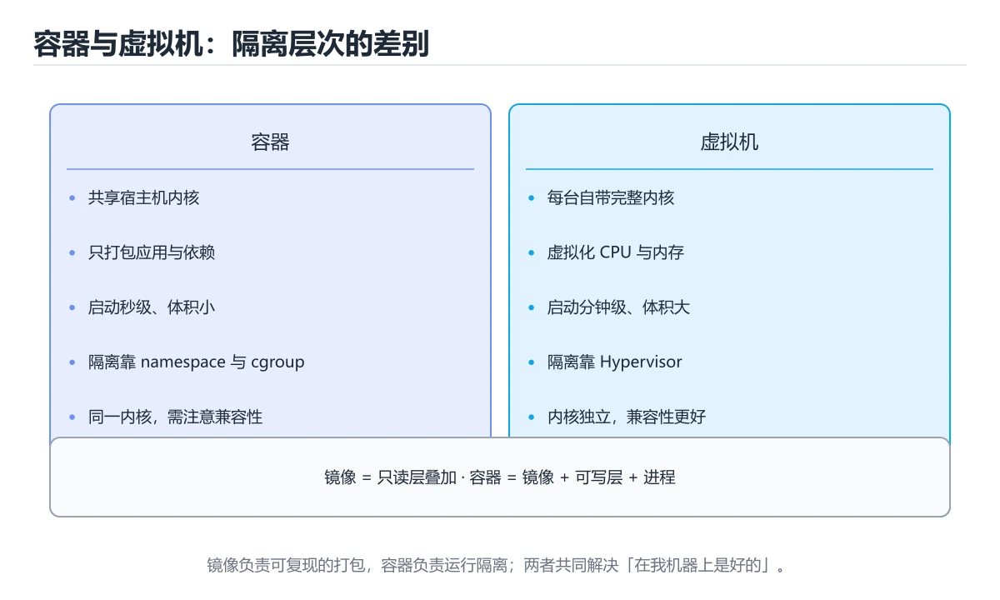
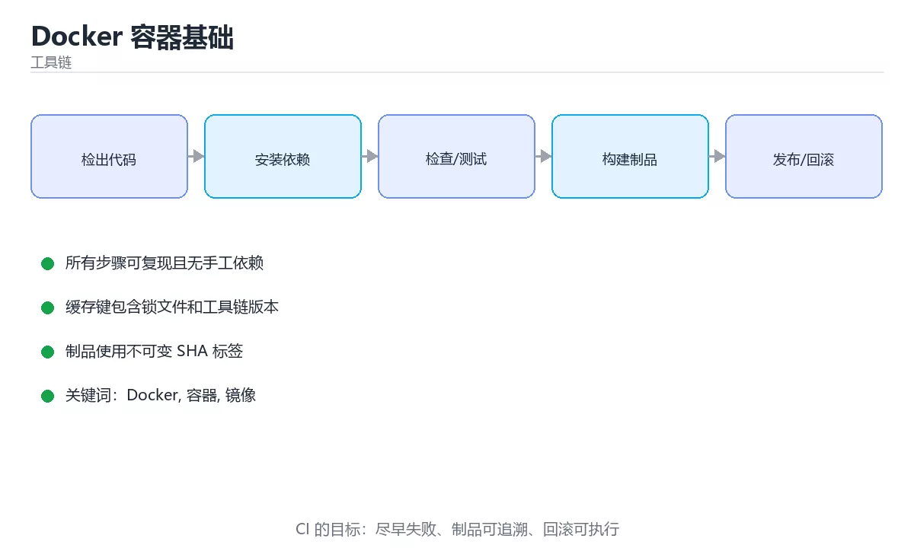

# Docker 容器基础

> 内容更新时间：2026-10-06 · 学习阶段：进阶 · 预计用时：40 分钟





## 本节知识框架

**课程定位**：所属分类为「工具链」，课程主题为「Docker 容器基础」，学习阶段为「进阶」，建议用时 40 分钟。

**本课要解决的主问题**：镜像、容器、Dockerfile 与数据卷。

| 学习层次 | 要回答的问题 | 完成判据 |
| --- | --- | --- |
| 概念层 | 「Docker 容器基础」有哪些必须区分的对象与术语？ | 能用自己的话定义核心术语，并各举一个正例和一个反例。 |
| 机制层 | 这些对象按什么顺序发生作用，输入如何变成输出？ | 能画出或写出机制步骤，并说明每一步的失败条件。 |
| 应用层 | 什么场景适合使用「Docker 容器基础」，什么场景不适合？ | 能给出一个真实场景、一个最小示例和一个边界案例。 |
| 性能层 | 时间、空间、吞吐或延迟受哪些量影响？ | 能说出复杂度或性能瓶颈的证据来源；没有证据时明确写“材料未提供”。 |
| 复习层 | 怎样确认自己不是只记住了结论？ | 能独立完成本课自测，并把错误定位到概念、机制、示例或边界。 |

### 阅读路线

1. 先读「核心概念定义」，建立「Docker」等对象的精确定义。
2. 再读「原理与运行机制」，把定义串成可重复的过程。
3. 用「代码/协议/SQL 示例」验证过程，并只改一个条件观察结果变化。
4. 最后检查性能、易错点、知识关系与自测题，形成可复习的证据链。

**前置知识**：《调试与日志》

**学习位置**：本课位于《调试与日志》之后；如果前一课的自测不能通过，应先回补再继续。

**后续衔接**：下一课《CI/CD 与 GitHub Actions》会继续使用本课术语，学完后建议立即完成一次自测。

**教材衔接：学习目标**

- 能用自己的话解释Docker 容器基础解决了什么问题，而不是只背术语。
- 能说清 「Docker」、「容器」、「镜像」、「Dockerfile」 之间的关系，并分别举出一个例子。
- 能把 Docker 放回「Docker 容器基础」的知识体系，说明它和 容器 的边界。
- 能完成本课练习，并用验收标准检查自己的结果。

> 一句话摘要：镜像、容器、Dockerfile 与数据卷。

**教材衔接：前置知识**

- 先完成上一课《调试与日志》；如果已经掌握，可以直接用本课练习自测。
- 本课阶段：进阶。建议先完成「调试与日志」，或确认自己能独立跑通正文里的 WORKDIR 示例。
- 开始前先复习：Docker、容器、镜像。
- 卡在 Docker 上时不要跳过：把输入、预期和实际输出写成三行，再回头读正文。

**教材衔接：本课小结**

Docker 的三件套是**镜像（怎么打包）、容器（怎么运行）、卷与网络（数据与通信）**；配合 Compose 可以一条命令启动多容器应用。

## 核心概念定义

> 在阅读《Docker 容器基础》时，术语第一次出现先给操作性定义，再给边界；正文说法与这里冲突时，以定义和可复现示例为准。

| 术语 | 操作性定义 | 本课中的边界 |
| --- | --- | --- |
| .dockerignore | 用 .dockerignore 排除 node_modules、.git、构建产物。 | 仅在「Docker 容器基础」明确给出的输入、版本与资源条件下成立。 |
| USER | 容器内不要用 root 运行，加 USER 指令。 | 仅在「Docker 容器基础」明确给出的输入、版本与资源条件下成立。 |
| COPY . . | 反例：先 COPY . . 再 npm install，任何一次源码改动都会导致依赖重新下载。 | 仅在「Docker 容器基础」明确给出的输入、版本与资源条件下成立。 |
| Docker | 把应用及依赖封装成镜像并在容器中运行的平台。 | 仅在「Docker 容器基础」明确给出的输入、版本与资源条件下成立。 |

### 定义如何使用

在「Docker 容器基础」中判断一个说法是否成立，先确认它使用的是哪个对象的定义，再检查输入规模、运行环境与失败路径。定义不是口号，而是后续推导、代码示例和自测题共享的约束。

**教材衔接：核心概念**

- **镜像（image）**：只读模板，分层存储。
- **容器（container）**：镜像的运行实例，可读写最上层。
- **仓库（registry）**：存放镜像，如 Docker Hub。
- **卷（volume）**：持久化数据，独立于容器生命周期。

## 原理与运行机制

### 机制总览

1. **建立输入**：把「.dockerignore」按本课定义整理成可观察、可重复的输入条件。
2. **执行转换**：围绕「USER」执行本课的核心步骤；每一步都记录中间状态，避免只看最终输出。
3. **产生输出**：得到「COPY . .」后，用正文示例或协议/SQL 结果核对输出是否符合预期。
4. **改变一个条件**：只替换一个边界条件或环境参数，观察「Docker 容器基础」的结论是否仍然成立。

| 阶段 | 关注对象 | 失败时应检查 |
| --- | --- | --- |
| 输入 | .dockerignore | 类型、范围、编码、版本或前置状态是否满足定义。 |
| 处理 | USER | 顺序、可见性、锁、路由、事务或调度规则是否被破坏。 |
| 输出 | COPY . . | 结果是否可复现，错误是否被正确传播而不是被吞掉。 |

本课的机制结论要用「Docker 容器基础」自己的示例验证。「Docker 容器基础」没有给出某个数量级、吞吐或内存数据时，本课把该判断标为“材料未提供”，不从相邻主题外推。

**教材衔接：容器与虚拟机**

| 对比 | 虚拟机 | 容器 |
| --- | --- | --- |
| 隔离级别 | 硬件虚拟化，各自一套内核 | 进程级隔离，共享宿主内核 |
| 启动速度 | 秒到分钟 | 毫秒到秒 |
| 体积 | GB 级 | MB 级 |
| 典型实现 | VMware、KVM | Docker、containerd |

容器打包的是**应用 + 依赖 + 运行时**，因此「在我机器上能跑」的问题基本消失。

**教材衔接：多阶段构建的体积对比**

以一个 Node 前端项目为例：

| 构建方式 | 镜像内容 | 典型体积 |
| --- | --- | --- |
| 单阶段（node 基础镜像 + 源码 + node_modules） | 编译工具链与源码全带上 | 900 MB ~ 1.2 GB |
| 多阶段（builder 编译 + nginx 托管 dist） | 只留静态产物与 nginx | 25 ~ 50 MB |
| 多阶段 + Alpine 基础镜像 | 更小的基础层 | 15 ~ 25 MB |
| 多阶段 + distroless/scratch（Go/Rust 静态二进制） | 仅二进制与证书 | 5 ~ 20 MB |

体积下降带来的直接收益：拉取更快（CI 与扩容更快）、攻击面更小（无包管理器与 shell）、镜像仓库成本更低。

**教材衔接：Docker Compose：多容器编排**

Compose 用一个 YAML 描述多容器应用，适合本地开发与单机部署：

| 顶层字段 | 作用 |
| --- | --- |
| services | 各容器（镜像/构建、端口、环境变量、依赖） |
| volumes | 命名卷，保证数据在容器重建后仍存在 |
| networks | 自定义网络，容器可用服务名互相访问 |
| configs / secrets | 挂载配置与敏感信息，避免写进镜像 |

关键实践：

1. 用 `depends_on` 配 `condition: service_healthy` 等待依赖就绪，而不是固定 sleep。
2. 给数据库配 healthcheck（如 `pg_isready`），否则应用会先于数据库启动而崩溃。
3. 环境变量用 `.env` 文件，敏感值不入库；`.env.example` 提供模板。
4. 开发用 `docker compose up -d`，只重建变更服务用 `up -d --build <service>`。
5. 生产单机可用 Compose，多机与自动扩缩容才需要 Kubernetes。

常见坑：容器内用 `localhost` 连不到其他服务（应使用服务名）；卷没配导致数据丢失；`ports` 与 `expose` 混淆（前者对宿主开放，后者仅容器间可见）。

**教材衔接：Dockerfile 指令速查**

| 指令 | 作用 | 最佳实践 |
| --- | --- | --- |
| `FROM` | 指定基础镜像 | 固定具体标签（如 `python:3.12-slim`），避免 `latest` |
| `WORKDIR` | 设置工作目录 | 后续指令都在该目录执行 |
| `COPY` | 复制文件进镜像 | 先复制依赖清单，再复制源码，充分利用缓存 |
| `RUN` | 构建期执行命令 | 多条命令用 `&&` 合并，结尾清理缓存 |
| `ENV` | 设置环境变量 | 不要在镜像里写密钥 |
| `ARG` | 构建参数 | 只用于构建期，不进入运行时环境 |
| `EXPOSE` | 声明端口 | 只是文档性声明，真正映射用 `-p` |
| `USER` | 切换运行用户 | 生产镜像应使用非 root 用户 |
| `VOLUME` | 声明数据卷 | 需要持久化的目录放在这里 |
| `ENTRYPOINT` | 固定入口 | 常与 `CMD` 配合：入口固定，参数可覆盖 |
| `CMD` | 默认命令或参数 | 用 exec 形式 `["sh", "-c", "..."]` |
| `HEALTHCHECK` | 健康检查 | 配合编排系统自动重启 |
| `ONBUILD` | 延迟触发指令 | 现在普遍不推荐使用 |

**教材衔接：镜像瘦身速查**

| 手段 | 效果 | 说明 |
| --- | --- | --- |
| 换 slim / alpine 基础镜像 | 显著减小 | 注意 glibc 与 musl 差异 |
| 多阶段构建 | 只保留运行产物 | 编译工具链不进最终镜像 |
| 合并 `RUN` 并清理缓存 | 减少层数与体积 | `apt-get clean`、删 `pip` 缓存 |
| 使用 `.dockerignore` | 避免把无关文件打进上下文 | 排除 `.git`、`node_modules`、测试数据 |
| 固定依赖版本 | 构建可复现 | 用 lock 文件（`npm ci`、`poetry install`） |

## 典型应用场景

| 场景 | 典型输入或前提 | 期望产物 |
| --- | --- | --- |
| 学习验证 | 使用本课最小示例和 Docker、容器 | 能复现正文结论，并解释每一步。 |
| 工程落地 | 把「Docker 容器基础」放入真实模块或服务边界 | 输出可观测、失败可定位、参数可配置。 |
| 故障排查 | 只改一个版本、规模、输入或依赖条件 | 能区分概念错误、实现错误和环境差异。 |

判断「Docker 容器基础」的场景是否成立，标准是能否写出输入、处理、输出和失败路径；材料中没有出现的数据在本课标注为“材料未提供”，不用推测替代证据。

## 代码/协议/SQL 示例

以下代码、协议或 SQL 片段来自《Docker 容器基础》原文，保留原有语言标记与上下文；先预测《Docker 容器基础》示例的输出，再按正文步骤运行或推演，示例依赖外部环境时同时记录版本与输入。

**教材衔接：常用命令**

```bash
docker build -t myapp:1.0 .        # 构建镜像
docker run -d -p 8080:80 myapp:1.0 # 后台运行并映射端口
docker ps                          # 查看运行中的容器
docker logs -f <container>         # 查看日志
docker exec -it <container> sh     # 进入容器
docker stop <container> && docker rm <container>
docker images && docker rmi <image>
docker volume create data          # 创建数据卷
```

**教材衔接：Dockerfile**

```dockerfile
FROM node:20-alpine AS builder
WORKDIR /app
COPY package*.json ./
RUN npm ci
COPY . .
RUN npm run build

FROM nginx:alpine
COPY --from=builder /app/dist /usr/share/nginx/html
EXPOSE 80
CMD ["nginx", "-g", "daemon off;"]
```

最佳实践：

1. 使用多阶段构建，减小最终镜像体积。
2. 先复制依赖清单再复制源码，充分利用构建缓存。
3. 用 `.dockerignore` 排除 `node_modules`、`.git`、构建产物。
4. 容器内不要用 root 运行，加 `USER` 指令。
5. 一个容器一个进程，日志输出到 stdout。

**教材衔接：数据与网络**

```bash
docker run -v mydata:/var/lib/mysql mysql:8     # 挂载数据卷
docker network create app-net                   # 自定义网络
docker run --network app-net --name db mysql:8
```

同一自定义网络中的容器可以用容器名互相访问（DNS 解析）。

**教材衔接：常用排查命令**

| 问题 | 命令 |
| --- | --- |
| 镜像为什么这么大 | `docker history <image>` 逐层看体积 |
| 容器为什么起不来 | `docker logs <container>`，再看 `docker inspect` 的退出码 |
| 构建为什么慢 | 构建输出看哪一步没命中缓存 |
| 容器里没有工具排查 | 用 `docker exec` 进临时调试容器，或临时改用 alpine 版本 |

**教材衔接：常用命令速查**

| 目的 | 命令 |
| --- | --- |
| 构建镜像 | `docker build -t app:1.0 .` |
| 查看镜像分层 | `docker history app:1.0` |
| 运行并映射端口 | `docker run -d -p 8080:80 --name app app:1.0` |
| 进入容器 | `docker exec -it app sh` |
| 查看日志 | `docker logs -f --tail 200 app` |
| 查看资源占用 | `docker stats` |
| 查看容器详情 | `docker inspect app` |
| 清理无用资源 | `docker system prune -a` |
| 保存与加载镜像 | `docker save` / `docker load` |
| 多阶段构建 | `FROM builder AS build` 后 `COPY --from=build /app/out .` |

```dockerfile
# 多阶段构建：产物只保留运行时依赖，镜像更小
FROM node:20-alpine AS build
WORKDIR /app
COPY package*.json ./
RUN npm ci
COPY . .
RUN npm run build

FROM nginx:1.27-alpine
COPY --from=build /app/dist /usr/share/nginx/html
USER nginx
```

## 时间/空间复杂度或性能分析

**复杂度证据**：「Docker 容器基础」的现有材料没有给出渐近时间或空间复杂度的明确结论，本课只做定性检查，不补写未经验证的 $O$ 记号。

| 维度 | 本课关注点 | 判断依据 |
| --- | --- | --- |
| 时间/延迟 | 「Docker 容器基础」的主要步骤是否会随输入规模、并发度或网络往返增长。 | 以正文复杂度、基准数据或可重复测量为准。 |
| 空间/内存 | 中间状态、缓存、副本、连接或索引是否随规模增长。 | 记录峰值内存与数据副本，不只看最终结果。 |
| 吞吐/资源 | 版本、调度、锁、IO、序列化或协议开销是否成为瓶颈。 | 固定环境做对照实验，改变一个变量。 |

评估「Docker 容器基础」时要区分“正确性成立”和“性能达标”两件事；材料没有给出基准时，本课只保留量级来源与测量方法，不写不可验证的绝对数字。

**教材衔接：构建缓存与层顺序**

Docker 按层缓存，**只要某一层内容变化，其后所有层都会失效**。因此顺序应当从「最稳定」到「最易变」：

1. `FROM` 基础镜像
2. 复制依赖清单（package.json / go.mod / requirements.txt）
3. 安装依赖（这一步能被长期缓存）
4. 复制源码
5. 构建/编译

反例：先 `COPY . .` 再 `npm install`，任何一次源码改动都会导致依赖重新下载。

## 常见误区与易错点

> 复核《Docker 容器基础》的易错点时，优先保留原文的错误表、故障现场与排错路径；每条修正都要能用本课示例复验。

| 易错点 | 常见表现 | 正确做法 |
| --- | --- | --- |
| 只背结论 | 能复述「Docker 容器基础」的定义，却说不清输入、输出与边界。 | 回到机制步骤，用最小示例逐一验证。 |
| 混淆相邻概念 | 把本课对象与相邻主题的对象当成同一类。 | 先比较定义、资源归属、生命周期和失败模式。 |
| 忽略版本与环境 | 在开发机通过后直接外推到生产环境。 | 固定版本、输入和资源条件，再记录可复现结果。 |

**教材衔接：常见错误与排查**

| 容易写错的做法 | 实际现象 | 原因与正确做法 |
| --- | --- | --- |
| `COPY . .` 写在安装依赖之前 | 改一行代码就要重装依赖 | 先复制依赖清单并安装，再复制源码 |
| 容器里跑多个前台进程 | 只有一个能收到信号 | 一个容器一个主进程，用 `exec` 或进程管理器 |
| 数据写在容器可写层 | 重建容器后数据丢失 | 挂载卷（volume）持久化 |
| 用 `latest` 标签 | 不同时间构建结果不一致 | 固定版本标签或摘要（digest） |
| 镜像里写数据库密码 | 泄漏，且无法轮换 | 用环境变量、Secret 或密钥服务注入 |
| 以 root 运行应用 | 安全风险高 | `USER` 切到非特权用户 |
| 容器内时区为 UTC | 日志时间与业务时区不一致 | 设置 `TZ` 或挂载 `/etc/localtime` |
| 用 `docker exec` 改容器内文件 | 重建即丢失，且与镜像不一致 | 改 Dockerfile 重新构建 |
| 容器频繁重启却不看退出码 | 无法定位问题 | `docker inspect` 看 `ExitCode`，`docker logs` 看原因 |
| 依赖容器间 `localhost` 互访 | 连不上 | 同一网络内用服务名（compose 的 service name） |
| 忘记 `.dockerignore` | 构建上下文巨大、构建慢 | 排除无关文件，加速传输与缓存 |

**教材衔接：故障现场**

### 现场 1：COPY . . 写在安装依赖之前

**症状**：在《Docker 容器基础》的复现场景中，改一行代码就要重装依赖。

**根因**：“改一行代码就要重装依赖”只是表层结果。向上追溯会落到“COPY . . 写在安装依赖之前”这一步，因为它省略了《Docker 容器基础》的约束，使实现行为和预期模型发生了偏离。

**修复**：针对《Docker 容器基础》的问题，先复制依赖清单并安装，再复制源码。

**验证**：保留《Docker 容器基础》里触发“改一行代码就要重装依赖”的输入、版本和日志，按“先复制依赖清单并安装，再复制源码”完成修改后原样重放；只有失败现象消失且相邻场景仍可解释，才保留改动。

### 现场 2：容器里跑多个前台进程

**症状**：在《Docker 容器基础》的复现场景中，只有一个能收到信号。

**根因**：触发点是把“容器里跑多个前台进程”当成安全做法。它没有满足《Docker 容器基础》要求的前提，因此先表现为“只有一个能收到信号”；排查时先完整复现这一段，再核对输入、配置与依赖。

**修复**：针对《Docker 容器基础》的问题，一个容器一个主进程，用 exec 或进程管理器。

**验证**：先在《Docker 容器基础》中记录“容器里跑多个前台进程”留下的失败证据，再执行“一个容器一个主进程，用 exec 或进程管理器”并重放；确认错误路径变为明确结果，且修复没有掩盖同类故障。

### 现场 3：数据写在容器可写层

**症状**：在《Docker 容器基础》的复现场景中，重建容器后数据丢失。

**根因**：触发点是把“数据写在容器可写层”当成安全做法。它没有满足《Docker 容器基础》要求的前提，因此先表现为“重建容器后数据丢失”；排查时先完整复现这一段，再核对输入、配置与依赖。

**修复**：针对《Docker 容器基础》的问题，挂载卷（volume）持久化。

**验证**：保留《Docker 容器基础》里触发“重建容器后数据丢失”的输入、版本和日志，按“挂载卷（volume）持久化”完成修改后原样重放；只有失败现象消失且相邻场景仍可解释，才保留改动。

## 与其他知识点的关系

| 关系 | 课程 | 为什么 |
| --- | --- | --- |
| 先修 | 《调试与日志》 | 本课会直接使用它的概念或操作前提。 |
| 关联 | 《CI/CD 与 GitHub Actions》 | 用于横向比较或把本课结论迁移到相邻主题。 |
| 前置顺序 | 《调试与日志》 | 同分类中安排在本课之前，建议先完成其自测。 |
| 后续顺序 | 《CI/CD 与 GitHub Actions》 | 同分类中安排在本课之后，会继续使用本课术语。 |

把「Docker 容器基础」放回知识体系时，不只要记住“前面学过什么”，还要说明两个主题在输入、机制、资源边界和失败模式上的差异。这样才能把单课知识迁移到项目、排障和后续课程。

## 自测题与参考答案

> 先独立完成《Docker 容器基础》的自测，再核对答案与解析。答案必须能在本课正文或示例中找到依据，不能只凭语感。

### 自测 1

下面这段代码摘自「Docker 容器基础」的正文示例。关于这段代码，下面哪一项说法与实际内容相符？

```bash
docker build -t myapp:1.0 .        # 构建镜像
docker run -d -p 8080:80 myapp:1.0 # 后台运行并映射端口
docker ps                          # 查看运行中的容器
docker logs -f <container>         # 查看日志
docker exec -it <container> sh     # 进入容器
docker stop <container> && docker rm <container>
docker images && docker rmi <image>
docker volume create data          # 创建数据卷
```

A. 这段代码包含异常处理分支，失败时会走专门的补救路径。
B. 这段代码会读取外部输入，结果依赖传入的数据。
C. 这段代码会产生可观察的输出，运行后能看到结果。
D. 这段代码只做静态声明，没有循环、分支或可观察输出。

**参考答案**：这段代码只做静态声明，没有循环、分支或可观察输出。

**解析**：题干的正确项是这段代码只做静态声明，没有循环、分支或可观察输出，在「Docker 容器基础」里它只能证明Docker相关约束存在，不能替代真实运行证据。这段代码出自「Docker 容器基础」的正文示例，围绕Docker、容器、镜像展开；把输入或边界换成空值、极值或失败情况后，结论要以「Docker 容器基础」的实际运行结果为准。“下面这段代码摘自Docker”与「Docker 容器基础」的术语表相呼应，只有符合Docker、容器、镜像约束的“这段代码只做静态声明，没有循环”才是正文支持的结论。

### 自测 2

Dockerfile 使用多阶段构建的主要目的是？

A. 自动部署
B. 加快编译速度
C. 减小最终镜像体积
D. 支持多操作系统

**参考答案**：减小最终镜像体积

**解析**：只把构建产物复制到最终镜像，避免把编译工具链打进去。在「Docker 容器基础」里，作答时，先用Docker建立输入与输出的基线，再把减小最终镜像体积代入边界条件核对，结论才能复现。把“减小最终镜像体积”代回「Docker 容器基础」里“Dockerfile 使用多阶段构建的主要目的是”的例子核对，条件一旦改变，结论就要用Docker、容器、镜像重新推导。

### 自测 3

围绕“Docker 容器基础”中的 Docker、容器、镜像，下列哪两项是本课强调的实践判断？

A. 验证 容器 时要固定版本并覆盖边界输入，结论才可复现
B. 把 容器 的单次运行结果当成所有版本和规模都成立
C. 学习 Docker 时要同时说明输入、输出和失败路径，不能只看正常流程
D. 只要 Docker 的常规示例通过，就可以跳过边界与异常路径

**参考答案**：验证 容器 时要固定版本并覆盖边界输入，结论才可复现；学习 Docker 时要同时说明输入、输出和失败路径，不能只看正常流程

**解析**：本课把Docker 容器基础拆成概念、示例与故障现场三部分，因此判断 Docker 时必须同时交代输入、输出和失败路径，这使“学习 Docker 时要同时说明输入、输出和失败路径，不能只看正常流程”成立。在Docker 容器基础里，判断 容器 时要固定版本与边界输入，所以“验证 容器 时要固定版本并覆盖边界输入，结论才可复现”才可复现。

**教材衔接：复习与自测**

- [ ] 能写出利用层缓存的多阶段 Dockerfile。
- [ ] 知道容器内数据要用卷持久化。
- [ ] 生产镜像使用非 root 用户并固定基础镜像版本。
- [ ] 会用 `docker logs`、`docker inspect`、`docker stats` 排查问题。
- [ ] 配置了 `.dockerignore` 与依赖 lock 文件。

**教材衔接：动手练习**

> 本课练习重点：围绕「Docker、容器、镜像」完成复述、实验和交付，每个结果都要能被别人检查。

为 容器 准备回滚步骤，并确认清理后没有残留状态。

### 练习 1：建立心智模型（10 分钟）

合上教程，用 3～5 句话回答：

1. Docker 容器基础解决了什么问题？
2. 如果没有它，会出现什么具体后果？
3. 它和「容器」是什么关系？

验收标准：回答里必须出现 Docker，并写出一个让结论失效的边界条件。

### 练习 2：做一次可控实验（20 分钟）

从正文中选一个最小示例，完成以下操作：

1. 先预测修改一个参数、输入或步骤后的结果。
2. 再实际执行或逐步推演，记录真实结果。
3. 如果结果与预测不同，写出差异原因。

**验收标准**：先原样跑通正文里的 `WORKDIR`，再只改Docker相关的输入，按「原例 → 改动 → 预测 → 结果 → 原因」记录；预测必须写在实际运行之前。

### 练习 3：交付一个小结果（30 分钟）

把 WORKDIR 的构建与运行命令写成脚本，在干净环境里跑一遍。

任务要求：

- 结果必须能被别人检查，不能只写“我已经理解了”。
- 至少覆盖「Docker」和「容器」两个关键词。
- 写出 1 个仍然不确定的问题，以及下一步如何验证。

> 提示：时间有限时优先做练习 1 和练习 2；练习 3 可以拆成两次完成。

**教材衔接：可运行练习**

### 任务 1：先跑通，再解释

```bash
docker build -t myapp:1.0 .        # 构建镜像
docker run -d -p 8080:80 myapp:1.0 # 后台运行并映射端口
docker ps                          # 查看运行中的容器
docker logs -f <container>         # 查看日志
docker exec -it <container> sh     # 进入容器
docker stop <container> && docker rm <container>
docker images && docker rmi <image>
docker volume create data          # 创建数据卷
```

### 任务 2：只改一个条件

把「Docker 容器基础」的最小示例复制一份，只改一个条件再跑一次：

- 改动点：把 容器 换成边界值，其他输入保持原样。
- 预测：先写下「Docker 容器基础」在改动后的输出或错误信息，再运行。
- 记录：对照改动前后的结果，指出差异出在哪一步。
- 验收：换回原条件能复现原结果，改动只影响Docker。

### 任务 3：迁移到自己的数据

换一个 容器 场景重做一次，确认结论不是只对示例数据成立。

**教材衔接：本课复习清单**

离开本课前，逐项确认：

- [ ] 不看解析，能说出「容器与虚拟机最关键的区别是？」的判断依据。
- [ ] 不看解析，能说出「Dockerfile 使用多阶段构建的主要目的是？」的判断依据。
- [ ] 不看解析，能说出「容器删除后仍需保留的数据应该放在？」的判断依据。
- [ ] 不看解析，能说出「Docker 构建中镜像层缓存失效的常见原因是？」的判断依据。
- [ ] 不看解析，能说出「docker run -p 8080:80 的含义是？」的判断依据。
- [ ] 不看解析，能说出「把Docker 容器基础中「构建缓存与层顺序」的步骤调整为正确顺序。」的判断依据。
- [ ] 至少运行一次 WORKDIR 的示例，记录输入、输出和 Docker 的边界情况。
- [ ] 把本课最容易混淆的两个概念写成一句话对照。

| 复盘项 | 记录 |
| --- | --- |
| 已经能独立解释的考点 |  |
| 仍然说不清的概念 |  |
| 下一步验证动作 |  |

---

## 术语速查

| 术语 | 一句话说明 |
| --- | --- |
| `.dockerignore` | 用 `.dockerignore` 排除 `node_modules`、`.git`、构建产物。 |
| `USER` | 容器内不要用 root 运行，加 `USER` 指令。 |
| `COPY . .` | 反例：先 `COPY . .` 再 `npm install`，任何一次源码改动都会导致依赖重新下载。 |
| `Docker` | 把应用及依赖封装成镜像并在容器中运行的平台。 |

## 考点精讲

### 考点 1：代码补全·Docker

- **题目**：下面这段代码摘自「Docker 容器基础」的正文示例。关于这段代码，下面哪一项说法与实际内容相符？
- **判断依据**：题干的正确项是这段代码只做静态声明，没有循环、分支或可观察输出，在「Docker 容器基础」里它只能证明Docker相关约束存在，不能替代真实运行证据。这段代码出自「Docker 容器基础」的正文示例，围绕Docker、容器、镜像展开；把输入或边界换成空值、极值或失败情况后，结论要以「Docker 容器基础」的实际运行结果为准。“下面这段代码摘自Docker”与「Docker 容器基础」的术语表相呼应，只有符合Docker、容器、镜像约束的“这段代码只做静态声明，没有循环”才是正文支持的结论。

### 考点 2：概念判断·Docker

- **题目**：Dockerfile 使用多阶段构建的主要目的是？
- **判断依据**：只把构建产物复制到最终镜像，避免把编译工具链打进去。在「Docker 容器基础」里，作答时，先用Docker建立输入与输出的基线，再把减小最终镜像体积代入边界条件核对，结论才能复现。把“减小最终镜像体积”代回「Docker 容器基础」里“Dockerfile 使用多阶段构建的主要目的是”的例子核对，条件一旦改变，结论就要用Docker、容器、镜像重新推导。

### 考点 3：多选辨析·Docker

- **题目**：围绕“Docker 容器基础”中的 Docker、容器、镜像，下列哪两项是本课强调的实践判断？
- **判断依据**：本课把Docker 容器基础拆成概念、示例与故障现场三部分，因此判断 Docker 时必须同时交代输入、输出和失败路径，这使“学习 Docker 时要同时说明输入、输出和失败路径，不能只看正常流程”成立。在Docker 容器基础里，判断 容器 时要固定版本与边界输入，所以“验证 容器 时要固定版本并覆盖边界输入，结论才可复现”才可复现。

### 考点 4：概念判断·Docker

- **题目**：Docker 构建中镜像层缓存失效的常见原因是？
- **判断依据**：在「Docker 容器基础」里，结论应落在「靠前指令（如 COPY 源码）的内容变化，导致其后所有层都要重建」。结论应落在靠前指令（如 COPY 源码）的内容变化。把依赖声明与安装放在 COPY 源码之前，能最大化利用缓存。把“靠前指令（如 COPY 源码）的内容变化”代回「Docker 容器基础」里“Docker 构建中镜像层缓存失效的常见原因是”的例子核对，条件一旦改变，结论就要用Docker、容器、镜像重新推导。

### 考点 5：概念判断·Docker

- **题目**：docker run -p 8080:80 的含义是？
- **判断依据**：在「Docker 容器基础」里，宿主机的 8080 端口映射到容器的 80 端口。格式是 -p 宿主端口:容器端口，绑定地址可写成 127.0.0.1:8080:80。“docker”与「Docker 容器基础」的术语表相呼应，只有符合Docker、容器、镜像约束的“宿主机的 8080 端口映射到容器的 8”才是正文支持的结论。

### 考点 6：顺序排列·Docker

- **题目**：把「Docker 容器基础」中「构建缓存与层顺序」的步骤调整为正确顺序。
- **判断依据**：在「Docker 容器基础」里，正确的执行顺序是「FROM 基础镜像」 → 「复制依赖清单（package.json / go.mod / requirements.txt）」 → 「安装依赖（这一步能被长期缓存）」。“把Docker”与「Docker 容器基础」的术语表相呼应，只有符合Docker、容器、镜像约束的“FROM 基础镜像”才是正文支持的结论。

## English Overview

**Title:** Docker Basics

**Summary:** Images, containers, Dockerfile and volumes.

**Category:** Toolchain
**Level:** 进阶
**Key terms:** Docker, 容器, 镜像, Dockerfile, volume

## 内容元数据

- 内容版本：v2.0
- 最后更新：2026-10-06
- 学习阶段：进阶
- 适用环境：Git / Docker / Kubernetes / CI 平台
；本课聚焦 Docker。
- 内容来源：内置结构化课程与工程实践整理
- 相关主题：Docker、容器、镜像、Dockerfile、volume
- 质量版本：P0 测验标准 + P1 覆盖扩展 + P2 体验补全

## 参考资料与复核

- 最后复核：2026-10-04
- 下次复核：2027-08-24
- 复核范围：版本兼容、API 行为、安全建议与工程实践
- 来源性质：官方文档、标准或权威教材；正文为离线教学重组

| 参考资料 | 本课用途 |
| --- | --- |
| [Docker 文档](https://docs.docker.com/) | 镜像、容器与网络 |
| [Kubernetes 文档](https://kubernetes.io/docs/) | 编排、服务与配置 |
| [npm 文档](https://docs.npmjs.com/) | JavaScript 包管理 |

> 「Docker 容器基础」的链接用于离线阅读后的延伸核对；App 不会自动联网。
