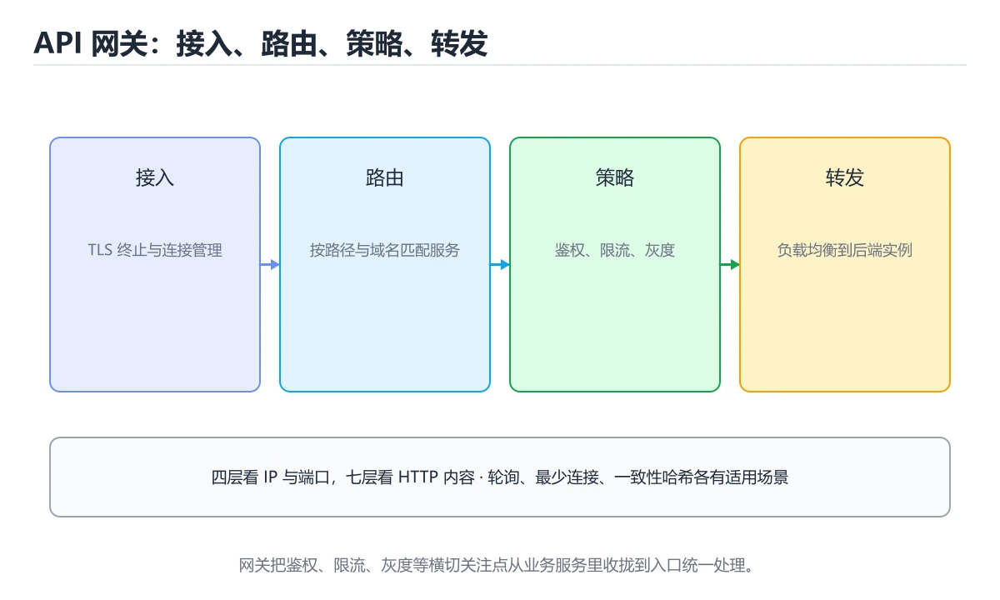
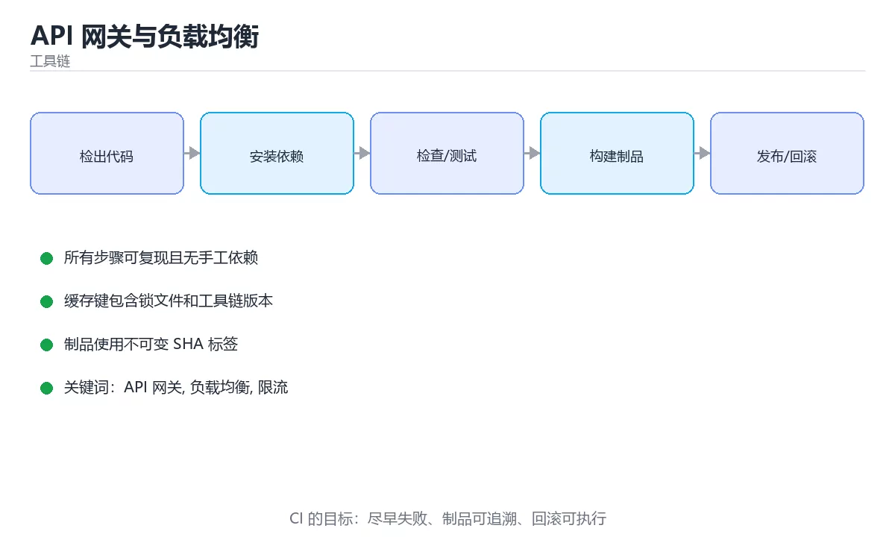

# API 网关与负载均衡

> 内容更新时间：2026-10-06 · 学习阶段：进阶 · 预计用时：45 分钟





## 本节知识框架

**课程定位**：所属分类 `toolchain`（工具链），课程主题 `API 网关与负载均衡`，学习阶段 进阶，建议用时 40 分钟。

本课主线：路由鉴权限流、四层/七层与优雅下线。

**学完本课应当能够**
- 说清 `API 网关` 与 `负载均衡` 的含义与区别，并各举一个正例和一个反例。
- 用本课示例验证 `限流` 的行为，记录输入、输出与失败条件。
- 遇到「重试非幂等请求」这类问题时，能说出触发条件与修复顺序。

### 从概念到验证的学习链条

1. `API 网关`：先掌握 统一承接外部请求，负责路由、认证、限流、观测和协议转换，再用它解释 `负载均衡` 为什么会出现。
2. `负载均衡`：先掌握 把请求按策略分配到多个后端实例，兼顾吞吐、延迟和故障隔离，再用它解释 `限流` 为什么会出现。
3. `限流`：先掌握 限流算法选择：令牌桶（允许突发、平均速率受控，最常用）、漏桶（恒定速率、适合削峰）、滑动窗口（统计精确、内存开销大）、并发数限制（保护线程池，与速率互补），再用它解释 `熔断` 为什么会出现。
4. `熔断`：先掌握 依赖连续失败达到阈值后暂时停止调用并快速失败，给下游恢复时间并防止雪崩，再用它解释 `优雅下线` 为什么会出现。
5. `优雅下线`：先掌握 实例从负载均衡摘除后等待连接和请求排空，再安全停止进程，再用它解释 本课示例的观察结果 为什么会出现。

**先修与衔接**：本课是「工具链」分类的第 9 课。相关或后续课程：《实战：搭一条完整 CI/CD 流水线》、《高可用与容量规划》、《限流与熔断算法专题》、《图解限流、熔断与降级》。

### 完成判据

- **定义关**：不看正文也能说明 `API 网关` 是 统一承接外部请求，负责路由、认证、限流、观测和协议转换，并指出一个反例。
- **机制关**：能按“输入 → 转换 → 输出 → 验证”复述 `API 网关与负载均衡`，而不是只背结论。
- **示例关**：能运行或推演 `API 网关与负载均衡` 的 `python` 示例，并说明一个真实出现的标识符或字面量。
- **证据关**：能指出 `API 网关与负载均衡` 示例里的 调用了 `State()`，并说明它支持或反驳了本课的哪一条结论。
- **排错关**：能复现 重试非幂等请求，记录现象并按 只重试幂等方法，或用幂等键 修复。
- **迁移关**：能把 `API 网关`、`负载均衡`、`限流`、`熔断` 放进一个与 `API 网关与负载均衡` 不同的项目场景，并保持输入与验证条件可追踪。
- **复盘关**：学完 `API 网关与负载均衡` 后，用一句话写下仍然不确定的结论，并列出下一次验证需要的输入、环境和成功判据。

### 复习清单

- [ ] 能不看正文复述本课核心术语，并指出一个边界或反例。
- [ ] 能运行或推演本课示例，记录输入、输出与失败现象。
- [ ] 能完成一次自测，并把错题对照错误表定位原因。

## 核心概念定义

| 术语 | 操作性定义 | 常见边界与风险 |
| --- | --- | --- |
| API 网关 | 统一承接外部请求，负责路由、认证、限流、观测和协议转换。 | 网络延迟、超时与版本协商会改变行为，只在真实链路或多版本客户端上验证才算数。 |
| 负载均衡 | 把请求按策略分配到多个后端实例，兼顾吞吐、延迟和故障隔离。 | 结论随输入规模变化，小规模成立不代表大规模成立，需要重新测量。 |
| 限流 | 限流算法选择：令牌桶（允许突发、平均速率受控，最常用）、漏桶（恒定速率、适合削峰）、滑动窗口（统计精确、内存开销大）、并发数限制（保护线程池，与速率互补）。 | 易错：NAT 后误伤；正确做法是叠加用户与接口维度。 |
| 熔断 | 依赖连续失败达到阈值后暂时停止调用并快速失败，给下游恢复时间并防止雪崩。 | 易错：恢复后仍不可用；正确做法是冷却后放少量探测请求。 |
| 优雅下线 | 实例从负载均衡摘除后等待连接和请求排空，再安全停止进程。 | 共享状态与调度顺序会改变结论，单线程或串行测试通过不等于并发下成立。 |

## 原理与运行机制

### 机制总览

**教材衔接：网关解决什么问题**

把跨切面能力从业务服务里抽出来，统一在入口处理：

| 能力 | 说明 |
| --- | --- |
| 路由 | 按域名/路径/请求头分发到不同服务 |
| 认证鉴权 | 统一校验 Token、签发与刷新 |
| 限流熔断 | 保护后端，防止雪崩 |
| 协议转换 | HTTP ↔ gRPC，外部 REST 内部 RPC |
| 可观测 | 统一日志、指标与链路埋点 |
| 灰度发布 | 按权重、用户标签、地域分流 |

常见实现：Nginx、Kong、APISIX、Envoy、Spring Cloud Gateway，以及云厂商的托管网关。

**教材衔接：负载均衡的层级**

| 层级 | 依据 | 代表 | 特点 |
| --- | --- | --- | --- |
| 四层 L4 | IP + 端口 | LVS、NLB | 性能高，不理解内容 |
| 七层 L7 | HTTP 内容 | Nginx、Envoy、ALB | 可按路径/头路由，能做灰度 |

**教材衔接：常见算法**

1. 轮询 / 加权轮询：简单均匀，适合同构节点。
2. 最少连接：适合长连接与耗时差异大的服务。
3. 一致性哈希：同一用户固定到同一节点，利于缓存命中。
4. 最短响应时间 / P2C：按实时指标选择，适合异构环境。

**教材衔接：限流与熔断**

| 策略 | 说明 |
| --- | --- |
| 令牌桶 / 漏桶 | 控制平均速率并允许一定突发 |
| 并发限制 | 限制同时处理的请求数，保护线程池 |
| 熔断 | 失败率超阈值后快速失败一段时间，避免连锁故障 |
| 降级 | 返回缓存或默认值，保证核心链路可用 |

限流要区分维度：按 IP、按用户、按接口、按全局；生产环境通常组合使用。

**教材衔接：实践清单**

1. 网关自身要能水平扩展，不能成为单点。
2. 超时、重试要成对配置：重试要有上限并加退避，非幂等接口禁止重试。
3. 灰度发布按小流量开始，观察错误率与延迟再逐步放大。
4. 统一注入 request-id / trace-id，串联日志与链路。
5. 配置变更走代码化与评审（网关配置错误的影响面是全局的）。

**教材衔接：负载均衡算法速查**

| 算法 | 特点 | 适用 |
| --- | --- | --- |
| 轮询 | 简单均匀 | 后端同质 |
| 加权轮询 | 按能力分配 | 机器规格不同 |
| 最少连接 | 按当前负载 | 请求耗时差异大 |
| 一致性哈希 | 同一 key 固定后端 | 缓存命中与有状态服务 |
| 最短响应时间 | 按实测延迟 | 延迟敏感 |
| 随机 | 实现简单 | 后端数量多且同质 |

**教材衔接：发布与下线速查**

| 阶段 | 动作 |
| --- | --- |
| 预热 | 新实例先接少量流量 |
| 就绪检查 | 通过后才注册到负载均衡 |
| 灰度 | 按比例放量并观察指标 |
| 下线 | 先从负载均衡摘除，再等在途请求结束 |
| 回滚 | 指标异常立即切回上一版本 |

### 机制拆解：每一步的输入、动作与输出

#### 1. `API 网关`
- 输入：`API 网关`；本步把 统一承接外部请求，负责路由、认证、限流、观测和协议转换 当作判断规则。
- 动作：围绕 `API 网关` 保留中间状态，并记录它与 `负载均衡` 的对应关系。
- 输出：`负载均衡`，它可以被下一段代码、测试或记录继续使用。
- `API 网关` 的失败条件：网络延迟、超时与版本协商会改变行为，只在真实链路或多版本客户端上验证才算数。

#### 2. `负载均衡`
- 输入：`API 网关`；本步把 把请求按策略分配到多个后端实例，兼顾吞吐、延迟和故障隔离 当作判断规则。
- 动作：围绕 `负载均衡` 保留中间状态，并记录它与 `限流` 的对应关系。
- 输出：`限流`，它可以被下一段代码、测试或记录继续使用。
- `负载均衡` 的失败条件：结论随输入规模变化，小规模成立不代表大规模成立，需要重新测量。

#### 3. `限流`
- 输入：`负载均衡`；本步把 限流算法选择：令牌桶（允许突发、平均速率受控，最常用）、漏桶（恒定速率、适合削峰）、滑动窗口（统计精确、内存开销大）、并发数限制（保护线程池，与速率互补） 当作判断规则。
- 动作：围绕 `限流` 保留中间状态，并记录它与 `熔断` 的对应关系。
- 输出：`熔断`，它可以被下一段代码、测试或记录继续使用。
- `限流` 的失败条件：当限流只按 IP时，会出现NAT 后误伤。

#### 4. `熔断`
- 输入：`限流`；本步把 依赖连续失败达到阈值后暂时停止调用并快速失败，给下游恢复时间并防止雪崩 当作判断规则。
- 动作：围绕 `熔断` 保留中间状态，并记录它与 `优雅下线` 的对应关系。
- 输出：`优雅下线`，它可以被下一段代码、测试或记录继续使用。
- `熔断` 的失败条件：当熔断无半开探测时，会出现恢复后仍不可用。

#### 5. `优雅下线`
- 输入：`熔断`；本步把 实例从负载均衡摘除后等待连接和请求排空，再安全停止进程 当作判断规则。
- 动作：围绕 `优雅下线` 保留中间状态，并记录它与 `State` 的对应关系。
- 输出：`State`，它可以被下一段代码、测试或记录继续使用。
- `优雅下线` 的失败条件：共享状态与调度顺序会改变结论，单线程或串行测试通过不等于并发下成立。

### 示例中的可观察事实

1. 调用了 `State()`；它对应的课程主题是 `API 网关与负载均衡`。
2. 调用了 `allow()`；它对应的课程主题是 `API 网关与负载均衡`。
3. 调用了 `monotonic()`；它对应的课程主题是 `API 网关与负载均衡`。
4. 调用了 `record()`；它对应的课程主题是 `API 网关与负载均衡`。
5. 调用了 `field()`；它对应的课程主题是 `API 网关与负载均衡`。
6. 调用了 `deque()`；它对应的课程主题是 `API 网关与负载均衡`。
7. 调用了 `next_delay()`；它对应的课程主题是 `API 网关与负载均衡`。
8. 调用了 `min()`；它对应的课程主题是 `API 网关与负载均衡`。

### 复现实验记录

- 环境：`API 网关与负载均衡` 使用 `python` 示例，固定 `API 网关`、`负载均衡`、`限流`、`熔断` 作为第一组条件。
- 首轮输入：先确认 调用了 `State()`，预测 `API 网关` 会怎样变化。
- 基线观察：记录命令、输入、输出和错误原文，不用截图代替可复制的文本。
- 单变量修改：只改变 `API 网关`，观察 `优雅下线` 是否仍满足定义。
- 失败注入：复现 重试非幂等请求，确认现象是 重复下单或扣款。
- 记录结论：把“修改前、修改后、预期变化、实际变化”写成四列表，这样复盘 `API 网关与负载均衡` 时才能区分概念错误与实现错误。

## 典型应用场景

- **重试非幂等请求**：典型现象是重复下单或扣款；正确做法是只重试幂等方法，或用幂等键。
- **重试无退避**：典型现象是故障放大；正确做法是指数退避 + 抖动 + 上限。
- **超时设置过长**：典型现象是线程与连接被占满；正确做法是连接与读取超时分开设。
- **熔断无半开探测**：典型现象是恢复后仍不可用；正确做法是冷却后放少量探测请求。

### 最小验证场景

- 准备：保留 `python` 示例的原始输入，先记录 `API 网关与负载均衡` 的基线输出和完整运行命令。
- 观察：先核对 调用了 `State()`，再改变一个与 `API 网关` 相关的条件。
- 判定：新结果与 `API 网关与负载均衡` 的基线不同不等于错误；只有当差异破坏了 `API 网关` 的定义或错误表中的约束，才判定为失败。

### 选择与边界

- 使用 `API 网关` 时，先满足它的定义：统一承接外部请求，负责路由、认证、限流、观测和协议转换；网络延迟、超时与版本协商会改变行为，只在真实链路或多版本客户端上验证才算数。
- 使用 `负载均衡` 时，先满足它的定义：把请求按策略分配到多个后端实例，兼顾吞吐、延迟和故障隔离；结论随输入规模变化，小规模成立不代表大规模成立，需要重新测量。
- 使用 `限流` 时，先满足它的定义：限流算法选择：令牌桶（允许突发、平均速率受控，最常用）、漏桶（恒定速率、适合削峰）、滑动窗口（统计精确、内存开销大）、并发数限制（保护线程池，与速率互补）；易错：NAT 后误伤；正确做法是叠加用户与接口维度。
- 使用 `熔断` 时，先满足它的定义：依赖连续失败达到阈值后暂时停止调用并快速失败，给下游恢复时间并防止雪崩；易错：恢复后仍不可用；正确做法是冷却后放少量探测请求。
- 使用 `优雅下线` 时，先满足它的定义：实例从负载均衡摘除后等待连接和请求排空，再安全停止进程；共享状态与调度顺序会改变结论，单线程或串行测试通过不等于并发下成立。

## 代码/协议/SQL 示例

**教材衔接：配置片段与限流算法**

| 场景 | 配置要点 |
| --- | --- |
| 路由到后端 | Nginx `location /api/ { proxy_pass http://backend; }`，转发时带 X-Real-IP 与 X-Forwarded-For |
| 超时与重试 | `proxy_connect_timeout`、`proxy_read_timeout`；重试只对幂等请求开启并限制次数 |
| 限流 | `limit_req_zone` 按 IP/接口维度，令牌桶允许突发 |
| 熔断降级 | 网关层错误率超阈值时返回兜底内容或缓存 |
| 灰度 | 按请求头/用户标签/权重分流到不同后端版本 |

限流算法选择：**令牌桶**（允许突发、平均速率受控，最常用）、**漏桶**（恒定速率、适合削峰）、**滑动窗口**（统计精确、内存开销大）、**并发数限制**（保护线程池，与速率互补）。生产通常组合使用：入口按 IP 限流 + 用户维度限流 + 后端并发限制。

排查网关问题的顺序：`curl -v` 确认状态码与响应头 → 看网关访问日志（upstream_addr、upstream_status、request_time）→ 确认是网关本身还是后端 → 检查 upstream 健康检查与权重配置。**5xx 集中在某一台后端**时优先怀疑实例而非网关。

**教材衔接：弹性策略速查**

| 策略 | 作用 | 关键参数 |
| --- | --- | --- |
| 超时 | 防止无限等待 | 连接、读写分开设置 |
| 重试 | 处理瞬时故障 | 仅幂等、退避、上限 |
| 熔断 | 快速失败保护下游 | 错误率阈值、半开探测 |
| 限流 | 保护自身与下游 | 令牌桶、按用户维度 |
| 降级 | 保核心功能 | 返回缓存或默认值 |
| 隔离 | 防相互影响 | 线程池或连接池隔离 |

```python
import time
from collections import deque
from dataclasses import dataclass, field
from enum import Enum

class State(Enum):
    CLOSED = "closed"
    OPEN = "open"
    HALF_OPEN = "half_open"

@dataclass
class CircuitBreaker:
    """熔断器：连续失败打开，冷却后放少量请求探测。"""

    failure_threshold: int = 5
    cooldown_seconds: float = 10.0
    half_open_probes: int = 3
    state: State = State.CLOSED
    failures: int = 0
    probes: int = 0
    opened_at: float = 0.0

    def allow(self, now: float | None = None) -> bool:
        now = time.monotonic() if now is None else now
        if self.state is State.OPEN:
            if now - self.opened_at >= self.cooldown_seconds:
                self.state = State.HALF_OPEN
                self.probes = 0
            else:
                return False
        if self.state is State.HALF_OPEN and self.probes >= self.half_open_probes:
            return False
        return True

    def record(self, success: bool, now: float | None = None) -> None:
        now = time.monotonic() if now is None else now
        if success:
            if self.state is State.HALF_OPEN:
                self.state = State.CLOSED
                self.failures = 0
            else:
                self.failures = 0
            return
        if self.state is State.HALF_OPEN:
            self.probes += 1
            self.state = State.OPEN
            self.opened_at = now
            return
        self.failures += 1
        if self.failures >= self.failure_threshold:
            self.state = State.OPEN
            self.opened_at = now

@dataclass
class Backoff:
    """指数退避 + 抖动，避免重试风暴。"""

    base: float = 0.1
    factor: float = 2.0
    max_delay: float = 5.0
    history: deque = field(default_factory=lambda: deque(maxlen=32))

    def next_delay(self, attempt: int, jitter: float = 0.3) -> float:
        delay = min(self.max_delay, self.base * (self.factor ** attempt))
        return round(delay * (1 + jitter * ((attempt % 3) - 1)), 4)

breaker = CircuitBreaker()
for _ in range(6):
    breaker.record(False)
print(breaker.state, breaker.allow())
print([Backoff().next_delay(i) for i in range(5)])
```

**运行方式**：运行 `API 网关与负载均衡` 的示例时，保存为 `.py` 文件后用 `python 文件名.py` 运行；第三方依赖先在虚拟环境里安装。

### 示例精读：先找证据，再改一个条件

1. 调用了 `State()`；它出现在 `API 网关与负载均衡` 的示例中，阅读时先确认它前后各发生了什么。
2. 调用了 `allow()`；它出现在 `API 网关与负载均衡` 的示例中，阅读时先确认它前后各发生了什么。
3. 调用了 `monotonic()`；它出现在 `API 网关与负载均衡` 的示例中，阅读时先确认它前后各发生了什么。
4. 调用了 `record()`；它出现在 `API 网关与负载均衡` 的示例中，阅读时先确认它前后各发生了什么。
5. 调用了 `field()`；它出现在 `API 网关与负载均衡` 的示例中，阅读时先确认它前后各发生了什么。
6. 调用了 `deque()`；它出现在 `API 网关与负载均衡` 的示例中，阅读时先确认它前后各发生了什么。
7. 调用了 `next_delay()`；它出现在 `API 网关与负载均衡` 的示例中，阅读时先确认它前后各发生了什么。
8. 调用了 `min()`；它出现在 `API 网关与负载均衡` 的示例中，阅读时先确认它前后各发生了什么。
- 在 `API 网关与负载均衡` 中与 `API 网关` 对照：示例必须能支持 统一承接外部请求，负责路由、认证、限流、观测和协议转换，否则说明这一段还缺少实现或验证步骤。
- 在 `API 网关与负载均衡` 中与 `负载均衡` 对照：示例必须能支持 把请求按策略分配到多个后端实例，兼顾吞吐、延迟和故障隔离，否则说明这一段还缺少实现或验证步骤。
- 在 `API 网关与负载均衡` 中与 `限流` 对照：示例必须能支持 限流算法选择：令牌桶（允许突发、平均速率受控，最常用）、漏桶（恒定速率、适合削峰）、滑动窗口（统计精确、内存开销大）、并发数限制（保护线程池，与速率互补），否则说明这一段还缺少实现或验证步骤。
- 在 `API 网关与负载均衡` 中与 `熔断` 对照：示例必须能支持 依赖连续失败达到阈值后暂时停止调用并快速失败，给下游恢复时间并防止雪崩，否则说明这一段还缺少实现或验证步骤。

## 时间/空间复杂度或性能分析

**性能关注点（API 网关与负载均衡）**：构建与流水线看总时长：记录构建耗时、缓存命中率与失败重试次数。

**本课特有开销（API 网关与负载均衡 · API 网关）**：并发度提高后要观察是否出现拐点：延迟上升而吞吐不增，说明瓶颈已转移。

**测量方法**：以 `API 网关与负载均衡` 的 `API 网关` 场景为对象，固定输入跑一遍记录基线，再把规模或并发度提高一个数量级复测；两次结果的差值与波动范围才是结论依据。

### 需要控制的变量与记录项

- `API 网关与负载均衡` 的 `API 网关`：固定它的版本、输入范围和资源上限，分别记录速度、内存与失败率的变化。
- `API 网关与负载均衡` 的 `负载均衡`：固定它的版本、输入范围和资源上限，分别记录速度、内存与失败率的变化。
- `API 网关与负载均衡` 的 `限流`：固定它的版本、输入范围和资源上限，分别记录速度、内存与失败率的变化。
- `API 网关与负载均衡` 的 `熔断`：固定它的版本、输入范围和资源上限，分别记录速度、内存与失败率的变化。
- `API 网关与负载均衡` 的 `优雅下线`：固定它的版本、输入范围和资源上限，分别记录速度、内存与失败率的变化。
- `API 网关与负载均衡` 中 `API 网关` 的边界：网络延迟、超时与版本协商会改变行为，只在真实链路或多版本客户端上验证才算数。达到边界时不要外推，必须重新测量。
- `API 网关与负载均衡` 中 `负载均衡` 的边界：结论随输入规模变化，小规模成立不代表大规模成立，需要重新测量。达到边界时不要外推，必须重新测量。
- `API 网关与负载均衡` 中 `限流` 的边界：易错：NAT 后误伤；正确做法是叠加用户与接口维度。达到边界时不要外推，必须重新测量。
- `API 网关与负载均衡` 中 `熔断` 的边界：易错：恢复后仍不可用；正确做法是冷却后放少量探测请求。达到边界时不要外推，必须重新测量。
- `API 网关与负载均衡` 中 `优雅下线` 的边界：共享状态与调度顺序会改变结论，单线程或串行测试通过不等于并发下成立。达到边界时不要外推，必须重新测量。
- `API 网关与负载均衡` 的代码证据：先验证 调用了 `State()`，再记录该路径的输入规模与耗时；只看代码行数不能推出复杂度。

## 常见误区与易错点

| 容易写错的做法 | 实际现象 | 原因与正确做法 |
| --- | --- | --- |
| 重试非幂等请求 | 重复下单或扣款 | 只重试幂等方法，或用幂等键 |
| 重试无退避 | 故障放大 | 指数退避 + 抖动 + 上限 |
| 超时设置过长 | 线程与连接被占满 | 连接与读取超时分开设 |
| 熔断无半开探测 | 恢复后仍不可用 | 冷却后放少量探测请求 |
| 下线直接杀进程 | 用户看到 502 | 先摘流量再等在途结束 |
| 一致性哈希无虚拟节点 | 数据倾斜 | 加虚拟节点或调权重 |
| 限流只按 IP | NAT 后误伤 | 叠加用户与接口维度 |
| 忽略健康检查频率 | 故障实例仍接流量 | 合理间隔 + 连续失败阈值 |
| 所有服务共用一个连接池 | 相互影响 | 按依赖隔离 |
| 无灰度直接全量 | 故障影响全站 | 灰度 + 自动回滚 |

### 现场 1：重试非幂等请求

**症状**：重复下单或扣款。

**根因与修复**：只重试幂等方法，或用幂等键。

**自检**：在本课示例里复现「重试非幂等请求」，改成只重试幂等方法，或用幂等键后重跑；如果症状消失且失败路径按预期变化，说明定位正确。

### 现场 2：重试无退避

**症状**：故障放大。

**根因与修复**：指数退避 + 抖动 + 上限。

**自检**：在本课示例里复现「重试无退避」，改成指数退避 + 抖动 + 上限后重跑；如果症状消失且失败路径按预期变化，说明定位正确。

### 现场 3：超时设置过长

**症状**：线程与连接被占满。

**根因与修复**：连接与读取超时分开设。

**自检**：在本课示例里复现「超时设置过长」，改成连接与读取超时分开设后重跑；如果症状消失且失败路径按预期变化，说明定位正确。

### 现场 4：熔断无半开探测

**症状**：恢复后仍不可用。

**根因与修复**：冷却后放少量探测请求。

**自检**：在本课示例里复现「熔断无半开探测」，改成冷却后放少量探测请求后重跑；如果症状消失且失败路径按预期变化，说明定位正确。

### 现场 5：下线直接杀进程

**症状**：用户看到 502。

**根因与修复**：先摘流量再等在途结束。

**自检**：在本课示例里复现「下线直接杀进程」，改成先摘流量再等在途结束后重跑；如果症状消失且失败路径按预期变化，说明定位正确。

### 现场 6：一致性哈希无虚拟节点

**症状**：数据倾斜。

**根因与修复**：加虚拟节点或调权重。

**自检**：在本课示例里复现「一致性哈希无虚拟节点」，改成加虚拟节点或调权重后重跑；如果症状消失且失败路径按预期变化，说明定位正确。

### 现场 7：限流只按 IP

**症状**：NAT 后误伤。

**根因与修复**：叠加用户与接口维度。

**自检**：在本课示例里复现「限流只按 IP」，改成叠加用户与接口维度后重跑；如果症状消失且失败路径按预期变化，说明定位正确。

### 现场 8：忽略健康检查频率

**症状**：故障实例仍接流量。

**根因与修复**：合理间隔 + 连续失败阈值。

**自检**：在本课示例里复现「忽略健康检查频率」，改成合理间隔 + 连续失败阈值后重跑；如果症状消失且失败路径按预期变化，说明定位正确。

### 现场 9：所有服务共用一个连接池

**症状**：相互影响。

**根因与修复**：按依赖隔离。

**自检**：在本课示例里复现「所有服务共用一个连接池」，改成按依赖隔离后重跑；如果症状消失且失败路径按预期变化，说明定位正确。

## 与其他知识点的关系

| 关系 | 课程 | 为什么 |
| --- | --- | --- |
| 关联 | 《实战：搭一条完整 CI/CD 流水线》 | 用于横向比较或把本课结论迁移到相邻主题。 |
| 关联 | 《高可用与容量规划》 | 用于横向比较或把本课结论迁移到相邻主题。 |
| 关联 | 《限流与熔断算法专题》 | 用于横向比较或把本课结论迁移到相邻主题。 |
| 关联 | 《图解限流、熔断与降级》 | 用于横向比较或把本课结论迁移到相邻主题。 |
| 前置顺序 | 《可观测性：日志、指标与链路》 | 同分类中安排在本课之前，建议先完成其自测。 |
| 后续顺序 | 《实战：搭一条完整 CI/CD 流水线》 | 同分类中安排在本课之后，会继续使用本课术语。 |

**教材衔接：四层与七层对照**

| 维度 | 四层（L4） | 七层（L7） |
| --- | --- | --- |
| 依据 | IP + 端口 | URL、Header、Cookie |
| 性能 | 更高、延迟更低 | 略低但功能强 |
| 能力 | 转发、连接保持 | 路由、鉴权、改写、限流 |
| 典型 | LVS、NLB | Nginx、Envoy、ALB |
| TLS | 透传或终止 | 终止并可做内容检查 |

**教材衔接：代码对照与验证**

这一节给出网关的三个核心配置：路由、限流与健康检查，并说明它们的顺序。

### 对照一：声明式路由与上游

```yaml
upstream: api_cluster
  strategy: round_robin
  members:
    - http://10.0.0.11:8080
    - http://10.0.0.12:8080

routes:
  - path: /api/v1/orders
    methods: [GET, POST]
    upstream: api_cluster
    timeout_ms: 2000
```

路由先匹配请求，再把流量交给上游；超时和重试写在路由层，避免每个服务重复实现。

### 对照二：Nginx 反向代理片段

```text
location /api/ {
    proxy_pass http://api_cluster;
    proxy_connect_timeout 1s;
    proxy_read_timeout 2s;
    proxy_next_upstream error timeout http_502;
}
```

代理层负责连接与重试策略，应用层仍然要处理幂等，否则重试会放大副作用。

### 对照三：限流与降级顺序

| 顺序 | 动作 | 说明 |
| --- | --- | --- |
| 1 | 认证与鉴权 | 未通过直接拒绝，不占用后端资源 |
| 2 | 限流与配额 | 保护后端不被突发流量击穿 |
| 3 | 路由与重试 | 只对幂等请求重试，设置最大次数 |
| 4 | 熔断与降级 | 依赖持续失败时快速返回兜底结果 |

### 验证清单

- 限流阈值有压测数据支撑，而不是凭感觉设置。
- 重试只覆盖幂等接口，并设置退避与上限。
- 网关自身有健康检查与就绪探针，滚动发布不中断流量。

- **相关或后续**：`实战：搭一条完整 CI/CD 流水线`、`高可用与容量规划`、`限流与熔断算法专题`、`图解限流、熔断与降级`。本课术语会在这些课程里继续使用。
- **术语归属**：`API 网关`、`负载均衡`、`限流` 的定义以本课「核心概念定义」为准，换到其他课程时先确认定义是否被改写。

### 先修与后续术语接口

- `实战：搭一条完整 CI/CD 流水线`：两者通过本分类的学习顺序衔接，阅读时重点比较各自的输入与失败条件。
- `高可用与容量规划`：共享术语 `限流`、`熔断`，共同关键词 `限流`、`熔断`。
- `限流与熔断算法专题`：共享术语 `限流`、`熔断`，共同关键词 `限流`、`熔断`。
- `图解限流、熔断与降级`：共享术语 `限流`、`熔断`，共同关键词 `限流`、`熔断`。

### 容易混淆的相邻概念

- `API 网关` 与 `负载均衡`：前者强调 统一承接外部请求，负责路由、认证、限流、观测和协议转换；后者强调 把请求按策略分配到多个后端实例，兼顾吞吐、延迟和故障隔离。判断时分别检查两条定义的适用范围，不要只看名称相似就互换。
- `负载均衡` 与 `限流`：前者强调 把请求按策略分配到多个后端实例，兼顾吞吐、延迟和故障隔离；后者强调 限流算法选择：令牌桶（允许突发、平均速率受控，最常用）、漏桶（恒定速率、适合削峰）、滑动窗口（统计精确、内存开销大）、并发数限制（保护线程池，与速率互补）。判断时分别检查两条定义的适用范围，不要只看名称相似就互换。
- `限流` 与 `熔断`：前者强调 限流算法选择：令牌桶（允许突发、平均速率受控，最常用）、漏桶（恒定速率、适合削峰）、滑动窗口（统计精确、内存开销大）、并发数限制（保护线程池，与速率互补）；后者强调 依赖连续失败达到阈值后暂时停止调用并快速失败，给下游恢复时间并防止雪崩。判断时分别检查两条定义的适用范围，不要只看名称相似就互换。
- `熔断` 与 `优雅下线`：前者强调 依赖连续失败达到阈值后暂时停止调用并快速失败，给下游恢复时间并防止雪崩；后者强调 实例从负载均衡摘除后等待连接和请求排空，再安全停止进程。判断时分别检查两条定义的适用范围，不要只看名称相似就互换。

## 自测题与参考答案

> 先独立作答，再对照参考答案；答案都能在本课正文、术语表或错误表里找到依据。

### 自测 1（概念复述）

不看正文，写出 `API 网关` 的操作性定义，并说明它与 `负载均衡` 的区别。

**参考答案**：统一承接外部请求，负责路由、认证、限流、观测和协议转换。

`负载均衡` 的定位是：把请求按策略分配到多个后端实例，兼顾吞吐、延迟和故障隔离；两者的差别要从适用对象与失败模式上说明。

### 自测 2（排错）

本课错误表记录了「重试非幂等请求」这类做法。请写出它会出现的现象、根因，以及修复顺序。

**参考答案**：现象是重复下单或扣款；正确做法是只重试幂等方法，或用幂等键。修复时先复现现象并保留证据，再改动一处假设重跑，确认现象消失。

### 自测 3（动手验证）

运行本课的 `python` 示例，把其中的 `"closed"` 换成一个边界值后重新运行，记录输出与错误信息。

**参考答案**：正常输入下 `python` 示例应当复现正文给出的结果；把 `"closed"` 换成边界值后，如果结果改变或报错，先核对它是否满足 `API 网关与负载均衡` 中`API 网关` 的适用范围，再检查错误表里是否有同类现象。

### 自测 4（代码阅读）

阅读本课开头的 `python` 示例，说明它体现了`API 网关` 的哪一条性质，并指出改动哪个输入会让这条性质不再成立。

**参考答案**：`API 网关` 的定义是 统一承接外部请求，负责路由、认证、限流、观测和协议转换，示例正是在实现这条定义。改动与 `API 网关` 有关的一个输入后，如果结果不再符合 `API 网关与负载均衡` 的正文描述，就说明该性质只在当前前提成立。

### 自测 5（迁移）

把 `API 网关与负载均衡` 的方法迁移到自己的项目：围绕 `API 网关` 写出一个与错误表同类的风险点，并说明触发条件和检验方式。

**参考答案**：例如「无灰度直接全量」，它会导致故障影响全站；检验方式是按灰度 + 自动回滚改一处再复现，确认现象消失且没有引入新的失败分支。

### 自测 6（对比）

用一个表格对比 `API 网关` 与 `负载均衡`：各写一行适用场景、一行失败表现。

**参考答案**：`API 网关` 的定义是统一承接外部请求，负责路由、认证、限流、观测和协议转换；`负载均衡` 的定义是把请求按策略分配到多个后端实例，兼顾吞吐、延迟和故障隔离。两者的失败表现分别对应本课错误表里与本术语相关的行。

### 自测 7（排错顺序）

面对「重试非幂等请求」引发的问题，请把“复现 重复下单或扣款 → 保留证据 → 只重试幂等方法，或用幂等键 → 回归验证”四步写成可执行的检查清单。

**参考答案**：第一步按重复下单或扣款复现；第二步记录输入、版本与完整报错；第三步按只重试幂等方法，或用幂等键只改一处；第四步重跑并确认失败路径也按预期变化。

### 自测 8（边界判断）

针对 `优雅下线`，分别写出“可以使用”的条件和“结论不再成立”的条件。

**参考答案**：共享状态与调度顺序会改变结论，单线程或串行测试通过不等于并发下成立。 同时要把 `优雅下线` 的定义 实例从负载均衡摘除后等待连接和请求排空，再安全停止进程 与实际输入逐项对照。

### 自测 9（机制重建）

不看正文，按输入、转换、输出、验证四段重建 `API 网关` → `负载均衡` → `限流` → `熔断` 的作用链。

**参考答案**：起点是 `API 网关` 的定义 统一承接外部请求，负责路由、认证、限流、观测和协议转换；中间每一步都保留可观察状态；终点由 `优雅下线` 检查，失败时回到错误表定位第一个偏离定义的步骤。

### 自测 10（综合排错）

在 `API 网关与负载均衡` 中，现象是 故障影响全站。请围绕 无灰度直接全量 写出最小复现、关键证据、修复动作和回归验证，并说明为什么不能只凭一次运行下结论。

**参考答案**：先复现 无灰度直接全量，记录输入与完整错误；再按 灰度 + 自动回滚 只改一处。回归时同时跑正常路径和边界路径，只有两次结果都可解释，才把修复视为完成。

### 自测 11（一分钟复述）

用每分钟约 200 字的速度复述 `API 网关与负载均衡`：先给主问题，再按顺序说出 `API 网关`、`负载均衡`、`限流`、`熔断`，最后给一个失败案例。

**自评标准**：主问题必须对应 路由鉴权限流、四层/七层与优雅下线；每个术语都要能接上一句定义或边界；失败案例必须写成可观察现象，不能用“可能有风险”代替证据。

## 术语速查

| 术语 | 一句话说明 |
| --- | --- |
| `API 网关` | 统一承接外部请求，负责路由、认证、限流、观测和协议转换。 |
| `负载均衡` | 把请求按策略分配到多个后端实例，兼顾吞吐、延迟和故障隔离。 |
| `限流` | 限流算法选择：令牌桶（允许突发、平均速率受控，最常用）、漏桶（恒定速率、适合削峰）、滑动窗口（统计精确、内存开销大）、并发数限制（保护线程池，与速率互补）。 |
| `熔断` | 依赖连续失败达到阈值后暂时停止调用并快速失败，给下游恢复时间并防止雪崩。 |
| `优雅下线` | 实例从负载均衡摘除后等待连接和请求排空，再安全停止进程。 |

**术语关系**：`API 网关`（统一承接外部请求） → `负载均衡`（把请求按策略分配到多个后端实例） → `限流`（限流算法选择：令牌桶（允许突发、平均速率受控） → `熔断`（依赖连续失败达到阈值后暂时停止调用并快速失败）。

## 考点精讲

`API 网关与负载均衡` 的题库有 6 道题，下面逐题给出题干、正确项与判断依据：先自己作答，再核对正确项，最后回到正文对应小节复核。

### 考点 1：第 1 题

- **题目**：四层与七层负载均衡的关键区别是？
- **正确项**：七层能理解 HTTP 内容并按路径/头部路由
- **判断依据**：这道题落在术语 `负载均衡` 上：把请求按策略分配到多个后端实例，兼顾吞吐、延迟和故障隔离。复习时把 `负载均衡` 的定义、适用边界和一个反例一起说清楚，再回到「核心概念定义」核对原文。

### 考点 2：第 2 题

- **题目**：服务发布时的优雅下线顺序是？
- **正确项**：先停止接收新请求
- **判断依据**：这道题落在术语 `优雅下线` 上：实例从负载均衡摘除后等待连接和请求排空，再安全停止进程。复习时把 `优雅下线` 的定义、适用边界和一个反例一起说清楚，再回到「核心概念定义」核对原文。

### 考点 3：第 3 题

- **题目**：关于重试，下面做法正确的是？
- **正确项**：非幂等接口禁止重试
- **判断依据**：这道题检验本课主问题：路由鉴权限流、四层/七层与优雅下线。复习时先复述本课主问题，再举一个会让结论失效的输入。

### 考点 4：第 4 题

- **题目**：围绕“API 网关与负载均衡”中的 API 网关、负载均衡、限流，下列哪两项是本课强调的实践判断？
- **正确项**：验证 负载均衡 时要固定版本并覆盖边界输入，结论才可复现；学习 API 网关 时要同时说明输入、输出和失败路径，不能只看正常流程
- **判断依据**：这道题落在术语 `API 网关` 上：统一承接外部请求，负责路由、认证、限流、观测和协议转换。复习时把 `API 网关` 的定义、适用边界和一个反例一起说清楚，再回到「核心概念定义」核对原文。

### 考点 5：第 5 题

- **题目**：阅读这段熔断器状态判断，下面哪项判断是正确的？
- **正确项**：熔断打开时直接拒绝请求，冷却结束后进入半开状态只用少量请求探测
- **判断依据**：这道题落在术语 `熔断` 上：依赖连续失败达到阈值后暂时停止调用并快速失败，给下游恢复时间并防止雪崩。复习时把 `熔断` 的定义、适用边界和一个反例一起说清楚，再回到「核心概念定义」核对原文。

### 考点 6：第 6 题

- **题目**：填空：补齐下面这段术语说明中的空缺。课程 `路由鉴权限流、四层/七层与优雅下线。`，这段说明是：`____`：实例从负载均衡摘除后等待连接和请求排空，再安全停止进程。空缺处应填哪个术语？
- **正确项**：优雅下线
- **判断依据**：这道题落在术语 `负载均衡` 上：把请求按策略分配到多个后端实例，兼顾吞吐、延迟和故障隔离。复习时把 `负载均衡` 的定义、适用边界和一个反例一起说清楚，再回到「核心概念定义」核对原文。

### 考点 7：`API 网关`

- **要点**：统一承接外部请求，负责路由、认证、限流、观测和协议转换。
- **API 网关 的边界**：网络延迟、超时与版本协商会改变行为，只在真实链路或多版本客户端上验证才算数。

### 考点 8：`负载均衡`

- **要点**：把请求按策略分配到多个后端实例，兼顾吞吐、延迟和故障隔离。
- **负载均衡 的边界**：结论随输入规模变化，小规模成立不代表大规模成立，需要重新测量。

### 考点 9：`限流`

- **要点**：限流算法选择：令牌桶（允许突发、平均速率受控，最常用）、漏桶（恒定速率、适合削峰）、滑动窗口（统计精确、内存开销大）、并发数限制（保护线程池，与速率互补）。
- **限流 的边界**：易错：NAT 后误伤；正确做法是叠加用户与接口维度。

### 考点 10：`熔断`

- **要点**：依赖连续失败达到阈值后暂时停止调用并快速失败，给下游恢复时间并防止雪崩。
- **熔断 的边界**：易错：恢复后仍不可用；正确做法是冷却后放少量探测请求。

### 考点 11：`优雅下线`

- **要点**：实例从负载均衡摘除后等待连接和请求排空，再安全停止进程。
- **优雅下线 的边界**：共享状态与调度顺序会改变结论，单线程或串行测试通过不等于并发下成立。

### 考点 12：排错——重试非幂等请求

- **现象**：重复下单或扣款。
- **处理**：只重试幂等方法，或用幂等键。

### 考点 13：排错——重试无退避

- **现象**：故障放大。
- **处理**：指数退避 + 抖动 + 上限。

### 考点 14：综合辨析——`API 网关` 与 `优雅下线`

- **辨析点**：`API 网关` 的定义是 统一承接外部请求，负责路由、认证、限流、观测和协议转换；`优雅下线` 的定义是 实例从负载均衡摘除后等待连接和请求排空，再安全停止进程。
- **答题要求**：面对 `API 网关与负载均衡` 的题目，先判断描述的是 `API 网关` 还是 `优雅下线`，再归到对应定义，最后写出一个会让该定义失效的边界输入。

### 考点 15：排错评分点

- **现象分**：能写出 重复下单或扣款，而不是只写“程序有错”。
- **证据分**：保留触发 重试非幂等请求 的输入、版本和错误原文。
- **修复分**：按 只重试幂等方法，或用幂等键 只改一处，并同时回归正常路径与边界路径。

## 内容元数据

- 内容版本：v2.0
- 最后更新：2026-10-06
- 学习阶段：进阶
- 适用环境：Git / Docker / Kubernetes / CI 平台；本课聚焦 API 网关。
- 内容来源：内置结构化课程与工程实践整理
- 相关主题：API 网关、负载均衡、限流、熔断、优雅下线
- 质量版本：P0 测验标准 + P1 覆盖扩展 + P2 体验补全

## 参考资料与复核

- 最后复核：2026-10-04
- 下次复核：2027-08-24
- 复核范围：版本兼容、API 行为、安全建议与工程实践
- 来源性质：官方文档、标准或权威教材；本课核对关键词：API 网关、负载均衡、限流、熔断、优雅下线。

| 参考资料 | 本课用途 |
| --- | --- |
| [GitHub Actions](https://docs.github.com/actions) | CI/CD 工作流 |
| [Docker 文档](https://docs.docker.com/) | 镜像、容器与网络 |
| [npm 文档](https://docs.npmjs.com/) | JavaScript 包管理 |

| [本课术语索引：API 网关与负载均衡](#核心概念定义) | 按本课输入、术语边界和错误表现逐项核对 |
> 「API 网关与负载均衡」的链接用于离线阅读后的延伸核对；App 不会自动联网。