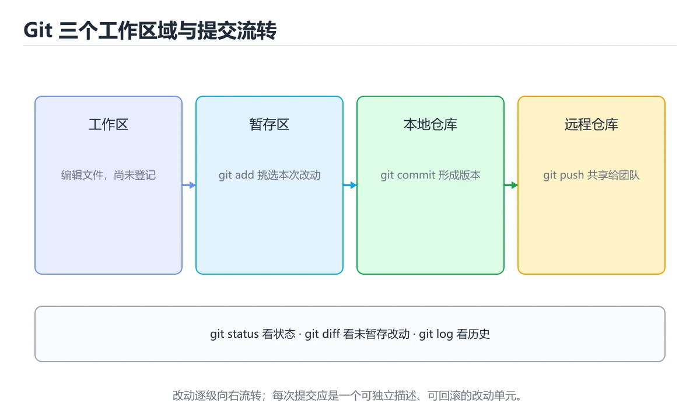
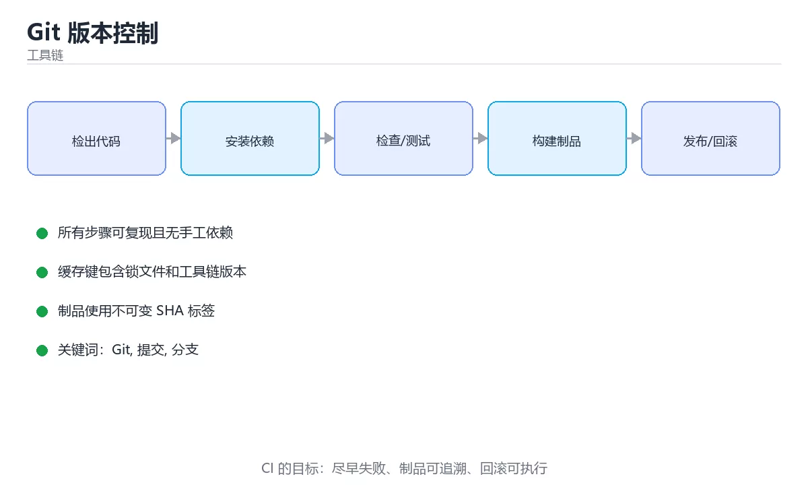

# Git 版本控制





> 内容更新时间：2026-10-06 · 学习阶段：基础 · 预计用时：35 分钟

## 学习目标

- 能用自己的话解释Git 版本控制解决了什么问题，而不是只背术语。
- 能说清 「Git」、「提交」、「分支」、「合并」 之间的关系，并分别举出一个例子。
- 能把 Git 放回「Git 版本控制」的知识体系，说明它和 提交 的边界。
- 能完成本课练习，并用验收标准检查自己的结果。

> 一句话摘要：工作区、暂存区与仓库，以及分支和撤销操作。

## 前置知识

- 能运行 Repository 所在环境的基本命令；陌生术语先回到本课术语表。
- 本课阶段：基础。建议先掌握同一分类的基础课程，并能独立运行正文里的 Repository 示例。
- 开始前先复习：Git、提交、分支。
- 看不懂就直接缩小例子：只保留 Git 相关的两行输入，跑通后再加回其余部分。

## 为什么需要版本控制

Git 记录文件的每一次变化，让你可以查看历史、回退错误、多人并行开发而不互相覆盖。它的核心模型是**快照 + 指针**，而不是简单的「文件差异列表」。

## 三个工作区域

```text
工作区(Working Directory)
    ↓ git add
暂存区(Staging Area / Index)
    ↓ git commit
本地仓库(Repository)
    ↓ git push
远程仓库(Remote)
```

## 最常用的命令

```bash
git init                          # 初始化仓库
git clone <url>                   # 克隆远程仓库

git status                        # 查看当前状态
git add .                         # 添加所有改动到暂存区
git commit -m "feat: 添加登录功能"  # 提交

git log --oneline --graph         # 查看提交历史
git diff                          # 查看未暂存的改动
git diff --staged                 # 查看已暂存的改动
```

## 分支与合并

```bash
git branch feature/login          # 创建分支
git switch feature/login          # 切换分支
git switch -c fix/typo            # 创建并切换

git merge main                    # 把 main 合并到当前分支
git rebase main                   # 变基，使历史更线性
git branch -d feature/login       # 删除已合并的分支
```

## 撤销与回退

| 场景 | 命令 |
| --- | --- |
| 放弃工作区某个文件的修改 | `git restore file.txt` |
| 取消暂存 | `git restore --staged file.txt` |
| 修改最后一次提交信息 | `git commit --amend` |
| 回退提交但保留改动 | `git reset --soft HEAD~1` |
| 安全地撤销某次提交 | `git revert <commit>` |

共享分支上优先使用 `git revert`，不要用 `git reset` 改写已推送的历史。

## .gitignore

```gitignore
# 依赖与构建产物
build/
node_modules/
__pycache__/

# 本地配置与密钥
.env
*.keystore

# 编辑器
.idea/
.vscode/
```

## 写好提交信息

推荐 Conventional Commits 风格：

```text
feat: 新功能
fix: 修复缺陷
docs: 文档变更
refactor: 重构
test: 测试相关
chore: 构建与工具
```

## 冲突处理的完整流程

**合并冲突（merge）**

1. `git status` 看冲突文件（both modified），打开文件找到 `<<<<<<<`、`=======`、`>>>>>>>` 三处标记。
2. 决定保留哪一侧或手工融合，删掉全部标记行。
3. `git add <file>` 标记已解决，全部解决后 `git commit` 完成合并。
4. 想放弃这次合并：`git merge --abort` 回到合并前状态。

**变基冲突（rebase）**

1. 冲突后按同样方式解决并 `git add`。
2. `git rebase --continue` 继续；若发现方向错了用 `git rebase --abort` 完全放弃。
3. 变基会重写提交历史，**只对尚未推送的本地提交使用**；已推送的分支用 merge 或 revert。

减少冲突的实践：小步提交、频繁同步主干、同一文件的改动尽量由一人集中完成、避免长期分支。

## 救火命令速查

| 场景 | 命令 | 说明 |
| --- | --- | --- |
| 改乱了想丢弃工作区改动 | `git restore <file>` | 丢弃未暂存修改，不可恢复 |
| 提交信息写错 | `git commit --amend` | 只对未推送的提交使用 |
| 想撤销最近一次提交但保留改动 | `git reset --soft HEAD~1` | 改动回到暂存区 |
| 线上分支要撤销某次提交 | `git revert <sha>` | 生成反向提交，安全 |
| 误删分支 | `git reflog` + `git branch <name> <sha>` | reflog 记录 HEAD 移动历史 |
| 找回误删的暂存内容 | `git fsck --lost-found` | 找回 dangling 对象 |
| 查看某行是谁改的 | `git blame <file>` | 定位变更来源与提交 |

原则：**已推送的历史不改写**（revert 代替 reset），未推送的可以随意整理（amend、rebase、reset）。

## 本课小结

日常工作流就是：**改代码 → `git add` → `git commit` → `git push`**。养成小步提交的习惯，回退时才不会痛苦。

## 场景速查：改错了怎么退

| 想撤销的范围 | 命令 | 是否改写历史 | 说明 |
| --- | --- | --- | --- |
| 只丢弃工作区改动 | `git restore <file>` | 否 | 危险：未提交的修改会永久丢失 |
| 把文件移出暂存区 | `git restore --staged <file>` | 否 | 保留工作区改动 |
| 修改最近一次提交 | `git commit --amend` | 是 | 只对**未推送**的提交使用 |
| 撤销已推送的提交 | `git revert <commit>` | 否 | 生成一个反向提交，团队协作首选 |
| 回退本地未推送提交 | `git reset --soft HEAD~1` | 是 | 保留改动在暂存区；`--mixed` 保留在工作区 |
| 彻底丢弃若干提交 | `git reset --hard HEAD~1` | 是 | 危险操作，改动会丢失 |
| 恢复被 reset 掉的提交 | `git reflog` + `git reset --hard <sha>` | 是 | reflog 是本地操作的后悔药 |
| 临时切换分支 | `git stash push -m "说明"` | 否 | `git stash pop` 恢复并删除记录 |
| 只取某个提交的改动 | `git cherry-pick <sha>` | 否 | 常用于把修复同步到发布分支 |
| 放弃合并 | `git merge --abort` | 否 | 回到合并前状态 |

## 常用命令速查

| 目的 | 命令 |
| --- | --- |
| 查看简洁历史 | `git log --oneline --graph --decorate` |
| 查看某人改动 | `git log --author="张三" --oneline` |
| 查某行的最后修改者 | `git blame <file>` |
| 查某个字符串何时引入 | `git log -S "关键词" --oneline` |
| 查看工作区与暂存区差异 | `git diff` / `git diff --staged` |
| 暂存部分改动 | `git add -p` |
| 拉取并变基（保持线性） | `git pull --rebase` |
| 查看所有分支（含远程） | `git branch -a` |
| 删除已合并的本地分支 | `git branch -d <name>` |
| 打补丁文件 | `git format-patch -1 <sha>` / `git apply` |
| 临时排查（不切分支） | `git worktree add ../hotfix <branch>` |

## 常见错误与排查

| 容易踩的做法 | 实际现象 | 原因与正确做法 |
| --- | --- | --- |
| `git push -f` 到共享分支 | 同事的提交被抹掉 | 共享分支用 `--force-with-lease`，或直接 `revert` |
| 在共享分支上 `rebase` 并强推 | 所有人历史冲突 | 只在自己未共享的分支上 rebase |
| `git add .` 之后直接提交 | 把密钥、构建产物一起提交 | 先用 `git status` 与 `git diff --staged` 检查，维护 `.gitignore` |
| 提交了密钥 | 即使后续删除仍在历史中 | 立刻轮换密钥，再用 `git filter-repo` 清理历史 |
| 提交了几百 MB 的大文件 | 仓库体积永久变大 | 用 Git LFS 或外部存储；历史清理需重写提交 |
| 在 detached HEAD 上提交 | 切走后提交「消失」 | 先建分支：`git switch -c my-work` |
| 冲突时直接删掉对方代码 | 功能被静默移除 | 逐块理解双方意图，合并后跑测试 |
| 反复 merge 主分支 | 历史像麻花，排查困难 | 用 rebase 保持线性，或统一团队策略 |
| 忘记 `.gitignore` 忽略 `.env` | 环境配置被推送 | 项目初始化就把敏感文件加进忽略列表 |
| 直接在主分支开发 | 紧急修复无法发布 | 每个需求一个功能分支，通过 PR 合并 |

## 提交信息与协作约定

```text
<type>(<scope>): <简短描述>

fix(order): 修复超卖问题
feat(search): 支持按关键词高亮
docs(readme): 补充本地运行步骤
refactor(cache): 抽取缓存重建逻辑
```

常见 type：`feat` 新功能、`fix` 修复、`docs` 文档、`refactor` 重构、`test` 测试、`chore` 构建与杂项。

## 复习与自测

- [ ] 能根据「是否已推送」选择 `revert` 还是 `reset`。
- [ ] 知道 `git restore`、`git restore --staged`、`git reset` 的区别。
- [ ] 会看 `git status` 再提交，避免误加文件。
- [ ] 共享分支上不做 rebase 与强推。
- [ ] 记得 `git reflog` 能救回误删的本地提交。

## 动手练习

> 本课练习重点：围绕「Git、提交、分支」完成复述、实验和交付，每个结果都要能被别人检查。

先在临时环境执行 Git 的完整命令链，再模拟失败并验证回滚。

### 练习 1：建立心智模型（10 分钟）

合上教程，用 3～5 句话回答：

1. Git 版本控制解决了什么问题？
2. 如果没有它，会出现什么具体后果？
3. 它和「提交」是什么关系？

验收标准：说明 Git 与 提交 的分工，并写出一个失效场景。

### 练习 2：做一次可控实验（20 分钟）

从正文中选一个最小示例，完成以下操作：

1. 先预测修改一个参数、输入或步骤后的结果。
2. 再实际执行或逐步推演，记录真实结果。
3. 如果结果与预测不同，写出差异原因。

**验收标准**：先在「为什么需要版本控制」里找一个可运行的最小输入，再按五步法记录Git的影响；预测与结果不一致时补写被忽略的前提。

### 练习 3：交付一个小结果（30 分钟）

在临时目录执行 Git 的完整命令链，并记录失败时的回滚办法。

任务要求：

- 结果必须能被别人检查，不能只写“我已经理解了”。
- 至少覆盖「Git」和「提交」两个关键词。
- 写出 1 个仍然不确定的问题，以及下一步如何验证。

> 提示：时间有限时优先做练习 1 和练习 2；练习 3 可以拆成两次完成。

## 可运行练习

### 任务 1：先跑通，再解释

```bash
git branch feature/login          # 创建分支
git switch feature/login          # 切换分支
git switch -c fix/typo            # 创建并切换

git merge main                    # 把 main 合并到当前分支
git rebase main                   # 变基，使历史更线性
git branch -d feature/login       # 删除已合并的分支
```

### 任务 2：只改一个条件

把「Git 版本控制」的最小示例复制一份，只改一个条件再跑一次：

- 改动点：只调整 Repository 的一个参数，其余条件一律不动。
- 预测：先写下「Git 版本控制」在改动后的输出或错误信息，再运行。
- 记录：对照改动前后的结果，指出差异出在哪一步。
- 验收：换回原条件能复现原结果，改动只影响Git。

### 任务 3：迁移到自己的数据

换一个 提交 场景重做一次，确认结论不是只对示例数据成立。

## 故障现场

### 现场 1：git push -f 到共享分支

**症状**：在《Git 版本控制》的复现场景中，同事的提交被抹掉。

**根因**：触发点是把“git push -f 到共享分支”当成安全做法。它没有满足《Git 版本控制》要求的前提，因此先表现为“同事的提交被抹掉”；排查时先完整复现这一段，再核对输入、配置与依赖。

**修复**：针对《Git 版本控制》的问题，共享分支用 --force-with-lease，或直接 revert。

**验证**：在《Git 版本控制》中按“共享分支用 --force-with-lease，或直接 revert”调整后，从“git push -f 到共享分支”的触发条件重放同一条路径，确认“同事的提交被抹掉”不再出现，并补一个相邻边界用例检查没有引入新问题。

### 现场 2：在共享分支上 rebase 并强推

**症状**：在《Git 版本控制》的复现场景中，所有人历史冲突。

**根因**：当出现“在共享分支上 rebase 并强推”时，执行路径已经绕过了《Git 版本控制》的关键约束，最终以“所有人历史冲突”暴露出来；修复前必须先确认约束在哪里失效。

**修复**：针对《Git 版本控制》的问题，只在自己未共享的分支上 rebase。

**验证**：在《Git 版本控制》中按“只在自己未共享的分支上 rebase”调整后，从“在共享分支上 rebase 并强推”的触发条件重放同一条路径，确认“所有人历史冲突”不再出现，并补一个相邻边界用例检查没有引入新问题。

### 现场 3：git add . 之后直接提交

**症状**：在《Git 版本控制》的复现场景中，把密钥、构建产物一起提交。

**根因**：触发点是把“git add . 之后直接提交”当成安全做法。它没有满足《Git 版本控制》要求的前提，因此先表现为“把密钥、构建产物一起提交”；排查时先完整复现这一段，再核对输入、配置与依赖。

**修复**：针对《Git 版本控制》的问题，先用 git status 与 git diff --staged 检查，维护 .gitignore。

**验证**：先在《Git 版本控制》中记录“git add . 之后直接提交”留下的失败证据，再执行“先用 git status 与 git diff --staged 检查，维护 .gitignore”并重放；确认错误路径变为明确结果，且修复没有掩盖同类故障。

## 本课复习清单

离开本课前，逐项确认：

- [ ] 不看解析，能说出「git add 命令的作用是什么？」的判断依据。
- [ ] 不看解析，能说出「在已推送到远程的共享分支上，撤销某次提交应优先使用？」的判断依据。
- [ ] 不看解析，能说出「想用一行一条的形式查看提交历史，应使用哪个命令？」的判断依据。
- [ ] 不看解析，能说出「git rebase 与 git merge 的区别是？」的判断依据。
- [ ] 不看解析，能说出「git stash 的典型用途是？」的判断依据。
- [ ] 不看解析，能说出「把Git 版本控制中「冲突处理的完整流程」的步骤调整为正确顺序。」的判断依据。
- [ ] 跑通「Git 版本控制」的最小示例，并记录一次失败输入的处理方式。
- [ ] 把本课最容易混淆的两个概念写成一句话对照。

| 复盘项 | 记录 |
| --- | --- |
| 已经能独立解释的考点 |  |
| 仍然说不清的概念 |  |
| 下一步验证动作 |  |

## 术语速查

| 术语 | 一句话说明 |
| --- | --- |
| `git revert` | 共享分支上优先使用 `git revert`，不要用 `git reset` 改写已推送的历史。 |
| `合并` | 想放弃这次合并：git merge --abort 回到合并前状态。 |
| `暂存区` | git add 之后、commit 之前的那份快照，决定这次提交到底包含哪些改动。 |
| `强制推送` | 强制推送会覆盖远端历史，在共享分支上会丢掉别人的提交，只能配合保护规则谨慎使用。 |

## 考点精讲

### 考点 1：概念判断·Git

- **题目**：git add 命令的作用是什么？
- **判断依据**：在「Git 版本控制」里，把改动添加到暂存区。git add 把工作区的改动放入暂存区，之后再执行 git commit 才会生成一次提交。在「Git 版本控制」里判断这道题，要把Git、提交、分支的条件、过程与失败路径逐项对齐，换成“git add 命令的作用是什么”这个场景，只有满足前提的结论才成立。

### 考点 2：代码补全·Git

- **题目**：下面这段代码摘自「Git 版本控制」的正文示例。关于这段代码，下面哪一项说法与实际内容相符？
- **判断依据**：题干的正确项是这段代码只做静态声明，没有循环、分支或可观察输出，在「Git 版本控制」里它只能证明Git相关约束存在，不能替代真实运行证据。这段代码出自「Git 版本控制」的正文示例，围绕Git、提交、分支展开；把输入或边界换成空值、极值或失败情况后，结论要以「Git 版本控制」的实际运行结果为准。“下面这段代码摘自Git”与「Git 版本控制」的术语表相呼应，只有符合Git、提交、分支约束的“这段代码只做静态声明，没有循环”才是正文支持的结论。

### 考点 3：多选辨析·Git

- **题目**：围绕“Git 版本控制”中的 Git、提交、分支，下列哪两项是本课强调的实践判断？
- **判断依据**：本课把Git 版本控制拆成概念、示例与故障现场三部分，因此判断 Git 时必须同时交代输入、输出和失败路径，这使“学习 Git 时要同时说明输入、输出和失败路径，不能只看正常流程”成立。在Git 版本控制里，判断 提交 时要固定版本与边界输入，所以“验证 提交 时要固定版本并覆盖边界输入，结论才可复现”才可复现。

### 考点 4：概念判断·Git

- **题目**：git rebase 与 git merge 的区别是？
- **判断依据**：在「Git 版本控制」里，结论应落在「rebase 得到线性历史，merge 保留分支结构」。结论应落在rebase 把提交搬到新基底上得到线性历史。rebase 会改写历史，所以只在自己未共享的本地分支上使用。「Git 版本控制」要求先交代Git、提交、分支的前提再下结论，所以“rebase 把提交搬到新基底上得到线性”只在题干“git rebase 与 git merge 的区别是”给定的条件下成立。

### 考点 5：概念判断·Git

- **题目**：git stash 的典型用途是？
- **判断依据**：在「Git 版本控制」里，临时保存未提交的改动。pop 恢复并删除记录，apply 则保留 stash 记录。回到「Git 版本控制」的正文示例，用“git stash 的典型用途是”走一遍Git、提交、分支的完整流程，能复现的结论才可以保留。

### 考点 6：顺序排列·Git

- **题目**：把「Git 版本控制」中「冲突处理的完整流程」的步骤调整为正确顺序。
- **判断依据**：在「Git 版本控制」里，正确的执行顺序是「决定保留哪一侧或手工融合，删掉全部标记行」 → 「git add <file> 标记已解决，全部解决后 git commit 完成合并」 → 「想放弃这次合并：git merge --abort 回到合并前状态」 → 「冲突后按同样方式解决并 git add」。

## English Overview

**Title:** Git Basics

**Summary:** Working tree, staging area, branching and undo.

**Category:** Toolchain
**Level:** 基础
**Key terms:** Git, 提交, 分支, 合并, revert, 暂存区

## 内容元数据

- 内容版本：v2.0
- 最后更新：2026-10-06
- 学习阶段：基础
- 适用环境：Git / Docker / Kubernetes / CI 平台
；本课聚焦 Git。
- 内容来源：内置结构化课程与工程实践整理
- 相关主题：Git、提交、分支、合并、revert、暂存区
- 质量版本：P0 测验标准 + P1 覆盖扩展 + P2 体验补全

## 参考资料与复核

- 最后复核：2026-10-04
- 下次复核：2027-08-17
- 复核范围：版本兼容、API 行为、安全建议与工程实践
- 来源性质：官方文档、标准或权威教材；正文为离线教学重组

| 参考资料 | 本课用途 |
| --- | --- |
| [Git 文档](https://git-scm.com/doc) | 版本控制与分支模型 |
| [Pro Git](https://git-scm.com/book/zh/v2) | Git 原理与协作流程 |
| [CMake 文档](https://cmake.org/documentation/) | 跨平台构建与依赖 |

> 「Git 版本控制」的链接用于离线阅读后的延伸核对；App 不会自动联网。

<!-- p1-deep-dive:start -->
## 深挖「Git」的边界与代价

这一章只用「Git 版本控制」自己的正文、代码和测验题，把Git推到边界再看一遍：先确认它在什么条件下成立，再估计代价，最后给出可复现的证据。

### 一、Git 的关键句与适用条件

| 正文出处 | 原句 | 用之前先确认 |
| --- | --- | --- |
| 为什么需要版本控制 | Git 记录文件的每一次变化，让你可以查看历史、回退错误、多人并行开发而不互相覆盖。 | 把 Git 换成边界值时，这一步是否仍然成立 |
| 撤销与回退 | 共享分支上优先使用 git revert，不要用 git reset 改写已推送的历史。 | 把 分支 换成边界值时，这一步是否仍然成立 |
| 冲突处理的完整流程 | git add <file> 标记已解决，全部解决后 git commit 完成合并。 | 把 合并 换成边界值时，这一步是否仍然成立 |
| 冲突处理的完整流程 | 想放弃这次合并：git merge --abort 回到合并前状态。 | 把 合并 换成边界值时，这一步是否仍然成立 |
| 冲突处理的完整流程 | 变基会重写提交历史，只对尚未推送的本地提交使用； | 把 提交 换成边界值时，这一步是否仍然成立 |

读这张表时不要只记结论：每一句都要问「把Git换成边界值还成立吗」。如果第二列的原句里已经写明前提，第三列就写成「前提不变」；如果原句省略了前提，第三列必须补出来。

### 二、把 Directory 推到边界

下面是本课第一段代码（text），先原样运行一次作为基线：

```text
工作区(Working Directory)
    ↓ git add
暂存区(Staging Area / Index)
    ↓ git commit
本地仓库(Repository)
    ↓ git push
远程仓库(Remote)
```

| 变式 | 怎么改 | 先写下什么 | 观察点 |
| --- | --- | --- | --- |
| 边界输入 | 把 Directory 的输入换成空值或最大值 | 预测输出 | 是否报错、是否静默返回 |
| 只改一处 | 把 Repository 的一个参数改成另一档 | 预测差异来源 | 输出变化能否用本课结论解释 |
| 去掉一步 | 注释掉 Directory 之后的一行 | 预测哪一步先失败 | 错误位置是否与预期一致 |

三次实验都要保留「原例 → 改动 → 预测 → 结果 → 原因」五步记录；其中「原因」必须引用「Git 版本控制」正文里的结论，而不是只写「正常」或「报错」。

### 三、「Git」的代价怎么量

| 观察项 | 怎么测 | 结论怎么写 |
| --- | --- | --- |
| 时间 | 把 Git 的输入规模翻倍，记录耗时变化 | 写出增长是线性、对数还是常数，并给出实测数据 |
| 空间 | 记录 提交 占用的内存或存储峰值 | 说明峰值出现在哪一步，以及能否提前释放 |
| 可读性 | 统计完成同一件事需要多少行代码或多少步操作 | 用具体行数代替「更简洁」这类主观描述 |
| 失败代价 | 触发一次失败，记录恢复所需步骤 | 写清失败后是否有残留状态、如何回滚 |

如果在「Git 版本控制」里量不出上表的任何一项，说明实验还停留在阅读层面：先把输入规模翻倍，再回来填表。

### 四、测验复盘

| 题号 | 正确答案 | 最容易选错的干扰项 | 复盘动作 |
| --- | --- | --- | --- |
| 1 | 把改动添加到暂存区 | 提交改动到本地仓库 | 把干扰项改写成一句反例，再说明它违反本课哪条前提 |
| 2 | 这段代码只做静态声明，没有循环、分支或可观察输出。 | 这段代码包含条件分支，不同输入会走不同的执行路径。 | 把干扰项改写成一句反例，再说明它违反本课哪条前提 |
| 3 | 学习 Git 时要同时说明输入、输出和失败路径，不能只看正常流程 | 只要 Git 的常规示例通过，就可以跳过边界与异常路径 | 把干扰项改写成一句反例，再说明它违反本课哪条前提 |
| 4 | rebase 把提交搬到新基底上得到线性历史，merge 生成合并提… | 两者完全等价 | 把干扰项改写成一句反例，再说明它违反本课哪条前提 |
| 5 | 临时保存未提交的改动 | 把改动的提交推送到远程 | 把干扰项改写成一句反例，再说明它违反本课哪条前提 |
| 6 | 决定保留哪一侧或手工融合，删掉全部标记行 | git add <file> 标记已解决，全部解决后 git com… | 把干扰项改写成一句反例，再说明它违反本课哪条前提 |

复盘「Git 版本控制」时只写「我记住了」没有意义：每个错误选项都要能对应到本课的一条前提，写完后再回到第一节的关键句表核对一次。

### 五、离开本课前的自检

- [ ] 能用一句话说明 Git 解决什么问题、在什么条件下失效。
- [ ] 能指出 提交 与相邻概念的分工，并各举一个反例。
- [ ] 能在不看解析的情况下重做本课测验，并解释Git 版本控制中每个错误选项。
- [ ] 能按第二节的表格完成至少两次 Git 实验，并留下命令与输出。
- [ ] 能写出「Git 版本控制」的三条结论，每条都配一个适用边界。

全部勾选后，再去做「Git 版本控制」的测验与练习；只要有一项答不上来，就回到对应小节补一次实验，而不是先背结论。
<!-- p1-deep-dive:end -->
