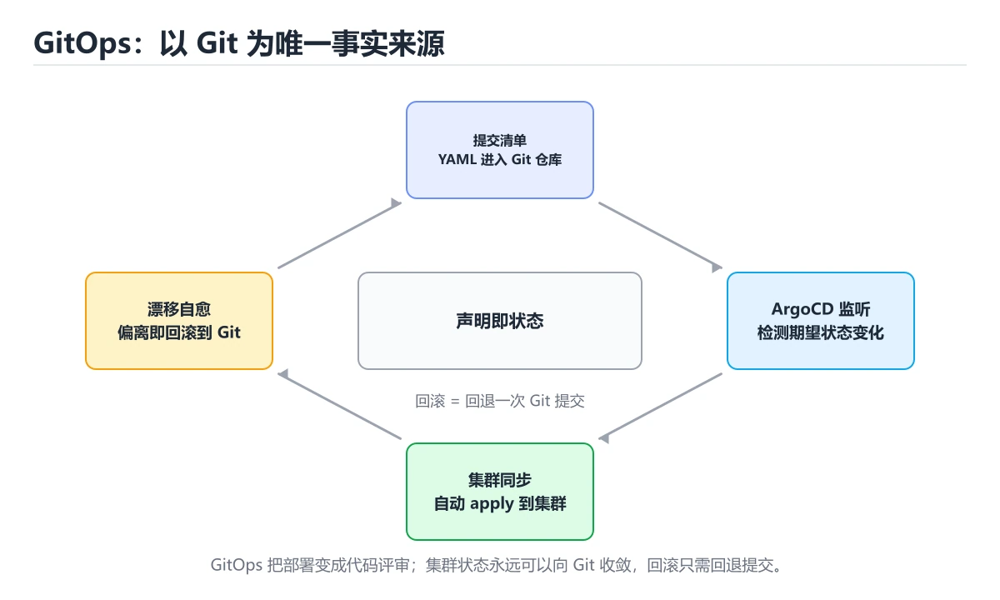

# GitOps 与 ArgoCD




> 内容更新时间：2026-10-03 · 学习阶段：高级 · 预计用时：15 分钟

## 学习目标

- 能用自己的话解释本课主题解决了什么问题，而不是只背术语。
- 能说清 「GitOps」、「ArgoCD」、「声明式」、「漂移」 之间的关系，并分别举出一个例子。
- 能把本课知识放回「工具链」的知识体系，说明它和相邻主题的边界。
- 能完成本课练习，并用验收标准检查自己的结果。

> 一句话摘要：四原则、仓库结构、ArgoCD 概念与落地建议。

## 前置知识

- 先完成上一课《实战：搭一条完整 CI/CD 流水线》；如果已经掌握，可以直接用本课练习自测。
- 开始前先复习：GitOps、ArgoCD、声明式。
- 如果某一步看不懂，先记录具体卡点，完成练习后再回头读一遍。

## GitOps 的四个原则

1. **声明式**：系统的期望状态全部用配置描述（YAML/Helm/Kustomize）。
2. **版本化**：期望状态存在 Git 中，变更即提交，天然有审计与回滚。
3. **自动同步**：集群中的代理持续对比期望状态与实际状态并纠正。
4. **持续协调**：不仅部署一次，而是持续防止漂移。

与传统 CI/CD 的区别：CI 负责构建镜像并更新配置仓库，**CD 由集群内的控制器完成**（拉模型），因此集群不需要把凭据交给外部流水线。

## 仓库结构与流程

| 仓库 | 内容 |
| --- | --- |
| 应用仓库 | 源代码 + Dockerfile + CI 配置 |
| 配置仓库 | 各环境的 K8s 清单（base + overlays，按 env 分目录） |

典型流程：提交代码 → CI 跑测试并构建镜像（tag 用 commit SHA）→ CI 更新配置仓库中的镜像 tag → ArgoCD 检测到差异 → 自动同步到集群 → 健康检查通过。回滚就是 `git revert` 配置提交。

## ArgoCD 核心概念

| 概念 | 说明 |
| --- | --- |
| Application | 一份"配置路径 → 目标集群/命名空间"的映射 |
| Sync | 把 Git 状态应用到集群 |
| Sync Policy | 手动或自动同步，是否允许 prune（删除多余资源）与 self-heal |
| Health | 资源是否健康（Deployment 是否就绪、Pod 是否 Running） |
| Diff | 展示集群实际状态与 Git 期望状态的差异 |

**危险开关**：开启 `prune` 会自动删除 Git 中不存在的资源，务必先在非生产环境验证；`self-heal` 会覆盖手工改动，好处是能自动消除漂移，坏处是紧急手工修复会被回滚（应急时应先暂停同步）。

## 落地建议

1. 环境隔离：dev/staging/prod 使用不同目录与不同 Application，生产需人工审批同步。
2. 密钥不入 Git：用 Sealed Secrets、External Secrets 或 SOPS 加密后提交。
3. 镜像 tag 用不可变标识（commit SHA），禁用 latest。
4. 同步失败要告警并保留历史（ArgoCD 事件 + 通知渠道）。
5. 与 CI 的边界清晰：CI 只产出镜像与配置提交，CD 由集群侧完成。

## 本课小结
GitOps 的价值是**把部署状态收敛到 Git 这一个事实来源**：可审计、可回滚、自动防漂移；ArgoCD 负责对账与同步，而密钥管理、环境隔离与同步策略是落地的三个关键点。

## GitOps 原则速查

| 原则 | 说明 |
| --- | --- |
| 声明式 | 集群期望状态写在清单里 |
| 版本化 | 一切变更经 Git，可审计可回滚 |
| 自动同步 | 控制器持续把集群拉向期望状态 |
| 闭环校验 | 持续对比实际与期望，发现漂移 |
| 单一事实源 | Git 是唯一权威来源 |

## 同步策略速查

| 配置 | 作用 | 建议 |
| --- | --- | --- |
| auto-sync | 自动应用 Git 变更 | 预发开启，生产按需 |
| self-heal | 集群被手工改动后自动恢复 | 生产建议开启 |
| prune | 删除 Git 中已移除的资源 | 谨慎开启并配合白名单 |
| sync-window | 只允许在窗口内同步 | 避开业务高峰 |
| 手动同步 | 人工确认后应用 | 高风险变更使用 |
| 应用顺序 | 通过 wave 或 hook 控制 | 依赖资源先建 |

```yaml
# ArgoCD Application 示例：自动同步 + 自愈，但保留资源删除保护
apiVersion: argoproj.io/v1alpha1
kind: Application
metadata:
  name: orders-api
  namespace: argocd
  finalizers:
    - resources-finalizer.argocd.argoproj.io
spec:
  project: default
  source:
    repoURL: https://git.example.com/platform/manifests.git
    targetRevision: main
    path: apps/prod/orders-api
  destination:
    server: https://kubernetes.default.svc
    namespace: prod
  syncPolicy:
    automated:
      prune: false          # 先不自动删除，避免误删有状态资源
      selfHeal: true        # 手工改动会被纠正
    syncOptions:
      - CreateNamespace=true
      - PruneLast=true
      - ApplyOutOfSyncOnly=true
    retry:
      limit: 3
      backoff:
        duration: 10s
        factor: 2
        maxDuration: 3m
```

```python
from dataclasses import dataclass

@dataclass
class SyncPlan:
    """同步前评估：列出将创建、更新与删除的资源。"""

    to_create: list
    to_update: list
    to_delete: list

    def is_risky(self) -> bool:
        return len(self.to_delete) > 0

    def summary(self) -> dict:
        return {
            "create": len(self.to_create),
            "update": len(self.to_update),
            "delete": len(self.to_delete),
            "risky": self.is_risky(),
        }

    def decision(self, environment: str, allow_prune: bool = False) -> str:
        if environment == "prod" and self.is_risky() and not allow_prune:
            return "需人工确认：生产环境存在资源删除"
        if self.to_delete and not allow_prune:
            return "已阻止：未开启 prune 时不允许删除"
        return "允许同步"

def detect_drift(desired: dict, actual: dict) -> list:
    """漂移检测：找出实际状态与期望不一致的字段。"""
    drift = []
    for key, value in desired.items():
        if actual.get(key) != value:
            drift.append((key, value, actual.get(key)))
    return drift

plan = SyncPlan(to_create=["svc"], to_update=["deploy"], to_delete=["old-config"])
print(plan.summary(), plan.decision("prod"))
print(detect_drift({"replicas": 3}, {"replicas": 5}))
```

## 密钥与多环境速查

| 主题 | 做法 |
| --- | --- |
| 明文密钥 | 禁止入库 |
| 加密方案 | Sealed Secrets、SOPS、External Secrets |
| 环境隔离 | 目录、分支或 ApplicationSet 分环境 |
| 提升流程 | 预发验证后通过 PR 提升到生产 |
| 权限 | 控制器最小权限，只管理目标命名空间 |
| 审计 | 所有变更对应 Git 提交与 PR |

## 常见错误对照表

| 容易踩的做法 | 实际现象 | 原因与正确做法 |
| --- | --- | --- |
| 直接手工改集群 | 被 self-heal 回滚 | 变更走 Git，紧急改动后回填 |
| 生产默认开启 prune | 误删资源 | 先观察后开启，或按需手动 |
| 密钥明文入库 | 泄漏 | 用密封或外部密钥管理 |
| 所有环境同一分支同一路径 | 相互影响 | 按环境隔离目录与 Application |
| 无同步窗口 | 高峰发布引发故障 | 设窗口并避开业务高峰 |
| 控制器权限过大 | 误操作影响面大 | 最小权限 + 项目隔离 |
| 不做漂移监控 | 实际与期望不一致 | 定期检查 OutOfSync |
| 不评审清单 | 危险配置进入 | PR 评审 + 策略校验 |
| 无回滚方案 | 出错只能前滚 | 用 Git revert 回滚 |
| 忽略同步失败告警 | 状态长期不一致 | 告警到值班渠道 |

## 自测清单

- [ ] 集群期望状态全部来自 Git，可审计可回滚。
- [ ] 自动同步与自愈按环境选择，生产慎用 prune。
- [ ] 密钥通过加密方案管理，不入 Git 明文。
- [ ] 有漂移检测、同步窗口与失败告警。
- [ ] 控制器最小权限，变更经 PR 评审。

## 动手练习

> 本课练习重点：围绕「GitOps、ArgoCD、声明式」完成复述、实验和交付，每个结果都要能被别人检查。

先在临时环境执行完整命令链，再模拟失败，最后验证回滚和清理。

### 练习 1：建立心智模型（10 分钟）

合上教程，用 3～5 句话回答：

1. 本课主题解决了什么问题？
2. 如果没有它，会出现什么具体后果？
3. 它和「ArgoCD」是什么关系？

**验收标准**：至少出现一个本课关键词，并写出一个反例、边界条件或失效场景。

### 练习 2：做一次可控实验（20 分钟）

从正文中选一个最小示例，完成以下操作：

1. 先预测修改一个参数、输入或步骤后的结果。
2. 再实际执行或逐步推演，记录真实结果。
3. 如果结果与预测不同，写出差异原因。

**验收标准**：留下「原例 → 改动 → 预测 → 结果 → 原因」五步记录。

### 练习 3：交付一个小结果（30 分钟）

在一个临时目录或本地仓库执行完整命令链，并记录失败时的回滚办法。

任务要求：

- 结果必须能被别人检查，不能只写“我已经理解了”。
- 至少覆盖「GitOps」和「ArgoCD」两个关键词。
- 写出 1 个仍然不确定的问题，以及下一步如何验证。

> 提示：时间有限时优先做练习 1 和练习 2；练习 3 可以拆成两次完成。

## 可运行练习

### 任务 1：先跑通，再解释

```python
from dataclasses import dataclass

@dataclass
class SyncPlan:
    """同步前评估：列出将创建、更新与删除的资源。"""

    to_create: list
    to_update: list
    to_delete: list

    def is_risky(self) -> bool:
        return len(self.to_delete) > 0

    def summary(self) -> dict:
        return {
            "create": len(self.to_create),
            "update": len(self.to_update),
            "delete": len(self.to_delete),
            "risky": self.is_risky(),
        }

    def decision(self, environment: str, allow_prune: bool = False) -> str:
        if environment == "prod" and self.is_risky() and not allow_prune:
            return "需人工确认：生产环境存在资源删除"
        if self.to_delete and not allow_prune:
            return "已阻止：未开启 prune 时不允许删除"
        return "允许同步"

def detect_drift(desired: dict, actual: dict) -> list:
    """漂移检测：找出实际状态与期望不一致的字段。"""
    drift = []
    for key, value in desired.items():
        if actual.get(key) != value:
            drift.append((key, value, actual.get(key)))
    return drift

plan = SyncPlan(to_create=["svc"], to_update=["deploy"], to_delete=["old-config"])
print(plan.summary(), plan.decision("prod"))
print(detect_drift({"replicas": 3}, {"replicas": 5}))
```

### 任务 2：只改一个条件

### 任务 3：迁移到自己的数据

用同一套思路处理一组你自己的数据或场景，保持输出格式与任务 1 一致。

## 故障现场

### 现场 1：本课的 GitOps 常规用例通过，但边界用例失败

**症状**：在本课的练习或生产场景里出现“本课的 GitOps 常规用例通过，但边界用例失败”。

**复现**：准备一组最小输入，只保留触发“本课的 GitOps 常规用例通过，但边界用例失败”的必要条件，连续运行两次确认结果稳定。

**定位**：围绕“GitOps 的前置条件与取值边界没有写进代码，默认值掩盖了空值和极值”检查调用链、输入数据和环境配置，先验证假设再改代码。

**预防**：把“本课的 GitOps 常规用例通过，但边界用例失败”写成一条自动化用例，并在本课的验收清单里保留对应检查项。

### 现场 2：本课的 ArgoCD 结果在两次运行之间不一致

**症状**：在本课的练习或生产场景里出现“本课的 ArgoCD 结果在两次运行之间不一致”。

**复现**：准备一组最小输入，只保留触发“本课的 ArgoCD 结果在两次运行之间不一致”的必要条件，连续运行两次确认结果稳定。

**定位**：围绕“ArgoCD 依赖了当前版本、执行顺序或共享状态，单次运行无法暴露差异”检查调用链、输入数据和环境配置，先验证假设再改代码。

**预防**：把“本课的 ArgoCD 结果在两次运行之间不一致”写成一条自动化用例，并在本课的验收清单里保留对应检查项。

### 现场 3：本课的验证只在开发机通过

**症状**：在本课的练习或生产场景里出现“本课的验证只在开发机通过”。

**定位**：围绕“环境版本、配置和输入规模与目标环境不同，GitOps 缺少可重复的验证记录”检查调用链、输入数据和环境配置，先验证假设再改代码。

## 本课复习清单

离开本课前，逐项确认：

- [ ] 不看解析，能说出「GitOps 与传统 CD 的关键区别是？」的判断依据。
- [ ] 不看解析，能说出「ArgoCD 的 prune 开关作用是？」的判断依据。
- [ ] 不看解析，能说出「为什么紧急手工修复可能被自动回滚？」的判断依据。
- [ ] 不看解析，能说出「ArgoCD 的 auto-sync 与 self-heal 的区别是？」的判断依据。
- [ ] 不看解析，能说出「GitOps 中敏感信息（如数据库口令）应如何管理？」的判断依据。
- [ ] 不看解析，能说出「补全代码：本课主题示例中，下面这行代码缺少哪个关键字或…」的判断依据。
- [ ] 至少运行一次本课示例，记录输入、输出和一个边界情况。
- [ ] 把本课最容易混淆的两个概念写成一句话对照。

| 复盘项 | 记录 |
| --- | --- |
| 已经能独立解释的考点 |  |
| 仍然说不清的概念 |  |
| 下一步验证动作 |  |

## 术语速查

| 术语 | 本课语境 |
| --- | --- |
| `git revert` | 典型流程：提交代码 → CI 跑测试并构建镜像（tag 用 commit SHA）→ CI 更新配置仓库中的镜像 tag → ArgoCD 检测到差异 → 自动同步到集群 → 健康检查通过。回滚就是 `git rever… |
| `prune` | 危险开关**：开启 `prune` 会自动删除 Git 中不存在的资源，务必先在非生产环境验证；`self-heal` 会覆盖手工改动，好处是能自动消除漂移，坏处是紧急手工修复会被回滚（应急时应先暂停同步）。 |
| `self-heal` | 危险开关**：开启 `prune` 会自动删除 Git 中不存在的资源，务必先在非生产环境验证；`self-heal` 会覆盖手工改动，好处是能自动消除漂移，坏处是紧急手工修复会被回滚（应急时应先暂停同步）。 |
| `GitOps` | 本课围绕该主题展开，结合正文与代码示例理解它的适用边界。 |
| `ArgoCD` | 本课围绕该主题展开，结合正文与代码示例理解它的适用边界。 |
| `声明式` | 本课围绕该主题展开，结合正文与代码示例理解它的适用边界。 |
| `漂移` | 本课围绕该主题展开，结合正文与代码示例理解它的适用边界。 |
| `Sealed Secrets` | 本课围绕该主题展开，结合正文与代码示例理解它的适用边界。 |

## 考点精讲

### 考点 1：GitOps 与传统 CD 的关键区别是？

- **判断依据**：正确答案是「由集群内控制器从 Git 拉取并持续对账」。拉模型让集群不必把凭据交给外部流水线，并能持续纠正漂移。判断这类题时，要把「由集群内控制器从 Git 拉取并持续对账」放回题干限定的对象、输入和边界，「不使用容器」、「不需要配置」 等说法虽然包含相关术语，但范围或前提与本题不一致。

### 考点 2：ArgoCD 的 prune 开关作用是？

- **判断依据**：本题应选「删除 Git 中不存在的集群资源」。属于危险开关，必须先在非生产环境验证。解题的关键不是记住孤立术语，而是确认「删除 Git 中不存在的集群资源」是否完整覆盖题干的输入、输出和失败路径，并排除「清理日志」、「压缩镜像」这类相邻概念。

### 考点 3：下面这段 Python 代码复现了“GitOps 与 ArgoCD”中 GitOps、ArgoCD、声明式 相关的一个常见故障，哪一项最准确地解释了问题？

- **判断依据**：符合题干条件的是「遍历列表时直接删除元素，后续元素被跳过（gitops_argocd 第 3 题）；应遍历副本或构造新列表」（gitops_argocd 第 3 题）。符合题干条件的是遍历列表时直接删除元素，后续元素被跳过（gitops_argocd 第 3 题）。应遍历副本或构造新列表（gitops_argocd 第 3 题）。符合题干条件的是遍历列表时直接删除元素，后续元素被跳过（gitopsargocd 第 3 题）。

### 考点 4：围绕“GitOps 与 ArgoCD”中的 GitOps、ArgoCD、声明式，下列哪两项是本课强调的实践判断？

- **判断依据**：正确答案包括「学习 GitOps 时要同时说明输入、输出和失败路径，不能只看正常流程」、「验证 ArgoCD 时要固定版本并覆盖边界输入，结论才可复现」。结论应落在学习 GitOps 时要同时说明输入、输出和失败路径。本课把本课主题拆成概念、示例与故障现场三部分，因此判断 GitOps 时必须同时交代输入、输出和失败路径，这使“学习 GitOps 时要同时说明输入、输出和失败路径，不能只看正常流程”成立。在本课主题里，判断 ArgoCD 时要固定版本与边界输入，所以“验证 ArgoCD 时要固定版本并覆盖边界输入，结论才可复现”才可复现。

### 考点 5：GitOps 中敏感信息（如数据库口令）应如何管理？

- **判断依据**：正确答案是「使用 Sealed Secrets」。也可以在集群内引入 External Secrets 从密钥服务动态拉取。判断这类题时，要把「使用 Sealed Secrets」放回题干限定的对象、输入和边界，「直接写在 Deployment 里」、「写在镜像标签中」 等说法虽然包含相关术语，但范围或前提与本题不一致。

### 考点 6：补全代码：「GitOps 与 ArgoCD」示例中，下面这行代码缺少哪个关键字或函数名？请填入 ____。

`server: https://____.default.svc`

- **判断依据**：围绕 补全代码：本课主题示例中，下面这行代码缺少… 作答时，先用GitOps建立输入与输出的基线，再把kubernetes代入边界条件核对，结论才能复现。解题的关键不是记住孤立术语，而是确认「kubernetes」是否完整覆盖题干的输入、输出和失败路径，并排除这类相邻概念。

## English Overview

**Title:** GitOps & ArgoCD

**Summary:** Principles, repo layout, ArgoCD concepts and practices.

**Category:** Toolchain
**Level:** 高级
**Key terms:** GitOps, ArgoCD, 声明式, 漂移, Sealed Secrets

## 内容元数据

- 内容版本：v2.0
- 最后更新：2026-10-03
- 学习阶段：高级
- 适用环境：Git / Docker / Kubernetes / CI 平台
- 内容来源：内置结构化课程与工程实践整理
- 相关主题：GitOps、ArgoCD、声明式、漂移、Sealed Secrets
- 质量版本：P0 测验标准 + P1 覆盖扩展 + P2 体验补全


## 参考资料与复核

- 最后复核：2026-10-04
- 下次复核：2027-04-04
- 复核范围：版本兼容、API 行为、安全建议与工程实践
- 来源性质：官方文档、标准或权威教材；正文为离线教学重组

| 参考资料 | 本课用途 |
| --- | --- |
| [GitHub Actions](https://docs.github.com/actions) | CI/CD 工作流 |
| [Git 文档](https://git-scm.com/doc) | 版本控制与分支模型 |
| [npm 文档](https://docs.npmjs.com/) | JavaScript 包管理 |

> 「GitOps 与 ArgoCD」的链接用于离线阅读后的延伸核对；App 不会自动联网。
