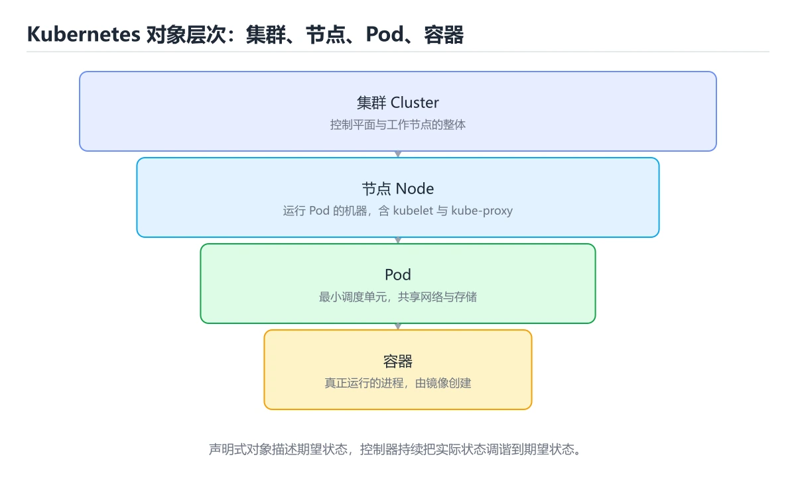

# Kubernetes 基础




> 内容更新时间：2026-10-06 · 学习阶段：高级 · 预计用时：30 分钟

## 学习目标

- 能用自己的话解释Kubernetes 基础解决了什么问题，而不是只背术语。
- 能说清 「Kubernetes」、「Pod」、「Deployment」、「Service」 之间的关系，并分别举出一个例子。
- 能把 Kubernetes 放回「Kubernetes 基础」的知识体系，说明它和 Pod 的边界。
- 能完成本课练习，并用验收标准检查自己的结果。

> 一句话摘要：声明式对象模型、Deployment/Service、探针与发布策略。

## 前置知识

- 先完成上一课《CI/CD 与 GitHub Actions》；如果已经掌握，可以直接用本课练习自测。
- 开始前先复习：Kubernetes、Pod、Deployment。
- 看不懂就直接缩小例子：只保留 Kubernetes 相关的两行输入，跑通后再加回其余部分。

## 它解决什么问题

Docker 解决了「怎么打包与运行单个容器」，Kubernetes（K8s）解决**集群级别的编排**：调度、扩缩容、自愈、滚动发布、服务发现与配置管理。

```text
期望状态（YAML 声明） -> 控制器持续对比实际状态 -> 不一致就自动纠正
```

这就是「声明式 API + 控制循环」：你描述想要什么，而不是一步步命令怎么做。

## 核心对象

| 对象 | 作用 |
| --- | --- |
| Pod | 最小调度单位，包含一个或多个容器 |
| Deployment | 管理 Pod 副本数、滚动更新与回滚 |
| Service | 为一组 Pod 提供稳定访问入口与负载均衡 |
| Ingress | 七层入口，按域名/路径路由 |
| ConfigMap / Secret | 注入配置与密钥 |
| StatefulSet | 有状态服务（数据库），Pod 有稳定标识与存储 |
| Job / CronJob | 一次性任务与定时任务 |
| HPA | 按 CPU/自定义指标自动扩缩容 |

## 一个最小 Deployment

```yaml
apiVersion: apps/v1
kind: Deployment
metadata:
  name: web
spec:
  replicas: 3
  selector:
    matchLabels: { app: web }
  template:
    metadata:
      labels: { app: web }
    spec:
      containers:
        - name: web
          image: registry.example.com/web:1.2.0
          ports: [{ containerPort: 8080 }]
          envFrom:
            - configMapRef: { name: web-config }
          resources:
            requests: { cpu: "100m", memory: "128Mi" }
            limits: { cpu: "500m", memory: "512Mi" }
          readinessProbe:
            httpGet: { path: /healthz, port: 8080 }
          livenessProbe:
            httpGet: { path: /healthz, port: 8080 }
```

`requests` 影响调度，`limits` 影响超限行为；**探针配错会导致容器反复重启**——readiness 失败只是摘流量，liveness 失败会重启容器。

## 常用命令

```bash
kubectl apply -f deployment.yaml        # 声明式应用配置
kubectl get pods -o wide                 # 查看 Pod 与所在节点
kubectl describe pod web-xxx             # 排查调度/镜像/探针问题
kubectl logs -f web-xxx                  # 查看日志
kubectl exec -it web-xxx -- sh           # 进入容器
kubectl rollout status deploy/web        # 观察滚动更新
kubectl rollout undo deploy/web          # 回滚上一版本
kubectl scale deploy/web --replicas=5    # 手动扩缩容
kubectl port-forward svc/web 8080:80     # 本地调试
```

排查顺序：`get`（状态）→ `describe`（事件）→ `logs`（应用日志）。

## 发布与流量

```text
滚动更新 RollingUpdate：逐批替换，最常用，要求服务可同时跑多版本
蓝绿发布：新旧两套环境，切流量秒级回滚
金丝雀 Canary：先放 5% 流量观察指标，再逐步放大
```

配合 Service 的标签选择器与 Ingress 权重，就能用原生能力实现灰度。

## 什么时候不需要 K8s

1. 只有一两个服务、单机 Docker 足够时。
2. 团队没有运维能力，托管容器平台（Cloud Run、App Runner）更省心。
3. 需要极简部署的静态站点或小工具。

K8s 的复杂度是真实成本：集群、网络、存储、证书、监控都要有人负责。

## Service 与 Ingress 完整示例

```yaml
apiVersion: v1
kind: Service
metadata:
  name: web
spec:
  selector: { app: web }        # 靠标签选中 Pod
  ports:
    - port: 80                  # Service 对外端口
      targetPort: 8080          # 容器实际监听端口
  type: ClusterIP               # 集群内访问；对外用 Ingress
---
apiVersion: networking.k8s.io/v1
kind: Ingress
metadata:
  name: web
  annotations:
    nginx.ingress.kubernetes.io/rewrite-target: /
spec:
  ingressClassName: nginx
  rules:
    - host: example.com
      http:
        paths:
          - path: /
            pathType: Prefix
            backend:
              service:
                name: web
                port: { number: 80 }
```

三层关系：**Pod 提供能力 → Service 提供稳定入口 → Ingress 提供域名与路径路由**。Service 的 selector 必须与 Pod 的 labels 完全匹配，否则 endpoints 为空（表现为 503）。

## 五类常见故障与排错

| 现象 | 排查命令 | 常见原因 |
| --- | --- | --- |
| Pod 一直 Pending | `kubectl describe pod` 看 Events | 资源不足、节点选择器/污点不匹配、PVC 未绑定 |
| ImagePullBackOff | `describe` 看拉取错误 | 镜像名/tag 写错、私有仓库缺 imagePullSecret |
| CrashLoopBackOff | `kubectl logs --previous` | 应用启动失败、配置缺失、探针过严 |
| Service 访问 503 | `kubectl get endpoints web` | selector 与 labels 不匹配，或 Pod 未 Ready |
| Ingress 404 | `kubectl describe ingress` | path/host 规则不匹配、ingressClassName 错误 |

排错的黄金顺序：`get`（状态）→ `describe`（事件）→ `logs`（应用）→ `exec`（进容器验证）。

## 本课小结

K8s 的关键是**声明式 + 控制循环**：Pod 是最小单位，Deployment 管副本，Service 管访问，探针管健康，HPA 管弹性。先用好这五个，再扩展到存储与网络策略。

## kubectl 常用命令速查

| 目的 | 命令 |
| --- | --- |
| 查看资源列表 | `kubectl get pods -n prod -o wide` |
| 持续观察变化 | `kubectl get pods -w` |
| 查看详情与事件 | `kubectl describe pod <name>` |
| 查看日志 | `kubectl logs -f <pod> -c <container> --tail=200` |
| 查看上一次崩溃日志 | `kubectl logs <pod> --previous` |
| 进入容器 | `kubectl exec -it <pod> -- sh` |
| 端口转发 | `kubectl port-forward svc/api 8080:80` |
| 查看资源定义 | `kubectl get deploy api -o yaml` |
| 应用变更 | `kubectl apply -f deploy.yaml` |
| 删除资源 | `kubectl delete -f deploy.yaml` |
| 滚动重启 | `kubectl rollout restart deploy/api` |
| 查看发布状态 | `kubectl rollout status deploy/api` |
| 回滚 | `kubectl rollout undo deploy/api --to-revision=3` |
| 查看历史版本 | `kubectl rollout history deploy/api` |
| 查看资源占用 | `kubectl top pod` / `kubectl top node` |
| 查看事件（按时间） | `kubectl get events --sort-by=.lastTimestamp` |
| 查看节点标签 | `kubectl get nodes --show-labels` |
| 临时调试 | `kubectl run debug --rm -it --image=nicolaka/netshoot -- sh` |

## 核心资源速查

| 资源 | 作用 | 关键点 |
| --- | --- | --- |
| Pod | 最小调度单位 | 一般不直接创建，由控制器管理 |
| Deployment | 无状态应用 | 副本数、滚动更新、回滚 |
| StatefulSet | 有状态应用 | 稳定标识、顺序部署、配合 PVC |
| DaemonSet | 每节点一个 | 日志采集、监控代理 |
| Job / CronJob | 一次性 / 定时任务 | 注意并发策略与历史保留数 |
| Service | 稳定访问入口 | ClusterIP、NodePort、LoadBalancer、Headless |
| Ingress | 七层入口 | 域名与路径路由、TLS |
| ConfigMap / Secret | 配置与密钥 | 变更后需重启或滚动更新才生效 |
| PVC / StorageClass | 持久化存储 | 注意访问模式与回收策略 |
| HPA | 自动扩缩容 | 依赖资源 requests 与指标服务 |
| Namespace / RBAC | 隔离与权限 | 最小权限原则 |

```yaml
apiVersion: apps/v1
kind: Deployment
metadata:
  name: api
spec:
  replicas: 3
  strategy:
    rollingUpdate: { maxSurge: 1, maxUnavailable: 0 }   # 先起新副本再停旧副本
  selector:
    matchLabels: { app: api }
  template:
    metadata:
      labels: { app: api }
    spec:
      containers:
        - name: api
          image: registry/api:1.0.3
          ports: [{ containerPort: 8080 }]
          resources:
            requests: { cpu: 200m, memory: 256Mi }      # 调度依据，必须设置
            limits: { cpu: "1", memory: 512Mi }
          readinessProbe:                                # 未就绪不接流量
            httpGet: { path: /healthz, port: 8080 }
            initialDelaySeconds: 5
          livenessProbe:                                 # 失败则重启容器
            httpGet: { path: /livez, port: 8080 }
            periodSeconds: 10
```

## 常见错误与排查

| 现象 | 常见原因 | 处理方式 |
| --- | --- | --- |
| Pod 一直 `Pending` | 资源不足、节点选择器不匹配、PVC 未绑定 | `kubectl describe pod` 看事件 |
| Pod 反复 `CrashLoopBackOff` | 启动即崩溃、配置缺失、依赖不可用 | 看 `logs --previous` 与退出码 |
| Pod 一直 `ContainerCreating` | 镜像拉取慢、挂载失败 | `describe` 查看具体事件 |
| `ImagePullBackOff` | 镜像名错、私有仓库无凭据 | 检查名称与 `imagePullSecrets` |
| 服务 502 / 503 | 就绪探针失败、端口配置错误 | 检查 `readinessProbe` 与 Service 的 `targetPort` |
| `OOMKilled` | 内存超限 | 提高 limit 或修内存泄漏 |
| 资源使用率不高但扩容了 | 只设置了 limits 没设 requests | 必须同时设置 requests |
| 配置更新后没生效 | 环境变量只在启动时注入 | 重启 Pod（`rollout restart`） |
| 探针导致频繁重启 | 初始化慢而 liveness 过严 | 加 `startupProbe` 或放宽阈值 |
| 直接改 Pod | 重建后改动丢失 | 改 Deployment 等控制器资源 |
| 节点磁盘压力驱逐 Pod | 日志未轮转、镜像堆积 | 配置日志轮转与镜像清理 |

## 复习与自测

- [ ] 会用 `get`、`describe`、`logs`、`exec` 四件套排查问题。
- [ ] 知道 readiness 与 liveness 探针的区别，并会设 `startupProbe`。
- [ ] 所有容器都设置了 requests 与 limits。
- [ ] 发布使用 `rollout status` 观察，必要时 `rollout undo` 回滚。
- [ ] 配置与密钥分离管理，敏感信息放 Secret。

## 动手练习

> 本课练习重点：围绕「Kubernetes、Pod、Deployment」完成复述、实验和交付，每个结果都要能被别人检查。

把 containerPort 的部署命令在临时环境跑通，再注入一次失败。

### 练习 1：建立心智模型（10 分钟）

合上教程，用 3～5 句话回答：

1. Kubernetes 基础解决了什么问题？
2. 如果没有它，会出现什么具体后果？
3. 它和「Pod」是什么关系？

验收标准：说明 Kubernetes 与 Pod 的分工，并写出一个失效场景。

### 练习 2：做一次可控实验（20 分钟）

从正文中选一个最小示例，完成以下操作：

1. 先预测修改一个参数、输入或步骤后的结果。
2. 再实际执行或逐步推演，记录真实结果。
3. 如果结果与预测不同，写出差异原因。

**验收标准**：把 containerPort 当作原例，改动一次Pod的取值，记录命令、输出与差异原因；五步里缺任意一步都算未完成。

### 练习 3：交付一个小结果（30 分钟）

把 containerPort 的构建与运行命令写成脚本，在干净环境里跑一遍。

任务要求：

- 结果必须能被别人检查，不能只写“我已经理解了”。
- 至少覆盖「Kubernetes」和「Pod」两个关键词。
- 写出 1 个仍然不确定的问题，以及下一步如何验证。

> 提示：时间有限时优先做练习 1 和练习 2；练习 3 可以拆成两次完成。

## 可运行练习

本节围绕Kubernetes 基础安排 3 个可交付任务，每个任务都要求留下可以复查的记录。

### 任务 1：用自己的话画出结构

不看书，用一张图说清「Kubernetes 基础」的结构，画完再对照骨架：

- 主干：它解决什么问题 → 核心对象 → 一个最小 Deployment → 常用命令
- 连接线：在每条边上标出输入、输出与失败路径。
- 自检：能否用一句话说明Kubernetes与Pod的关系？

### 任务 2：做一次对比实验

**验收标准**：两个方案的差异必须落在「Kubernetes 基础」的实际约束上；写清当Kubernetes越过哪条边界时应该换方案。

### 任务 3：迁移到自己的场景

**验收标准**：结论要能追溯到「它解决什么问题」的具体段落，并说明它和 Pod 的边界。

## 故障现场

### 现场 1：Pod 一直 Pending

**症状**：在《Kubernetes 基础》的复现场景中，资源不足、节点选择器不匹配、PVC 未绑定。

**根因**：“资源不足、节点选择器不匹配、PVC 未绑定”只是表层结果。向上追溯会落到“Pod 一直 Pending”这一步，因为它省略了《Kubernetes 基础》的约束，使实现行为和预期模型发生了偏离。

**修复**：针对《Kubernetes 基础》的问题，kubectl describe pod 看事件。

**验证**：在《Kubernetes 基础》中按“kubectl describe pod 看事件”调整后，从“Pod 一直 Pending”的触发条件重放同一条路径，确认“资源不足、节点选择器不匹配、PVC 未绑定”不再出现，并补一个相邻边界用例检查没有引入新问题。

### 现场 2：Pod 反复 CrashLoopBackOff

**症状**：在《Kubernetes 基础》的复现场景中，启动即崩溃、配置缺失、依赖不可用。

**根因**：当出现“Pod 反复 CrashLoopBackOff”时，执行路径已经绕过了《Kubernetes 基础》的关键约束，最终以“启动即崩溃、配置缺失、依赖不可用”暴露出来；修复前必须先确认约束在哪里失效。

**修复**：针对《Kubernetes 基础》的问题，看 logs --previous 与退出码。

**验证**：在《Kubernetes 基础》中按“看 logs --previous 与退出码”调整后，从“Pod 反复 CrashLoopBackOff”的触发条件重放同一条路径，确认“启动即崩溃、配置缺失、依赖不可用”不再出现，并补一个相邻边界用例检查没有引入新问题。

### 现场 3：Pod 一直 ContainerCreating

**症状**：在《Kubernetes 基础》的复现场景中，镜像拉取慢、挂载失败。

**根因**：触发点是把“Pod 一直 ContainerCreating”当成安全做法。它没有满足《Kubernetes 基础》要求的前提，因此先表现为“镜像拉取慢、挂载失败”；排查时先完整复现这一段，再核对输入、配置与依赖。

**修复**：针对《Kubernetes 基础》的问题，describe 查看具体事件。

**验证**：保留《Kubernetes 基础》里触发“镜像拉取慢、挂载失败”的输入、版本和日志，按“describe 查看具体事件”完成修改后原样重放；只有失败现象消失且相邻场景仍可解释，才保留改动。

## 本课复习清单

离开本课前，逐项确认：

- [ ] 不看解析，能说出「Kubernetes 的核心工作方式是？」的判断依据。
- [ ] 不看解析，能说出「K8s 中最小的调度单位是？」的判断依据。
- [ ] 不看解析，能说出「readinessProbe 与 livenessProbe 的区别是？」的判断依据。
- [ ] 不看解析，能说出「Deployment 与 StatefulSet 的区别是？」的判断依据。
- [ ] 不看解析，能说出「Kubernetes 中 Service 的作用是？」的判断依据。
- [ ] 跑通「Kubernetes 基础」的最小示例，并记录一次失败输入的处理方式。
- [ ] 把本课最容易混淆的两个概念写成一句话对照。

| 复盘项 | 记录 |
| --- | --- |
| 已经能独立解释的考点 |  |
| 仍然说不清的概念 |  |
| 下一步验证动作 |  |

## 术语速查

| 术语 | 一句话说明 |
| --- | --- |
| `requests` | `requests` 影响调度，`limits` 影响超限行为；**探针配错会导致容器反复重启**——readiness 失败只是摘流量，liveness 失败会重启容器。 |
| `探针` | liveness、readiness、startup 三种健康检查，配置不当会误杀容器或过早导入流量。 |
| `资源请求与限制` | requests 决定调度时的预留量，limits 决定运行时的上限，两者共同决定 Pod 的服务质量等级。 |
| `调度` | kube-scheduler 按资源、污点与亲和性把 Pod 放到合适的节点上，Pending 多半卡在这一步。 |
| `Pod` | Kubernetes 最小调度单元，包含一个或多个共享网络与存储的容器 |

## 考点精讲

### 考点 1：代码补全·Kubernetes

- **题目**：这段代码是「Kubernetes 基础」的示例片段，下面哪一项描述与它一致？
- **判断依据**：在「Kubernetes 基础」里，这段代码只做静态声明，没有循环、分支或可观察输出。这段代码出自「Kubernetes 基础」的正文示例，围绕Kubernetes、Pod、Deployment展开；把输入或边界换成空值、极值或失败情况后，结论要以「Kubernetes 基础」的实际运行结果为准。

### 考点 2：概念判断·Kubernetes

- **题目**：K8s 中最小的调度单位是？
- **判断依据**：Pod 可包含一个或多个共享网络与存储的容器。在「Kubernetes 基础」里，其他选项：Deployment 是工作负载控制器，Node 是运行机器，容器是最小运行单元但不是调度单位。「Kubernetes 基础」要求先交代Kubernetes、Pod、Deployment的前提再下结论，所以“Pod”只在题干“K8s 中最小的调度单位是”给定的条件下成立。

### 考点 3：多选辨析·Kubernetes

- **题目**：围绕“Kubernetes 基础”中的 Kubernetes、Pod、Deployment，下列哪两项是本课强调的实践判断？
- **判断依据**：本课把Kubernetes 基础拆成概念、示例与故障现场三部分，因此判断 Kubernetes 时必须同时交代输入、输出和失败路径，这使“学习 Kubernetes 时要同时说明输入、输出和失败路径，不能只看正常流程”成立。在Kubernetes 基础里，判断 Pod 时要固定版本与边界输入，所以“验证 Pod 时要固定版本并覆盖边界输入，结论才可复现”才可复现。

### 考点 4：概念判断·Kubernetes

- **题目**：Deployment 与 StatefulSet 的区别是？
- **判断依据**：在「Kubernetes 基础」里，结论应落在「Deployment 的 Pod 可互换」。数据库、消息队列等有状态组件通常用 StatefulSet 加 PVC。在「Kubernetes 基础」里，这道题要求区分概念与边界，「Deployment 的 Pod 可互换」只有在题干给出的前提下才成立，而「两者完全等价」、「StatefulSet 不能挂载存储」缺少同一组条件。

### 考点 5：概念判断·Kubernetes

- **题目**：Kubernetes 中 Service 的作用是？
- **判断依据**：在「Kubernetes 基础」里，为一组 Pod 提供稳定虚拟 IP 与负载均衡。ClusterIP、NodePort、LoadBalancer 与 Headless 是常见的几种 Service 形态。回到「Kubernetes 基础」的正文示例，用“Kubernetes 中 Servi”走一遍Kubernetes、Pod、Deployment的完整流程，能复现的结论才可以保留。

### 考点 6：填空·____: nginx

- **题目**：补全代码：「Kubernetes 基础」示例中，下面这行代码缺少哪个关键字或函数名？请填入 ____。 `____: nginx`
- **判断依据**：空格应填写「ingressClassName」、「ingressclassname」。「Kubernetes 基础」要求先交代Kubernetes、Pod、Deployment的前提再下结论，所以“ingressClassName”只在题干“Kubernetes 基础示例中”给定的条件下成立。

## English Overview

**Title:** Kubernetes Basics

**Summary:** Declarative objects, workloads, probes and rollouts.

**Category:** Toolchain
**Level:** 高级
**Key terms:** Kubernetes, Pod, Deployment, Service, 探针, 滚动更新

## 内容元数据

- 内容版本：v2.0
- 最后更新：2026-10-06
- 学习阶段：高级
- 适用环境：Git / Docker / Kubernetes / CI 平台
；本课聚焦 Kubernetes。
- 内容来源：内置结构化课程与工程实践整理
- 相关主题：Kubernetes、Pod、Deployment、Service、探针、滚动更新
- 质量版本：P0 测验标准 + P1 覆盖扩展 + P2 体验补全

## 参考资料与复核

- 最后复核：2026-10-04
- 下次复核：2027-08-24
- 复核范围：版本兼容、API 行为、安全建议与工程实践
- 来源性质：官方文档、标准或权威教材；正文为离线教学重组

| 参考资料 | 本课用途 |
| --- | --- |
| [Kubernetes 文档](https://kubernetes.io/docs/) | 编排、服务与配置 |
| [CMake 文档](https://cmake.org/documentation/) | 跨平台构建与依赖 |
| [Git 文档](https://git-scm.com/doc) | 版本控制与分支模型 |

> 「Kubernetes 基础」的链接用于离线阅读后的延伸核对；App 不会自动联网。

