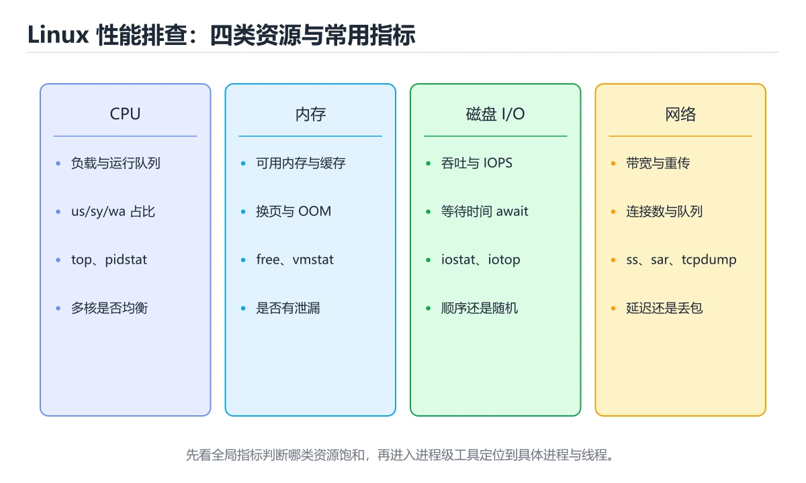
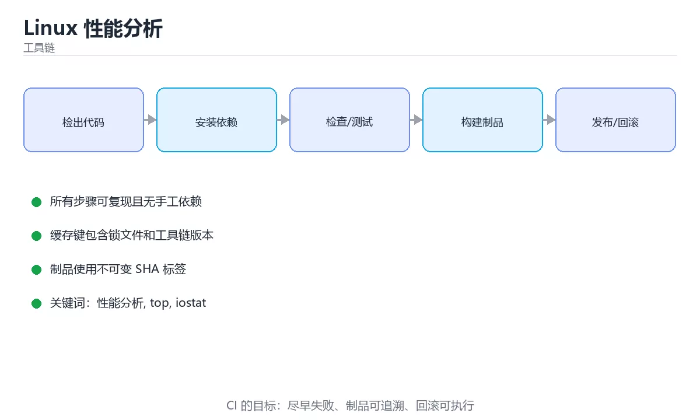

# Linux 性能分析





> 内容更新时间：2026-10-03 · 学习阶段：高级 · 预计用时：16 分钟

## 学习目标

- 能用自己的话解释「Linux 性能分析」解决了什么问题，而不是只背术语。
- 能说清 「性能分析」、「top」、「iostat」、「perf」 之间的关系，并分别举出一个例子。
- 能把本课知识放回「工具链」的知识体系，说明它和相邻主题的边界。
- 能完成本课练习，并用验收标准检查自己的结果。

> 一句话摘要：CPU/内存/IO/网络排查与火焰图。

## 前置知识

- 先完成上一课《Terraform 与基础设施即代码》；如果已经掌握，可以直接用本课练习自测。
- 本课阶段：高级。建议具备同一方向的完整基础，能阅读较长的代码、配置或系统设计说明。
- 开始前先复习：性能分析、top、iostat。
- 如果某一步看不懂，先记录具体卡点，完成练习后再回头读一遍。


## 先建立全局观

性能问题先分清四类资源：**CPU、内存、磁盘 IO、网络**。排查顺序是先看全局负载，再定位到进程，最后深入系统调用与调用栈。

## 常用工具与指标

| 工具 | 关注点 |
| --- | --- |
| top / htop | 负载、CPU 使用、内存占用 |
| vmstat 1 | 运行队列 r、换页 si/so、上下文切换 |
| iostat -x 1 | 磁盘 %util、await、IOPS |
| free -h | 可用内存、Swap 使用 |
| sar / pidstat | 历史趋势与单进程资源 |
| ss -s / netstat | 连接数、监听端口、TCP 状态 |
| perf top / perf record | CPU 热点函数、火焰图 |

## 快速判断

1. 负载高但 CPU 空闲 → 多在等 IO（磁盘或网络）。
2. `si/so` 持续非零 → 内存不足在换页，性能会断崖式下降。
3. `%util` 接近 100% 且 await 高 → 磁盘瓶颈。
4. 上下文切换极高 → 锁竞争或线程过多。
5. 大量 TIME_WAIT / CLOSE_WAIT → 连接未正确复用或未关闭。

## 一次完整排查流程

第一步用 `uptime` 与 `top` 看负载和 CPU 分布（us/sy/wa/id）；第二步用 `vmstat`、`iostat`、`free` 判断是 CPU、内存还是 IO 受限；第三步用 `pidstat`、`ss` 锁定具体进程与连接；第四步用 `perf`、`strace` 深入函数与系统调用；最后结合应用日志与 APM 链路确认根因。

## 火焰图

`perf record -F 99 -p <pid> -g -- sleep 30` 采集后生成火焰图，横轴是时间占比，纵轴是调用栈。**越宽的函数占用 CPU 越多**，是定位热点最直观的方式。

## 应用层常见原因

| 现象 | 常见原因 |
| --- | --- |
| CPU 打满 | 死循环、正则回溯、序列化开销、GC 频繁 |
| 内存增长 | 缓存无上限、连接未释放、内存泄漏 |
| 延迟抖动 | GC 停顿、锁竞争、线程池过小 |
| IO 等待高 | 日志同步刷盘、大文件读写、数据库慢查询 |

## 排查原则

1. 先测量再优化，不要凭直觉改代码。
2. 一次只改一个变量，改动后复测对比。
3. 区分「吞吐量」与「延迟」，二者优化方向常常相反。
4. 在压测环境复现问题，生产上优先用只读工具（避免影响业务）。
5. 记录基线与变更，性能优化是长期工程。

## 一套可复制的排查脚本

| 步骤 | 命令 | 看什么 |
| --- | --- | --- |
| 1 全局水位 | uptime、top | 负载、us/sy/wa/id 分布 |
| 2 内存与换页 | free -h、vmstat 1 | 可用内存、si/so 是否持续非零 |
| 3 磁盘 IO | iostat -x 1 | %util 是否接近 100%、await 是否偏高 |
| 4 进程定位 | pidstat -u -d 1、top -H | 哪个进程/线程在消耗 |
| 5 网络 | ss -s、sar -n DEV 1 | 连接数、重传、带宽是否打满 |
| 6 深入 | perf top/record、strace -p | 热点函数与阻塞的系统调用 |

判定口诀：**CPU 高看 us/sy（用户态还是内核态）；wa 高看磁盘；si/so 非零看内存；负载高但 CPU 空闲看 IO 等待**。压测时同时记录这些指标，才能区分"应用慢"与"资源不够"。

常用组合示例：怀疑 GC 频繁用 `pidstat -u 1` 观察 CPU 周期性峰值；怀疑锁竞争用 `perf lock` 或 `strace -c -p` 统计 futex 调用；怀疑 DNS 慢用 `strace -e trace=network -p` 看 connect 前的解析耗时。

## 本课小结
性能分析的关键是**分层定位**：先用全局指标判断瓶颈类型，再逐层缩小到进程、函数与调用栈，最后用数据验证优化效果。


## USE 方法与工具速查

| 资源 | 利用率 | 饱和度 | 错误 | 工具 |
| --- | --- | --- | --- | --- |
| CPU | `%user+%sys` | 运行队列长度 | 硬件错误 | `top`、`vmstat`、`pidstat` |
| 内存 | 已用比例 | swap 换页 si/so | OOM 记录 | `free`、`vmstat`、`dmesg` |
| 磁盘 | `%util` | 队列长度 await | IO 错误 | `iostat`、`iotop` |
| 网络 | 带宽利用率 | 重传与丢包 | 错误计数 | `sar -n`、`ss`、`ip -s` |
| GPU | 使用率 | 显存占用 | Xid 错误 | `nvidia-smi`、`dcgm` |

## 排查顺序速查

| 步骤 | 动作 | 命令 |
| --- | --- | --- |
| 1 现象 | 确认慢在哪一层 | 用户反馈、端到端延迟 |
| 2 负载 | 系统整体压力 | `uptime`、`vmstat 1` |
| 3 资源 | 找饱和资源 | `top`、`iostat`、`free` |
| 4 进程 | 定位到具体进程 | `pidstat -p <pid> 1` |
| 5 热点 | 定位函数与调用栈 | `perf top`、火焰图 |
| 6 验证 | 改一处再测 | 前后对比同口径指标 |

```bash
# 一、整体：负载、CPU、内存、IO、换页
uptime && vmstat 1 5

# 二、进程级：谁在吃 CPU、内存、IO
pidstat -u -r -d 1 3
ps -eo pid,ppid,pcpu,pmem,rss,etime,cmd --sort=-pcpu | head

# 三、磁盘与网络
iostat -xz 1 3 | tail -20
sar -n DEV 1 3 | tail -10

# 四、热点函数与火焰图（采样 30 秒）
perf record -F 99 -g -p <pid> -- sleep 30
perf report --stdio | head -30

# 五、系统调用与文件：看谁在拖慢
strace -c -f -p <pid> &        # 统计系统调用耗时占比
sleep 10 && kill %1
lsof -p <pid> | wc -l          # 文件描述符数量
```

```python
from dataclasses import dataclass

@dataclass
class UseFinding:
    resource: str
    utilization: float      # 0 到 1
    saturation: float       # 0 到 1
    errors: int = 0

    def severity(self) -> str:
        if self.errors > 0:
            return "P1：存在错误，优先排查"
        if self.saturation > 0.8:
            return "P1：饱和过高，已有排队"
        if self.utilization > 0.85:
            return "P2：利用率偏高，接近瓶颈"
        return "正常"

def analyze(findings: list) -> list:
    """按严重程度排序，输出排查优先级。"""
    return sorted(
        ((f.resource, f.severity()) for f in findings),
        key=lambda item: item[1],
    )

def little_law(concurrency: float, latency_s: float) -> float:
    """由并发与延迟推算可达吞吐，用于容量估算。"""
    if latency_s <= 0:
        raise ValueError("延迟必须为正")
    return round(concurrency / latency_s, 2)

findings = [
    UseFinding("cpu", 0.62, 0.15),
    UseFinding("disk", 0.93, 0.88, errors=0),
    UseFinding("network", 0.4, 0.2, errors=3),
]
print(analyze(findings))
print(little_law(concurrency=20, latency_s=0.05))
```

## 常见错误对照表

| 容易踩的做法 | 实际现象 | 原因与正确做法 |
| --- | --- | --- |
| 只看 CPU 使用率 | 漏掉 IO 与内存瓶颈 | 用 USE 方法逐个资源检查 |
| 高负载但 CPU 空闲就下结论 | 忽略 IO 等待 | 看 `vmstat` 的 `wa` 与 `iostat` |
| 用平均值判断性能 | 长尾被掩盖 | 看 P95/P99 与最差值 |
| 在共享机器上测性能 | 数据不可复现 | 隔离环境并固定配置 |
| 无基线直接优化 | 无法证明收益 | 先记录基线数据 |
| 一次改多个参数 | 无法归因 | 一次只改一个变量 |
| 忽略采样频率影响 | 结果偏差 | 采样频率与时长要匹配问题 |
| 生产长时间 perf 采样 | 性能影响与数据量过大 | 限定时长与频率 |
| 忽略容器配额 | 看到的是宿主机指标 | 检查 cgroup 限制 |
| 优化完不回归 | 问题复发 | 加监控与回归测试 |

## 自测清单

- [ ] 会用 USE 方法逐项检查 CPU、内存、磁盘、网络。
- [ ] 排查按「系统、进程、函数」三层递进。
- [ ] 优化前先采集基线，优化后同口径对比。
- [ ] 关注分位数而非平均值。
- [ ] 注意容器配额与宿主机指标的差异。

## 动手练习


> 本课练习重点：围绕「性能分析、top、iostat」完成复述、实验和交付，每个结果都要能被别人检查。

先在临时环境执行完整命令链，再模拟失败，最后验证回滚和清理。

### 练习 1：建立心智模型（10 分钟）

合上教程，用 3～5 句话回答：

1. 「Linux 性能分析」解决了什么问题？
2. 如果没有它，会出现什么具体后果？
3. 它和「top」是什么关系？

**验收标准**：至少出现一个本课关键词，并写出一个反例、边界条件或失效场景。

### 练习 2：做一次可控实验（20 分钟）

从正文中选一个最小示例，完成以下操作：

1. 先预测修改一个参数、输入或步骤后的结果。
2. 再实际执行或逐步推演，记录真实结果。
3. 如果结果与预测不同，写出差异原因。

**验收标准**：留下「原例 → 改动 → 预测 → 结果 → 原因」五步记录。

### 练习 3：交付一个小结果（30 分钟）

在一个临时目录或本地仓库执行完整命令链，并记录失败时的回滚办法。

任务要求：

- 结果必须能被别人检查，不能只写“我已经理解了”。
- 至少覆盖「性能分析」和「top」两个关键词。
- 写出 1 个仍然不确定的问题，以及下一步如何验证。

> 提示：时间有限时优先做练习 1 和练习 2；练习 3 可以拆成两次完成。


## 考点精讲：把测验题还原成判断过程

本课有 6 个判断点。先自己作答，再看「判断依据」；如果结论正确但理由不完整，回到正文对应章节补足概念。

### 考点 1：系统负载很高但 CPU 空闲时间很多，最可能是？

- **正确判断**：在等待磁盘或网络 IO
- **判断依据**：正确答案是「在等待磁盘或网络 IO」，本课在「快速判断」中说明：负载高但 CPU 空闲 → 多在等 IO（磁盘或网络）。负载包含不可中断睡眠的进程，IO 等待同样会推高负载。本课还在「本课小结」中说明：性能分析的关键是分层定位：先用全局指标判断瓶颈类型，再逐层缩小到进程、函数与调用栈，最后用数据验证优化效果。本课还在「火焰图」中说明：perf record -F 99 -p <pid> -g -- sleep 30 采集后生成火焰图，横轴是时间占比，纵轴是调用栈。
- **迁移检查**：遮住选项，只根据定义复述一次答案，再回来看哪个选项与复述一致。

### 考点 2：火焰图中函数条越宽说明？

- **正确判断**：该函数占用 CPU 时间越多
- **判断依据**：正确答案是「该函数占用 CPU 时间越多」，本课在「火焰图」中说明：越宽的函数占用 CPU 越多，是定位热点最直观的方式。横轴是时间占比，宽条即热点。本课还在「本课小结」中说明：性能分析的关键是分层定位：先用全局指标判断瓶颈类型，再逐层缩小到进程、函数与调用栈，最后用数据验证优化效果。本课还在「火焰图」中说明：perf record -F 99 -p <pid> -g -- sleep 30 采集后生成火焰图，横轴是时间占比，纵轴是调用栈。
- **迁移检查**：把题干里的一个条件换成边界值，原来的结论还成立吗？写出判断过程。

### 考点 3：性能优化的基本原则是？

- **正确判断**：先测量再优化
- **判断依据**：正确答案是「先测量再优化」，本课在「一次完整排查流程」中说明：第二步用 vmstat、iostat、free 判断是 CPU、内存还是 IO 受限。没有测量就没有优化，改动要有对照数据。本课还在「一次完整排查流程」中说明：第四步用 perf、strace 深入函数与系统调用。本课还在「一套可复制的排查脚本」中说明：怀疑锁竞争用 perf lock 或 strace -c -p 统计 futex 调用。
- **迁移检查**：遮住选项，只根据定义复述一次答案，再回来看哪个选项与复述一致。

### 考点 4：iostat 中 %util 接近 100% 说明什么？

- **正确判断**：磁盘几乎一直处于忙碌状态
- **判断依据**：正确答案是「磁盘几乎一直处于忙碌状态」，本课在「快速判断」中说明：si/so 持续非零 → 内存不足在换页，性能会断崖式下降。还要结合 await 与队列长度判断：SSD 高 util 仍可能有可用余量。本课还在「先建立全局观」中说明：性能问题先分清四类资源：CPU、内存、磁盘 IO、网络。本课还在「快速判断」中说明：%util 接近 100% 且 await 高 → 磁盘瓶颈。
- **迁移检查**：遮住选项，只根据定义复述一次答案，再回来看哪个选项与复述一致。

### 考点 5：vmstat 输出中 si/so 持续非零说明？

- **正确判断**：系统正在频繁换页
- **判断依据**：正确答案是「系统正在频繁换页」，本课在「快速判断」中说明：si/so 持续非零 → 内存不足在换页，性能会断崖式下降。换页会带来巨大的延迟抖动，是最典型的「内存不足」信号。本课还在「一次完整排查流程」中说明：第二步用 vmstat、iostat、free 判断是 CPU、内存还是 IO 受限。本课还在「一次完整排查流程」中说明：第一步用 uptime 与 top 看负载和 CPU 分布（us/sy/wa/id）。
- **迁移检查**：如果给某个错误选项去掉一个限定词，它会不会变成正确？说明理由。

### 考点 6：把「Linux 性能分析」中「排查原则」的步骤调整为正确顺序。

- **正确判断**：1. 先测量再优化，不要凭直觉改代码 → 2. 一次只改一个变量，改动后复测对比 → 3. 区分「吞吐量」与「延迟」，二者优化方向常常相反 → 4. 在压测环境复现问题，生产上优先用只读工具（避免影响业务）
- **判断依据**：正确答案是「先测量再优化，不要凭直觉改代码 → 一次只改一个变量，改动后复测对比 → 区分「吞吐量」与「延迟」，二者优化方向常常相反 → 在压测环境复现问题，生产上优先用只读工具（避免影响业务）」，本课在「排查原则」中说明：在压测环境复现问题，生产上优先用只读工具（避免影响业务）。本课还在「排查原则」中说明：区分「吞吐量」与「延迟」，二者优化方向常常相反。本课还在「一套可复制的排查脚本」中说明：压测时同时记录这些指标，才能区分"应用慢"与"资源不够"。
- **迁移检查**：把每一步的输入与输出写出来，确认上下文确实衔接。

## 本课复习清单

离开本课前，逐项确认：

- [ ] 不看解析，能说出「系统负载很高但 CPU 空闲时间很多，最可能是？」的判断依据。
- [ ] 不看解析，能说出「火焰图中函数条越宽说明？」的判断依据。
- [ ] 不看解析，能说出「性能优化的基本原则是？」的判断依据。
- [ ] 不看解析，能说出「iostat 中 %util 接近 100% 说明什么？」的判断依据。
- [ ] 不看解析，能说出「vmstat 输出中 si/so 持续非零说明？」的判断依据。
- [ ] 不看解析，能说出「把「Linux 性能分析」中「排查原则」的步骤调整为正确顺序。」的判断依据。
- [ ] 至少运行一次本课示例，记录输入、输出和一个边界情况。
- [ ] 把本课最容易混淆的两个概念写成一句话对照。

| 复盘项 | 记录 |
| --- | --- |
| 已经能独立解释的考点 |  |
| 仍然说不清的概念 |  |
| 下一步验证动作 |  |

## 术语速查

把本课反复出现的术语集中放在一起。复习时先遮住右列，尝试用自己的话解释，再回到正文核对。

| 术语 | 本课语境 |
| --- | --- |
| `si/so` | `si/so` 持续非零 → 内存不足在换页，性能会断崖式下降。 |
| `%util` | `%util` 接近 100% 且 await 高 → 磁盘瓶颈。 |
| `uptime` | 第一步用 `uptime` 与 `top` 看负载和 CPU 分布（us/sy/wa/id）；第二步用 `vmstat`、`iostat`、`free` 判断是 CPU、内存还是 IO 受限；第三步用 `pidstat`… |
| `top` | 第一步用 `uptime` 与 `top` 看负载和 CPU 分布（us/sy/wa/id）；第二步用 `vmstat`、`iostat`、`free` 判断是 CPU、内存还是 IO 受限；第三步用 `pidstat`… |
| `vmstat` | 第一步用 `uptime` 与 `top` 看负载和 CPU 分布（us/sy/wa/id）；第二步用 `vmstat`、`iostat`、`free` 判断是 CPU、内存还是 IO 受限；第三步用 `pidstat`… |
| `iostat` | 第一步用 `uptime` 与 `top` 看负载和 CPU 分布（us/sy/wa/id）；第二步用 `vmstat`、`iostat`、`free` 判断是 CPU、内存还是 IO 受限；第三步用 `pidstat`… |
| `free` | 第一步用 `uptime` 与 `top` 看负载和 CPU 分布（us/sy/wa/id）；第二步用 `vmstat`、`iostat`、`free` 判断是 CPU、内存还是 IO 受限；第三步用 `pidstat`… |
| `pidstat` | 第一步用 `uptime` 与 `top` 看负载和 CPU 分布（us/sy/wa/id）；第二步用 `vmstat`、`iostat`、`free` 判断是 CPU、内存还是 IO 受限；第三步用 `pidstat`… |
| `ss` | 第一步用 `uptime` 与 `top` 看负载和 CPU 分布（us/sy/wa/id）；第二步用 `vmstat`、`iostat`、`free` 判断是 CPU、内存还是 IO 受限；第三步用 `pidstat`… |
| `perf` | 第一步用 `uptime` 与 `top` 看负载和 CPU 分布（us/sy/wa/id）；第二步用 `vmstat`、`iostat`、`free` 判断是 CPU、内存还是 IO 受限；第三步用 `pidstat`… |
| `strace` | 第一步用 `uptime` 与 `top` 看负载和 CPU 分布（us/sy/wa/id）；第二步用 `vmstat`、`iostat`、`free` 判断是 CPU、内存还是 IO 受限；第三步用 `pidstat`… |
| `pidstat -u 1` | 常用组合示例：怀疑 GC 频繁用 `pidstat -u 1` 观察 CPU 周期性峰值；怀疑锁竞争用 `perf lock` 或 `strace -c -p` 统计 futex 调用；怀疑 DNS 慢用 `strace… |

## 面试问答与自测

下面把本课考点换成面试追问。先口述自己的答案，
再对照参考回答检查是否遗漏了前提、边界或失败路径。

### 追问 1：系统负载很高但 CPU 空闲时间很多，最可能是？

**参考回答**：正确答案是「在等待磁盘或网络 IO」，本课在「快速判断」中说明：负载高但 CPU 空闲 → 多在等 IO（磁盘或网络）。负载包含不可中断睡眠的进程，IO 等待同样会推高负载。本课还在「本课小结」中说明：性能分析的关键是分层定位：先用全局指标判断瓶颈类型，再逐层缩小到进程、函数与调用栈，最后用数据验证优化效果。本课还在「火焰图」中说明：perf record -F 99 -p <pid> -g -- sleep 30 采集后生成火焰图，横轴是时间占比，纵轴是调用栈。

### 追问 2：火焰图中函数条越宽说明？

**参考回答**：正确答案是「该函数占用 CPU 时间越多」，本课在「火焰图」中说明：越宽的函数占用 CPU 越多，是定位热点最直观的方式。横轴是时间占比，宽条即热点。本课还在「本课小结」中说明：性能分析的关键是分层定位：先用全局指标判断瓶颈类型，再逐层缩小到进程、函数与调用栈，最后用数据验证优化效果。本课还在「火焰图」中说明：perf record -F 99 -p <pid> -g -- sleep 30 采集后生成火焰图，横轴是时间占比，纵轴是调用栈。

### 追问 3：性能优化的基本原则是？

**参考回答**：正确答案是「先测量再优化」，本课在「一次完整排查流程」中说明：第二步用 vmstat、iostat、free 判断是 CPU、内存还是 IO 受限。没有测量就没有优化，改动要有对照数据。本课还在「一次完整排查流程」中说明：第四步用 perf、strace 深入函数与系统调用。本课还在「一套可复制的排查脚本」中说明：怀疑锁竞争用 perf lock 或 strace -c -p 统计 futex 调用。

### 追问 4：iostat 中 %util 接近 100% 说明什么？

**参考回答**：正确答案是「磁盘几乎一直处于忙碌状态」，本课在「快速判断」中说明：si/so 持续非零 → 内存不足在换页，性能会断崖式下降。还要结合 await 与队列长度判断：SSD 高 util 仍可能有可用余量。本课还在「先建立全局观」中说明：性能问题先分清四类资源：CPU、内存、磁盘 IO、网络。本课还在「快速判断」中说明：%util 接近 100% 且 await 高 → 磁盘瓶颈。

### 追问 5：vmstat 输出中 si/so 持续非零说明？

**参考回答**：正确答案是「系统正在频繁换页」，本课在「快速判断」中说明：si/so 持续非零 → 内存不足在换页，性能会断崖式下降。换页会带来巨大的延迟抖动，是最典型的「内存不足」信号。本课还在「一次完整排查流程」中说明：第二步用 vmstat、iostat、free 判断是 CPU、内存还是 IO 受限。本课还在「一次完整排查流程」中说明：第一步用 uptime 与 top 看负载和 CPU 分布（us/sy/wa/id）。

## English Overview

**Title:** Linux Performance

**Summary:** CPU, memory, IO, network and flame graphs.

**Category:** Toolchain  
**Level:** 高级  
**Key terms:** 性能分析, top, iostat, perf, 火焰图

> The full tutorial is written in Chinese. This bilingual overview helps English readers identify the topic, scope and key terms before studying the detailed examples.

## 内容元数据

- 内容版本：v2.0
- 最后更新：2026-10-03
- 学习阶段：高级
- 适用环境：Git / Docker / Kubernetes / CI 平台
- 内容来源：内置结构化课程与工程实践整理
- 相关主题：性能分析、top、iostat、perf、火焰图
- 质量版本：P0 测验标准 + P1 覆盖扩展 + P2 体验补全


## 参考资料与复核

- 最后复核：2026-10-04
- 下次复核：2027-04-04
- 复核范围：版本兼容、API 行为、安全建议与工程实践
- 来源性质：官方文档与标准；本课正文为离线教学重组，不复制原文

| 参考资料 | 本课用途 |
| --- | --- |
| [Git 文档](https://git-scm.com/doc) | 版本控制与协作 |
| [Docker 文档](https://docs.docker.com/) | 容器与镜像 |
| [Kubernetes 文档](https://kubernetes.io/docs/) | 编排与运维 |

> 本课主题：CPU/内存/IO/网络排查与火焰图。

> App 完全离线展示文字链接，不会自动联网；需要延伸阅读时可复制链接到浏览器。
