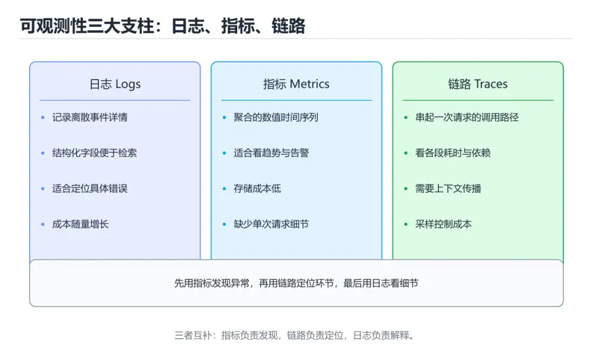
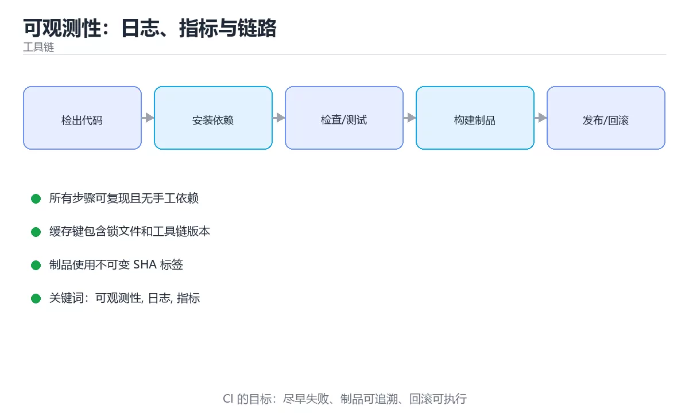

# 可观测性：日志、指标与链路

> 内容更新时间：2026-10-06 · 学习阶段：进阶 · 预计用时：30 分钟





## 学习目标

- 能用自己的话解释可观测性：日志、指标与链路解决了什么问题，而不是只背术语。
- 能说清 「可观测性」、「日志」、「指标」、「链路追踪」 之间的关系，并分别举出一个例子。
- 能把 可观测性 放回「可观测性：日志、指标与链路」的知识体系，说明它和 日志 的边界。
- 能完成本课练习，并用验收标准检查自己的结果。

> 一句话摘要：三支柱、结构化日志、SLO 与告警设计。

## 前置知识

- 先完成上一课《Kubernetes 基础》；如果已经掌握，可以直接用本课练习自测。
- 开始前先复习：可观测性、日志、指标。
- 看不懂就直接缩小例子：只保留 可观测性 相关的两行输入，跑通后再加回其余部分。

## 三大支柱

| 支柱 | 回答的问题 | 典型工具 |
| --- | --- | --- |
| 日志 Logs | 到底发生了什么 | ELK、Loki、CloudWatch |
| 指标 Metrics | 系统整体健康吗、趋势如何 | Prometheus + Grafana |
| 链路 Traces | 一次请求慢在哪一段 | Jaeger、Tempo、SkyWalking |

三者缺一不可：指标告诉你「出问题了」，链路告诉你「慢在哪」，日志告诉你「为什么错」。

## 结构化日志

```json
{"level":"error","ts":"2026-10-02T08:12:33Z","service":"order",
 "trace_id":"a1b2c3","user_id":"u_88","msg":"payment failed",
 "order_id":"o_1001","error":"timeout"}
```

要点：

1. 用 JSON 而不是拼接字符串，便于检索与聚合。
2. 每条日志带 `trace_id`、`service`、`level`，方便串联。
3. 日志分级（debug/info/warn/error），生产默认 info 以上。
4. 绝不记录密码、令牌、身份证号等敏感信息。
5. 关键路径记录耗时与结果，而不是只记「开始/结束」。

## 指标四类

```text
Counter    只增不减：请求总数、错误总数
Gauge      可增可减：当前连接数、队列长度、内存占用
Histogram  分布统计：请求延迟分桶，可算 P50/P95/P99
Summary    分位数统计：客户端计算，聚合性较差
```

**平均值会骗人**：关注 P95 / P99 延迟，以及错误率、饱和度（CPU/内存/队列）。

## 链路追踪

```text
Trace: 一次用户请求
  ├── Span: HTTP GET /orders       120 ms
  │     ├── Span: 查询数据库        35 ms
  │     └── Span: 调用支付服务      70 ms
  └── Span: 写缓存                  5 ms
```

用 OpenTelemetry 统一采集（SDK 埋点 + Collector 转发），避免绑定单一厂商；trace_id 同时写进日志，就能从慢链路直接跳到对应日志。

## SLI、SLO 与错误预算

```text
SLI：可测量的指标，如「请求成功率」「P95 延迟」
SLO：目标，如「99.9% 的请求在 300ms 内成功」
错误预算：1 - SLO，允许的失败额度；用完就冻结新功能、先修稳定性
```

告警要基于**用户可感知的症状**（错误率、延迟），而不是每个内部指标都报警，否则会疲于奔命。

## 落地清单

1. 统一日志格式与 trace 透传（HTTP 头携带 trace_id）。
2. 为每个服务定义 3~5 个黄金指标：延迟、流量、错误、饱和度。
3. 仪表盘按「用户视角 → 服务视角 → 资源视角」分层。
4. 告警分级：P0 电话、P1 群消息、P2 工单，并写清处理手册。
5. 定期演练：故意注入故障，验证监控与告警是否能及时发现。

## 告警规则示例

基于三个黄金信号（延迟、流量、错误）设计，避免"每个指标都报警"：

| 告警 | 表达式（PromQL 思路） | 阈值建议 | 级别 |
| --- | --- | --- | --- |
| 错误率过高 | 5 分钟 5xx 比例 | > 1% 持续 5 分钟 | P0 |
| 延迟劣化 | P95 请求耗时 | > 500ms 持续 10 分钟 | P0 |
| 流量异常下跌 | QPS 同比昨日 | 下降 > 50% | P1 |
| 资源饱和 | CPU 使用率 | > 80% 持续 15 分钟 | P1 |
| 队列积压 | 消息 lag | > 10 万且持续增长 | P1 |
| 依赖超时 | 下游调用超时率 | > 5% | P1 |

设计要点：**用持续时长过滤抖动**（`for: 5m`）、**按症状而非原因告警**（"错误率高"而不是"某台机器 CPU 高"）、**每条告警都要有处置手册**（先看什么、怎么回滚）。

## 从告警到定位的固定动作

1. 先看仪表盘的总体水位（错误率、延迟、流量），确认影响面。
2. 按时间对齐最近的变更（发布、配置、依赖升级）。
3. 用 trace 找最慢的 span，再跳对应服务的日志（靠 trace_id 串联）。
4. 确认是单实例还是全局：单实例先摘除，全局先考虑回滚或降级。

## 本课小结

可观测性不是「装个监控」，而是**让系统内部状态可以被外部推断**。日志给细节、指标给趋势、链路给定位，三者用同一个 trace_id 串起来才真正好用。

## 三大支柱速查

| 支柱 | 内容 | 回答的问题 | 成本 |
| --- | --- | --- | --- |
| 指标（Metrics） | 数值型聚合 | 现在健康吗 | 低 |
| 日志（Logs） | 事件明细 | 到底发生了什么 | 高 |
| 链路（Traces） | 请求调用树 | 慢在哪一环 | 中 |

## 方法论速查

| 方法 | 关注点 | 指标 |
| --- | --- | --- |
| RED | 服务视角 | 请求速率、错误率、耗时 |
| USE | 资源视角 | 利用率、饱和度、错误 |
| 四个黄金信号 | 综合 | 延迟、流量、错误、饱和度 |

| 信号 | 说明 |
| --- | --- |
| 流量 | QPS 或每秒事件数 |
| 延迟 | P50 / P95 / P99，区分成功与失败 |
| 错误 | 显式错误与隐式错误（如返回 200 但内容错误） |
| 饱和度 | 队列长度、CPU 排队、连接池占用 |

```python
from dataclasses import dataclass, field

def percentile(values: list, p: float) -> float:
    """分位数计算，报表口径统一。"""
    if not values:
        raise ValueError("空集合")
    ordered = sorted(values)
    if len(ordered) == 1:
        return float(ordered[0])
    position = (len(ordered) - 1) * p
    lower = int(position)
    upper = min(lower + 1, len(ordered) - 1)
    weight = position - lower
    return ordered[lower] * (1 - weight) + ordered[upper] * weight

@dataclass
class SloWindow:
    """SLO 与错误预算：用滑动窗口评估达标情况。"""

    target: float                 # 例如 0.999
    total: int = 0
    bad: int = 0
    samples: list = field(default_factory=list)

    def record(self, latency_ms: float, error: bool, threshold_ms: float = 300) -> None:
        self.total += 1
        if error or latency_ms > threshold_ms:
            self.bad += 1
        self.samples.append(latency_ms)

    @property
    def availability(self) -> float:
        return 1.0 if self.total == 0 else round(1 - self.bad / self.total, 6)

    def error_budget_left(self) -> float:
        """剩余错误预算比例：耗尽意味着要冻结变更。"""
        allowed = 1 - self.target
        used_ratio = (self.bad / self.total) / allowed if self.total else 0.0
        return round(max(0.0, 1 - used_ratio), 4)

    def report(self) -> dict:
        return {
            "availability": self.availability,
            "target": self.target,
            "error_budget_left": self.error_budget_left(),
            "p95_ms": round(percentile(self.samples, 0.95), 2) if self.samples else 0,
            "total": self.total,
        }

window = SloWindow(target=0.999)
for latency in [120, 150, 200, 900, 130]:
    window.record(latency, error=False, threshold_ms=300)
print(window.report())
```

## 告警设计速查

| 原则 | 说明 |
| --- | --- |
| 面向症状 | 告警用户可感知的问题，而非单个指标 |
| 基于 SLO | 用错误预算消耗速率触发 |
| 可执行 | 每条告警都有明确处理步骤 |
| 分级 | P1 立即处理、P2 当日、P3 观察 |
| 降噪 | 合并同类告警，抑制抖动 |
| 防疲劳 | 定期清理长期无效告警 |

## 常见错误与排查

| 容易踩的做法 | 实际现象 | 原因与正确做法 |
| --- | --- | --- |
| 只加日志不做指标 | 无法实时发现问题 | 指标告警 + 日志定位 |
| 平均延迟当唯一指标 | 长尾被掩盖 | 用 P95/P99 与错误率 |
| 指标维度太高 | 存储与查询成本爆炸 | 控制标签基数 |
| 告警基于单点阈值 | 频繁误报 | 用持续时长与错误预算 |
| 采样率过高 | 成本失控 | 按级别采样，错误全采 |
| 日志不带 trace ID | 无法串联 | 全链路透传 |
| 只监控基础设施 | 业务问题漏掉 | 加业务指标与关键路径 |
| 无 SLO | 无法判断是否该发版 | 定义 SLO 与错误预算策略 |
| 告警无处理手册 | 收到后不知做什么 | 每条告警配 runbook |
| 不清理旧告警 | 告警疲劳 | 定期评审删减 |

## 复习与自测

- [ ] 指标、日志、链路三者齐备并互相引用。
- [ ] 延迟报告使用分位数而非平均值。
- [ ] 定义了 SLO 与错误预算，并据此决定变更节奏。
- [ ] 告警面向症状、可执行且有分级。
- [ ] 标签基数与采样策略受控。

## 动手练习

> 本课练习重点：围绕「可观测性、日志、指标」完成复述、实验和交付，每个结果都要能被别人检查。

先在临时环境执行 可观测性 的完整命令链，再模拟失败并验证回滚。

### 练习 1：建立心智模型（10 分钟）

合上教程，用 3～5 句话回答：

1. 可观测性：日志、指标与链路解决了什么问题？
2. 如果没有它，会出现什么具体后果？
3. 它和「日志」是什么关系？

验收标准：用自己的话解释 可观测性，并给出一个它不成立的反例。

### 练习 2：做一次可控实验（20 分钟）

从正文中选一个最小示例，完成以下操作：

1. 先预测修改一个参数、输入或步骤后的结果。
2. 再实际执行或逐步推演，记录真实结果。
3. 如果结果与预测不同，写出差异原因。

**验收标准**：五步记录要写进笔记——原例是 trace_id，改动落在可观测性上，结论必须能被他人在同一环境里复现。

### 练习 3：交付一个小结果（30 分钟）

把 trace_id 的构建与运行命令写成脚本，在干净环境里跑一遍。

任务要求：

- 结果必须能被别人检查，不能只写“我已经理解了”。
- 至少覆盖「可观测性」和「日志」两个关键词。
- 写出 1 个仍然不确定的问题，以及下一步如何验证。

> 提示：时间有限时优先做练习 1 和练习 2；练习 3 可以拆成两次完成。

## 可运行练习

### 任务 1：先跑通，再解释

```python
from dataclasses import dataclass, field

def percentile(values: list, p: float) -> float:
    """分位数计算，报表口径统一。"""
    if not values:
        raise ValueError("空集合")
    ordered = sorted(values)
    if len(ordered) == 1:
        return float(ordered[0])
    position = (len(ordered) - 1) * p
    lower = int(position)
    upper = min(lower + 1, len(ordered) - 1)
    weight = position - lower
    return ordered[lower] * (1 - weight) + ordered[upper] * weight

@dataclass
class SloWindow:
    """SLO 与错误预算：用滑动窗口评估达标情况。"""

    target: float                 # 例如 0.999
    total: int = 0
    bad: int = 0
    samples: list = field(default_factory=list)

    def record(self, latency_ms: float, error: bool, threshold_ms: float = 300) -> None:
        self.total += 1
        if error or latency_ms > threshold_ms:
            self.bad += 1
        self.samples.append(latency_ms)

    @property
    def availability(self) -> float:
        return 1.0 if self.total == 0 else round(1 - self.bad / self.total, 6)

    def error_budget_left(self) -> float:
        """剩余错误预算比例：耗尽意味着要冻结变更。"""
        allowed = 1 - self.target
        used_ratio = (self.bad / self.total) / allowed if self.total else 0.0
        return round(max(0.0, 1 - used_ratio), 4)

    def report(self) -> dict:
        return {
            "availability": self.availability,
            "target": self.target,
            "error_budget_left": self.error_budget_left(),
            "p95_ms": round(percentile(self.samples, 0.95), 2) if self.samples else 0,
            "total": self.total,
        }

window = SloWindow(target=0.999)
for latency in [120, 150, 200, 900, 130]:
    window.record(latency, error=False, threshold_ms=300)
print(window.report())
```

### 任务 2：只改一个条件

把「可观测性：日志、指标与链路」的最小示例复制一份，只改一个条件再跑一次：

- 改动点：把 日志 换成边界值，其他输入保持原样。
- 预测：先写下「可观测性：日志、指标与链路」在改动后的输出或错误信息，再运行。
- 记录：对照改动前后的结果，指出差异出在哪一步。
- 验收：换回原条件能复现原结果，改动只影响可观测性。

### 任务 3：迁移到自己的数据

换一个 日志 场景重做一次，确认结论不是只对示例数据成立。

## 故障现场

### 现场 1：只加日志不做指标

**症状**：在《可观测性：日志、指标与链路》的复现场景中，无法实时发现问题。

**根因**：当出现“只加日志不做指标”时，执行路径已经绕过了《可观测性：日志、指标与链路》的关键约束，最终以“无法实时发现问题”暴露出来；修复前必须先确认约束在哪里失效。

**修复**：针对《可观测性：日志、指标与链路》的问题，指标告警 + 日志定位。

**验证**：先在《可观测性：日志、指标与链路》中记录“只加日志不做指标”留下的失败证据，再执行“指标告警 + 日志定位”并重放；确认错误路径变为明确结果，且修复没有掩盖同类故障。

### 现场 2：指标维度太高

**症状**：在《可观测性：日志、指标与链路》的复现场景中，存储与查询成本爆炸。

**根因**：触发点是把“指标维度太高”当成安全做法。它没有满足《可观测性：日志、指标与链路》要求的前提，因此先表现为“存储与查询成本爆炸”；排查时先完整复现这一段，再核对输入、配置与依赖。

**修复**：针对《可观测性：日志、指标与链路》的问题，控制标签基数。

**验证**：先在《可观测性：日志、指标与链路》中记录“指标维度太高”留下的失败证据，再执行“控制标签基数”并重放；确认错误路径变为明确结果，且修复没有掩盖同类故障。

### 现场 3：只监控基础设施

**症状**：在《可观测性：日志、指标与链路》的复现场景中，业务问题漏掉。

**根因**：“业务问题漏掉”只是表层结果。向上追溯会落到“只监控基础设施”这一步，因为它省略了《可观测性：日志、指标与链路》的约束，使实现行为和预期模型发生了偏离。

**修复**：针对《可观测性：日志、指标与链路》的问题，加业务指标与关键路径。

**验证**：在《可观测性：日志、指标与链路》中按“加业务指标与关键路径”调整后，从“只监控基础设施”的触发条件重放同一条路径，确认“业务问题漏掉”不再出现，并补一个相邻边界用例检查没有引入新问题。

## 本课复习清单

离开本课前，逐项确认：

- [ ] 不看解析，能说出「可观测性的三大支柱是？」的判断依据。
- [ ] 不看解析，能说出「评估接口延迟时，更值得关注的是？」的判断依据。
- [ ] 不看解析，能说出「把日志、指标与链路串联起来的关键是？」的判断依据。
- [ ] 不看解析，能说出「指标与日志的分工是？」的判断依据。
- [ ] 不看解析，能说出「RED 方法关注的三个指标是？」的判断依据。
- [ ] 跑通「可观测性：日志、指标与链路」的最小示例，并记录一次失败输入的处理方式。
- [ ] 把本课最容易混淆的两个概念写成一句话对照。

| 复盘项 | 记录 |
| --- | --- |
| 已经能独立解释的考点 |  |
| 仍然说不清的概念 |  |
| 下一步验证动作 |  |

## 术语速查

| 术语 | 一句话说明 |
| --- | --- |
| `trace_id` | 每条日志带 `trace_id`、`service`、`level`，方便串联。 |
| `可观测性` | 可观测性：日志、指标与链路解决了什么问题，而不是只背术语。 |
| `链路追踪` | Trace: 一次用户请求。 |
| `SLO` | 服务级目标，用可量化指标和窗口定义用户可接受的可靠性水平。 |

## 考点精讲

### 考点 1：顺序排列·可观测性

- **题目**：按“可观测性：日志、指标与链路”中 可观测性、日志、指标 的实践顺序，把四个步骤排成从准备到复盘的合理顺序。
- **判断依据**：在「可观测性：日志、指标与链路」里，在本课的练习里，顺序应当是：先明确 可观测性 的输入、输出与约束 → 写出最小示例并核对 日志 的基线结果 → 只改一个变量，记录边界与失败路径的变化 → 固定版本与证据，把本课的结论写成可复现记录。这个顺序把 可观测性 的输入、输出和约束放在最前面，在可观测性：日志、指标与链路里避免概念没对齐就开始调参。第二步用 日志 建立可核对的基线，在可观测性：日志、指标与链路里第三步才允许改变一个变量并观察失败路径。

### 考点 2：多选辨析·可观测性

- **题目**：围绕“可观测性：日志、指标与链路”中的 可观测性、日志、指标，下列哪两项是本课强调的实践判断？
- **判断依据**：本课把可观测性：日志、指标与链路拆成概念、示例与故障现场三部分，因此判断 可观测性 时必须同时交代输入、输出和失败路径，这使“学习 可观测性 时要同时说明输入、输出和失败路径，不能只看正常流程”成立。在可观测性：日志、指标与链路里，判断 日志 时要固定版本与边界输入，所以“验证 日志 时要固定版本并覆盖边界输入，结论才可复现”才可复现。

### 考点 3：概念判断·可观测性

- **题目**：把日志、指标与链路串联起来的关键是？
- **判断依据**：统一的 traceid 让一次请求的调用链与日志可以互跳。在「可观测性：日志、指标与链路」里，如果只凭关键词作答，很容易把「错误码」、「主机名」与「trace_id」混在一起；“指标与链路串联起来的关键是”与「可观测性：日志、指标与链路」的术语表相呼应，只有符合可观测性、日志、指标约束的“traceid”才是正文支持的结论。

### 考点 4：概念判断·可观测性

- **题目**：指标与日志的分工是？
- **判断依据**：在「可观测性：日志、指标与链路」里，结论应落在「指标适合聚合与告警，成本低」。常见做法是指标触发告警，再通过 trace id 拉取对应日志与链路。在「可观测性：日志、指标与链路」里，这道题要求区分概念与边界，「指标适合聚合与告警，成本低」只有在题干给出的前提下才成立，而「两者功能完全相同」、「指标可以还原单次请求全过程」缺少同一组条件。

### 考点 5：概念判断·可观测性

- **题目**：RED 方法关注的三个指标是？
- **判断依据**：在「可观测性：日志、指标与链路」里，速率（Rate）。USE 方法（利用率、饱和度、错误）更偏资源视角。回到「可观测性：日志、指标与链路」的正文示例，用“RED 方法关注的三个指标是”走一遍可观测性、日志、指标的完整流程，能复现的结论才可以保留。

### 考点 6：排错·可观测性

- **题目**：阅读「可观测性：日志、指标与链路」的代码片段，下面哪项判断是正确的？
- **判断依据**：指标给趋势、链路给定位、日志给细节，三者互补。作答时，先用可观测性建立输入与输出的基线，再把日志、指标、链路代入边界条件核对，结论才能复现。这道题的关键在「可观测性：日志、指标与链路」的可观测性、日志、指标：先确认题干“阅读可观测性”问的是哪一步，再排除偷换前提的选项。

## English Overview

**Title:** Observability

**Summary:** Logs, metrics, traces, SLOs and alerting.

**Category:** Toolchain
**Level:** 高级
**Key terms:** 可观测性, 日志, 指标, 链路追踪, SLO

## 内容元数据

- 内容版本：v2.0
- 最后更新：2026-10-06
- 学习阶段：进阶
- 适用环境：Git / Docker / Kubernetes / CI 平台
；本课聚焦 可观测性。
- 内容来源：内置结构化课程与工程实践整理
- 相关主题：可观测性、日志、指标、链路追踪、SLO
- 质量版本：P0 测验标准 + P1 覆盖扩展 + P2 体验补全

## 参考资料与复核

- 最后复核：2026-10-04
- 下次复核：2027-08-24
- 复核范围：版本兼容、API 行为、安全建议与工程实践
- 来源性质：官方文档、标准或权威教材；正文为离线教学重组

| 参考资料 | 本课用途 |
| --- | --- |
| [CMake 文档](https://cmake.org/documentation/) | 跨平台构建与依赖 |
| [Docker 文档](https://docs.docker.com/) | 镜像、容器与网络 |
| [Maven 指南](https://maven.apache.org/guides/) | Java 构建与依赖 |

> 「可观测性：日志、指标与链路」的链接用于离线阅读后的延伸核对；App 不会自动联网。
