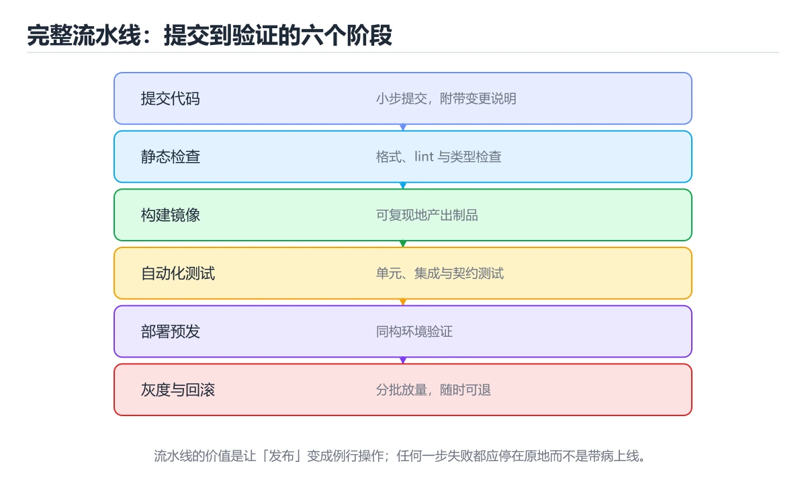
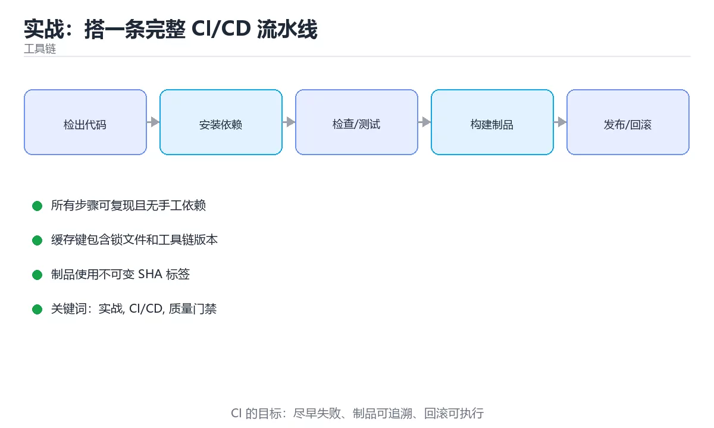

# 实战：搭一条完整的 CI/CD 流水线





> 内容更新时间：2026-10-03 · 学习阶段：高级 · 预计用时：16 分钟

## 学习目标

- 能用自己的话解释「实战：搭一条完整 CI/CD 流水线」解决了什么问题，而不是只背术语。
- 能说清 「实战」、「CI/CD」、「质量门禁」、「灰度」 之间的关系，并分别举出一个例子。
- 能把本课知识放回「工具链」的知识体系，说明它和相邻主题的边界。
- 能完成本课练习，并用验收标准检查自己的结果。

> 一句话摘要：六阶段流水线、质量门禁、灰度发布与回滚演练。

## 前置知识

- 先完成上一课《API 网关与负载均衡》；如果已经掌握，可以直接用本课练习自测。
- 本课阶段：高级。建议具备同一方向的完整基础，能阅读较长的代码、配置或系统设计说明。
- 开始前先复习：实战、CI/CD、质量门禁。
- 如果某一步看不懂，先记录具体卡点，完成练习后再回头读一遍。


## 目标

为一个真实项目搭建从提交到部署的自动化流水线：**lint → 测试 → 构建 → 镜像 → 部署 → 回滚**，并加上质量门禁。

## 流水线设计

| 阶段 | 做什么 | 失败后果 |
| --- | --- | --- |
| 静态检查 | 格式化校验、lint、类型检查 | 阻断合并 |
| 单元测试 | 快速测试 + 覆盖率门槛 | 阻断合并 |
| 构建 | 产出不可变产物（用 commit SHA 命名） | 阻断发布 |
| 集成/E2E | 关键路径验证（可选 nightly） | 阻断发布 |
| 镜像 | 多阶段构建，推送到镜像仓库 | 阻断部署 |
| 部署 | 灰度 → 观察指标 → 全量 | 自动回滚 |

## 关键实践

1. **缓存依赖**（node_modules、Gradle、Go module），把构建时间压到分钟级。
2. **产物只构建一次**，测试环境与生产用同一份镜像，避免"测的不是发布的"。
3. **密钥走 Secrets**，绝不出现在日志与仓库中。
4. **并行化独立 job**（lint/test 并行），用 needs 控制依赖顺序。
5. **质量门禁**：覆盖率下降、包体积超阈值、安全扫描高危漏洞都阻断。

## 部署与回滚

灰度发布：先放 5% 流量，观察错误率与 P95 延迟 5~10 分钟，再逐步放大到 100%。回滚要**一键且可验证**——保留最近 N 个版本的镜像标签与配置，回滚后自动跑一次健康检查。

## 必须验证的故障场景

1. 让单测失败，确认流水线阻断合并。
2. 故意让镜像启动失败，确认部署阶段自动停止且不继续放量。
3. 让新版本错误率升高，验证自动回滚是否触发。
4. 删除 Secret，确认任务明确报错而不是静默使用空值。

## 交付物

流水线配置文件、一次成功与一次失败的运行链接、回滚演练记录、以及"从提交到上线耗时"的基线数据。

## 交付物与评分标准

**交付物**：流水线配置文件（含 lint/test/build/镜像/部署五阶段）、一次成功与一次失败的运行链接、回滚演练记录、以及"从提交到上线"的耗时基线。

**评分标准**：阶段完整 30%（质量门禁真的能阻断）、可复现 25%（产物只构建一次、各环境复用）、安全 20%（密钥走 Secrets、最小权限）、可回滚 25%（演练记录证明能在一键内回滚）。

**常见失败案例**：① 每次部署重新构建，测试与生产不是同一份产物；② 把 Token 写进仓库或日志；③ 门禁形同虚设（失败也能合并）；④ 只做部署不做回滚演练，真出事时手忙脚乱。

## 本课小结
CI/CD 的价值不是"自动化"，而是**把质量与发布变成可重复、可回滚的流程**；先保证失败可见，再追求速度。


## 流水线阶段速查

| 阶段 | 目标 | 典型耗时 | 失败处理 |
| --- | --- | --- | --- |
| 静态检查 | 快速发现问题 | 秒级 | 阻断合并 |
| 单元测试 | 验证逻辑 | 分钟级 | 阻断合并 |
| 构建 | 产出不可变制品 | 分钟级 | 阻断 |
| 集成测试 | 验证组件协作 | 分钟级 | 阻断 |
| 安全扫描 | 依赖与密钥 | 分钟级 | 高危阻断 |
| 部署预发 | 环境验证 | 分钟级 | 阻断 |
| 灰度发布 | 小流量验证 | 分钟级到小时 | 自动回滚 |
| 全量发布 | 正式上线 | 分钟级 | 回滚 |

## 制品与配置速查

| 主题 | 做法 |
| --- | --- |
| 一次构建 | 各环境复用同一制品，避免重建引入差异 |
| 制品标识 | 使用提交 SHA 或语义化版本，可追溯 |
| 配置分离 | 环境差异通过配置注入，不重建 |
| 密钥 | 密钥管理服务注入，禁止写入制品与日志 |
| 依赖锁定 | 提交 lock 文件并用 `ci` 类安装命令 |
| 缓存 | 缓存键包含 lock 文件哈希 |
| 制品保留 | 明确保留策略与清理规则 |

```python
from dataclasses import dataclass, field
from enum import Enum

class Stage(Enum):
    LINT = "lint"
    TEST = "test"
    BUILD = "build"
    SECURITY = "security"
    DEPLOY_CANARY = "deploy_canary"
    DEPLOY_FULL = "deploy_full"

@dataclass
class StageResult:
    stage: Stage
    ok: bool
    duration_s: float
    detail: str = ""

@dataclass
class Pipeline:
    results: list = field(default_factory=list)

    def run_stage(self, stage: Stage, checker, **kwargs) -> StageResult:
        started = __import__("time").monotonic()
        try:
            ok, detail = checker(**kwargs)
        except Exception as exc:                  # 任何异常都视为失败
            ok, detail = False, str(exc)
        result = StageResult(stage, ok, round(__import__("time").monotonic() - started, 3), detail)
        self.results.append(result)
        return result

    def gate(self) -> tuple[bool, str]:
        """门禁：任一步失败即阻止继续。"""
        for result in self.results:
            if not result.ok:
                return False, f"{result.stage.value} 失败：{result.detail}"
        return True, "全部通过"

    def report(self) -> dict:
        return {
            "stages": [r.stage.value for r in self.results],
            "failed": [r.stage.value for r in self.results if not r.ok],
            "total_seconds": round(sum(r.duration_s for r in self.results), 3),
        }

def lint() -> tuple[bool, str]:
    return True, "无告警"

def high_severity_vulns() -> tuple[bool, str]:
    return False, "发现 1 个高危依赖漏洞"

pipeline = Pipeline()
pipeline.run_stage(Stage.LINT, lint)
pipeline.run_stage(Stage.SECURITY, high_severity_vulns)
print(pipeline.gate(), pipeline.report())
```

## 灰度与回滚速查

| 观察项 | 阈值示例 | 触发动作 |
| --- | --- | --- |
| 错误率 | 超过基线 0.5% | 立即回滚 |
| P95 延迟 | 超过基线 20% | 暂停放量 |
| 业务指标 | 转化率下降 5% | 暂停并人工确认 |
| 资源使用 | CPU 或内存接近上限 | 停止放量 |
| 日志异常 | 新增异常类型 | 告警并排查 |

回滚原则：**回滚要能一键完成、分钟级生效，并且回滚路径本身经过演练。**

## 常见错误对照表

| 容易踩的做法 | 实际现象 | 原因与正确做法 |
| --- | --- | --- |
| 每个环境重新构建 | 行为不一致 | 一次构建，多环境复用 |
| 缓存键不含 lock 哈希 | 用到过期依赖 | key 包含 lock 文件哈希 |
| CI 用 `install` 而非 `ci` | 依赖版本漂移 | 用锁文件严格安装 |
| 密钥打印到日志 | 泄漏 | 用密钥管理并遮蔽输出 |
| 安全扫描告警不阻断 | 漏洞上线 | 高危阻断、中低记录 |
| 无灰度直接全量 | 故障影响全站 | 灰度 + 自动回滚 |
| 回滚从未演练 | 真需要时失败 | 定期演练回滚 |
| 流水线过长 | 反馈慢、开发抵触 | 并行化 + 缓存 + 分层测试 |
| 制品无版本标识 | 无法追溯 | 用 SHA 或语义版本 |
| 制品不清理 | 存储成本上升 | 保留策略 + 定期清理 |

## 自测清单

- [ ] 流水线覆盖静态检查、测试、构建、安全与部署。
- [ ] 一次构建、多环境复用，制品可追溯。
- [ ] 密钥不落盘，缓存键含依赖锁哈希。
- [ ] 灰度有明确观察指标与自动回滚条件。
- [ ] 回滚路径定期演练。

## 动手练习


> 本课练习重点：围绕「实战、CI/CD、质量门禁」完成复述、实验和交付，每个结果都要能被别人检查。

先在临时环境执行完整命令链，再模拟失败，最后验证回滚和清理。

### 练习 1：建立心智模型（10 分钟）

合上教程，用 3～5 句话回答：

1. 「实战：搭一条完整 CI/CD 流水线」解决了什么问题？
2. 如果没有它，会出现什么具体后果？
3. 它和「CI/CD」是什么关系？

**验收标准**：至少出现一个本课关键词，并写出一个反例、边界条件或失效场景。

### 练习 2：做一次可控实验（20 分钟）

从正文中选一个最小示例，完成以下操作：

1. 先预测修改一个参数、输入或步骤后的结果。
2. 再实际执行或逐步推演，记录真实结果。
3. 如果结果与预测不同，写出差异原因。

**验收标准**：留下「原例 → 改动 → 预测 → 结果 → 原因」五步记录。

### 练习 3：交付一个小结果（30 分钟）

在一个临时目录或本地仓库执行完整命令链，并记录失败时的回滚办法。

任务要求：

- 结果必须能被别人检查，不能只写“我已经理解了”。
- 至少覆盖「实战」和「CI/CD」两个关键词。
- 写出 1 个仍然不确定的问题，以及下一步如何验证。

> 提示：时间有限时优先做练习 1 和练习 2；练习 3 可以拆成两次完成。


## 验证命令与预期输出

项目代码不能只看“能编译”，还要能按固定命令复现结果。下表给出最低验证集：

| 阶段 | 命令 | 预期输出 |
| --- | --- | --- |
| 安装依赖 | `python -m pip install -r requirements.txt` | 依赖安装完成，没有版本冲突 |
| 语法检查 | `python -m compileall .` | 所有模块编译通过 |
| 运行测试 | `python -m pytest -q` | 测试全部通过，失败用例数为 0 |
| 启动示例 | `python main.py` | 服务启动并输出监听地址 |

### 验收证据

- [ ] 保存依赖安装和启动命令的完整输出。
- [ ] 至少运行 3 条测试，其中包含一条非法输入或失败路径。
- [ ] 重复执行同一操作两次，确认没有重复写入或副作用。
- [ ] 记录一次失败状态码、错误日志和恢复步骤。
- [ ] 在 README 中写明环境版本、启动方式和回滚方式。

### 回归与回滚

1. 先在一个可丢弃的目录或临时数据库执行，避免污染真实数据。
2. 修改一处逻辑后重跑全部验证命令，确认没有回归。
3. 若失败，回滚到上一个可运行版本并保留失败日志。
4. 定位原因后补一条自动化测试，再重新执行发布流程。
5. 把教训写入项目复盘或本课笔记，形成下一次的检查项。


## 考点精讲：把测验题还原成判断过程

本课有 6 个判断点。先自己作答，再看「判断依据」；如果结论正确但理由不完整，回到正文对应章节补足概念。

### 考点 1：关于构建产物，正确的做法是？

- **正确判断**：产物只构建一次
- **判断依据**：正确答案是「产物只构建一次」，本课在「交付物与评分标准」中说明：评分标准：阶段完整 30%（质量门禁真的能阻断）、可复现 25%（产物只构建一次、各环境复用）、安全 20%（密钥走 Secrets、最小权限）、可回滚 25%（演练记录证明能在一键内回滚）。避免测试的与发布的不是同一份产物。本课还在「关键实践」中说明：产物只构建一次，测试环境与生产用同一份镜像，避免"测的不是发布的"。本课还在「项目专属规格：实战：搭一条完整 CI/CD 流水线」中说明：六阶段流水线、质量门禁、灰度发布与回滚演练。
- **迁移检查**：遮住选项，只根据定义复述一次答案，再回来看哪个选项与复述一致。

### 考点 2：密钥应该放在？

- **正确判断**：CI 的 Secrets 机制
- **判断依据**：正确答案是「CI 的 Secrets 机制」，本课在「目标」中说明：为一个真实项目搭建从提交到部署的自动化流水线：lint → 测试 → 构建 → 镜像 → 部署 → 回滚，并加上质量门禁。密钥绝不能出现在仓库与日志中。，本课在「项目专属规格：实战：搭一条完整 CI/CD 流水线」中说明：六阶段流水线、质量门禁、灰度发布与回滚演练。本课还在「交付物与评分标准」中说明：评分标准：阶段完整 30%（质量门禁真的能阻断）、可复现 25%（产物只构建一次、各环境复用）、安全 20%（密钥走 Secrets、最小权限）、可回滚 25%（演练记录证明能在一键内回滚）。
- **迁移检查**：遮住选项，只根据定义复述一次答案，再回来看哪个选项与复述一致。

### 考点 3：灰度发布期间主要观察什么？

- **正确判断**：错误率与 P95/P99 延迟
- **判断依据**：正确答案是「错误率与 P95/P99 延迟」，本课在「项目专属规格：实战：搭一条完整 CI/CD 流水线」中说明：六阶段流水线、质量门禁、灰度发布与回滚演练。指标正常再逐步放量，异常立即回滚。本课还在「部署与回滚」中说明：灰度发布：先放 5% 流量，观察错误率与 P95 延迟 5~10 分钟，再逐步放大到 100%。本课还在「目标」中说明：为一个真实项目搭建从提交到部署的自动化流水线：lint → 测试 → 构建 → 镜像 → 部署 → 回滚，并加上质量门禁。
- **迁移检查**：如果给某个错误选项去掉一个限定词，它会不会变成正确？说明理由。

### 考点 4：「构建一次，多处部署」的意义是？

- **正确判断**：各环境使用同一个不可变制品
- **判断依据**：正确答案是「各环境使用同一个不可变制品」，本课在「关键实践」中说明：产物只构建一次，测试环境与生产用同一份镜像，避免"测的不是发布的"。环境差异应通过配置注入而不是重建来解决。本课还在「关键实践」中说明：质量门禁：覆盖率下降、包体积超阈值、安全扫描高危漏洞都阻断。本课还在「交付物与评分标准」中说明：交付物：流水线配置文件（含 lint/test/build/镜像/部署五阶段）、一次成功与一次失败的运行链接、回滚演练记录、以及"从提交到上线"的耗时基线。
- **迁移检查**：把题干里的一个条件换成边界值，原来的结论还成立吗？写出判断过程。

### 考点 5：蓝绿发布与金丝雀发布的区别是？

- **正确判断**：蓝绿是两套环境整体切换
- **判断依据**：正确答案是「蓝绿是两套环境整体切换」，本课在「关键实践」中说明：质量门禁：覆盖率下降、包体积超阈值、安全扫描高危漏洞都阻断。金丝雀更节省资源但对流量切分、监控与自动化要求更高。本课还在「交付物」中说明：流水线配置文件、一次成功与一次失败的运行链接、回滚演练记录、以及"从提交到上线耗时"的基线数据。本课还在「本课小结」中说明：CI/CD 的价值不是"自动化"，而是把质量与发布变成可重复、可回滚的流程。
- **迁移检查**：如果给某个错误选项去掉一个限定词，它会不会变成正确？说明理由。

### 考点 6：补全代码：「实战：搭一条完整 CI/CD 流水线」示例中，下面这行代码缺少哪个关键字或函数名？请填入 ____。 `"project": "____",`

- **正确判断**：toolchain_project
- **判断依据**：正确答案是「toolchain_project」，本课在「交付物」中说明：流水线配置文件、一次成功与一次失败的运行链接、回滚演练记录、以及"从提交到上线耗时"的基线数据。本课还在「交付物与评分标准」中说明：交付物：流水线配置文件（含 lint/test/build/镜像/部署五阶段）、一次成功与一次失败的运行链接、回滚演练记录、以及"从提交到上线"的耗时基线。本课还在「必须验证的故障场景」中说明：让新版本错误率升高，验证自动回滚是否触发。
- **迁移检查**：不看题干，用自己的话补全这句话，再与标准答案对照。

## 本课复习清单

离开本课前，逐项确认：

- [ ] 不看解析，能说出「关于构建产物，正确的做法是？」的判断依据。
- [ ] 不看解析，能说出「密钥应该放在？」的判断依据。
- [ ] 不看解析，能说出「灰度发布期间主要观察什么？」的判断依据。
- [ ] 不看解析，能说出「「构建一次，多处部署」的意义是？」的判断依据。
- [ ] 不看解析，能说出「蓝绿发布与金丝雀发布的区别是？」的判断依据。
- [ ] 不看解析，能说出「补全代码：「实战：搭一条完整 CI/CD 流水线」示例中，下面这行代码缺少哪个关…」的判断依据。
- [ ] 至少运行一次本课示例，记录输入、输出和一个边界情况。
- [ ] 把本课最容易混淆的两个概念写成一句话对照。

| 复盘项 | 记录 |
| --- | --- |
| 已经能独立解释的考点 |  |
| 仍然说不清的概念 |  |
| 下一步验证动作 |  |

## 术语速查

把本课反复出现的术语集中放在一起。复习时先遮住右列，尝试用自己的话解释，再回到正文核对。

| 术语 | 本课语境 |
| --- | --- |
| `ci` | \| 依赖锁定 \| 提交 lock 文件并用 `ci` 类安装命令 \| |
| `install` | \| CI 用 `install` 而非 `ci` \| 依赖版本漂移 \| 用锁文件严格安装 \| |
| `python -m compileall .` | \| 语法检查 \| `python -m compileall .` \| 所有模块编译通过 \| |
| `python -m pytest -q` | \| 运行测试 \| `python -m pytest -q` \| 测试全部通过，失败用例数为 0 \| |
| `python main.py` | \| 启动示例 \| `python main.py` \| 服务启动并输出监听地址 \| |

## 面试问答与自测

下面把本课考点换成面试追问。先口述自己的答案，
再对照参考回答检查是否遗漏了前提、边界或失败路径。

### 追问 1：关于构建产物，正确的做法是？

**参考回答**：正确答案是「产物只构建一次」，本课在「交付物与评分标准」中说明：评分标准：阶段完整 30%（质量门禁真的能阻断）、可复现 25%（产物只构建一次、各环境复用）、安全 20%（密钥走 Secrets、最小权限）、可回滚 25%（演练记录证明能在一键内回滚）。避免测试的与发布的不是同一份产物。本课还在「关键实践」中说明：产物只构建一次，测试环境与生产用同一份镜像，避免"测的不是发布的"。本课还在「项目专属规格·实战·搭一条完整 CI/CD 流水线」中说明：六阶段流水线、质量门禁、灰度发布与回滚演练。

### 追问 2：密钥应该放在？

**参考回答**：正确答案是「CI 的 Secrets 机制」，本课在「目标」中说明：为一个真实项目搭建从提交到部署的自动化流水线：lint → 测试 → 构建 → 镜像 → 部署 → 回滚，并加上质量门禁。密钥绝不能出现在仓库与日志中。，本课在「项目专属规格：实战：搭一条完整 CI/CD 流水线」中说明：六阶段流水线、质量门禁、灰度发布与回滚演练。本课还在「交付物与评分标准」中说明：评分标准：阶段完整 30%（质量门禁真的能阻断）、可复现 25%（产物只构建一次、各环境复用）、安全 20%（密钥走 Secrets、最小权限）、可回滚 25%（演练记录证明能在一键内回滚）。

### 追问 3：灰度发布期间主要观察什么？

**参考回答**：正确答案是「错误率与 P95/P99 延迟」，本课在「项目专属规格·实战·搭一条完整 CI/CD 流水线」中说明：六阶段流水线、质量门禁、灰度发布与回滚演练。指标正常再逐步放量，异常立即回滚。本课还在「部署与回滚」中说明：灰度发布：先放 5% 流量，观察错误率与 P95 延迟 5~10 分钟，再逐步放大到 100%。本课还在「目标」中说明：为一个真实项目搭建从提交到部署的自动化流水线：lint → 测试 → 构建 → 镜像 → 部署 → 回滚，并加上质量门禁。

### 追问 4：「构建一次，多处部署」的意义是？

**参考回答**：正确答案是「各环境使用同一个不可变制品」，本课在「关键实践」中说明：产物只构建一次，测试环境与生产用同一份镜像，避免"测的不是发布的"。环境差异应通过配置注入而不是重建来解决。本课还在「关键实践」中说明：质量门禁：覆盖率下降、包体积超阈值、安全扫描高危漏洞都阻断。本课还在「交付物与评分标准」中说明：交付物：流水线配置文件（含 lint/test/build/镜像/部署五阶段）、一次成功与一次失败的运行链接、回滚演练记录、以及"从提交到上线"的耗时基线。

### 追问 5：蓝绿发布与金丝雀发布的区别是？

**参考回答**：正确答案是「蓝绿是两套环境整体切换」，本课在「关键实践」中说明：质量门禁：覆盖率下降、包体积超阈值、安全扫描高危漏洞都阻断。金丝雀更节省资源但对流量切分、监控与自动化要求更高。本课还在「交付物」中说明：流水线配置文件、一次成功与一次失败的运行链接、回滚演练记录、以及"从提交到上线耗时"的基线数据。本课还在「本课小结」中说明：CI/CD 的价值不是"自动化"，而是把质量与发布变成可重复、可回滚的流程。

## English Overview

**Title:** Project: CI/CD Pipeline

**Summary:** Pipeline stages, gates, canary and rollback drills.

**Category:** Toolchain  
**Level:** 高级  
**Key terms:** 实战, CI/CD, 质量门禁, 灰度, 回滚

> The full tutorial is written in Chinese. This bilingual overview helps English readers identify the topic, scope and key terms before studying the detailed examples.

## 内容元数据

- 内容版本：v2.0
- 最后更新：2026-10-03
- 学习阶段：高级
- 适用环境：Git / Docker / Kubernetes / CI 平台
- 内容来源：内置结构化课程与工程实践整理
- 相关主题：实战、CI/CD、质量门禁、灰度、回滚
- 质量版本：P0 测验标准 + P1 覆盖扩展 + P2 体验补全

## 项目专属规格：实战：搭一条完整 CI/CD 流水线

### 核心场景

六阶段流水线、质量门禁、灰度发布与回滚演练。 项目目标是把「实战、CI/CD、质量门禁、灰度、回滚」落实为可运行、可测试、可回滚的交付物。

### 架构与数据流

```text
用户/输入 → 接口或命令 → 领域逻辑 → 存储/外部依赖 → 输出与监控
                         ↘ 失败分类 → 重试/补偿 → 回滚
```

### 最小数据模型

| 对象 | 关键字段 | 约束 |
| --- | --- | --- |
| 输入实体 | 实战、时间、来源 | 必填校验、长度限制、幂等键 |
| 任务实体 | 状态、优先级、创建时间 | 状态迁移合法、不可重复执行 |
| 结果实体 | 输出、错误码、耗时 | 可序列化、错误可解释 |
| 审计记录 | 操作者、动作、结果、时间 | 不可篡改、可查询、脱敏 |

### 验收场景

1. 正常路径：最小输入得到预期输出，并留下日志与指标。
2. 边界路径：空值、最大值、重复数据和超长内容得到明确处理。
3. 失败路径：依赖超时或不可用时能快速失败、重试或降级。
4. 幂等路径：同一请求执行两次不会产生重复副作用。
5. 回滚路径：回滚后数据一致，且能说明恢复时间和影响范围。


## 项目交付物

### 建议仓库结构

```text
src/
tests/
docs/
README.md
```

### 测试矩阵

| 层级 | 覆盖内容 | 最低数量 | 通过标准 |
| --- | --- | ---: | --- |
| 单元测试 | 领域规则、边界和错误分类 | 8 | 正常、边界、失败路径全部通过 |
| 集成测试 | 数据库、网络、文件或平台边界 | 3 | 使用真实边界且可重复运行 |
| 端到端测试 | 核心用户路径 | 1 | 从输入到输出完整跑通 |
| 手动验收 | 文档中列出的 5 个场景 | 5 | 有命令、输出和结论记录 |

### 验收数据

```json
{
  "project": "toolchain_project",
  "input": {"case": "normal", "value": 5},
  "expected": {"ok": true, "result": 5},
  "failure_case": {"value": -1, "error": "validation_error"},
  "idempotency_key": "demo-001"
}
```

### 复盘模板

| 问题 | 记录 |
| --- | --- |
| 原目标是什么？ | 用一句话描述可验收目标 |
| 实际发生了什么？ | 时间线、指标和关键日志 |
| 哪个假设被推翻？ | 根因与促成因素 |
| 如何回滚？ | 步骤、耗时和数据校验 |
| 下一步做什么？ | 负责人、期限和验证方式 |

> 项目验收围绕「实战、CI/CD、质量门禁」：至少完成一次正常路径、一次边界输入、一次失败恢复和一次幂等检查。


## 参考资料与复核

- 最后复核：2026-10-04
- 下次复核：2027-04-04
- 复核范围：版本兼容、API 行为、安全建议与工程实践
- 来源性质：官方文档与标准；本课正文为离线教学重组，不复制原文

| 参考资料 | 本课用途 |
| --- | --- |
| [Git 文档](https://git-scm.com/doc) | 版本控制与协作 |
| [Docker 文档](https://docs.docker.com/) | 容器与镜像 |
| [Kubernetes 文档](https://kubernetes.io/docs/) | 编排与运维 |

> 本课主题：六阶段流水线、质量门禁、灰度发布与回滚演练。

> App 完全离线展示文字链接，不会自动联网；需要延伸阅读时可复制链接到浏览器。
