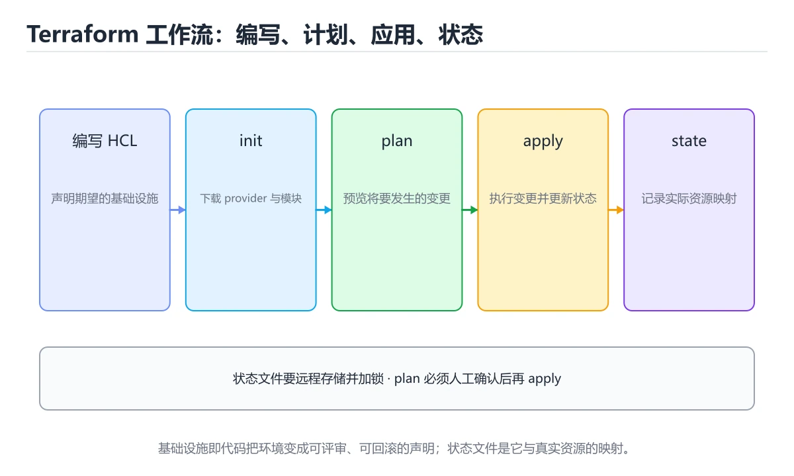

# Terraform 与基础设施即代码




> 内容更新时间：2026-10-03 · 学习阶段：高级 · 预计用时：15 分钟

## 学习目标

- 能用自己的话解释「Terraform 与基础设施即代码」解决了什么问题，而不是只背术语。
- 能说清 「Terraform」、「IaC」、「State」、「plan」 之间的关系，并分别举出一个例子。
- 能把本课知识放回「工具链」的知识体系，说明它和相邻主题的边界。
- 能完成本课练习，并用验收标准检查自己的结果。

> 一句话摘要：Provider/State/Module、工作流与最佳实践。

## 前置知识

- 先完成上一课《可观测性：日志、指标与链路》；如果已经掌握，可以直接用本课练习自测。
- 本课阶段：高级。建议具备同一方向的完整基础，能阅读较长的代码、配置或系统设计说明。
- 开始前先复习：Terraform、IaC、State。
- 如果某一步看不懂，先记录具体卡点，完成练习后再回头读一遍。


## 为什么需要 IaC

手动在控制台点出来的资源无法复现、无法评审、容易产生「雪花服务器」。基础设施即代码（IaC）把资源写成配置文件，纳入版本控制，用流程化的方式创建与变更。

## 核心概念

| 概念 | 说明 |
| --- | --- |
| Provider | 与云厂商 API 对接（AWS、Azure、阿里云、K8s） |
| Resource | 要创建的资源，如虚拟机、数据库、网络 |
| Variable | 输入参数，区分环境 |
| Output | 暴露结果，供其他模块或脚本使用 |
| State | 记录已创建资源的映射，是 Terraform 的核心 |
| Module | 可复用的资源组合 |

## 工作流

标准流程是 `init → fmt → validate → plan → apply → destroy`。其中 **plan 是安全闸门**：它展示将要新增、修改、销毁的资源，必须人工确认后再 apply。销毁类变更（replace/destroy）要在评审时重点标注。

## 状态管理

State 默认存在本地文件，团队协作必须改为**远程后端**（如 S3 + DynamoDB 锁、Terraform Cloud、OSS），否则多人同时 apply 会互相覆盖。State 中还可能包含敏感信息，需加密并限制访问。

## 环境隔离

常见做法有三种：目录隔离（envs/dev、envs/prod 各自一份配置）、工作区（workspace）、以及同一份模块 + 不同变量文件。生产与测试必须使用不同的 State，避免误操作。

## 最佳实践

1. 所有变更走代码评审与 CI，禁止本地直接 apply 生产。
2. 用 `plan` 输出作为 PR 评论，让变更可见。
3. 给资源打统一标签（项目、环境、负责人），便于成本归集。
4. 敏感变量用密钥管理服务注入，不要写进仓库。
5. 定期 `terraform plan` 检测漂移（有人手工改过资源）。
6. 版本固定 Provider 与模块版本，避免不兼容升级。

## 常见坑

1. 手工在控制台改资源，导致 State 与实际不一致（漂移）。
2. 直接删 State 文件「重来」，造成资源失控。
3. 用 `-auto-approve` 跑生产，跳过人工确认。
4. 把密钥、证书写进 tf 文件并提交。
5. 把所有资源塞进一个巨型 State，变更风险与耗时都极高。

## 模块化与协作要点

| 主题 | 实践 |
| --- | --- |
| 模块划分 | 按职责拆（网络/数据库/应用），模块只暴露必要变量与输出 |
| 变量校验 | 用 validation 块限制取值范围，例如环境只能是 dev/staging/prod |
| 版本固定 | Provider 与模块都写死版本号，避免上游变更导致意外差异 |
| 命名规范 | 资源名带项目-环境-用途前缀，便于检索与计费归集 |
| 敏感值 | 用 sensitive = true 标记变量与输出，避免打印到日志 |

**团队协作流程**：功能分支修改 → CI 执行 `terraform fmt -check`、`validate`、`plan` 并把 plan 结果贴到 PR → 人工评审（重点看 destroy/replace）→ 合并后由受控流水线 apply → 记录 apply 输出与版本标签。禁止开发者本地直接对生产 apply。

**漂移处理**：定期跑 `terraform plan`，若出现非本次变更的差异说明有人手工改过资源；处理方式是把改动同步回代码（import 或补配置），而不是忽略差异——否则下次 apply 可能覆盖掉手工改动。

## 本课小结
Terraform 的价值在于**可复现、可评审、可回滚**。记住两件事：State 要远程托管并加锁，生产变更必须先看 plan。


## 工作流速查

| 命令 | 作用 | 注意 |
| --- | --- | --- |
| `terraform init` | 初始化后端与插件 | 首次或换后端时执行 |
| `terraform fmt` | 格式化代码 | 提交前执行 |
| `terraform validate` | 语法与引用校验 | 不访问远端 |
| `terraform plan` | 预览变更 | 保存计划文件供 apply 使用 |
| `terraform apply` | 应用变更 | 生产需评审与二次确认 |
| `terraform destroy` | 销毁资源 | 极度危险，需明确目标 |
| `terraform state list` | 查看已管理资源 | 排查漂移 |
| `terraform import` | 导入已存在资源 | 导入后需校对配置 |
| `terraform output` | 读取输出值 | 供其他模块或脚本使用 |

## 状态与模块速查

| 主题 | 建议 |
| --- | --- |
| 远端状态 | 用对象存储 + 锁（DynamoDB 或等价机制） |
| 状态隔离 | 按环境与业务拆分独立状态 |
| 敏感数据 | 状态含明文，务必加密并限制访问 |
| 模块化 | 输入变量清晰、输出明确、版本固定 |
| 环境差异 | 用变量与 tfvars 区分，避免复制粘贴 |
| 漂移检测 | 定期 `plan` 或专用工具检测 |

```hcl
# 远端状态 + 锁定，保证团队协作安全
terraform {
  required_version = ">= 1.6"
  backend "s3" {
    bucket         = "company-tfstate"
    key            = "prod/network/terraform.tfstate"
    region         = "ap-southeast-1"
    dynamodb_table = "terraform-locks"
    encrypt        = true
  }
}

# 模块调用：固定版本，变量显式传入
module "network" {
  source  = "git::https://example.com/infra/modules/network.git?ref=v1.4.2"
  name    = "prod-vpc"
  cidr    = "10.20.0.0/16"
  azs     = ["ap-southeast-1a", "ap-southeast-1b"]
  tags    = local.common_tags
}

# 变量校验：把非法输入挡在 plan 之前
variable "instance_count" {
  type        = number
  description = "实例数量"
  validation {
    condition     = var.instance_count > 0 && var.instance_count <= 50
    error_message = "实例数量必须在 1 到 50 之间。"
  }
}

output "subnet_ids" {
  value       = module.network.subnet_ids
  description = "子网 ID 列表"
}
```

```python
import json
import subprocess

def plan_summary(plan_file: str = "plan.tfplan") -> dict:
    """把 plan 转为可审阅的摘要：新增、修改、销毁各多少。"""
    proc = subprocess.run(
        ["terraform", "show", "-json", plan_file],
        capture_output=True, text=True, check=True,
    )
    data = json.loads(proc.stdout)
    actions = {"create": 0, "update": 0, "delete": 0, "replace": 0}
    for change in data.get("resource_changes", []):
        for action in change["change"]["actions"]:
            if action == "create":
                actions["create"] += 1
            elif action == "update":
                actions["update"] += 1
            elif action == "delete":
                actions["delete"] += 1
            elif action == "delete" and "create" in change["change"]["actions"]:
                actions["replace"] += 1
    risky = actions["delete"] > 0 or actions["replace"] > 0
    return {"actions": actions, "needs_review": risky}

def guard_production(workspace: str, actions: dict, allow_delete: bool = False) -> str:
    """生产保护：存在销毁或替换时要求显式授权。"""
    if workspace == "prod" and (actions.get("delete") or actions.get("replace")) and not allow_delete:
        return "阻止：生产环境存在销毁或替换，需人工批准"
    return "允许执行"

print(guard_production("prod", {"delete": 1}, allow_delete=False))
```

## 常见错误对照表

| 容易踩的做法 | 实际现象 | 原因与正确做法 |
| --- | --- | --- |
| 状态存本地 | 协作冲突、状态丢失 | 用远端状态 + 锁 |
| 所有环境共用一个状态 | 一处变更影响全部 | 按环境隔离状态 |
| 手动改云上资源 | 漂移、下次 apply 被覆盖 | 变更走代码，紧急修改后回填 |
| `apply` 不看 `plan` | 误删资源 | 保存计划文件并评审 |
| 模块不锁版本 | 上游变更导致意外 | 固定 `ref` 或版本号 |
| 密钥写进 tfvars 提交 | 泄漏 | 用密钥管理或环境注入 |
| 认为状态文件不敏感 | 明文含密码与密钥 | 加密存储 + 严格权限 |
| 无护栏直接 destroy | 误删生产 | 生产保护与二次确认 |
| 变量无校验 | 非法值进入 plan | 用 `validation` 约束 |
| 不检测漂移 | 实际与代码不一致 | 定期 plan 巡检 |

## 自测清单

- [ ] 状态远端化并启用锁与加密。
- [ ] 环境状态隔离，模块版本固定。
- [ ] 生产 apply 前评审 plan 摘要。
- [ ] 密钥不入库，靠密钥管理注入。
- [ ] 有漂移检测与生产销毁保护。

## 动手练习


> 本课练习重点：围绕「Terraform、IaC、State」完成复述、实验和交付，每个结果都要能被别人检查。

先在临时环境执行完整命令链，再模拟失败，最后验证回滚和清理。

### 练习 1：建立心智模型（10 分钟）

合上教程，用 3～5 句话回答：

1. 「Terraform 与基础设施即代码」解决了什么问题？
2. 如果没有它，会出现什么具体后果？
3. 它和「IaC」是什么关系？

**验收标准**：至少出现一个本课关键词，并写出一个反例、边界条件或失效场景。

### 练习 2：做一次可控实验（20 分钟）

从正文中选一个最小示例，完成以下操作：

1. 先预测修改一个参数、输入或步骤后的结果。
2. 再实际执行或逐步推演，记录真实结果。
3. 如果结果与预测不同，写出差异原因。

**验收标准**：留下「原例 → 改动 → 预测 → 结果 → 原因」五步记录。

### 练习 3：交付一个小结果（30 分钟）

在一个临时目录或本地仓库执行完整命令链，并记录失败时的回滚办法。

任务要求：

- 结果必须能被别人检查，不能只写“我已经理解了”。
- 至少覆盖「Terraform」和「IaC」两个关键词。
- 写出 1 个仍然不确定的问题，以及下一步如何验证。

> 提示：时间有限时优先做练习 1 和练习 2；练习 3 可以拆成两次完成。


## 可运行练习

下面 3 个任务围绕“Terraform 与基础设施即代码”展开，代码可以直接粘贴到 App 的离线沙箱里运行；如果示例会读取标准输入，请按代码注释在沙箱的 stdin 区域填入同样格式的数据。

### 任务 1：先跑通，再解释

```python
import json
import subprocess

def plan_summary(plan_file: str = "plan.tfplan") -> dict:
    """把 plan 转为可审阅的摘要：新增、修改、销毁各多少。"""
    proc = subprocess.run(
        ["terraform", "show", "-json", plan_file],
        capture_output=True, text=True, check=True,
    )
    data = json.loads(proc.stdout)
    actions = {"create": 0, "update": 0, "delete": 0, "replace": 0}
    for change in data.get("resource_changes", []):
        for action in change["change"]["actions"]:
            if action == "create":
                actions["create"] += 1
            elif action == "update":
                actions["update"] += 1
            elif action == "delete":
                actions["delete"] += 1
            elif action == "delete" and "create" in change["change"]["actions"]:
                actions["replace"] += 1
    risky = actions["delete"] > 0 or actions["replace"] > 0
    return {"actions": actions, "needs_review": risky}

def guard_production(workspace: str, actions: dict, allow_delete: bool = False) -> str:
    """生产保护：存在销毁或替换时要求显式授权。"""
    if workspace == "prod" and (actions.get("delete") or actions.get("replace")) and not allow_delete:
        return "阻止：生产环境存在销毁或替换，需人工批准"
    return "允许执行"

print(guard_production("prod", {"delete": 1}, allow_delete=False))
```

**预期输出**：运行后会输出与“Terraform 与基础设施即代码”相关的关键结果；请重点核对输出行数、最后一个数值和异常提示。

**验收标准**：代码能正常运行；逐行解释每个变量的值如何变化，并指出哪一行决定了最终结果。

### 任务 2：只改一个条件

复制上面的代码，只修改一个输入、边界或参数（例如空值、最大值、循环次数、过滤条件），先写出你的预测，再实际运行。

**验收标准**：留下“原结果 → 改动 → 预测 → 实际结果 → 差异原因”五步记录；如果预测错误，要写出修正后的心智模型。

### 任务 3：迁移到自己的数据

用同一套思路处理一组你自己的数据或场景，保持输出格式与任务 1 一致。

**验收标准**：代码不少于 10 行，至少包含 1 个边界检查；把代码和运行结果保存到笔记或片段库。


## 故障现场

这一节把“Terraform 与基础设施即代码”最常见的失败方式还原成现场记录，练习时按“症状 → 复现 → 定位 → 修复 → 预防”的顺序排查。

### 现场 1：“Terraform 与基础设施即代码”的 Terraform 常规用例通过，但边界用例失败

**症状**：在“Terraform 与基础设施即代码”的练习或生产场景里出现““Terraform 与基础设施即代码”的 Terraform 常规用例通过，但边界用例失败”。

**复现**：准备一组最小输入，只保留触发““Terraform 与基础设施即代码”的 Terraform 常规用例通过，但边界用例失败”的必要条件，连续运行两次确认结果稳定。

**定位**：围绕“Terraform 的前置条件与取值边界没有写进代码，默认值掩盖了空值和极值”检查调用链、输入数据和环境配置，先验证假设再改代码。

**修复**：为“Terraform 与基础设施即代码”补一条空值或极值用例，把前置条件写成断言，并让失败信息直接指出是哪个输入越界

**预防**：把““Terraform 与基础设施即代码”的 Terraform 常规用例通过，但边界用例失败”写成一条自动化用例，并在“Terraform 与基础设施即代码”的验收清单里保留对应检查项。


### 现场 2：“Terraform 与基础设施即代码”的 IaC 结果在两次运行之间不一致

**症状**：在“Terraform 与基础设施即代码”的练习或生产场景里出现““Terraform 与基础设施即代码”的 IaC 结果在两次运行之间不一致”。

**复现**：准备一组最小输入，只保留触发““Terraform 与基础设施即代码”的 IaC 结果在两次运行之间不一致”的必要条件，连续运行两次确认结果稳定。

**定位**：围绕“IaC 依赖了当前版本、执行顺序或共享状态，单次运行无法暴露差异”检查调用链、输入数据和环境配置，先验证假设再改代码。

**修复**：固定“Terraform 与基础设施即代码”使用的版本与随机种子，记录两次运行的完整输入和输出，再逐项消除非确定性来源

**预防**：把““Terraform 与基础设施即代码”的 IaC 结果在两次运行之间不一致”写成一条自动化用例，并在“Terraform 与基础设施即代码”的验收清单里保留对应检查项。


### 现场 3：“Terraform 与基础设施即代码”的验证只在开发机通过

**症状**：在“Terraform 与基础设施即代码”的练习或生产场景里出现““Terraform 与基础设施即代码”的验证只在开发机通过”。

**复现**：准备一组最小输入，只保留触发““Terraform 与基础设施即代码”的验证只在开发机通过”的必要条件，连续运行两次确认结果稳定。

**定位**：围绕“环境版本、配置和输入规模与目标环境不同，Terraform 缺少可重复的验证记录”检查调用链、输入数据和环境配置，先验证假设再改代码。

**修复**：把“Terraform 与基础设施即代码”的运行环境、输入样本和预期输出写成清单，并在另一套环境复跑同一条命令

**预防**：把““Terraform 与基础设施即代码”的验证只在开发机通过”写成一条自动化用例，并在“Terraform 与基础设施即代码”的验收清单里保留对应检查项。


## 考点精讲：把测验题还原成判断过程

本课有 6 个判断点。先自己作答，再看「判断依据」；如果结论正确但理由不完整，回到正文对应章节补足概念。

### 考点 1：Terraform State 的核心作用是？

- **正确判断**：记录已创建资源与配置的映射关系
- **判断依据**：正确答案是「记录已创建资源与配置的映射关系」，本课在「为什么需要 IaC」中说明：基础设施即代码（IaC）把资源写成配置文件，纳入版本控制，用流程化的方式创建与变更。State 是 Terraform 判断资源增删改的依据。本课还在「模块化与协作要点」中说明：团队协作流程：功能分支修改 → CI 执行 terraform fmt -check、validate、plan 并把 plan 结果贴到 PR → 人工评审（重点看 destroy/replace）→ 合并后由受控流水线 apply → 记录 apply 输出与版本标签。
- **迁移检查**：遮住选项，只根据定义复述一次答案，再回来看哪个选项与复述一致。

### 考点 2：团队协作时 State 必须？

- **正确判断**：使用远程后端并加锁
- **判断依据**：正确答案是「使用远程后端并加锁」，本课在「为什么需要 IaC」中说明：基础设施即代码（IaC）把资源写成配置文件，纳入版本控制，用流程化的方式创建与变更。远程状态 + 锁能避免多人同时 apply 互相覆盖。本课还在「状态管理」中说明：State 默认存在本地文件，团队协作必须改为远程后端（如 S3 + DynamoDB 锁、Terraform Cloud、OSS），否则多人同时 apply 会互相覆盖。
- **迁移检查**：如果给某个错误选项去掉一个限定词，它会不会变成正确？说明理由。

### 考点 3：生产环境执行 apply 之前应该？

- **正确判断**：先 review plan 并人工确认
- **判断依据**：正确答案是「先 review plan 并人工确认」，本课在「工作流」中说明：其中 plan 是安全闸门：它展示将要新增、修改、销毁的资源，必须人工确认后再 apply。plan 会展示将要创建、修改与销毁的资源，是最后的安全闸门。本课还在「常见坑」中说明：用 -auto-approve 跑生产，跳过人工确认。本课还在「模块化与协作要点」中说明：团队协作流程：功能分支修改 → CI 执行 terraform fmt -check、validate、plan 并把 plan 结果贴到 PR → 人工评审（重点看 destroy/replace）→ 合并后由受控流水线 apply → 记录 apply 输出与版本标签。
- **迁移检查**：如果给某个错误选项去掉一个限定词，它会不会变成正确？说明理由。

### 考点 4：把基础设施代码拆成模块（module）的好处是？

- **正确判断**：复用经过验证的配置
- **判断依据**：正确答案是「复用经过验证的配置」，本课在「模块化与协作要点」中说明：漂移处理：定期跑 terraform plan，若出现非本次变更的差异说明有人手工改过资源。模块要设计清晰的输入变量与输出，避免把整套环境耦合在一起。本课还在「最佳实践」中说明：定期 terraform plan 检测漂移（有人手工改过资源）。本课还在「环境隔离」中说明：常见做法有三种：目录隔离（envs/dev、envs/prod 各自一份配置）、工作区（workspace）、以及同一份模块 + 不同变量文件。
- **迁移检查**：遮住选项，只根据定义复述一次答案，再回来看哪个选项与复述一致。

### 考点 5：Terraform 与 Ansible 的定位差异是？

- **正确判断**：Terraform 声明式管理基础设施资源
- **判断依据**：正确答案是「Terraform 声明式管理基础设施资源」，本课在「模块化与协作要点」中说明：漂移处理：定期跑 terraform plan，若出现非本次变更的差异说明有人手工改过资源。实际项目中常先用 Terraform 建资源，再用 Ansible 做系统初始化与配置。本课还在「模块化与协作要点」中说明：处理方式是把改动同步回代码（import 或补配置），而不是忽略差异——否则下次 apply 可能覆盖掉手工改动。
- **迁移检查**：如果给某个错误选项去掉一个限定词，它会不会变成正确？说明理由。

### 考点 6：补全代码：「Terraform 与基础设施即代码」示例中，下面这行代码缺少哪个关键字或函数名？请填入 ____。 `key = "prod/network/____.tfstate"`

- **正确判断**：terraform
- **判断依据**：正确答案是「terraform」，本课在「最佳实践」中说明：定期 terraform plan 检测漂移（有人手工改过资源）。本课还在「工作流」中说明：标准流程是 init → fmt → validate → plan → apply → destroy。本课还在「最佳实践」中说明：用 plan 输出作为 PR 评论，让变更可见。
- **迁移检查**：如果填成相近的另一个函数或关键字，程序会在哪一步出错？

### 补充自测（2 题）

1. 围绕“Terraform 与基础设施即代码”中的 Terraform、IaC、State，下列哪两项是本课强调的实践判断？
2. 下面这段 Python 代码复现了“Terraform 与基础设施即代码”中 Terraform、IaC、State 相关的一个常见故障，哪一项最准确地解释了问题？

这些题按“先定位概念、再排除边界错误、最后核对答案”的顺序作答；每题解析都给出了判断依据。


## 本课复习清单

离开本课前，逐项确认：

- [ ] 不看解析，能说出「Terraform State 的核心作用是？」的判断依据。
- [ ] 不看解析，能说出「团队协作时 State 必须？」的判断依据。
- [ ] 不看解析，能说出「生产环境执行 apply 之前应该？」的判断依据。
- [ ] 不看解析，能说出「把基础设施代码拆成模块（module）的好处是？」的判断依据。
- [ ] 不看解析，能说出「Terraform 与 Ansible 的定位差异是？」的判断依据。
- [ ] 不看解析，能说出「补全代码：「Terraform 与基础设施即代码」示例中，下面这行代码缺少哪个关…」的判断依据。
- [ ] 至少运行一次本课示例，记录输入、输出和一个边界情况。
- [ ] 把本课最容易混淆的两个概念写成一句话对照。

| 复盘项 | 记录 |
| --- | --- |
| 已经能独立解释的考点 |  |
| 仍然说不清的概念 |  |
| 下一步验证动作 |  |

## 术语速查

把本课反复出现的术语集中放在一起。复习时先遮住右列，尝试用自己的话解释，再回到正文核对。

| 术语 | 本课语境 |
| --- | --- |
| `plan` | 用 `plan` 输出作为 PR 评论，让变更可见。 |
| `terraform plan` | 定期 `terraform plan` 检测漂移（有人手工改过资源）。 |
| `-auto-approve` | 用 `-auto-approve` 跑生产，跳过人工确认。 |
| `terraform fmt -check` | 团队协作流程**：功能分支修改 → CI 执行 `terraform fmt -check`、`validate`、`plan` 并把 plan 结果贴到 PR → 人工评审（重点看 destroy/replace）→ … |
| `validate` | 团队协作流程**：功能分支修改 → CI 执行 `terraform fmt -check`、`validate`、`plan` 并把 plan 结果贴到 PR → 人工评审（重点看 destroy/replace）→ … |
| `terraform init` | \| `terraform init` \| 初始化后端与插件 \| 首次或换后端时执行 \| |
| `terraform fmt` | \| `terraform fmt` \| 格式化代码 \| 提交前执行 \| |
| `terraform validate` | \| `terraform validate` \| 语法与引用校验 \| 不访问远端 \| |
| `terraform apply` | \| `terraform apply` \| 应用变更 \| 生产需评审与二次确认 \| |
| `terraform destroy` | \| `terraform destroy` \| 销毁资源 \| 极度危险，需明确目标 \| |
| `terraform state list` | \| `terraform state list` \| 查看已管理资源 \| 排查漂移 \| |
| `terraform import` | \| `terraform import` \| 导入已存在资源 \| 导入后需校对配置 \| |

## 面试问答与自测

下面把本课考点换成面试追问。先口述自己的答案，
再对照参考回答检查是否遗漏了前提、边界或失败路径。

### 追问 1：Terraform State 的核心作用是？

**参考回答**：正确答案是「记录已创建资源与配置的映射关系」，本课在「为什么需要 IaC」中说明：基础设施即代码（IaC）把资源写成配置文件，纳入版本控制，用流程化的方式创建与变更。State 是 Terraform 判断资源增删改的依据。本课还在「模块化与协作要点」中说明：团队协作流程：功能分支修改 → CI 执行 terraform fmt -check、validate、plan 并把 plan 结果贴到 PR → 人工评审（重点看 destroy/replace）→ 合并后由受控流水线 apply → 记录 apply 输出与版本标签。

### 追问 2：团队协作时 State 必须？

**参考回答**：正确答案是「使用远程后端并加锁」，本课在「为什么需要 IaC」中说明：基础设施即代码（IaC）把资源写成配置文件，纳入版本控制，用流程化的方式创建与变更。远程状态 + 锁能避免多人同时 apply 互相覆盖。本课还在「状态管理」中说明：State 默认存在本地文件，团队协作必须改为远程后端（如 S3 + DynamoDB 锁、Terraform Cloud、OSS），否则多人同时 apply 会互相覆盖。

### 追问 3：生产环境执行 apply 之前应该？

**参考回答**：正确答案是「先 review plan 并人工确认」，本课在「工作流」中说明：其中 plan 是安全闸门：它展示将要新增、修改、销毁的资源，必须人工确认后再 apply。plan 会展示将要创建、修改与销毁的资源，是最后的安全闸门。本课还在「常见坑」中说明：用 -auto-approve 跑生产，跳过人工确认。本课还在「模块化与协作要点」中说明：团队协作流程：功能分支修改 → CI 执行 terraform fmt -check、validate、plan 并把 plan 结果贴到 PR → 人工评审（重点看 destroy/replace）→ 合并后由受控流水线 apply → 记录 apply 输出与版本标签。

### 追问 4：把基础设施代码拆成模块（module）的好处是？

**参考回答**：正确答案是「复用经过验证的配置」，本课在「模块化与协作要点」中说明：漂移处理：定期跑 terraform plan，若出现非本次变更的差异说明有人手工改过资源。模块要设计清晰的输入变量与输出，避免把整套环境耦合在一起。本课还在「最佳实践」中说明：定期 terraform plan 检测漂移（有人手工改过资源）。本课还在「环境隔离」中说明：常见做法有三种：目录隔离（envs/dev、envs/prod 各自一份配置）、工作区（workspace）、以及同一份模块 + 不同变量文件。

### 追问 5：Terraform 与 Ansible 的定位差异是？

**参考回答**：正确答案是「Terraform 声明式管理基础设施资源」，本课在「模块化与协作要点」中说明：漂移处理：定期跑 terraform plan，若出现非本次变更的差异说明有人手工改过资源。实际项目中常先用 Terraform 建资源，再用 Ansible 做系统初始化与配置。本课还在「模块化与协作要点」中说明：处理方式是把改动同步回代码（import 或补配置），而不是忽略差异——否则下次 apply 可能覆盖掉手工改动。

## English Overview

**Title:** Terraform & IaC

**Summary:** Providers, state, modules and workflows.

**Category:** Toolchain  
**Level:** 高级  
**Key terms:** Terraform, IaC, State, plan, 模块

> The full tutorial is written in Chinese. This bilingual overview helps English readers identify the topic, scope and key terms before studying the detailed examples.

## 内容元数据

- 内容版本：v2.0
- 最后更新：2026-10-03
- 学习阶段：高级
- 适用环境：Git / Docker / Kubernetes / CI 平台
- 内容来源：内置结构化课程与工程实践整理
- 相关主题：Terraform、IaC、State、plan、模块
- 质量版本：P0 测验标准 + P1 覆盖扩展 + P2 体验补全


## 参考资料与复核

- 最后复核：2026-10-04
- 下次复核：2027-04-04
- 复核范围：版本兼容、API 行为、安全建议与工程实践
- 来源性质：官方文档与标准；本课正文为离线教学重组，不复制原文

| 参考资料 | 本课用途 |
| --- | --- |
| [Git 文档](https://git-scm.com/doc) | 版本控制与协作 |
| [Docker 文档](https://docs.docker.com/) | 容器与镜像 |
| [Kubernetes 文档](https://kubernetes.io/docs/) | 编排与运维 |

> 本课主题：Provider/State/Module、工作流与最佳实践。

> App 完全离线展示文字链接，不会自动联网；需要延伸阅读时可复制链接到浏览器。
