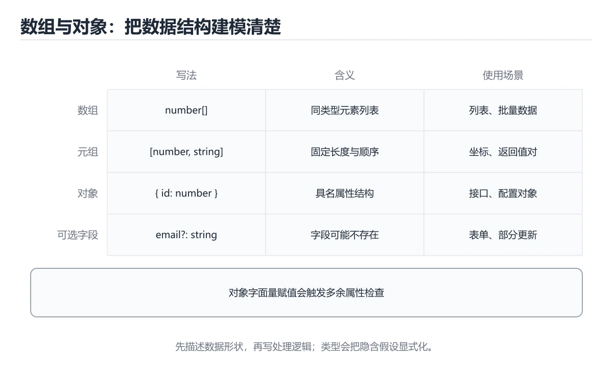
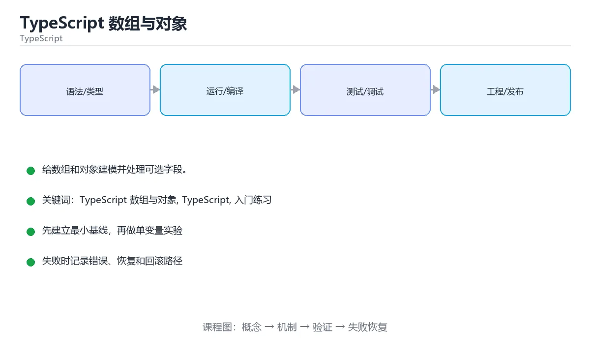

# TypeScript 数组与对象

> 内容更新时间：2026-10-03





## 学习目标

- 先认识TypeScript 数组与对象需要的工具、输入和输出。
- 按步骤运行最小示例，并记录结果与错误。
- 用一个边界输入验证自己是否真正掌握。

## 前置知识

- 会进行基本的文件或命令行操作。
- 不需要预先掌握「TypeScript」的高级知识。

## 一句话入门

给数组和对象建模并处理可选字段。

## 最小示例

```typescript
const scores: Record<string, number> = { a: 90, b: 72 };
const passed = Object.entries(scores).filter(([, value]) => value >= 80);
console.log(passed.map(([key]) => key).join(","));
```

## 预期输出

```text
a
```

## 常见错误

- 把任意字符串赋给联合类型，类型检查失败。
- 复制命令时遗漏空格、引号或必要参数。

## 动手练习

1. 原样运行最小示例，保存命令和输出。
2. 把数字 2 改成 10，预测并验证新结果。
3. 制造一个错误输入，写出错误信息和修复方法。

## 本课小结

- 入门阶段先保证能运行、能观察、能解释，再追求复杂功能。
- 每次只改一个变量，记录预测与实际结果。
- 遇到错误先看第一条错误信息，再回到最小示例。

## 代码实验：把示例跑成证据

### 实验一：建立基线

```typescript
const scores: Record<string, number> = { a: 90, b: 72 };
const passed = Object.entries(scores).filter(([, value]) => value >= 80);
console.log(passed.map(([key]) => key).join(","));
```

### 实验二：只改一个输入

### 实验三：制造一个可控错误

把一个预期为数字的值改成字符串，或者访问不存在的属性。记录结果是 undefined、NaN 还是类型错误，并说明为什么。

| 实验 | 改动 | 预测 | 实际 | 结论 |
| --- | --- | --- | --- | --- |
| 基线 | 保持原样 |  |  |  |
| 边界 |  |  |  |  |
| 失败 |  |  |  |  |

### 实验四：用三句话复述

1. 输入是什么，哪些输入属于合法范围，哪些属于边界或非法范围？
2. 程序按什么顺序处理输入，在哪一步产生了状态变化或副作用？
3. 输出如何验证，失败时第一条可观察证据是什么？

## TypeScript 基础机制速览

### 编译期类型与运行时 JavaScript

TypeScript 在 JavaScript 之上增加静态类型检查，编译后类型信息会被擦除，运行时仍然是 JavaScript。因此类型标注不能替代输入校验，外部数据仍要在边界处验证。`tsc` 负责类型检查和输出，现代项目通常由构建工具调用它。开启 `strict` 能提前发现 null、隐式 any 和函数参数问题，是学习类型系统的重要反馈来源。

### 类型推断、注解与窄化

TypeScript 能从初始值推断类型，局部变量通常不需要重复写注解；公共 API、复杂对象和空值边界适合显式标注。联合类型表示“可能是几种类型之一”，通过 `typeof`、`in`、`instanceof`、判别字段和自定义类型守卫进行窄化。窄化只在当前控制流内有效，异步回调或闭包中类型可能重新变宽，需要重新检查或保存稳定值。

### 接口、类型别名与结构化类型

接口和类型别名都能描述对象形状，接口适合可扩展的公共契约，类型别名适合联合、交叉和函数类型。TypeScript 使用结构化类型：只要对象具有所需成员，就认为它满足类型，不要求显式继承。索引签名、可选属性和只读属性会影响赋值与读取。`unknown` 比 `any` 安全，使用前必须窄化；`never` 表示不可能的值，常用于穷尽检查。

### 泛型、工具类型与模块

泛型让函数和类型在保持类型关系的同时复用逻辑，约束 `extends` 限制可接受的类型。工具类型 `Partial`、`Pick`、`Omit`、`Record` 能从已有类型派生新类型，但过度嵌套会降低可读性。模块使用 `import`/`export`，类型导入使用 `import type` 可以避免生成无用运行时代码。声明文件描述第三方库的类型，缺少类型时应优先找官方类型包，而不是到处使用 any。

### 严格模式与工程实践

`strictNullChecks` 把 null 和 undefined 纳入类型系统，`noImplicitAny` 禁止隐式 any，`noUncheckedIndexedAccess` 让索引访问结果可能为 undefined。类型断言 `as` 只告诉编译器“相信我”，不会改变运行时行为；能用窄化就不用断言。类型测试、运行时校验和端到端测试要配合使用，类型正确不代表业务数据正确。

## 可运行练习

### 任务 1：先跑通，再解释

```typescript
const scores: Record<string, number> = { a: 90, b: 72 };
const passed = Object.entries(scores).filter(([, value]) => value >= 80);
console.log(passed.map(([key]) => key).join(","));
```

### 任务 2：只改一个条件

### 任务 3：迁移到自己的数据

用同一套思路处理一组你自己的数据或场景，保持输出格式与任务 1 一致。

## 故障现场

### 现场 1：本课的 TypeScript 数组与对象 常规用例通过，但边界用例失败

### 现场 2：本课的 TypeScript 结果在两次运行之间不一致

**症状**：在本课的练习或生产场景里出现“本课的 TypeScript 结果在两次运行之间不一致”。

**复现**：准备一组最小输入，只保留触发“本课的 TypeScript 结果在两次运行之间不一致”的必要条件，连续运行两次确认结果稳定。

**定位**：围绕“TypeScript 依赖了当前版本、执行顺序或共享状态，单次运行无法暴露差异”检查调用链、输入数据和环境配置，先验证假设再改代码。

**预防**：把“本课的 TypeScript 结果在两次运行之间不一致”写成一条自动化用例，并在本课的验收清单里保留对应检查项。

### 现场 3：本课的验证只在开发机通过

**症状**：在本课的练习或生产场景里出现“本课的验证只在开发机通过”。

## 版本与时效

- TypeScript 5.x 主线持续收紧类型推导、装饰器与模块解析行为
- 升级前先跑 tsc --noEmit，再处理构建工具与 ESLint 规则差异

### 升级检查清单

- 先固定当前版本，跑通全部示例与测验，再升级工具链。
- 只改一个版本变量，记录编译、测试、性能与产物体积的变化。
- 重点回归默认值、弃用警告、序列化格式、并发语义和错误信息。
- 升级完成后更新本课的“最后复核 / 下次复核”日期与版本说明。

## 本课复习清单

离开本课前，逐项确认：

- [ ] 不看解析，能说出的判断依据。
- [ ] 不看解析，能说出「Object.entries(scores) 的返回类型特点是什么？」的判断依据。
- [ ] 不看解析，能说出「对象类型中的只读属性如何声明？」的判断依据。
- [ ] 不看解析，能说出「TypeScript 数组与对象示例运行后输出什么？」的判断依据。
- [ ] 不看解析，能说出「填空：TypeScript 数组与对象术语速查中，表示的判断依据。
- [ ] 至少运行一次本课示例，记录输入、输出和一个边界情况。
- [ ] 把本课最容易混淆的两个概念写成一句话对照。

| 复盘项 | 记录 |
| --- | --- |
| 已经能独立解释的考点 |  |
| 仍然说不清的概念 |  |
| 下一步验证动作 |  |

## 逐节复习与自检

下面按正文顺序回顾每一节，并给出一个自检问题；说不清的地方回到原章节补课。

### 最小示例

```typescript
const scores: Record<string, number> = { a: 90, b: 72 };
const passed = Object.entries(scores).filter(([, value]) => value >= 80);
console.log(passed.map(([key]) => key).join(","));
```

自检：这一节与相邻主题的边界在哪里？

### 预期输出

```text
a
```

### 动手练习

自检：如果去掉这一节里的一个前提，结论会怎样变化？

## 术语速查

把「TypeScript 数组与对象」里反复出现的术语集中放在一起。复习时先遮住右列，尝试用自己的话解释，再回到正文核对。

| 术语 | 本课语境 |
| --- | --- |
| `[TypeScript 数组与对象, TypeScript, 入门练习][index]` | 在「TypeScript 数组与对象」里理解它的定义、输入和输出。 |
| `[TypeScript 数组与对象, TypeScript, 入门练习][index]` | 本课用它说明边界条件与失败路径。 |
| `[TypeScript 数组与对象, TypeScript, 入门练习][index]` | 结合「TypeScript 数组与对象」的正文示例确认它的适用条件。 |

## 零基础精讲：把TypeScript 数组与对象真正讲透

### 先建立一个直觉

本课的摘要可以当作一张地图：给数组和对象建模并处理可选字段。

### 逐步拆解

2. 描述处理过程。把「TypeScript 数组与对象、TypeScript、入门练习」映射到具体步骤，每步都要求能单独验证。
3. 定义输出。输出不仅包括正常结果，还包括错误码、日志、指标和资源释放状态。
4. 找出一条失败路径。让错误尽早暴露，并说明重试、降级、回滚或人工处理的边界。
5. 用一个小例子贯穿全过程。先手算或预测结果，再运行代码或实验，最后解释差异。

### 把正文串成一条执行链

- **实验一：建立基线**：先原样运行上面的代码，记录命令、完整输出和退出状态
- **实验三：制造一个可控错误**：实验三：制造一个可控错误
- **编译期类型与运行时 JavaScript**：编译期类型与运行时 JavaScript
- **类型推断、注解与窄化**：TypeScript 能从初始值推断类型，局部变量通常不需要重复写注解；公共 API、复杂对象和空值边界适合显式标注

### 从测验反推易错点

- 参考判断：验证 TypeScript 时要固定版本并覆盖边界输入，结论才可复现、学习 TypeScript 数组与对象 时要同时说明输入、输出和失败路径，不能只看正常流程
- 解析：本课把TypeScript 数组与对象拆成概念、示例与故障现场三部分，因此判断 TypeScript 数组与对象 时必须同时交代输入、输出和失败路径，这使“学习 TypeScript 数组与对象 时要同时说明输入、输出和失败路径，不能只看正常流程”成立；在TypeScript 数组与对象里，判断 TypeScript 时要固定版本与边界输入，所以“验证 TypeScript 时要固定版本并覆盖边界输入，结论才可复现”才可复现。相反，“只要 TypeScript 数组与对象 的常规示例通过，就可以跳过边界与异常路径”把一次正常示例当成全部情况，会漏掉本课的边界缺陷；“把 TypeScript 的单次运行结果当成所有版本和规模都成立”把单次结果外推成普遍结论，在TypeScript 数组与对象里忽略了版本和规模变化。对照本课的故障现场与自测清单，就能用证据区分这两种判断。
- 自问：如果去掉题干里的一个限定词，结论还成立吗？

**检查点 2：Object.entries(scores) 的返回类型特点是什么？**

- 参考判断：每个元素是「键, 值」组成的元组，可以解构读取
- 解析：正确答案是「每个元素是「键, 值」组成的元组，可以解构读取」，这道题在问Object.entries(scores)的返回类型特点是什么，判断时要把题干限定的输入、边界与目标逐项对齐。Object.entries 把对象转换成键值对数组，每一项都是 [key, value] 形式的元组，因此可以写成 ([, value]) 只取值或 ([key]) 只取键。

- 参考判断：== 会先做类型转换，"0" 被转成数字 0 后与 false 相等。

**检查点 4：TypeScript 数组与对象示例运行后输出什么？**

- 参考判断：a，过滤出分数不低于 80 的键并以逗号连接
- 解析：正确答案是「a，过滤出分数不低于 80 的键并以逗号连接」，这道题在问TypeScript数组与对象示例运行后输出什么，判断时要把题干限定的输入、边界与目标逐项对齐。scores 中只有 a 的值 90 满足 value >= 80，filter 保留这一项，map 取出键后 join(",") 生成字符串 a。

- 参考判断：tsc

### 工程排错顺序

| 先查什么 | 要得到的证据 | 判断标准 |
| --- | --- | --- |
| 输入与前提是否满足 | 日志、输入样例、测试或指标 | 能复现并解释，才算定位 |
| 核心步骤是否产生了预期中间结果 | 日志、输入样例、测试或指标 | 能复现并解释，才算定位 |
| 失败路径是否可观测、可恢复 | 日志、输入样例、测试或指标 | 能复现并解释，才算定位 |
| 资源、权限与成本是否在预算内 | 日志、输入样例、测试或指标 | 能复现并解释，才算定位 |

### 变式训练

1. 把它放进一个只有单机、没有额外依赖的小项目，先保证正确，再考虑扩展。
2. 把输入规模扩大十倍，记录时间、内存和失败路径，找出第一个真正瓶颈。
3. 制造一次依赖超时或错误输入，要求系统给出可解释错误并且不留下半完成状态。
5. 删掉一个看似必要的步骤，观察哪个测试或指标先失败，用证据说明它为什么必要。
6. 把方案切换到低资源设备，重新评估默认参数、超时和降级策略。

### 本课自测

- [ ] 能用一句话解释TypeScript 数组与对象在本课中的角色与边界。
- [ ] 能举出一个正常例子和一个失败例子。
- [ ] 能说出最小验证步骤，以及需要记录的证据。
- [ ] 能用一句话解释「TypeScript」在本课中的角色与边界。
- [ ] 能用一句话解释「入门练习」在本课中的角色与边界。

### 迁移案例库

下面用不同约束重复同一套方法。每完成一轮，都把结论写进笔记，并只改变一个变量。

#### 迁移案例 1：围绕TypeScript 数组与对象做一次小实验

**目标**：在不改变课程主体的前提下，验证TypeScript 数组与对象中的一个关键判断。

**步骤**：
1. 复述当前方案对本课的假设，写成一句可证伪的话。
2. 设计一个正常输入和一个边界输入，分别预测输出。
3. 运行或逐步演算，记录实际输出、耗时和失败信息。
4. 只调整一个参数，比较前后差异并解释原因。
5. 补充一条测试或复习卡，确保下次能更快复现。

**验收**：结论有证据、差异可解释、失败可恢复；如果做不到，说明还需要缩小问题范围。

#### 迁移案例 2：围绕「TypeScript」做一次小实验

**步骤**：
1. 复述当前方案对「TypeScript」的假设，写成一句可证伪的话。

#### 迁移案例 3：围绕「入门练习」做一次小实验

**步骤**：
1. 复述当前方案对「入门练习」的假设，写成一句可证伪的话。

#### 迁移案例 4：围绕TypeScript 数组与对象做一次小实验

**步骤**：

#### 迁移案例 5：围绕「TypeScript」做一次小实验

**步骤**：

#### 迁移案例 6：围绕「入门练习」做一次小实验

**步骤**：

#### 迁移案例 7：围绕TypeScript 数组与对象做一次小实验

**步骤**：

#### 迁移案例 8：围绕「TypeScript」做一次小实验

**步骤**：

#### 迁移案例 9：围绕「入门练习」做一次小实验

**步骤**：

#### 迁移案例 10：围绕TypeScript 数组与对象做一次小实验

**步骤**：

#### 迁移案例 11：围绕「TypeScript」做一次小实验

**步骤**：

#### 迁移案例 12：围绕「入门练习」做一次小实验

**步骤**：

#### 迁移案例 13：围绕TypeScript 数组与对象做一次小实验

**步骤**：

#### 迁移案例 14：围绕「TypeScript」做一次小实验

**步骤**：

#### 迁移案例 15：围绕「入门练习」做一次小实验

**步骤**：

#### 迁移案例 16：围绕TypeScript 数组与对象做一次小实验

**步骤**：

<!-- p0-depth-v2:end -->

## 考点精讲

### 考点 1：围绕“TypeScript 数组与对象”中的 TypeScript 数组与对象、TypeScript、入门练习，下列哪两项是本课强调的实践判断？

- **判断依据**：在「TypeScript 数组与对象」里，验证 TypeScript 时要固定版本并覆盖边界输入，结论才可复现；学习 TypeScript 数组与对象 时要同时说明输入、输出和失败路径，不能只看正常流程。在「TypeScript 数组与对象」里判断这道题，要把TypeScript 数组与对象、TypeScript、入门练习的条件、过程与失败路径逐项对齐，换成“围绕TypeScript 数组与对象”这个场景，只有满足前提的结论才成立。

### 考点 2：Object.entries(scores) 的返回类型特点是什么？

- **判断依据**：在「TypeScript 数组与对象」里，每个元素是「键, 值」组成的元组，可以解构读取。Object.entries 把对象转换成键值对数组，每一项都是 [key, value] 形式的元组，因此可以写成 ([, value]) 只取值或 ([key]) 只取键。“Object.entries(scores)”与「TypeScript 数组与对象」的术语表相呼应，只有符合TypeScript 数组与对象、TypeScript、入门练习约束的“每个元素是键, 值组成的元组”才是正文支持的结论。

### 考点 3：下面这段 TypeScript 代码摘自「TypeScript 数组与对象」的正文示例。关于这段代码，下面哪一项说法与实际内容相符？

- **判断依据**：在「TypeScript 数组与对象」里，这段代码会产生可观察的输出，运行后能看到结果。这段代码出自「TypeScript 数组与对象」的正文示例，围绕TypeScript 数组与对象、TypeScript、入门练习展开；把输入或边界换成空值、极值或失败情况后，结论要以「TypeScript 数组与对象」的实际运行结果为准。

### 考点 4：TypeScript 数组与对象示例运行后输出什么？

- **判断依据**：在「TypeScript 数组与对象」里，结论应落在「a，过滤出分数不低于 80 的键并以逗号连接」。scores 中只有 a 的值 90 满足 value >= 80，filter 保留这一项，map 取出键后 join(",") 生成字符串 a。在「TypeScript 数组与对象」里，这道题要求区分概念与边界，「a，过滤出分数不低于 80 的键并以逗号连接」只有在题干给出的前提下才成立，而「b，只有未通过的项会被保留」、「a,b，两个键都满足过滤条件」缺少同一组条件。

### 考点 5：填空：在「TypeScript 数组与对象」的术语速查里，「TypeScript 在 JavaScript 之上增加静态类型检查，编译后类型信息会被擦除，运行时仍然是 JavaScript。因此类型标注不能替代输入校验，外部数据仍要在边界处验证。`____` 负责类型检查和输出，现代项目通常由构建工具」描述的是哪个术语？

- **判断依据**：在「TypeScript 数组与对象」里，tsc。因此类型标注不能替代输入校验，外部数据仍要在边界处验证。在「TypeScript 数组与对象」里判断这道题，要把TypeScript 数组与对象、TypeScript、入门练习的条件、过程与失败路径逐项对齐，换成“填空”这个场景，只有满足前提的结论才成立。

## English Overview

**Title:** TypeScript Arrays and Objects

**Summary:** Model arrays and objects with optional fields.

**Category:** TypeScript
**Level:** 入门
**Key terms:** TypeScript 数组与对象, TypeScript, 入门练习

## 内容元数据

- 内容版本：v2.0
- 最后更新：2026-10-03
- 学习阶段：入门
- 适用环境：TypeScript 5.x / Node.js 22+
- 内容来源：内置结构化课程与工程实践整理
- 相关主题：TypeScript 数组与对象、TypeScript、入门练习
- 质量版本：P0 测验标准 + P1 覆盖扩展 + P2 体验补全

## 参考资料与复核

- 最后复核：2026-10-04
- 下次复核：2027-04-04
- 复核范围：版本兼容、API 行为、安全建议与工程实践
- 来源性质：官方文档、标准或权威教材；正文为离线教学重组

| 参考资料 | 本课用途 |
| --- | --- |
| [TypeScript Handbook](https://www.typescriptlang.org/docs/handbook/intro.html) | 类型系统与语言指南 |
| [Utility Types](https://www.typescriptlang.org/docs/handbook/utility-types.html) | 内置类型变换 |
| [泛型文档](https://www.typescriptlang.org/docs/handbook/2/generics.html) | 泛型约束与复用 |

> 「TypeScript 数组与对象」的链接用于离线阅读后的延伸核对；App 不会自动联网。

## 复习与迁移

复习目标：把「TypeScript 数组与对象」的判断标准放回可复现的例子里。先自己作答，再对照依据；如果结论正确但理由不完整，回到正文补足前提。

### 概念复述

- 用一句话说明「TypeScript 数组与对象」解决什么问题：给数组和对象建模并处理可选字段。
- 写出TypeScript 数组与对象、TypeScript、入门练习之间的关系，并各举一个例子。
- 说出本课最容易混淆的两个概念，以及区分它们的判据。

### 正文逐节复核

- **TypeScript 基础机制速览**：TypeScript 在 JavaScript 之上增加静态类型检查，编译后类型信息会被擦除，运行时仍然是 JavaScript。

### 测验回顾

1. 围绕“TypeScript 数组与对象”中的 TypeScript 数组与对象、TypeScript、入门练习，下列哪两项是本课强调的实践判断？
   - 依据：在「TypeScript 数组与对象」里，验证 TypeScript 时要固定版本并覆盖边界输入，结论才可复现；学习 TypeScript 数组与对象 时要同时说明输入、输出和失败路径，不能只看正常流程。在「TypeScript 数组与对象」里判断这道题，要把TypeScript 数组与对象、TypeScript、入门练习的条件、过程与失败路径逐项对齐，换成“围绕TypeScript 数组与对象”这个场景，只有满足前提的结论才成立。
2. Object.entries(scores) 的返回类型特点是什么？
   - 依据：在「TypeScript 数组与对象」里，每个元素是「键, 值」组成的元组，可以解构读取。Object.entries 把对象转换成键值对数组，每一项都是 [key, value] 形式的元组，因此可以写成 ([, value]) 只取值或 ([key]) 只取键。“Object.entries(scores)”与「TypeScript 数组与对象」的术语表相呼应，只有符合TypeScript 数组与对象、TypeScript、入门练习约束的“每个元素是键, 值组成的元组”才是正文支持的结论。
3. 下面这段 TypeScript 代码摘自「TypeScript 数组与对象」的正文示例。关于这段代码，下面哪一项说法与实际内容相符？
   - 依据：在「TypeScript 数组与对象」里，这段代码会产生可观察的输出，运行后能看到结果。这段代码出自「TypeScript 数组与对象」的正文示例，围绕TypeScript 数组与对象、TypeScript、入门练习展开；把输入或边界换成空值、极值或失败情况后，结论要以「TypeScript 数组与对象」的实际运行结果为准。
4. TypeScript 数组与对象示例运行后输出什么？
   - 依据：在「TypeScript 数组与对象」里，结论应落在「a，过滤出分数不低于 80 的键并以逗号连接」。scores 中只有 a 的值 90 满足 value >= 80，filter 保留这一项，map 取出键后 join(",") 生成字符串 a。在「TypeScript 数组与对象」里，这道题要求区分概念与边界，「a，过滤出分数不低于 80 的键并以逗号连接」只有在题干给出的前提下才成立，而「b，只有未通过的项会被保留」、「a,b，两个键都满足过滤条件」缺少同一组条件。
5. 填空：在「TypeScript 数组与对象」的术语速查里，「TypeScript 在 JavaScript 之上增加静态类型检查，编译后类型信息会被擦除，运行时仍然是 JavaScript。因此类型标注不能替代输入校验，外部数据仍要在边界处验证。`____` 负责类型检查和输出，现代项目通常由构建工具」描述的是哪个术语？
   - 依据：在「TypeScript 数组与对象」里，tsc。因此类型标注不能替代输入校验，外部数据仍要在边界处验证。在「TypeScript 数组与对象」里判断这道题，要把TypeScript 数组与对象、TypeScript、入门练习的条件、过程与失败路径逐项对齐，换成“填空”这个场景，只有满足前提的结论才成立。

### 迁移练习
