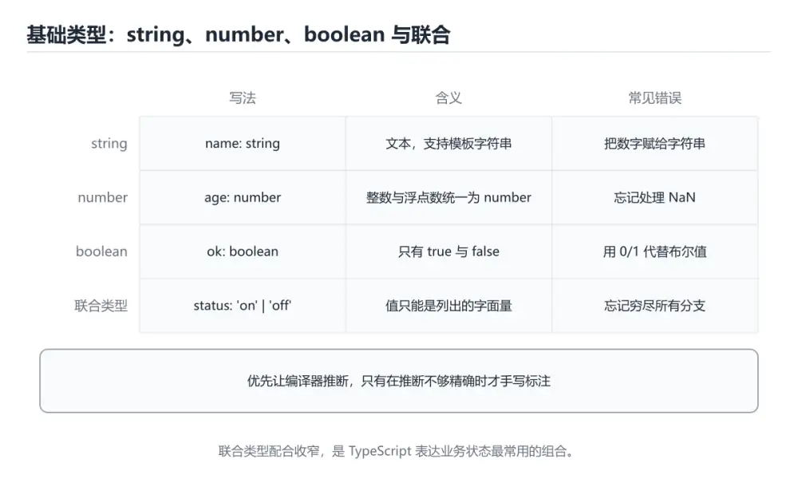
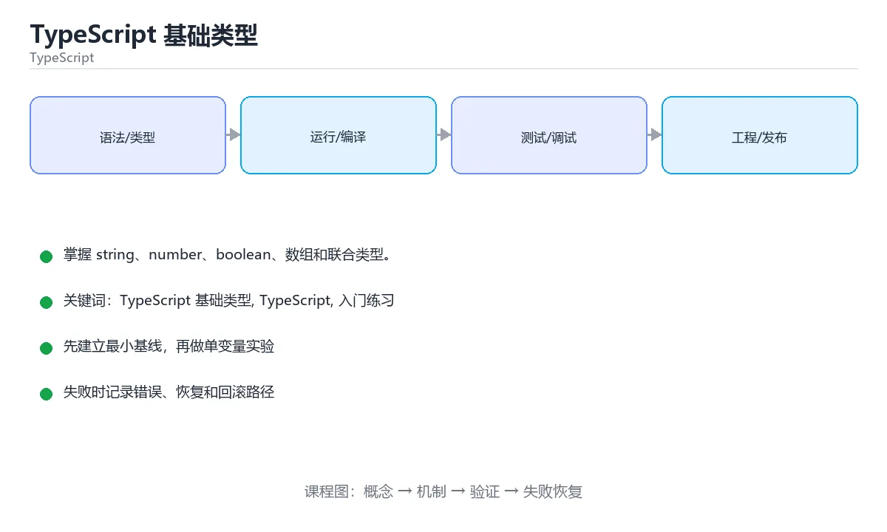

# TypeScript 基础类型





> 内容更新时间：2026-10-03 · 学习阶段：入门 · 预计用时：15 分钟

## 学习目标

- 先认识「TypeScript 基础类型」需要的工具、输入和输出。
- 按步骤运行最小示例，并记录结果与错误。
- 用一个边界输入验证自己是否真正掌握。

## 前置知识

- 会进行基本的文件或命令行操作。
- 不需要预先掌握「TypeScript」的高级知识。

## 一句话入门

掌握 string、number、boolean、数组和联合类型。

## 最小示例

```typescript
let count: number = 3;
count += 1;
console.log(`count=${count}`);
```

## 预期输出

```text
count=4
```

## 常见错误

- 把任意字符串赋给联合类型，类型检查失败。
- 复制命令时遗漏空格、引号或必要参数。

## 动手练习

1. 原样运行最小示例，保存命令和输出。
2. 把数字 2 改成 10，预测并验证新结果。
3. 制造一个错误输入，写出错误信息和修复方法。

## 本课小结

- 入门阶段先保证能运行、能观察、能解释，再追求复杂功能。
- 每次只改一个变量，记录预测与实际结果。
- 遇到错误先看第一条错误信息，再回到最小示例。


## 代码实验：把示例跑成证据

这一节不引入新语法，而是把「TypeScript 基础类型」的最小示例变成可以复现、可以对照的实验。每次只改变一个条件，先写预测，再运行，最后解释差异。

### 实验一：建立基线

```typescript
let count: number = 3;
count += 1;
console.log(`count=${count}`);
```

先原样运行上面的代码，记录命令、完整输出和退出状态。然后把输出与正文的预期输出逐字对照，不要用“看起来差不多”代替核对；空格、大小写、换行和错误流向都可能暴露环境差异。

### 实验二：只改一个输入

从代码中选一个会影响结果的字面量、参数或输入，把它替换成边界值：数值可尝试 0、1、最大值和最小值，字符串可尝试空串和超长文本，集合可尝试空集合、单元素和重复元素。先写出预测，再运行并记录实际结果。

### 实验三：制造一个可控错误

把一个预期为数字的值改成字符串，或者访问不存在的属性。记录结果是 undefined、NaN 还是类型错误，并说明为什么。

| 实验 | 改动 | 预测 | 实际 | 结论 |
| --- | --- | --- | --- | --- |
| 基线 | 保持原样 |  |  |  |
| 边界 |  |  |  |  |
| 失败 |  |  |  |  |

### 实验四：用三句话复述

1. 输入是什么，哪些输入属于合法范围，哪些属于边界或非法范围？
2. 程序按什么顺序处理输入，在哪一步产生了状态变化或副作用？
3. 输出如何验证，失败时第一条可观察证据是什么？

## TypeScript 基础机制速览

### 编译期类型与运行时 JavaScript

TypeScript 在 JavaScript 之上增加静态类型检查，编译后类型信息会被擦除，运行时仍然是 JavaScript。因此类型标注不能替代输入校验，外部数据仍要在边界处验证。`tsc` 负责类型检查和输出，现代项目通常由构建工具调用它。开启 `strict` 能提前发现 null、隐式 any 和函数参数问题，是学习类型系统的重要反馈来源。

### 类型推断、注解与窄化

TypeScript 能从初始值推断类型，局部变量通常不需要重复写注解；公共 API、复杂对象和空值边界适合显式标注。联合类型表示“可能是几种类型之一”，通过 `typeof`、`in`、`instanceof`、判别字段和自定义类型守卫进行窄化。窄化只在当前控制流内有效，异步回调或闭包中类型可能重新变宽，需要重新检查或保存稳定值。

### 接口、类型别名与结构化类型

接口和类型别名都能描述对象形状，接口适合可扩展的公共契约，类型别名适合联合、交叉和函数类型。TypeScript 使用结构化类型：只要对象具有所需成员，就认为它满足类型，不要求显式继承。索引签名、可选属性和只读属性会影响赋值与读取。`unknown` 比 `any` 安全，使用前必须窄化；`never` 表示不可能的值，常用于穷尽检查。

### 泛型、工具类型与模块

泛型让函数和类型在保持类型关系的同时复用逻辑，约束 `extends` 限制可接受的类型。工具类型 `Partial`、`Pick`、`Omit`、`Record` 能从已有类型派生新类型，但过度嵌套会降低可读性。模块使用 `import`/`export`，类型导入使用 `import type` 可以避免生成无用运行时代码。声明文件描述第三方库的类型，缺少类型时应优先找官方类型包，而不是到处使用 any。

### 严格模式与工程实践

`strictNullChecks` 把 null 和 undefined 纳入类型系统，`noImplicitAny` 禁止隐式 any，`noUncheckedIndexedAccess` 让索引访问结果可能为 undefined。类型断言 `as` 只告诉编译器“相信我”，不会改变运行时行为；能用窄化就不用断言。类型测试、运行时校验和端到端测试要配合使用，类型正确不代表业务数据正确。

## 本课自测清单与错误对照

下面把「TypeScript 基础类型」最容易混淆的选项集中起来。不要只记正确答案，要能说明错误选项在什么条件下看似合理、又为什么不能满足题干。

本课测验以直接定义和步骤判断为主。请把每个错误选项改写成一句反例，
说明它在哪个输入、边界或前提变化下会失败。

### 完成标准

- [ ] 能用具体输入复现最小示例，并逐行解释输入、处理与输出。
- [ ] 能只改一个值完成边界实验，并让预测与实际结果一致。
- [ ] 能制造一个可控错误，读出第一条错误信息并完成修复。
- [ ] 能不看书说出本课至少两个易错点和对应的验证方法。

### 复盘记录

| 项目 | 记录 |
| --- | --- |
| 学到的核心机制 |  |
| 仍然不确定的问题 |  |
| 下一步验证动作 |  |


## 考点精讲：把测验题还原成判断过程

本课有 4 个判断点。先自己作答，再看「判断依据」；如果结论正确但理由不完整，回到正文对应章节补足概念。

### 考点 1：TypeScript 中表示「数字或字符串都可以」的联合类型写法是？

- **正确判断**：let value: number | string; 用竖线连接候选类型
- **判断依据**：正确答案是「let value: number | string; 用竖线连接候选类型」，本课在「一句话入门」中说明：掌握 string、number、boolean、数组和联合类型。联合类型用竖线连接，表示值可以是其中任意一种。课程摘要指出掌握 string，number，boolean，数组和联合类型，本课要判断的正是TypeScript中表示数字或字符串都可以的联合类型写法是。
- **迁移检查**：遮住选项，只根据定义复述一次答案，再回来看哪个选项与复述一致。

### 考点 2：声明一个字符串数组，下列哪种写法有效？

- **正确判断**：let names: string[]; 或 let names: Array<string>;
- **判断依据**：正确答案是「let names: string[]; 或 let names: Array<string>;」，本课在「一句话入门」中说明：掌握 string、number、boolean、数组和联合类型。string[] 与 Array<string> 都表示元素为字符串的数组，前者更简洁，后者在泛型组合时更易读。
- **迁移检查**：把题干里的一个条件换成边界值，原来的结论还成立吗？写出判断过程。

### 考点 3：示例中 let count: number = 3; count += 1; 输出是什么？

- **正确判断**：count=4，变量允许重新赋值后再输出
- **判断依据**：正确答案是「count=4，变量允许重新赋值后再输出」，这道题在问示例中letcount:number=3;count+=1;输出是什么，判断时要把题干限定的输入、边界与目标逐项对齐。let 允许重新赋值，count += 1 把 3 更新为 4，模板字符串再把它拼进输出文本。
- **迁移检查**：把题干里的一个条件换成边界值，原来的结论还成立吗？写出判断过程。

### 考点 4：运行下面的 TypeScript 代码，控制台输出是什么？

- **正确判断**：参考输出：6
- **判断依据**：values 被标注为 number[]，数组中的 1、2、3 都是数字。reduce 从初始值 0 开始，依次执行 0+1、1+2、3+3，最终得到 6。课程摘要指出掌握 string，number，boolean，数组和联合类型，本课要判断的正是运行下面的TypeScript代码，控制台输出是什么。
- **迁移检查**：这段代码在哪一行产生副作用？删掉它会得到什么结果？

## 本课复习清单

离开本课前，逐项确认：

- [ ] 不看解析，能说出「TypeScript 中表示「数字或字符串都可以」的联合类型写法是？」的判断依据。
- [ ] 不看解析，能说出「声明一个字符串数组，下列哪种写法有效？」的判断依据。
- [ ] 不看解析，能说出「示例中 let count: number = 3; count += 1; 输…」的判断依据。
- [ ] 不看解析，能说出「运行下面的 TypeScript 代码，控制台输出是什么？」的判断依据。
- [ ] 至少运行一次本课示例，记录输入、输出和一个边界情况。
- [ ] 把本课最容易混淆的两个概念写成一句话对照。

| 复盘项 | 记录 |
| --- | --- |
| 已经能独立解释的考点 |  |
| 仍然说不清的概念 |  |
| 下一步验证动作 |  |

## 逐节复习与自检

下面按正文顺序回顾每一节，并给出一个自检问题；说不清的地方回到原章节补课。

### 一句话入门

掌握 string、number、boolean、数组和联合类型。

自检：这一节的关键输入与输出分别是什么？

### 最小示例

```typescript
let count: number = 3;
count += 1;
console.log(`count=${count}`);
```

自检：这一节与相邻主题的边界在哪里？

### 预期输出

```text
count=4
```

自检：这一节与相邻主题的边界在哪里？

### 动手练习

把数字 2 改成 10，预测并验证新结果。制造一个错误输入，写出错误信息和修复方法。

自检：如果去掉这一节里的一个前提，结论会怎样变化？

## 术语速查

把本课反复出现的术语集中放在一起。复习时先遮住右列，尝试用自己的话解释，再回到正文核对。

| 术语 | 本课语境 |
| --- | --- |
| `tsc` | TypeScript 在 JavaScript 之上增加静态类型检查，编译后类型信息会被擦除，运行时仍然是 JavaScript。因此类型标注不能替代输入校验，外部数据仍要在边界处验证。`tsc` 负责类型检查和输出，现… |
| `strict` | TypeScript 在 JavaScript 之上增加静态类型检查，编译后类型信息会被擦除，运行时仍然是 JavaScript。因此类型标注不能替代输入校验，外部数据仍要在边界处验证。`tsc` 负责类型检查和输出，现… |
| `typeof` | TypeScript 能从初始值推断类型，局部变量通常不需要重复写注解；公共 API、复杂对象和空值边界适合显式标注。联合类型表示“可能是几种类型之一”，通过 `typeof`、`in`、`instanceof`、判别字… |
| `in` | TypeScript 能从初始值推断类型，局部变量通常不需要重复写注解；公共 API、复杂对象和空值边界适合显式标注。联合类型表示“可能是几种类型之一”，通过 `typeof`、`in`、`instanceof`、判别字… |
| `instanceof` | TypeScript 能从初始值推断类型，局部变量通常不需要重复写注解；公共 API、复杂对象和空值边界适合显式标注。联合类型表示“可能是几种类型之一”，通过 `typeof`、`in`、`instanceof`、判别字… |
| `unknown` | 接口和类型别名都能描述对象形状，接口适合可扩展的公共契约，类型别名适合联合、交叉和函数类型。TypeScript 使用结构化类型：只要对象具有所需成员，就认为它满足类型，不要求显式继承。索引签名、可选属性和只读属性会影响… |
| `any` | 接口和类型别名都能描述对象形状，接口适合可扩展的公共契约，类型别名适合联合、交叉和函数类型。TypeScript 使用结构化类型：只要对象具有所需成员，就认为它满足类型，不要求显式继承。索引签名、可选属性和只读属性会影响… |
| `never` | 接口和类型别名都能描述对象形状，接口适合可扩展的公共契约，类型别名适合联合、交叉和函数类型。TypeScript 使用结构化类型：只要对象具有所需成员，就认为它满足类型，不要求显式继承。索引签名、可选属性和只读属性会影响… |
| `extends` | 泛型让函数和类型在保持类型关系的同时复用逻辑，约束 `extends` 限制可接受的类型。工具类型 `Partial`、`Pick`、`Omit`、`Record` 能从已有类型派生新类型，但过度嵌套会降低可读性。模块使… |
| `Partial` | 泛型让函数和类型在保持类型关系的同时复用逻辑，约束 `extends` 限制可接受的类型。工具类型 `Partial`、`Pick`、`Omit`、`Record` 能从已有类型派生新类型，但过度嵌套会降低可读性。模块使… |
| `Pick` | 泛型让函数和类型在保持类型关系的同时复用逻辑，约束 `extends` 限制可接受的类型。工具类型 `Partial`、`Pick`、`Omit`、`Record` 能从已有类型派生新类型，但过度嵌套会降低可读性。模块使… |
| `Omit` | 泛型让函数和类型在保持类型关系的同时复用逻辑，约束 `extends` 限制可接受的类型。工具类型 `Partial`、`Pick`、`Omit`、`Record` 能从已有类型派生新类型，但过度嵌套会降低可读性。模块使… |

## 面试问答与自测

下面把本课考点换成面试追问。先口述自己的答案，
再对照参考回答检查是否遗漏了前提、边界或失败路径。

### 追问 1：TypeScript 中表示「数字或字符串都可以」的联合类型写法是？

**参考回答**：正确答案是「let value: number | string; 用竖线连接候选类型」，本课在「一句话入门」中说明：掌握 string、number、boolean、数组和联合类型。联合类型用竖线连接，表示值可以是其中任意一种。课程摘要指出掌握 string，number，boolean，数组和联合类型，本课要判断的正是TypeScript中表示数字或字符串都可以的联合类型写法是。

### 追问 2：声明一个字符串数组，下列哪种写法有效？

**参考回答**：正确答案是「let names: string[]; 或 let names: Array<string>;」，本课在「一句话入门」中说明：掌握 string、number、boolean、数组和联合类型。string[] 与 Array<string> 都表示元素为字符串的数组，前者更简洁，后者在泛型组合时更易读。

### 追问 3：示例中 let count: number = 3; count += 1; 输出是什么？

**参考回答**：正确答案是「count=4，变量允许重新赋值后再输出」，这道题在问示例中letcount:number=3;count+=1;输出是什么，判断时要把题干限定的输入、边界与目标逐项对齐。let 允许重新赋值，count += 1 把 3 更新为 4，模板字符串再把它拼进输出文本。

### 追问 4：运行下面的 TypeScript 代码，控制台输出是什么？

**参考回答**：values 被标注为 number[]，数组中的 1、2、3 都是数字。reduce 从初始值 0 开始，依次执行 0+1、1+2、3+3，最终得到 6。课程摘要指出掌握 string，number，boolean，数组和联合类型，本课要判断的正是运行下面的TypeScript代码，控制台输出是什么。

<!-- p0-depth-v2:start -->
## 零基础精讲：把「TypeScript 基础类型」真正讲透

### 先建立一个直觉

把「TypeScript 基础类型」看成一个有输入、处理、输出和失败边界的工程问题。先定义什么叫正确，再讨论性能和扩展。

本课的摘要可以当作一张地图：掌握 string、number、boolean、数组和联合类型。

阅读时不要只记结论，先问三个问题：它解决什么问题？依赖哪些前提？在什么条件下会失效？

### 逐步拆解

1. 识别输入。先写清数据类型、取值范围、空值策略，以及输入来自用户、文件还是另一个服务。
2. 描述处理过程。把「TypeScript 基础类型、TypeScript、入门练习」映射到具体步骤，每步都要求能单独验证。
3. 定义输出。输出不仅包括正常结果，还包括错误码、日志、指标和资源释放状态。
4. 找出一条失败路径。让错误尽早暴露，并说明重试、降级、回滚或人工处理的边界。
5. 用一个小例子贯穿全过程。先手算或预测结果，再运行代码或实验，最后解释差异。

### 把正文串成一条执行链

- **实验一：建立基线**：先原样运行上面的代码，记录命令、完整输出和退出状态
- **实验二：只改一个输入**：从代码中选一个会影响结果的字面量、参数或输入，把它替换成边界值：数值可尝试 0、1、最大值和最小值，字符串可尝试空串和超长文本，集合可尝试空集合、单元素和重复元素
- **实验三：制造一个可控错误**：实验三：制造一个可控错误
- **实验四：用三句话复述**：1. 输入是什么，哪些输入属于合法范围，哪些属于边界或非法范围
- **编译期类型与运行时 JavaScript**：编译期类型与运行时 JavaScript
- **类型推断、注解与窄化**：TypeScript 能从初始值推断类型，局部变量通常不需要重复写注解；公共 API、复杂对象和空值边界适合显式标注

### 从测验反推易错点

**检查点 1：TypeScript 中表示「数字或字符串都可以」的联合类型写法是？**

- 参考判断：let value: number | string; 用竖线连接候选类型
- 解析：正确答案是「let value: number | string; 用竖线连接候选类型」，本课在「一句话入门」中说明：掌握 string、number、boolean、数组和联合类型。联合类型用竖线连接，表示值可以是其中任意一种。课程摘要指出掌握 string，number，boolean，数组和联合类型，本课要判断的正是TypeScript中表示数字或字符串都可以的联合类型写法是。
- 自问：如果去掉题干里的一个限定词，结论还成立吗？

**检查点 2：声明一个字符串数组，下列哪种写法有效？**

- 参考判断：let names: string[]; 或 let names: Array<string>;
- 解析：正确答案是「let names: string[]; 或 let names: Array<string>;」，本课在「一句话入门」中说明：掌握 string、number、boolean、数组和联合类型。string[] 与 Array<string> 都表示元素为字符串的数组，前者更简洁，后者在泛型组合时更易读。
- 自问：如果去掉题干里的一个限定词，结论还成立吗？

**检查点 3：示例中 let count: number = 3; count += 1; 输出是什么？**

- 参考判断：count=4，变量允许重新赋值后再输出
- 解析：正确答案是「count=4，变量允许重新赋值后再输出」，这道题在问示例中letcount:number=3;count+=1;输出是什么，判断时要把题干限定的输入、边界与目标逐项对齐。let 允许重新赋值，count += 1 把 3 更新为 4，模板字符串再把它拼进输出文本。
- 自问：如果去掉题干里的一个限定词，结论还成立吗？

**检查点 4：运行下面的 TypeScript 代码，控制台输出是什么？**

- 参考判断：6
- 解析：values 被标注为 number[]，数组中的 1、2、3 都是数字。reduce 从初始值 0 开始，依次执行 0+1、1+2、3+3，最终得到 6。课程摘要指出掌握 string，number，boolean，数组和联合类型，本课要判断的正是运行下面的TypeScript代码，控制台输出是什么。
- 自问：如果去掉题干里的一个限定词，结论还成立吗？

### 工程排错顺序

| 先查什么 | 要得到的证据 | 判断标准 |
| --- | --- | --- |
| 输入与前提是否满足 | 日志、输入样例、测试或指标 | 能复现并解释，才算定位 |
| 核心步骤是否产生了预期中间结果 | 日志、输入样例、测试或指标 | 能复现并解释，才算定位 |
| 失败路径是否可观测、可恢复 | 日志、输入样例、测试或指标 | 能复现并解释，才算定位 |
| 资源、权限与成本是否在预算内 | 日志、输入样例、测试或指标 | 能复现并解释，才算定位 |

排查顺序应遵循「先复现、再缩小范围、再验证假设、最后修改」。不要同时改多个变量，否则即使问题消失，也无法知道真正原因。

### 变式训练

1. 把它放进一个只有单机、没有额外依赖的小项目，先保证正确，再考虑扩展。
2. 把输入规模扩大十倍，记录时间、内存和失败路径，找出第一个真正瓶颈。
3. 制造一次依赖超时或错误输入，要求系统给出可解释错误并且不留下半完成状态。
4. 让另一个同学只读接口说明和测试用例，复现你的结论；无法复现的部分继续补文档或测试。
5. 删掉一个看似必要的步骤，观察哪个测试或指标先失败，用证据说明它为什么必要。
6. 把方案切换到低资源设备，重新评估默认参数、超时和降级策略。

每道变式都写下：预测、实际结果、差异、下一步。没有留下证据的练习，很难迁移到真实项目。

### 本课自测

- [ ] 能用一句话解释「TypeScript 基础类型」在本课中的角色与边界。
- [ ] 能举出一个正常例子和一个失败例子。
- [ ] 能说出最小验证步骤，以及需要记录的证据。
- [ ] 能用一句话解释「TypeScript」在本课中的角色与边界。
- [ ] 能举出一个正常例子和一个失败例子。
- [ ] 能说出最小验证步骤，以及需要记录的证据。
- [ ] 能用一句话解释「入门练习」在本课中的角色与边界。
- [ ] 能举出一个正常例子和一个失败例子。
- [ ] 能说出最小验证步骤，以及需要记录的证据。
- [ ] 能用一句话解释「TypeScript 基础类型」在本课中的角色与边界。
- [ ] 能举出一个正常例子和一个失败例子。
- [ ] 能说出最小验证步骤，以及需要记录的证据。
- [ ] 能用一句话解释「TypeScript」在本课中的角色与边界。
- [ ] 能举出一个正常例子和一个失败例子。
- [ ] 能说出最小验证步骤，以及需要记录的证据。

### 迁移案例库

下面用不同约束重复同一套方法。每完成一轮，都把结论写进笔记，并只改变一个变量。

#### 迁移案例 1：围绕「TypeScript 基础类型」做一次小实验

**目标**：在不改变课程主体的前提下，验证「TypeScript 基础类型」中的一个关键判断。

**步骤**：
1. 复述当前方案对「TypeScript 基础类型」的假设，写成一句可证伪的话。
2. 设计一个正常输入和一个边界输入，分别预测输出。
3. 运行或逐步演算，记录实际输出、耗时和失败信息。
4. 只调整一个参数，比较前后差异并解释原因。
5. 补充一条测试或复习卡，确保下次能更快复现。

**验收**：结论有证据、差异可解释、失败可恢复；如果做不到，说明还需要缩小问题范围。

#### 迁移案例 2：围绕「TypeScript」做一次小实验

**目标**：在不改变课程主体的前提下，验证「TypeScript 基础类型」中的一个关键判断。

**步骤**：
1. 复述当前方案对「TypeScript」的假设，写成一句可证伪的话。
2. 设计一个正常输入和一个边界输入，分别预测输出。
3. 运行或逐步演算，记录实际输出、耗时和失败信息。
4. 只调整一个参数，比较前后差异并解释原因。
5. 补充一条测试或复习卡，确保下次能更快复现。

**验收**：结论有证据、差异可解释、失败可恢复；如果做不到，说明还需要缩小问题范围。

#### 迁移案例 3：围绕「入门练习」做一次小实验

**目标**：在不改变课程主体的前提下，验证「TypeScript 基础类型」中的一个关键判断。

**步骤**：
1. 复述当前方案对「入门练习」的假设，写成一句可证伪的话。
2. 设计一个正常输入和一个边界输入，分别预测输出。
3. 运行或逐步演算，记录实际输出、耗时和失败信息。
4. 只调整一个参数，比较前后差异并解释原因。
5. 补充一条测试或复习卡，确保下次能更快复现。

**验收**：结论有证据、差异可解释、失败可恢复；如果做不到，说明还需要缩小问题范围。

#### 迁移案例 4：围绕「TypeScript 基础类型」做一次小实验

**目标**：在不改变课程主体的前提下，验证「TypeScript 基础类型」中的一个关键判断。

**步骤**：
1. 复述当前方案对「TypeScript 基础类型」的假设，写成一句可证伪的话。
2. 设计一个正常输入和一个边界输入，分别预测输出。
3. 运行或逐步演算，记录实际输出、耗时和失败信息。
4. 只调整一个参数，比较前后差异并解释原因。
5. 补充一条测试或复习卡，确保下次能更快复现。

**验收**：结论有证据、差异可解释、失败可恢复；如果做不到，说明还需要缩小问题范围。

#### 迁移案例 5：围绕「TypeScript」做一次小实验

**目标**：在不改变课程主体的前提下，验证「TypeScript 基础类型」中的一个关键判断。

**步骤**：
1. 复述当前方案对「TypeScript」的假设，写成一句可证伪的话。
2. 设计一个正常输入和一个边界输入，分别预测输出。
3. 运行或逐步演算，记录实际输出、耗时和失败信息。
4. 只调整一个参数，比较前后差异并解释原因。
5. 补充一条测试或复习卡，确保下次能更快复现。

**验收**：结论有证据、差异可解释、失败可恢复；如果做不到，说明还需要缩小问题范围。

#### 迁移案例 6：围绕「入门练习」做一次小实验

**目标**：在不改变课程主体的前提下，验证「TypeScript 基础类型」中的一个关键判断。

**步骤**：
1. 复述当前方案对「入门练习」的假设，写成一句可证伪的话。
2. 设计一个正常输入和一个边界输入，分别预测输出。
3. 运行或逐步演算，记录实际输出、耗时和失败信息。
4. 只调整一个参数，比较前后差异并解释原因。
5. 补充一条测试或复习卡，确保下次能更快复现。

**验收**：结论有证据、差异可解释、失败可恢复；如果做不到，说明还需要缩小问题范围。

#### 迁移案例 7：围绕「TypeScript 基础类型」做一次小实验

**目标**：在不改变课程主体的前提下，验证「TypeScript 基础类型」中的一个关键判断。

**步骤**：
1. 复述当前方案对「TypeScript 基础类型」的假设，写成一句可证伪的话。
2. 设计一个正常输入和一个边界输入，分别预测输出。
3. 运行或逐步演算，记录实际输出、耗时和失败信息。
4. 只调整一个参数，比较前后差异并解释原因。
5. 补充一条测试或复习卡，确保下次能更快复现。

**验收**：结论有证据、差异可解释、失败可恢复；如果做不到，说明还需要缩小问题范围。

#### 迁移案例 8：围绕「TypeScript」做一次小实验

**目标**：在不改变课程主体的前提下，验证「TypeScript 基础类型」中的一个关键判断。

**步骤**：
1. 复述当前方案对「TypeScript」的假设，写成一句可证伪的话。
2. 设计一个正常输入和一个边界输入，分别预测输出。
3. 运行或逐步演算，记录实际输出、耗时和失败信息。
4. 只调整一个参数，比较前后差异并解释原因。
5. 补充一条测试或复习卡，确保下次能更快复现。

**验收**：结论有证据、差异可解释、失败可恢复；如果做不到，说明还需要缩小问题范围。

#### 迁移案例 9：围绕「入门练习」做一次小实验

**目标**：在不改变课程主体的前提下，验证「TypeScript 基础类型」中的一个关键判断。

**步骤**：
1. 复述当前方案对「入门练习」的假设，写成一句可证伪的话。
2. 设计一个正常输入和一个边界输入，分别预测输出。
3. 运行或逐步演算，记录实际输出、耗时和失败信息。
4. 只调整一个参数，比较前后差异并解释原因。
5. 补充一条测试或复习卡，确保下次能更快复现。

**验收**：结论有证据、差异可解释、失败可恢复；如果做不到，说明还需要缩小问题范围。

#### 迁移案例 10：围绕「TypeScript 基础类型」做一次小实验

**目标**：在不改变课程主体的前提下，验证「TypeScript 基础类型」中的一个关键判断。

**步骤**：
1. 复述当前方案对「TypeScript 基础类型」的假设，写成一句可证伪的话。
2. 设计一个正常输入和一个边界输入，分别预测输出。
3. 运行或逐步演算，记录实际输出、耗时和失败信息。
4. 只调整一个参数，比较前后差异并解释原因。
5. 补充一条测试或复习卡，确保下次能更快复现。

**验收**：结论有证据、差异可解释、失败可恢复；如果做不到，说明还需要缩小问题范围。

#### 迁移案例 11：围绕「TypeScript」做一次小实验

**目标**：在不改变课程主体的前提下，验证「TypeScript 基础类型」中的一个关键判断。

**步骤**：
1. 复述当前方案对「TypeScript」的假设，写成一句可证伪的话。
2. 设计一个正常输入和一个边界输入，分别预测输出。
3. 运行或逐步演算，记录实际输出、耗时和失败信息。
4. 只调整一个参数，比较前后差异并解释原因。
5. 补充一条测试或复习卡，确保下次能更快复现。

**验收**：结论有证据、差异可解释、失败可恢复；如果做不到，说明还需要缩小问题范围。

#### 迁移案例 12：围绕「入门练习」做一次小实验

**目标**：在不改变课程主体的前提下，验证「TypeScript 基础类型」中的一个关键判断。

**步骤**：
1. 复述当前方案对「入门练习」的假设，写成一句可证伪的话。
2. 设计一个正常输入和一个边界输入，分别预测输出。
3. 运行或逐步演算，记录实际输出、耗时和失败信息。
4. 只调整一个参数，比较前后差异并解释原因。
5. 补充一条测试或复习卡，确保下次能更快复现。

**验收**：结论有证据、差异可解释、失败可恢复；如果做不到，说明还需要缩小问题范围。

#### 迁移案例 13：围绕「TypeScript 基础类型」做一次小实验

**目标**：在不改变课程主体的前提下，验证「TypeScript 基础类型」中的一个关键判断。

**步骤**：
1. 复述当前方案对「TypeScript 基础类型」的假设，写成一句可证伪的话。
2. 设计一个正常输入和一个边界输入，分别预测输出。
3. 运行或逐步演算，记录实际输出、耗时和失败信息。
4. 只调整一个参数，比较前后差异并解释原因。
5. 补充一条测试或复习卡，确保下次能更快复现。

**验收**：结论有证据、差异可解释、失败可恢复；如果做不到，说明还需要缩小问题范围。

#### 迁移案例 14：围绕「TypeScript」做一次小实验

**目标**：在不改变课程主体的前提下，验证「TypeScript 基础类型」中的一个关键判断。

**步骤**：
1. 复述当前方案对「TypeScript」的假设，写成一句可证伪的话。
2. 设计一个正常输入和一个边界输入，分别预测输出。
3. 运行或逐步演算，记录实际输出、耗时和失败信息。
4. 只调整一个参数，比较前后差异并解释原因。
5. 补充一条测试或复习卡，确保下次能更快复现。

**验收**：结论有证据、差异可解释、失败可恢复；如果做不到，说明还需要缩小问题范围。

#### 迁移案例 15：围绕「入门练习」做一次小实验

**目标**：在不改变课程主体的前提下，验证「TypeScript 基础类型」中的一个关键判断。

**步骤**：
1. 复述当前方案对「入门练习」的假设，写成一句可证伪的话。
2. 设计一个正常输入和一个边界输入，分别预测输出。
3. 运行或逐步演算，记录实际输出、耗时和失败信息。
4. 只调整一个参数，比较前后差异并解释原因。
5. 补充一条测试或复习卡，确保下次能更快复现。

**验收**：结论有证据、差异可解释、失败可恢复；如果做不到，说明还需要缩小问题范围。

#### 迁移案例 16：围绕「TypeScript 基础类型」做一次小实验

**目标**：在不改变课程主体的前提下，验证「TypeScript 基础类型」中的一个关键判断。

**步骤**：
1. 复述当前方案对「TypeScript 基础类型」的假设，写成一句可证伪的话。
2. 设计一个正常输入和一个边界输入，分别预测输出。
3. 运行或逐步演算，记录实际输出、耗时和失败信息。
4. 只调整一个参数，比较前后差异并解释原因。
5. 补充一条测试或复习卡，确保下次能更快复现。

**验收**：结论有证据、差异可解释、失败可恢复；如果做不到，说明还需要缩小问题范围。

<!-- p0-depth-v2:end -->

## English Overview

**Title:** TypeScript Basic Types

**Summary:** Learn primitives, arrays and unions.

**Category:** TypeScript  
**Level:** 入门  
**Key terms:** TypeScript 基础类型, TypeScript, 入门练习

> The full tutorial is written in Chinese. This bilingual overview helps English readers identify the topic, scope and key terms before studying the detailed examples.

## 内容元数据

- 内容版本：v2.0
- 最后更新：2026-10-03
- 学习阶段：入门
- 适用环境：TypeScript 5.x / Node.js 22+
- 内容来源：内置结构化课程与工程实践整理
- 相关主题：TypeScript 基础类型、TypeScript、入门练习
- 质量版本：P0 测验标准 + P1 覆盖扩展 + P2 体验补全


## 参考资料与复核

- 最后复核：2026-10-04
- 下次复核：2027-04-04
- 复核范围：版本兼容、API 行为、安全建议与工程实践
- 来源性质：官方文档与标准；本课正文为离线教学重组，不复制原文

| 参考资料 | 本课用途 |
| --- | --- |
| [TypeScript Handbook](https://www.typescriptlang.org/docs/handbook/intro.html) | 类型系统与编译配置 |
| [Decorators 与模块](https://www.typescriptlang.org/docs/) | 语言特性与生态集成 |

> 本课主题：掌握 string、number、boolean、数组和联合类型。

> App 完全离线展示文字链接，不会自动联网；需要延伸阅读时可复制链接到浏览器。

<!-- code-practice:v1:start -->

## 代码练习（6 题）

下面题目与课程测验同源：覆盖代码输出、排错与场景判断。建议先自己写出答案，再到「测验」里核对成绩。

### 练习 1 · 代码输出

在 TypeScript 课程“TypeScript 基础类型”的错误处理实验里，这段代码运行后输出什么？

```typescript
const x: number = 8;
console.log(x);
```

- A. 16
- B. 7
- C. 9
- D. 8

**参考答案**：D. 8
**参考输出**：`8`

**解析**

在 TypeScript 课程“TypeScript 基础类型”的错误处理代码实验里，程序先完成赋值、循环或函数调用，再把结果写到标准输出，因此正确结果是 8。
判断 TypeScript 课程“TypeScript 基础类型”的代码输出时，要把“源码写了什么”和“运行时实际打印什么”分开；变量值和循环边界都会直接改变最终结果。
把 8 当作基线后，可以只改一个输入或一个边界，再观察 TypeScript 课程“TypeScript 基础类型”的输出如何变化，这就是验证掌握程度的方法。

### 练习 2 · 代码输出

在 TypeScript 课程“TypeScript 基础类型”的输入输出实验里，这段代码运行后输出什么？

```typescript
let total: number = 0;
for (let i: number = 1; i <= 6; i++) {
  total += i;
}
console.log(total);
```

- A. 42
- B. 22
- C. 21
- D. 20

**参考答案**：C. 21
**参考输出**：`21`

**解析**

在 TypeScript 课程“TypeScript 基础类型”的输入输出代码实验里，程序先完成赋值、循环或函数调用，再把结果写到标准输出，因此正确结果是 21。
判断 TypeScript 课程“TypeScript 基础类型”的代码输出时，要把“源码写了什么”和“运行时实际打印什么”分开；变量值和循环边界都会直接改变最终结果。
把 21 当作基线后，可以只改一个输入或一个边界，再观察 TypeScript 课程“TypeScript 基础类型”的输出如何变化，这就是验证掌握程度的方法。

### 练习 3 · 代码输出

在 TypeScript 课程“TypeScript 基础类型”的边界实验里，这段代码运行后输出什么？

```typescript
function double(value: number): number {
  return value * 2;
}

console.log(double(6));
```

- A. 12
- B. 13
- C. 24
- D. 11

**参考答案**：A. 12
**参考输出**：`12`

**解析**

在 TypeScript 课程“TypeScript 基础类型”的边界代码实验里，程序先完成赋值、循环或函数调用，再把结果写到标准输出，因此正确结果是 12。
判断 TypeScript 课程“TypeScript 基础类型”的代码输出时，要把“源码写了什么”和“运行时实际打印什么”分开；变量值和循环边界都会直接改变最终结果。
把 12 当作基线后，可以只改一个输入或一个边界，再观察 TypeScript 课程“TypeScript 基础类型”的输出如何变化，这就是验证掌握程度的方法。

### 练习 4 · 代码排错

TypeScript 课程“TypeScript 基础类型”的下面这段代码无法运行，最可能的修复是什么？

```typescript
const score: number = 8;
if (score > 0 {
  console.log("positive");
}
```

- A. 在 if 条件后面补上右括号
- B. 把变量名改成另一个单词即可
- C. 把输出语句整段删除，代码就会自动修复
- D. 重新安装运行时并清空所有缓存

**参考答案**：A. 在 if 条件后面补上右括号

**解析**

TypeScript 课程“TypeScript 基础类型”里的这段代码无法通过编译或解析，关键原因是缺少了必要语法结构，正确修复是在 if 条件后面补上右括号。
在 TypeScript 课程“TypeScript 基础类型”中，错误信息通常会指出出错行和期望符号；先读第一条错误，再检查这一行的括号、冒号、分号或花括号。
修复后还要重新运行 TypeScript 课程“TypeScript 基础类型”的最小示例，确认输出恢复，并记录这次问题属于语法错误而不是逻辑错误。

### 练习 5 · 代码排错

TypeScript 课程“TypeScript 基础类型”的这段代码结果偏小，应该怎样修改？

```typescript
let total: number = 0;
for (let i: number = 1; i < 6; i++) {
  total += i;
}
console.log(total);
```

- A. 把循环变量从 1 改成 0，其余保持不变
- B. 把累加操作改成减法操作
- C. 把循环条件 i < 6 改成 i <= 6
- D. 把输出语句移到循环体内部

**参考答案**：C. 把循环条件 i < 6 改成 i <= 6
**修复后输出**：`21`

**解析**

TypeScript 课程“TypeScript 基础类型”里的循环边界少算了最后一项，当前输出是 15，而完整求和应为 21。
正确修复是把循环条件 i < 6 改成 i <= 6；这类错误属于边界问题，代码能运行但结果偏离，所以比语法错误更隐蔽。
验证 TypeScript 课程“TypeScript 基础类型”时至少选择首项、中间值和末尾值三个输入，比较手算结果与程序输出，才能发现类似偏差。

### 练习 6 · 概念判断

在 TypeScript 课程“TypeScript 基础类型”的学习或项目场景中，哪种做法最有助于得到可验证、可迁移的结果？

- A. 只背下「TypeScript 基础类型」的结论，遇到新输入时凭感觉修改代码
- B. 先围绕「TypeScript 基础类型」写最小可运行示例，再用边界输入验证“TypeScript 基础类型”的结果
- C. 跳过错误信息，直接复制另一段代码直到能运行
- D. 一次改完所有变量和依赖，再统一观察是否报错

**参考答案**：B. 先围绕「TypeScript 基础类型」写最小可运行示例，再用边界输入验证“TypeScript 基础类型”的结果

**解析**

在 TypeScript 课程“TypeScript 基础类型”里，TypeScript 基础类型不是孤立的名词，而是一组可以用输入、过程、输出和边界验证的行为。
对 TypeScript 课程“TypeScript 基础类型”来说，先写最小可运行示例，再逐步增加边界输入，能把“感觉会了”转化成可以重复的证据。
如果只背结论或一次改很多变量，出错时就无法判断是哪一步破坏了 TypeScript 课程“TypeScript 基础类型”的预期；先把变化隔离出来才容易定位。

<!-- code-practice:v1:end -->
