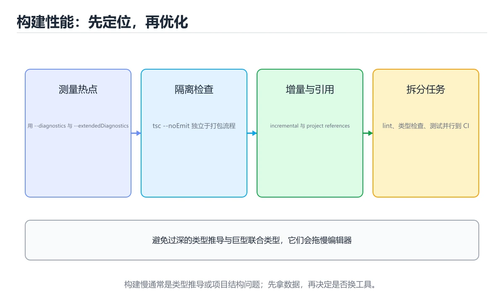
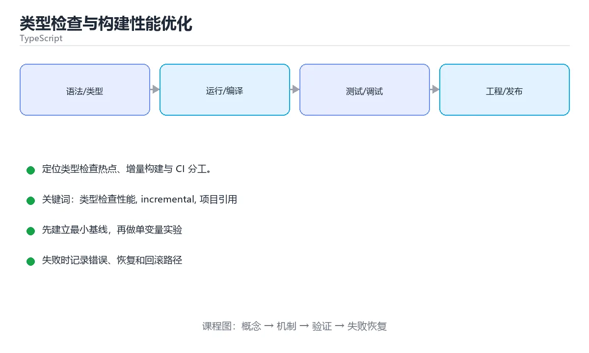

# 类型检查与构建性能优化

> 内容更新时间：2026-10-03





## 学习目标

- 能用自己的话解释类型检查与构建性能优化解决了什么问题，而不是只背术语。
- 能说清 「类型检查性能」、「incremental」、「项目引用」、「skipLibCheck」 之间的关系，并分别举出一个例子。
- 能把本课知识放回「TypeScript」的知识体系，说明它和相邻主题的边界。
- 能完成本课练习，并用验收标准检查自己的结果。

> 一句话摘要：定位类型检查热点、增量构建与 CI 分工。

## 前置知识

- 先完成上一课《TypeScript 测试策略》；如果已经掌握，可以直接用本课练习自测。
- 开始前先复习：类型检查性能、incremental、项目引用。
- 如果某一步看不懂，先记录具体卡点，完成练习后再回头读一遍。

## 慢在哪里：先定位再优化

| 手段 | 命令 | 看什么 |
| --- | --- | --- |
| 生成耗时报告 | `tsc --noEmit --extendedDiagnostics` | 总时间、文件数、类型数 |
| 定位最慢文件 | `tsc --noEmit --generateTrace trace` | trace 里的耗时热点 |
| 检查项目引用 | `tsc --build --verbose` | 是否真的增量 |
| 打包分析 | `vite build --mode analyze` 或 source-map-explorer | 产物体积构成 |
| 依赖体积 | `npx vite-bundle-visualizer` | 哪个依赖最大 |

经验：**大部分类型检查慢，来自过深的类型推导、过大的单一项目与无节制的第三方类型参与检查。**

## 提速手段速查

| 手段 | 效果 | 代价 |
| --- | --- | --- |
| `skipLibCheck: true` | 跳过依赖声明文件检查 | 依赖类型错误不会被发现 |
| 项目引用 + `composite` | 只重检查改动项目 | 配置复杂 |
| `incremental` + `tsBuildInfoFile` | 复用上次结果 | 需要缓存产物 |
| 收窄 `include` | 减少参与文件 | 需确保不漏文件 |
| 避免巨型联合与深层泛型 | 减少推导爆炸 | 需要重构类型 |
| 拆包与懒加载 | 减小主包体积 | 增加分包复杂度 |
| 用 SWC / esbuild 转译 | 转译极快 | 不做类型检查，需单独跑 tsc |

```jsonc
// 推荐的 tsconfig 组合：类型检查快、职责清晰
{
  "compilerOptions": {
    "incremental": true,
    "tsBuildInfoFile": "./node_modules/.cache/tsbuildinfo",
    "skipLibCheck": true,
    "strict": true,
    "noEmit": true,
    "isolatedModules": true,
    "moduleDetection": "force"
  },
  "include": ["src", "tests", "types"],
  "exclude": ["dist", "node_modules", "coverage"]
}
```

```json
{
  "scripts": {
    "typecheck": "tsc --noEmit",
    "typecheck:trace": "tsc --noEmit --generateTrace .trace",
    "build": "vite build",
    "size": "source-map-explorer dist/assets/*.js"
  }
}
```

## CI 中的分工

| 阶段 | 工具 | 目的 |
| --- | --- | --- |
| 转译 / 打包 | esbuild、SWC、Vite | 快速产出产物 |
| 类型检查 | `tsc --noEmit` | 独立门禁，不可省略 |
| 体积门禁 | 打包分析 | 主包超过阈值则失败 |
| 缓存 | 依赖与 tsbuildinfo | 加速重复构建 |

注意：**打包器不做类型检查**，CI 必须单独跑一次 `tsc --noEmit`。

## 类型层面的性能陷阱

| 陷阱 | 后果 | 处理 |
| --- | --- | --- |
| 巨量联合类型（上千成员） | 每处判断都要遍历 | 拆分或用映射表 |
| 递归类型无深度限制 | 推导爆炸 | 限制递归层数 |
| 交叉类型层层叠加 | 属性合并极慢 | 明确定义接口 |
| 在类型里做复杂字符串运算 | 编译器负担重 | 运行时处理更合适 |
| 全量 `include` 包含测试与脚本 | 检查范围膨胀 | 分离 tsconfig |

## 常见错误对照表

| 容易踩的做法 | 实际现象 | 原因与正确做法 |
| --- | --- | --- |
| 用 `skipLibCheck` 掩盖自身错误 | 自己的类型错误仍在 | 它只跳过 .d.ts，按需使用 |
| 只跑打包不跑类型检查 | 类型错误进线上 | CI 加 `tsc --noEmit` |
| 打开 incremental 但不缓存产物 | 每次都全量 | CI 持久化 tsbuildinfo |
| 单项目包含所有代码 | 改一行全量检查 | 用项目引用拆分 |
| 盲目内联所有依赖 | 主包巨大 | 按路由拆包、懒加载 |
| 只看构建总时长 | 不知优化方向 | 用 extendedDiagnostics 定位 |

## 自测清单

- [ ] 会用 `--extendedDiagnostics` 与 `--generateTrace` 定位慢点。
- [ ] 开启 incremental 并在 CI 中缓存构建信息。
- [ ] 用项目引用拆分大仓库，只重检查改动部分。
- [ ] CI 独立跑 `tsc --noEmit` 作为类型门禁。
- [ ] 有产物体积门禁，避免依赖膨胀。

## 零基础详解：让 TypeScript 构建变快

### 一句话说清它是什么

大项目变慢通常来自三处：**类型检查太慢、重复构建、缓存没命中**。
解决思路是：拆分项目、增量构建、并行与缓存，以及别让类型检查挡住开发。

### 用生活比喻理解

| 手段 | 比喻 | 说明 |
| --- | --- | --- |
| 项目引用 | 分车间生产 | 每个子项目独立编译 |
| 增量构建 | 只修坏掉的零件 | 用 `.tsbuildinfo` 记录状态 |
| 转译器 | 快速流水线 | esbuild 与 swc 只转译不检查 |
| 缓存 | 复用上次成果 | 输入没变就不重跑 |
| 并行 | 多线开工 | 多个包同时构建 |

### 第一步：先测量，别猜

```bash
# 类型检查耗时
time npx tsc --noEmit --extendedDiagnostics

# 看哪些文件最耗时
npx tsc --noEmit --generateTrace trace
npx @typescript/analyze-trace trace
```

`--extendedDiagnostics` 会输出「检查了多少文件、用了多少内存、最慢的环节」，先看这些数字。

### 第二步：项目引用与增量

```json
// 根 tsconfig.json
{
  "files": [],
  "references": [
    { "path": "./packages/types" },
    { "path": "./packages/ui" },
    { "path": "./apps/web" }
  ]
}
```

```json
// packages/ui/tsconfig.json
{
  "extends": "../config/tsconfig.base.json",
  "compilerOptions": {
    "composite": true,
    "incremental": true,
    "tsBuildInfoFile": "./dist/.tsbuildinfo",
    "declaration": true,
    "outDir": "./dist",
    "rootDir": "./src"
  },
  "include": ["src"]
}
```

```bash
npx tsc --build          # 只重新编译有变化的部分
npx tsc --build --clean  # 清理
```

### 第三步：开发用转译，提交前再检查

| 场景 | 工具 | 说明 |
| --- | --- | --- |
| 本地开发热更新 | Vite、esbuild、swc | 只转译，毫秒级反馈 |
| 提交前与 CI | `tsc --noEmit` | 完整类型检查 |
| 库产物 | tsup、rollup | 产出 ESM/CJS 与 d.ts |

**不要指望打包器做类型检查**，两边分工才能又快又稳。

### 第四步：配置层面的提速开关

```json
{
  "compilerOptions": {
    "incremental": true,
    "skipLibCheck": true,
    "isolatedModules": true,
    "moduleDetection": "force",
    "noEmit": true
  },
  "exclude": ["node_modules", "dist", "**/*.test.ts"]
}
```

| 选项 | 作用 | 注意 |
| --- | --- | --- |
| `incremental` | 复用上次结果 | 保留 `.tsbuildinfo` |
| `skipLibCheck` | 跳过第三方声明检查 | 只跳第三方，不跳自己的代码 |
| `exclude` 测试文件 | 减少检查量 | CI 里再单独检查测试 |
| `isolatedModules` | 每个文件独立转译 | 兼容 esbuild 与 swc |
| `composite` | 支持项目引用 | 必须配 `declaration` |

### 第五步：CI 里的并行与缓存

```yaml
jobs:
  typecheck:
    steps:
      - uses: actions/checkout@v4
      - uses: actions/setup-node@v4
        with: { node-version: 22, cache: npm }
      - run: npm ci
      - uses: actions/cache@v4
        with:
          path: "**/*.tsbuildinfo"
          key: tsbuild-${{ github.sha }}
          restore-keys: tsbuild-
      - run: npx tsc --build
```

在 monorepo 里再配合 `turbo run typecheck --filter='...[origin/main]'`，只检查受影响的包。

### 什么时候该重构而不是调参数

| 症状 | 建议 |
| --- | --- |
| 单个文件几千行 | 拆分模块 |
| 类型体操层层嵌套 | 简化或加缓存类型 |
| 一个包要检查上万文件 | 按职责拆成多个子项目 |
| 循环依赖多 | 抽出公共包 |
| 每个文件都 import 整个 barrel | 直接从具体文件导入 |

**barrel 文件（`index.ts` 汇总导出）很方便，但会让类型检查范围大幅膨胀**，大项目里要谨慎。

### 新手最容易踩的八个坑

| 坑 | 现象 | 正确做法 |
| --- | --- | --- |
| 没有基线数据 | 不知道优化有没有效果 | 先用 `--extendedDiagnostics` |
| 删掉 `.tsbuildinfo` | 每次都全量 | 加入缓存并保留 |
| 把 `skipLibCheck` 当万能 | 自己代码的问题被掩盖 | 它只跳第三方声明 |
| 用 barrel 全量导出 | 检查范围爆炸 | 直接从具体模块导入 |
| 开发时跑完整类型检查 | 热更新变慢 | 开发用转译，提交前检查 |
| CI 每次都全量构建 | 时间随代码线性增长 | 增量加受影响分析 |
| 单进程串行跑所有包 | 浪费机器 | 并行 job 或任务编排 |
| 只看总耗时 | 找不到瓶颈 | 看 trace 定位 |

### 学完自测

- [ ] 能说出项目引用解决的什么问题。
- [ ] 知道 `incremental` 依赖哪个文件。
- [ ] 能说出 `skipLibCheck` 的边界。
- [ ] 知道为什么 barrel 文件会拖慢类型检查。
- [ ] 能说出 CI 里加速的三条手段。

## 动手练习

> 本课练习重点：围绕「类型检查性能、incremental、项目引用」完成复述、实验和交付，每个结果都要能被别人检查。

先让类型检查通过，再制造一次类型错误，最后补运行时校验与测试。

### 练习 1：建立心智模型（10 分钟）

合上教程，用 3～5 句话回答：

1. 类型检查与构建性能优化解决了什么问题？
2. 如果没有它，会出现什么具体后果？
3. 它和「incremental」是什么关系？

**验收标准**：至少出现一个本课关键词，并写出一个反例、边界条件或失效场景。

### 练习 2：做一次可控实验（20 分钟）

从正文中选一个最小示例，完成以下操作：

1. 先预测修改一个参数、输入或步骤后的结果。
2. 再实际执行或逐步推演，记录真实结果。
3. 如果结果与预测不同，写出差异原因。

**验收标准**：留下「原例 → 改动 → 预测 → 结果 → 原因」五步记录。

### 练习 3：交付一个小结果（30 分钟）

写一个最小类型示例，先让 `tsc --noEmit` 通过，再故意制造一次类型错误。

任务要求：

- 结果必须能被别人检查，不能只写“我已经理解了”。
- 至少覆盖「类型检查性能」和「incremental」两个关键词。
- 写出 1 个仍然不确定的问题，以及下一步如何验证。

> 提示：时间有限时优先做练习 1 和练习 2；练习 3 可以拆成两次完成。

## 本课小结

- 核心问题：类型检查与构建性能优化不是孤立术语，而是在「TypeScript」中解决一类具体问题。
- 关键关系：先分清「类型检查性能」与「incremental」的职责，再理解「项目引用」的适用边界。
- 判断标准：能解释正常场景、边界条件和失败场景，才算真正掌握。
- 下一步：完成练习后，用自己的话写下 3 条要点，再去做本课测验。

## 可运行练习

### 任务 1：先跑通，再解释

```bash
# 类型检查耗时
time npx tsc --noEmit --extendedDiagnostics

# 看哪些文件最耗时
npx tsc --noEmit --generateTrace trace
npx @typescript/analyze-trace trace
```

### 任务 2：只改一个条件

### 任务 3：迁移到自己的数据

用同一套思路处理一组你自己的数据或场景，保持输出格式与任务 1 一致。

## 故障现场

### 现场 1：本课的 类型检查性能 常规用例通过，但边界用例失败

**症状**：在本课的练习或生产场景里出现“本课的 类型检查性能 常规用例通过，但边界用例失败”。

**复现**：准备一组最小输入，只保留触发“本课的 类型检查性能 常规用例通过，但边界用例失败”的必要条件，连续运行两次确认结果稳定。

**定位**：围绕“类型检查性能 的前置条件与取值边界没有写进代码，默认值掩盖了空值和极值”检查调用链、输入数据和环境配置，先验证假设再改代码。

**预防**：把“本课的 类型检查性能 常规用例通过，但边界用例失败”写成一条自动化用例，并在本课的验收清单里保留对应检查项。

### 现场 2：本课的 incremental 结果在两次运行之间不一致

**症状**：在本课的练习或生产场景里出现“本课的 incremental 结果在两次运行之间不一致”。

**复现**：准备一组最小输入，只保留触发“本课的 incremental 结果在两次运行之间不一致”的必要条件，连续运行两次确认结果稳定。

**定位**：围绕“incremental 依赖了当前版本、执行顺序或共享状态，单次运行无法暴露差异”检查调用链、输入数据和环境配置，先验证假设再改代码。

**预防**：把“本课的 incremental 结果在两次运行之间不一致”写成一条自动化用例，并在本课的验收清单里保留对应检查项。

### 现场 3：本课的验证只在开发机通过

**症状**：在本课的练习或生产场景里出现“本课的验证只在开发机通过”。

**定位**：围绕“环境版本、配置和输入规模与目标环境不同，类型检查性能 缺少可重复的验证记录”检查调用链、输入数据和环境配置，先验证假设再改代码。

## 版本与时效

- TypeScript 5.x 主线持续收紧类型推导、装饰器与模块解析行为
- 升级前先跑 tsc --noEmit，再处理构建工具与 ESLint 规则差异

### 升级检查清单

- 先固定当前版本，跑通全部示例与测验，再升级工具链。
- 只改一个版本变量，记录编译、测试、性能与产物体积的变化。
- 重点回归默认值、弃用警告、序列化格式、并发语义和错误信息。
- 升级完成后更新本课的“最后复核 / 下次复核”日期与版本说明。

## 本课复习清单

离开本课前，逐项确认：

- [ ] 不看解析，能说出「定位「哪些文件最耗类型检查时间」，应该用？」的判断依据。
- [ ] 不看解析，能说出「skipLibCheck 的实际作用是？」的判断依据。
- [ ] 不看解析，能说出「大仓库中让类型检查只覆盖改动部分，常用？」的判断依据。
- [ ] 不看解析，能说出「CI 中打包器与类型检查的分工是？」的判断依据。
- [ ] 不看解析，能说出「哪种类型写法最容易拖慢编译？」的判断依据。
- [ ] 至少运行一次本课示例，记录输入、输出和一个边界情况。
- [ ] 把本课最容易混淆的两个概念写成一句话对照。

| 复盘项 | 记录 |
| --- | --- |
| 已经能独立解释的考点 |  |
| 仍然说不清的概念 |  |
| 下一步验证动作 |  |

## 术语速查

| 术语 | 本课语境 |
| --- | --- |
| `tsc --noEmit --extendedDiagnostics` | \| 生成耗时报告 \| `tsc --noEmit --extendedDiagnostics` \| 总时间、文件数、类型数 \| |
| `tsc --noEmit --generateTrace trace` | \| 定位最慢文件 \| `tsc --noEmit --generateTrace trace` \| trace 里的耗时热点 \| |
| `tsc --build --verbose` | \| 检查项目引用 \| `tsc --build --verbose` \| 是否真的增量 \| |
| `vite build --mode analyze` | \| 打包分析 \| `vite build --mode analyze` 或 source-map-explorer \| 产物体积构成 \| |
| `npx vite-bundle-visualizer` | \| 依赖体积 \| `npx vite-bundle-visualizer` \| 哪个依赖最大 \| |
| `skipLibCheck: true` | \| `skipLibCheck: true` \| 跳过依赖声明文件检查 \| 依赖类型错误不会被发现 \| |
| `composite` | \| 项目引用 + `composite` \| 只重检查改动项目 \| 配置复杂 \| |
| `incremental` | \| `incremental` + `tsBuildInfoFile` \| 复用上次结果 \| 需要缓存产物 \| |
| `tsBuildInfoFile` | \| `incremental` + `tsBuildInfoFile` \| 复用上次结果 \| 需要缓存产物 \| |
| `include` | \| 收窄 `include` \| 减少参与文件 \| 需确保不漏文件 \| |
| `tsc --noEmit` | \| 类型检查 \| `tsc --noEmit` \| 独立门禁，不可省略 \| |
| `skipLibCheck` | \| 用 `skipLibCheck` 掩盖自身错误 \| 自己的类型错误仍在 \| 它只跳过 .d.ts，按需使用 \| |

## 考点精讲

### 考点 1：围绕“类型检查与构建性能优化”中的 类型检查性能、incremental、项目引用，下列哪两项是本课强调的实践判断？

- **判断依据**：本课把类型检查与构建性能优化拆成概念、示例与故障现场三部分，因此判断 类型检查性能 时必须同时交代输入、输出和失败路径，这使“学习 类型检查性能 时要同时说明输入、输出和失败路径，不能只看正常流程”成立。在类型检查与构建性能优化里，判断 incremental 时要固定版本与边界输入，所以“验证 incremental 时要固定版本并覆盖边界输入，结论才可复现”才可复现。

### 考点 2：这段代码代码是「类型检查与构建性能优化」的示例片段，下面哪一项描述与它一致？

- **判断依据**：在「类型检查与构建性能优化」里，这段代码只做静态声明，没有循环、分支或可观察输出。这段代码出自「类型检查与构建性能优化」的正文示例，围绕类型检查性能、incremental、项目引用展开；把输入或边界换成空值、极值或失败情况后，结论要以「类型检查与构建性能优化」的实际运行结果为准。

### 考点 3：大仓库中让类型检查只覆盖改动部分，常用？

- **判断依据**：在「类型检查与构建性能优化」里，项目引用（composite）加增量构建。项目引用把仓库拆成多个可独立编译的单元，配合 composite 与 tsbuildinfo 只重建受影响部分。「类型检查与构建性能优化」要求先交代类型检查性能、incremental、项目引用的前提再下结论，所以“项目引用（composite）加增量构建”只在题干“大仓库中让类型检查只覆盖改动部分”给定的条件下成立。

### 考点 4：CI 中打包器与类型检查的分工是？

- **判断依据**：结论应落在「打包器只转译」。esbuild、SWC、Vite 等只剥离类型不做检查，因此 CI 必须单独跑类型门禁。在「类型检查与构建性能优化」里，这道题要求区分概念与边界，「打包器只转译」只有在题干给出的前提下才成立，而「类型检查会替代打包」、「两者都不需要」缺少同一组条件。“中打包器与类型检查的分工是”与「类型检查与构建性能优化」的术语表相呼应，只有符合类型检查性能、incremental、项目引用约束的“打包器只转译”才是正文支持的结论。

### 考点 5：哪种类型写法最容易拖慢编译？

- **判断依据**：在「类型检查与构建性能优化」里，上千成员的巨型联合类型与无深度限制的递归类型。巨量联合与深递归会让类型推导呈指数级膨胀，应拆分并限制递归深度。“哪种类型写法最容易拖慢编译”与「类型检查与构建性能优化」的术语表相呼应，只有符合类型检查性能、incremental、项目引用约束的“上千成员的巨型联合类型与无深度限制的递归”才是正文支持的结论。

### 考点 6：补全代码：「类型检查与构建性能优化」示例中，下面这行代码缺少哪个关键字或函数名？请填入 ____。

`time npx tsc --noEmit --____`

- **判断依据**：空格应填写「extendedDiagnostics」、「extendeddiagnostics」。在「类型检查与构建性能优化」里判断这道题，要把类型检查性能、incremental、项目引用的条件、过程与失败路径逐项对齐，换成“补全代码”这个场景，只有满足前提的结论才成立。“类型检查与构建性能优化示例中”与「类型检查与构建性能优化」的术语表相呼应，只有符合类型检查性能、incremental、项目引用约束的“extendedDiagnostics”才是正文支持的结论。

## English Overview

**Title:** Build & Typecheck Performance

**Summary:** Diagnosing typecheck hotspots, incremental builds and CI split.

**Category:** TypeScript
**Level:** 高级
**Key terms:** 类型检查性能, incremental, 项目引用, skipLibCheck, 体积门禁

## 内容元数据

- 内容版本：v2.0
- 最后更新：2026-10-03
- 学习阶段：高级
- 适用环境：TypeScript 5.x / Node.js 22+
- 内容来源：内置结构化课程与工程实践整理
- 相关主题：类型检查性能、incremental、项目引用、skipLibCheck、体积门禁
- 质量版本：P0 测验标准 + P1 覆盖扩展 + P2 体验补全

## 参考资料与复核

- 最后复核：2026-10-04
- 下次复核：2027-04-04
- 复核范围：版本兼容、API 行为、安全建议与工程实践
- 来源性质：官方文档、标准或权威教材；正文为离线教学重组

| 参考资料 | 本课用途 |
| --- | --- |
| [项目引用](https://www.typescriptlang.org/docs/handbook/project-references.html) | 大型项目拆分与增量构建 |
| [Everyday Types](https://www.typescriptlang.org/docs/handbook/2/everyday-types.html) | 常用类型与收窄 |
| [泛型文档](https://www.typescriptlang.org/docs/handbook/2/generics.html) | 泛型约束与复用 |

> 「类型检查与构建性能优化」的链接用于离线阅读后的延伸核对；App 不会自动联网。
