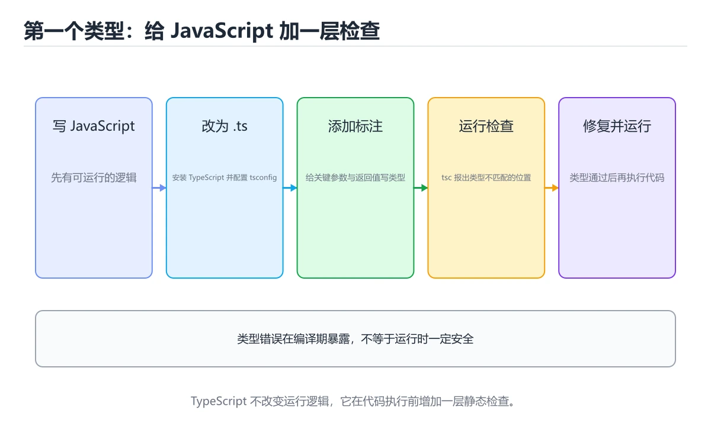
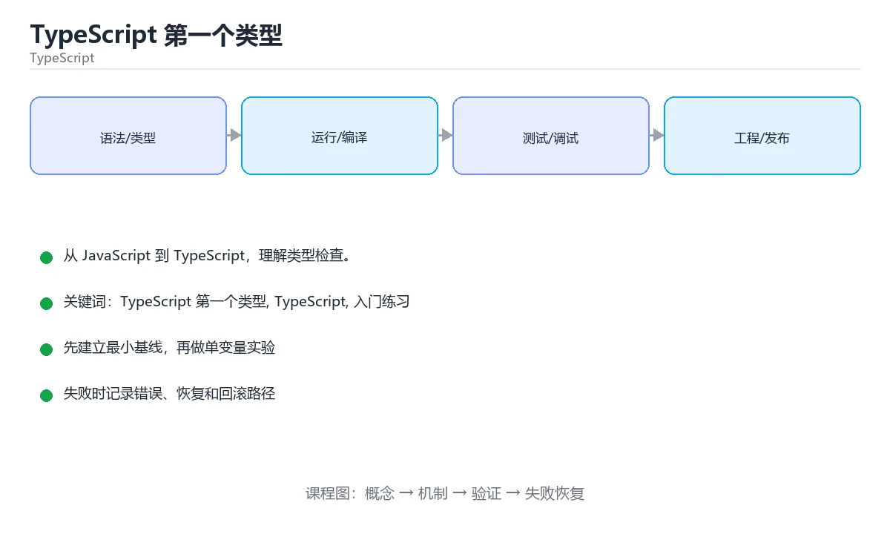

# TypeScript 第一个类型

> 内容更新时间：2026-10-03





## 学习目标

- 先认识TypeScript 第一个类型需要的工具、输入和输出。
- 按步骤运行最小示例，并记录结果与错误。
- 用一个边界输入验证自己是否真正掌握。

## 前置知识

- 会进行基本的文件或命令行操作。
- 不需要预先掌握「TypeScript」的高级知识。

## 一句话入门

从 JavaScript 到 TypeScript，理解类型检查。

## 最小示例

```typescript
const name: string = "Ada";
const year: number = 1815;
console.log(`${name} born in ${year}`);
```

## 预期输出

```text
Ada born in 1815
```

## 常见错误

- 把任意字符串赋给联合类型，类型检查失败。
- 复制命令时遗漏空格、引号或必要参数。

## 动手练习

1. 原样运行最小示例，保存命令和输出。
2. 把数字 2 改成 10，预测并验证新结果。
3. 制造一个错误输入，写出错误信息和修复方法。

## 本课小结

- 入门阶段先保证能运行、能观察、能解释，再追求复杂功能。
- 每次只改一个变量，记录预测与实际结果。
- 遇到错误先看第一条错误信息，再回到最小示例。

## 代码实验：把示例跑成证据

### 实验一：建立基线

```typescript
const name: string = "Ada";
const year: number = 1815;
console.log(`${name} born in ${year}`);
```

### 实验二：只改一个输入

### 实验三：制造一个可控错误

把一个预期为数字的值改成字符串，或者访问不存在的属性。记录结果是 undefined、NaN 还是类型错误，并说明为什么。

| 实验 | 改动 | 预测 | 实际 | 结论 |
| --- | --- | --- | --- | --- |
| 基线 | 保持原样 |  |  |  |
| 边界 |  |  |  |  |
| 失败 |  |  |  |  |

### 实验四：用三句话复述

1. 输入是什么，哪些输入属于合法范围，哪些属于边界或非法范围？
2. 程序按什么顺序处理输入，在哪一步产生了状态变化或副作用？
3. 输出如何验证，失败时第一条可观察证据是什么？

## TypeScript 基础机制速览

### 编译期类型与运行时 JavaScript

TypeScript 在 JavaScript 之上增加静态类型检查，编译后类型信息会被擦除，运行时仍然是 JavaScript。因此类型标注不能替代输入校验，外部数据仍要在边界处验证。`tsc` 负责类型检查和输出，现代项目通常由构建工具调用它。开启 `strict` 能提前发现 null、隐式 any 和函数参数问题，是学习类型系统的重要反馈来源。

### 类型推断、注解与窄化

TypeScript 能从初始值推断类型，局部变量通常不需要重复写注解；公共 API、复杂对象和空值边界适合显式标注。联合类型表示“可能是几种类型之一”，通过 `typeof`、`in`、`instanceof`、判别字段和自定义类型守卫进行窄化。窄化只在当前控制流内有效，异步回调或闭包中类型可能重新变宽，需要重新检查或保存稳定值。

### 接口、类型别名与结构化类型

接口和类型别名都能描述对象形状，接口适合可扩展的公共契约，类型别名适合联合、交叉和函数类型。TypeScript 使用结构化类型：只要对象具有所需成员，就认为它满足类型，不要求显式继承。索引签名、可选属性和只读属性会影响赋值与读取。`unknown` 比 `any` 安全，使用前必须窄化；`never` 表示不可能的值，常用于穷尽检查。

### 泛型、工具类型与模块

泛型让函数和类型在保持类型关系的同时复用逻辑，约束 `extends` 限制可接受的类型。工具类型 `Partial`、`Pick`、`Omit`、`Record` 能从已有类型派生新类型，但过度嵌套会降低可读性。模块使用 `import`/`export`，类型导入使用 `import type` 可以避免生成无用运行时代码。声明文件描述第三方库的类型，缺少类型时应优先找官方类型包，而不是到处使用 any。

### 严格模式与工程实践

`strictNullChecks` 把 null 和 undefined 纳入类型系统，`noImplicitAny` 禁止隐式 any，`noUncheckedIndexedAccess` 让索引访问结果可能为 undefined。类型断言 `as` 只告诉编译器“相信我”，不会改变运行时行为；能用窄化就不用断言。类型测试、运行时校验和端到端测试要配合使用，类型正确不代表业务数据正确。

## 可运行练习

### 任务 1：先跑通，再解释

```typescript
const name: string = "Ada";
const year: number = 1815;
console.log(`${name} born in ${year}`);
```

**预期输出**：${name} born in ${year}

### 任务 2：只改一个条件

### 任务 3：迁移到自己的数据

用同一套思路处理一组你自己的数据或场景，保持输出格式与任务 1 一致。

## 故障现场

### 现场 1：本课的 TypeScript 第一个类型 常规用例通过，但边界用例失败

### 现场 2：本课的 TypeScript 结果在两次运行之间不一致

**症状**：在本课的练习或生产场景里出现“本课的 TypeScript 结果在两次运行之间不一致”。

**复现**：准备一组最小输入，只保留触发“本课的 TypeScript 结果在两次运行之间不一致”的必要条件，连续运行两次确认结果稳定。

**定位**：围绕“TypeScript 依赖了当前版本、执行顺序或共享状态，单次运行无法暴露差异”检查调用链、输入数据和环境配置，先验证假设再改代码。

**预防**：把“本课的 TypeScript 结果在两次运行之间不一致”写成一条自动化用例，并在本课的验收清单里保留对应检查项。

### 现场 3：本课的验证只在开发机通过

**症状**：在本课的练习或生产场景里出现“本课的验证只在开发机通过”。

## 版本与时效

- TypeScript 5.x 主线持续收紧类型推导、装饰器与模块解析行为
- 升级前先跑 tsc --noEmit，再处理构建工具与 ESLint 规则差异

### 升级检查清单

- 先固定当前版本，跑通全部示例与测验，再升级工具链。
- 只改一个版本变量，记录编译、测试、性能与产物体积的变化。
- 重点回归默认值、弃用警告、序列化格式、并发语义和错误信息。
- 升级完成后更新本课的“最后复核 / 下次复核”日期与版本说明。

## 本课复习清单

离开本课前，逐项确认：

- [ ] 不看解析，能说出的判断依据。
- [ ] 不看解析，能说出「TypeScript 代码最终如何被浏览器或 Node.js 执行？」的判断依据。
- [ ] 不看解析，能说出「把变量声明为 any 类型会带来什么影响？」的判断依据。
- [ ] 不看解析，能说出「TypeScript 与 JavaScript 相比，类型系统的主要价值是？」的判断依据。
- [ ] 不看解析，能说出「填空：TypeScript 第一个类型术语速查中，表示的判断依据。
- [ ] 至少运行一次本课示例，记录输入、输出和一个边界情况。
- [ ] 把本课最容易混淆的两个概念写成一句话对照。

| 复盘项 | 记录 |
| --- | --- |
| 已经能独立解释的考点 |  |
| 仍然说不清的概念 |  |
| 下一步验证动作 |  |

## 逐节复习与自检

下面按正文顺序回顾每一节，并给出一个自检问题；说不清的地方回到原章节补课。

### 一句话入门

自检：这一节的关键输入与输出分别是什么？

### 最小示例

```typescript
const name: string = "Ada";
const year: number = 1815;
console.log(`${name} born in ${year}`);
```

自检：这一节与相邻主题的边界在哪里？

### 预期输出

```text
Ada born in 1815
```

### 动手练习

自检：如果去掉这一节里的一个前提，结论会怎样变化？

## 术语速查

把「TypeScript 第一个类型」里反复出现的术语集中放在一起。复习时先遮住右列，尝试用自己的话解释，再回到正文核对。

| 术语 | 本课语境 |
| --- | --- |
| `[TypeScript 第一个类型, TypeScript, 入门练习][index]` | 在「TypeScript 第一个类型」里理解它的定义、输入和输出。 |
| `[TypeScript 第一个类型, TypeScript, 入门练习][index]` | 本课用它说明边界条件与失败路径。 |
| `[TypeScript 第一个类型, TypeScript, 入门练习][index]` | 结合「TypeScript 第一个类型」的正文示例确认它的适用条件。 |

## 考点精讲

### 考点 1：TypeScript 中 const name: string = "Ada"; 的 : string 部分表示什么？

- **判断依据**：在「TypeScript 第一个类型」里，类型标注，限制该变量只能保存字符串。冒号后写类型是 TypeScript 的类型标注，编译器据此检查赋值与使用是否合法，编译后的 JavaScript 中标注会被擦除，运行时不会再执行类型检查。这道题的关键在「TypeScript 第一个类型」的TypeScript 第一个类型、TypeScript、入门练习：先确认题干“TypeScript 中 const”问的是哪一步，再排除偷换前提的选项。

### 考点 2：TypeScript 代码最终如何被浏览器或 Node.js 执行？

- **判断依据**：在「TypeScript 第一个类型」里，先用 tsc 等工具编译成 JavaScript，再交给运行时执行。主流做法是用 tsc、esbuild、swc 等工具把 TypeScript 转换成 JavaScript，类型检查发生在编译阶段，产物中不再包含类型信息。在「TypeScript 第一个类型」里判断这道题，要把TypeScript 第一个类型、TypeScript、入门练习的条件、过程与失败路径逐项对齐，换成“TypeScript 代码最终如何被”这个场景，只有满足前提的结论才成立。

### 考点 3：把变量声明为 any 类型会带来什么影响？

- **判断依据**：在「TypeScript 第一个类型」里，跳过该值的类型检查，可能把错误推迟到运行时。any 表示放弃类型检查，编译器不会验证它的属性与方法是否存在，错误因此可能延迟到运行时才暴露。「TypeScript 第一个类型」要求先交代TypeScript 第一个类型、TypeScript、入门练习的前提再下结论，所以“跳过该值的类型检查”只在题干“把变量声明为 any 类型会带来什么影响”给定的条件下成立。

### 考点 4：围绕“TypeScript 第一个类型”中的 TypeScript 第一个类型、TypeScript、入门练习，下列哪两项是本课强调的实践判断？

- **判断依据**：在「TypeScript 第一个类型」里，学习 TypeScript 第一个类型 时要同时说明输入、输出和失败路径，不能只看正常流程；在「TypeScript 第一个类型」里，验证 TypeScript 时要固定版本并覆盖边界输入，结论才可复现。结论应落在学习 TypeScript 第一个类型 时要同时说明输入、输出和失败路径。

### 考点 5：填空：「TypeScript 第一个类型」术语速查中，表示「console.log(`____`);」的术语是什么？

- **判断依据**：空格应填写「${name} born in ${year}」。的术语是什么，判断时要把题干限定的输入、边界与目标逐项对齐。把“${name} born in ${ye”代回「TypeScript 第一个类型」里“TypeScript 第一个类型术语速查中”的例子核对，条件一旦改变，结论就要用TypeScript 第一个类型、TypeScript、入门练习重新推导。

### 考点 6：阅读「TypeScript 第一个类型」的代码片段，下面哪项判断是正确的？

- **判断依据**：在「TypeScript 第一个类型」里，类型标注，限制该变量只能保存字符串。回到「TypeScript 第一个类型」的正文示例，用“阅读TypeScript 第一个类型”走一遍TypeScript 第一个类型、TypeScript、入门练习的完整流程，能复现的结论才可以保留。回到「TypeScript 第一个类型」的正文示例，用“阅读TypeScript”走一遍TypeScript 第一个类型、TypeScript、入门练习的完整流程，能复现的结论才可以保留。

## English Overview

**Title:** First TypeScript Types

**Summary:** Move from JavaScript to type checking.

**Category:** TypeScript
**Level:** 入门
**Key terms:** TypeScript 第一个类型, TypeScript, 入门练习

## 内容元数据

- 内容版本：v2.0
- 最后更新：2026-10-03
- 学习阶段：入门
- 适用环境：TypeScript 5.x / Node.js 22+
- 内容来源：内置结构化课程与工程实践整理
- 相关主题：TypeScript 第一个类型、TypeScript、入门练习
- 质量版本：P0 测验标准 + P1 覆盖扩展 + P2 体验补全

## 参考资料与复核

- 最后复核：2026-10-04
- 下次复核：2027-04-04
- 复核范围：版本兼容、API 行为、安全建议与工程实践
- 来源性质：官方文档、标准或权威教材；正文为离线教学重组

| 参考资料 | 本课用途 |
| --- | --- |
| [Everyday Types](https://www.typescriptlang.org/docs/handbook/2/everyday-types.html) | 常用类型与收窄 |
| [声明文件](https://www.typescriptlang.org/docs/handbook/declaration-files/introduction.html) | 类型声明与发布 |
| [装饰器文档](https://www.typescriptlang.org/docs/handbook/decorators.html) | 装饰器与元数据 |

> 「TypeScript 第一个类型」的链接用于离线阅读后的延伸核对；App 不会自动联网。

## 复习与迁移

复习目标：把「TypeScript 第一个类型」的判断标准放回可复现的例子里。先自己作答，再对照依据；如果结论正确但理由不完整，回到正文补足前提。

### 概念复述

- 用一句话说明「TypeScript 第一个类型」解决什么问题：从 JavaScript 到 TypeScript，理解类型检查。
- 写出TypeScript 第一个类型、TypeScript、入门练习之间的关系，并各举一个例子。
- 说出本课最容易混淆的两个概念，以及区分它们的判据。

### 正文逐节复核

- **一句话入门**：从 JavaScript 到 TypeScript，理解类型检查。
- **TypeScript 基础机制速览**：TypeScript 在 JavaScript 之上增加静态类型检查，编译后类型信息会被擦除，运行时仍然是 JavaScript。

### 测验回顾

1. TypeScript 中 const name: string = "Ada"; 的 : string 部分表示什么？
   - 依据：在「TypeScript 第一个类型」里，类型标注，限制该变量只能保存字符串。冒号后写类型是 TypeScript 的类型标注，编译器据此检查赋值与使用是否合法，编译后的 JavaScript 中标注会被擦除，运行时不会再执行类型检查。这道题的关键在「TypeScript 第一个类型」的TypeScript 第一个类型、TypeScript、入门练习：先确认题干“TypeScript 中 const”问的是哪一步，再排除偷换前提的选项。
2. TypeScript 代码最终如何被浏览器或 Node.js 执行？
   - 依据：在「TypeScript 第一个类型」里，先用 tsc 等工具编译成 JavaScript，再交给运行时执行。主流做法是用 tsc、esbuild、swc 等工具把 TypeScript 转换成 JavaScript，类型检查发生在编译阶段，产物中不再包含类型信息。在「TypeScript 第一个类型」里判断这道题，要把TypeScript 第一个类型、TypeScript、入门练习的条件、过程与失败路径逐项对齐，换成“TypeScript 代码最终如何被”这个场景，只有满足前提的结论才成立。
3. 把变量声明为 any 类型会带来什么影响？
   - 依据：在「TypeScript 第一个类型」里，跳过该值的类型检查，可能把错误推迟到运行时。any 表示放弃类型检查，编译器不会验证它的属性与方法是否存在，错误因此可能延迟到运行时才暴露。「TypeScript 第一个类型」要求先交代TypeScript 第一个类型、TypeScript、入门练习的前提再下结论，所以“跳过该值的类型检查”只在题干“把变量声明为 any 类型会带来什么影响”给定的条件下成立。
4. 围绕“TypeScript 第一个类型”中的 TypeScript 第一个类型、TypeScript、入门练习，下列哪两项是本课强调的实践判断？
   - 依据：在「TypeScript 第一个类型」里，学习 TypeScript 第一个类型 时要同时说明输入、输出和失败路径，不能只看正常流程；在「TypeScript 第一个类型」里，验证 TypeScript 时要固定版本并覆盖边界输入，结论才可复现。结论应落在学习 TypeScript 第一个类型 时要同时说明输入、输出和失败路径。
5. 填空：「TypeScript 第一个类型」术语速查中，表示「console.log(`____`);」的术语是什么？
   - 依据：空格应填写「${name} born in ${year}」。的术语是什么，判断时要把题干限定的输入、边界与目标逐项对齐。把“${name} born in ${ye”代回「TypeScript 第一个类型」里“TypeScript 第一个类型术语速查中”的例子核对，条件一旦改变，结论就要用TypeScript 第一个类型、TypeScript、入门练习重新推导。
6. 阅读「TypeScript 第一个类型」的代码片段，下面哪项判断是正确的？
   - 依据：在「TypeScript 第一个类型」里，类型标注，限制该变量只能保存字符串。回到「TypeScript 第一个类型」的正文示例，用“阅读TypeScript 第一个类型”走一遍TypeScript 第一个类型、TypeScript、入门练习的完整流程，能复现的结论才可以保留。回到「TypeScript 第一个类型」的正文示例，用“阅读TypeScript”走一遍TypeScript 第一个类型、TypeScript、入门练习的完整流程，能复现的结论才可以保留。

### 迁移练习

- 第 1 次迁移：围绕「TypeScript 中 const name: string = "Ada"; 的 : string 部分表示什么？」先写下预测，再运行本课示例，最后记录预测与实际的差异。参考答案是「类型标注，限制该变量只能保存字符串」。
- 第 2 次迁移：围绕「TypeScript 代码最终如何被浏览器或 Node.js 执行？」先写下预测，再运行本课示例，最后记录预测与实际的差异。参考答案是「先用 tsc 等工具编译成 JavaScript，再交给运行时执行」。
- 第 3 次迁移：围绕「把变量声明为 any 类型会带来什么影响？」先写下预测，再运行本课示例，最后记录预测与实际的差异。参考答案是「跳过该值的类型检查，可能把错误推迟到运行时」。
- 第 4 次迁移：围绕「围绕“TypeScript 第一个类型”中的 TypeScript 第一个类型、TypeScript、入门练习，下列哪两项是本课强调的实践判断？」先写下预测，再运行本课示例，最后记录预测与实际的差异。参考答案是「学习 TypeScript 第一个类型 时要同时说明输入、输出和失败路径，不能只看正常流程」。
- 第 5 次迁移：围绕「填空：「TypeScript 第一个类型」术语速查中，表示「console.log(`____`);」的术语是什么？」先写下预测，再运行本课示例，最后记录预测与实际的差异。参考答案是「验证 TypeScript 时要固定版本并覆盖边界输入，结论才可复现」。
- 第 6 次迁移：围绕「阅读「TypeScript 第一个类型」的代码片段，下面哪项判断是正确的？」先写下预测，再运行本课示例，最后记录预测与实际的差异。参考答案是「${name} born in ${year}」。
- 第 7 次迁移：围绕「TypeScript 中 const name: string = "Ada"; 的 : string 部分表示什么？」把结论写成一条可复现的验证步骤，让别人照着步骤就能核对。参考答案是「类型标注，限制该变量只能保存字符串」。
- 第 8 次迁移：围绕「TypeScript 代码最终如何被浏览器或 Node.js 执行？」把结论写成一条可复现的验证步骤，让别人照着步骤就能核对。参考答案是「类型标注，限制该变量只能保存字符串」。
- 第 9 次迁移：围绕「把变量声明为 any 类型会带来什么影响？」把结论写成一条可复现的验证步骤，让别人照着步骤就能核对。参考答案是「先用 tsc 等工具编译成 JavaScript，再交给运行时执行」。
- 第 10 次迁移：围绕「围绕“TypeScript 第一个类型”中的 TypeScript 第一个类型、TypeScript、入门练习，下列哪两项是本课强调的实践判断？」把结论写成一条可复现的验证步骤，让别人照着步骤就能核对。参考答案是「跳过该值的类型检查，可能把错误推迟到运行时」。
- 第 11 次迁移：围绕「填空：「TypeScript 第一个类型」术语速查中，表示「console.log(`____`);」的术语是什么？」把结论写成一条可复现的验证步骤，让别人照着步骤就能核对。参考答案是「学习 TypeScript 第一个类型 时要同时说明输入、输出和失败路径，不能只看正常流程」。
