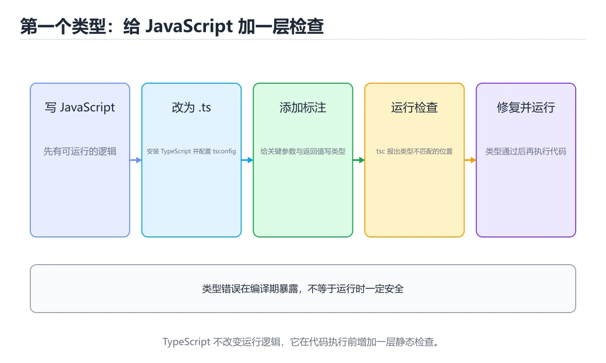
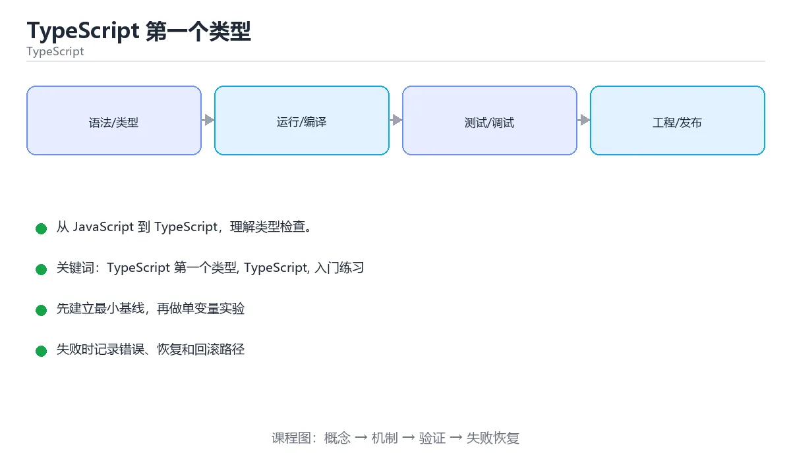

# TypeScript 第一个类型

> 内容更新时间：2026-10-06 · 学习阶段：入门 · 预计用时：30 分钟





## 本节知识框架

**课程定位**：所属分类 `typescript`（TypeScript），课程主题 `TypeScript 第一个类型`，学习阶段 入门，建议用时 55 分钟。

本课主线：从 JavaScript 到 TypeScript，理解类型检查。

**学完本课应当能够**
- 说清 `类型注解` 与 `类型推断` 的含义与区别，并各举一个正例和一个反例。
- 用本课示例验证 `基础类型` 的行为，记录输入、输出与失败条件。
- 遇到「用类型断言掩盖错误」这类问题时，能说出触发条件与修复顺序。

### 复习清单

- [ ] 能不看正文复述本课核心术语，并指出一个边界或反例。
- [ ] 能运行或推演本课示例，记录输入、输出与失败现象。
- [ ] 能完成一次自测，并把错题对照错误表定位原因。

## 核心概念定义

| 术语 | 操作性定义 | 常见边界与风险 |
| --- | --- | --- |
| 类型注解 | 在变量或参数后写 : 类型，让编译器据此检查。 | 静态检查只在编译期成立，运行期输入仍需校验。 |
| 类型推断 | 有初值时 TypeScript 能自动推断类型，不必处处手写。 | 易错：推断出的类型过窄或过宽；正确做法是关键位置显式标注类型。 |
| 基础类型 | string、number、boolean 等，与 JavaScript 的原始类型对应。 | 静态检查只在编译期成立，运行期输入仍需校验。 |
| 编译到 JavaScript | tsc 把类型擦除后产出浏览器和 Node 能直接运行的 JS。 | 静态检查只在编译期成立，运行期输入仍需校验。 |
| 编译期与运行期 | 类型只在编译期存在，运行时没有任何类型检查。 | 静态检查只在编译期成立，运行期输入仍需校验。 |
| 窄化 | 窄化只在当前控制流内有效，异步回调或闭包中类型可能重新变宽，需要重新检查或保存稳定值 | 静态检查只在编译期成立，运行期输入仍需校验。 |
| 核心结论 | TypeScript 在 JavaScript 之上加了类型标注，写代码时就能发现类型错误；标注只存在于编译阶段，编译后生成的还是普通 JavaScript。 | 静态检查只在编译期成立，运行期输入仍需校验。 |
| 最少要写的代码 | `const name: string = "小明";` | 只在「`const name: string = "小明";`」这一前提下成立，换输入或换环境要重新验证。 |
| 正确做法 | 编译：`npx tsc hello.ts`，生成同名 `.js` 文件。 | 静态检查只在编译期成立，运行期输入仍需校验。 |
| 最常见的错误 | 以为 TypeScript 代码能直接运行：浏览器不认 `.ts`，必须先编译或用 ts-node 之类的工具。 | 静态检查只在编译期成立，运行期输入仍需校验。 |
| 出错先查什么 | 先读第一条报错信息，再回到最小示例只改一个地方 | 只在「先读第一条报错信息，再回到最小示例只改一个地方」这一前提下成立，换输入或换环境要重新验证。 |
| 怎么确认学会了 | 把 age 的标注改成 string 并赋数字，观察编译报错。 | 静态检查只在编译期成立，运行期输入仍需校验。 |
| 和别的知识点的关系 | 本课打下的语法与思维方式会被后面每一课反复用到 | 只在「本课打下的语法与思维方式会被后面每一课反复用到」这一前提下成立，换输入或换环境要重新验证。 |
| 接下来做什么 | 合上教程，凭记忆把上面的最小代码重写一遍再运行 | 只在「合上教程，凭记忆把上面的最小代码重写一遍再运行」这一前提下成立，换输入或换环境要重新验证。 |

## 原理与运行机制

### 机制总览

**教材衔接：一句话入门**

从 JavaScript 到 TypeScript，理解类型检查。

**教材衔接：TypeScript 基础机制速览**

### 编译期类型与运行时 JavaScript

TypeScript 在 JavaScript 之上增加静态类型检查，编译后类型信息会被擦除，运行时仍然是 JavaScript。因此类型标注不能替代输入校验，外部数据仍要在边界处验证。`tsc` 负责类型检查和输出，现代项目通常由构建工具调用它。开启 `strict` 能提前发现 null、隐式 any 和函数参数问题，是学习类型系统的重要反馈来源。

### 类型推断、注解与窄化

TypeScript 能从初始值推断类型，局部变量通常不需要重复写注解；公共 API、复杂对象和空值边界适合显式标注。联合类型表示“可能是几种类型之一”，通过 `typeof`、`in`、`instanceof`、判别字段和自定义类型守卫进行窄化。窄化只在当前控制流内有效，异步回调或闭包中类型可能重新变宽，需要重新检查或保存稳定值。

### 接口、类型别名与结构化类型

接口和类型别名都能描述对象形状，接口适合可扩展的公共契约，类型别名适合联合、交叉和函数类型。TypeScript 使用结构化类型：只要对象具有所需成员，就认为它满足类型，不要求显式继承。索引签名、可选属性和只读属性会影响赋值与读取。`unknown` 比 `any` 安全，使用前必须窄化；`never` 表示不可能的值，常用于穷尽检查。

### 泛型、工具类型与模块

泛型让函数和类型在保持类型关系的同时复用逻辑，约束 `extends` 限制可接受的类型。工具类型 `Partial`、`Pick`、`Omit`、`Record` 能从已有类型派生新类型，但过度嵌套会降低可读性。模块使用 `import`/`export`，类型导入使用 `import type` 可以避免生成无用运行时代码。声明文件描述第三方库的类型，缺少类型时应优先找官方类型包，而不是到处使用 any。

### 严格模式与工程实践

`strictNullChecks` 把 null 和 undefined 纳入类型系统，`noImplicitAny` 禁止隐式 any，`noUncheckedIndexedAccess` 让索引访问结果可能为 undefined。类型断言 `as` 只告诉编译器“相信我”，不会改变运行时行为；能用窄化就不用断言。类型测试、运行时校验和端到端测试要配合使用，类型正确不代表业务数据正确。

**教材衔接：版本与时效**

- 版本提示：TypeScript 第一个类型 的行为在最近几个大版本里有过调整，升级「TypeScript 第一个类型」前先用 console 复现当前输出，再对照官方发布说明逐条核对。
- 升级前先用 console 建立基线：记录版本、命令和输出，升级后只比较这些可观察量。

## 典型应用场景

**教材衔接：代码实验：把示例跑成证据**

### 实验一：建立基线

```typescript
const name: string = "Ada";
const year: number = 1815;
console.log(`${name} born in ${year}`);
```

### 实验二：只改一个输入

沿用「TypeScript 第一个类型」的最小示例做一次单变量实验：

做完后用一句话写出「TypeScript 第一个类型」的结论：输入怎么变，结果才怎么变。

### 实验三：制造一个可控错误

把 console 的一个参数换成不兼容的类型，先预测报错位置再实际运行；预测与实际的差异就是本课的考点。

### 实验四：用三句话复述

1. 在「TypeScript 第一个类型」里，console 接受哪些输入，非法输入应该在哪里被挡住？
2. console 的执行顺序里，哪一步会写数据或产生外部副作用？
3. 输出如何验证，失败时第一条可观察证据是什么？

- **用类型断言掩盖错误**：典型现象是运行期直接崩溃；正确做法是先用类型守卫收窄再使用。
- **过度依赖类型推断**：典型现象是推断出的类型过窄或过宽；正确做法是关键位置显式标注类型。
- **忽略编译配置**：典型现象是严格检查没有真正开启；正确做法是明确编译选项并保持严格模式。

### 最小验证场景

- 准备：保留 `typescript` 示例的原始输入，先记录 `TypeScript 第一个类型` 的基线输出和完整运行命令。
- 观察：先核对 调用了 `log()`，再改变一个与 `类型注解` 相关的条件。
- 判定：新结果与 `TypeScript 第一个类型` 的基线不同不等于错误；只有当差异破坏了 `类型注解` 的定义或错误表中的约束，才判定为失败。

### 选择与边界

- 使用 `类型注解` 时，先满足它的定义：在变量或参数后写 : 类型，让编译器据此检查；静态检查只在编译期成立，运行期输入仍需校验。
- 使用 `类型推断` 时，先满足它的定义：有初值时 TypeScript 能自动推断类型，不必处处手写；易错：推断出的类型过窄或过宽；正确做法是关键位置显式标注类型。
- 使用 `基础类型` 时，先满足它的定义：string、number、boolean 等，与 JavaScript 的原始类型对应；静态检查只在编译期成立，运行期输入仍需校验。
- 使用 `编译到 JavaScript` 时，先满足它的定义：tsc 把类型擦除后产出浏览器和 Node 能直接运行的 JS；静态检查只在编译期成立，运行期输入仍需校验。
- 使用 `编译期与运行期` 时，先满足它的定义：类型只在编译期存在，运行时没有任何类型检查；静态检查只在编译期成立，运行期输入仍需校验。

## 代码/协议/SQL 示例

### 最小可验证示例

**教材衔接：最小示例**

**教材衔接：预期输出**

```text
Ada born in 1815
```

**运行方式**：运行 `TypeScript 第一个类型` 的示例时，保存为 `.ts` 后先编译或用 `ts-node` 运行；类型报错先解决再运行。

## 时间/空间复杂度或性能分析

**性能关注点（TypeScript 第一个类型）**：编译期类型检查与运行期代码是两套开销：分别记录构建时间与运行时耗时。

**本课特有开销（TypeScript 第一个类型 · TypeScript 第一个类型）**：小文件看元数据开销，大文件看吞吐，两者要分别测量。

**测量方法**：以 `TypeScript 第一个类型` 的 `TypeScript 第一个类型` 场景为对象，固定输入跑一遍记录基线，再把规模或并发度提高一个数量级复测；两次结果的差值与波动范围才是结论依据。

## 常见误区与易错点

| 容易写错的做法 | 实际现象 | 原因与正确做法 |
| --- | --- | --- |
| 用类型断言掩盖错误 | 运行期直接崩溃。 | 先用类型守卫收窄再使用。 |
| 过度依赖类型推断 | 推断出的类型过窄或过宽。 | 关键位置显式标注类型。 |
| 忽略编译配置 | 严格检查没有真正开启。 | 明确编译选项并保持严格模式。 |

### 现场 1：用类型断言掩盖错误

**症状**：运行期直接崩溃。

**根因与修复**：先用类型守卫收窄再使用。

**自检**：在本课示例里复现「用类型断言掩盖错误」，改成先用类型守卫收窄再使用后重跑；如果症状消失且失败路径按预期变化，说明定位正确。

### 现场 2：过度依赖类型推断

**症状**：推断出的类型过窄或过宽。

**根因与修复**：关键位置显式标注类型。

**自检**：在本课示例里复现「过度依赖类型推断」，改成关键位置显式标注类型后重跑；如果症状消失且失败路径按预期变化，说明定位正确。

### 现场 3：忽略编译配置

**症状**：严格检查没有真正开启。

**根因与修复**：明确编译选项并保持严格模式。

**自检**：在本课示例里复现「忽略编译配置」，改成明确编译选项并保持严格模式后重跑；如果症状消失且失败路径按预期变化，说明定位正确。

## 与其他知识点的关系

**教材衔接：复习与迁移**

## 自测题与参考答案

> 先独立作答，再对照参考答案；答案都能在本课正文、术语表或错误表里找到依据。

### 自测 1（概念复述）

不看正文，写出 `类型注解` 的操作性定义，并说明它与 `类型推断` 的区别。

**参考答案**：在变量或参数后写 : 类型，让编译器据此检查。

`类型推断` 的定位是：有初值时 TypeScript 能自动推断类型，不必处处手写；两者的差别要从适用对象与失败模式上说明。

### 自测 2（排错）

本课错误表记录了「用类型断言掩盖错误」这类做法。请写出它会出现的现象、根因，以及修复顺序。

**参考答案**：现象是运行期直接崩溃；正确做法是先用类型守卫收窄再使用。修复时先复现现象并保留证据，再改动一处假设重跑，确认现象消失。

### 自测 3（动手验证）

运行本课的 `typescript` 示例，把其中的 `"小明"` 换成一个边界值后重新运行，记录输出与错误信息。

**参考答案**：正常输入下 `typescript` 示例应当复现正文给出的结果；把 `"小明"` 换成边界值后，如果结果改变或报错，先核对它是否满足 `TypeScript 第一个类型` 中`类型注解` 的适用范围，再检查错误表里是否有同类现象。

### 自测 4（代码阅读）

阅读本课开头的 `typescript` 示例，说明它体现了`类型注解` 的哪一条性质，并指出改动哪个输入会让这条性质不再成立。

**参考答案**：`类型注解` 的定义是 在变量或参数后写 : 类型，让编译器据此检查，示例正是在实现这条定义。改动与 `类型注解` 有关的一个输入后，如果结果不再符合 `TypeScript 第一个类型` 的正文描述，就说明该性质只在当前前提成立。

### 自测 5（迁移）

把 `TypeScript 第一个类型` 的方法迁移到自己的项目：围绕 `类型注解` 写出一个与错误表同类的风险点，并说明触发条件和检验方式。

**参考答案**：例如「忽略编译配置」，它会导致严格检查没有真正开启；检验方式是按明确编译选项并保持严格模式改一处再复现，确认现象消失且没有引入新的失败分支。

### 自测 6（对比）

用一个表格对比 `类型注解` 与 `类型推断`：各写一行适用场景、一行失败表现。

**参考答案**：`类型注解` 的定义是在变量或参数后写 : 类型，让编译器据此检查；`类型推断` 的定义是有初值时 TypeScript 能自动推断类型，不必处处手写。两者的失败表现分别对应本课错误表里与本术语相关的行。

### 自测 7（排错顺序）

面对「用类型断言掩盖错误」引发的问题，请把“复现 运行期直接崩溃 → 保留证据 → 先用类型守卫收窄再使用 → 回归验证”四步写成可执行的检查清单。

**参考答案**：第一步按运行期直接崩溃复现；第二步记录输入、版本与完整报错；第三步按先用类型守卫收窄再使用只改一处；第四步重跑并确认失败路径也按预期变化。

### 自测 8（边界判断）

针对 `窄化`，分别写出“可以使用”的条件和“结论不再成立”的条件。

**参考答案**：静态检查只在编译期成立，运行期输入仍需校验。 同时要把 `窄化` 的定义 窄化只在当前控制流内有效，异步回调或闭包中类型可能重新变宽，需要重新检查或保存稳定值 与实际输入逐项对照。

### 自测 9（机制重建）

不看正文，按输入、转换、输出、验证四段重建 `类型注解` → `类型推断` → `基础类型` → `编译到 JavaScript` 的作用链。

**参考答案**：起点是 `类型注解` 的定义 在变量或参数后写 : 类型，让编译器据此检查；中间每一步都保留可观察状态；终点由 `窄化` 检查，失败时回到错误表定位第一个偏离定义的步骤。

### 自测 10（综合排错）

在 `TypeScript 第一个类型` 中，现象是 严格检查没有真正开启。请围绕 忽略编译配置 写出最小复现、关键证据、修复动作和回归验证，并说明为什么不能只凭一次运行下结论。

**参考答案**：先复现 忽略编译配置，记录输入与完整错误；再按 明确编译选项并保持严格模式 只改一处。回归时同时跑正常路径和边界路径，只有两次结果都可解释，才把修复视为完成。

### 自测 11（一分钟复述）

用每分钟约 200 字的速度复述 `TypeScript 第一个类型`：先给主问题，再按顺序说出 `类型注解`、`类型推断`、`基础类型`、`编译到 JavaScript`，最后给一个失败案例。

**自评标准**：主问题必须对应 从 JavaScript 到 TypeScript，理解类型检查；每个术语都要能接上一句定义或边界；失败案例必须写成可观察现象，不能用“可能有风险”代替证据。

## 术语速查

| 术语 | 一句话说明 |
| --- | --- |
| `类型注解` | 在变量或参数后写 : 类型，让编译器据此检查。 |
| `类型推断` | 有初值时 TypeScript 能自动推断类型，不必处处手写。 |
| `基础类型` | string、number、boolean 等，与 JavaScript 的原始类型对应。 |
| `编译到 JavaScript` | tsc 把类型擦除后产出浏览器和 Node 能直接运行的 JS。 |
| `编译期与运行期` | 类型只在编译期存在，运行时没有任何类型检查。 |
| `窄化` | 窄化只在当前控制流内有效，异步回调或闭包中类型可能重新变宽，需要重新检查或保存稳定值。 |

**术语关系**：`类型注解`（在变量或参数后写 : 类型） → `类型推断`（有初值时 TypeScript 能自动推断类型） → `基础类型`（string、number、boolean 等） → `编译到 JavaScript`（tsc 把类型擦除后产出浏览器和 Node 能直接运行的 JS）。

## 考点精讲

`TypeScript 第一个类型` 的题库有 6 道题，下面逐题给出题干、正确项与判断依据：先自己作答，再核对正确项，最后回到正文对应小节复核。

### 考点 1：第 1 题

- **题目**：TypeScript 中 const name: string = "Ada"; 的 : string 部分表示什么？
- **正确项**：类型标注，限制该变量只能保存字符串
- **判断依据**：本题正确项是类型标注，限制该变量只能保存字符串。术语 类型注解（TypeScript 第一个类型）：在变量或参数后写 : 类型，让编译器据此检查，本题取类型标注，限制该变量只能保存字符串这条。易错点是用类型断言掩盖错误会造成运行期直接崩溃，改法是先用类型守卫收窄再使用，干扰项声明一个名为 string 的变量正踩在这条上。

### 考点 2：第 2 题

- **题目**：TypeScript 代码最终如何被浏览器或 Node.js 执行？
- **正确项**：先用 tsc 等工具编译成 JavaScript，再交给运行时执行
- **判断依据**：本题正确项是先用 tsc 等工具编译成 JavaScript，再交给运行时执行。术语 类型注解（TypeScript 第一个类型）：在变量或参数后写 : 类型，让编译器据此检查，本题取先用 tsc 等工具编译成 JavaScript，再交给运行时执行这条。易错点是用类型断言掩盖错误会造成运行期直接崩溃，改法是先用类型守卫收窄再使用，干扰项浏览器内置了 TypeScript 引擎，可直接运行 .ts 文件正踩在这条上。

### 考点 3：第 3 题

- **题目**：把变量声明为 any 类型会带来什么影响？
- **正确项**：跳过该值的类型检查，可能把错误推迟到运行时
- **判断依据**：本题正确项是跳过该值的类型检查，可能把错误推迟到运行时。术语 类型注解（TypeScript 第一个类型）：在变量或参数后写 : 类型，让编译器据此检查，本题取跳过该值的类型检查，可能把错误推迟到运行时这条。易错点是用类型断言掩盖错误会造成运行期直接崩溃，改法是先用类型守卫收窄再使用，干扰项让变量在运行时自动转换为正确的类型正踩在这条上。

### 考点 4：第 4 题

- **题目**：围绕“TypeScript 第一个类型”中的 TypeScript 第一个类型、TypeScript、入门练习，下列哪两项是本课强调的实践判断？
- **正确项**：学习 TypeScript 第一个类型 时要同时说明输入、输出和失败路径，不能只看正常流程；验证 TypeScript 时要固定版本并覆盖边界输入，结论才可复现
- **判断依据**：本题正确项是学习 TypeScript 第一个类型 时要同时说明输入、输出和失败路径，不能只看正常流程。术语 类型注解（TypeScript 第一个类型）：在变量或参数后写 : 类型，让编译器据此检查，本题取学习 TypeScript 第一个类型 时要同时说明输入、输出和失败路径，不能只看正常流程这条。易错点是用类型断言掩盖错误会造成运行期直接崩溃，改法是先用类型守卫收窄再使用，干扰项只要 TypeScript 第一个类型 的常规示例通过，就可以跳过边界与异常路径正踩在这条上。

### 考点 5：第 5 题

- **题目**：填空：补齐下面这段术语说明中的空缺。课程 `从 JavaScript 到 TypeScript，理解类型检查。`，这段说明是：`____`：在变量或参数后写 : 类型，让编译器据此检查。空缺处应填哪个术语？
- **正确项**：类型注解
- **判断依据**：涉及术语 类型注解：在变量或参数后写 : 类型，让编译器据此检查。易错点：用类型断言掩盖错误会造成运行期直接崩溃。正确做法：先用类型守卫收窄再使用。判断时先确认输入和适用范围，对照 `TypeScript 第一个类型`、`TypeScript`、`入门练习` 复现一次，最后把错误表现与正确做法逐项对照。

### 考点 6：第 6 题

- **题目**：结合 `TypeScript 第一个类型` 中围绕 `类型注解` 的代码，哪一项说法与“从 JavaScript 到 TypeScript，理解类型检查。”一致？
- **正确项**：类型标注，限制该变量只能保存字符串
- **判断依据**：本题正确项是类型标注，限制该变量只能保存字符串。术语 类型注解（TypeScript 第一个类型）：在变量或参数后写 : 类型，让编译器据此检查，本题取类型标注，限制该变量只能保存字符串这条。易错点是用类型断言掩盖错误会造成运行期直接崩溃，改法是先用类型守卫收窄再使用，干扰项声明一个名为 string 的变量正踩在这条上。

### 考点 7：`类型注解`

- **要点**：在变量或参数后写 : 类型，让编译器据此检查。
- **类型注解 的边界**：静态检查只在编译期成立，运行期输入仍需校验。

### 考点 8：`类型推断`

- **要点**：有初值时 TypeScript 能自动推断类型，不必处处手写。
- **类型推断 的边界**：易错：推断出的类型过窄或过宽；正确做法是关键位置显式标注类型。

### 考点 9：`基础类型`

- **要点**：string、number、boolean 等，与 JavaScript 的原始类型对应。
- **基础类型 的边界**：静态检查只在编译期成立，运行期输入仍需校验。

### 考点 10：`编译到 JavaScript`

- **要点**：tsc 把类型擦除后产出浏览器和 Node 能直接运行的 JS。
- **编译到 JavaScript 的边界**：静态检查只在编译期成立，运行期输入仍需校验。

### 考点 11：`编译期与运行期`

- **要点**：类型只在编译期存在，运行时没有任何类型检查。
- **编译期与运行期 的边界**：静态检查只在编译期成立，运行期输入仍需校验。

### 考点 12：`窄化`

- **要点**：窄化只在当前控制流内有效，异步回调或闭包中类型可能重新变宽，需要重新检查或保存稳定值
- **窄化 的边界**：静态检查只在编译期成立，运行期输入仍需校验。

### 考点 13：排错——用类型断言掩盖错误

- **现象**：运行期直接崩溃。
- **处理**：先用类型守卫收窄再使用。

### 考点 14：排错——过度依赖类型推断

- **现象**：推断出的类型过窄或过宽。
- **处理**：关键位置显式标注类型。

### 考点 15：综合辨析——`类型注解` 与 `窄化`

- **辨析点**：`类型注解` 的定义是 在变量或参数后写 : 类型，让编译器据此检查；`窄化` 的定义是 窄化只在当前控制流内有效，异步回调或闭包中类型可能重新变宽，需要重新检查或保存稳定值。
- **答题要求**：面对 `TypeScript 第一个类型` 的题目，先判断描述的是 `类型注解` 还是 `窄化`，再归到对应定义，最后写出一个会让该定义失效的边界输入。

### 考点 16：排错评分点

- **现象分**：能写出 运行期直接崩溃，而不是只写“程序有错”。
- **证据分**：保留触发 用类型断言掩盖错误 的输入、版本和错误原文。
- **修复分**：按 先用类型守卫收窄再使用 只改一处，并同时回归正常路径与边界路径。

## 内容元数据

- 内容版本：v2.0
- 最后更新：2026-10-06
- 学习阶段：入门
- 适用环境：TypeScript 5.x / Node.js 22+；本课聚焦 TypeScript 第一个类型。
- 内容来源：内置结构化课程与工程实践整理
- 相关主题：TypeScript 第一个类型、TypeScript、入门练习
- 质量版本：P0 测验标准 + P1 覆盖扩展 + P2 体验补全

## 参考资料与复核

- 最后复核：2026-10-04
- 下次复核：2027-03-17
- 复核范围：版本兼容、API 行为、安全建议与工程实践
- 来源性质：官方文档、标准或权威教材；本课核对关键词：TypeScript 第一个类型、TypeScript、入门练习。

| 参考资料 | 本课用途 |
| --- | --- |
| [Everyday Types](https://www.typescriptlang.org/docs/handbook/2/everyday-types.html) | 常用类型与收窄 |
| [声明文件](https://www.typescriptlang.org/docs/handbook/declaration-files/introduction.html) | 类型声明与发布 |
| [装饰器文档](https://www.typescriptlang.org/docs/handbook/decorators.html) | 装饰器与元数据 |

| [本课术语索引：TypeScript 第一个类型](#核心概念定义) | 按本课输入、术语边界和错误表现逐项核对 |
> 「TypeScript 第一个类型」的链接用于离线阅读后的延伸核对；App 不会自动联网。