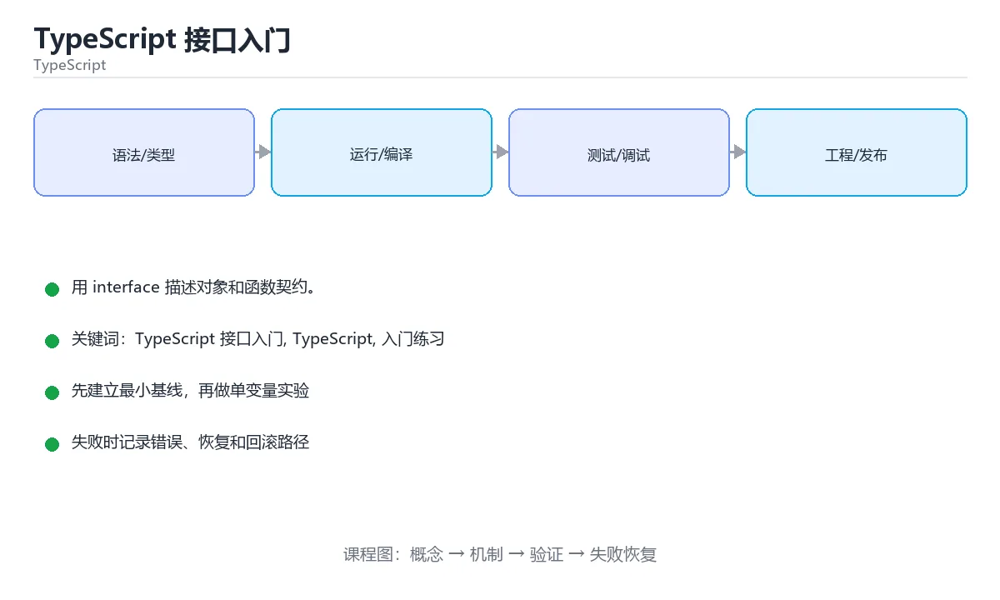

# TypeScript 接口入门



> 内容更新时间：2026-10-03 · 学习阶段：入门 · 预计用时：15 分钟

## 学习目标

- 先认识「TypeScript 接口入门」需要的工具、输入和输出。
- 按步骤运行最小示例，并记录结果与错误。
- 用一个边界输入验证自己是否真正掌握。

## 前置知识

- 会进行基本的文件或命令行操作。
- 不需要预先掌握「TypeScript」的高级知识。

## 一句话入门

用 interface 描述对象和函数契约。

## 最小示例

```typescript
interface Lesson {
  id: string;
  minutes: number;
}

const lesson: Lesson = { id: "ts-1", minutes: 15 };
console.log(`${lesson.id}:${lesson.minutes}`);
```

## 预期输出

```text
ts-1:15
```

## 常见错误

- 把任意字符串赋给联合类型，类型检查失败。
- 复制命令时遗漏空格、引号或必要参数。

## 动手练习

1. 原样运行最小示例，保存命令和输出。
2. 把数字 2 改成 10，预测并验证新结果。
3. 制造一个错误输入，写出错误信息和修复方法。

## 本课小结

- 入门阶段先保证能运行、能观察、能解释，再追求复杂功能。
- 每次只改一个变量，记录预测与实际结果。
- 遇到错误先看第一条错误信息，再回到最小示例。

<!-- p0-thicken:v1 -->

## 考点精讲：把选择题还原成判断过程

下面不是答案速查，而是把本课测验里每个选项背后的判断标准展开。先自己作答，再对照解析检查推理链；如果结论正确但理由不完整，仍然需要回到正文补足概念。

### 考点 1：《TypeScript 接口入门》的“最小示例”主要使用哪种语言或格式？

- **正确判断**：TypeScript
- **解析**：代码块的语言标记决定了示例的运行方式和复习工具。正确项来自本课最小示例的围栏标记，其他选项来自其他课程或输出说明。阅读代码题时要先确认语言、输入、预期输出，再判断运行环境。本题正确项是「TypeScript」。复习《TypeScript 接口入门》时，把这一条写进自己的复述，再用原文示例或练习做一次验证；如果仍说不清，就回到对应章节。
- **迁移检查**：把题目中的一个输入换成边界值，原来的结论还成立吗？为什么？

### 考点 2：《TypeScript 接口入门》的“常见错误/误区”提醒优先检查什么？

- **正确判断**：把任意字符串赋给联合类型，类型检查失败。
- **解析**：这道题来自本课的排错清单。正确项是正文强调的检查点，其他选项把排错方向引向无关细节。遇到错误时应先复现最小案例，只改变一个变量，检查输入、环境、边界和错误信息，再继续修改。本题正确项是「把任意字符串赋给联合类型，类型检查失败。」。复习《TypeScript 接口入门》时，把这一条写进自己的复述，再用原文示例或练习做一次验证；如果仍说不清，就回到对应章节。
- **迁移检查**：如果去掉一个限制条件，哪个选项会变成正确？请写出判断过程。

### 考点 3：《TypeScript 接口入门》的“动手练习”首先要求做什么？

- **正确判断**：原样运行最小示例，保存命令和输出。
- **解析**：这道题来自本课练习步骤。正确项对应正文中列出的第一项动手任务，其他选项虽然也是学习动作，但缺少本课要求的输入、步骤或观察目标。做完练习后应记录预测结果和实际输出的差异。本题正确项是「原样运行最小示例，保存命令和输出。」。复习《TypeScript 接口入门》时，把这一条写进自己的复述，再用原文示例或练习做一次验证；如果仍说不清，就回到对应章节。
- **迁移检查**：把这道题改写成一次可运行或可人工验证的实验，并记录预期输出。

### 考点 4：《TypeScript 接口入门》的“一句话入门”最接近哪一项？

- **正确判断**：用 interface 描述对象和函数契约。
- **解析**：这道题来自本课正文的开篇定义。正确项直接概括了课程主题，其他选项来自其他知识点的定义，不能回答本课的具体问题。复习时先用自己的话复述这句话，再回到最小示例验证理解。本题正确项是「用 interface 描述对象和函数契约。」。复习《TypeScript 接口入门》时，把这一条写进自己的复述，再用原文示例或练习做一次验证；如果仍说不清，就回到对应章节。
- **迁移检查**：用自己的话写出正确项和两个错误项的适用边界。

<!-- p0-practice:v1 -->

## 代码实验：把示例跑成证据

这一节不引入新语法，而是把「TypeScript 接口入门」的最小示例变成可以复现、可以对照的实验。每次只改变一个条件，先写预测，再运行，最后解释差异。

### 实验一：建立基线

```typescript
interface Lesson {
  id: string;
  minutes: number;
}

const lesson: Lesson = { id: "ts-1", minutes: 15 };
console.log(`${lesson.id}:${lesson.minutes}`);
```

先原样运行上面的代码，记录命令、完整输出和退出状态。然后把输出与正文的预期输出逐字对照，不要用“看起来差不多”代替核对；空格、大小写、换行和错误流向都可能暴露环境差异。

### 实验二：只改一个输入

从代码中选一个会影响结果的字面量、参数或输入，把它替换成边界值：数值可尝试 0、1、最大值和最小值，字符串可尝试空串和超长文本，集合可尝试空集合、单元素和重复元素。先写出预测，再运行并记录实际结果。

### 实验三：制造一个可控错误

把一个预期为数字的值改成字符串，或者访问不存在的属性。记录结果是 undefined、NaN 还是类型错误，并说明为什么。

| 实验 | 改动 | 预测 | 实际 | 结论 |
| --- | --- | --- | --- | --- |
| 基线 | 保持原样 |  |  |  |
| 边界 |  |  |  |  |
| 失败 |  |  |  |  |

### 实验四：用三句话复述

1. 输入是什么，哪些输入属于合法范围，哪些属于边界或非法范围？
2. 程序按什么顺序处理输入，在哪一步产生了状态变化或副作用？
3. 输出如何验证，失败时第一条可观察证据是什么？

### 与测验考点的连接

- 考点 1「《TypeScript 接口入门》的“最小示例”主要使用哪种语言或格式？」：先写出你的判断，再回到上方解析核对。正确判断：TypeScript。
- 考点 2「《TypeScript 接口入门》的“常见错误/误区”提醒优先检查什么？」：先写出你的判断，再回到上方解析核对。正确判断：把任意字符串赋给联合类型，类型检查失败。。
- 考点 3「《TypeScript 接口入门》的“动手练习”首先要求做什么？」：先写出你的判断，再回到上方解析核对。正确判断：原样运行最小示例，保存命令和输出。。
- 考点 4「《TypeScript 接口入门》的“一句话入门”最接近哪一项？」：先写出你的判断，再回到上方解析核对。正确判断：用 interface 描述对象和函数契约。。

<!-- p0-deepdive:v1 -->

## TypeScript 基础机制速览

### 编译期类型与运行时 JavaScript

TypeScript 在 JavaScript 之上增加静态类型检查，编译后类型信息会被擦除，运行时仍然是 JavaScript。因此类型标注不能替代输入校验，外部数据仍要在边界处验证。`tsc` 负责类型检查和输出，现代项目通常由构建工具调用它。开启 `strict` 能提前发现 null、隐式 any 和函数参数问题，是学习类型系统的重要反馈来源。

### 类型推断、注解与窄化

TypeScript 能从初始值推断类型，局部变量通常不需要重复写注解；公共 API、复杂对象和空值边界适合显式标注。联合类型表示“可能是几种类型之一”，通过 `typeof`、`in`、`instanceof`、判别字段和自定义类型守卫进行窄化。窄化只在当前控制流内有效，异步回调或闭包中类型可能重新变宽，需要重新检查或保存稳定值。

### 接口、类型别名与结构化类型

接口和类型别名都能描述对象形状，接口适合可扩展的公共契约，类型别名适合联合、交叉和函数类型。TypeScript 使用结构化类型：只要对象具有所需成员，就认为它满足类型，不要求显式继承。索引签名、可选属性和只读属性会影响赋值与读取。`unknown` 比 `any` 安全，使用前必须窄化；`never` 表示不可能的值，常用于穷尽检查。

### 泛型、工具类型与模块

泛型让函数和类型在保持类型关系的同时复用逻辑，约束 `extends` 限制可接受的类型。工具类型 `Partial`、`Pick`、`Omit`、`Record` 能从已有类型派生新类型，但过度嵌套会降低可读性。模块使用 `import`/`export`，类型导入使用 `import type` 可以避免生成无用运行时代码。声明文件描述第三方库的类型，缺少类型时应优先找官方类型包，而不是到处使用 any。

### 严格模式与工程实践

`strictNullChecks` 把 null 和 undefined 纳入类型系统，`noImplicitAny` 禁止隐式 any，`noUncheckedIndexedAccess` 让索引访问结果可能为 undefined。类型断言 `as` 只告诉编译器“相信我”，不会改变运行时行为；能用窄化就不用断言。类型测试、运行时校验和端到端测试要配合使用，类型正确不代表业务数据正确。

## 本课连接：把机制放回「TypeScript 接口入门」

上面的机制速览覆盖了该方向最容易反复出现的概念。下面把它收回到本课，用正文里的真实主题和测验考点建立连接。

### 本课真实主题

- 本课目前以最小示例和测验为主要学习材料，先完成上面的实验记录。

### 测验考点回链

- 考点 1「《TypeScript 接口入门》的“最小示例”主要使用哪种语言或格式？」→ 正确判断：TypeScript。
- 考点 2「《TypeScript 接口入门》的“常见错误/误区”提醒优先检查什么？」→ 正确判断：把任意字符串赋给联合类型，类型检查失败。。
- 考点 3「《TypeScript 接口入门》的“动手练习”首先要求做什么？」→ 正确判断：原样运行最小示例，保存命令和输出。。
- 考点 4「《TypeScript 接口入门》的“一句话入门”最接近哪一项？」→ 正确判断：用 interface 描述对象和函数契约。。

### 边界检查

1. 本课机制在正常输入下如何工作？
2. 输入为空、越界、类型不符或重复时，哪一步最先失败？
3. 失败后应该保留哪些日志、输出或状态，才能复现并修复？
4. 如果把这套机制换成相邻主题的方案，哪些约束会改变？

<!-- p2-enrichment:v1 -->

## English Overview

**Title:** TypeScript Interfaces

**Summary:** Describe object and function contracts.

**Category:** TypeScript  
**Level:** 入门  
**Key terms:** TypeScript 接口入门, TypeScript, 入门练习

> The full tutorial is written in Chinese. This bilingual overview helps English readers identify the topic, scope and key terms before studying the detailed examples.

## 内容元数据

- 内容版本：v2.0
- 最后更新：2026-10-03
- 学习阶段：入门
- 适用环境：TypeScript 5.x / Node.js 22+
- 内容来源：内置结构化课程与工程实践整理
- 相关主题：TypeScript 接口入门、TypeScript、入门练习
- 质量版本：P0 测验标准 + P1 覆盖扩展 + P2 体验补全

<!-- top50-rewrite:v1 -->

## 参考资料与复核

- 最后复核：2026-10-04
- 下次复核：2027-04-04
- 复核范围：版本兼容、API 行为、安全建议与工程实践
- 来源性质：官方文档与标准；本课正文为离线教学重组，不复制原文

| 参考资料 | 本课用途 |
| --- | --- |
| [TypeScript Handbook](https://www.typescriptlang.org/docs/handbook/intro.html) | 类型系统与编译配置 |
| [Decorators 与模块](https://www.typescriptlang.org/docs/) | 语言特性与生态集成 |

> 本课主题：用 interface 描述对象和函数契约。

> App 完全离线展示文字链接，不会自动联网；需要延伸阅读时可复制链接到浏览器。
<!-- p2-references:v1 -->
<!-- top50-rewrite:v1 -->
