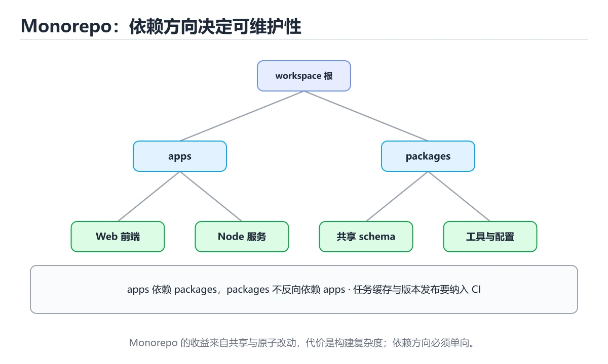
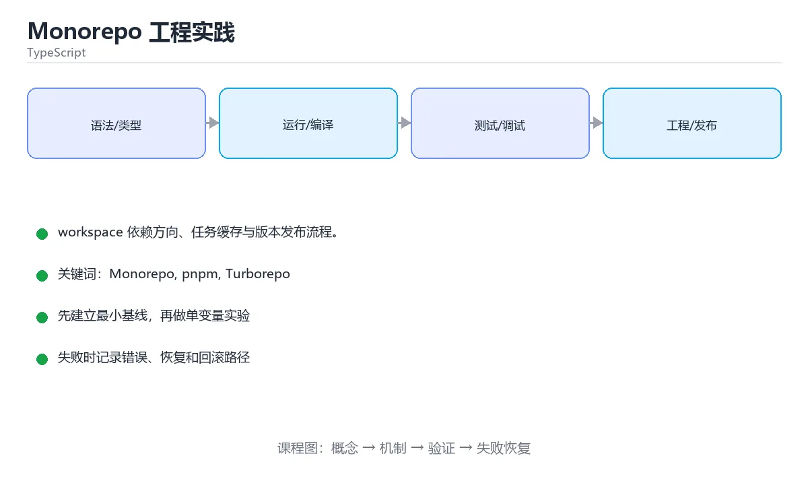

# Monorepo 工程实践

> 内容更新时间：2026-10-03





## 学习目标

- 能用自己的话解释Monorepo 工程实践解决了什么问题，而不是只背术语。
- 能说清 「Monorepo」、「pnpm」、「Turborepo」、「Changesets」 之间的关系，并分别举出一个例子。
- 能把本课知识放回「TypeScript」的知识体系，说明它和相邻主题的边界。
- 能完成本课练习，并用验收标准检查自己的结果。

> 一句话摘要：workspace 依赖方向、任务缓存与版本发布流程。

## 前置知识

- 先完成上一课《TypeScript Node 后端开发》；如果已经掌握，可以直接用本课练习自测。
- 本课阶段：进阶。建议先掌握同一分类的基础课程，并能独立运行正文中的最小示例。
- 开始前先复习：Monorepo、pnpm、Turborepo。
- 如果某一步看不懂，先记录具体卡点，完成练习后再回头读一遍。

## 工具选型速查

| 工具 | 定位 | 特点 |
| --- | --- | --- |
| pnpm workspace | 包管理与链接 | 硬链接节省磁盘，workspace 协议清晰 |
| Turborepo | 任务编排与缓存 | 声明式 pipeline，远程缓存 |
| Nx | 全功能工作区 | 依赖图、代码生成、插件丰富 |
| Changesets | 版本与发布 | 变更记录生成版本号与 CHANGELOG |

最小可用组合：**pnpm workspace（链接）+ Turborepo（任务与缓存）+ Changesets（发布）**。

## 目录与依赖约定

| 目录 | 职责 | 约束 |
| --- | --- | --- |
| `apps/` | 可部署应用 | 可以依赖 packages |
| `packages/` | 共享库与组件 | 不依赖 apps，避免循环 |
| `tooling/` | 构建配置与脚本 | 被所有包复用 |
| `packages/shared` | 类型与 schema | 前后端共享事实来源 |

规则：**依赖方向单向，apps 依赖 packages，packages 之间不得循环依赖。**

```json
{
  "name": "my-workspace",
  "private": true,
  "packageManager": "pnpm@9.0.0",
  "scripts": {
    "build": "turbo run build",
    "test": "turbo run test",
    "lint": "turbo run lint",
    "typecheck": "turbo run typecheck",
    "changeset": "changeset",
    "release": "changeset publish"
  },
  "devDependencies": {
    "turbo": "^2.0.0",
    "@changesets/cli": "^2.27.0"
  }
}
```

```json
{
  "$schema": "https://turbo.build/schema.json",
  "tasks": {
    "build": {
      "dependsOn": ["^build"],
      "outputs": ["dist/**"]
    },
    "test": {
      "dependsOn": ["build"],
      "inputs": ["src/**", "tests/**", "vitest.config.*"]
    },
    "lint": {},
    "typecheck": {
      "dependsOn": ["^build"]
    }
  }
}
```

## 关键收益与风险

| 收益 | 说明 |
| --- | --- |
| 原子提交 | 一次 PR 同时改共享包与使用方 |
| 统一工具链 | lint、测试、构建配置集中 |
| 缓存复用 | 只重建受影响的包 |
| 类型共享 | 前后端共用 schema，减少漂移 |

| 风险 | 对策 |
| --- | --- |
| 仓库变大、克隆慢 | 浅克隆、稀疏检出、CI 用远程缓存 |
| 依赖方向失控 | 用工具检查依赖图与循环 |
| 一次改动影响多个应用 | 明确 CODEOWNERS 与影响面检查 |
| 本地全量构建慢 | 用受影响范围构建（`--filter`） |

## 常见错误对照表

| 容易踩的做法 | 实际现象 | 原因与正确做法 |
| --- | --- | --- |
| 包之间互相依赖 | 循环依赖、构建顺序混乱 | 单向依赖，公共逻辑下沉 |
| 不使用 workspace 协议 | 误装发布版而非本地包 | 用 `workspace:*` |
| CI 每次都全量构建 | 流水线很慢 | 依赖图加缓存，只构建受影响包 |
| 共享包直接发布到 npm | 版本与内部状态不同步 | 私有包不发布或用 changesets 管理 |
| 本地用 `npm install` | lock 文件冲突 | 统一包管理器并用 `--frozen-lockfile` |
| 没有影响面检查 | 改共享包导致多个应用故障 | CI 跑下游测试并在 PR 标注影响面 |

## 自测清单

- [ ] 依赖单向：apps 依赖 packages，无循环。
- [ ] 统一包管理器与 lock 文件，CI 使用冻结安装。
- [ ] 用任务编排工具缓存构建产物，只跑受影响任务。
- [ ] 版本与发布由 changesets 管理。
- [ ] 共享包变更会触发下游应用测试。

## 零基础详解：Monorepo 与多包协作

### 一句话说清它是什么

Monorepo 是「把多个包放进同一个仓库」的组织方式。
好处是跨包改动一次提交完成、类型即时联动；代价是**构建与 CI 必须做增量**，否则会越来越慢。

### 用生活比喻理解

| 概念 | 比喻 | 说明 |
| --- | --- | --- |
| workspace | 一栋楼里的多个房间 | 同仓库管理多个包 |
| 内部依赖 | 隔壁借东西 | 用 workspace 协议而不是发布到 npm |
| 任务编排 | 施工排期 | 按依赖顺序构建 |
| 受影响分析 | 只修坏掉的那几间 | 只跑相关任务 |
| 缓存 | 复用上次成果 | 没变就不重跑 |

### 什么时候该用 Monorepo

| 场景 | 建议 |
| --- | --- |
| 前后端共享类型定义 | ✅ 收益明显 |
| 多个包需要同步发版 | ✅ 一次提交改完 |
| 只有一个应用 | ❌ 直接单包更简单 |
| 团队完全独立、几乎不共享代码 | ❌ 拆分仓库更合适 |

### 目录结构

```text
repo/
  apps/
    web/                 前端应用
    api/                 后端服务
  packages/
    ui/                  共享组件
    types/               共享类型
    config/              共享配置（eslint、tsconfig）
  pnpm-workspace.yaml
  turbo.json
  package.json
```

### 两个关键配置文件

```yaml
# pnpm-workspace.yaml
packages:
  - "apps/*"
  - "packages/*"
```

```json
// turbo.json
{
  "$schema": "https://turbo.build/schema.json",
  "tasks": {
    "build": {
      "dependsOn": ["^build"],
      "outputs": ["dist/**"]
    },
    "typecheck": { "dependsOn": ["^build"] },
    "test": { "dependsOn": ["build"], "outputs": ["coverage/**"] },
    "lint": {}
  }
}
```

| 配置 | 作用 |
| --- | --- |
| `dependsOn: ["^build"]` | 先构建依赖的包 |
| `outputs` | 声明产物路径，用于缓存 |
| 根 `package.json` 脚本 | 用 `turbo run build` 一键跑全部 |

### 内部依赖怎么写

```json
// packages/ui/package.json
{
  "name": "@myapp/ui",
  "version": "0.0.0",
  "private": true,
  "main": "./dist/index.js",
  "types": "./dist/index.d.ts",
  "exports": {
    ".": { "types": "./dist/index.d.ts", "import": "./dist/index.js" }
  }
}
```

```json
// apps/web/package.json
{
  "dependencies": {
    "@myapp/ui": "workspace:*"
  }
}
```

`workspace:*` 让本地包直接链接，不用先发布到 npm。

### CI 里只跑受影响的包

```yaml
- run: pnpm install --frozen-lockfile
- run: pnpm turbo run lint typecheck test build --filter='...[origin/main]'
```

| 过滤写法 | 含义 |
| --- | --- |
| `--filter=web` | 只跑 web 包 |
| `--filter='...[origin/main]'` | 只跑相对 main 有变化的包及其依赖者 |
| `--filter=@myapp/ui...` | ui 包及其依赖 |
| `--filter=...^build` | 只跑构建任务 |

### 三个必须守住的约定

```text
1. 每个包自己声明依赖，不靠「根目录恰好装了」这种巧合
2. 共享配置抽成 @myapp/config，各处 extends 它，避免规则漂移
3. 内部包设为 private，避免误发布到公共仓库
```

### 新手最容易踩的八个坑

| 坑 | 现象 | 正确做法 |
| --- | --- | --- |
| 依赖靠提升「碰巧能用」 | 别人机器上装不起来 | 每个包显式声明依赖 |
| 忘记声明 outputs | 缓存失效，每次都重跑 | 在 turbo.json 写清产物 |
| 全量跑 CI | 一小时起步 | 用 `--filter` 只跑受影响 |
| 用 `*` 版本引用内部包 | 装到旧的远端版本 | 用 `workspace:*` |
| 内部包被误发布 | 公开仓库出现私有代码 | 加 `"private": true` |
| 循环依赖 | 构建顺序无法确定 | 拆出公共包打破环 |
| tsconfig 各写一套 | 类型行为不一致 | 抽共享配置 |
| lockfile 未提交 | 版本不一致 | 提交并 CI 用 frozen-lockfile |

### 手把手练习：加一个共享类型包

```json
// packages/types/package.json
{
  "name": "@myapp/types",
  "version": "0.0.0",
  "private": true,
  "types": "./src/index.ts",
  "exports": { ".": "./src/index.ts" }
}
```

```typescript
// packages/types/src/index.ts
export type User = {
  id: number;
  name: string;
  email?: string;
};

export type ApiResult<T> =
  | { ok: true; data: T }
  | { ok: false; error: string };
```

```typescript
// apps/api/src/handler.ts
import type { ApiResult, User } from "@myapp/types";

export function getUser(id: number): ApiResult<User> {
  if (id <= 0) return { ok: false, error: "id 不合法" };
  return { ok: true, data: { id, name: "小明" } };
}
```

```bash
pnpm install
pnpm turbo run typecheck --filter='...[origin/main]'
```

### 学完自测

- [ ] 能说出 Monorepo 的两个收益与两个代价。
- [ ] 知道 `workspace:*` 解决什么问题。
- [ ] 能说出 `dependsOn: ["^build"]` 的含义。
- [ ] 知道 CI 为什么要用 `--filter=...[origin/main]`。
- [ ] 能说出内部包必须加 `private` 的原因。

## 动手练习

> 本课练习重点：围绕「Monorepo、pnpm、Turborepo」完成复述、实验和交付，每个结果都要能被别人检查。

先让类型检查通过，再制造一次类型错误，最后补运行时校验与测试。

### 练习 1：建立心智模型（10 分钟）

合上教程，用 3～5 句话回答：

1. Monorepo 工程实践解决了什么问题？
2. 如果没有它，会出现什么具体后果？
3. 它和「pnpm」是什么关系？

**验收标准**：至少出现一个本课关键词，并写出一个反例、边界条件或失效场景。

### 练习 2：做一次可控实验（20 分钟）

从正文中选一个最小示例，完成以下操作：

1. 先预测修改一个参数、输入或步骤后的结果。
2. 再实际执行或逐步推演，记录真实结果。
3. 如果结果与预测不同，写出差异原因。

**验收标准**：留下「原例 → 改动 → 预测 → 结果 → 原因」五步记录。

### 练习 3：交付一个小结果（30 分钟）

写一个最小类型示例，先让 `tsc --noEmit` 通过，再故意制造一次类型错误。

任务要求：

- 结果必须能被别人检查，不能只写“我已经理解了”。
- 至少覆盖「Monorepo」和「pnpm」两个关键词。
- 写出 1 个仍然不确定的问题，以及下一步如何验证。

> 提示：时间有限时优先做练习 1 和练习 2；练习 3 可以拆成两次完成。

## 本课小结

- 核心问题：Monorepo 工程实践不是孤立术语，而是在「TypeScript」中解决一类具体问题。
- 关键关系：先分清「Monorepo」与「pnpm」的职责，再理解「Turborepo」的适用边界。
- 判断标准：能解释正常场景、边界条件和失败场景，才算真正掌握。
- 下一步：完成练习后，用自己的话写下 3 条要点，再去做本课测验。

## 可运行练习

### 任务 1：先跑通，再解释

```typescript
// packages/types/src/index.ts
export type User = {
  id: number;
  name: string;
  email?: string;
};

export type ApiResult<T> =
  | { ok: true; data: T }
  | { ok: false; error: string };
```

### 任务 2：只改一个条件

把「Monorepo 工程实践」的最小示例复制一份，只改一个条件再跑一次：

- 改动点：只把Monorepo的输入换成空值、极值或错误输入，其余保持不变。
- 预测：先写下「Monorepo 工程实践」在改动后的输出或错误信息，再运行。
- 记录：对照改动前后的结果，指出差异出在哪一步。
- 验收：换回原条件能复现原结果，改动只影响Monorepo。

### 任务 3：迁移到自己的数据

用同一套思路处理一组你自己的数据或场景，保持输出格式与任务 1 一致。

## 故障现场

### 现场 1：本课的 Monorepo 常规用例通过，但边界用例失败

**症状**：在本课的练习或生产场景里出现“本课的 Monorepo 常规用例通过，但边界用例失败”。

**复现**：准备一组最小输入，只保留触发“本课的 Monorepo 常规用例通过，但边界用例失败”的必要条件，连续运行两次确认结果稳定。

**定位**：围绕“Monorepo 的前置条件与取值边界没有写进代码，默认值掩盖了空值和极值”检查调用链、输入数据和环境配置，先验证假设再改代码。

**预防**：把“本课的 Monorepo 常规用例通过，但边界用例失败”写成一条自动化用例，并在本课的验收清单里保留对应检查项。

### 现场 2：本课的 pnpm 结果在两次运行之间不一致

**症状**：在本课的练习或生产场景里出现“本课的 pnpm 结果在两次运行之间不一致”。

**复现**：准备一组最小输入，只保留触发“本课的 pnpm 结果在两次运行之间不一致”的必要条件，连续运行两次确认结果稳定。

**定位**：围绕“pnpm 依赖了当前版本、执行顺序或共享状态，单次运行无法暴露差异”检查调用链、输入数据和环境配置，先验证假设再改代码。

**预防**：把“本课的 pnpm 结果在两次运行之间不一致”写成一条自动化用例，并在本课的验收清单里保留对应检查项。

### 现场 3：本课的验证只在开发机通过

**症状**：在本课的练习或生产场景里出现“本课的验证只在开发机通过”。

**定位**：围绕“环境版本、配置和输入规模与目标环境不同，Monorepo 缺少可重复的验证记录”检查调用链、输入数据和环境配置，先验证假设再改代码。

## 版本与时效

- TypeScript 5.x 主线持续收紧类型推导、装饰器与模块解析行为
- 升级前先跑 tsc --noEmit，再处理构建工具与 ESLint 规则差异

### 升级检查清单

- 先固定当前版本，跑通全部示例与测验，再升级工具链。
- 只改一个版本变量，记录编译、测试、性能与产物体积的变化。
- 重点回归默认值、弃用警告、序列化格式、并发语义和错误信息。
- 升级完成后更新本课的“最后复核 / 下次复核”日期与版本说明。

## 本课复习清单

离开本课前，逐项确认：

- [ ] 不看解析，能说出「Monorepo 中正确的依赖方向是？」的判断依据。
- [ ] 不看解析，能说出「为了引用本地包而不是已发布版本，应该使用？」的判断依据。
- [ ] 不看解析，能说出「CI 中让流水线更快的关键做法是？」的判断依据。
- [ ] 不看解析，能说出「共享包变更后，最需要做什么？」的判断依据。
- [ ] 不看解析，能说出「Monorepo 的主要风险是？」的判断依据。
- [ ] 至少运行一次本课示例，记录输入、输出和一个边界情况。
- [ ] 把本课最容易混淆的两个概念写成一句话对照。

| 复盘项 | 记录 |
| --- | --- |
| 已经能独立解释的考点 |  |
| 仍然说不清的概念 |  |
| 下一步验证动作 |  |

## 术语速查

| 术语 | 本课语境 |
| --- | --- |
| `apps/` | \| `apps/` \| 可部署应用 \| 可以依赖 packages \| |
| `packages/` | \| `packages/` \| 共享库与组件 \| 不依赖 apps，避免循环 \| |
| `tooling/` | \| `tooling/` \| 构建配置与脚本 \| 被所有包复用 \| |
| `packages/shared` | \| `packages/shared` \| 类型与 schema \| 前后端共享事实来源 \| |
| `--filter` | \| 本地全量构建慢 \| 用受影响范围构建（`--filter`） \| |
| `workspace:*` | \| 不使用 workspace 协议 \| 误装发布版而非本地包 \| 用 `workspace:*` \| |

## 考点精讲

### 考点 1：代码补全·Monorepo

- **题目**：下面这段 TypeScript 代码摘自「Monorepo 工程实践」的正文示例。关于这段代码，下面哪一项说法与实际内容相符？
- **判断依据**：在「Monorepo 工程实践」里，这段代码只做静态声明，没有循环、分支或可观察输出。这段代码出自「Monorepo 工程实践」的正文示例，围绕Monorepo、pnpm、Turborepo展开；把输入或边界换成空值、极值或失败情况后，结论要以「Monorepo 工程实践」的实际运行结果为准。

### 考点 2：多选辨析·Monorepo

- **题目**：围绕“Monorepo 工程实践”中的 Monorepo、pnpm、Turborepo，下列哪两项是本课强调的实践判断？
- **判断依据**：本课把Monorepo 工程实践拆成概念、示例与故障现场三部分，因此判断 Monorepo 时必须同时交代输入、输出和失败路径，这使“学习 Monorepo 时要同时说明输入、输出和失败路径，不能只看正常流程”成立。在Monorepo 工程实践里，判断 pnpm 时要固定版本与边界输入，所以“验证 pnpm 时要固定版本并覆盖边界输入，结论才可复现”才可复现。

### 考点 3：概念判断·Monorepo

- **题目**：CI 中让流水线更快的关键做法是？
- **判断依据**：在「Monorepo 工程实践」里，基于依赖图与缓存只跑受影响的任务。任务编排工具根据输入哈希与依赖图跳过未变化的任务，并复用远程缓存。把“基于依赖图与缓存只跑受影响的任务”代回「Monorepo 工程实践」里“CI 中让流水线更快的关键做法是”的例子核对，条件一旦改变，结论就要用Monorepo、pnpm、Turborepo重新推导。

### 考点 4：概念判断·Monorepo

- **题目**：共享包变更后，最需要做什么？
- **判断依据**：在「Monorepo 工程实践」里，结论应落在「触发下游应用的测试并标注影响面」。共享包变更影响面大，CI 需要跑下游测试并让评审者看到影响范围。在「Monorepo 工程实践」里，这道题要求区分概念与边界，「触发下游应用的测试并标注影响面」只有在题干给出的前提下才成立，而「等上线后观察」、「直接发布到 npm」缺少同一组条件。

### 考点 5：概念判断·Monorepo

- **题目**：Monorepo 的主要风险是？
- **判断依据**：在「Monorepo 工程实践」里，仓库变大，依赖方向易失控。这些是 Monorepo 的典型代价，需要通过依赖约束、受影响范围构建与 CODEOWNERS 缓解。这道题的关键在「Monorepo 工程实践」的Monorepo、pnpm、Turborepo：先确认题干“Monorepo 的主要风险是”问的是哪一步，再排除偷换前提的选项。

### 考点 6：填空·pnpm-____.yaml

- **题目**：补全代码：「Monorepo 工程实践」示例中，下面这行代码缺少哪个关键字或函数名？请填入 ____。 `pnpm-____.yaml`
- **判断依据**：把“workspace”代回「Monorepo 工程实践」里“Monorepo 工程实践示例中”的例子核对，条件一旦改变，结论就要用Monorepo、pnpm、Turborepo重新推导。「Monorepo 工程实践」要求先交代Monorepo、pnpm、Turborepo的前提再下结论，所以“workspace”只在题干“Monorepo”给定的条件下成立。

## English Overview

**Title:** Monorepo Engineering

**Summary:** Workspace dependency rules, task caching and releases.

**Category:** TypeScript
**Level:** 进阶
**Key terms:** Monorepo, pnpm, Turborepo, Changesets, 依赖图, 缓存

## 内容元数据

- 内容版本：v2.0
- 最后更新：2026-10-03
- 学习阶段：进阶
- 适用环境：TypeScript 5.x / Node.js 22+
- 内容来源：内置结构化课程与工程实践整理
- 相关主题：Monorepo、pnpm、Turborepo、Changesets、依赖图、缓存
- 质量版本：P0 测验标准 + P1 覆盖扩展 + P2 体验补全

## 参考资料与复核

- 最后复核：2026-10-04
- 下次复核：2027-04-04
- 复核范围：版本兼容、API 行为、安全建议与工程实践
- 来源性质：官方文档、标准或权威教材；正文为离线教学重组

| 参考资料 | 本课用途 |
| --- | --- |
| [项目引用](https://www.typescriptlang.org/docs/handbook/project-references.html) | 大型项目拆分与增量构建 |
| [TypeScript Handbook](https://www.typescriptlang.org/docs/handbook/intro.html) | 类型系统与语言指南 |
| [Everyday Types](https://www.typescriptlang.org/docs/handbook/2/everyday-types.html) | 常用类型与收窄 |

> 「Monorepo 工程实践」的链接用于离线阅读后的延伸核对；App 不会自动联网。
