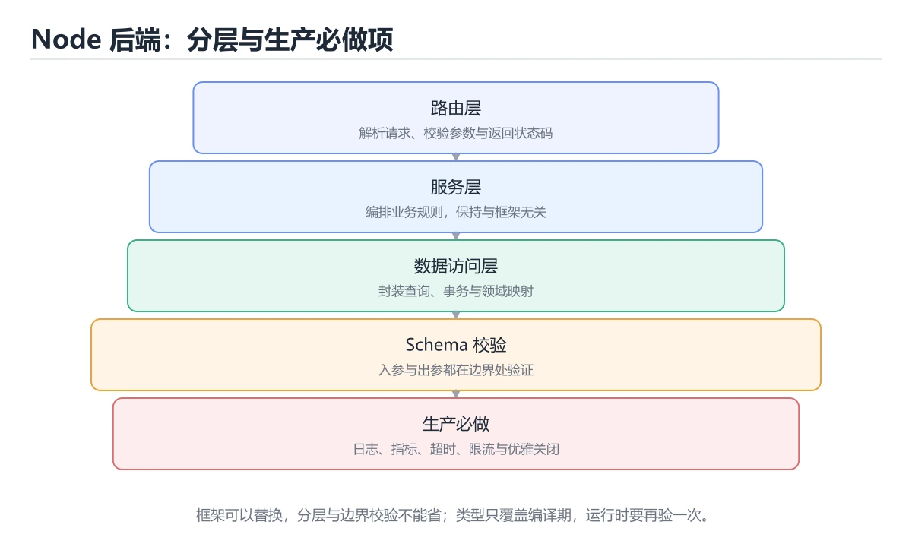
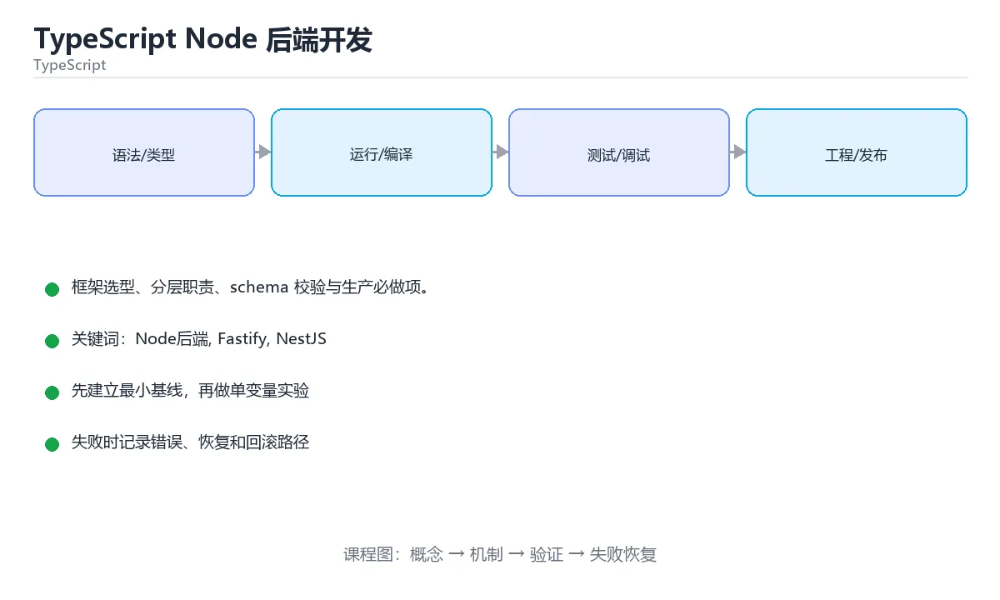

# TypeScript Node 后端开发

> 内容更新时间：2026-10-06 · 学习阶段：进阶 · 预计用时：35 分钟





## 学习目标

- 能用自己的话解释TypeScript Node 后端开发解决了什么问题，而不是只背术语。
- 能说清 「Node后端」、「Fastify」、「NestJS」、「zod」 之间的关系，并分别举出一个例子。
- 能把 Node后端 放回「TypeScript Node 后端开发」的知识体系，说明它和 Fastify 的边界。
- 能完成本课练习，并用验收标准检查自己的结果。

> 一句话摘要：框架选型、分层职责、schema 校验与生产必做项。

## 前置知识

- 先完成上一课《TypeScript 类型体操进阶》；如果已经掌握，可以直接用本课练习自测。
- 本课阶段：进阶。建议先掌握同一分类的基础课程，并能独立运行正文里的 CreateOrderSchema 示例。
- 开始前先复习：Node后端、Fastify、NestJS。
- 卡在 Node后端 上时不要跳过：把输入、预期和实际输出写成三行，再回头读正文。

## 框架选型速查

| 框架 | 定位 | 特点 |
| --- | --- | --- |
| Express | 极简 | 生态最大，需要自己拼装 |
| Fastify | 高性能 | Schema 校验内建、插件体系 |
| NestJS | 企业级 | 模块、依赖注入、装饰器，约定强 |
| Hono | 轻量 + 多运行时 | 适合边缘函数与 Node |

选择依据：团队规模与约定强度。小服务用 Fastify，团队大、模块多用 NestJS。

## 分层与职责速查

| 层 | 职责 | 不该做 |
| --- | --- | --- |
| 路由 / 控制器 | 参数解析、校验、状态码 | 写业务规则 |
| 服务层 | 业务规则与编排 | 直接依赖 HTTP 对象 |
| 仓储层 | 数据访问 | 业务判断 |
| DTO / Schema | 请求与响应结构 | 暴露内部实体 |
| 中间件 | 日志、鉴权、限流、错误处理 | 承载业务逻辑 |

```ts
import Fastify from "fastify";
import { z } from "zod";

// 用 schema 同时完成运行时校验与类型推断
const CreateOrderSchema = z.object({
  userId: z.string().uuid(),
  items: z
    .array(z.object({ sku: z.string().min(1), quantity: z.number().int().positive() }))
    .min(1),
});
type CreateOrderInput = z.infer<typeof CreateOrderSchema>;

const app = Fastify({ logger: { level: "info" } });

app.post("/api/orders", async (request, reply) => {
  const parsed = CreateOrderSchema.safeParse(request.body);
  if (!parsed.success) {
    // 统一错误结构，前端可稳定解析
    return reply.status(400).send({
      code: "INVALID_ARGUMENT",
      message: "参数校验失败",
      details: parsed.error.issues.map((issue) => ({
        path: issue.path.join("."),
        message: issue.message,
      })),
    });
  }

  try {
    const order = await orderService.create(parsed.data);
    return reply.status(201).send(order);
  } catch (error) {
    if (error instanceof OrderConflictError) {
      return reply.status(409).send({ code: "CONFLICT", message: error.message });
    }
    request.log.error({ err: error }, "创建订单失败");
    return reply.status(500).send({ code: "INTERNAL", message: "服务异常" });
  }
});

// 进程级兜底：未捕获异常与未处理拒绝都要记录后退出，交给编排重启
process.on("uncaughtException", (error) => {
  app.log.fatal({ err: error }, "未捕获异常，进程退出");
  process.exit(1);
});
process.on("unhandledRejection", (reason) => {
  app.log.fatal({ err: reason }, "未处理的 Promise 拒绝，进程退出");
  process.exit(1);
});
```

## 生产必做项速查

| 项 | 做法 |
| --- | --- |
| 优雅关闭 | 监听 SIGTERM，停止接收新请求并等待在途请求 |
| 健康检查 | `/livez` 只看进程，`/readyz` 检查关键依赖 |
| 配置管理 | 启动时校验必填环境变量，缺失直接退出 |
| 日志 | 结构化 JSON，带 trace id，禁止打印敏感字段 |
| 超时 | 每个下游调用设置超时并提供取消信号 |
| 限流 | 按用户与 IP 维度限流，返回 429 与 Retry-After |
| 错误 | 统一错误结构，区分可重试与不可重试 |
| 依赖注入 | 构造注入，便于测试替换 |

## 常见错误与排查

| 容易踩的做法 | 实际现象 | 原因与正确做法 |
| --- | --- | --- |
| 直接把 `request.body as Order` | 运行时字段缺失导致崩溃 | 用 schema 校验后再使用 |
| 未捕获异常不记录就退出 | 线上无迹可查 | 记录 fatal 日志后退出 |
| 忽略 SIGTERM | 发布时请求被中断 | 实现优雅关闭 |
| 在控制器里写业务逻辑 | 无法复用与测试 | 抽到服务层 |
| 用 `any` 传请求体 | 类型安全失效 | 校验后使用推断类型 |
| 日志打印完整请求体 | 敏感信息泄漏 | 只记录必要字段并脱敏 |
| 单例连接池未配置上限 | 高并发下打满数据库 | 显式设置池大小与超时 |

## 复习与自测

- [ ] 请求入参经 schema 校验并推断类型。
- [ ] 分层清晰，控制器不写业务逻辑。
- [ ] 实现优雅关闭与两个健康检查端点。
- [ ] 配置在启动时校验，缺失即失败。
- [ ] 日志结构化且脱敏，异常有兜底处理。

## 零基础详解：TypeScript 写 Node 后端

### 一句话说清它是什么

用 TypeScript 写后端，核心工作只有四件：**收请求、校验数据、处理业务、返回响应**。
框架（Express、Fastify、NestJS）只是把这四件事组织得更规整。

### 用生活比喻理解

| 概念 | 比喻 | 说明 |
| --- | --- | --- |
| 路由 | 前台分诊 | 按路径把请求分给处理函数 |
| 中间件 | 安检通道 | 统一做日志、鉴权、错误处理 |
| DTO 校验 | 开箱验货 | 进来的数据必须先检查 |
| 服务层 | 后厨 | 真正的业务逻辑 |
| 数据层 | 仓库 | 与数据库打交道 |

### 分层结构

```text
src/
  app.ts            组装：注册中间件与路由
  server.ts         启动：监听端口、优雅关闭
  routes/user.ts    路由：只负责解析与返回
  services/user.ts  业务：纯逻辑，可单测
  repositories/     数据：SQL 或 ORM
  schemas/          zod 校验与类型
```

**原则**：路由层不写业务，业务层不碰 HTTP 对象，这样才测得好。

### 一个最小可用的 Fastify 服务

```typescript
import Fastify from "fastify";
import { z } from "zod";

const CreateUser = z.object({
  name: z.string().min(1).max(50),
  email: z.string().email(),
});

export function buildApp() {
  const app = Fastify({ logger: true });

  // 1. 统一错误处理
  app.setErrorHandler((error, _req, reply) => {
    app.log.error(error);
    reply.status(error.statusCode ?? 500).send({ error: error.message });
  });

  // 2. 健康检查
  app.get("/healthz/live", async () => ({ ok: true }));

  // 3. 业务路由：校验放在最前面
  app.post("/users", async (req, reply) => {
    const parsed = CreateUser.safeParse(req.body);
    if (!parsed.success) {
      return reply.status(400).send({
        error: "参数不合法",
        issues: parsed.error.issues.map((i) => i.message),
      });
    }

    const user = await createUser(parsed.data);
    return reply.status(201).send(user);
  });

  return app;
}
```

### 启动与优雅关闭

```typescript
// server.ts
import { buildApp } from "./app.js";

const app = buildApp();
const port = Number(process.env.PORT ?? 3000);

try {
  await app.listen({ port, host: "0.0.0.0" });
} catch (error) {
  app.log.error(error);
  process.exit(1);
}

for (const signal of ["SIGTERM", "SIGINT"] as const) {
  process.on(signal, async () => {
    app.log.info(`收到 ${signal}，开始关闭`);
    await app.close();          // 等在途请求处理完
    process.exit(0);
  });
}
```

### 中间件的四件必备

| 中间件 | 作用 | 常见坑 |
| --- | --- | --- |
| 请求日志 | 记录方法、路径、耗时、状态码 | 别打印请求体里的敏感字段 |
| 身份认证 | 校验 token 并挂到 `req.user` | 忘记区分 401 与 403 |
| 参数校验 | 用 schema 校验 body、query、params | 只校验 body 漏掉 query |
| 错误处理 | 统一转成标准错误响应 | 把内部堆栈直接返回给用户 |

### 错误响应的统一格式

```typescript
type ApiError = {
  error: string;          // 给人看的信息
  code?: string;          // 给程序判断的稳定标识
  requestId?: string;     // 便于排查
  issues?: string[];      // 校验明细
};
```

**关键**：对外只暴露安全信息，细节写进日志；给程序判断要用 `code`，不要让它去比较文案。

### 状态码速查

| 码 | 含义 | 使用场景 |
| --- | --- | --- |
| 200 / 201 | 成功 / 已创建 | 查询成功、创建成功 |
| 204 | 成功但无内容 | 删除成功 |
| 400 | 参数错误 | 校验失败 |
| 401 | 未认证 | 没登录或 token 失效 |
| 403 | 无权限 | 已登录但越权 |
| 404 | 不存在 | 资源没找到 |
| 409 | 冲突 | 唯一键重复 |
| 429 | 请求过频 | 触发限流 |
| 500 | 服务端错误 | 未预期异常 |

### 新手最容易踩的八个坑

| 坑 | 现象 | 正确做法 |
| --- | --- | --- |
| 路由里写业务逻辑 | 无法单测、难以复用 | 抽到服务层 |
| 不校验 query 与 params | 脏数据进业务 | 三处都校验 |
| 用 `any` 接请求体 | 类型形同虚设 | 用 `unknown` 加 schema |
| 把数据库错误直接返回 | 泄露表结构 | 转成统一错误 |
| 忘记优雅关闭 | 发布时请求被中断 | 监听信号并 `app.close()` |
| 每个请求新建连接池 | 连接耗尽 | 全局复用连接池 |
| 日志打印密码或 token | 泄露 | 白名单字段记录 |
| 没设超时 | 慢请求占满连接 | 设置请求与下游超时 |

### 手把手练习：带校验与分页的查询接口

```typescript
const ListQuery = z.object({
  page: z.coerce.number().int().min(1).default(1),
  size: z.coerce.number().int().min(1).max(100).default(20),
  keyword: z.string().trim().max(50).optional(),
});

app.get("/users", async (req, reply) => {
  const parsed = ListQuery.safeParse(req.query);
  if (!parsed.success) {
    return reply.status(400).send({ error: "查询参数不合法" });
  }

  const { page, size, keyword } = parsed.data;
  const { items, total } = await listUsers({ page, size, keyword });

  return reply.send({
    items,
    pagination: { page, size, total, pages: Math.ceil(total / size) },
  });
});
```

### 学完自测

- [ ] 能说出路由、服务、数据三层各自的职责。
- [ ] 知道为什么只校验 body 不够。
- [ ] 能说出 401 与 403 的区别。
- [ ] 知道优雅关闭要监听哪些信号。
- [ ] 能说出错误响应里 `code` 字段的用途。

## 动手练习

> 本课练习重点：围绕「Node后端、Fastify、NestJS」完成复述、实验和交付，每个结果都要能被别人检查。

先让 Node后端 的类型检查通过，再制造一次类型错误，最后补运行时校验。

### 练习 1：建立心智模型（10 分钟）

合上教程，用 3～5 句话回答：

1. TypeScript Node 后端开发解决了什么问题？
2. 如果没有它，会出现什么具体后果？
3. 它和「Fastify」是什么关系？

验收标准：回答里必须出现 Node后端，并写出一个让结论失效的边界条件。

### 练习 2：做一次可控实验（20 分钟）

从正文中选一个最小示例，完成以下操作：

1. 先预测修改一个参数、输入或步骤后的结果。
2. 再实际执行或逐步推演，记录真实结果。
3. 如果结果与预测不同，写出差异原因。

**验收标准**：围绕「框架选型速查」小节做一次五步记录，原例取自 CreateOrderSchema，改动只允许动一处Node后端，原因要能指回正文的判断依据。

### 练习 3：交付一个小结果（30 分钟）

写一个只做一件事的小程序：输入 Node后端，输出 Fastify，其余全部省略。

任务要求：

- 结果必须能被别人检查，不能只写“我已经理解了”。
- 至少覆盖「Node后端」和「Fastify」两个关键词。
- 写出 1 个仍然不确定的问题，以及下一步如何验证。

> 提示：时间有限时优先做练习 1 和练习 2；练习 3 可以拆成两次完成。

## 本课小结

- 核心问题：TypeScript Node 后端开发不是孤立术语，而是在「TypeScript」中解决一类具体问题。
- 关键关系：先分清「Node后端」与「Fastify」的职责，再理解「NestJS」的适用边界。
- 判断标准：能解释 Node后端 的正常场景、边界条件和失败场景，才算真正掌握。
- 下一步：先复述 Fastify 的边界，再开始本课测验。

## 可运行练习

### 任务 1：先跑通，再解释

```typescript
// server.ts
import { buildApp } from "./app.js";

const app = buildApp();
const port = Number(process.env.PORT ?? 3000);

try {
  await app.listen({ port, host: "0.0.0.0" });
} catch (error) {
  app.log.error(error);
  process.exit(1);
}

for (const signal of ["SIGTERM", "SIGINT"] as const) {
  process.on(signal, async () => {
    app.log.info(`收到 ${signal}，开始关闭`);
    await app.close();          // 等在途请求处理完
    process.exit(0);
  });
}
```

### 任务 2：只改一个条件

把「TypeScript Node 后端开发」的最小示例复制一份，只改一个条件再跑一次：

- 改动点：把 Fastify 换成边界值，其他输入保持原样。
- 预测：先写下「TypeScript Node 后端开发」在改动后的输出或错误信息，再运行。
- 记录：对照改动前后的结果，指出差异出在哪一步。
- 验收：换回原条件能复现原结果，改动只影响Node后端。

### 任务 3：迁移到自己的数据

用同一套思路处理一组你自己的 Node后端 数据，保持输出格式与任务 1 一致。

## 故障现场

### 现场 1：直接把 request.body as Order

**症状**：在《TypeScript Node 后端开发》的复现场景中，运行时字段缺失导致崩溃。

**根因**：“运行时字段缺失导致崩溃”只是表层结果。向上追溯会落到“直接把 request.body as Order”这一步，因为它省略了《TypeScript Node 后端开发》的约束，使实现行为和预期模型发生了偏离。

**修复**：针对《TypeScript Node 后端开发》的问题，用 schema 校验后再使用。

**验证**：在《TypeScript Node 后端开发》中按“用 schema 校验后再使用”调整后，从“直接把 request.body as Order”的触发条件重放同一条路径，确认“运行时字段缺失导致崩溃”不再出现，并补一个相邻边界用例检查没有引入新问题。

### 现场 2：未捕获异常不记录就退出

**症状**：在《TypeScript Node 后端开发》的复现场景中，线上无迹可查。

**根因**：当出现“未捕获异常不记录就退出”时，执行路径已经绕过了《TypeScript Node 后端开发》的关键约束，最终以“线上无迹可查”暴露出来；修复前必须先确认约束在哪里失效。

**修复**：针对《TypeScript Node 后端开发》的问题，记录 fatal 日志后退出。

**验证**：在《TypeScript Node 后端开发》中按“记录 fatal 日志后退出”调整后，从“未捕获异常不记录就退出”的触发条件重放同一条路径，确认“线上无迹可查”不再出现，并补一个相邻边界用例检查没有引入新问题。

### 现场 3：忽略 SIGTERM

**症状**：在《TypeScript Node 后端开发》的复现场景中，发布时请求被中断。

**根因**：“发布时请求被中断”只是表层结果。向上追溯会落到“忽略 SIGTERM”这一步，因为它省略了《TypeScript Node 后端开发》的约束，使实现行为和预期模型发生了偏离。

**修复**：针对《TypeScript Node 后端开发》的问题，实现优雅关闭。

**验证**：保留《TypeScript Node 后端开发》里触发“发布时请求被中断”的输入、版本和日志，按“实现优雅关闭”完成修改后原样重放；只有失败现象消失且相邻场景仍可解释，才保留改动。

## 版本与时效

- 版本提示：Node后端 的行为在最近几个大版本里有过调整，升级「TypeScript Node 后端开发」前先用 CreateOrderSchema 复现当前输出，再对照官方发布说明逐条核对。
- 升级前先用 CreateOrderSchema 建立基线：记录版本、命令和输出，升级后只比较这些可观察量。

### 升级检查清单

- 先固定当前版本，跑通全部示例与测验，再升级工具链。
- 只改 Node后端 的版本变量，记录编译、测试与产物体积的变化。
- 先回归 Node后端 与 Fastify 的默认行为和错误信息，再扩大测试范围。
- 升级完成后记录 Node后端 的新旧版本差异，并据此调整下次复核时间。

## 本课复习清单

离开本课前，逐项确认：

- [ ] 不看解析，能说出「处理请求体时，最安全的做法是？」的判断依据。
- [ ] 不看解析，能说出「收到 SIGTERM 时，服务应该？」的判断依据。
- [ ] 不看解析，能说出「liveness 与 readiness 探针的分工是？」的判断依据。
- [ ] 不看解析，能说出「关于错误响应，推荐的做法是？」的判断依据。
- [ ] 不看解析，能说出「配置项在什么时候校验最合适？」的判断依据。
- [ ] 用 Node后端 构造一个正常输入和一个边界输入，分别记录输出与判断依据。
- [ ] 把本课最容易混淆的两个概念写成一句话对照。

| 复盘项 | 记录 |
| --- | --- |
| 已经能独立解释的考点 |  |
| 仍然说不清的概念 |  |
| 下一步验证动作 |  |

## 术语速查

| 术语 | 一句话说明 |
| --- | --- |
| `code` | 关键**：对外只暴露安全信息，细节写进日志；给程序判断要用 `code`，不要让它去比较文案。 |
| `优雅关闭` | 服务停止时先停止接收新请求，再等待在途任务完成并释放资源。 |
| `健康检查` | 周期性探测进程或依赖是否可服务，并据此摘除或重启实例。 |
| `一句话说清它是什么` | 用 TypeScript 写后端，核心工作只有四件：收请求、校验数据、处理业务、返回响应。 |

## 考点精讲

### 考点 1：代码补全·Node后端

- **题目**：这段 TypeScript 代码是「TypeScript Node 后端开发」的示例片段，下面哪一项描述与它一致？
- **判断依据**：在「TypeScript Node 后端开发」里，这段代码包含条件分支，不同输入会走不同的执行路径。这段代码出自「TypeScript Node 后端开发」的正文示例，围绕Node后端、Fastify、NestJS展开；把输入或边界换成空值、极值或失败情况后，结论要以「TypeScript Node 后端开发」的实际运行结果为准。

### 考点 2：概念判断·Node后端

- **题目**：收到 SIGTERM 时，服务应该？
- **判断依据**：在「TypeScript Node 后端开发」里，停止接收新请求并等待在途请求完成后再退出。优雅关闭能避免发布或缩容时中断用户请求。把“停止接收新请求并等待在途请求完成后再退出”代回「TypeScript Node 后端开发」里“收到 SIGTERM 时”的例子核对，条件一旦改变，结论就要用Node后端、Fastify、NestJS重新推导。

### 考点 3：多选辨析·Node后端

- **题目**：围绕“TypeScript Node 后端开发”中的 Node后端、Fastify、NestJS，下列哪两项是本课强调的实践判断？
- **判断依据**：本课把TypeScript Node 后端开发拆成概念、示例与故障现场三部分，因此判断 Node后端 时必须同时交代输入、输出和失败路径，这使“学习 Node后端 时要同时说明输入、输出和失败路径，不能只看正常流程”成立。在TypeScript Node 后端开发里，判断 Fastify 时要固定版本与边界输入，所以“验证 Fastify 时要固定版本并覆盖边界输入，结论才可复现”才可复现。

### 考点 4：概念判断·Node后端

- **题目**：关于错误响应，推荐的做法是？
- **判断依据**：在「TypeScript Node 后端开发」里，结论应落在「统一错误结构（code、message、details）并使用合适状态码」。统一结构便于前端稳定处理，状态码表达语义，details 提供字段级信息。把“统一错误结构（code、message”代回「TypeScript Node 后端开发」里“错误响应”的例子核对，条件一旦改变，结论就要用Node后端、Fastify、NestJS重新推导。

### 考点 5：概念判断·Node后端

- **题目**：配置项在什么时候校验最合适？
- **判断依据**：在「TypeScript Node 后端开发」里，服务启动时集中校验。启动时失败能立即暴露问题，避免带病运行到半夜才崩。回到「TypeScript Node 后端开发」的正文示例，用“配置项在什么时候校验最合适”走一遍Node后端、Fastify、NestJS的完整流程，能复现的结论才可以保留。

### 考点 6：填空·Node后端

- **题目**：补全代码：「TypeScript Node 后端开发」示例中，下面这行代码缺少哪个关键字或函数名？请填入 ____。 `const app = ____({ logger: { level: "info" } });`
- **判断依据**：在「TypeScript Node 后端开发」里，Fastify。在「TypeScript Node 后端开发」里判断这道题，要把Node后端、Fastify、NestJS的条件、过程与失败路径逐项对齐，换成“补全代码”这个场景，只有满足前提的结论才成立。“TypeScript”与「TypeScript Node 后端开发」的术语表相呼应，只有符合Node后端、Fastify、NestJS约束的“Fastify”才是正文支持的结论。

## English Overview

**Title:** Node Backend in TypeScript

**Summary:** Framework choice, layering, schema validation and production checklist.

**Category:** TypeScript
**Level:** 进阶
**Key terms:** Node后端, Fastify, NestJS, zod, 优雅关闭, 健康检查

## 内容元数据

- 内容版本：v2.0
- 最后更新：2026-10-06
- 学习阶段：进阶
- 适用环境：TypeScript 5.x / Node.js 22+
；本课聚焦 Node后端。
- 内容来源：内置结构化课程与工程实践整理
- 相关主题：Node后端、Fastify、NestJS、zod、优雅关闭、健康检查
- 质量版本：P0 测验标准 + P1 覆盖扩展 + P2 体验补全

## 参考资料与复核

- 最后复核：2026-10-04
- 下次复核：2027-02-24
- 复核范围：版本兼容、API 行为、安全建议与工程实践
- 来源性质：官方文档、标准或权威教材；正文为离线教学重组

| 参考资料 | 本课用途 |
| --- | --- |
| [TypeScript Node 指南](https://nodejs.org/en/learn/typescript) | Node 中的 TypeScript |
| [Everyday Types](https://www.typescriptlang.org/docs/handbook/2/everyday-types.html) | 常用类型与收窄 |
| [泛型文档](https://www.typescriptlang.org/docs/handbook/2/generics.html) | 泛型约束与复用 |

> 「TypeScript Node 后端开发」的链接用于离线阅读后的延伸核对；App 不会自动联网。
