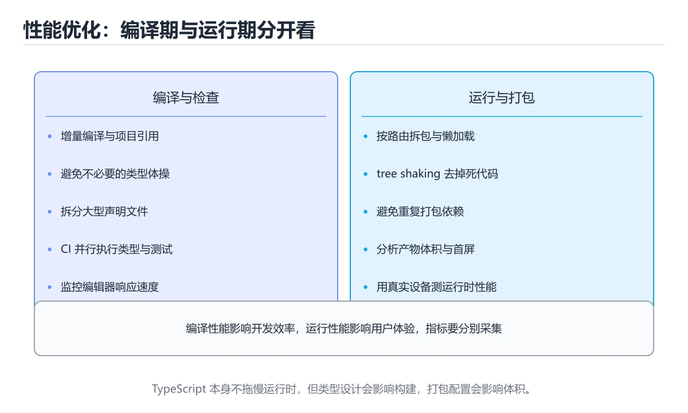
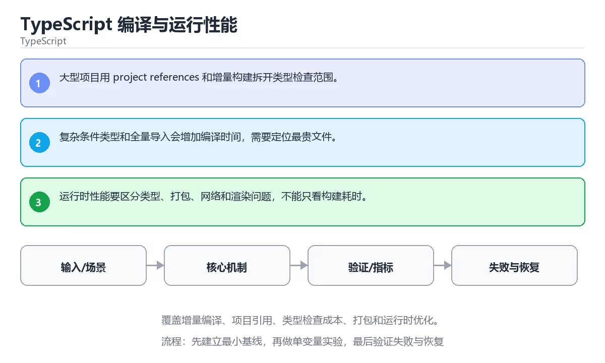

# TypeScript 编译与运行性能

> 内容更新时间：2026-10-06 · 学习阶段：高级 · 预计用时：30 分钟





## 学习目标

- 能用自己的话解释：大型项目用 project references 和增量构建拆开类型检查范围。
- 能用自己的话解释：复杂条件类型和全量导入会增加编译时间，需要定位最贵文件。
- 能用自己的话解释：运行时性能要区分类型、打包、网络和渲染问题，不能只看构建耗时。
- 能把本课知识放回「TypeScript」，并完成练习与测验。

## 前置知识

- 已完成本分类的基础课程，能独立运行 增量编译 的最小示例。
- 本课关键词：增量编译、项目引用、打包、性能。
- 遇到不熟悉的术语先记录问题，完成练习后再回读。

## 核心知识

### 1. 大型项目用 project references 和增量构建拆开类型检查范围。

- 关键做法：基线只保留 项目引用 必需的部分，其余条件一次加一个。
- 验证标准：console 的输出能被他人复现，边界输入有对应用例。

### 2. 复杂条件类型和全量导入会增加编译时间，需要定位最贵文件。

把这条结论放回「TypeScript 编译与运行性能」的完整流程里展开：

- 正文依据：能用自己的话解释：运行时性能要区分类型、打包、网络和渲染问题，不能只看构建耗时。
- 落地检查：把「2. 复杂条件类型和全量导入会增加编译时间，需要定位最贵文件。」改写成一条可执行的核对项，逐条验证输入、超时与失败路径。

### 3. 运行时性能要区分类型、打包、网络和渲染问题，不能只看构建耗时。

把这条结论放回「TypeScript 编译与运行性能」的完整流程里展开：

- 正文依据：关键做法：先用最小示例建立基线，再逐步加入边界、失败和性能条件。
- 落地检查：把「3. 运行时性能要区分类型、打包、网络和渲染问题，不能只看构建耗时。」改写成一条可执行的核对项，逐条验证输入、超时与失败路径。

## 关键流程

```text
输入 → 校验 → 核心处理 → 验证 → 记录指标 → 失败恢复
```

## 实践路径

1. 用一句话复述本课要解决的问题。
2. 跑通正文中的最小示例并记录基线。
3. 只改变一个输入或参数，预测并验证结果。
4. 补一个失败路径，记录错误、恢复和指标。
5. 把结论写成可复现的笔记或测试。

## 常见错误与排查

> 说明：本表由《TypeScript 编译与运行性能》的核心知识整理（2026-10-07），人工复核进度见 docs/content_review_batches.md。

| 易错点 | 容易踩的做法 | 正确结论 |
| --- | --- | --- |
| 只关注编译时间 | 运行时性能被忽略 | 分别评估编译与运行时，并做基准对比 |
| 类型体操写得过于复杂 | 编译变慢且报错难懂 | 在类型表达力和可维护性之间取舍 |
| 不做产物分析 | 体积膨胀无法定位来源 | 分析构建产物并按需加载 |

## 动手练习

1. 合上教程，用 3～5 句话解释TypeScript 编译与运行性能。
2. 从正文选一个例子，改变一个条件并预测结果。
3. 设计一个失败场景，写出止损与恢复步骤。

**验收标准**：留下输入、命令、输出、差异和下一步问题。

## 本课小结

- 本课围绕 增量编译、项目引用、打包、性能 展开，复习时重点核对它们的输入、输出和失败路径。
- 做完本课测验后，把答错且解释不清的 项目引用 相关题目记成验证任务。


## 可运行练习

### 任务 1：先跑通，再解释

```typescript
const values = Array.from({ length: 1000 }, (_, i) => i);
const total = values.reduce((sum, value) => sum + value, 0);
console.log(`total=${total}`);
```

**预期输出**：total=${total}

### 任务 2：只改一个条件

把「TypeScript 编译与运行性能」的最小示例复制一份，只改一个条件再跑一次：

- 改动点：只把 增量编译 的输入换成空值、极值或错误输入，其余保持不变。
- 预测：先写下「TypeScript 编译与运行性能」在改动后的输出或错误信息，再运行。
- 记录：对照改动前后的结果，指出差异出在哪一步。
- 验收：换回原条件能复现原结果，改动只影响增量编译。

### 任务 3：迁移到自己的数据

换一个 项目引用 场景重做一次，确认结论不是只对示例数据成立。

## 故障现场

### 现场 1：只关注编译时间

**症状**：在《TypeScript 编译与运行性能》的复现场景中，运行时性能被忽略。

**根因**：“运行时性能被忽略”只是表层结果。向上追溯会落到“只关注编译时间”这一步，因为它省略了《TypeScript 编译与运行性能》的约束，使实现行为和预期模型发生了偏离。

**修复**：针对《TypeScript 编译与运行性能》的问题，分别评估编译与运行时，并做基准对比。

**验证**：保留《TypeScript 编译与运行性能》里触发“运行时性能被忽略”的输入、版本和日志，按“分别评估编译与运行时，并做基准对比”完成修改后原样重放；只有失败现象消失且相邻场景仍可解释，才保留改动。

### 现场 2：类型体操写得过于复杂

**症状**：在《TypeScript 编译与运行性能》的复现场景中，编译变慢且报错难懂。

**根因**：触发点是把“类型体操写得过于复杂”当成安全做法。它没有满足《TypeScript 编译与运行性能》要求的前提，因此先表现为“编译变慢且报错难懂”；排查时先完整复现这一段，再核对输入、配置与依赖。

**修复**：针对《TypeScript 编译与运行性能》的问题，在类型表达力和可维护性之间取舍。

**验证**：保留《TypeScript 编译与运行性能》里触发“编译变慢且报错难懂”的输入、版本和日志，按“在类型表达力和可维护性之间取舍”完成修改后原样重放；只有失败现象消失且相邻场景仍可解释，才保留改动。

### 现场 3：不做产物分析

**症状**：在《TypeScript 编译与运行性能》的复现场景中，体积膨胀无法定位来源。

**根因**：当出现“不做产物分析”时，执行路径已经绕过了《TypeScript 编译与运行性能》的关键约束，最终以“体积膨胀无法定位来源”暴露出来；修复前必须先确认约束在哪里失效。

**修复**：针对《TypeScript 编译与运行性能》的问题，分析构建产物并按需加载。

**验证**：在《TypeScript 编译与运行性能》中按“分析构建产物并按需加载”调整后，从“不做产物分析”的触发条件重放同一条路径，确认“体积膨胀无法定位来源”不再出现，并补一个相邻边界用例检查没有引入新问题。

## 版本与时效

- 版本提示：增量编译 的行为在最近几个大版本里有过调整，升级「TypeScript 编译与运行性能」前先用 console 复现当前输出，再对照官方发布说明逐条核对。
- 升级「TypeScript 编译与运行性能」涉及的依赖前，先用 console 复现当前行为，再逐项核对版本说明与破坏性变更。

### 升级检查清单

- 先固定当前版本，跑通全部示例与测验，再升级工具链。
- 升级时只动一个依赖版本，用 console 记录构建与运行结果。
- 回归范围锁定 console 的默认行为，并确认弃用警告是否出现在构建输出里。
- 升级完成后记录 增量编译 的新旧版本差异，并据此调整下次复核时间。

## 本课复习清单


离开本课前，逐项确认：

- [ ] 不看解析，能说出「关于「大型项目用 project references 和增量构建拆开类型检查范围。」，下列说法正确的是？」的判断依据。
- [ ] 不看解析，能说出「关于「运行时性能要区分类型、打包、网络和渲染问题，不能只看构建耗时。」，下列说法正确的是？」的判断依据。
- [ ] 不看解析，能说出「「TypeScript 编译与运行性能」的核心学习目标是什么？」的判断依据。
- [ ] 至少运行一次《TypeScript 编译与运行性能》的示例，记录输入、输出和一个边界情况。
- [ ] 把本课最容易混淆的两个概念写成一句话对照。

| 复盘项 | 记录 |
| --- | --- |
| 已经能独立解释的考点 |  |
| 仍然说不清的概念 |  |
| 下一步验证动作 |  |

## 复习与自测

逐节自检：能说清 增量编译 的输入、输出与失败路径才算通过，否则回到原文。

### 核心知识

自检：这一节与相邻主题的边界在哪里？

### 动手练习

自检：如果去掉这一节里的一个前提，结论会怎样变化？

### 最小可运行示例

```typescript
const values = Array.from({ length: 1000 }, (_, i) => i);
const total = values.reduce((sum, value) => sum + value, 0);
console.log(`total=${total}`);
```

自检：把这一节讲给没学过的人，最需要强调哪一点？

### 预期输出

```text
total=499500
```

### 验证步骤

制造一次错误输入，记录错误信息与修复方式。

## 术语速查

| 术语 | 一句话说明 |
| --- | --- |
| `增量编译` | 只重新编译发生变化的文件和受影响依赖，缩短大型项目的反馈时间。 |
| `项目引用` | TypeScript 把多个工程拆分并用引用表达构建依赖，支持增量构建。 |
| `打包` | 按“TypeScript 编译与运行性能”中 增量编译、项目引用、打包 的实践顺序，把四个步骤排成从准备到复盘的合理顺序。 |
| `性能` | 系统在给定负载下表现出的吞吐、延迟、资源占用和稳定性。 |

## 深度拓展与实战

这一节把「TypeScript 编译与运行性能」的判断依据、示例和反例整理成复习步骤。

### 机制拆解

- **1. 大型项目用 project references 和增量构建拆开类型检查范围。**：在「TypeScript 编译与运行性能」里，「1. 大型项目用 project references 和增量构建拆开类型检查范围。」这一步要先写清输入与预期，再记录实际结果和差异；结果不符时回到对应小节核对前提。
- **2. 复杂条件类型和全量导入会增加编译时间，需要定位最贵文件。**：在「TypeScript 编译与运行性能」里，「2. 复杂条件类型和全量导入会增加编译时间，需要定位最贵文件。」这一步要先写清输入与预期，再记录实际结果和差异；结果不符时回到对应小节核对前提。
- **3. 运行时性能要区分类型、打包、网络和渲染问题，不能只看构建耗时。**：在「TypeScript 编译与运行性能」里，「3. 运行时性能要区分类型、打包、网络和渲染问题，不能只看构建耗时。」这一步要先写清输入与预期，再记录实际结果和差异；结果不符时回到对应小节核对前提。
- **考点 1：关于「大型项目用 project references 和增量构建拆开类型检查范围。」，下列说法正确的是？**：先独立作答，再回到本课对应小节核对判断依据；答错时记录是哪一个前提被忽略。
- **考点 2：按“TypeScript 编译与运行性能”中 增量编译、项目引用、打包 的实践顺序，把四个步骤排成从准备到复盘的合理顺序。**：先独立作答，再回到本课对应小节核对判断依据；答错时记录是哪一个前提被忽略。

### 边界条件与常见反例

「TypeScript 编译与运行性能」的边界不只包括最大最小值，还要覆盖空、重复和失败：

| 条件 | 常见反例 | 处理方式 |
| --- | --- | --- |
| 空输入 | 增量编译 没有任何取值 | 先判空，给出明确错误而不是继续执行 |
| 边界值 | 项目引用 取最小或最大 | 用最小值、最大值和越界值各跑一次 |
| 重复执行 | 同一输入被执行两次 | 保证结果可重复，必要时加锁或去重 |
| 失败路径 | 增量编译 相关步骤报错 | 保留原始错误，确认回滚或重试行为 |

### 工程检查表

- [ ] 能否用自己的话说明TypeScript 编译与运行性能解决什么问题，以及它不负责什么？
- [ ] 能否指出 console 最小示例的输入、输出和一条失败路径？
- [ ] 能否解释本课关键词在真实项目中的边界与取舍？
- [ ] 能否说明 项目引用 在新场景下需要补充什么前提？

### 迁移练习

1. 保持正文示例不变，写出它的输入、处理步骤和预期输出。
2. 把 项目引用 换成边界值，说明依据后再实际运行。
3. 结合增量编译、项目引用、打包、性能，写出一个真实项目中的使用场景。
4. 写下一个反例，说明它在什么条件下会使朴素做法失效。

## 考点精讲

### 考点 1：概念判断·增量编译

- **题目**：关于「大型项目用 project references 和增量构建拆开类型检查范围。」，下列说法正确的是？
- **判断依据**：在「TypeScript 编译与运行性能」里，大型项目用 project references 和增量构建拆开类型检查范围。这道题的关键在「TypeScript 编译与运行性能」的增量编译、项目引用、打包：先确认题干“关于大型项目用 project re”问的是哪一步，再排除偷换前提的选项。

### 考点 2：顺序排列·增量编译

- **题目**：按“TypeScript 编译与运行性能”中 增量编译、项目引用、打包 的实践顺序，把四个步骤排成从准备到复盘的合理顺序。
- **判断依据**：在「TypeScript 编译与运行性能」里，在本课的练习里，顺序应当是：先明确 增量编译 的输入、输出与约束 → 写出最小示例并核对 项目引用 的基线结果 → 只改一个变量，记录边界与失败路径的变化 → 固定版本与证据，把本课的结论写成可复现记录。这个顺序把 增量编译 的输入、输出和约束放在最前面，在TypeScript 编译与运行性能里避免概念没对齐就开始调参。第二步用 项目引用 建立可核对的基线，在TypeScript 编译与运行性能里第三步才允许改变一个变量并观察失败路径。

### 考点 3：概念判断·增量编译

- **题目**：关于「运行时性能要区分类型、打包、网络和渲染问题，不能只看构建耗时。」，下列说法正确的是？
- **判断依据**：在「TypeScript 编译与运行性能」里，运行时性能要区分类型、打包、网络和渲染问题，不能只看构建耗时。在「TypeScript 编译与运行性能」里，如果只凭关键词作答，很容易把只要小数据能跑通，大规模和异常情况也一定正确。这道题的关键在「TypeScript 编译与运行性能」的增量编译、项目引用、打包：先确认题干“关于运行时性能要区分类型、打包、网络”问的是哪一步，再排除偷换前提的选项。

### 考点 4：概念判断·增量编译

- **题目**：「TypeScript 编译与运行性能」的核心学习目标是什么？
- **判断依据**：在「TypeScript 编译与运行性能」里，结论应落在「覆盖增量编译、项目引用、类型检查成本、打包和运行时优化」。在「TypeScript 编译与运行性能」里，结论应落在覆盖增量编译、项目引用、类型检查成本、打包和运行时优化。在「TypeScript 编译与运行性能」里，这道题要求区分概念与边界，覆盖增量编译、项目引用、类型检查成本、打包和运行时优化。

### 考点 5：多选辨析·增量编译

- **题目**：以下哪些术语与「TypeScript 编译与运行性能」直接相关？（多选）
- **判断依据**：在「TypeScript 编译与运行性能」里，增量编译；项目引用。在「TypeScript 编译与运行性能」里判断这道题，要把增量编译、项目引用、打包的条件、过程与失败路径逐项对齐，换成“以下哪些术语与TypeScript”这个场景，只有满足前提的结论才成立。回到「TypeScript 编译与运行性能」的正文示例，用“以下哪些术语与TypeScript”走一遍增量编译、项目引用、打包的完整流程，能复现的结论才可以保留。

### 考点 6：排错·增量编译

- **题目**：阅读「TypeScript 编译与运行性能」的代码片段，下面哪项判断是正确的？
- **判断依据**：在「TypeScript 编译与运行性能」里，大型项目用 project references 和增量构建拆开类型检查范围。「TypeScript 编译与运行性能」要求先交代增量编译、项目引用、打包的前提再下结论，所以“大型项目用 project refere”只在题干“阅读TypeScript 编译与运行性能的代码片段”给定的条件下成立。

## English Overview

**Title:** TypeScript Compile and Runtime Performance

**Summary:** Cover incremental builds, project references, type cost, bundling and runtime performance.

**Category:** TypeScript
**Level:** 高级
**Key terms:** 增量编译, 项目引用, 打包, 性能

## 内容元数据

- 内容版本：v2.0
- 最后更新：2026-10-06
- 学习阶段：高级
- 适用环境：TypeScript 5.x / Node.js 22+；本课聚焦 增量编译。
- 内容来源：内置结构化课程与工程实践整理
- 相关主题：增量编译、项目引用、打包、性能
- 质量版本：P0 测验标准 + P1 覆盖扩展 + P2 体验补全

## 最小可运行示例

先用下面的示例确认 增量编译 的基线，再只改一个与 项目引用 相关的值：

```typescript
const values = Array.from({ length: 1000 }, (_, i) => i);
const total = values.reduce((sum, value) => sum + value, 0);
console.log(`total=${total}`);
```

## 预期输出

```text
total=499500
```

## 验证步骤

1. 记录运行环境、命令和真实输出。
2. 修改一个输入，先写预测再运行。
4. 把结论写回本课笔记或测试用例。

## 参考资料与复核

- 最后复核：2026-10-04
- 下次复核：2027-02-24
- 复核范围：版本兼容、API 行为、安全建议与工程实践
- 来源性质：官方文档、标准或权威教材；正文为离线教学重组

| 参考资料 | 本课用途 |
| --- | --- |
| [项目引用](https://www.typescriptlang.org/docs/handbook/project-references.html) | 大型项目拆分与增量构建 |
| [Everyday Types](https://www.typescriptlang.org/docs/handbook/2/everyday-types.html) | 常用类型与收窄 |
| [TypeScript Node 指南](https://nodejs.org/en/learn/typescript) | Node 中的 TypeScript |

> 「TypeScript 编译与运行性能」的链接用于离线阅读后的延伸核对；App 不会自动联网。

## 复习与迁移

复习目标：把「TypeScript 编译与运行性能」的判断标准放回可复现的例子里。先自己作答，再对照依据；如果结论正确但理由不完整，回到正文补足前提。

### 概念复述

- 用一句话说明「TypeScript 编译与运行性能」解决什么问题：覆盖增量编译、项目引用、类型检查成本、打包和运行时优化。
- 写出增量编译、项目引用、打包之间的关系，并各举一个例子。
- 说出本课最容易混淆的两个概念，以及区分它们的判据。

### 测验回顾

1. 关于「大型项目用 project references 和增量构建拆开类型检查范围。」，下列说法正确的是？
   - 依据：在「TypeScript 编译与运行性能」里，大型项目用 project references 和增量构建拆开类型检查范围。这道题的关键在「TypeScript 编译与运行性能」的增量编译、项目引用、打包：先确认题干“关于大型项目用 project re”问的是哪一步，再排除偷换前提的选项。
2. 按“TypeScript 编译与运行性能”中 增量编译、项目引用、打包 的实践顺序，把四个步骤排成从准备到复盘的合理顺序。
   - 依据：在「TypeScript 编译与运行性能」里，在本课的练习里，顺序应当是：先明确 增量编译 的输入、输出与约束 → 写出最小示例并核对 项目引用 的基线结果 → 只改一个变量，记录边界与失败路径的变化 → 固定版本与证据，把本课的结论写成可复现记录。这个顺序把 增量编译 的输入、输出和约束放在最前面，在TypeScript 编译与运行性能里避免概念没对齐就开始调参。第二步用 项目引用 建立可核对的基线，在TypeScript 编译与运行性能里第三步才允许改变一个变量并观察失败路径。
3. 关于「运行时性能要区分类型、打包、网络和渲染问题，不能只看构建耗时。」，下列说法正确的是？
   - 依据：在「TypeScript 编译与运行性能」里，运行时性能要区分类型、打包、网络和渲染问题，不能只看构建耗时。在「TypeScript 编译与运行性能」里，如果只凭关键词作答，很容易把只要小数据能跑通，大规模和异常情况也一定正确。这道题的关键在「TypeScript 编译与运行性能」的增量编译、项目引用、打包：先确认题干“关于运行时性能要区分类型、打包、网络”问的是哪一步，再排除偷换前提的选项。
4. 「TypeScript 编译与运行性能」的核心学习目标是什么？
   - 依据：在「TypeScript 编译与运行性能」里，结论应落在「覆盖增量编译、项目引用、类型检查成本、打包和运行时优化」。在「TypeScript 编译与运行性能」里，结论应落在覆盖增量编译、项目引用、类型检查成本、打包和运行时优化。在「TypeScript 编译与运行性能」里，这道题要求区分概念与边界，覆盖增量编译、项目引用、类型检查成本、打包和运行时优化。
5. 以下哪些术语与「TypeScript 编译与运行性能」直接相关？（多选）
   - 依据：在「TypeScript 编译与运行性能」里，增量编译；项目引用。在「TypeScript 编译与运行性能」里判断这道题，要把增量编译、项目引用、打包的条件、过程与失败路径逐项对齐，换成“以下哪些术语与TypeScript”这个场景，只有满足前提的结论才成立。回到「TypeScript 编译与运行性能」的正文示例，用“以下哪些术语与TypeScript”走一遍增量编译、项目引用、打包的完整流程，能复现的结论才可以保留。
6. 阅读「TypeScript 编译与运行性能」的代码片段，下面哪项判断是正确的？
   - 依据：在「TypeScript 编译与运行性能」里，大型项目用 project references 和增量构建拆开类型检查范围。「TypeScript 编译与运行性能」要求先交代增量编译、项目引用、打包的前提再下结论，所以“大型项目用 project refere”只在题干“阅读TypeScript 编译与运行性能的代码片段”给定的条件下成立。

### 迁移练习

把「TypeScript 编译与运行性能」的结论迁移到相邻主题，每次迁移都写清预测与证据：

1. 换输入：用增量编译处理一组你自己的数据，对比教材示例的结果差异。
2. 换失败条件：制造一个项目引用相关的错误，说明如何从错误信息定位根因。
3. 换规模：把数据量或并发度提高一个数量级，说明「TypeScript 编译与运行性能」的结论是否仍成立。
