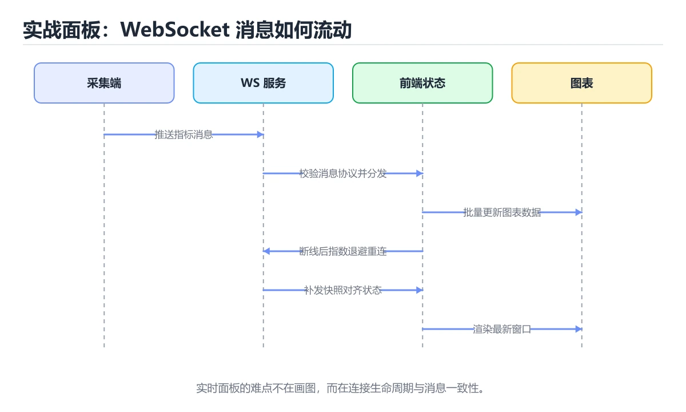
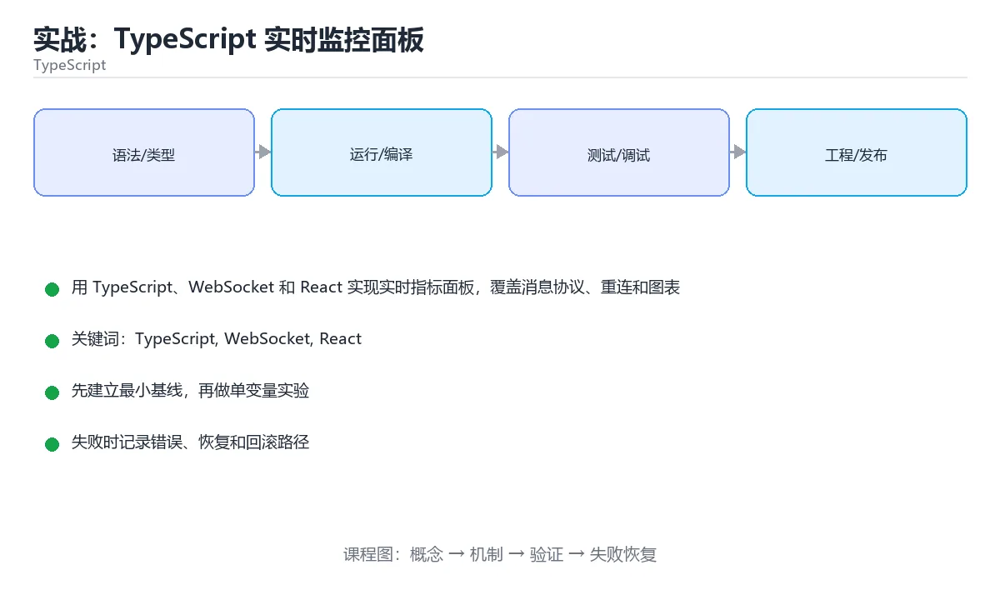

# 实战：TypeScript 实时监控面板





> 内容更新时间：2026-10-06 · 学习阶段：高级 · 预计用时：60 分钟

## 本节知识框架

**课程定位**：所属分类 `typescript`（TypeScript），课程主题 `实战：TypeScript 实时监控面板`，学习阶段 高级，建议用时 70 分钟。

本课主线：用 TypeScript、WebSocket 和 React 实现实时指标面板，覆盖消息协议、重连和图表更新。

**学完本课应当能够**
- 说清 `TypeScript` 与 `实时` 的含义与区别，并各举一个正例和一个反例。
- 用本课示例验证 `消息协议` 的行为，记录输入、输出与失败条件。
- 遇到「断线后不做重连与补偿」这类问题时，能说出触发条件与修复顺序。

### 从概念到验证的学习链条

1. `TypeScript`：先掌握 JavaScript 的超集：静态类型只在开发期检查，编译时被擦除，运行的是普通 JavaScript，再用它解释 `实时` 为什么会出现。
2. `实时`：先掌握 用 TypeScript、WebSocket 和 React 实现实时指标面板，覆盖消息协议、重连和图表更新，再用它解释 `消息协议` 为什么会出现。
3. `消息协议`：先掌握 前后端约定的消息类型与字段，带版本号并做运行时校验之后再进界面，再用它解释 `窗口裁剪` 为什么会出现。
4. `窗口裁剪`：先掌握 图表只保留最近若干数据点，避免长时间运行后内存与渲染开销无限增长，再用它解释 `可观测性` 为什么会出现。
5. `可观测性`：先掌握 由日志、指标与链路追踪组成，能在不重启、不改代码的前提下问出新问题，再用它解释 本课示例的观察结果 为什么会出现。

**先修与衔接**：本课是「TypeScript」分类的第 19 课。先修内容：《实战：TypeScript 类型安全 CLI》。《实战：TypeScript 类型安全 CLI》里的 `TypeScript`、`Zod` 是本课的前提。相关或后续课程：《TypeScript 类型级编程》。

### 完成判据

- **定义关**：不看正文也能说明 `TypeScript` 是 JavaScript 的超集：静态类型只在开发期检查，编译时被擦除，运行的是普通 JavaScript，并指出一个反例。
- **机制关**：能按“输入 → 转换 → 输出 → 验证”复述 `实战：TypeScript 实时监控面板`，而不是只背结论。
- **示例关**：能运行或推演 `实战：TypeScript 实时监控面板` 的 `text` 示例，并说明一个真实出现的标识符或字面量。
- **证据关**：能从 `实战：TypeScript 实时监控面板` 的示例写出一个输入、处理、输出三元组，并说明它支持或反驳了本课的哪一条结论。
- **排错关**：能复现 断线后不做重连与补偿，记录现象并按 重连后拉取增量并按消息标识去重 修复。
- **迁移关**：能把 `TypeScript`、`WebSocket`、`React`、`实时` 放进一个与 `实战：TypeScript 实时监控面板` 不同的项目场景，并保持输入与验证条件可追踪。
- **复盘关**：学完 `实战：TypeScript 实时监控面板` 后，用一句话写下仍然不确定的结论，并列出下一次验证需要的输入、环境和成功判据。

### 复习清单

- [ ] 能不看正文复述本课核心术语，并指出一个边界或反例。
- [ ] 能运行或推演本课示例，记录输入、输出与失败现象。
- [ ] 能完成一次自测，并把错题对照错误表定位原因。

## 核心概念定义

| 术语 | 操作性定义 | 常见边界与风险 |
| --- | --- | --- |
| TypeScript | JavaScript 的超集：静态类型只在开发期检查，编译时被擦除，运行的是普通 JavaScript。 | 静态检查只在编译期成立，运行期输入仍需校验。 |
| 实时 | 用 TypeScript、WebSocket 和 React 实现实时指标面板，覆盖消息协议、重连和图表更新。 | 网络延迟、超时与版本协商会改变行为，只在真实链路或多版本客户端上验证才算数。 |
| 消息协议 | 前后端约定的消息类型与字段，带版本号并做运行时校验之后再进界面。 | 不同版本与依赖组合的行为可能不同，升级或换环境前要按官方变更说明重新验证。 |
| 窗口裁剪 | 图表只保留最近若干数据点，避免长时间运行后内存与渲染开销无限增长。 | 越界、悬垂引用与释放顺序会破坏结论，必须在边界输入下复验。 |
| 可观测性 | 由日志、指标与链路追踪组成，能在不重启、不改代码的前提下问出新问题 | 只在「由日志、指标与链路追踪组成，能在不重启、不改代码的前提下问出新问题」这一前提下成立，换输入或换环境要重新验证。 |

## 原理与运行机制

### 机制总览

**教材衔接：技术栈**

- TypeScript 5
- React
- WebSocket
- Zod
- Vitest
- Recharts

**教材衔接：架构与数据流**

- 查询 WebSocket 时限定字段与分页范围，把全表扫描留作最后手段。
- 写入 WebSocket 前先定义事务范围，跨服务时改用可补偿流程。
- 外部调用要设置超时、重试上限和降级策略。
- 每个关键阶段都要留下日志、指标或测试证据。

**教材衔接：功能范围**

- [ ] 订阅指标流
- [ ] 显示实时曲线
- [ ] 断线重连和状态提示
- [ ] 按时间窗口聚合和丢弃过期数据

**教材衔接：实施步骤**

### 步骤 1：定义消息类型和 Zod schema

- 把 WebSocket 这一步的依赖与交付物写成两行清单，再开始实现。
- 为 WebSocket 补一个最小用例，明确通过标准再扩展规模。
- 出错时先记录 WebSocket 的错误信息与回滚结果，再决定是否重试。
- 证据留存：保留命令、输出、日志或截图，方便评审与复盘。

### 步骤 2：封装 WebSocket 客户端

- 定位：这一节说明步骤 2：封装 WebSocket 客户端在「实战：TypeScript 实时监控面板」知识体系里的位置。
- 要点：本课涉及：TypeScript、WebSocket、React、实时、消息协议。
- 自检：能否用一个最小例子解释步骤 2：封装 WebSocket 客户端？

### 步骤 3：实现重连和心跳

- 定位：这一节说明步骤 3：实现重连和心跳在「实战：TypeScript 实时监控面板」知识体系里的位置。
- 要点：运维需要一个实时面板展示服务 QPS、错误率和延迟；后端持续推送指标，前端要处理乱序、断线和数据窗口滚动。
- 自检：能否用一个最小例子解释步骤 3：实现重连和心跳？

### 步骤 4：把消息转换为图表数据

- 定位：这一节说明步骤 4：把消息转换为图表数据在「实战：TypeScript 实时监控面板」知识体系里的位置。
- 要点：一句话摘要：用 TypeScript、WebSocket 和 React 实现实时指标面板，覆盖消息协议、重连和图表更新。
- 自检：能否用一个最小例子解释步骤 4：把消息转换为图表数据？

### 步骤 5：处理窗口裁剪和空状态

- 定位：这一节说明步骤 5：处理窗口裁剪和空状态在「实战：TypeScript 实时监控面板」知识体系里的位置。
- 检查点：用空值、极值和依赖失败各跑一次《实战：TypeScript 实时监控面板》，确认边界行为与正文一致。
- 自检：能否用一个最小例子解释步骤 5：处理窗口裁剪和空状态？

### 步骤 6：补组件与协议测试

- 定位：这一节说明步骤 6：补组件与协议测试在「实战：TypeScript 实时监控面板」知识体系里的位置。
- 检查点：用空值、极值和依赖失败各跑一次《实战：TypeScript 实时监控面板》，确认边界行为与正文一致。
- 自检：能否用一个最小例子解释步骤 6：补组件与协议测试？

**教材衔接：建议目录结构**

**教材衔接：质量门禁**

- [ ] 格式化和静态检查通过，不遗留明显警告。
- [ ] 测试分层：核心规则用单元测试，WebSocket 的边界用集成测试。
- [ ] 错误响应不泄露堆栈、SQL 和密钥。
- [ ] 配置来自环境变量或配置文件，不硬编码敏感信息。
- [ ] README 写清启动、测试、配置和回滚步骤。

**教材衔接：安全、成本与可观测性**

- 为 WebSocket 单独申请最小权限，并记录权限变更。
- 所有进入 TypeScript 的外部输入都要校验、限长并转义，错误信息不能泄露内部路径。
- 密钥通过环境变量或密钥管理服务注入，并记录轮换方式。
- 为 TypeScript 涉及的连接、线程或协程、队列与网络请求设置上限，避免资源耗尽。
- 为 discriminatedUnion 建立四个指标：吞吐、错误率、尾延迟和资源占用。
- 为 discriminatedUnion 的失败留下可检索的日志字段，能按请求定位到具体环节。

**教材衔接：扩展任务**

- 加入历史查询和多指标对比
- 支持告警阈值
- 用 Web Worker 处理大流量数据

**教材衔接：实施记录与复盘**

每完成一步，记录以下内容：

1. 本步的输入、命令和输出是什么？
2. 遇到的最小失败是什么，如何定位和修复？
3. 哪个假设被验证或推翻？
4. 下一步的风险是什么，如何回滚？
5. 把 discriminatedUnion 的负载提高一个数量级，预期哪一项指标先触顶？

**教材衔接：完成标准**

- [ ] 能从干净环境按 README 启动项目。
- [ ] 自动化测试覆盖 WebSocket 的核心规则，并验证一次错误处理。
- [ ] 能演示一次错误、一次恢复和一次回滚。
- [ ] 有一份资源或性能基线，能说明瓶颈在哪里。
- [ ] 能说清一个尚未解决的问题和下一步验证方法。

**教材衔接：版本与时效**

- 版本提示：TypeScript 的行为在最近几个大版本里有过调整，升级「实战：TypeScript 实时监控面板」前先用 discriminatedUnion 复现当前输出，再对照官方发布说明逐条核对。
- 升级前先用 discriminatedUnion 建立基线：记录版本、命令和输出，升级后只比较这些可观察量。

### 升级检查清单

- 先固定当前版本，跑通全部示例与测验，再升级工具链。
- 一次只改一个版本条件，把 TypeScript 相关的差异单独记成一条结论。
- 先回归 TypeScript 与 WebSocket 的默认行为和错误信息，再扩大测试范围。
- 升级完成后记录 TypeScript 的新旧版本差异，并据此调整下次复核时间。

**教材衔接：交付评审：评分表、决策记录与证据链**


### 四、「实战：TypeScript 实时监控面板」的验收指标

| 指标 | 目标值 | 测量方式 | 不达标时的动作 |
| --- | --- | --- | --- |
| | 延迟 | 记录 P50/P95/P99 | 用固定数据集逐步增加并发 | P99 持续上升或超时率增加 | | 用本课正文给出的阈值，没有就写实测基线 | 固定环境重复三次取中位数 | 回到对应小节定位，先修原因再重测 |
| | 存储 | 记录数据增长与索引大小 | 导入 10 倍数据并观察查询 | 磁盘、连接或锁等待成为瓶颈 | | 用本课正文给出的阈值，没有就写实测基线 | 固定环境重复三次取中位数 | 回到对应小节定位，先修原因再重测 |

### 五、评审记录模板

| 记录项 | 填写要求 |
| --- | --- |
| 项目标识 | `ts_project_websocket_dashboard` |
| 本次范围 | 说明这一轮交付了「实战：TypeScript 实时监控面板」的哪些部分 |
| 未完成项 | 列出与 TypeScript 相关但本轮未做的内容 |
| 证据位置 | 指向 evidence/ 目录下的具体文件 |
| 风险与回滚 | 写清剩余风险、回滚步骤和验证方式 |
| 结论 | 通过 / 有条件通过 / 不通过，三者选一 |

### 机制拆解：每一步的输入、动作与输出

#### 1. `TypeScript`
- 输入：`TypeScript`；本步把 JavaScript 的超集：静态类型只在开发期检查，编译时被擦除，运行的是普通 JavaScript 当作判断规则。
- 动作：围绕 `TypeScript` 保留中间状态，并记录它与 `实时` 的对应关系。
- 输出：`实时`，它可以被下一段代码、测试或记录继续使用。
- `TypeScript` 的失败条件：静态检查只在编译期成立，运行期输入仍需校验。

#### 2. `实时`
- 输入：`TypeScript`；本步把 用 TypeScript、WebSocket 和 React 实现实时指标面板，覆盖消息协议、重连和图表更新 当作判断规则。
- 动作：围绕 `实时` 保留中间状态，并记录它与 `消息协议` 的对应关系。
- 输出：`消息协议`，它可以被下一段代码、测试或记录继续使用。
- `实时` 的失败条件：网络延迟、超时与版本协商会改变行为，只在真实链路或多版本客户端上验证才算数。

#### 3. `消息协议`
- 输入：`实时`；本步把 前后端约定的消息类型与字段，带版本号并做运行时校验之后再进界面 当作判断规则。
- 动作：围绕 `消息协议` 保留中间状态，并记录它与 `窗口裁剪` 的对应关系。
- 输出：`窗口裁剪`，它可以被下一段代码、测试或记录继续使用。
- `消息协议` 的失败条件：不同版本与依赖组合的行为可能不同，升级或换环境前要按官方变更说明重新验证。

#### 4. `窗口裁剪`
- 输入：`消息协议`；本步把 图表只保留最近若干数据点，避免长时间运行后内存与渲染开销无限增长 当作判断规则。
- 动作：围绕 `窗口裁剪` 保留中间状态，并记录它与 `可观测性` 的对应关系。
- 输出：`可观测性`，它可以被下一段代码、测试或记录继续使用。
- `窗口裁剪` 的失败条件：越界、悬垂引用与释放顺序会破坏结论，必须在边界输入下复验。

#### 5. `可观测性`
- 输入：`窗口裁剪`；本步把 由日志、指标与链路追踪组成，能在不重启、不改代码的前提下问出新问题 当作判断规则。
- 动作：围绕 `可观测性` 保留中间状态，并记录它与 `本课示例的最终结果` 的对应关系。
- 输出：`本课示例的最终结果`，它可以被下一段代码、测试或记录继续使用。
- `可观测性` 的失败条件：只在「由日志、指标与链路追踪组成，能在不重启、不改代码的前提下问出新问题」这一前提下成立，换输入或换环境要重新验证。

### 复现实验记录

- 环境：`实战：TypeScript 实时监控面板` 使用 `text` 示例，固定 `TypeScript`、`WebSocket`、`React`、`实时` 作为第一组条件。
- 首轮输入：从示例中的第一个输入开始，预测 `TypeScript` 会怎样变化。
- 基线观察：记录命令、输入、输出和错误原文，不用截图代替可复制的文本。
- 单变量修改：只改变 `TypeScript`，观察 `可观测性` 是否仍满足定义。
- 失败注入：复现 断线后不做重连与补偿，确认现象是 掉线期间的数据永久丢失。
- 记录结论：把“修改前、修改后、预期变化、实际变化”写成四列表，这样复盘 `实战：TypeScript 实时监控面板` 时才能区分概念错误与实现错误。

## 典型应用场景

**教材衔接：项目背景**

运维需要一个实时面板展示服务 QPS、错误率和延迟；后端持续推送指标，前端要处理乱序、断线和数据窗口滚动。

一句话摘要：用 TypeScript、WebSocket 和 React 实现实时指标面板，覆盖消息协议、重连和图表更新。

**教材衔接：项目专属规格：实战：TypeScript 实时监控面板**

### 核心场景

用 TypeScript、WebSocket 和 React 实现实时指标面板，覆盖消息协议、重连和图表更新。 项目目标是把「TypeScript、WebSocket、React、实时、消息协议」落实为可运行、可测试、可回滚的交付物。


### 验收场景

1. 正常路径：最小输入得到预期输出，并留下日志与指标。
2. 边界路径：TypeScript 的空值、最大值、重复数据和超长内容都得到明确处理。
3. 失败路径：依赖超时或不可用时能快速失败、重试或降级。
4. 幂等路径：同一请求执行两次不会产生重复副作用。
5. 回滚路径：撤掉 discriminatedUnion 的变更后，数据与资源都回到变更前的状态。

**教材衔接：项目交付物**

### 建议仓库结构

```text
src/
  domain/
  adapters/
tests/
tsconfig.json
package.json
```


### 验收数据

```json
{
  "project": "ts_project_websocket_dashboard",
  "scenario": "TypeScript的正常路径",
  "input": {"case": "normal", "value": "discriminatedUnion"},
  "expected": {"ok": true, "checks": ["TypeScript可复现", "WebSocket有记录"]},
  "failure_case": {"case": "WebSocket越界或缺失", "error": "validation_error"},
  "idempotency_key": "ts_project_websocket_dashboard-001"
}
```

### 复盘模板

- **断线后不做重连与补偿**：典型现象是掉线期间的数据永久丢失；正确做法是重连后拉取增量并按消息标识去重。
- **消息不做类型校验**：典型现象是非法数据让界面崩溃；正确做法是在接收边界校验消息结构。
- **每条消息都触发渲染**：典型现象是高频更新导致页面卡顿；正确做法是合并更新并限制刷新频率。

### 最小验证场景

- 准备：保留 `text` 示例的原始输入，先记录 `实战：TypeScript 实时监控面板` 的基线输出和完整运行命令。
- 判定：新结果与 `实战：TypeScript 实时监控面板` 的基线不同不等于错误；只有当差异破坏了 `TypeScript` 的定义或错误表中的约束，才判定为失败。

### 选择与边界

- 使用 `TypeScript` 时，先满足它的定义：JavaScript 的超集：静态类型只在开发期检查，编译时被擦除，运行的是普通 JavaScript；静态检查只在编译期成立，运行期输入仍需校验。
- 使用 `实时` 时，先满足它的定义：用 TypeScript、WebSocket 和 React 实现实时指标面板，覆盖消息协议、重连和图表更新；网络延迟、超时与版本协商会改变行为，只在真实链路或多版本客户端上验证才算数。
- 使用 `消息协议` 时，先满足它的定义：前后端约定的消息类型与字段，带版本号并做运行时校验之后再进界面；不同版本与依赖组合的行为可能不同，升级或换环境前要按官方变更说明重新验证。
- 使用 `窗口裁剪` 时，先满足它的定义：图表只保留最近若干数据点，避免长时间运行后内存与渲染开销无限增长；越界、悬垂引用与释放顺序会破坏结论，必须在边界输入下复验。
- 使用 `可观测性` 时，先满足它的定义：由日志、指标与链路追踪组成，能在不重启、不改代码的前提下问出新问题；只在「由日志、指标与链路追踪组成，能在不重启、不改代码的前提下问出新问题」这一前提下成立，换输入或换环境要重新验证。

## 代码/协议/SQL 示例

### 最小可验证示例

**教材衔接：示例数据与边界**

**教材衔接：关键代码**

```typescript
const Message = z.discriminatedUnion('type', [
  z.object({ type: z.literal('metric'), ts: z.number(), qps: z.number(), errorRate: z.number() }),
  z.object({ type: z.literal('heartbeat'), ts: z.number() }),
]);

export type MetricMessage = Extract<z.infer<typeof Message>, { type: 'metric' }>;
```

**教材衔接：验证命令与预期输出**

**教材衔接：测试与验收**

- 非法消息被丢弃并计数
- 重连后图表不重复追加旧数据
- 窗口只保留最近 N 个点


### 示例精读：先找证据，再改一个条件

- 在 `实战：TypeScript 实时监控面板` 中与 `TypeScript` 对照：示例必须能支持 JavaScript 的超集：静态类型只在开发期检查，编译时被擦除，运行的是普通 JavaScript，否则说明这一段还缺少实现或验证步骤。
- 在 `实战：TypeScript 实时监控面板` 中与 `实时` 对照：示例必须能支持 用 TypeScript、WebSocket 和 React 实现实时指标面板，覆盖消息协议、重连和图表更新，否则说明这一段还缺少实现或验证步骤。
- 在 `实战：TypeScript 实时监控面板` 中与 `消息协议` 对照：示例必须能支持 前后端约定的消息类型与字段，带版本号并做运行时校验之后再进界面，否则说明这一段还缺少实现或验证步骤。
- 在 `实战：TypeScript 实时监控面板` 中与 `窗口裁剪` 对照：示例必须能支持 图表只保留最近若干数据点，避免长时间运行后内存与渲染开销无限增长，否则说明这一段还缺少实现或验证步骤。
- `实战：TypeScript 实时监控面板` 的示例没有抽取到函数调用或字面量；按行记录输入、控制流和输出，避免只背代码外形。

## 时间/空间复杂度或性能分析

**性能关注点（实战：TypeScript 实时监控面板）**：编译期类型检查与运行期代码是两套开销：分别记录构建时间与运行时耗时。

**本课特有开销（实战：TypeScript 实时监控面板 · TypeScript）**：并发度提高后要观察是否出现拐点：延迟上升而吞吐不增，说明瓶颈已转移。

**测量方法**：以 `实战：TypeScript 实时监控面板` 的 `TypeScript` 场景为对象，固定输入跑一遍记录基线，再把规模或并发度提高一个数量级复测；两次结果的差值与波动范围才是结论依据。

### 需要控制的变量与记录项

- `实战：TypeScript 实时监控面板` 的 `TypeScript`：固定它的版本、输入范围和资源上限，分别记录速度、内存与失败率的变化。
- `实战：TypeScript 实时监控面板` 的 `WebSocket`：固定它的版本、输入范围和资源上限，分别记录速度、内存与失败率的变化。
- `实战：TypeScript 实时监控面板` 的 `React`：固定它的版本、输入范围和资源上限，分别记录速度、内存与失败率的变化。
- `实战：TypeScript 实时监控面板` 的 `实时`：固定它的版本、输入范围和资源上限，分别记录速度、内存与失败率的变化。
- `实战：TypeScript 实时监控面板` 的 `消息协议`：固定它的版本、输入范围和资源上限，分别记录速度、内存与失败率的变化。
- `实战：TypeScript 实时监控面板` 中 `TypeScript` 的边界：静态检查只在编译期成立，运行期输入仍需校验。达到边界时不要外推，必须重新测量。
- `实战：TypeScript 实时监控面板` 中 `实时` 的边界：网络延迟、超时与版本协商会改变行为，只在真实链路或多版本客户端上验证才算数。达到边界时不要外推，必须重新测量。
- `实战：TypeScript 实时监控面板` 中 `消息协议` 的边界：不同版本与依赖组合的行为可能不同，升级或换环境前要按官方变更说明重新验证。达到边界时不要外推，必须重新测量。
- `实战：TypeScript 实时监控面板` 中 `窗口裁剪` 的边界：越界、悬垂引用与释放顺序会破坏结论，必须在边界输入下复验。达到边界时不要外推，必须重新测量。
- `实战：TypeScript 实时监控面板` 中 `可观测性` 的边界：只在「由日志、指标与链路追踪组成，能在不重启、不改代码的前提下问出新问题」这一前提下成立，换输入或换环境要重新验证。达到边界时不要外推，必须重新测量。

## 常见误区与易错点

| 容易写错的做法 | 实际现象 | 原因与正确做法 |
| --- | --- | --- |
| 断线后不做重连与补偿 | 掉线期间的数据永久丢失。 | 重连后拉取增量并按消息标识去重。 |
| 消息不做类型校验 | 非法数据让界面崩溃。 | 在接收边界校验消息结构。 |
| 每条消息都触发渲染 | 高频更新导致页面卡顿。 | 合并更新并限制刷新频率。 |

### 现场 1：断线后不做重连与补偿

**症状**：掉线期间的数据永久丢失。

**根因与修复**：重连后拉取增量并按消息标识去重。

**自检**：在本课示例里复现「断线后不做重连与补偿」，改成重连后拉取增量并按消息标识去重后重跑；如果症状消失且失败路径按预期变化，说明定位正确。

### 现场 2：消息不做类型校验

**症状**：非法数据让界面崩溃。

**根因与修复**：在接收边界校验消息结构。

**自检**：在本课示例里复现「消息不做类型校验」，改成在接收边界校验消息结构后重跑；如果症状消失且失败路径按预期变化，说明定位正确。

### 现场 3：每条消息都触发渲染

**症状**：高频更新导致页面卡顿。

**根因与修复**：合并更新并限制刷新频率。

**自检**：在本课示例里复现「每条消息都触发渲染」，改成合并更新并限制刷新频率后重跑；如果症状消失且失败路径按预期变化，说明定位正确。

## 与其他知识点的关系

**教材衔接：复习与迁移**

### 概念复述

- 用一句话说明「实战：TypeScript 实时监控面板」解决什么问题：用 TypeScript、WebSocket 和 React 实现实时指标面板，覆盖消息协议、重连和图表更新。
- 写出TypeScript、WebSocket、React之间的关系，并各举一个例子。
- 说出本课最容易混淆的两个概念，以及区分它们的判据。

### 正文逐节复核

- **项目背景**：运维需要一个实时面板展示服务 QPS、错误率和延迟；后端持续推送指标，前端要处理乱序、断线和数据窗口滚动。
- **项目专属规格：实战：TypeScript 实时监控面板**：用 TypeScript、WebSocket 和 React 实现实时指标面板，覆盖消息协议、重连和图表更新。


### 迁移练习

- **先修**：`实战：TypeScript 类型安全 CLI`。本课默认这些内容已经掌握。
- **相关或后续**：`TypeScript 类型级编程`。本课术语会在这些课程里继续使用。
- **术语归属**：`TypeScript`、`实时`、`消息协议` 的定义以本课「核心概念定义」为准，换到其他课程时先确认定义是否被改写。
- 同一分类的《TypeScript 第一个类型》也涉及 `TypeScript`；两课衔接时先确认这个术语的定义是否一致。
- 同一分类的《TypeScript 基础类型》也涉及 `TypeScript`；两课衔接时先确认这个术语的定义是否一致。

### 先修与后续术语接口

- `实战：TypeScript 类型安全 CLI`：共享术语 `TypeScript`，共同关键词 `TypeScript`。
- `TypeScript 类型级编程`：两者通过本分类的学习顺序衔接，阅读时重点比较各自的输入与失败条件。

### 容易混淆的相邻概念

- `TypeScript` 与 `实时`：前者强调 JavaScript 的超集：静态类型只在开发期检查，编译时被擦除，运行的是普通 JavaScript；后者强调 用 TypeScript、WebSocket 和 React 实现实时指标面板，覆盖消息协议、重连和图表更新。判断时分别检查两条定义的适用范围，不要只看名称相似就互换。
- `实时` 与 `消息协议`：前者强调 用 TypeScript、WebSocket 和 React 实现实时指标面板，覆盖消息协议、重连和图表更新；后者强调 前后端约定的消息类型与字段，带版本号并做运行时校验之后再进界面。判断时分别检查两条定义的适用范围，不要只看名称相似就互换。
- `消息协议` 与 `窗口裁剪`：前者强调 前后端约定的消息类型与字段，带版本号并做运行时校验之后再进界面；后者强调 图表只保留最近若干数据点，避免长时间运行后内存与渲染开销无限增长。判断时分别检查两条定义的适用范围，不要只看名称相似就互换。
- `窗口裁剪` 与 `可观测性`：前者强调 图表只保留最近若干数据点，避免长时间运行后内存与渲染开销无限增长；后者强调 由日志、指标与链路追踪组成，能在不重启、不改代码的前提下问出新问题。判断时分别检查两条定义的适用范围，不要只看名称相似就互换。

## 自测题与参考答案

> 先独立作答，再对照参考答案；答案都能在本课正文、术语表或错误表里找到依据。

### 自测 1（概念复述）

不看正文，写出 `TypeScript` 的操作性定义，并说明它与 `实时` 的区别。

**参考答案**：JavaScript 的超集：静态类型只在开发期检查，编译时被擦除，运行的是普通 JavaScript。

`实时` 的定位是：用 TypeScript、WebSocket 和 React 实现实时指标面板，覆盖消息协议、重连和图表更新；两者的差别要从适用对象与失败模式上说明。

### 自测 2（排错）

本课错误表记录了「断线后不做重连与补偿」这类做法。请写出它会出现的现象、根因，以及修复顺序。

**参考答案**：现象是掉线期间的数据永久丢失；正确做法是重连后拉取增量并按消息标识去重。修复时先复现现象并保留证据，再改动一处假设重跑，确认现象消失。

### 自测 3（动手验证）

运行本课的 `text` 示例，改动其中一个输入后重新运行，记录输出与错误信息。

**参考答案**：正常输入下 `text` 示例应当复现正文给出的结果；改动输入后，如果结果改变或报错，先核对它是否满足 `实战：TypeScript 实时监控面板` 中`TypeScript` 的适用范围，再检查错误表里是否有同类现象。

### 自测 4（代码阅读）

阅读本课开头的 `text` 示例，说明它体现了`TypeScript` 的哪一条性质，并指出改动哪个输入会让这条性质不再成立。

**参考答案**：`TypeScript` 的定义是 JavaScript 的超集：静态类型只在开发期检查，编译时被擦除，运行的是普通 JavaScript，示例正是在实现这条定义。改动与 `TypeScript` 有关的一个输入后，如果结果不再符合 `实战：TypeScript 实时监控面板` 的正文描述，就说明该性质只在当前前提成立。

### 自测 5（迁移）

把 `实战：TypeScript 实时监控面板` 的方法迁移到自己的项目：围绕 `TypeScript` 写出一个与错误表同类的风险点，并说明触发条件和检验方式。

**参考答案**：例如「每条消息都触发渲染」，它会导致高频更新导致页面卡顿；检验方式是按合并更新并限制刷新频率改一处再复现，确认现象消失且没有引入新的失败分支。

### 自测 6（对比）

用一个表格对比 `TypeScript` 与 `实时`：各写一行适用场景、一行失败表现。

**参考答案**：`TypeScript` 的定义是JavaScript 的超集：静态类型只在开发期检查，编译时被擦除，运行的是普通 JavaScript；`实时` 的定义是用 TypeScript、WebSocket 和 React 实现实时指标面板，覆盖消息协议、重连和图表更新。两者的失败表现分别对应本课错误表里与本术语相关的行。

### 自测 7（排错顺序）

面对「断线后不做重连与补偿」引发的问题，请把“复现 掉线期间的数据永久丢失 → 保留证据 → 重连后拉取增量并按消息标识去重 → 回归验证”四步写成可执行的检查清单。

**参考答案**：第一步按掉线期间的数据永久丢失复现；第二步记录输入、版本与完整报错；第三步按重连后拉取增量并按消息标识去重只改一处；第四步重跑并确认失败路径也按预期变化。

### 自测 8（边界判断）

针对 `可观测性`，分别写出“可以使用”的条件和“结论不再成立”的条件。

**参考答案**：只在「由日志、指标与链路追踪组成，能在不重启、不改代码的前提下问出新问题」这一前提下成立，换输入或换环境要重新验证。 同时要把 `可观测性` 的定义 由日志、指标与链路追踪组成，能在不重启、不改代码的前提下问出新问题 与实际输入逐项对照。

### 自测 9（机制重建）

不看正文，按输入、转换、输出、验证四段重建 `TypeScript` → `实时` → `消息协议` → `窗口裁剪` 的作用链。

**参考答案**：起点是 `TypeScript` 的定义 JavaScript 的超集：静态类型只在开发期检查，编译时被擦除，运行的是普通 JavaScript；中间每一步都保留可观察状态；终点由 `可观测性` 检查，失败时回到错误表定位第一个偏离定义的步骤。

### 自测 10（综合排错）

在 `实战：TypeScript 实时监控面板` 中，现象是 高频更新导致页面卡顿。请围绕 每条消息都触发渲染 写出最小复现、关键证据、修复动作和回归验证，并说明为什么不能只凭一次运行下结论。

**参考答案**：先复现 每条消息都触发渲染，记录输入与完整错误；再按 合并更新并限制刷新频率 只改一处。回归时同时跑正常路径和边界路径，只有两次结果都可解释，才把修复视为完成。

### 自测 11（一分钟复述）

用每分钟约 200 字的速度复述 `实战：TypeScript 实时监控面板`：先给主问题，再按顺序说出 `TypeScript`、`实时`、`消息协议`、`窗口裁剪`，最后给一个失败案例。

**自评标准**：主问题必须对应 用 TypeScript、WebSocket 和 React 实现实时指标面板，覆盖消息协议、重连和图表更新；每个术语都要能接上一句定义或边界；失败案例必须写成可观察现象，不能用“可能有风险”代替证据。

## 术语速查

| 术语 | 一句话说明 |
| --- | --- |
| `TypeScript` | JavaScript 的超集：静态类型只在开发期检查，编译时被擦除，运行的是普通 JavaScript。 |
| `实时` | 用 TypeScript、WebSocket 和 React 实现实时指标面板，覆盖消息协议、重连和图表更新。 |
| `消息协议` | 前后端约定的消息类型与字段，带版本号并做运行时校验之后再进界面。 |
| `窗口裁剪` | 图表只保留最近若干数据点，避免长时间运行后内存与渲染开销无限增长。 |
| `可观测性` | 由日志、指标与链路追踪组成，能在不重启、不改代码的前提下问出新问题。 |

**术语关系**：`TypeScript`（JavaScript 的超集：静态类型只在开发期检查） → `实时`（用 TypeScript、WebSocket 和 React 实现实时指标面板） → `消息协议`（前后端约定的消息类型与字段） → `窗口裁剪`（图表只保留最近若干数据点）。

## 考点精讲

`实战：TypeScript 实时监控面板` 的题库有 6 道题，下面逐题给出题干、正确项与判断依据：先自己作答，再核对正确项，最后回到正文对应小节复核。

### 考点 1：第 1 题

- **题目**：这段 `typescript` 代码对应 `实战：TypeScript 实时监控面板` 的 `TypeScript`。课程要解决的是用 TypeScript、WebSocket 和 React 实现实时指标面板，覆盖消息协议、重连和图表更新。关于代码内容，哪一项说法准确？
- **正确项**：这段示例用于说明本课术语 `消息协议` 的行为
- **判断依据**：这道题落在术语 `TypeScript` 上：JavaScript 的超集：静态类型只在开发期检查，编译时被擦除，运行的是普通 JavaScript。复习时把 `TypeScript` 的定义、适用边界和一个反例一起说清楚，再回到「核心概念定义」核对原文。

### 考点 2：第 2 题

- **题目**：按“实战：TypeScript 实时监控面板”中 TypeScript、WebSocket、React 的实践顺序，把四个步骤排成从准备到复盘的合理顺序。
- **正确项**：先明确 TypeScript 的输入、输出与约束 → 写出最小示例并核对 WebSocket 的基线结果 → 只改一个变量，记录边界与失败路径的变化 → 固定版本与证据，把“实战：TypeScript 实时监控面板”的结论写成可复现记录
- **判断依据**：这道题落在术语 `TypeScript` 上：JavaScript 的超集：静态类型只在开发期检查，编译时被擦除，运行的是普通 JavaScript。复习时把 `TypeScript` 的定义、适用边界和一个反例一起说清楚，再回到「核心概念定义」核对原文。

### 考点 3：第 3 题

- **题目**：重连后最容易出现的 bug 是什么？
- **正确项**：重复追加历史数据
- **判断依据**：这道题检验本课主问题：用 TypeScript、WebSocket 和 React 实现实时指标面板，覆盖消息协议、重连和图表更新。复习时先复述本课主问题，再举一个会让结论失效的输入。

### 考点 4：第 4 题

- **题目**：图表只保留最近 N 个点的目的是什么？
- **正确项**：控制内存和渲染成本
- **判断依据**：这道题检验本课主问题：用 TypeScript、WebSocket 和 React 实现实时指标面板，覆盖消息协议、重连和图表更新。复习时先复述本课主问题，再举一个会让结论失效的输入。

### 考点 5：第 5 题

- **题目**：空数据状态为什么必须显式处理？
- **正确项**：避免 NaN 和错误图表
- **判断依据**：这道题检验本课主问题：用 TypeScript、WebSocket 和 React 实现实时指标面板，覆盖消息协议、重连和图表更新。复习时先复述本课主问题，再举一个会让结论失效的输入。

### 考点 6：第 6 题

- **题目**：课程 `用 TypeScript、WebSocket 和 React 实现实时指标面板，覆盖消息协议、重连和图表更新。`。在 `实战：TypeScript 实时监控面板` 里，`TypeScript`、`实时` 与下面哪些选项属于同一层概念？（多选）
- **正确项**：TypeScript；WebSocket
- **判断依据**：这道题落在术语 `TypeScript` 上：JavaScript 的超集：静态类型只在开发期检查，编译时被擦除，运行的是普通 JavaScript。复习时把 `TypeScript` 的定义、适用边界和一个反例一起说清楚，再回到「核心概念定义」核对原文。

### 考点 7：`TypeScript`

- **要点**：JavaScript 的超集：静态类型只在开发期检查，编译时被擦除，运行的是普通 JavaScript。
- **TypeScript 的边界**：静态检查只在编译期成立，运行期输入仍需校验。

### 考点 8：`实时`

- **要点**：用 TypeScript、WebSocket 和 React 实现实时指标面板，覆盖消息协议、重连和图表更新。
- **实时 的边界**：网络延迟、超时与版本协商会改变行为，只在真实链路或多版本客户端上验证才算数。

### 考点 9：`消息协议`

- **要点**：前后端约定的消息类型与字段，带版本号并做运行时校验之后再进界面。
- **消息协议 的边界**：不同版本与依赖组合的行为可能不同，升级或换环境前要按官方变更说明重新验证。

### 考点 10：`窗口裁剪`

- **要点**：图表只保留最近若干数据点，避免长时间运行后内存与渲染开销无限增长。
- **窗口裁剪 的边界**：越界、悬垂引用与释放顺序会破坏结论，必须在边界输入下复验。

### 考点 11：`可观测性`

- **要点**：由日志、指标与链路追踪组成，能在不重启、不改代码的前提下问出新问题
- **可观测性 的边界**：只在「由日志、指标与链路追踪组成，能在不重启、不改代码的前提下问出新问题」这一前提下成立，换输入或换环境要重新验证。

### 考点 12：排错——断线后不做重连与补偿

- **现象**：掉线期间的数据永久丢失。
- **处理**：重连后拉取增量并按消息标识去重。

### 考点 13：排错——消息不做类型校验

- **现象**：非法数据让界面崩溃。
- **处理**：在接收边界校验消息结构。

### 考点 14：综合辨析——`TypeScript` 与 `可观测性`

- **辨析点**：`TypeScript` 的定义是 JavaScript 的超集：静态类型只在开发期检查，编译时被擦除，运行的是普通 JavaScript；`可观测性` 的定义是 由日志、指标与链路追踪组成，能在不重启、不改代码的前提下问出新问题。
- **答题要求**：面对 `实战：TypeScript 实时监控面板` 的题目，先判断描述的是 `TypeScript` 还是 `可观测性`，再归到对应定义，最后写出一个会让该定义失效的边界输入。

### 考点 15：排错评分点

- **现象分**：能写出 掉线期间的数据永久丢失，而不是只写“程序有错”。
- **证据分**：保留触发 断线后不做重连与补偿 的输入、版本和错误原文。
- **修复分**：按 重连后拉取增量并按消息标识去重 只改一处，并同时回归正常路径与边界路径。

## 内容元数据

- 内容版本：v2.0
- 最后更新：2026-10-06
- 学习阶段：高级
- 适用环境：TypeScript 5.x / Node.js 22+；本课聚焦 TypeScript。
- 内容来源：内置结构化课程与工程实践整理
- 相关主题：TypeScript、WebSocket、React、实时、消息协议
- 质量版本：P0 测验标准 + P1 覆盖扩展 + P2 体验补全

## 参考资料与复核

- 最后复核：2026-10-04
- 下次复核：2027-03-17
- 复核范围：版本兼容、API 行为、安全建议与工程实践
- 来源性质：官方文档、标准或权威教材；本课核对关键词：TypeScript、WebSocket、React、实时、消息协议。

| 参考资料 | 本课用途 |
| --- | --- |
| [TypeScript Handbook](https://www.typescriptlang.org/docs/handbook/intro.html) | 类型系统与语言指南 |
| [Everyday Types](https://www.typescriptlang.org/docs/handbook/2/everyday-types.html) | 常用类型与收窄 |
| [TypeScript 发布说明](https://www.typescriptlang.org/docs/release-notes/) | 版本变化与兼容性 |

| [本课术语索引：实战：TypeScript 实时监控面板](#核心概念定义) | 按本课输入、术语边界和错误表现逐项核对 |
> 「实战：TypeScript 实时监控面板」的链接用于离线阅读后的延伸核对；App 不会自动联网。