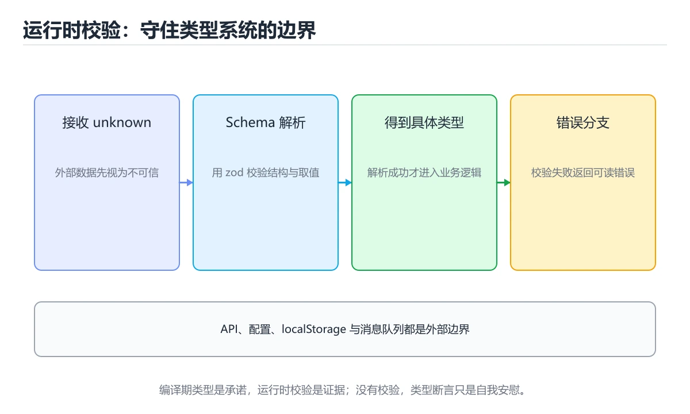
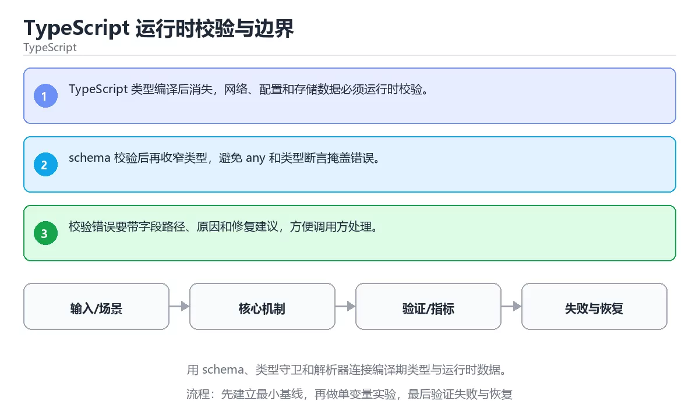

# TypeScript 运行时校验与边界





> 内容更新时间：2026-10-06 · 学习阶段：高级 · 预计用时：40 分钟

## 本节知识框架

**课程定位**：所属分类 `typescript`（TypeScript），课程主题 `TypeScript 运行时校验与边界`，学习阶段 高级，建议用时 45 分钟。

本课主线：用 schema、类型守卫和解析器连接编译期类型与运行时数据。

**学完本课应当能够**
- 说清 `运行时校验` 与 `Zod` 的含义与区别，并各举一个正例和一个反例。
- 用本课示例验证 `边界` 的行为，记录输入、输出与失败条件。
- 遇到「只在编译期做类型检查」这类问题时，能说出触发条件与修复顺序。

### 从概念到验证的学习链条

1. `运行时校验`：先掌握 程序运行时检查外部数据是否满足预期结构和取值范围，再用它解释 `Zod` 为什么会出现。
2. `Zod`：先掌握 按“TypeScript 运行时校验与边界”中 运行时校验、Zod、类型守卫 的实践顺序，把四个步骤排成从准备到复盘的合理顺序，再用它解释 `边界` 为什么会出现。
3. `边界`：先掌握 输入取值、容量或时序上的临界条件，通常是最容易出现错误的分界，再用它解释 `类型收窄` 为什么会出现。
4. `类型收窄`：先掌握 校验通过后把未知类型收窄成具体类型，用类型守卫替代 as 断言，再用它解释 本课示例的观察结果 为什么会出现。

**先修与衔接**：本课是「TypeScript」分类的第 21 课。先修内容：《TypeScript 类型级编程》。《TypeScript 类型级编程》里的 `条件类型`、`映射类型` 是本课的前提。相关或后续课程：《TypeScript 编译与运行性能》。

### 完成判据

- **定义关**：不看正文也能说明 `运行时校验` 是 程序运行时检查外部数据是否满足预期结构和取值范围，并指出一个反例。
- **机制关**：能按“输入 → 转换 → 输出 → 验证”复述 `TypeScript 运行时校验与边界`，而不是只背结论。
- **示例关**：能运行或推演 `TypeScript 运行时校验与边界` 的 `text` 示例，并说明一个真实出现的标识符或字面量。
- **证据关**：能指出 `TypeScript 运行时校验与边界` 示例里的 调用了 `parsePort()`，并说明它支持或反驳了本课的哪一条结论。
- **排错关**：能复现 只在编译期做类型检查，记录现象并按 在系统边界做运行时校验 修复。
- **迁移关**：能把 `运行时校验`、`Zod`、`类型守卫`、`边界` 放进一个与 `TypeScript 运行时校验与边界` 不同的项目场景，并保持输入与验证条件可追踪。
- **复盘关**：学完 `TypeScript 运行时校验与边界` 后，用一句话写下仍然不确定的结论，并列出下一次验证需要的输入、环境和成功判据。

### 复习清单

- [ ] 能不看正文复述本课核心术语，并指出一个边界或反例。
- [ ] 能运行或推演本课示例，记录输入、输出与失败现象。
- [ ] 能完成一次自测，并把错题对照错误表定位原因。

## 核心概念定义

| 术语 | 操作性定义 | 常见边界与风险 |
| --- | --- | --- |
| 运行时校验 | 程序运行时检查外部数据是否满足预期结构和取值范围。 | 易错：外部数据不受任何保护；正确做法是在系统边界做运行时校验。 |
| Zod | 按“TypeScript 运行时校验与边界”中 运行时校验、Zod、类型守卫 的实践顺序，把四个步骤排成从准备到复盘的合理顺序。 | 静态检查只在编译期成立，运行期输入仍需校验。 |
| 边界 | 输入取值、容量或时序上的临界条件，通常是最容易出现错误的分界。 | 易错：外部数据不受任何保护；正确做法是在系统边界做运行时校验。 |
| 类型收窄 | 校验通过后把未知类型收窄成具体类型，用类型守卫替代 as 断言。 | 静态检查只在编译期成立，运行期输入仍需校验。 |

## 原理与运行机制

### 机制总览

1. **建立输入**：把「运行时校验」按本课定义整理成可观察、可重复的输入条件。
2. **执行转换**：围绕「Zod」执行本课的核心步骤；每一步都记录中间状态，避免只看最终输出。
3. **产生输出**：得到「边界」后，用正文示例或协议/SQL 结果核对输出是否符合预期。
4. **改变一个条件**：只替换一个边界条件或环境参数，观察「TypeScript 运行时校验与边界」的结论是否仍然成立。

**教材衔接：核心知识**

### 1. TypeScript 类型编译后消失，网络、配置和存储数据必须运行时校验。

- 关键做法：基线只保留 Zod 必需的部分，其余条件一次加一个。
- 验证标准：Zod 的异常路径有明确错误信息与恢复动作。

### 2. schema 校验后再收窄类型，避免 any 和类型断言掩盖错误。

把这条结论放回「TypeScript 运行时校验与边界」的完整流程里展开：

- 正文依据：能用自己的话解释：TypeScript 类型编译后消失，网络、配置和存储数据必须运行时校验。
- 落地检查：把「2. schema 校验后再收窄类型，避免 any 和类型断言掩盖错误。」改写成一条可执行的核对项，逐条验证输入、超时与失败路径。

### 3. 校验错误要带字段路径、原因和修复建议，方便调用方处理。

把这条结论放回「TypeScript 运行时校验与边界」的完整流程里展开：

- 正文依据：本课关键词：运行时校验、Zod、类型守卫、边界。
- 落地检查：把「3. 校验错误要带字段路径、原因和修复建议，方便调用方处理。」改写成一条可执行的核对项，逐条验证输入、超时与失败路径。

**教材衔接：关键流程**

**教材衔接：实践路径**

**教材衔接：版本与时效**

- 版本提示：运行时校验 的行为在最近几个大版本里有过调整，升级「TypeScript 运行时校验与边界」前先用 RangeError 复现当前输出，再对照官方发布说明逐条核对。
- 升级「TypeScript 运行时校验与边界」涉及的依赖前，先用 RangeError 复现当前行为，再逐项核对版本说明与破坏性变更。

### 升级检查清单

- 先固定当前版本，跑通全部示例与测验，再升级工具链。
- 升级时只动一个依赖版本，用 RangeError 记录构建与运行结果。
- 回归范围锁定 RangeError 的默认行为，并确认弃用警告是否出现在构建输出里。
- 升级后把 RangeError 的实测版本写进「内容元数据」，再更新复核日期。

**教材衔接：零基础精讲：把TypeScript 运行时校验与边界真正讲透**

### 先建立一个直觉

本课的摘要可以当作一张地图：用 schema、类型守卫和解析器连接编译期类型与运行时数据。

### 逐步拆解

1. 澄清输入与目标。先写清「TypeScript 运行时校验与边界」要解决的问题、合法输入范围和成功标准，再进入后续步骤。
2. 描述处理过程。把「运行时校验、Zod、类型守卫、边界」映射到具体步骤，每步都要求能单独验证。
3. 定义输出。运行时校验 的输出不仅包括正常结果，还包括错误码、日志和资源释放状态。
4. 构造一次运行时校验越界，记录系统是拒绝、降级还是静默出错；三者对应的修复策略完全不同。
5. 把「核心知识」里的最小示例抄成 RangeError 一行的输入，先手算结果再执行，确认两者一致。

### 把正文串成一条执行链

- **考点 3：按“TypeScript 运行时校验与边界”中 运行时校验、Zod、类型守卫 的实践顺序，把四个步骤排成从准备到复盘的合理顺序。**：先独立作答，再回到本课对应小节核对判断依据；答错时记录是哪一个前提被忽略。

### 从测验反推易错点

- 参考判断：TypeScript 类型编译后消失，网络、配置和存储数据必须运行时校验。
- 自问：如果去掉题干里的一个限定词，结论还成立吗？

- 参考判断：schema 校验后再收窄类型，避免 any 和类型断言掩盖错误。

- 参考判断：校验错误要带字段路径、原因和修复建议，方便调用方处理。

**检查点 4：本课的核心学习目标是什么？**

- 参考判断：用 schema、类型守卫和解析器连接编译期类型与运行时数据。

- 参考判断：运行时校验、Zod


### 变式训练

1. 把 运行时校验 的实现压缩到一个进程内，去掉所有外部依赖后再谈扩展。
2. 把 RangeError 的数据量提高一个数量级，观察延迟与内存的变化拐点。
3. 让 RangeError 的外部依赖超时，确认系统能回滚或补偿，而不是留下脏数据。
5. 把 运行时校验 的一个前提改成不成立，说明本课哪条结论先失效。
6. 限制 CPU 与内存上限后重跑 RangeError，观察哪一项参数需要重新设定。

### 本课自测

- [ ] 能用一句话解释「运行时校验」在本课中的角色与边界。
- [ ] 能举出一个正常例子和一个失败例子。
- [ ] 能说出最小验证步骤，以及需要记录的证据。
- [ ] 能用一句话解释「Zod」在本课中的角色与边界。
- [ ] 能用一句话解释「类型守卫」在本课中的角色与边界。
- [ ] 能用一句话解释「边界」在本课中的角色与边界。

### 迁移案例库

下面用不同约束重复同一套方法，每轮只改变 运行时校验 的一个取值并记录结论。

#### 迁移案例 1：围绕「运行时校验」做一次小实验

**步骤**：
1. 复述当前方案对「运行时校验」的假设，写成一句可证伪的话。
2. 设计一个正常输入和一个边界输入，分别预测输出。
3. 运行或逐步演算，记录实际输出、耗时和失败信息。
4. 只调整一个参数，比较前后差异并解释原因。
5. 补充一条测试或复习卡，确保下次能更快复现。

**验收**：结论要能追溯到正文的具体小节与代码位置，并记录Zod相关的指标变化。

#### 迁移案例 2：围绕「Zod」做一次小实验

**步骤**：
1. 复述当前方案对「Zod」的假设，写成一句可证伪的话。

#### 迁移案例 3：围绕「类型守卫」做一次小实验

**步骤**：
1. 复述当前方案对「类型守卫」的假设，写成一句可证伪的话。

#### 迁移案例 4：围绕「边界」做一次小实验

**步骤**：
1. 复述当前方案对「边界」的假设，写成一句可证伪的话。

#### 迁移案例 5：围绕「运行时校验」做一次小实验

**步骤**：

#### 迁移案例 6：围绕「Zod」做一次小实验

**步骤**：

#### 迁移案例 7：围绕「类型守卫」做一次小实验

**步骤**：

#### 迁移案例 8：围绕「边界」做一次小实验

**步骤**：

#### 迁移案例 9：围绕「运行时校验」做一次小实验

**步骤**：

#### 迁移案例 10：围绕「Zod」做一次小实验

**步骤**：

#### 迁移案例 11：围绕「类型守卫」做一次小实验

**步骤**：

#### 迁移案例 12：围绕「边界」做一次小实验

**步骤**：

#### 迁移案例 13：围绕「运行时校验」做一次小实验

**步骤**：

#### 迁移案例 14：围绕「Zod」做一次小实验

**步骤**：

#### 迁移案例 15：围绕「类型守卫」做一次小实验

**步骤**：

#### 迁移案例 16：围绕「边界」做一次小实验

**步骤**：

<!-- p0-depth-v2:end -->

**教材衔接：验证步骤**

### 机制拆解：每一步的输入、动作与输出

#### 1. `运行时校验`
- 输入：`运行时校验`；本步把 程序运行时检查外部数据是否满足预期结构和取值范围 当作判断规则。
- 动作：围绕 `运行时校验` 保留中间状态，并记录它与 `Zod` 的对应关系。
- 输出：`Zod`，它可以被下一段代码、测试或记录继续使用。
- `运行时校验` 的失败条件：当只在编译期做类型检查时，会出现外部数据不受任何保护。

#### 2. `Zod`
- 输入：`运行时校验`；本步把 按“TypeScript 运行时校验与边界”中 运行时校验、Zod、类型守卫 的实践顺序，把四个步骤排成从准备到复盘的合理顺序 当作判断规则。
- 动作：围绕 `Zod` 保留中间状态，并记录它与 `边界` 的对应关系。
- 输出：`边界`，它可以被下一段代码、测试或记录继续使用。
- `Zod` 的失败条件：静态检查只在编译期成立，运行期输入仍需校验。

#### 3. `边界`
- 输入：`Zod`；本步把 输入取值、容量或时序上的临界条件，通常是最容易出现错误的分界 当作判断规则。
- 动作：围绕 `边界` 保留中间状态，并记录它与 `类型收窄` 的对应关系。
- 输出：`类型收窄`，它可以被下一段代码、测试或记录继续使用。
- `边界` 的失败条件：当只在编译期做类型检查时，会出现外部数据不受任何保护。

#### 4. `类型收窄`
- 输入：`边界`；本步把 校验通过后把未知类型收窄成具体类型，用类型守卫替代 as 断言 当作判断规则。
- 动作：围绕 `类型收窄` 保留中间状态，并记录它与 `parsePort` 的对应关系。
- 输出：`parsePort`，它可以被下一段代码、测试或记录继续使用。
- `类型收窄` 的失败条件：静态检查只在编译期成立，运行期输入仍需校验。

### 示例中的可观察事实

1. 调用了 `parsePort()`；它对应的课程主题是 `TypeScript 运行时校验与边界`。
2. 调用了 `Number()`；它对应的课程主题是 `TypeScript 运行时校验与边界`。
3. 调用了 `isInteger()`；它对应的课程主题是 `TypeScript 运行时校验与边界`。
4. 调用了 `RangeError()`；它对应的课程主题是 `TypeScript 运行时校验与边界`。
5. 调用了 `log()`；它对应的课程主题是 `TypeScript 运行时校验与边界`。
6. 出现字面量 `8080`；它对应的课程主题是 `TypeScript 运行时校验与边界`。

### 复现实验记录

- 环境：`TypeScript 运行时校验与边界` 使用 `text` 示例，固定 `运行时校验`、`Zod`、`类型守卫`、`边界` 作为第一组条件。
- 首轮输入：先确认 调用了 `parsePort()`，预测 `运行时校验` 会怎样变化。
- 基线观察：记录命令、输入、输出和错误原文，不用截图代替可复制的文本。
- 单变量修改：只改变 `运行时校验`，观察 `类型收窄` 是否仍满足定义。
- 失败注入：复现 只在编译期做类型检查，确认现象是 外部数据不受任何保护。
- 记录结论：把“修改前、修改后、预期变化、实际变化”写成四列表，这样复盘 `TypeScript 运行时校验与边界` 时才能区分概念错误与实现错误。

## 典型应用场景

| 场景 | 典型输入或前提 | 期望产物 |
| --- | --- | --- |
| 学习验证 | 使用本课最小示例和 运行时校验、Zod | 能复现正文结论，并解释每一步。 |
| 工程落地 | 把「TypeScript 运行时校验与边界」放入真实模块或服务边界 | 输出可观测、失败可定位、参数可配置。 |
| 故障排查 | 只改一个版本、规模、输入或依赖条件 | 能区分概念错误、实现错误和环境差异。 |

**教材衔接：深度拓展与实战**

这一节把 运行时校验 的定义、RangeError 的代码与常见失败串成一条复习路线。

### 机制拆解

- **1. TypeScript 类型编译后消失，网络、配置和存储数据必须运行时校验。**：在「TypeScript 运行时校验与边界」里，「1. TypeScript 类型编译后消失，网络、配置和存储数据必须运行时校验。」这一步要先写清输入与预期，再记录实际结果和差异；结果不符时回到对应小节核对前提。
- **2. schema 校验后再收窄类型，避免 any 和类型断言掩盖错误。**：在「TypeScript 运行时校验与边界」里，「2. schema 校验后再收窄类型，避免 any 和类型断言掩盖错误。」这一步要先写清输入与预期，再记录实际结果和差异；结果不符时回到对应小节核对前提。
- **3. 校验错误要带字段路径、原因和修复建议，方便调用方处理。**：在「TypeScript 运行时校验与边界」里，「3. 校验错误要带字段路径、原因和修复建议，方便调用方处理。」这一步要先写清输入与预期，再记录实际结果和差异；结果不符时回到对应小节核对前提。
- **考点 1：关于「TypeScript 类型编译后消失，网络、配置和存储数据必须运行时校验。」，下列说法正确的是？**：先独立作答，再回到本课对应小节核对判断依据；答错时记录是哪一个前提被忽略。
- **考点 2：关于「schema 校验后再收窄类型，避免 any 和类型断言掩盖错误。」，下列说法正确的是？**：先独立作答，再回到本课对应小节核对判断依据；答错时记录是哪一个前提被忽略。

### 边界条件与常见反例

「TypeScript 运行时校验与边界」的边界不只包括最大最小值，还要覆盖空、重复和失败：

| 条件 | 常见反例 | 处理方式 |
| --- | --- | --- |
| 空输入 | 运行时校验 没有任何取值 | 先判空，给出明确错误而不是继续执行 |
| 边界值 | Zod 取最小或最大 | 用最小值、最大值和越界值各跑一次 |
| 重复执行 | 同一输入被执行两次 | 保证结果可重复，必要时加锁或去重 |
| 失败路径 | 运行时校验 相关步骤报错 | 保留原始错误，确认回滚或重试行为 |

### 工程检查表

- [ ] 能否用自己的话说明TypeScript 运行时校验与边界解决什么问题，以及它不负责什么？
- [ ] 能否用「TypeScript 运行时校验与边界」的最小示例复现一次失败并解释原因？
- [ ] 能否解释本课关键词在真实项目中的边界与取舍？
- [ ] 能否说明 Zod 在新场景下需要补充什么前提？

### 迁移练习

1. 保持正文示例不变，写出它的输入、处理步骤和预期输出。
2. 固定其他输入，只调整 RangeError 的一个参数，先写预测再验证。
3. 结合运行时校验、Zod、类型守卫、边界，写出一个真实项目中的使用场景。
4. 写下一个反例，说明它在什么条件下会使朴素做法失效。

<!-- p0-depth-v2:start -->

- **只在编译期做类型检查**：典型现象是外部数据不受任何保护；正确做法是在系统边界做运行时校验。
- **校验失败一律抛异常**：典型现象是可修复的问题也直接中断；正确做法是按字段区分可修复错误与致命错误。
- **类型与校验规则两处维护**：典型现象是两边逐渐不一致；正确做法是从同一 schema 生成类型与校验。

### 最小验证场景

- 准备：保留 `text` 示例的原始输入，先记录 `TypeScript 运行时校验与边界` 的基线输出和完整运行命令。
- 观察：先核对 调用了 `parsePort()`，再改变一个与 `运行时校验` 相关的条件。
- 判定：新结果与 `TypeScript 运行时校验与边界` 的基线不同不等于错误；只有当差异破坏了 `运行时校验` 的定义或错误表中的约束，才判定为失败。

### 选择与边界

- 使用 `运行时校验` 时，先满足它的定义：程序运行时检查外部数据是否满足预期结构和取值范围；易错：外部数据不受任何保护；正确做法是在系统边界做运行时校验。
- 使用 `Zod` 时，先满足它的定义：按“TypeScript 运行时校验与边界”中 运行时校验、Zod、类型守卫 的实践顺序，把四个步骤排成从准备到复盘的合理顺序；静态检查只在编译期成立，运行期输入仍需校验。
- 使用 `边界` 时，先满足它的定义：输入取值、容量或时序上的临界条件，通常是最容易出现错误的分界；易错：外部数据不受任何保护；正确做法是在系统边界做运行时校验。
- 使用 `类型收窄` 时，先满足它的定义：校验通过后把未知类型收窄成具体类型，用类型守卫替代 as 断言；静态检查只在编译期成立，运行期输入仍需校验。

## 代码/协议/SQL 示例

### 最小可验证示例

**教材衔接：最小可运行示例**

下面示例用于验证 运行时校验 的最小输入、处理和输出。先原样运行，再只修改一个值：

```typescript
function parsePort(value: unknown): number {
  const port = Number(value);
  if (!Number.isInteger(port) || port < 1 || port > 65535) {
    throw new RangeError(`invalid port: ${value}`);
  }
  return port;
}

console.log(parsePort("8080"));
```

**教材衔接：预期输出**

```text
8080
```

### 示例精读：先找证据，再改一个条件

1. 调用了 `parsePort()`；它出现在 `TypeScript 运行时校验与边界` 的示例中，阅读时先确认它前后各发生了什么。
2. 调用了 `Number()`；它出现在 `TypeScript 运行时校验与边界` 的示例中，阅读时先确认它前后各发生了什么。
3. 调用了 `isInteger()`；它出现在 `TypeScript 运行时校验与边界` 的示例中，阅读时先确认它前后各发生了什么。
4. 调用了 `RangeError()`；它出现在 `TypeScript 运行时校验与边界` 的示例中，阅读时先确认它前后各发生了什么。
5. 调用了 `log()`；它出现在 `TypeScript 运行时校验与边界` 的示例中，阅读时先确认它前后各发生了什么。
6. 出现字面量 `8080`；它出现在 `TypeScript 运行时校验与边界` 的示例中，阅读时先确认它前后各发生了什么。
- 在 `TypeScript 运行时校验与边界` 中与 `运行时校验` 对照：示例必须能支持 程序运行时检查外部数据是否满足预期结构和取值范围，否则说明这一段还缺少实现或验证步骤。
- 在 `TypeScript 运行时校验与边界` 中与 `Zod` 对照：示例必须能支持 按“TypeScript 运行时校验与边界”中 运行时校验、Zod、类型守卫 的实践顺序，把四个步骤排成从准备到复盘的合理顺序，否则说明这一段还缺少实现或验证步骤。
- 在 `TypeScript 运行时校验与边界` 中与 `边界` 对照：示例必须能支持 输入取值、容量或时序上的临界条件，通常是最容易出现错误的分界，否则说明这一段还缺少实现或验证步骤。
- 在 `TypeScript 运行时校验与边界` 中与 `类型收窄` 对照：示例必须能支持 校验通过后把未知类型收窄成具体类型，用类型守卫替代 as 断言，否则说明这一段还缺少实现或验证步骤。

## 时间/空间复杂度或性能分析

**性能关注点（TypeScript 运行时校验与边界）**：编译期类型检查与运行期代码是两套开销：分别记录构建时间与运行时耗时。

**本课特有开销（TypeScript 运行时校验与边界 · 运行时校验）**：重试与超时会成倍放大尾延迟，记录 P99 而不是平均值。

**测量方法**：以 `TypeScript 运行时校验与边界` 的 `运行时校验` 场景为对象，固定输入跑一遍记录基线，再把规模或并发度提高一个数量级复测；两次结果的差值与波动范围才是结论依据。

### 需要控制的变量与记录项

- `TypeScript 运行时校验与边界` 的 `运行时校验`：固定它的版本、输入范围和资源上限，分别记录速度、内存与失败率的变化。
- `TypeScript 运行时校验与边界` 的 `Zod`：固定它的版本、输入范围和资源上限，分别记录速度、内存与失败率的变化。
- `TypeScript 运行时校验与边界` 的 `类型守卫`：固定它的版本、输入范围和资源上限，分别记录速度、内存与失败率的变化。
- `TypeScript 运行时校验与边界` 的 `边界`：固定它的版本、输入范围和资源上限，分别记录速度、内存与失败率的变化。
- `TypeScript 运行时校验与边界` 中 `运行时校验` 的边界：易错：外部数据不受任何保护；正确做法是在系统边界做运行时校验。达到边界时不要外推，必须重新测量。
- `TypeScript 运行时校验与边界` 中 `Zod` 的边界：静态检查只在编译期成立，运行期输入仍需校验。达到边界时不要外推，必须重新测量。
- `TypeScript 运行时校验与边界` 中 `边界` 的边界：易错：外部数据不受任何保护；正确做法是在系统边界做运行时校验。达到边界时不要外推，必须重新测量。
- `TypeScript 运行时校验与边界` 中 `类型收窄` 的边界：静态检查只在编译期成立，运行期输入仍需校验。达到边界时不要外推，必须重新测量。
- `TypeScript 运行时校验与边界` 的代码证据：先验证 调用了 `parsePort()`，再记录该路径的输入规模与耗时；只看代码行数不能推出复杂度。

## 常见误区与易错点

| 容易写错的做法 | 实际现象 | 原因与正确做法 |
| --- | --- | --- |
| 只在编译期做类型检查 | 外部数据不受任何保护。 | 在系统边界做运行时校验。 |
| 校验失败一律抛异常 | 可修复的问题也直接中断。 | 按字段区分可修复错误与致命错误。 |
| 类型与校验规则两处维护 | 两边逐渐不一致。 | 从同一 schema 生成类型与校验。 |

### 现场 1：只在编译期做类型检查

**症状**：外部数据不受任何保护。

**根因与修复**：在系统边界做运行时校验。

**自检**：在本课示例里复现「只在编译期做类型检查」，改成在系统边界做运行时校验后重跑；如果症状消失且失败路径按预期变化，说明定位正确。

### 现场 2：校验失败一律抛异常

**症状**：可修复的问题也直接中断。

**根因与修复**：按字段区分可修复错误与致命错误。

**自检**：在本课示例里复现「校验失败一律抛异常」，改成按字段区分可修复错误与致命错误后重跑；如果症状消失且失败路径按预期变化，说明定位正确。

### 现场 3：类型与校验规则两处维护

**症状**：两边逐渐不一致。

**根因与修复**：从同一 schema 生成类型与校验。

**自检**：在本课示例里复现「类型与校验规则两处维护」，改成从同一 schema 生成类型与校验后重跑；如果症状消失且失败路径按预期变化，说明定位正确。

## 与其他知识点的关系

把「TypeScript 运行时校验与边界」放回知识体系时，不只要记住“前面学过什么”，还要说明两个主题在输入、机制、资源边界和失败模式上的差异。这样才能把单课知识迁移到项目、排障和后续课程。

**教材衔接：复习与迁移**

### 概念复述

- 用一句话说明「TypeScript 运行时校验与边界」解决什么问题：用 schema、类型守卫和解析器连接编译期类型与运行时数据。
- 写出运行时校验、Zod、类型守卫之间的关系，并各举一个例子。
- 说出本课最容易混淆的两个概念，以及区分它们的判据。

### 正文逐节复核

- **零基础精讲：把TypeScript 运行时校验与边界真正讲透**：本课的摘要可以当作一张地图：用 schema、类型守卫和解析器连接编译期类型与运行时数据。


### 迁移练习

- **先修**：`TypeScript 类型级编程`。本课默认这些内容已经掌握。
- **相关或后续**：`TypeScript 编译与运行性能`。本课术语会在这些课程里继续使用。
- **术语归属**：`运行时校验`、`Zod`、`边界` 的定义以本课「核心概念定义」为准，换到其他课程时先确认定义是否被改写。
- 同一分类的《实战：TypeScript 类型安全 CLI》也涉及 `Zod`；两课衔接时先确认这个术语的定义是否一致。

### 先修与后续术语接口

- `TypeScript 类型级编程`：两者通过本分类的学习顺序衔接，阅读时重点比较各自的输入与失败条件。
- `TypeScript 编译与运行性能`：两者通过本分类的学习顺序衔接，阅读时重点比较各自的输入与失败条件。

### 容易混淆的相邻概念

- `运行时校验` 与 `Zod`：前者强调 程序运行时检查外部数据是否满足预期结构和取值范围；后者强调 按“TypeScript 运行时校验与边界”中 运行时校验、Zod、类型守卫 的实践顺序，把四个步骤排成从准备到复盘的合理顺序。判断时分别检查两条定义的适用范围，不要只看名称相似就互换。
- `Zod` 与 `边界`：前者强调 按“TypeScript 运行时校验与边界”中 运行时校验、Zod、类型守卫 的实践顺序，把四个步骤排成从准备到复盘的合理顺序；后者强调 输入取值、容量或时序上的临界条件，通常是最容易出现错误的分界。判断时分别检查两条定义的适用范围，不要只看名称相似就互换。
- `边界` 与 `类型收窄`：前者强调 输入取值、容量或时序上的临界条件，通常是最容易出现错误的分界；后者强调 校验通过后把未知类型收窄成具体类型，用类型守卫替代 as 断言。判断时分别检查两条定义的适用范围，不要只看名称相似就互换。

## 自测题与参考答案

> 先独立作答，再对照参考答案；答案都能在本课正文、术语表或错误表里找到依据。

### 自测 1（概念复述）

不看正文，写出 `运行时校验` 的操作性定义，并说明它与 `Zod` 的区别。

**参考答案**：程序运行时检查外部数据是否满足预期结构和取值范围。

`Zod` 的定位是：按“TypeScript 运行时校验与边界”中 运行时校验、Zod、类型守卫 的实践顺序，把四个步骤排成从准备到复盘的合理顺序；两者的差别要从适用对象与失败模式上说明。

### 自测 2（排错）

本课错误表记录了「只在编译期做类型检查」这类做法。请写出它会出现的现象、根因，以及修复顺序。

**参考答案**：现象是外部数据不受任何保护；正确做法是在系统边界做运行时校验。修复时先复现现象并保留证据，再改动一处假设重跑，确认现象消失。

### 自测 3（动手验证）

运行本课的 `text` 示例，改动其中一个输入后重新运行，记录输出与错误信息。

**参考答案**：正常输入下 `text` 示例应当复现正文给出的结果；改动输入后，如果结果改变或报错，先核对它是否满足 `TypeScript 运行时校验与边界` 中`运行时校验` 的适用范围，再检查错误表里是否有同类现象。

### 自测 4（代码阅读）

阅读本课开头的 `text` 示例，说明它体现了`运行时校验` 的哪一条性质，并指出改动哪个输入会让这条性质不再成立。

**参考答案**：`运行时校验` 的定义是 程序运行时检查外部数据是否满足预期结构和取值范围，示例正是在实现这条定义。改动与 `运行时校验` 有关的一个输入后，如果结果不再符合 `TypeScript 运行时校验与边界` 的正文描述，就说明该性质只在当前前提成立。

### 自测 5（迁移）

把 `TypeScript 运行时校验与边界` 的方法迁移到自己的项目：围绕 `运行时校验` 写出一个与错误表同类的风险点，并说明触发条件和检验方式。

**参考答案**：例如「类型与校验规则两处维护」，它会导致两边逐渐不一致；检验方式是按从同一 schema 生成类型与校验改一处再复现，确认现象消失且没有引入新的失败分支。

### 自测 6（对比）

用一个表格对比 `运行时校验` 与 `Zod`：各写一行适用场景、一行失败表现。

**参考答案**：`运行时校验` 的定义是程序运行时检查外部数据是否满足预期结构和取值范围；`Zod` 的定义是按“TypeScript 运行时校验与边界”中 运行时校验、Zod、类型守卫 的实践顺序，把四个步骤排成从准备到复盘的合理顺序。两者的失败表现分别对应本课错误表里与本术语相关的行。

### 自测 7（排错顺序）

面对「只在编译期做类型检查」引发的问题，请把“复现 外部数据不受任何保护 → 保留证据 → 在系统边界做运行时校验 → 回归验证”四步写成可执行的检查清单。

**参考答案**：第一步按外部数据不受任何保护复现；第二步记录输入、版本与完整报错；第三步按在系统边界做运行时校验只改一处；第四步重跑并确认失败路径也按预期变化。

### 自测 8（边界判断）

针对 `类型收窄`，分别写出“可以使用”的条件和“结论不再成立”的条件。

**参考答案**：静态检查只在编译期成立，运行期输入仍需校验。 同时要把 `类型收窄` 的定义 校验通过后把未知类型收窄成具体类型，用类型守卫替代 as 断言 与实际输入逐项对照。

### 自测 9（机制重建）

不看正文，按输入、转换、输出、验证四段重建 `运行时校验` → `Zod` → `边界` → `类型收窄` 的作用链。

**参考答案**：起点是 `运行时校验` 的定义 程序运行时检查外部数据是否满足预期结构和取值范围；中间每一步都保留可观察状态；终点由 `类型收窄` 检查，失败时回到错误表定位第一个偏离定义的步骤。

### 自测 10（综合排错）

在 `TypeScript 运行时校验与边界` 中，现象是 两边逐渐不一致。请围绕 类型与校验规则两处维护 写出最小复现、关键证据、修复动作和回归验证，并说明为什么不能只凭一次运行下结论。

**参考答案**：先复现 类型与校验规则两处维护，记录输入与完整错误；再按 从同一 schema 生成类型与校验 只改一处。回归时同时跑正常路径和边界路径，只有两次结果都可解释，才把修复视为完成。

### 自测 11（一分钟复述）

用每分钟约 200 字的速度复述 `TypeScript 运行时校验与边界`：先给主问题，再按顺序说出 `运行时校验`、`Zod`、`边界`、`类型收窄`，最后给一个失败案例。

**自评标准**：主问题必须对应 用 schema、类型守卫和解析器连接编译期类型与运行时数据；每个术语都要能接上一句定义或边界；失败案例必须写成可观察现象，不能用“可能有风险”代替证据。

## 术语速查

| 术语 | 一句话说明 |
| --- | --- |
| `运行时校验` | 程序运行时检查外部数据是否满足预期结构和取值范围。 |
| `Zod` | 按“TypeScript 运行时校验与边界”中 运行时校验、Zod、类型守卫 的实践顺序，把四个步骤排成从准备到复盘的合理顺序。 |
| `边界` | 输入取值、容量或时序上的临界条件，通常是最容易出现错误的分界。 |
| `类型收窄` | 校验通过后把未知类型收窄成具体类型，用类型守卫替代 as 断言。 |

**术语关系**：`运行时校验`（程序运行时检查外部数据是否满足预期结构和取值范围） → `Zod`（按“TypeScript 运行时校验与边界”中 运行时校验、Zod、类型守卫 的实践顺序） → `边界`（输入取值、容量或时序上的临界条件） → `类型收窄`（校验通过后把未知类型收窄成具体类型）。

## 考点精讲

`TypeScript 运行时校验与边界` 的题库有 6 道题，下面逐题给出题干、正确项与判断依据：先自己作答，再核对正确项，最后回到正文对应小节复核。

### 考点 1：第 1 题

- **题目**：在 `TypeScript 运行时校验与边界` 里，与 `运行时校验` 有关的说法中，哪一项最符合用 schema、类型守卫和解析器连接编译期类型与运行时数据。？
- **正确项**：TypeScript 类型编译后消失，网络、配置和存储数据必须运行时校验。
- **判断依据**：这道题落在术语 `运行时校验` 上：程序运行时检查外部数据是否满足预期结构和取值范围。复习时把 `运行时校验` 的定义、适用边界和一个反例一起说清楚，再回到「核心概念定义」核对原文。

### 考点 2：第 2 题

- **题目**：在 `TypeScript 运行时校验与边界` 里，与 `运行时校验` 有关的说法中，哪一项最符合用 schema、类型守卫和解析器连接编译期类型与运行时数据。？（TypeScript 运行时校验与边界·TypeScript 第 2 题）
- **正确项**：schema 校验后再收窄类型，避免 any 和类型断言掩盖错误。
- **判断依据**：这道题落在术语 `运行时校验` 上：程序运行时检查外部数据是否满足预期结构和取值范围。复习时把 `运行时校验` 的定义、适用边界和一个反例一起说清楚，再回到「核心概念定义」核对原文。

### 考点 3：第 3 题

- **题目**：按“TypeScript 运行时校验与边界”中 运行时校验、Zod、类型守卫 的实践顺序，把四个步骤排成从准备到复盘的合理顺序。
- **正确项**：先明确 运行时校验 的输入、输出与约束 → 写出最小示例并核对 Zod 的基线结果 → 只改一个变量，记录边界与失败路径的变化 → 固定版本与证据，把“TypeScript 运行时校验与边界”的结论写成可复现记录
- **判断依据**：这道题落在术语 `运行时校验` 上：程序运行时检查外部数据是否满足预期结构和取值范围。复习时把 `运行时校验` 的定义、适用边界和一个反例一起说清楚，再回到「核心概念定义」核对原文。

### 考点 4：第 4 题

- **题目**：`TypeScript 运行时校验与边界` 的主线是：用 schema、类型守卫和解析器连接编译期类型与运行时数据。下面哪一项与这条主线一致？
- **正确项**：用 schema、类型守卫和解析器连接编译期类型与运行时数据。
- **判断依据**：这道题落在术语 `运行时校验` 上：程序运行时检查外部数据是否满足预期结构和取值范围。复习时把 `运行时校验` 的定义、适用边界和一个反例一起说清楚，再回到「核心概念定义」核对原文。

### 考点 5：第 5 题

- **题目**：课程 `用 schema、类型守卫和解析器连接编译期类型与运行时数据。`。在 `TypeScript 运行时校验与边界` 里，`运行时校验`、`Zod` 与下面哪些选项属于同一层概念？（多选）
- **正确项**：运行时校验；Zod
- **判断依据**：这道题落在术语 `运行时校验` 上：程序运行时检查外部数据是否满足预期结构和取值范围。复习时把 `运行时校验` 的定义、适用边界和一个反例一起说清楚，再回到「核心概念定义」核对原文。

### 考点 6：第 6 题

- **题目**：`TypeScript 运行时校验与边界` 的示例代码服务于“用 schema、类型守卫和解析器连接编译期类型与运行时数据。”。哪一条判断是正确的？
- **正确项**：TypeScript 类型编译后消失，网络、配置和存储数据必须运行时校验。
- **判断依据**：这道题落在术语 `运行时校验` 上：程序运行时检查外部数据是否满足预期结构和取值范围。复习时把 `运行时校验` 的定义、适用边界和一个反例一起说清楚，再回到「核心概念定义」核对原文。

### 考点 7：`运行时校验`

- **要点**：程序运行时检查外部数据是否满足预期结构和取值范围。
- **运行时校验 的边界**：易错：外部数据不受任何保护；正确做法是在系统边界做运行时校验。

### 考点 8：`Zod`

- **要点**：按“TypeScript 运行时校验与边界”中 运行时校验、Zod、类型守卫 的实践顺序，把四个步骤排成从准备到复盘的合理顺序。
- **Zod 的边界**：静态检查只在编译期成立，运行期输入仍需校验。

### 考点 9：`边界`

- **要点**：输入取值、容量或时序上的临界条件，通常是最容易出现错误的分界。
- **边界 的边界**：易错：外部数据不受任何保护；正确做法是在系统边界做运行时校验。

### 考点 10：`类型收窄`

- **要点**：校验通过后把未知类型收窄成具体类型，用类型守卫替代 as 断言。
- **类型收窄 的边界**：静态检查只在编译期成立，运行期输入仍需校验。

### 考点 11：排错——只在编译期做类型检查

- **现象**：外部数据不受任何保护。
- **处理**：在系统边界做运行时校验。

### 考点 12：排错——校验失败一律抛异常

- **现象**：可修复的问题也直接中断。
- **处理**：按字段区分可修复错误与致命错误。

### 考点 13：综合辨析——`运行时校验` 与 `类型收窄`

- **辨析点**：`运行时校验` 的定义是 程序运行时检查外部数据是否满足预期结构和取值范围；`类型收窄` 的定义是 校验通过后把未知类型收窄成具体类型，用类型守卫替代 as 断言。
- **答题要求**：面对 `TypeScript 运行时校验与边界` 的题目，先判断描述的是 `运行时校验` 还是 `类型收窄`，再归到对应定义，最后写出一个会让该定义失效的边界输入。

### 考点 14：排错评分点

- **现象分**：能写出 外部数据不受任何保护，而不是只写“程序有错”。
- **证据分**：保留触发 只在编译期做类型检查 的输入、版本和错误原文。
- **修复分**：按 在系统边界做运行时校验 只改一处，并同时回归正常路径与边界路径。

## 内容元数据

- 内容版本：v2.0
- 最后更新：2026-10-06
- 学习阶段：高级
- 适用环境：TypeScript 5.x / Node.js 22+；本课聚焦 运行时校验。
- 内容来源：内置结构化课程与工程实践整理
- 相关主题：运行时校验、Zod、类型守卫、边界
- 质量版本：P0 测验标准 + P1 覆盖扩展 + P2 体验补全

## 参考资料与复核

- 最后复核：2026-10-04
- 下次复核：2027-03-17
- 复核范围：版本兼容、API 行为、安全建议与工程实践
- 来源性质：官方文档、标准或权威教材；本课核对关键词：运行时校验、Zod、类型守卫、边界。

| 参考资料 | 本课用途 |
| --- | --- |
| [TypeScript Handbook](https://www.typescriptlang.org/docs/handbook/intro.html) | 类型系统与语言指南 |
| [Everyday Types](https://www.typescriptlang.org/docs/handbook/2/everyday-types.html) | 常用类型与收窄 |
| [泛型文档](https://www.typescriptlang.org/docs/handbook/2/generics.html) | 泛型约束与复用 |

| [本课术语索引：TypeScript 运行时校验与边界](#核心概念定义) | 按本课输入、术语边界和错误表现逐项核对 |
> 「TypeScript 运行时校验与边界」的链接用于离线阅读后的延伸核对；App 不会自动联网。