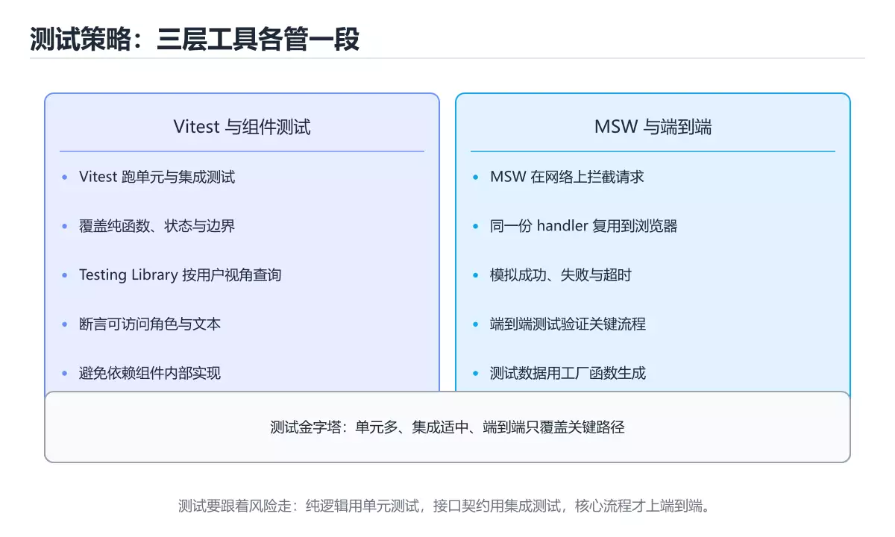

# TypeScript 测试策略

> 内容更新时间：2026-10-06 · 学习阶段：进阶 · 预计用时：50 分钟




## 本节知识框架

**课程定位**：所属分类 `typescript`（TypeScript），课程主题 `TypeScript 测试策略`，学习阶段 进阶，建议用时 50 分钟。

本课主线：Vitest、Testing Library 与 MSW 的组合用法。

**学完本课应当能够**
- 说清 `覆盖率` 与 `Mock` 的含义与区别，并各举一个正例和一个反例。
- 用本课示例验证 `单元测试边界` 的行为，记录输入、输出与失败条件。
- 遇到「依赖当前时间」这类问题时，能说出触发条件与修复顺序。

### 从概念到验证的学习链条

1. `覆盖率`：先掌握 测试执行到的代码、分支或需求占总量的比例，再用它解释 `Mock` 为什么会出现。
2. `Mock`：先掌握 测试替身：模拟外部依赖或慢操作，只在边界使用，避免把内部实现也一起 mock，再用它解释 `单元测试边界` 为什么会出现。
3. `单元测试边界`：先掌握 优先覆盖空值、越界与错误分支，只测正常路径的覆盖率没有意义，再用它解释 `快照测试` 为什么会出现。
4. `快照测试`：先掌握 把输出与基线快照比对，适合稳定的结构化输出，更新快照必须经过评审，再用它解释 本课示例的观察结果 为什么会出现。

**先修与衔接**：本课是「TypeScript」分类的第 14 课。先修内容：《Monorepo 工程实践》。《Monorepo 工程实践》里的 `Monorepo`、`缓存` 是本课的前提。相关或后续课程：《类型检查与构建性能优化》。

### 完成判据

- **定义关**：不看正文也能说明 `覆盖率` 是 测试执行到的代码、分支或需求占总量的比例，并指出一个反例。
- **机制关**：能按“输入 → 转换 → 输出 → 验证”复述 `TypeScript 测试策略`，而不是只背结论。
- **示例关**：能运行或推演 `TypeScript 测试策略` 的 `ts` 示例，并说明一个真实出现的标识符或字面量。
- **证据关**：能指出 `TypeScript 测试策略` 示例里的 调用了 `setupServer()`，并说明它支持或反驳了本课的哪一条结论。
- **排错关**：能复现 依赖当前时间，记录现象并按 冻结时间或注入时钟 修复。
- **迁移关**：能把 `Vitest`、`TestingLibrary`、`MSW`、`组件测试` 放进一个与 `TypeScript 测试策略` 不同的项目场景，并保持输入与验证条件可追踪。
- **复盘关**：学完 `TypeScript 测试策略` 后，用一句话写下仍然不确定的结论，并列出下一次验证需要的输入、环境和成功判据。

### 复习清单

- [ ] 能不看正文复述本课核心术语，并指出一个边界或反例。
- [ ] 能运行或推演本课示例，记录输入、输出与失败现象。
- [ ] 能完成一次自测，并把错题对照错误表定位原因。

## 核心概念定义

| 术语 | 操作性定义 | 常见边界与风险 |
| --- | --- | --- |
| 覆盖率 | 测试执行到的代码、分支或需求占总量的比例。 | 易错：关键路径没有测试保护；正确做法是对关键模块设定覆盖率目标。 |
| Mock | 测试替身：模拟外部依赖或慢操作，只在边界使用，避免把内部实现也一起 mock。 | 不同版本与依赖组合的行为可能不同，升级或换环境前要按官方变更说明重新验证。 |
| 单元测试边界 | 优先覆盖空值、越界与错误分支，只测正常路径的覆盖率没有意义。 | 只在「优先覆盖空值、越界与错误分支，只测正常路径的覆盖率没有意义」这一前提下成立，换输入或换环境要重新验证。 |
| 快照测试 | 把输出与基线快照比对，适合稳定的结构化输出，更新快照必须经过评审。 | 只在「把输出与基线快照比对，适合稳定的结构化输出，更新快照必须经过评审」这一前提下成立，换输入或换环境要重新验证。 |

## 原理与运行机制

### 机制总览

**教材衔接：工具选型速查**

| 需求 | 工具 | 说明 |
| --- | --- | --- |
| 单元测试 | Vitest | 快、与 Vite 共享配置 |
| 组件测试 | Testing Library | 面向用户行为断言 |
| 接口模拟 | MSW | 在网络层拦截，前后端一致 |
| 端到端 | Playwright | 多浏览器与自动等待 |
| 属性测试 | fast-check | 自动生成边界输入 |
| 覆盖率 | c8 / istanbul | 关注未覆盖分支 |

**教材衔接：版本与时效**

- 版本提示：Vitest 的行为在最近几个大版本里有过调整，升级「TypeScript 测试策略」前先用 onUnhandledRequest 复现当前输出，再对照官方发布说明逐条核对。
- 升级前先用 onUnhandledRequest 建立基线：记录版本、命令和输出，升级后只比较这些可观察量。

### 升级检查清单

- 先固定当前版本，跑通全部示例与测验，再升级工具链。
- 只改 Vitest 的版本变量，记录编译、测试与产物体积的变化。
- 升级后重点回归 Vitest 的默认值、警告信息与错误格式。
- 升级完成后更新本课「最后复核 / 下次复核」日期，并记录 Vitest 的版本变化。

### 机制拆解：每一步的输入、动作与输出

#### 1. `覆盖率`
- 输入：`Vitest`；本步把 测试执行到的代码、分支或需求占总量的比例 当作判断规则。
- 动作：围绕 `覆盖率` 保留中间状态，并记录它与 `Mock` 的对应关系。
- 输出：`Mock`，它可以被下一段代码、测试或记录继续使用。
- `覆盖率` 的失败条件：当没有覆盖率要求时，会出现关键路径没有测试保护。

#### 2. `Mock`
- 输入：`覆盖率`；本步把 测试替身：模拟外部依赖或慢操作，只在边界使用，避免把内部实现也一起 mock 当作判断规则。
- 动作：围绕 `Mock` 保留中间状态，并记录它与 `单元测试边界` 的对应关系。
- 输出：`单元测试边界`，它可以被下一段代码、测试或记录继续使用。
- `Mock` 的失败条件：不同版本与依赖组合的行为可能不同，升级或换环境前要按官方变更说明重新验证。

#### 3. `单元测试边界`
- 输入：`Mock`；本步把 优先覆盖空值、越界与错误分支，只测正常路径的覆盖率没有意义 当作判断规则。
- 动作：围绕 `单元测试边界` 保留中间状态，并记录它与 `快照测试` 的对应关系。
- 输出：`快照测试`，它可以被下一段代码、测试或记录继续使用。
- `单元测试边界` 的失败条件：只在「优先覆盖空值、越界与错误分支，只测正常路径的覆盖率没有意义」这一前提下成立，换输入或换环境要重新验证。

#### 4. `快照测试`
- 输入：`单元测试边界`；本步把 把输出与基线快照比对，适合稳定的结构化输出，更新快照必须经过评审 当作判断规则。
- 动作：围绕 `快照测试` 保留中间状态，并记录它与 `setupServer` 的对应关系。
- 输出：`setupServer`，它可以被下一段代码、测试或记录继续使用。
- `快照测试` 的失败条件：只在「把输出与基线快照比对，适合稳定的结构化输出，更新快照必须经过评审」这一前提下成立，换输入或换环境要重新验证。

### 示例中的可观察事实

1. 调用了 `setupServer()`；它对应的课程主题是 `TypeScript 测试策略`。
2. 调用了 `get()`；它对应的课程主题是 `TypeScript 测试策略`。
3. 调用了 `json()`；它对应的课程主题是 `TypeScript 测试策略`。
4. 调用了 `beforeEach()`；它对应的课程主题是 `TypeScript 测试策略`。
5. 调用了 `listen()`；它对应的课程主题是 `TypeScript 测试策略`。
6. 调用了 `afterEach()`；它对应的课程主题是 `TypeScript 测试策略`。
7. 调用了 `resetHandlers()`；它对应的课程主题是 `TypeScript 测试策略`。
8. 调用了 `afterAll()`；它对应的课程主题是 `TypeScript 测试策略`。

### 复现实验记录

- 环境：`TypeScript 测试策略` 使用 `ts` 示例，固定 `Vitest`、`TestingLibrary`、`MSW`、`组件测试` 作为第一组条件。
- 首轮输入：先确认 调用了 `setupServer()`，预测 `覆盖率` 会怎样变化。
- 基线观察：记录命令、输入、输出和错误原文，不用截图代替可复制的文本。
- 单变量修改：只改变 `Vitest`，观察 `快照测试` 是否仍满足定义。
- 失败注入：复现 依赖当前时间，确认现象是 换天就失败。
- 记录结论：把“修改前、修改后、预期变化、实际变化”写成四列表，这样复盘 `TypeScript 测试策略` 时才能区分概念错误与实现错误。

## 典型应用场景

- **依赖当前时间**：典型现象是换天就失败；正确做法是冻结时间或注入时钟。
- **用 `getByTestId` 满天飞**：典型现象是测的是实现；正确做法是优先用语义化查询。
- **只断言「不为空」**：典型现象是出错也通过；正确做法是断言具体值。
- **mock 业务内部函数**：典型现象是重构即全红；正确做法是只 mock 外部边界。

### 最小验证场景

- 准备：保留 `ts` 示例的原始输入，先记录 `TypeScript 测试策略` 的基线输出和完整运行命令。
- 观察：先核对 调用了 `setupServer()`，再改变一个与 `覆盖率` 相关的条件。
- 判定：新结果与 `TypeScript 测试策略` 的基线不同不等于错误；只有当差异破坏了 `覆盖率` 的定义或错误表中的约束，才判定为失败。

### 选择与边界

- 使用 `覆盖率` 时，先满足它的定义：测试执行到的代码、分支或需求占总量的比例；易错：关键路径没有测试保护；正确做法是对关键模块设定覆盖率目标。
- 使用 `Mock` 时，先满足它的定义：测试替身：模拟外部依赖或慢操作，只在边界使用，避免把内部实现也一起 mock；不同版本与依赖组合的行为可能不同，升级或换环境前要按官方变更说明重新验证。
- 使用 `单元测试边界` 时，先满足它的定义：优先覆盖空值、越界与错误分支，只测正常路径的覆盖率没有意义；只在「优先覆盖空值、越界与错误分支，只测正常路径的覆盖率没有意义」这一前提下成立，换输入或换环境要重新验证。
- 使用 `快照测试` 时，先满足它的定义：把输出与基线快照比对，适合稳定的结构化输出，更新快照必须经过评审；只在「把输出与基线快照比对，适合稳定的结构化输出，更新快照必须经过评审」这一前提下成立，换输入或换环境要重新验证。

## 代码/协议/SQL 示例

### 最小可验证示例

```ts
import { describe, expect, it, vi, beforeEach } from "vitest";
import { render, screen, userEvent } from "@testing-library/react";
import { http, HttpResponse } from "msw";
import { setupServer } from "msw/node";

// 用 MSW 在 HTTP 层模拟接口，测试代码不感知网络细节
const server = setupServer(
  http.get("/api/lessons", () =>
    HttpResponse.json([{ id: "1", title: "Python 基础" }]),
  ),
);

beforeEach(() => server.listen({ onUnhandledRequest: "error" }));
afterEach(() => server.resetHandlers());
afterAll(() => server.close());

describe("LessonList", () => {
  it("加载后展示课程标题", async () => {
    render(<LessonList />);
    // 断言用户可见的结果，而不是内部实现
    expect(await screen.findByText("Python 基础")).toBeInTheDocument();
  });

  it("接口失败时展示错误提示", async () => {
    server.use(
      http.get("/api/lessons", () => HttpResponse.json({}, { status: 500 })),
    );
    render(<LessonList />);
    expect(await screen.findByRole("alert")).toHaveTextContent("加载失败");
  });
});

// 纯函数测试：边界与错误输入优先
describe("parseAmount", () => {
  it.each([
    ["100", 100],
    [" 42 ", 42],
  ])("解析 %s", (input, expected) => {
    expect(parseAmount(input)).toBe(expected);
  });

  it("非法输入抛错", () => {
    expect(() => parseAmount("abc")).toThrowError(/无效金额/);
  });
});
```

**教材衔接：测试层级与比例**

| 层级 | 比例建议 | 关注点 |
| --- | --- | --- |
| 单元 | 约 70% | 纯函数、边界与错误分支 |
| 集成 | 约 20% | 模块协作、数据访问、接口 |
| 端到端 | 约 10% | 核心用户旅程 |

**教材衔接：测试替身速查**

| 替身 | 用途 | 注意 |
| --- | --- | --- |
| stub | 返回固定值 | 只验证一条路径 |
| spy | 记录调用 | 用于验证副作用 |
| mock 模块 | 替换整个模块 | 容易与实现耦合 |
| fake | 简化实现（内存版仓储） | 保留部分真实行为 |
| MSW | 拦截网络 | 最接近真实调用链 |

原则：**优先替身外部依赖，核心业务逻辑用真实实现。**

**教材衔接：零基础详解：前端与 Node 的测试实践**

### 一句话说清它是什么

TypeScript 项目常用 **Vitest 做单元与集成测试**、**Playwright 做端到端测试**。
写测试的核心不是覆盖率数字，而是**断言行为、隔离依赖、可重复运行**。

### 用生活比喻理解

| 类型 | 比喻 | 说明 |
| --- | --- | --- |
| 单元测试 | 零件检验 | 纯函数与规则，毫秒级 |
| 组件测试 | 装配检验 | 渲染、交互、可见性 |
| 集成测试 | 联调 | 多个模块 + 真实数据库 |
| E2E | 用户试用 | 浏览器里走完整流程 |
| Mock | 替身演员 | 隔离外部依赖 |

### 一个 Vitest 单元测试

```typescript
import { describe, expect, it } from "vitest";
import { formatPrice, parseTags } from "../src/format";

describe("formatPrice", () => {
  it("保留两位小数", () => {
    expect(formatPrice(19.9)).toBe("¥19.90");
  });

  it("负数抛错", () => {
    expect(() => formatPrice(-1)).toThrowError("金额不能为负");
  });
});

describe("parseTags", () => {
  it.each([
    ["a,b", ["a", "b"]],
    [" a , b ", ["a", "b"]],
    ["", []],
  ])("解析 %s", (input, expected) => {
    expect(parseTags(input)).toEqual(expected);
  });
});
```

### Mock：只在边界用

```typescript
import { vi, expect, it } from "vitest";
import { sendWelcome } from "../src/notify";

it("注册成功后发送欢迎邮件", async () => {
  const mailer = { send: vi.fn().mockResolvedValue({ ok: true }) };

  await sendWelcome({ email: "a@b.com" }, mailer);

  expect(mailer.send).toHaveBeenCalledOnce();
  expect(mailer.send).toHaveBeenCalledWith(
    expect.objectContaining({ to: "a@b.com" }),
  );
});
```

| 替身 | 用途 |
| --- | --- |
| `vi.fn()` | 记录调用、返回指定值 |
| `vi.spyOn(obj, "m")` | 监视真实对象的方法 |
| `vi.mock("module")` | 替换整个模块 |
| msw | 拦截网络请求（推荐） |

**原则**：只 mock 外部边界（网络、时间、随机、支付），不要 mock 自己的业务函数。

### 组件测试的三个关注点

```typescript
import { render, screen } from "@testing-library/react";
import userEvent from "@testing-library/user-event";

it("输入后点击按钮显示问候", async () => {
  render(<Greeter />);

  await userEvent.type(screen.getByLabelText("姓名"), "小明");
  await userEvent.click(screen.getByRole("button", { name: "打招呼" }));

  expect(screen.getByText("你好，小明")).toBeInTheDocument();
});

it("名称为空时按钮禁用", () => {
  render(<Greeter />);
  expect(screen.getByRole("button", { name: "打招呼" })).toBeDisabled();
});
```

| 关注点 | 做法 |
| --- | --- |
| 用户能看到什么 | 用 `getByRole`、`getByLabelText` |
| 用户能做什么 | 用 `userEvent` 而不是直接触发事件 |
| 不该测什么 | 内部 state、私有方法、class 名 |

### E2E：只覆盖关键路径

```typescript
import { expect, test } from "@playwright/test";

test("用户可以注册并登录", async ({ page }) => {
  await page.goto("/register");
  await page.getByLabel("邮箱").fill(`test${Date.now()}@example.com`);
  await page.getByLabel("密码").fill("Passw0rd!");
  await page.getByRole("button", { name: "注册" }).click();

  await expect(page).toHaveURL("/dashboard");
  await expect(page.getByText("欢迎回来")).toBeVisible();
});
```

```bash
npx playwright test                    # 跑全部
npx playwright test --ui               # 可视化调试
npx playwright test --trace on         # 记录轨迹，失败可回放
```

### 测试数据的三条纪律

```text
1. 每个用例自己造数据，不依赖别人留下的
2. 用时间戳或随机后缀避免唯一键冲突
3. 用例结束清理（或每次跑在独立数据库/事务里）
```

```typescript
// 冻结时间，避免「今天过了就失败」
import { vi } from "vitest";
vi.setSystemTime(new Date("2026-01-01T00:00:00Z"));
```

### 新手最容易踩的八个坑

| 坑 | 现象 | 正确做法 |
| --- | --- | --- |
| 依赖当前时间 | 换天就失败 | 冻结时间或注入时钟 |
| 用 `getByTestId` 满天飞 | 测的是实现 | 优先用语义化查询 |
| 只断言「不为空」 | 出错也通过 | 断言具体值 |
| mock 业务内部函数 | 重构即全红 | 只 mock 外部边界 |
| 测试之间共享状态 | 单独跑就挂 | 每个用例独立准备与清理 |
| 用 `sleep` 等异步 | 慢且不稳定 | 用 `waitFor` 或 `findBy` |
| E2E 覆盖所有细节 | 跑一次十几分钟 | 只保留关键路径 |
| 记得清理忘了断言 | 测试看似通过 | 清理后再补一次断言 |

### 手把手练习：给表单写三层测试

```typescript
// 1. 单元：校验函数
it("邮箱不合法时报错", () => {
  expect(validateEmail("bad")).toBe("邮箱格式不正确");
  expect(validateEmail("a@b.com")).toBeNull();
});

// 2. 组件：错误提示是否显示
it("输入非法邮箱时显示提示", async () => {
  render(<SignupForm />);
  await userEvent.type(screen.getByLabel("邮箱"), "bad");
  await userEvent.click(screen.getByRole("button", { name: "提交" }));
  expect(await screen.findByText("邮箱格式不正确")).toBeVisible();
});

// 3. E2E：完整注册流程
test("注册成功后跳转", async ({ page }) => {
  await page.goto("/register");
  await page.getByLabel("邮箱").fill(`u${Date.now()}@example.com`);
  await page.getByLabel("密码").fill("Passw0rd!");
  await page.getByRole("button", { name: "注册" }).click();
  await expect(page).toHaveURL("/dashboard");
});
```

### 学完自测

- [ ] 能说出单元、组件、集成、E2E 的分工。
- [ ] 知道什么时候才该用 mock。
- [ ] 能说出语义化查询为什么优于 test id。
- [ ] 知道测试依赖时间会带来什么问题。
- [ ] 能说出 E2E 只覆盖关键路径的原因。

### 示例精读：先找证据，再改一个条件

1. 调用了 `setupServer()`；它出现在 `TypeScript 测试策略` 的示例中，阅读时先确认它前后各发生了什么。
2. 调用了 `get()`；它出现在 `TypeScript 测试策略` 的示例中，阅读时先确认它前后各发生了什么。
3. 调用了 `json()`；它出现在 `TypeScript 测试策略` 的示例中，阅读时先确认它前后各发生了什么。
4. 调用了 `beforeEach()`；它出现在 `TypeScript 测试策略` 的示例中，阅读时先确认它前后各发生了什么。
5. 调用了 `listen()`；它出现在 `TypeScript 测试策略` 的示例中，阅读时先确认它前后各发生了什么。
6. 调用了 `afterEach()`；它出现在 `TypeScript 测试策略` 的示例中，阅读时先确认它前后各发生了什么。
7. 调用了 `resetHandlers()`；它出现在 `TypeScript 测试策略` 的示例中，阅读时先确认它前后各发生了什么。
8. 调用了 `afterAll()`；它出现在 `TypeScript 测试策略` 的示例中，阅读时先确认它前后各发生了什么。
- 在 `TypeScript 测试策略` 中与 `覆盖率` 对照：示例必须能支持 测试执行到的代码、分支或需求占总量的比例，否则说明这一段还缺少实现或验证步骤。
- 在 `TypeScript 测试策略` 中与 `Mock` 对照：示例必须能支持 测试替身：模拟外部依赖或慢操作，只在边界使用，避免把内部实现也一起 mock，否则说明这一段还缺少实现或验证步骤。
- 在 `TypeScript 测试策略` 中与 `单元测试边界` 对照：示例必须能支持 优先覆盖空值、越界与错误分支，只测正常路径的覆盖率没有意义，否则说明这一段还缺少实现或验证步骤。
- 在 `TypeScript 测试策略` 中与 `快照测试` 对照：示例必须能支持 把输出与基线快照比对，适合稳定的结构化输出，更新快照必须经过评审，否则说明这一段还缺少实现或验证步骤。

## 时间/空间复杂度或性能分析

**性能关注点（TypeScript 测试策略）**：编译期类型检查与运行期代码是两套开销：分别记录构建时间与运行时耗时。

**测量方法**：以 `TypeScript 测试策略` 的 `Vitest` 场景为对象，固定输入跑一遍记录基线，再把规模或并发度提高一个数量级复测；两次结果的差值与波动范围才是结论依据。

### 需要控制的变量与记录项

- `TypeScript 测试策略` 的 `Vitest`：固定它的版本、输入范围和资源上限，分别记录速度、内存与失败率的变化。
- `TypeScript 测试策略` 的 `TestingLibrary`：固定它的版本、输入范围和资源上限，分别记录速度、内存与失败率的变化。
- `TypeScript 测试策略` 的 `MSW`：固定它的版本、输入范围和资源上限，分别记录速度、内存与失败率的变化。
- `TypeScript 测试策略` 的 `组件测试`：固定它的版本、输入范围和资源上限，分别记录速度、内存与失败率的变化。
- `TypeScript 测试策略` 的 `覆盖率`：固定它的版本、输入范围和资源上限，分别记录速度、内存与失败率的变化。
- `TypeScript 测试策略` 中 `覆盖率` 的边界：易错：关键路径没有测试保护；正确做法是对关键模块设定覆盖率目标。达到边界时不要外推，必须重新测量。
- `TypeScript 测试策略` 中 `Mock` 的边界：不同版本与依赖组合的行为可能不同，升级或换环境前要按官方变更说明重新验证。达到边界时不要外推，必须重新测量。
- `TypeScript 测试策略` 中 `单元测试边界` 的边界：只在「优先覆盖空值、越界与错误分支，只测正常路径的覆盖率没有意义」这一前提下成立，换输入或换环境要重新验证。达到边界时不要外推，必须重新测量。
- `TypeScript 测试策略` 中 `快照测试` 的边界：只在「把输出与基线快照比对，适合稳定的结构化输出，更新快照必须经过评审」这一前提下成立，换输入或换环境要重新验证。达到边界时不要外推，必须重新测量。
- `TypeScript 测试策略` 的代码证据：先验证 调用了 `setupServer()`，再记录该路径的输入规模与耗时；只看代码行数不能推出复杂度。

## 常见误区与易错点

| 容易写错的做法 | 实际现象 | 原因与正确做法 |
| --- | --- | --- |
| 依赖当前时间 | 换天就失败 | 冻结时间或注入时钟 |
| 用 `getByTestId` 满天飞 | 测的是实现 | 优先用语义化查询 |
| 只断言「不为空」 | 出错也通过 | 断言具体值 |
| mock 业务内部函数 | 重构即全红 | 只 mock 外部边界 |
| 测试之间共享状态 | 单独跑就挂 | 每个用例独立准备与清理 |
| 用 `sleep` 等异步 | 慢且不稳定 | 用 `waitFor` 或 `findBy` |
| E2E 覆盖所有细节 | 跑一次十几分钟 | 只保留关键路径 |
| 记得清理忘了断言 | 测试看似通过 | 清理后再补一次断言 |
| 只测实现细节 | 重构一次就大量失败。 | 面向行为与契约编写测试。 |
| 测试与运行时脱节 | 编译通过但运行失败。 | 覆盖真实运行时路径与边界。 |
| 没有覆盖率要求 | 关键路径没有测试保护。 | 对关键模块设定覆盖率目标。 |

### 现场 1：依赖当前时间

**症状**：换天就失败。

**根因与修复**：冻结时间或注入时钟。

**自检**：在本课示例里复现「依赖当前时间」，改成冻结时间或注入时钟后重跑；如果症状消失且失败路径按预期变化，说明定位正确。

### 现场 2：用 `getByTestId` 满天飞

**症状**：测的是实现。

**根因与修复**：优先用语义化查询。

**自检**：在本课示例里复现「用 `getByTestId` 满天飞」，改成优先用语义化查询后重跑；如果症状消失且失败路径按预期变化，说明定位正确。

### 现场 3：只断言「不为空」

**症状**：出错也通过。

**根因与修复**：断言具体值。

**自检**：在本课示例里复现「只断言「不为空」」，改成断言具体值后重跑；如果症状消失且失败路径按预期变化，说明定位正确。

### 现场 4：mock 业务内部函数

**症状**：重构即全红。

**根因与修复**：只 mock 外部边界。

**自检**：在本课示例里复现「mock 业务内部函数」，改成只 mock 外部边界后重跑；如果症状消失且失败路径按预期变化，说明定位正确。

### 现场 5：测试之间共享状态

**症状**：单独跑就挂。

**根因与修复**：每个用例独立准备与清理。

**自检**：在本课示例里复现「测试之间共享状态」，改成每个用例独立准备与清理后重跑；如果症状消失且失败路径按预期变化，说明定位正确。

### 现场 6：用 `sleep` 等异步

**症状**：慢且不稳定。

**根因与修复**：用 `waitFor` 或 `findBy`。

**自检**：在本课示例里复现「用 `sleep` 等异步」，改成用 `waitFor` 或 `findBy`后重跑；如果症状消失且失败路径按预期变化，说明定位正确。

### 现场 7：E2E 覆盖所有细节

**症状**：跑一次十几分钟。

**根因与修复**：只保留关键路径。

**自检**：在本课示例里复现「E2E 覆盖所有细节」，改成只保留关键路径后重跑；如果症状消失且失败路径按预期变化，说明定位正确。

### 现场 8：记得清理忘了断言

**症状**：测试看似通过。

**根因与修复**：清理后再补一次断言。

**自检**：在本课示例里复现「记得清理忘了断言」，改成清理后再补一次断言后重跑；如果症状消失且失败路径按预期变化，说明定位正确。

### 现场 9：只测实现细节

**症状**：重构一次就大量失败。

**根因与修复**：面向行为与契约编写测试。

**自检**：在本课示例里复现「只测实现细节」，改成面向行为与契约编写测试后重跑；如果症状消失且失败路径按预期变化，说明定位正确。

## 与其他知识点的关系

- **先修**：`Monorepo 工程实践`。本课默认这些内容已经掌握。
- **相关或后续**：`类型检查与构建性能优化`。本课术语会在这些课程里继续使用。
- **术语归属**：`覆盖率`、`Mock`、`单元测试边界` 的定义以本课「核心概念定义」为准，换到其他课程时先确认定义是否被改写。
- 同一分类的《实战：TypeScript 类型安全 CLI》也涉及 `Vitest`；两课衔接时先确认这个术语的定义是否一致。

### 先修与后续术语接口

- `Monorepo 工程实践`：两者通过本分类的学习顺序衔接，阅读时重点比较各自的输入与失败条件。
- `类型检查与构建性能优化`：两者通过本分类的学习顺序衔接，阅读时重点比较各自的输入与失败条件。

### 容易混淆的相邻概念

- `覆盖率` 与 `Mock`：前者强调 测试执行到的代码、分支或需求占总量的比例；后者强调 测试替身：模拟外部依赖或慢操作，只在边界使用，避免把内部实现也一起 mock。判断时分别检查两条定义的适用范围，不要只看名称相似就互换。
- `Mock` 与 `单元测试边界`：前者强调 测试替身：模拟外部依赖或慢操作，只在边界使用，避免把内部实现也一起 mock；后者强调 优先覆盖空值、越界与错误分支，只测正常路径的覆盖率没有意义。判断时分别检查两条定义的适用范围，不要只看名称相似就互换。
- `单元测试边界` 与 `快照测试`：前者强调 优先覆盖空值、越界与错误分支，只测正常路径的覆盖率没有意义；后者强调 把输出与基线快照比对，适合稳定的结构化输出，更新快照必须经过评审。判断时分别检查两条定义的适用范围，不要只看名称相似就互换。

## 自测题与参考答案

> 先独立作答，再对照参考答案；答案都能在本课正文、术语表或错误表里找到依据。

### 自测 1（概念复述）

不看正文，写出 `覆盖率` 的操作性定义，并说明它与 `Mock` 的区别。

**参考答案**：测试执行到的代码、分支或需求占总量的比例。

`Mock` 的定位是：测试替身：模拟外部依赖或慢操作，只在边界使用，避免把内部实现也一起 mock；两者的差别要从适用对象与失败模式上说明。

### 自测 2（排错）

本课错误表记录了「依赖当前时间」这类做法。请写出它会出现的现象、根因，以及修复顺序。

**参考答案**：现象是换天就失败；正确做法是冻结时间或注入时钟。修复时先复现现象并保留证据，再改动一处假设重跑，确认现象消失。

### 自测 3（动手验证）

运行本课的 `ts` 示例，把其中的 `"vitest"` 换成一个边界值后重新运行，记录输出与错误信息。

**参考答案**：正常输入下 `ts` 示例应当复现正文给出的结果；把 `"vitest"` 换成边界值后，如果结果改变或报错，先核对它是否满足 `TypeScript 测试策略` 中`覆盖率` 的适用范围，再检查错误表里是否有同类现象。

### 自测 4（代码阅读）

阅读本课开头的 `ts` 示例，说明它体现了`覆盖率` 的哪一条性质，并指出改动哪个输入会让这条性质不再成立。

**参考答案**：`覆盖率` 的定义是 测试执行到的代码、分支或需求占总量的比例，示例正是在实现这条定义。改动与 `覆盖率` 有关的一个输入后，如果结果不再符合 `TypeScript 测试策略` 的正文描述，就说明该性质只在当前前提成立。

### 自测 5（迁移）

把 `TypeScript 测试策略` 的方法迁移到自己的项目：围绕 `覆盖率` 写出一个与错误表同类的风险点，并说明触发条件和检验方式。

**参考答案**：例如「没有覆盖率要求」，它会导致关键路径没有测试保护；检验方式是按对关键模块设定覆盖率目标改一处再复现，确认现象消失且没有引入新的失败分支。

### 自测 6（对比）

用一个表格对比 `覆盖率` 与 `Mock`：各写一行适用场景、一行失败表现。

**参考答案**：`覆盖率` 的定义是测试执行到的代码、分支或需求占总量的比例；`Mock` 的定义是测试替身：模拟外部依赖或慢操作，只在边界使用，避免把内部实现也一起 mock。两者的失败表现分别对应本课错误表里与本术语相关的行。

### 自测 7（排错顺序）

面对「依赖当前时间」引发的问题，请把“复现 换天就失败 → 保留证据 → 冻结时间或注入时钟 → 回归验证”四步写成可执行的检查清单。

**参考答案**：第一步按换天就失败复现；第二步记录输入、版本与完整报错；第三步按冻结时间或注入时钟只改一处；第四步重跑并确认失败路径也按预期变化。

### 自测 8（边界判断）

针对 `快照测试`，分别写出“可以使用”的条件和“结论不再成立”的条件。

**参考答案**：只在「把输出与基线快照比对，适合稳定的结构化输出，更新快照必须经过评审」这一前提下成立，换输入或换环境要重新验证。 同时要把 `快照测试` 的定义 把输出与基线快照比对，适合稳定的结构化输出，更新快照必须经过评审 与实际输入逐项对照。

### 自测 9（机制重建）

不看正文，按输入、转换、输出、验证四段重建 `覆盖率` → `Mock` → `单元测试边界` → `快照测试` 的作用链。

**参考答案**：起点是 `覆盖率` 的定义 测试执行到的代码、分支或需求占总量的比例；中间每一步都保留可观察状态；终点由 `快照测试` 检查，失败时回到错误表定位第一个偏离定义的步骤。

### 自测 10（综合排错）

在 `TypeScript 测试策略` 中，现象是 关键路径没有测试保护。请围绕 没有覆盖率要求 写出最小复现、关键证据、修复动作和回归验证，并说明为什么不能只凭一次运行下结论。

**参考答案**：先复现 没有覆盖率要求，记录输入与完整错误；再按 对关键模块设定覆盖率目标 只改一处。回归时同时跑正常路径和边界路径，只有两次结果都可解释，才把修复视为完成。

### 自测 11（一分钟复述）

用每分钟约 200 字的速度复述 `TypeScript 测试策略`：先给主问题，再按顺序说出 `覆盖率`、`Mock`、`单元测试边界`、`快照测试`，最后给一个失败案例。

**自评标准**：主问题必须对应 Vitest、Testing Library 与 MSW 的组合用法；每个术语都要能接上一句定义或边界；失败案例必须写成可观察现象，不能用“可能有风险”代替证据。

## 术语速查

| 术语 | 一句话说明 |
| --- | --- |
| `覆盖率` | 测试执行到的代码、分支或需求占总量的比例。 |
| `Mock` | 测试替身：模拟外部依赖或慢操作，只在边界使用，避免把内部实现也一起 mock。 |
| `单元测试边界` | 优先覆盖空值、越界与错误分支，只测正常路径的覆盖率没有意义。 |
| `快照测试` | 把输出与基线快照比对，适合稳定的结构化输出，更新快照必须经过评审。 |

**术语关系**：`覆盖率`（测试执行到的代码、分支或需求占总量的比例） → `Mock`（测试替身：模拟外部依赖或慢操作） → `单元测试边界`（优先覆盖空值、越界与错误分支） → `快照测试`（把输出与基线快照比对）。

## 考点精讲

`TypeScript 测试策略` 的题库有 6 道题，下面逐题给出题干、正确项与判断依据：先自己作答，再核对正确项，最后回到正文对应小节复核。

### 考点 1：第 1 题

- **题目**：`TypeScript 测试策略` 的示例代码用于验证 `覆盖率`，其背景是Vitest、Testing Library 与 MSW 的组合用法。代码的真实内容是下面哪一项？
- **正确项**：出现字面量 `非法输入抛错`
- **判断依据**：这道题落在术语 `覆盖率` 上：测试执行到的代码、分支或需求占总量的比例。复习时把 `覆盖率` 的定义、适用边界和一个反例一起说清楚，再回到「核心概念定义」核对原文。

### 考点 2：第 2 题

- **题目**：组件测试应该断言什么？
- **正确项**：用户可见的行为与文本
- **判断依据**：这道题检验本课主问题：Vitest、Testing Library 与 MSW 的组合用法。复习时先复述本课主问题，再举一个会让结论失效的输入。

### 考点 3：第 3 题

- **题目**：测试里等待异步结果，推荐使用？
- **正确项**：findBy 系列查询或带轮询的断言（自动等待）
- **判断依据**：这道题检验本课主问题：Vitest、Testing Library 与 MSW 的组合用法。复习时先复述本课主问题，再举一个会让结论失效的输入。

### 考点 4：第 4 题

- **题目**：围绕“TypeScript 测试策略”中的 Vitest、TestingLibrary、MSW，下列哪两项是本课强调的实践判断？
- **正确项**：验证 TestingLibrary 时要固定版本并覆盖边界输入，结论才可复现；学习 Vitest 时要同时说明输入、输出和失败路径，不能只看正常流程
- **判断依据**：这道题检验本课主问题：Vitest、Testing Library 与 MSW 的组合用法。复习时先复述本课主问题，再举一个会让结论失效的输入。

### 考点 5：第 5 题

- **题目**：关于覆盖率，正确的理解是？
- **正确项**：无断言的测试也能拉高覆盖率
- **判断依据**：这道题落在术语 `覆盖率` 上：测试执行到的代码、分支或需求占总量的比例。复习时把 `覆盖率` 的定义、适用边界和一个反例一起说清楚，再回到「核心概念定义」核对原文。

### 考点 6：第 6 题

- **题目**：填空：补齐下面这段术语说明中的空缺。课程 `Vitest、Testing Library 与 MSW 的组合用法。`，这段说明是：`____`：优先覆盖空值、越界与错误分支，只测正常路径的覆盖率没有意义。空缺处应填哪个术语？
- **正确项**：单元测试边界
- **判断依据**：这道题落在术语 `覆盖率` 上：测试执行到的代码、分支或需求占总量的比例。复习时把 `覆盖率` 的定义、适用边界和一个反例一起说清楚，再回到「核心概念定义」核对原文。

### 考点 7：`覆盖率`

- **要点**：测试执行到的代码、分支或需求占总量的比例。
- **覆盖率 的边界**：易错：关键路径没有测试保护；正确做法是对关键模块设定覆盖率目标。

### 考点 8：`Mock`

- **要点**：测试替身：模拟外部依赖或慢操作，只在边界使用，避免把内部实现也一起 mock。
- **Mock 的边界**：不同版本与依赖组合的行为可能不同，升级或换环境前要按官方变更说明重新验证。

### 考点 9：`单元测试边界`

- **要点**：优先覆盖空值、越界与错误分支，只测正常路径的覆盖率没有意义。
- **单元测试边界 的边界**：只在「优先覆盖空值、越界与错误分支，只测正常路径的覆盖率没有意义」这一前提下成立，换输入或换环境要重新验证。

### 考点 10：`快照测试`

- **要点**：把输出与基线快照比对，适合稳定的结构化输出，更新快照必须经过评审。
- **快照测试 的边界**：只在「把输出与基线快照比对，适合稳定的结构化输出，更新快照必须经过评审」这一前提下成立，换输入或换环境要重新验证。

### 考点 11：排错——依赖当前时间

- **现象**：换天就失败。
- **处理**：冻结时间或注入时钟。

### 考点 12：排错——用 `getByTestId` 满天飞

- **现象**：测的是实现。
- **处理**：优先用语义化查询。

### 考点 13：综合辨析——`覆盖率` 与 `快照测试`

- **辨析点**：`覆盖率` 的定义是 测试执行到的代码、分支或需求占总量的比例；`快照测试` 的定义是 把输出与基线快照比对，适合稳定的结构化输出，更新快照必须经过评审。
- **答题要求**：面对 `TypeScript 测试策略` 的题目，先判断描述的是 `覆盖率` 还是 `快照测试`，再归到对应定义，最后写出一个会让该定义失效的边界输入。

### 考点 14：排错评分点

- **现象分**：能写出 换天就失败，而不是只写“程序有错”。
- **证据分**：保留触发 依赖当前时间 的输入、版本和错误原文。
- **修复分**：按 冻结时间或注入时钟 只改一处，并同时回归正常路径与边界路径。

## 内容元数据

- 内容版本：v2.0
- 最后更新：2026-10-06
- 学习阶段：进阶
- 适用环境：TypeScript 5.x / Node.js 22+
；本课聚焦 Vitest。
- 内容来源：内置结构化课程与工程实践整理
- 相关主题：Vitest、TestingLibrary、MSW、组件测试、覆盖率
- 质量版本：P0 测验标准 + P1 覆盖扩展 + P2 体验补全

## 参考资料与复核

- 最后复核：2026-10-04
- 下次复核：2027-03-17
- 复核范围：版本兼容、API 行为、安全建议与工程实践
- 来源性质：官方文档、标准或权威教材；本课核对关键词：Vitest、TestingLibrary、MSW、组件测试、覆盖率。

| 参考资料 | 本课用途 |
| --- | --- |
| [TypeScript Handbook](https://www.typescriptlang.org/docs/handbook/intro.html) | 类型系统与语言指南 |
| [Everyday Types](https://www.typescriptlang.org/docs/handbook/2/everyday-types.html) | 常用类型与收窄 |
| [装饰器文档](https://www.typescriptlang.org/docs/handbook/decorators.html) | 装饰器与元数据 |

| [本课术语索引：TypeScript 测试策略](#核心概念定义) | 按本课输入、术语边界和错误表现逐项核对 |
> 「TypeScript 测试策略」的链接用于离线阅读后的延伸核对；App 不会自动联网。