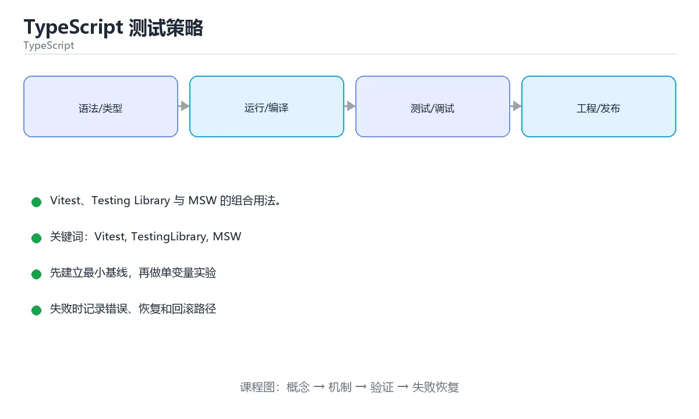

# TypeScript 测试策略



> 内容更新时间：2026-10-03 · 学习阶段：进阶 · 预计用时：18 分钟

## 学习目标

- 能用自己的话解释「TypeScript 测试策略」解决了什么问题，而不是只背术语。
- 能说清 「Vitest」、「TestingLibrary」、「MSW」、「组件测试」 之间的关系，并分别举出一个例子。
- 能把本课知识放回「TypeScript」的知识体系，说明它和相邻主题的边界。
- 能完成本课练习，并用验收标准检查自己的结果。

> 一句话摘要：Vitest、Testing Library 与 MSW 的组合用法。

## 前置知识

- 先完成上一课《Monorepo 工程实践》；如果已经掌握，可以直接用本课练习自测。
- 本课阶段：进阶。建议先掌握同一分类的基础课程，并能独立运行正文中的最小示例。
- 开始前先复习：Vitest、TestingLibrary、MSW。
- 如果某一步看不懂，先记录具体卡点，完成练习后再回头读一遍。


## 工具选型速查

| 需求 | 工具 | 说明 |
| --- | --- | --- |
| 单元测试 | Vitest | 快、与 Vite 共享配置 |
| 组件测试 | Testing Library | 面向用户行为断言 |
| 接口模拟 | MSW | 在网络层拦截，前后端一致 |
| 端到端 | Playwright | 多浏览器与自动等待 |
| 属性测试 | fast-check | 自动生成边界输入 |
| 覆盖率 | c8 / istanbul | 关注未覆盖分支 |

## 测试层级与比例

| 层级 | 比例建议 | 关注点 |
| --- | --- | --- |
| 单元 | 约 70% | 纯函数、边界与错误分支 |
| 集成 | 约 20% | 模块协作、数据访问、接口 |
| 端到端 | 约 10% | 核心用户旅程 |

```ts
import { describe, expect, it, vi, beforeEach } from "vitest";
import { render, screen, userEvent } from "@testing-library/react";
import { http, HttpResponse } from "msw";
import { setupServer } from "msw/node";

// 用 MSW 在 HTTP 层模拟接口，测试代码不感知网络细节
const server = setupServer(
  http.get("/api/lessons", () =>
    HttpResponse.json([{ id: "1", title: "Python 基础" }]),
  ),
);

beforeEach(() => server.listen({ onUnhandledRequest: "error" }));
afterEach(() => server.resetHandlers());
afterAll(() => server.close());

describe("LessonList", () => {
  it("加载后展示课程标题", async () => {
    render(<LessonList />);
    // 断言用户可见的结果，而不是内部实现
    expect(await screen.findByText("Python 基础")).toBeInTheDocument();
  });

  it("接口失败时展示错误提示", async () => {
    server.use(
      http.get("/api/lessons", () => HttpResponse.json({}, { status: 500 })),
    );
    render(<LessonList />);
    expect(await screen.findByRole("alert")).toHaveTextContent("加载失败");
  });
});

// 纯函数测试：边界与错误输入优先
describe("parseAmount", () => {
  it.each([
    ["100", 100],
    [" 42 ", 42],
  ])("解析 %s", (input, expected) => {
    expect(parseAmount(input)).toBe(expected);
  });

  it("非法输入抛错", () => {
    expect(() => parseAmount("abc")).toThrowError(/无效金额/);
  });
});
```

## 测试替身速查

| 替身 | 用途 | 注意 |
| --- | --- | --- |
| stub | 返回固定值 | 只验证一条路径 |
| spy | 记录调用 | 用于验证副作用 |
| mock 模块 | 替换整个模块 | 容易与实现耦合 |
| fake | 简化实现（内存版仓储） | 保留部分真实行为 |
| MSW | 拦截网络 | 最接近真实调用链 |

原则：**优先替身外部依赖，核心业务逻辑用真实实现。**

## 常见错误对照表

| 容易踩的做法 | 实际现象 | 原因与正确做法 |
| --- | --- | --- |
| 断言组件内部状态 | 重构后大量失败 | 断言用户可见行为 |
| 到处 mock 模块 | 测试通过但线上失败 | 只替换外部依赖 |
| 用固定延时等待 | 偶发失败 | 用 `findBy*` 等自动等待 |
| 忽略未处理的请求 | 测试静默通过 | MSW 设 `onUnhandledRequest: "error"` |
| 只测正常路径 | 异常分支无覆盖 | 覆盖错误、空值与边界 |
| 覆盖率当目标 | 无断言测试刷指标 | 关注分支与断言质量 |

## 自测清单

- [ ] 单元测试覆盖边界与异常分支。
- [ ] 组件测试断言用户可见行为。
- [ ] 网络用 MSW 在 HTTP 层模拟，未处理请求会报错。
- [ ] 端到端只覆盖核心旅程，保持稳定。
- [ ] 覆盖率看未覆盖分支而非数字高低。

<!-- appendix:v3 -->

## 零基础详解：前端与 Node 的测试实践

### 一句话说清它是什么

TypeScript 项目常用 **Vitest 做单元与集成测试**、**Playwright 做端到端测试**。
写测试的核心不是覆盖率数字，而是**断言行为、隔离依赖、可重复运行**。

### 用生活比喻理解

| 类型 | 比喻 | 说明 |
| --- | --- | --- |
| 单元测试 | 零件检验 | 纯函数与规则，毫秒级 |
| 组件测试 | 装配检验 | 渲染、交互、可见性 |
| 集成测试 | 联调 | 多个模块 + 真实数据库 |
| E2E | 用户试用 | 浏览器里走完整流程 |
| Mock | 替身演员 | 隔离外部依赖 |

### 一个 Vitest 单元测试

```typescript
import { describe, expect, it } from "vitest";
import { formatPrice, parseTags } from "../src/format";

describe("formatPrice", () => {
  it("保留两位小数", () => {
    expect(formatPrice(19.9)).toBe("¥19.90");
  });

  it("负数抛错", () => {
    expect(() => formatPrice(-1)).toThrowError("金额不能为负");
  });
});

describe("parseTags", () => {
  it.each([
    ["a,b", ["a", "b"]],
    [" a , b ", ["a", "b"]],
    ["", []],
  ])("解析 %s", (input, expected) => {
    expect(parseTags(input)).toEqual(expected);
  });
});
```

### Mock：只在边界用

```typescript
import { vi, expect, it } from "vitest";
import { sendWelcome } from "../src/notify";

it("注册成功后发送欢迎邮件", async () => {
  const mailer = { send: vi.fn().mockResolvedValue({ ok: true }) };

  await sendWelcome({ email: "a@b.com" }, mailer);

  expect(mailer.send).toHaveBeenCalledOnce();
  expect(mailer.send).toHaveBeenCalledWith(
    expect.objectContaining({ to: "a@b.com" }),
  );
});
```

| 替身 | 用途 |
| --- | --- |
| `vi.fn()` | 记录调用、返回指定值 |
| `vi.spyOn(obj, "m")` | 监视真实对象的方法 |
| `vi.mock("module")` | 替换整个模块 |
| msw | 拦截网络请求（推荐） |

**原则**：只 mock 外部边界（网络、时间、随机、支付），不要 mock 自己的业务函数。

### 组件测试的三个关注点

```typescript
import { render, screen } from "@testing-library/react";
import userEvent from "@testing-library/user-event";

it("输入后点击按钮显示问候", async () => {
  render(<Greeter />);

  await userEvent.type(screen.getByLabelText("姓名"), "小明");
  await userEvent.click(screen.getByRole("button", { name: "打招呼" }));

  expect(screen.getByText("你好，小明")).toBeInTheDocument();
});

it("名称为空时按钮禁用", () => {
  render(<Greeter />);
  expect(screen.getByRole("button", { name: "打招呼" })).toBeDisabled();
});
```

| 关注点 | 做法 |
| --- | --- |
| 用户能看到什么 | 用 `getByRole`、`getByLabelText` |
| 用户能做什么 | 用 `userEvent` 而不是直接触发事件 |
| 不该测什么 | 内部 state、私有方法、class 名 |

### E2E：只覆盖关键路径

```typescript
import { expect, test } from "@playwright/test";

test("用户可以注册并登录", async ({ page }) => {
  await page.goto("/register");
  await page.getByLabel("邮箱").fill(`test${Date.now()}@example.com`);
  await page.getByLabel("密码").fill("Passw0rd!");
  await page.getByRole("button", { name: "注册" }).click();

  await expect(page).toHaveURL("/dashboard");
  await expect(page.getByText("欢迎回来")).toBeVisible();
});
```

```bash
npx playwright test                    # 跑全部
npx playwright test --ui               # 可视化调试
npx playwright test --trace on         # 记录轨迹，失败可回放
```

### 测试数据的三条纪律

```text
1. 每个用例自己造数据，不依赖别人留下的
2. 用时间戳或随机后缀避免唯一键冲突
3. 用例结束清理（或每次跑在独立数据库/事务里）
```

```typescript
// 冻结时间，避免「今天过了就失败」
import { vi } from "vitest";
vi.setSystemTime(new Date("2026-01-01T00:00:00Z"));
```

### 新手最容易踩的八个坑

| 坑 | 现象 | 正确做法 |
| --- | --- | --- |
| 依赖当前时间 | 换天就失败 | 冻结时间或注入时钟 |
| 用 `getByTestId` 满天飞 | 测的是实现 | 优先用语义化查询 |
| 只断言「不为空」 | 出错也通过 | 断言具体值 |
| mock 业务内部函数 | 重构即全红 | 只 mock 外部边界 |
| 测试之间共享状态 | 单独跑就挂 | 每个用例独立准备与清理 |
| 用 `sleep` 等异步 | 慢且不稳定 | 用 `waitFor` 或 `findBy` |
| E2E 覆盖所有细节 | 跑一次十几分钟 | 只保留关键路径 |
| 记得清理忘了断言 | 测试看似通过 | 清理后再补一次断言 |

### 手把手练习：给表单写三层测试

```typescript
// 1. 单元：校验函数
it("邮箱不合法时报错", () => {
  expect(validateEmail("bad")).toBe("邮箱格式不正确");
  expect(validateEmail("a@b.com")).toBeNull();
});

// 2. 组件：错误提示是否显示
it("输入非法邮箱时显示提示", async () => {
  render(<SignupForm />);
  await userEvent.type(screen.getByLabel("邮箱"), "bad");
  await userEvent.click(screen.getByRole("button", { name: "提交" }));
  expect(await screen.findByText("邮箱格式不正确")).toBeVisible();
});

// 3. E2E：完整注册流程
test("注册成功后跳转", async ({ page }) => {
  await page.goto("/register");
  await page.getByLabel("邮箱").fill(`u${Date.now()}@example.com`);
  await page.getByLabel("密码").fill("Passw0rd!");
  await page.getByRole("button", { name: "注册" }).click();
  await expect(page).toHaveURL("/dashboard");
});
```

### 学完自测

- [ ] 能说出单元、组件、集成、E2E 的分工。
- [ ] 知道什么时候才该用 mock。
- [ ] 能说出语义化查询为什么优于 test id。
- [ ] 知道测试依赖时间会带来什么问题。
- [ ] 能说出 E2E 只覆盖关键路径的原因。

## 动手练习

<!-- practice-diversified:v1 -->

> 本课练习重点：围绕「Vitest、TestingLibrary、MSW」完成复述、实验和交付，每个结果都要能被别人检查。

先让类型检查通过，再制造一次类型错误，最后补运行时校验与测试。

### 练习 1：建立心智模型（10 分钟）

合上教程，用 3～5 句话回答：

1. 「TypeScript 测试策略」解决了什么问题？
2. 如果没有它，会出现什么具体后果？
3. 它和「TestingLibrary」是什么关系？

**验收标准**：至少出现一个本课关键词，并写出一个反例、边界条件或失效场景。

### 练习 2：做一次可控实验（20 分钟）

从正文中选一个最小示例，完成以下操作：

1. 先预测修改一个参数、输入或步骤后的结果。
2. 再实际执行或逐步推演，记录真实结果。
3. 如果结果与预测不同，写出差异原因。

**验收标准**：留下「原例 → 改动 → 预测 → 结果 → 原因」五步记录。

### 练习 3：交付一个小结果（30 分钟）

写一个最小类型示例，先让 `tsc --noEmit` 通过，再故意制造一次类型错误。

任务要求：

- 结果必须能被别人检查，不能只写“我已经理解了”。
- 至少覆盖「Vitest」和「TestingLibrary」两个关键词。
- 写出 1 个仍然不确定的问题，以及下一步如何验证。

> 提示：时间有限时优先做练习 1 和练习 2；练习 3 可以拆成两次完成。

## 本课小结

- 核心问题：「TypeScript 测试策略」不是孤立术语，而是在「TypeScript」中解决一类具体问题。
- 关键关系：先分清「Vitest」与「TestingLibrary」的职责，再理解「MSW」的适用边界。
- 判断标准：能解释正常场景、边界条件和失败场景，才算真正掌握。
- 下一步：完成练习后，用自己的话写下 3 条要点，再去做本课测验。

<!-- scaffold:v1 -->

<!-- p2-enrichment:v1 -->

## English Overview

**Title:** Testing in TypeScript

**Summary:** Vitest, Testing Library and MSW in practice.

**Category:** TypeScript  
**Level:** 进阶  
**Key terms:** Vitest, TestingLibrary, MSW, 组件测试, 覆盖率

> The full tutorial is written in Chinese. This bilingual overview helps English readers identify the topic, scope and key terms before studying the detailed examples.

## 内容元数据

- 内容版本：v2.0
- 最后更新：2026-10-03
- 学习阶段：进阶
- 适用环境：TypeScript 5.x / Node.js 22+
- 内容来源：内置结构化课程与工程实践整理
- 相关主题：Vitest、TestingLibrary、MSW、组件测试、覆盖率
- 质量版本：P0 测验标准 + P1 覆盖扩展 + P2 体验补全

<!-- p2-references:v1 -->

## 参考资料与复核

- 最后复核：2026-10-04
- 下次复核：2027-04-04
- 复核范围：版本兼容、API 行为、安全建议与工程实践
- 来源性质：官方文档与标准；本课正文为离线教学重组，不复制原文

| 参考资料 | 本课用途 |
| --- | --- |
| [TypeScript Handbook](https://www.typescriptlang.org/docs/handbook/intro.html) | 类型系统与编译配置 |
| [Decorators 与模块](https://www.typescriptlang.org/docs/) | 语言特性与生态集成 |

> 本课主题：Vitest、Testing Library 与 MSW 的组合用法。

> App 完全离线展示文字链接，不会自动联网；需要延伸阅读时可复制链接到浏览器。

