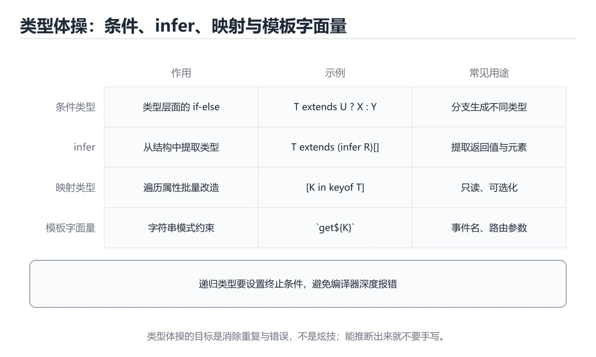
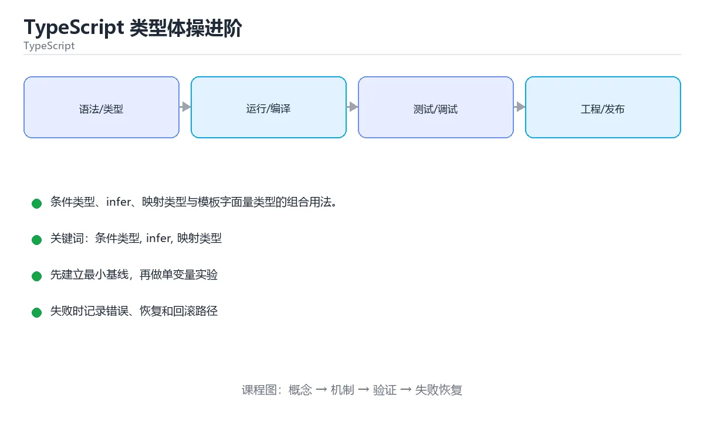

# TypeScript 类型体操进阶





> 内容更新时间：2026-10-06 · 学习阶段：高级 · 预计用时：40 分钟

## 本节知识框架

**课程定位**：所属分类 `typescript`（TypeScript），课程主题 `TypeScript 类型体操进阶`，学习阶段 高级，建议用时 50 分钟。

本课主线：条件类型、infer、映射类型与模板字面量类型的组合用法。

**学完本课应当能够**
- 说清 `条件类型` 与 `映射类型` 的含义与区别，并各举一个正例和一个反例。
- 用本课示例验证 `infer` 的行为，记录输入、输出与失败条件。
- 遇到「类型写得太绕」这类问题时，能说出触发条件与修复顺序。

### 从概念到验证的学习链条

1. `条件类型`：先掌握 TypeScript 根据类型关系在编译期选择结果类型的类型运算，再用它解释 `映射类型` 为什么会出现。
2. `映射类型`：先掌握 TypeScript 根据已有类型批量生成属性变换后的新类型，再用它解释 `infer` 为什么会出现。
3. `infer`：先掌握 在条件类型里声明待推断的类型变量，用来实现 ReturnType 一类工具类型，再用它解释 `模板字面量类型` 为什么会出现。
4. `模板字面量类型`：先掌握 用反引号把字符串类型拼起来，可以对路由参数或事件名做类型约束，再用它解释 本课示例的观察结果 为什么会出现。

**先修与衔接**：本课是「TypeScript」分类的第 16 课。先修内容：《TypeScript 实战：全栈类型安全》。《TypeScript 实战：全栈类型安全》里的 `TypeScript`、`全栈` 是本课的前提。相关或后续课程：《TypeScript Node 后端开发》。

### 完成判据

- **定义关**：不看正文也能说明 `条件类型` 是 TypeScript 根据类型关系在编译期选择结果类型的类型运算，并指出一个反例。
- **机制关**：能按“输入 → 转换 → 输出 → 验证”复述 `TypeScript 类型体操进阶`，而不是只背结论。
- **示例关**：能运行或推演 `TypeScript 类型体操进阶` 的 `ts` 示例，并说明一个真实出现的标识符或字面量。
- **证据关**：能指出 `TypeScript 类型体操进阶` 示例里的 出现字面量 ` | `，并说明它支持或反驳了本课的哪一条结论。
- **排错关**：能复现 类型写得太绕，记录现象并按 拆成命名类型并加注释 修复。
- **迁移关**：能把 `条件类型`、`infer`、`映射类型`、`模板字面量类型` 放进一个与 `TypeScript 类型体操进阶` 不同的项目场景，并保持输入与验证条件可追踪。
- **复盘关**：学完 `TypeScript 类型体操进阶` 后，用一句话写下仍然不确定的结论，并列出下一次验证需要的输入、环境和成功判据。

### 复习清单

- [ ] 能不看正文复述本课核心术语，并指出一个边界或反例。
- [ ] 能运行或推演本课示例，记录输入、输出与失败现象。
- [ ] 能完成一次自测，并把错题对照错误表定位原因。

## 核心概念定义

| 术语 | 操作性定义 | 常见边界与风险 |
| --- | --- | --- |
| 条件类型 | TypeScript 根据类型关系在编译期选择结果类型的类型运算。 | 易错：得到意外结果；正确做法是明确不匹配时的分支。 |
| 映射类型 | TypeScript 根据已有类型批量生成属性变换后的新类型。 | 静态检查只在编译期成立，运行期输入仍需校验。 |
| infer | 在条件类型里声明待推断的类型变量，用来实现 ReturnType 一类工具类型。 | 静态检查只在编译期成立，运行期输入仍需校验。 |
| 模板字面量类型 | 用反引号把字符串类型拼起来，可以对路由参数或事件名做类型约束。 | 静态检查只在编译期成立，运行期输入仍需校验。 |
| 条件类型 | 按条件选择类型 | 易错：得到意外结果；正确做法是明确不匹配时的分支。 |
| infer | 在条件类型中提取类型 | 静态检查只在编译期成立，运行期输入仍需校验。 |
| 映射类型 | 批量改造属性 | 只在「批量改造属性」这一前提下成立，换输入或换环境要重新验证。 |
| 模板字面量类型 | 在类型层拼字符串 | 静态检查只在编译期成立，运行期输入仍需校验。 |
| 只需要复用已有类型的部分字段 | `Pick` / `Omit` | 只在「`Pick` / `Omit`」这一前提下成立，换输入或换环境要重新验证。 |
| 需要按条件分支 | 条件类型 | 静态检查只在编译期成立，运行期输入仍需校验。 |
| 需要从复杂类型中提取 | `infer` | 只在「`infer`」这一前提下成立，换输入或换环境要重新验证。 |
| 需要批量转换属性 | 映射类型 | 静态检查只在编译期成立，运行期输入仍需校验。 |
| 需要构造字符串键 | 模板字面量类型 | 静态检查只在编译期成立，运行期输入仍需校验。 |
| 需要运行时校验 | zod 等库（类型只在编译期存在） | 静态检查只在编译期成立，运行期输入仍需校验。 |
| 条件类型 | if 判断 | 易错：得到意外结果；正确做法是明确不匹配时的分支。 |
| infer | 拆包裹 | 只在「拆包裹」这一前提下成立，换输入或换环境要重新验证。 |
| 映射类型 | 批量加工 | 只在「批量加工」这一前提下成立，换输入或换环境要重新验证。 |
| 模板字面量 | 字符串拼接 | 只在「字符串拼接」这一前提下成立，换输入或换环境要重新验证。 |
| 递归类型 | 逐层剥开 | 易错：编译报错或超深；正确做法是设计明确的递归出口。 |
| 从 schema 推导类型 | ✅ 用工具类型 | 静态检查只在编译期成立，运行期输入仍需校验。 |
| 包装库的类型（如 Result、Option） | ✅ 有条件类型 | 静态检查只在编译期成立，运行期输入仍需校验。 |
| 只想少写几个字段 | ❌ 直接写更清楚 | 只在「❌ 直接写更清楚」这一前提下成立，换输入或换环境要重新验证。 |
| 团队没人看得懂 | ❌ 退回到简单写法 | 只在「❌ 退回到简单写法」这一前提下成立，换输入或换环境要重新验证。 |
| Partial<T> | 全部可选 | 只在「全部可选」这一前提下成立，换输入或换环境要重新验证。 |
| Required<T> | 全部必填 | 只在「全部必填」这一前提下成立，换输入或换环境要重新验证。 |
| Readonly<T> | 全部只读 | 只在「全部只读」这一前提下成立，换输入或换环境要重新验证。 |
| Pick<T, K> | 保留指定字段 | 只在「保留指定字段」这一前提下成立，换输入或换环境要重新验证。 |
| Omit<T, K> | 排除指定字段 | 只在「排除指定字段」这一前提下成立，换输入或换环境要重新验证。 |
| Record<K, V> | 构造映射 | 只在「构造映射」这一前提下成立，换输入或换环境要重新验证。 |
| Exclude<T, U> | 从联合中排除 | 只在「从联合中排除」这一前提下成立，换输入或换环境要重新验证。 |
| Extract<T, U> | 从联合中提取 | 只在「从联合中提取」这一前提下成立，换输入或换环境要重新验证。 |
| NonNullable<T> | 去掉 null 与 undefined | 只在「去掉 null 与 undefined」这一前提下成立，换输入或换环境要重新验证。 |
| ReturnType<F> | 取返回类型 | 静态检查只在编译期成立，运行期输入仍需校验。 |
| Awaited<T> | 解开 Promise | 只在「解开 Promise」这一前提下成立，换输入或换环境要重新验证。 |
| 类型写得太绕 | 报错没人看得懂 | 易错：报错没人看得懂；正确做法是拆成命名类型并加注释。 |
| 忘了 as const | 推断成宽泛类型 | 静态检查只在编译期成立，运行期输入仍需校验。 |
| 递归层数太深 | 编译器报「实例化过深」 | 易错：编译器报「实例化过深」；正确做法是限制层数或改实现。 |
| 条件类型没写 never | 得到意外结果 | 只在「得到意外结果」这一前提下成立，换输入或换环境要重新验证。 |
| 在运行时用类型 | 报错或无效 | 易错：报错或无效；正确做法是类型只在编译期存在。 |
| 用体操处理业务逻辑 | 难维护 | 易错：难维护；正确做法是用普通代码表达。 |
| 忽略分配式条件类型 | 联合被逐项处理 | 易错：联合被逐项处理；正确做法是需要整体判断时用 `[T] extends [U]`。 |
| 版本差异 | 老版本不支持某些语法 | 易错：老版本不支持某些语法；正确做法是先确认 TS 版本。 |

## 原理与运行机制

### 机制总览

**教材衔接：工程约束速查**

| 约束 | 原因 |
| --- | --- |
| 给复杂类型写注释与示例 | 后来者要能看懂 |
| 用测试验证类型（类型断言与编译） | 类型逻辑也会出错 |
| 控制深度与递归层数 | 过深会让编译器变慢甚至报错 |
| 导出类型时给语义化别名 | 报错信息更可读 |
| 不用类型体操做业务建模 | 可读性优先于炫技 |

**教材衔接：版本与时效**

- 版本提示：条件类型 的行为在最近几个大版本里有过调整，升级「TypeScript 类型体操进阶」前先用 DeepReadonly 复现当前输出，再对照官方发布说明逐条核对。
- 升级前确认 条件类型 的兼容范围，把不可回退的改动单独拆成一次提交。

### 升级检查清单

- 先固定当前版本，跑通全部示例与测验，再升级工具链。
- 只改 条件类型 的版本变量，记录编译、测试与产物体积的变化。
- 回归范围锁定 DeepReadonly 的默认行为，并确认弃用警告是否出现在构建输出里。
- 升级完成后更新本课「最后复核 / 下次复核」日期，并记录 条件类型 的版本变化。

### 机制拆解：每一步的输入、动作与输出

#### 1. `条件类型`
- 输入：`条件类型`；本步把 TypeScript 根据类型关系在编译期选择结果类型的类型运算 当作判断规则。
- 动作：围绕 `条件类型` 保留中间状态，并记录它与 `映射类型` 的对应关系。
- 输出：`映射类型`，它可以被下一段代码、测试或记录继续使用。
- `条件类型` 的失败条件：当条件类型没写 `never`时，会出现得到意外结果。

#### 2. `映射类型`
- 输入：`条件类型`；本步把 TypeScript 根据已有类型批量生成属性变换后的新类型 当作判断规则。
- 动作：围绕 `映射类型` 保留中间状态，并记录它与 `infer` 的对应关系。
- 输出：`infer`，它可以被下一段代码、测试或记录继续使用。
- `映射类型` 的失败条件：静态检查只在编译期成立，运行期输入仍需校验。

#### 3. `infer`
- 输入：`映射类型`；本步把 在条件类型里声明待推断的类型变量，用来实现 ReturnType 一类工具类型 当作判断规则。
- 动作：围绕 `infer` 保留中间状态，并记录它与 `模板字面量类型` 的对应关系。
- 输出：`模板字面量类型`，它可以被下一段代码、测试或记录继续使用。
- `infer` 的失败条件：静态检查只在编译期成立，运行期输入仍需校验。

#### 4. `模板字面量类型`
- 输入：`infer`；本步把 用反引号把字符串类型拼起来，可以对路由参数或事件名做类型约束 当作判断规则。
- 动作：围绕 `模板字面量类型` 保留中间状态，并记录它与 ` | ` 的对应关系。
- 输出：` | `，它可以被下一段代码、测试或记录继续使用。
- `模板字面量类型` 的失败条件：静态检查只在编译期成立，运行期输入仍需校验。

### 示例中的可观察事实

1. 出现字面量 ` | `；它对应的课程主题是 `TypeScript 类型体操进阶`。
2. 出现字面量 `>;                // `；它对应的课程主题是 `TypeScript 类型体操进阶`。
3. 出现字面量 `[] | `；它对应的课程主题是 `TypeScript 类型体操进阶`。
4. 调用了 `extends()`；它对应的课程主题是 `TypeScript 类型体操进阶`。
5. 出现字面量 `dark`；它对应的课程主题是 `TypeScript 类型体操进阶`。
6. 出现字面量 `beta`；它对应的课程主题是 `TypeScript 类型体操进阶`。
7. 出现字面量 `chat`；它对应的课程主题是 `TypeScript 类型体操进阶`。

### 复现实验记录

- 环境：`TypeScript 类型体操进阶` 使用 `ts` 示例，固定 `条件类型`、`infer`、`映射类型`、`模板字面量类型` 作为第一组条件。
- 首轮输入：先确认 出现字面量 ` | `，预测 `条件类型` 会怎样变化。
- 基线观察：记录命令、输入、输出和错误原文，不用截图代替可复制的文本。
- 单变量修改：只改变 `条件类型`，观察 `模板字面量类型` 是否仍满足定义。
- 失败注入：复现 类型写得太绕，确认现象是 报错没人看得懂。
- 记录结论：把“修改前、修改后、预期变化、实际变化”写成四列表，这样复盘 `TypeScript 类型体操进阶` 时才能区分概念错误与实现错误。

## 典型应用场景

- **类型写得太绕**：典型现象是报错没人看得懂；正确做法是拆成命名类型并加注释。
- **忘了 `as const`**：典型现象是推断成宽泛类型；正确做法是常量加 `as const`。
- **递归层数太深**：典型现象是编译器报「实例化过深」；正确做法是限制层数或改实现。
- **条件类型没写 `never`**：典型现象是得到意外结果；正确做法是明确不匹配时的分支。

### 最小验证场景

- 准备：保留 `ts` 示例的原始输入，先记录 `TypeScript 类型体操进阶` 的基线输出和完整运行命令。
- 观察：先核对 出现字面量 ` | `，再改变一个与 `条件类型` 相关的条件。
- 判定：新结果与 `TypeScript 类型体操进阶` 的基线不同不等于错误；只有当差异破坏了 `条件类型` 的定义或错误表中的约束，才判定为失败。

### 选择与边界

- 使用 `条件类型` 时，先满足它的定义：TypeScript 根据类型关系在编译期选择结果类型的类型运算；易错：得到意外结果；正确做法是明确不匹配时的分支。
- 使用 `映射类型` 时，先满足它的定义：TypeScript 根据已有类型批量生成属性变换后的新类型；静态检查只在编译期成立，运行期输入仍需校验。
- 使用 `infer` 时，先满足它的定义：在条件类型里声明待推断的类型变量，用来实现 ReturnType 一类工具类型；静态检查只在编译期成立，运行期输入仍需校验。
- 使用 `模板字面量类型` 时，先满足它的定义：用反引号把字符串类型拼起来，可以对路由参数或事件名做类型约束；静态检查只在编译期成立，运行期输入仍需校验。

## 代码/协议/SQL 示例

### 最小可验证示例

```ts
// 1. 条件类型 + infer：取出函数返回类型与 Promise 内部类型
type Unwrap<T> = T extends Promise<infer U> ? Unwrap<U> : T;
type Value = Unwrap<Promise<Promise<number>>>;   // number
// 2. 映射类型 + 键重映射：把字段改成 getX 形式
type Getters<T> = {
  [K in keyof T as `get${Capitalize<string & K>}`]: () => T[K];
};
interface User {
  id: string;
  name: string;
}
type UserGetters = Getters<User>;
// { getId: () => string; getName: () => string }
// 3. 递归条件类型：深层只读
type DeepReadonly<T> = {
  readonly [K in keyof T]: T[K] extends object ? DeepReadonly<T[K]> : T[K];
};
// 4. 联合类型分配：自动对每个成员生效
type ToArray<T> = T extends unknown ? T[] : never;
type Result = ToArray<"a" | "b">;                // "a"[] | "b"[]
// 5. 模板字面量类型 + 映射：为事件总线生成类型安全的方法
type EventMap = { userCreated: { id: string }; userDeleted: { id: string } };
type Listeners = {
  [K in keyof EventMap as `on${Capitalize<string & K>}`]: (payload: EventMap[K]) => void;
};
```

**教材衔接：原文最小示例**

### 示例精读：先找证据，再改一个条件

1. 出现字面量 ` | `；它出现在 `TypeScript 类型体操进阶` 的示例中，阅读时先确认它前后各发生了什么。
2. 出现字面量 `>;                // `；它出现在 `TypeScript 类型体操进阶` 的示例中，阅读时先确认它前后各发生了什么。
3. 出现字面量 `[] | `；它出现在 `TypeScript 类型体操进阶` 的示例中，阅读时先确认它前后各发生了什么。
4. 调用了 `extends()`；它出现在 `TypeScript 类型体操进阶` 的示例中，阅读时先确认它前后各发生了什么。
5. 出现字面量 `dark`；它出现在 `TypeScript 类型体操进阶` 的示例中，阅读时先确认它前后各发生了什么。
6. 出现字面量 `beta`；它出现在 `TypeScript 类型体操进阶` 的示例中，阅读时先确认它前后各发生了什么。
7. 出现字面量 `chat`；它出现在 `TypeScript 类型体操进阶` 的示例中，阅读时先确认它前后各发生了什么。
- 在 `TypeScript 类型体操进阶` 中与 `条件类型` 对照：示例必须能支持 TypeScript 根据类型关系在编译期选择结果类型的类型运算，否则说明这一段还缺少实现或验证步骤。
- 在 `TypeScript 类型体操进阶` 中与 `映射类型` 对照：示例必须能支持 TypeScript 根据已有类型批量生成属性变换后的新类型，否则说明这一段还缺少实现或验证步骤。
- 在 `TypeScript 类型体操进阶` 中与 `infer` 对照：示例必须能支持 在条件类型里声明待推断的类型变量，用来实现 ReturnType 一类工具类型，否则说明这一段还缺少实现或验证步骤。
- 在 `TypeScript 类型体操进阶` 中与 `模板字面量类型` 对照：示例必须能支持 用反引号把字符串类型拼起来，可以对路由参数或事件名做类型约束，否则说明这一段还缺少实现或验证步骤。

## 时间/空间复杂度或性能分析

**性能关注点（TypeScript 类型体操进阶）**：编译期类型检查与运行期代码是两套开销：分别记录构建时间与运行时耗时。

**测量方法**：以 `TypeScript 类型体操进阶` 的 `条件类型` 场景为对象，固定输入跑一遍记录基线，再把规模或并发度提高一个数量级复测；两次结果的差值与波动范围才是结论依据。

### 需要控制的变量与记录项

- `TypeScript 类型体操进阶` 的 `条件类型`：固定它的版本、输入范围和资源上限，分别记录速度、内存与失败率的变化。
- `TypeScript 类型体操进阶` 的 `infer`：固定它的版本、输入范围和资源上限，分别记录速度、内存与失败率的变化。
- `TypeScript 类型体操进阶` 的 `映射类型`：固定它的版本、输入范围和资源上限，分别记录速度、内存与失败率的变化。
- `TypeScript 类型体操进阶` 的 `模板字面量类型`：固定它的版本、输入范围和资源上限，分别记录速度、内存与失败率的变化。
- `TypeScript 类型体操进阶` 的 `类型体操`：固定它的版本、输入范围和资源上限，分别记录速度、内存与失败率的变化。
- `TypeScript 类型体操进阶` 中 `条件类型` 的边界：易错：得到意外结果；正确做法是明确不匹配时的分支。达到边界时不要外推，必须重新测量。
- `TypeScript 类型体操进阶` 中 `映射类型` 的边界：静态检查只在编译期成立，运行期输入仍需校验。达到边界时不要外推，必须重新测量。
- `TypeScript 类型体操进阶` 中 `infer` 的边界：静态检查只在编译期成立，运行期输入仍需校验。达到边界时不要外推，必须重新测量。
- `TypeScript 类型体操进阶` 中 `模板字面量类型` 的边界：静态检查只在编译期成立，运行期输入仍需校验。达到边界时不要外推，必须重新测量。
- `TypeScript 类型体操进阶` 的代码证据：先验证 出现字面量 ` | `，再记录该路径的输入规模与耗时；只看代码行数不能推出复杂度。

## 常见误区与易错点

| 容易写错的做法 | 实际现象 | 原因与正确做法 |
| --- | --- | --- |
| 类型写得太绕 | 报错没人看得懂 | 拆成命名类型并加注释 |
| 忘了 `as const` | 推断成宽泛类型 | 常量加 `as const` |
| 递归层数太深 | 编译器报「实例化过深」 | 限制层数或改实现 |
| 条件类型没写 `never` | 得到意外结果 | 明确不匹配时的分支 |
| 在运行时用类型 | 报错或无效 | 类型只在编译期存在 |
| 用体操处理业务逻辑 | 难维护 | 用普通代码表达 |
| 忽略分配式条件类型 | 联合被逐项处理 | 需要整体判断时用 `[T] extends [U]` |
| 版本差异 | 老版本不支持某些语法 | 先确认 TS 版本 |
| 嵌套过深的条件类型 | 编译变慢、报错难读 | 拆成多个命名类型 |
| 忘记分布式联合类型行为 | 结果与预期不符 | 用 `[T] extends [U]` 阻断分配 |
| 在类型里做运行时判断 | 无法实现 | 类型编译后消失，运行时用校验库 |
| 递归类型无终止条件 | 编译报错或超深 | 设计明确的递归出口 |
| 用 `any` 兜底复杂类型 | 类型安全失效 | 用 `unknown` 加收窄 |
| 没有类型测试 | 类型改动悄悄破坏调用方 | 用类型断言与 CI 编译检查 |

### 现场 1：类型写得太绕

**症状**：报错没人看得懂。

**根因与修复**：拆成命名类型并加注释。

**自检**：在本课示例里复现「类型写得太绕」，改成拆成命名类型并加注释后重跑；如果症状消失且失败路径按预期变化，说明定位正确。

### 现场 2：忘了 `as const`

**症状**：推断成宽泛类型。

**根因与修复**：常量加 `as const`。

**自检**：在本课示例里复现「忘了 `as const`」，改成常量加 `as const`后重跑；如果症状消失且失败路径按预期变化，说明定位正确。

### 现场 3：递归层数太深

**症状**：编译器报「实例化过深」。

**根因与修复**：限制层数或改实现。

**自检**：在本课示例里复现「递归层数太深」，改成限制层数或改实现后重跑；如果症状消失且失败路径按预期变化，说明定位正确。

### 现场 4：条件类型没写 `never`

**症状**：得到意外结果。

**根因与修复**：明确不匹配时的分支。

**自检**：在本课示例里复现「条件类型没写 `never`」，改成明确不匹配时的分支后重跑；如果症状消失且失败路径按预期变化，说明定位正确。

### 现场 5：在运行时用类型

**症状**：报错或无效。

**根因与修复**：类型只在编译期存在。

**自检**：在本课示例里复现「在运行时用类型」，改成类型只在编译期存在后重跑；如果症状消失且失败路径按预期变化，说明定位正确。

### 现场 6：用体操处理业务逻辑

**症状**：难维护。

**根因与修复**：用普通代码表达。

**自检**：在本课示例里复现「用体操处理业务逻辑」，改成用普通代码表达后重跑；如果症状消失且失败路径按预期变化，说明定位正确。

### 现场 7：忽略分配式条件类型

**症状**：联合被逐项处理。

**根因与修复**：需要整体判断时用 `[T] extends [U]`。

**自检**：在本课示例里复现「忽略分配式条件类型」，改成需要整体判断时用 `[T] extends [U]`后重跑；如果症状消失且失败路径按预期变化，说明定位正确。

### 现场 8：版本差异

**症状**：老版本不支持某些语法。

**根因与修复**：先确认 TS 版本。

**自检**：在本课示例里复现「版本差异」，改成先确认 TS 版本后重跑；如果症状消失且失败路径按预期变化，说明定位正确。

### 现场 9：嵌套过深的条件类型

**症状**：编译变慢、报错难读。

**根因与修复**：拆成多个命名类型。

**自检**：在本课示例里复现「嵌套过深的条件类型」，改成拆成多个命名类型后重跑；如果症状消失且失败路径按预期变化，说明定位正确。

## 与其他知识点的关系

- **先修**：`TypeScript 实战：全栈类型安全`。本课默认这些内容已经掌握。
- **相关或后续**：`TypeScript Node 后端开发`。本课术语会在这些课程里继续使用。
- **术语归属**：`条件类型`、`映射类型`、`infer` 的定义以本课「核心概念定义」为准，换到其他课程时先确认定义是否被改写。
- 同一分类的《TypeScript 工具类型与声明文件》也涉及 `映射类型`；两课衔接时先确认这个术语的定义是否一致。
- 同一分类的《TypeScript 类型收窄与泛型》也涉及 `infer`；两课衔接时先确认这个术语的定义是否一致。

### 先修与后续术语接口

- `TypeScript Node 后端开发`：两者通过本分类的学习顺序衔接，阅读时重点比较各自的输入与失败条件。
- `TypeScript 实战：全栈类型安全`：两者通过本分类的学习顺序衔接，阅读时重点比较各自的输入与失败条件。

### 容易混淆的相邻概念

- `条件类型` 与 `映射类型`：前者强调 TypeScript 根据类型关系在编译期选择结果类型的类型运算；后者强调 TypeScript 根据已有类型批量生成属性变换后的新类型。判断时分别检查两条定义的适用范围，不要只看名称相似就互换。
- `映射类型` 与 `infer`：前者强调 TypeScript 根据已有类型批量生成属性变换后的新类型；后者强调 在条件类型里声明待推断的类型变量，用来实现 ReturnType 一类工具类型。判断时分别检查两条定义的适用范围，不要只看名称相似就互换。
- `infer` 与 `模板字面量类型`：前者强调 在条件类型里声明待推断的类型变量，用来实现 ReturnType 一类工具类型；后者强调 用反引号把字符串类型拼起来，可以对路由参数或事件名做类型约束。判断时分别检查两条定义的适用范围，不要只看名称相似就互换。

## 自测题与参考答案

> 先独立作答，再对照参考答案；答案都能在本课正文、术语表或错误表里找到依据。

### 自测 1（概念复述）

不看正文，写出 `条件类型` 的操作性定义，并说明它与 `映射类型` 的区别。

**参考答案**：TypeScript 根据类型关系在编译期选择结果类型的类型运算。

`映射类型` 的定位是：TypeScript 根据已有类型批量生成属性变换后的新类型；两者的差别要从适用对象与失败模式上说明。

### 自测 2（排错）

本课错误表记录了「类型写得太绕」这类做法。请写出它会出现的现象、根因，以及修复顺序。

**参考答案**：现象是报错没人看得懂；正确做法是拆成命名类型并加注释。修复时先复现现象并保留证据，再改动一处假设重跑，确认现象消失。

### 自测 3（动手验证）

运行本课的 `ts` 示例，把其中的 `"a"` 换成一个边界值后重新运行，记录输出与错误信息。

**参考答案**：正常输入下 `ts` 示例应当复现正文给出的结果；把 `"a"` 换成边界值后，如果结果改变或报错，先核对它是否满足 `TypeScript 类型体操进阶` 中`条件类型` 的适用范围，再检查错误表里是否有同类现象。

### 自测 4（代码阅读）

阅读本课开头的 `ts` 示例，说明它体现了`条件类型` 的哪一条性质，并指出改动哪个输入会让这条性质不再成立。

**参考答案**：`条件类型` 的定义是 TypeScript 根据类型关系在编译期选择结果类型的类型运算，示例正是在实现这条定义。改动与 `条件类型` 有关的一个输入后，如果结果不再符合 `TypeScript 类型体操进阶` 的正文描述，就说明该性质只在当前前提成立。

### 自测 5（迁移）

把 `TypeScript 类型体操进阶` 的方法迁移到自己的项目：围绕 `条件类型` 写出一个与错误表同类的风险点，并说明触发条件和检验方式。

**参考答案**：例如「没有类型测试」，它会导致类型改动悄悄破坏调用方；检验方式是按用类型断言与 CI 编译检查改一处再复现，确认现象消失且没有引入新的失败分支。

### 自测 6（对比）

用一个表格对比 `条件类型` 与 `映射类型`：各写一行适用场景、一行失败表现。

**参考答案**：`条件类型` 的定义是TypeScript 根据类型关系在编译期选择结果类型的类型运算；`映射类型` 的定义是TypeScript 根据已有类型批量生成属性变换后的新类型。两者的失败表现分别对应本课错误表里与本术语相关的行。

### 自测 7（排错顺序）

面对「类型写得太绕」引发的问题，请把“复现 报错没人看得懂 → 保留证据 → 拆成命名类型并加注释 → 回归验证”四步写成可执行的检查清单。

**参考答案**：第一步按报错没人看得懂复现；第二步记录输入、版本与完整报错；第三步按拆成命名类型并加注释只改一处；第四步重跑并确认失败路径也按预期变化。

### 自测 8（边界判断）

针对 `模板字面量类型`，分别写出“可以使用”的条件和“结论不再成立”的条件。

**参考答案**：静态检查只在编译期成立，运行期输入仍需校验。 同时要把 `模板字面量类型` 的定义 用反引号把字符串类型拼起来，可以对路由参数或事件名做类型约束 与实际输入逐项对照。

### 自测 9（机制重建）

不看正文，按输入、转换、输出、验证四段重建 `条件类型` → `映射类型` → `infer` → `模板字面量类型` 的作用链。

**参考答案**：起点是 `条件类型` 的定义 TypeScript 根据类型关系在编译期选择结果类型的类型运算；中间每一步都保留可观察状态；终点由 `模板字面量类型` 检查，失败时回到错误表定位第一个偏离定义的步骤。

### 自测 10（综合排错）

在 `TypeScript 类型体操进阶` 中，现象是 类型改动悄悄破坏调用方。请围绕 没有类型测试 写出最小复现、关键证据、修复动作和回归验证，并说明为什么不能只凭一次运行下结论。

**参考答案**：先复现 没有类型测试，记录输入与完整错误；再按 用类型断言与 CI 编译检查 只改一处。回归时同时跑正常路径和边界路径，只有两次结果都可解释，才把修复视为完成。

### 自测 11（一分钟复述）

用每分钟约 200 字的速度复述 `TypeScript 类型体操进阶`：先给主问题，再按顺序说出 `条件类型`、`映射类型`、`infer`、`模板字面量类型`，最后给一个失败案例。

**自评标准**：主问题必须对应 条件类型、infer、映射类型与模板字面量类型的组合用法；每个术语都要能接上一句定义或边界；失败案例必须写成可观察现象，不能用“可能有风险”代替证据。

## 术语速查

| 术语 | 一句话说明 |
| --- | --- |
| `条件类型` | TypeScript 根据类型关系在编译期选择结果类型的类型运算。 |
| `映射类型` | TypeScript 根据已有类型批量生成属性变换后的新类型。 |
| `infer` | 在条件类型里声明待推断的类型变量，用来实现 ReturnType 一类工具类型。 |
| `模板字面量类型` | 用反引号把字符串类型拼起来，可以对路由参数或事件名做类型约束。 |

**术语关系**：`条件类型`（TypeScript 根据类型关系在编译期选择结果类型的类型运算） → `映射类型`（TypeScript 根据已有类型批量生成属性变换后的新类型） → `infer`（在条件类型里声明待推断的类型变量） → `模板字面量类型`（用反引号把字符串类型拼起来）。

## 考点精讲

`TypeScript 类型体操进阶` 的题库有 6 道题，下面逐题给出题干、正确项与判断依据：先自己作答，再核对正确项，最后回到正文对应小节复核。

### 考点 1：第 1 题

- **题目**：围绕“TypeScript 类型体操进阶”中的 条件类型、infer、映射类型，下列哪两项是本课强调的实践判断？
- **正确项**：学习 条件类型 时要同时说明输入、输出和失败路径，不能只看正常流程；验证 infer 时要固定版本并覆盖边界输入，结论才可复现
- **判断依据**：这道题落在术语 `条件类型` 上：TypeScript 根据类型关系在编译期选择结果类型的类型运算。复习时把 `条件类型` 的定义、适用边界和一个反例一起说清楚，再回到「核心概念定义」核对原文。

### 考点 2：第 2 题

- **题目**：这段 `typescript` 代码对应 `TypeScript 类型体操进阶` 的 `条件类型`。课程要解决的是条件类型、infer、映射类型与模板字面量类型的组合用法。关于代码内容，哪一项说法准确？
- **正确项**：出现字面量 `beta`
- **判断依据**：这道题落在术语 `条件类型` 上：TypeScript 根据类型关系在编译期选择结果类型的类型运算。复习时把 `条件类型` 的定义、适用边界和一个反例一起说清楚，再回到「核心概念定义」核对原文。

### 考点 3：第 3 题

- **题目**：条件类型对联合类型会自动「分配」，想阻断这种分配应该？
- **正确项**：用 [T] extends [U] 这种方括号写法
- **判断依据**：这道题落在术语 `条件类型` 上：TypeScript 根据类型关系在编译期选择结果类型的类型运算。复习时把 `条件类型` 的定义、适用边界和一个反例一起说清楚，再回到「核心概念定义」核对原文。

### 考点 4：第 4 题

- **题目**：关于类型体操的工程建议，正确的是？
- **正确项**：拆分命名类型，写注释与类型测试
- **判断依据**：这道题检验本课主问题：条件类型、infer、映射类型与模板字面量类型的组合用法。复习时先复述本课主问题，再举一个会让结论失效的输入。

### 考点 5：第 5 题

- **题目**：模板字面量类型最典型的用途是？
- **正确项**：约束字符串键的命名格式（如 getX、onX）
- **判断依据**：这道题落在术语 `模板字面量类型` 上：用反引号把字符串类型拼起来，可以对路由参数或事件名做类型约束。复习时把 `模板字面量类型` 的定义、适用边界和一个反例一起说清楚，再回到「核心概念定义」核对原文。

### 考点 6：第 6 题

- **题目**：填空：补齐下面这段术语说明中的空缺。课程 `条件类型、infer、映射类型与模板字面量类型的组合用法。`，这段说明是：`____`：在条件类型里声明待推断的类型变量，用来实现 ReturnType 一类工具类型。空缺处应填哪个术语？
- **正确项**：infer
- **判断依据**：这道题落在术语 `条件类型` 上：TypeScript 根据类型关系在编译期选择结果类型的类型运算。复习时把 `条件类型` 的定义、适用边界和一个反例一起说清楚，再回到「核心概念定义」核对原文。

### 考点 7：`条件类型`

- **要点**：TypeScript 根据类型关系在编译期选择结果类型的类型运算。
- **条件类型 的边界**：易错：得到意外结果；正确做法是明确不匹配时的分支。

### 考点 8：`映射类型`

- **要点**：TypeScript 根据已有类型批量生成属性变换后的新类型。
- **映射类型 的边界**：静态检查只在编译期成立，运行期输入仍需校验。

### 考点 9：`infer`

- **要点**：在条件类型里声明待推断的类型变量，用来实现 ReturnType 一类工具类型。
- **infer 的边界**：静态检查只在编译期成立，运行期输入仍需校验。

### 考点 10：`模板字面量类型`

- **要点**：用反引号把字符串类型拼起来，可以对路由参数或事件名做类型约束。
- **模板字面量类型 的边界**：静态检查只在编译期成立，运行期输入仍需校验。

### 考点 11：排错——类型写得太绕

- **现象**：报错没人看得懂。
- **处理**：拆成命名类型并加注释。

### 考点 12：排错——忘了 `as const`

- **现象**：推断成宽泛类型。
- **处理**：常量加 `as const`。

### 考点 13：综合辨析——`条件类型` 与 `模板字面量类型`

- **辨析点**：`条件类型` 的定义是 TypeScript 根据类型关系在编译期选择结果类型的类型运算；`模板字面量类型` 的定义是 用反引号把字符串类型拼起来，可以对路由参数或事件名做类型约束。
- **答题要求**：面对 `TypeScript 类型体操进阶` 的题目，先判断描述的是 `条件类型` 还是 `模板字面量类型`，再归到对应定义，最后写出一个会让该定义失效的边界输入。

### 考点 14：排错评分点

- **现象分**：能写出 报错没人看得懂，而不是只写“程序有错”。
- **证据分**：保留触发 类型写得太绕 的输入、版本和错误原文。
- **修复分**：按 拆成命名类型并加注释 只改一处，并同时回归正常路径与边界路径。

## 内容元数据

- 内容版本：v2.0
- 最后更新：2026-10-06
- 学习阶段：高级
- 适用环境：TypeScript 5.x / Node.js 22+
；本课聚焦 条件类型。
- 内容来源：内置结构化课程与工程实践整理
- 相关主题：条件类型、infer、映射类型、模板字面量类型、类型体操
- 质量版本：P0 测验标准 + P1 覆盖扩展 + P2 体验补全

## 参考资料与复核

- 最后复核：2026-10-04
- 下次复核：2027-03-17
- 复核范围：版本兼容、API 行为、安全建议与工程实践
- 来源性质：官方文档、标准或权威教材；本课核对关键词：条件类型、infer、映射类型、模板字面量类型、类型体操。

| 参考资料 | 本课用途 |
| --- | --- |
| [Utility Types](https://www.typescriptlang.org/docs/handbook/utility-types.html) | 内置类型变换 |
| [TypeScript Handbook](https://www.typescriptlang.org/docs/handbook/intro.html) | 类型系统与语言指南 |
| [TypeScript 发布说明](https://www.typescriptlang.org/docs/release-notes/) | 版本变化与兼容性 |

| [本课术语索引：TypeScript 类型体操进阶](#核心概念定义) | 按本课输入、术语边界和错误表现逐项核对 |
> 「TypeScript 类型体操进阶」的链接用于离线阅读后的延伸核对；App 不会自动联网。