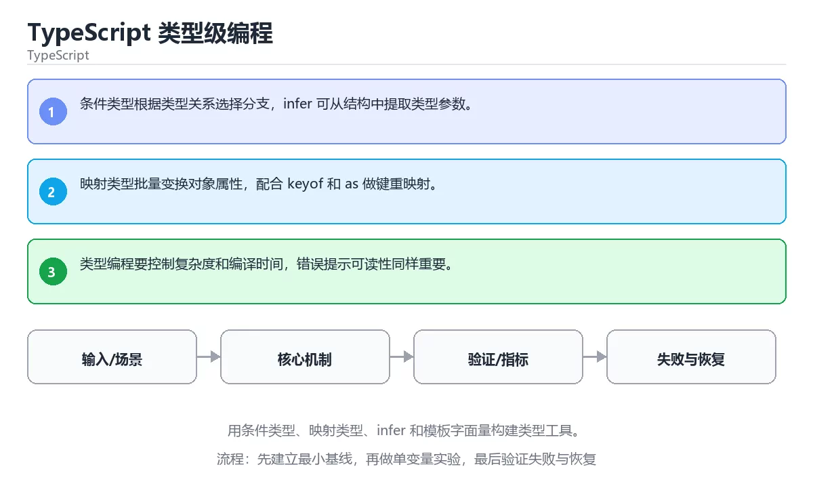

# TypeScript 类型级编程



> 内容更新时间：2026-10-03 · 学习阶段：高级 · 预计用时：25 分钟

## 学习目标

- 能用自己的话解释：条件类型根据类型关系选择分支，infer 可从结构中提取类型参数。
- 能用自己的话解释：映射类型批量变换对象属性，配合 keyof 和 as 做键重映射。
- 能用自己的话解释：类型编程要控制复杂度和编译时间，错误提示可读性同样重要。
- 能把本课知识放回「TypeScript」，并完成练习与测验。

## 前置知识

- 已完成「TypeScript」的基础课程，能运行正文中的最小示例。
- 本课关键词：条件类型、映射类型、infer、模板字面量。
- 遇到不熟悉的术语先记录问题，完成练习后再回读。

## 核心知识

### 1. 条件类型根据类型关系选择分支，infer 可从结构中提取类型参数。

- 它解决的问题：把「条件类型根据类型关系选择分支，infer 可从结构中提取类型参数。」放回真实场景，说明不做它会带来什么后果。
- 关键做法：先用最小示例建立基线，再逐步加入边界、失败和性能条件。
- 验证标准：结果可复现、错误可解释、边界有测试、失败能恢复。

### 2. 映射类型批量变换对象属性，配合 keyof 和 as 做键重映射。

- 它解决的问题：把「映射类型批量变换对象属性，配合 keyof 和 as 做键重映射。」放回真实场景，说明不做它会带来什么后果。
- 关键做法：先用最小示例建立基线，再逐步加入边界、失败和性能条件。
- 验证标准：结果可复现、错误可解释、边界有测试、失败能恢复。

### 3. 类型编程要控制复杂度和编译时间，错误提示可读性同样重要。

- 它解决的问题：把「类型编程要控制复杂度和编译时间，错误提示可读性同样重要。」放回真实场景，说明不做它会带来什么后果。
- 关键做法：先用最小示例建立基线，再逐步加入边界、失败和性能条件。
- 验证标准：结果可复现、错误可解释、边界有测试、失败能恢复。

## 关键流程

```text
输入 → 校验 → 核心处理 → 验证 → 记录指标 → 失败恢复
```

## 实践路径

1. 用一句话复述本课要解决的问题。
2. 跑通正文中的最小示例并记录基线。
3. 只改变一个输入或参数，预测并验证结果。
4. 补一个失败路径，记录错误、恢复和指标。
5. 把结论写成可复现的笔记或测试。

## 常见误区

| 误区 | 后果 | 修正 |
| --- | --- | --- |
| 只记术语不做实验 | 遇到真实问题无法判断 | 用最小输入跑通并记录结果 |
| 只测正常路径 | 边界和故障上线才暴露 | 补空值、极值和依赖失败 |
| 没有基线就优化 | 无法证明改进有效 | 先测量再修改 |
| 忽略成本与安全 | 性能和风险失控 | 同时记录资源、权限与失败代价 |

## 动手练习

1. 合上教程，用 3～5 句话解释「TypeScript 类型级编程」。
2. 从正文选一个例子，改变一个条件并预测结果。
3. 设计一个失败场景，写出止损与恢复步骤。

**验收标准**：留下输入、命令、输出、差异和下一步问题。

## 本课小结

- 本课属于「TypeScript」，核心关键词是 条件类型、映射类型、infer、模板字面量。
- 先保证正确与可复现，再讨论性能和扩展。
- 完成练习和测验后，把仍然不确定的问题写成下一轮验证清单。

> 本课由 P1 内容扩展生成，重点补充原有课程缺失的主题与工程边界。


## 考点精讲：把测验题还原成判断过程

本课有 5 个判断点。先自己作答，再看「判断依据」；如果结论正确但理由不完整，回到正文对应章节补足概念。

### 考点 1：关于「条件类型根据类型关系选择分支 inf…」，下列说法正确的是？

- **正确判断**：条件类型根据类型关系选择分支，infer 可从结构中提取类型参数。
- **判断依据**：正确答案是「条件类型根据类型关系选择分支，infer 可从结构中提取类型参数。」，本课在「本课小结」中说明：本课属于「TypeScript」，核心关键词是 条件类型、映射类型、infer、模板字面量。，本课在「核心知识」中说明：它解决的问题：把条件类型根据类型关系选择分支，infer 可从结构中提取类型参数。，本课在「核心知识」中说明：它解决的问题：把映射类型批量变换对象属性，配合 keyof 和 as 做键重映射。
- **迁移检查**：如果给某个错误选项去掉一个限定词，它会不会变成正确？说明理由。

### 考点 2：关于「映射类型批量变换对象属性 配合 ke…」，下列说法正确的是？

- **正确判断**：映射类型批量变换对象属性，配合 keyof 和 as 做键重映射。
- **判断依据**：正确答案是「映射类型批量变换对象属性，配合 keyof 和 as 做键重映射。」，本课在「本课小结」中说明：本课属于「TypeScript」，核心关键词是 条件类型、映射类型、infer、模板字面量。，本课在「核心知识」中说明：它解决的问题：把映射类型批量变换对象属性，配合 keyof 和 as 做键重映射。，本课在「核心知识」中说明：它解决的问题：把类型编程要控制复杂度和编译时间，错误提示可读性同样重要。
- **迁移检查**：如果给某个错误选项去掉一个限定词，它会不会变成正确？说明理由。

### 考点 3：关于「类型编程要控制复杂度和编译时间 错误…」，下列说法正确的是？

- **正确判断**：类型编程要控制复杂度和编译时间，错误提示可读性同样重要。
- **判断依据**：正确答案是「类型编程要控制复杂度和编译时间，错误提示可读性同样重要。」，本课在「核心知识」中说明：它解决的问题：把条件类型根据类型关系选择分支，infer 可从结构中提取类型参数。，本课在核心知识中说明：它解决的问题：把映射类型批量变换对象属性，配合 keyof 和 as 做键重映射。，本课在核心知识中说明：它解决的问题：把类型编程要控制复杂度和编译时间，错误提示可读性同样重要。
- **迁移检查**：把题干里的一个条件换成边界值，原来的结论还成立吗？写出判断过程。

### 考点 4：「TypeScript 类型级编程」的核心学习目标是什么？

- **正确判断**：用条件类型、映射类型、infer 和模板字面量构建类型工具。
- **判断依据**：正确答案是「用条件类型、映射类型、infer 和模板字面量构建类型工具。」，本课在「核心知识」中说明：它解决的问题：把类型编程要控制复杂度和编译时间，错误提示可读性同样重要。，本课在核心知识中说明：它解决的问题：把条件类型根据类型关系选择分支，infer 可从结构中提取类型参数。本课还在核心知识中说明：它解决的问题：把映射类型批量变换对象属性，配合 keyof 和 as 做键重映射。
- **迁移检查**：遮住选项，只根据定义复述一次答案，再回来看哪个选项与复述一致。

### 考点 5：以下哪些术语与「TypeScript 类型级编程」直接相关？（多选）

- **正确判断**：条件类型、映射类型
- **判断依据**：正确答案是「条件类型、映射类型」，本课在「核心知识」中说明：它解决的问题：把条件类型根据类型关系选择分支，infer 可从结构中提取类型参数。本课还在核心知识中说明：它解决的问题：把类型编程要控制复杂度和编译时间，错误提示可读性同样重要。本课还在「核心知识」中说明：它解决的问题：把映射类型批量变换对象属性，配合 keyof 和 as 做键重映射。
- **迁移检查**：每个正确项各自成立的条件是什么？有没有互相依赖。

### 补充考点 1：按照「TypeScript 类型级编程」从概念到实践的讲解顺序排列下列主题。

- **正确判断**：核心知识 → 关键流程 → 实践路径 → 常见误区
- **判断依据**：在「TypeScript 类型级编程」中，正确顺序是：1. 核心知识 → 2. 关键流程 → 3. 实践路径 → 4. 常见误区。「TypeScript 类型级编程」先建立概念，再解释运行机制，随后进入代码与工程实践，最后处理失败路径。在「TypeScript 类型级编程」里，如果把后一步放到前面，通常会缺少前一步产生的定义、输入或验证结果。本课围绕用条件类型、映射类型、infer 和模板字面量构建类型工具。展开。

## 本课复习清单

离开本课前，逐项确认：

- [ ] 不看解析，能说出「关于「条件类型根据类型关系选择分支 inf…」，下列说法正确的是？」的判断依据。
- [ ] 不看解析，能说出「关于「映射类型批量变换对象属性 配合 ke…」，下列说法正确的是？」的判断依据。
- [ ] 不看解析，能说出「关于「类型编程要控制复杂度和编译时间 错误…」，下列说法正确的是？」的判断依据。
- [ ] 不看解析，能说出「「TypeScript 类型级编程」的核心学习目标是什么？」的判断依据。
- [ ] 不看解析，能说出「以下哪些术语与「TypeScript 类型级编程」直接相关？（多选）」的判断依据。
- [ ] 至少运行一次本课示例，记录输入、输出和一个边界情况。
- [ ] 把本课最容易混淆的两个概念写成一句话对照。

| 复盘项 | 记录 |
| --- | --- |
| 已经能独立解释的考点 |  |
| 仍然说不清的概念 |  |
| 下一步验证动作 |  |

## 逐节复习与自检

下面按正文顺序回顾每一节，并给出一个自检问题；说不清的地方回到原章节补课。

### 核心知识

」放回真实场景，说明不做它会带来什么后果。关键做法：先用最小示例建立基线，再逐步加入边界、失败和性能条件。

自检：这一节与相邻主题的边界在哪里？

### 动手练习

合上教程，用 3～5 句话解释「TypeScript 类型级编程」。从正文选一个例子，改变一个条件并预测结果。

自检：如果去掉这一节里的一个前提，结论会怎样变化？

### 最小可运行示例

```typescript
type Split<S extends string> = S extends `${infer Head},${infer Tail}`
  ? [Head, ...Split<Tail>]
  : [S];

const items: Split<"a,b,c"> = ["a", "b", "c"];
console.log(items.join("-"));
```

自检：把这一节讲给没学过的人，最需要强调哪一点？

### 预期输出

```text
a-b-c
```

自检：这一节与相邻主题的边界在哪里？

### 验证步骤

制造一次错误输入，记录错误信息与修复方式。

自检：如果去掉这一节里的一个前提，结论会怎样变化？

## 易错点回顾

下面把本课最容易判断错的地方集中成一张清单，复习时先自己回答，再对照解析补全理由。

- **关于「条件类型根据类型关系选择分支 inf…」，下列说法正确的是？**：正确答案是「条件类型根据类型关系选择分支，infer 可从结构中提取类型参数。
- **关于「映射类型批量变换对象属性 配合 ke…」，下列说法正确的是？**：正确答案是「映射类型批量变换对象属性，配合 keyof 和 as 做键重映射。
- **关于「类型编程要控制复杂度和编译时间 错误…」，下列说法正确的是？**：正确答案是「类型编程要控制复杂度和编译时间，错误提示可读性同样重要。
- **「TypeScript 类型级编程」的核心学习目标是什么？**：正确答案是「用条件类型、映射类型、infer 和模板字面量构建类型工具。
- **以下哪些术语与「TypeScript 类型级编程」直接相关？（多选）**：正确答案是「条件类型、映射类型」，本课在「核心知识」中说明：它解决的问题：把条件类型根据类型关系选择分支，infer 可从结构中提取类型参数。

## 术语速查

把本课反复出现的术语集中放在一起。复习时先遮住右列，尝试用自己的话解释，再回到正文核对。

| 术语 | 本课语境 |
| --- | --- |
| `条件类型` | 本课围绕该主题展开，结合正文与代码示例理解它的适用边界。 |
| `映射类型` | 本课围绕该主题展开，结合正文与代码示例理解它的适用边界。 |
| `infer` | 本课围绕该主题展开，结合正文与代码示例理解它的适用边界。 |
| `模板字面量` | 本课围绕该主题展开，结合正文与代码示例理解它的适用边界。 |

## 面试问答与自测

下面把本课考点换成面试追问。先口述自己的答案，
再对照参考回答检查是否遗漏了前提、边界或失败路径。

### 追问 1：关于「条件类型根据类型关系选择分支 inf…」，下列说法正确的是？

**参考回答**：正确答案是「条件类型根据类型关系选择分支，infer 可从结构中提取类型参数。」，本课在「核心知识」中说明：它解决的问题：把条件类型根据类型关系选择分支，infer 可从结构中提取类型参数。，本课在「核心知识」中说明：它解决的问题：把映射类型批量变换对象属性，配合 keyof 和 as 做键重映射。，本课在「本课小结」中说明：本课属于「TypeScript」，核心关键词是 条件类型、映射类型、infer、模板字面量。

### 追问 2：关于「映射类型批量变换对象属性 配合 ke…」，下列说法正确的是？

**参考回答**：正确答案是「映射类型批量变换对象属性，配合 keyof 和 as 做键重映射。」，本课在「核心知识」中说明：它解决的问题：把映射类型批量变换对象属性，配合 keyof 和 as 做键重映射。，本课在「核心知识」中说明：它解决的问题：把类型编程要控制复杂度和编译时间，错误提示可读性同样重要。，本课在「本课小结」中说明：本课属于「TypeScript」，核心关键词是 条件类型、映射类型、infer、模板字面量。

### 追问 3：关于「类型编程要控制复杂度和编译时间 错误…」，下列说法正确的是？

**参考回答**：正确答案是「类型编程要控制复杂度和编译时间，错误提示可读性同样重要。」，本课在「本课小结」中说明：本课属于「TypeScript」，核心关键词是 条件类型、映射类型、infer、模板字面量。，本课在「核心知识」中说明：它解决的问题：把类型编程要控制复杂度和编译时间，错误提示可读性同样重要。，本课在「核心知识」中说明：它解决的问题：把条件类型根据类型关系选择分支，infer 可从结构中提取类型参数。

### 追问 4：「TypeScript 类型级编程」的核心学习目标是什么？

**参考回答**：正确答案是「用条件类型、映射类型、infer 和模板字面量构建类型工具。」，本课在「本课小结」中说明：本课属于「TypeScript」，核心关键词是 条件类型、映射类型、infer、模板字面量。，本课在核心知识中说明：它解决的问题：把条件类型根据类型关系选择分支，infer 可从结构中提取类型参数。本课还在核心知识中说明：它解决的问题：把映射类型批量变换对象属性，配合 keyof 和 as 做键重映射。

### 追问 5：以下哪些术语与「TypeScript 类型级编程」直接相关？（多选）

**参考回答**：正确答案是「条件类型、映射类型」，本课在「核心知识」中说明：它解决的问题：把条件类型根据类型关系选择分支，infer 可从结构中提取类型参数。本课还在核心知识中说明：它解决的问题：把类型编程要控制复杂度和编译时间，错误提示可读性同样重要。本课还在「核心知识」中说明：它解决的问题：把映射类型批量变换对象属性，配合 keyof 和 as 做键重映射。

## 深度拓展与实战

这一节把正文里的定义、代码和失败模式串成一条可操作的复习路线。

### 机制拆解

- **1. 条件类型根据类型关系选择分支，infer 可从结构中提取类型参数。**：1. 条件类型根据类型关系选择分支，infer 可从结构中提取类型参数
- **2. 映射类型批量变换对象属性，配合 keyof 和 as 做键重映射。**：2. 映射类型批量变换对象属性，配合 keyof 和 as 做键重映射
- **3. 类型编程要控制复杂度和编译时间，错误提示可读性同样重要。**：3. 类型编程要控制复杂度和编译时间，错误提示可读性同样重要
- **考点 1：关于「条件类型根据类型关系选择分支 inf…」，下列说法正确的是？**：考点 1：关于「条件类型根据类型关系选择分支 inf…」，下列说法正确的是
- **考点 2：关于「映射类型批量变换对象属性 配合 ke…」，下列说法正确的是？**：考点 2：关于「映射类型批量变换对象属性 配合 ke…」，下列说法正确的是

### 边界条件与常见反例

- **关于「条件类型根据类型关系选择分支 inf…」，下列说法正确的是？**：正确答案是「条件类型根据类型关系选择分支，infer 可从结构中提取类型参数。」，本课在「核心知识」中说明：它解决的问题：把条件类型根据类型关系选择分支，infer 可从结构中提取类型参数。，本课在「核心知识」中说明：它解决的问题：把映射类型批量变换对象属性，配合 keyof 和 as 做键重映射。，本课在「本课小结」中说明：本课属于「TypeScript」，核心关键词是 条件类型、映射类型、infer、模板字面量。
- **关于「映射类型批量变换对象属性 配合 ke…」，下列说法正确的是？**：正确答案是「映射类型批量变换对象属性，配合 keyof 和 as 做键重映射。」，本课在「核心知识」中说明：它解决的问题：把映射类型批量变换对象属性，配合 keyof 和 as 做键重映射。，本课在「核心知识」中说明：它解决的问题：把类型编程要控制复杂度和编译时间，错误提示可读性同样重要。，本课在「本课小结」中说明：本课属于「TypeScript」，核心关键词是 条件类型、映射类型、infer、模板字面量。
- **关于「类型编程要控制复杂度和编译时间 错误…」，下列说法正确的是？**：正确答案是「类型编程要控制复杂度和编译时间，错误提示可读性同样重要。」，本课在「本课小结」中说明：本课属于「TypeScript」，核心关键词是 条件类型、映射类型、infer、模板字面量。，本课在「核心知识」中说明：它解决的问题：把类型编程要控制复杂度和编译时间，错误提示可读性同样重要。，本课在「核心知识」中说明：它解决的问题：把条件类型根据类型关系选择分支，infer 可从结构中提取类型参数。
- **「TypeScript 类型级编程」的核心学习目标是什么？**：正确答案是「用条件类型、映射类型、infer 和模板字面量构建类型工具。」，本课在「本课小结」中说明：本课属于「TypeScript」，核心关键词是 条件类型、映射类型、infer、模板字面量。，本课在核心知识中说明：它解决的问题：把条件类型根据类型关系选择分支，infer 可从结构中提取类型参数。本课还在核心知识中说明：它解决的问题：把映射类型批量变换对象属性，配合 keyof 和 as 做键重映射。

### 工程检查表

- [ ] 能否用自己的话说明TypeScript 类型级编程解决什么问题，以及它不负责什么？
- [ ] 能否指出最小可运行示例的输入、输出和一条失败路径？
- [ ] 能否解释本课关键词在真实项目中的边界与取舍？
- [ ] 能否把本课方法迁移到另一个相近问题，并说明需要改什么？

### 迁移练习

1. 保持正文示例不变，写出它的输入、处理步骤和预期输出。
2. 只改变一个条件，预测结果并说明依据；再运行或手算验证。
3. 结合条件类型、映射类型、infer、模板字面量，写出一个真实项目中的使用场景。
4. 写下一个反例，说明它在什么条件下会使朴素做法失效。


## English Overview

**Title:** TypeScript Type-Level Programming

**Summary:** Build type utilities with conditional, mapped, infer and template literal types.

**Category:** TypeScript  
**Level:** 高级  
**Key terms:** 条件类型, 映射类型, infer, 模板字面量

> The full tutorial is written in Chinese. This bilingual overview helps English readers identify the topic, scope and key terms before studying the detailed examples.

## 内容元数据

- 内容版本：v2.0
- 最后更新：2026-10-03
- 学习阶段：高级
- 适用环境：TypeScript 5.x / Node.js 22+
- 内容来源：内置结构化课程与工程实践整理
- 相关主题：条件类型、映射类型、infer、模板字面量
- 质量版本：P0 测验标准 + P1 覆盖扩展 + P2 体验补全


## 最小可运行示例

下面示例用于验证「TypeScript 类型级编程」的最小输入、处理和输出。先原样运行，再只修改一个值：

```typescript
type Split<S extends string> = S extends `${infer Head},${infer Tail}`
  ? [Head, ...Split<Tail>]
  : [S];

const items: Split<"a,b,c"> = ["a", "b", "c"];
console.log(items.join("-"));
```

## 预期输出

```text
a-b-c
```

## 验证步骤

1. 记录运行环境、命令和真实输出。
2. 修改一个输入，先写预测再运行。
3. 制造一次错误输入，记录错误信息与修复方式。
4. 把结论写回本课笔记或测试用例。


## 参考资料与复核

- 最后复核：2026-10-04
- 下次复核：2027-04-04
- 复核范围：版本兼容、API 行为、安全建议与工程实践
- 来源性质：官方文档与标准；本课正文为离线教学重组，不复制原文

| 参考资料 | 本课用途 |
| --- | --- |
| [TypeScript Handbook](https://www.typescriptlang.org/docs/handbook/intro.html) | 类型系统与编译配置 |
| [Decorators 与模块](https://www.typescriptlang.org/docs/) | 语言特性与生态集成 |

> 本课主题：用条件类型、映射类型、infer 和模板字面量构建类型工具。

> App 完全离线展示文字链接，不会自动联网；需要延伸阅读时可复制链接到浏览器。
