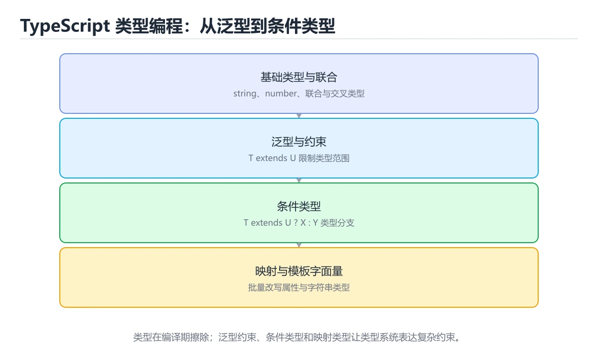

# TypeScript 类型级编程

> 内容更新时间：2026-10-06 · 学习阶段：高级 · 预计用时：35 分钟




## 学习目标

- 能用自己的话解释：条件类型根据类型关系选择分支，infer 可从结构中提取类型参数。
- 能用自己的话解释：映射类型批量变换对象属性，配合 keyof 和 as 做键重映射。
- 能用自己的话解释：类型编程要控制复杂度和编译时间，错误提示可读性同样重要。
- 能把本课知识放回「TypeScript」，并完成练习与测验。

## 前置知识

- 能运行 extends 所在的示例环境，并读懂报错信息。
- 本课关键词：条件类型、映射类型、infer、模板字面量。
- 遇到不熟悉的术语先记录问题，完成练习后再回读。

## 核心知识

### 1. 条件类型根据类型关系选择分支，infer 可从结构中提取类型参数。

- 关键做法：先让 条件类型 的最小示例可复现，再加入并发或规模条件。
- 验证标准：extends 的输出能被他人复现，边界输入有对应用例。

### 2. 映射类型批量变换对象属性，配合 keyof 和 as 做键重映射。

把这条结论放回「TypeScript 类型级编程」的完整流程里展开：

- 正文依据：能用自己的话解释：条件类型根据类型关系选择分支，infer 可从结构中提取类型参数。
- 落地检查：把「2. 映射类型批量变换对象属性，配合 keyof 和 as 做键重映射。」改写成一条可执行的核对项，逐条验证输入、超时与失败路径。

### 3. 类型编程要控制复杂度和编译时间，错误提示可读性同样重要。

把这条结论放回「TypeScript 类型级编程」的完整流程里展开：

- 正文依据：能用自己的话解释：映射类型批量变换对象属性，配合 keyof 和 as 做键重映射。
- 落地检查：把「3. 类型编程要控制复杂度和编译时间，错误提示可读性同样重要。」改写成一条可执行的核对项，逐条验证输入、超时与失败路径。

## 关键流程

```text
输入 → 校验 → 核心处理 → 验证 → 记录指标 → 失败恢复
```

## 实践路径

1. 用一句话复述本课要解决的问题。
2. 跑通正文中的最小示例并记录基线。
3. 只改变一个输入或参数，预测并验证结果。
4. 补一个失败路径，记录错误、恢复和指标。
5. 把结论写成可复现的笔记或测试。

## 常见错误与排查

> 说明：本表由《TypeScript 类型级编程》的核心知识整理（2026-10-07），人工复核进度见 docs/content_review_batches.md。

| 易错点 | 容易踩的做法 | 正确结论 |
| --- | --- | --- |
| 类型级技巧用得过多 | 编译变慢且难以维护 | 只在收益明确时使用类型级编程 |
| 类型报错信息不友好 | 使用者看不懂错在哪里 | 用清晰的约束与注释降低理解成本 |
| 依赖推断的巧合 | 升级后行为变化 | 显式标注关键类型 |

## 动手练习

1. 合上教程，用 3～5 句话解释TypeScript 类型级编程。
2. 从正文选一个例子，改变一个条件并预测结果。
3. 设计一个失败场景，写出止损与恢复步骤。

**验收标准**：留下输入、命令、输出、差异和下一步问题。

## 本课小结

- 本课围绕 条件类型、映射类型、infer、模板字面量 展开，复习时重点核对它们的输入、输出和失败路径。
- 做完本课测验后，把答错且解释不清的 映射类型 相关题目记成验证任务。


## 可运行练习

本节围绕TypeScript 类型级编程安排 3 个可交付任务，每个任务都要求留下可以复查的记录。

### 任务 1：用自己的话画出结构

不看书，用一张图说清「TypeScript 类型级编程」的结构，画完再对照骨架：

- 主干：条件类型 的核心知识 → 关键流程 → 实践路径 → 常见误区
- 连接线：在每条边上标出输入、输出与失败路径。
- 自检：能否用一句话说明条件类型与映射类型的关系？

### 任务 2：做一次对比实验

**验收标准**：对照表里只能用 extends 这类可观察的指标做结论，并给出映射类型从优到劣的转折条件。

### 任务 3：迁移到自己的场景

**验收标准**：用自己的话复述 条件类型，并配一个反例；只写定义不算通过。

## 故障现场

### 现场 1：类型级技巧用得过多

**症状**：在《TypeScript 类型级编程》的复现场景中，编译变慢且难以维护。

**根因**：“编译变慢且难以维护”只是表层结果。向上追溯会落到“类型级技巧用得过多”这一步，因为它省略了《TypeScript 类型级编程》的约束，使实现行为和预期模型发生了偏离。

**修复**：针对《TypeScript 类型级编程》的问题，只在收益明确时使用类型级编程。

**验证**：保留《TypeScript 类型级编程》里触发“编译变慢且难以维护”的输入、版本和日志，按“只在收益明确时使用类型级编程”完成修改后原样重放；只有失败现象消失且相邻场景仍可解释，才保留改动。

### 现场 2：类型报错信息不友好

**症状**：在《TypeScript 类型级编程》的复现场景中，使用者看不懂错在哪里。

**根因**：当出现“类型报错信息不友好”时，执行路径已经绕过了《TypeScript 类型级编程》的关键约束，最终以“使用者看不懂错在哪里”暴露出来；修复前必须先确认约束在哪里失效。

**修复**：针对《TypeScript 类型级编程》的问题，用清晰的约束与注释降低理解成本。

**验证**：保留《TypeScript 类型级编程》里触发“使用者看不懂错在哪里”的输入、版本和日志，按“用清晰的约束与注释降低理解成本”完成修改后原样重放；只有失败现象消失且相邻场景仍可解释，才保留改动。

### 现场 3：依赖推断的巧合

**症状**：在《TypeScript 类型级编程》的复现场景中，升级后行为变化。

**根因**：触发点是把“依赖推断的巧合”当成安全做法。它没有满足《TypeScript 类型级编程》要求的前提，因此先表现为“升级后行为变化”；排查时先完整复现这一段，再核对输入、配置与依赖。

**修复**：针对《TypeScript 类型级编程》的问题，显式标注关键类型。

**验证**：先在《TypeScript 类型级编程》中记录“依赖推断的巧合”留下的失败证据，再执行“显式标注关键类型”并重放；确认错误路径变为明确结果，且修复没有掩盖同类故障。

## 版本与时效

- 版本提示：条件类型 的行为在最近几个大版本里有过调整，升级「TypeScript 类型级编程」前先用 extends 复现当前输出，再对照官方发布说明逐条核对。
- 升级前确认 条件类型 的兼容范围，把不可回退的改动单独拆成一次提交。

### 升级检查清单

- 先固定当前版本，跑通全部示例与测验，再升级工具链。
- 升级时只动一个依赖版本，用 extends 记录构建与运行结果。
- 回归范围锁定 extends 的默认行为，并确认弃用警告是否出现在构建输出里。
- 升级完成后记录 条件类型 的新旧版本差异，并据此调整下次复核时间。

## 本课复习清单


离开本课前，逐项确认：

- [ ] 不看解析，能说出「关于「条件类型根据类型关系选择分支，infer 可从结构中提取类型参数。」，下列说法正确的是？」的判断依据。
- [ ] 不看解析，能说出「这段 TypeScript 代码是「TypeScript 类型级编程」的示例片段，下面哪一项描述与它一致？」的判断依据。
- [ ] 不看解析，能说出「关于「类型编程要控制复杂度和编译时间，错误提示可读性同样重要。」，下列说法正确的是？」的判断依据。
- [ ] 至少运行一次《TypeScript 类型级编程》的示例，记录输入、输出和一个边界情况。
- [ ] 把本课最容易混淆的两个概念写成一句话对照。

| 复盘项 | 记录 |
| --- | --- |
| 已经能独立解释的考点 |  |
| 仍然说不清的概念 |  |
| 下一步验证动作 |  |

## 复习与自测

逐节自检：能说清 条件类型 的输入、输出与失败路径才算通过，否则回到原文。

### 核心知识

自检：这一节与相邻主题的边界在哪里？

### 动手练习

自检：如果去掉这一节里的一个前提，结论会怎样变化？

### 最小可运行示例

```typescript
type Split<S extends string> = S extends `${infer Head},${infer Tail}`
  ? [Head, ...Split<Tail>]
  : [S];

const items: Split<"a,b,c"> = ["a", "b", "c"];
console.log(items.join("-"));
```

自检：把这一节讲给没学过的人，最需要强调哪一点？

### 预期输出

```text
a-b-c
```

### 验证步骤

制造一次错误输入，记录错误信息与修复方式。

## 术语速查

| 术语 | 一句话说明 |
| --- | --- |
| `条件类型` | TypeScript 根据类型关系在编译期选择结果类型的类型运算。 |
| `映射类型` | TypeScript 根据已有类型批量生成属性变换后的新类型。 |
| `infer` | Summary: Build type utilities with conditional, mapped, infer and template literal types.。 |
| `模板字面量` | TypeScript 在类型层面拼接字符串模式，可约束命名格式或提取子串。 |

## 深度拓展与实战

这一节把 条件类型 的结论、extends 的示例与反例整理成可执行的复习步骤。

### 机制拆解

- **1. 条件类型根据类型关系选择分支，infer 可从结构中提取类型参数。**：在「TypeScript 类型级编程」里，「1. 条件类型根据类型关系选择分支，infer 可从结构中提取类型参数。」这一步要先写清输入与预期，再记录实际结果和差异；结果不符时回到对应小节核对前提。
- **2. 映射类型批量变换对象属性，配合 keyof 和 as 做键重映射。**：在「TypeScript 类型级编程」里，「2. 映射类型批量变换对象属性，配合 keyof 和 as 做键重映射。」这一步要先写清输入与预期，再记录实际结果和差异；结果不符时回到对应小节核对前提。
- **3. 类型编程要控制复杂度和编译时间，错误提示可读性同样重要。**：在「TypeScript 类型级编程」里，「3. 类型编程要控制复杂度和编译时间，错误提示可读性同样重要。」这一步要先写清输入与预期，再记录实际结果和差异；结果不符时回到对应小节核对前提。
- **考点 1：关于「条件类型根据类型关系选择分支，infer 可从结构中提取类型参数。」，下列说法正确的是？**：先独立作答，再回到本课对应小节核对判断依据；答错时记录是哪一个前提被忽略。
- **考点 2：核心知识 的代码阅读题**：先独立作答，再回到本课正文核对 extends 的执行路径；答错时记录是哪一个前提被忽略。

### 边界条件与常见反例

「TypeScript 类型级编程」的边界不只包括最大最小值，还要覆盖空、重复和失败：

| 条件 | 常见反例 | 处理方式 |
| --- | --- | --- |
| 空输入 | 条件类型 没有任何取值 | 先判空，给出明确错误而不是继续执行 |
| 边界值 | 映射类型 取最小或最大 | 用最小值、最大值和越界值各跑一次 |
| 重复执行 | 同一输入被执行两次 | 保证结果可重复，必要时加锁或去重 |
| 失败路径 | 条件类型 相关步骤报错 | 保留原始错误，确认回滚或重试行为 |

### 工程检查表

- [ ] 能否用自己的话说明TypeScript 类型级编程解决什么问题，以及它不负责什么？
- [ ] 能否用「TypeScript 类型级编程」的最小示例复现一次失败并解释原因？
- [ ] 能否解释本课关键词在真实项目中的边界与取舍？
- [ ] 能否说明 映射类型 在新场景下需要补充什么前提？

### 迁移练习

1. 保持正文示例不变，写出它的输入、处理步骤和预期输出。
2. 固定其他输入，只调整 extends 的一个参数，先写预测再验证。
3. 结合条件类型、映射类型、infer、模板字面量，写出一个真实项目中的使用场景。
4. 写下一个反例，说明它在什么条件下会使朴素做法失效。

<!-- p0-depth-v2:start -->

## 零基础精讲：把TypeScript 类型级编程真正讲透

### 先建立一个直觉

本课的摘要可以当作一张地图：用条件类型、映射类型、infer 和模板字面量构建类型工具。

### 逐步拆解

1. 澄清输入与目标。先写清「TypeScript 类型级编程」要解决的问题、合法输入范围和成功标准，再进入后续步骤。
2. 描述处理过程。把「条件类型、映射类型、infer、模板字面量」映射到具体步骤，每步都要求能单独验证。
3. 定义输出。条件类型 的输出不仅包括正常结果，还包括错误码、日志和资源释放状态。
4. 关掉一个看似必要的检查（映射类型相关），观察哪个测试或指标先失败，用证据说明它为什么不能省。
5. 用 extends 贯穿一次小实验：先预测输出，再运行或逐步推演，最后解释差异来自哪一步。

### 把正文串成一条执行链

- **考点 3：关于「类型编程要控制复杂度和编译时间，错误提示可读性同样重要。」，下列说法正确的是？**：先独立作答，再回到本课对应小节核对判断依据；答错时记录是哪一个前提被忽略。

### 从测验反推易错点

**检查点 1：关于「条件类型根据类型关系选择分支，infer 可从结构中提取类型参数。」，下列说法正确的是？**

- 参考判断：条件类型根据类型关系选择分支，infer 可从结构中提取类型参数。
- 自问：如果去掉题干里的一个限定词，结论还成立吗？

**检查点 2：关于「映射类型批量变换对象属性，配合 keyof 和 as 做键重映射。」，下列说法正确的是？**

- 参考判断：映射类型批量变换对象属性，配合 keyof 和 as 做键重映射。

**检查点 3：关于「类型编程要控制复杂度和编译时间，错误提示可读性同样重要。」，下列说法正确的是？**

- 参考判断：类型编程要控制复杂度和编译时间，错误提示可读性同样重要。

**检查点 4：本课的核心学习目标是什么？**

- 参考判断：用条件类型、映射类型、infer 和模板字面量构建类型工具。

**检查点 5：以下哪些术语与TypeScript 类型级编程直接相关？（多选）**

- 参考判断：条件类型、映射类型

### 工程排错顺序

| 先查什么 | 要得到的证据 | 判断标准 |
| --- | --- | --- |
| 输入与前提是否满足 | 日志、输入样例、测试或指标 | 能复现并解释，才算定位 |
| 核心步骤是否产生了预期中间结果 | 日志、输入样例、测试或指标 | 能复现并解释，才算定位 |
| 失败路径是否可观测、可恢复 | 日志、输入样例、测试或指标 | 能复现并解释，才算定位 |
| 资源、权限与成本是否在预算内 | 日志、输入样例、测试或指标 | 能复现并解释，才算定位 |

### 变式训练

1. 把 条件类型 放进一个只有单机、没有额外依赖的小项目，先保证正确再扩展。
2. 把 条件类型 的输入规模扩大十倍，记录时间、内存和失败路径，找出第一个瓶颈。
3. 制造一次 条件类型 相关的依赖超时或错误输入，要求错误可解释且不留半完成状态。
5. 把 extends 的执行顺序调换一次，记录哪个中间结果先错；顺序敏感的地方就是本课的关键约束。
6. 在低带宽或低算力条件下重跑 映射类型，记录降级路径是否仍然可用。

### 本课自测

- [ ] 能用一句话解释「条件类型」在本课中的角色与边界。
- [ ] 能举出一个正常例子和一个失败例子。
- [ ] 能说出最小验证步骤，以及需要记录的证据。
- [ ] 能用一句话解释「映射类型」在本课中的角色与边界。
- [ ] 能用一句话解释「infer」在本课中的角色与边界。
- [ ] 能用一句话解释「模板字面量」在本课中的角色与边界。

### 迁移案例库

换一个 映射类型 约束重做一次，确认结论在新条件下是否仍然成立。

#### 迁移案例 1：围绕「条件类型」做一次小实验

**目标**：在不改变课程主体的前提下，验证TypeScript 类型级编程中的一个关键判断。

**步骤**：
1. 复述当前方案对「条件类型」的假设，写成一句可证伪的话。
2. 设计一个正常输入和一个边界输入，分别预测输出。
3. 运行或逐步演算，记录实际输出、耗时和失败信息。
4. 只调整一个参数，比较前后差异并解释原因。
5. 补充一条测试或复习卡，确保下次能更快复现。

**验收**：条件类型 的正常、边界、失败三条路径都要有结论；失败路径要写清恢复动作与「TypeScript 类型级编程」里仍然存在的剩余风险。

#### 迁移案例 2：围绕「映射类型」做一次小实验

**步骤**：
1. 复述当前方案对「映射类型」的假设，写成一句可证伪的话。

#### 迁移案例 3：围绕「infer」做一次小实验

**步骤**：
1. 复述当前方案对「infer」的假设，写成一句可证伪的话。

#### 迁移案例 4：围绕「模板字面量」做一次小实验

**步骤**：
1. 复述当前方案对「模板字面量」的假设，写成一句可证伪的话。

#### 迁移案例 5：围绕「条件类型」做一次小实验

**步骤**：

#### 迁移案例 6：围绕「映射类型」做一次小实验

**步骤**：

#### 迁移案例 7：围绕「infer」做一次小实验

**步骤**：

#### 迁移案例 8：围绕「模板字面量」做一次小实验

**步骤**：

#### 迁移案例 9：围绕「条件类型」做一次小实验

**步骤**：

#### 迁移案例 10：围绕「映射类型」做一次小实验

**步骤**：

#### 迁移案例 11：围绕「infer」做一次小实验

**步骤**：

#### 迁移案例 12：围绕「模板字面量」做一次小实验

**步骤**：

#### 迁移案例 13：围绕「条件类型」做一次小实验

**步骤**：

#### 迁移案例 14：围绕「映射类型」做一次小实验

**步骤**：

#### 迁移案例 15：围绕「infer」做一次小实验

**步骤**：

#### 迁移案例 16：围绕「模板字面量」做一次小实验

**步骤**：

<!-- p0-depth-v2:end -->

## 考点精讲

### 考点 1：概念判断·条件类型

- **题目**：关于「条件类型根据类型关系选择分支，infer 可从结构中提取类型参数。」，下列说法正确的是？
- **判断依据**：在「TypeScript 类型级编程」里，条件类型根据类型关系选择分支，infer 可从结构中提取类型参数。这道题的关键在「TypeScript 类型级编程」的条件类型、映射类型、infer：先确认题干“关于条件类型根据类型关系选择分支”问的是哪一步，再排除偷换前提的选项。

### 考点 2：代码补全·条件类型

- **题目**：这段 TypeScript 代码是「TypeScript 类型级编程」的示例片段，下面哪一项描述与它一致？
- **判断依据**：在「TypeScript 类型级编程」里，这段代码会产生可观察的输出，运行后能看到结果。这段代码出自「TypeScript 类型级编程」的正文示例，围绕条件类型、映射类型、infer展开；把输入或边界换成空值、极值或失败情况后，结论要以「TypeScript 类型级编程」的实际运行结果为准。

### 考点 3：概念判断·条件类型

- **题目**：关于「类型编程要控制复杂度和编译时间，错误提示可读性同样重要。」，下列说法正确的是？
- **判断依据**：在「TypeScript 类型级编程」里，类型编程要控制复杂度和编译时间，错误提示可读性同样重要。在「TypeScript 类型级编程」里，如果只凭关键词作答，很容易把只要小数据能跑通，大规模和异常情况也一定正确。回到「TypeScript 类型级编程」的正文示例，用“关于类型编程要控制复杂度和编译时间”走一遍条件类型、映射类型、infer的完整流程，能复现的结论才可以保留。

### 考点 4：概念判断·条件类型

- **题目**：「TypeScript 类型级编程」的核心学习目标是什么？
- **判断依据**：在「TypeScript 类型级编程」里，结论应落在「用条件类型、映射类型、infer 和模板字面量构建类型工具」。在「TypeScript 类型级编程」里，结论应落在用条件类型、映射类型、infer 和模板字面量构建类型工具。在「TypeScript 类型级编程」里，这道题要求区分概念与边界，用条件类型、映射类型、infer 和模板字面量构建类型工具。

### 考点 5：多选辨析·条件类型

- **题目**：以下哪些术语与「TypeScript 类型级编程」直接相关？（多选）
- **判断依据**：在「TypeScript 类型级编程」里，条件类型；映射类型。在「TypeScript 类型级编程」里判断这道题，要把条件类型、映射类型、infer的条件、过程与失败路径逐项对齐，换成“以下哪些术语与TypeScript”这个场景，只有满足前提的结论才成立。回到「TypeScript 类型级编程」的正文示例，用“以下哪些术语与TypeScript”走一遍条件类型、映射类型、infer的完整流程，能复现的结论才可以保留。

### 考点 6：顺序排列·条件类型

- **题目**：按照「TypeScript 类型级编程」从概念到实践的讲解顺序排列下列主题。
- **判断依据**：结合条件类型、映射类型来看，正确的执行顺序是「核心知识 → 关键流程 → 实践路径 → 常见误区」。本课围绕用条件类型、映射类型、infer 和模板字面量构建类型工具。这道题的关键在「TypeScript 类型级编程」的条件类型、映射类型、infer：先确认题干“按照TypeScript 类型级编程”问的是哪一步，再排除偷换前提的选项。

## English Overview

**Title:** TypeScript Type-Level Programming

**Summary:** Build type utilities with conditional, mapped, infer and template literal types.

**Category:** TypeScript
**Level:** 高级
**Key terms:** 条件类型, 映射类型, infer, 模板字面量

## 内容元数据

- 内容版本：v2.0
- 最后更新：2026-10-06
- 学习阶段：高级
- 适用环境：TypeScript 5.x / Node.js 22+；本课聚焦 条件类型。
- 内容来源：内置结构化课程与工程实践整理
- 相关主题：条件类型、映射类型、infer、模板字面量
- 质量版本：P0 测验标准 + P1 覆盖扩展 + P2 体验补全

## 最小可运行示例

下面这段代码演示 条件类型 的最小路径，先原样运行，再按注释改一处：

```typescript
type Split<S extends string> = S extends `${infer Head},${infer Tail}`
  ? [Head, ...Split<Tail>]
  : [S];

const items: Split<"a,b,c"> = ["a", "b", "c"];
console.log(items.join("-"));
```

## 预期输出

```text
a-b-c
```

## 验证步骤

1. 记录运行环境、命令和真实输出。
2. 修改一个输入，先写预测再运行。
4. 把结论写回本课笔记或测试用例。

## 参考资料与复核

- 最后复核：2026-10-04
- 下次复核：2027-02-24
- 复核范围：版本兼容、API 行为、安全建议与工程实践
- 来源性质：官方文档、标准或权威教材；正文为离线教学重组

| 参考资料 | 本课用途 |
| --- | --- |
| [Utility Types](https://www.typescriptlang.org/docs/handbook/utility-types.html) | 内置类型变换 |
| [Everyday Types](https://www.typescriptlang.org/docs/handbook/2/everyday-types.html) | 常用类型与收窄 |
| [TypeScript Node 指南](https://nodejs.org/en/learn/typescript) | Node 中的 TypeScript |

> 「TypeScript 类型级编程」的链接用于离线阅读后的延伸核对；App 不会自动联网。

## 复习与迁移

复习目标：把「TypeScript 类型级编程」的判断标准放回可复现的例子里。先自己作答，再对照依据；如果结论正确但理由不完整，回到正文补足前提。

### 概念复述

- 用一句话说明「TypeScript 类型级编程」解决什么问题：用条件类型、映射类型、infer 和模板字面量构建类型工具。
- 写出条件类型、映射类型、infer之间的关系，并各举一个例子。
- 说出本课最容易混淆的两个概念，以及区分它们的判据。

### 正文逐节复核

- **实践任务**：本节围绕TypeScript 类型级编程安排 3 个可交付任务，每个任务都要求留下可以复查的记录。
- **零基础精讲：把TypeScript 类型级编程真正讲透**：本课的摘要可以当作一张地图：用条件类型、映射类型、infer 和模板字面量构建类型工具。

### 测验回顾

1. 关于「条件类型根据类型关系选择分支，infer 可从结构中提取类型参数。」，下列说法正确的是？
   - 依据：在「TypeScript 类型级编程」里，条件类型根据类型关系选择分支，infer 可从结构中提取类型参数。这道题的关键在「TypeScript 类型级编程」的条件类型、映射类型、infer：先确认题干“关于条件类型根据类型关系选择分支”问的是哪一步，再排除偷换前提的选项。
2. 这段 TypeScript 代码是「TypeScript 类型级编程」的示例片段，下面哪一项描述与它一致？
   - 依据：在「TypeScript 类型级编程」里，这段代码会产生可观察的输出，运行后能看到结果。这段代码出自「TypeScript 类型级编程」的正文示例，围绕条件类型、映射类型、infer展开；把输入或边界换成空值、极值或失败情况后，结论要以「TypeScript 类型级编程」的实际运行结果为准。
3. 关于「类型编程要控制复杂度和编译时间，错误提示可读性同样重要。」，下列说法正确的是？
   - 依据：在「TypeScript 类型级编程」里，类型编程要控制复杂度和编译时间，错误提示可读性同样重要。在「TypeScript 类型级编程」里，如果只凭关键词作答，很容易把只要小数据能跑通，大规模和异常情况也一定正确。回到「TypeScript 类型级编程」的正文示例，用“关于类型编程要控制复杂度和编译时间”走一遍条件类型、映射类型、infer的完整流程，能复现的结论才可以保留。
4. 「TypeScript 类型级编程」的核心学习目标是什么？
   - 依据：在「TypeScript 类型级编程」里，结论应落在「用条件类型、映射类型、infer 和模板字面量构建类型工具」。在「TypeScript 类型级编程」里，结论应落在用条件类型、映射类型、infer 和模板字面量构建类型工具。在「TypeScript 类型级编程」里，这道题要求区分概念与边界，用条件类型、映射类型、infer 和模板字面量构建类型工具。
5. 以下哪些术语与「TypeScript 类型级编程」直接相关？（多选）
   - 依据：在「TypeScript 类型级编程」里，条件类型；映射类型。在「TypeScript 类型级编程」里判断这道题，要把条件类型、映射类型、infer的条件、过程与失败路径逐项对齐，换成“以下哪些术语与TypeScript”这个场景，只有满足前提的结论才成立。回到「TypeScript 类型级编程」的正文示例，用“以下哪些术语与TypeScript”走一遍条件类型、映射类型、infer的完整流程，能复现的结论才可以保留。
6. 按照「TypeScript 类型级编程」从概念到实践的讲解顺序排列下列主题。
   - 依据：结合条件类型、映射类型来看，正确的执行顺序是「核心知识 → 关键流程 → 实践路径 → 常见误区」。本课围绕用条件类型、映射类型、infer 和模板字面量构建类型工具。这道题的关键在「TypeScript 类型级编程」的条件类型、映射类型、infer：先确认题干“按照TypeScript 类型级编程”问的是哪一步，再排除偷换前提的选项。

### 迁移练习

把「TypeScript 类型级编程」的结论迁移到相邻主题，每次迁移都写清预测与证据：

1. 换输入：用条件类型处理一组你自己的数据，对比教材示例的结果差异。
2. 换失败条件：制造一个映射类型相关的错误，说明如何从错误信息定位根因。
3. 换规模：把数据量或并发度提高一个数量级，说明「TypeScript 类型级编程」的结论是否仍成立。
