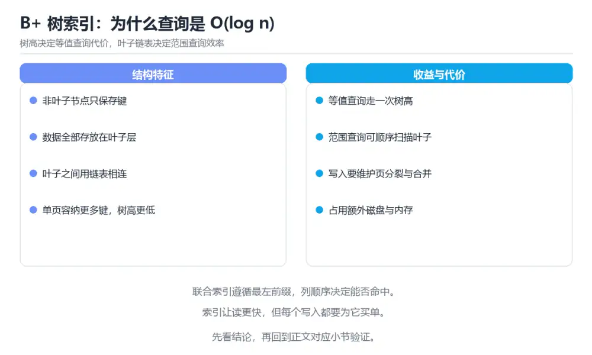

# 图解 B+ 树与数据库索引

> 内容更新时间：2026-10-06 · 学习阶段：进阶 · 预计用时：45 分钟

## 本节知识框架

**课程定位**：所属分类 `visual_guide`（图解专题），课程主题 `图解 B+ 树与数据库索引`，学习阶段 进阶，建议用时 45 分钟。

本课主线：B+ 树结构、聚簇与二级索引、最左前缀与索引失效场景。

**学完本课应当能够**
- 说清 `索引` 与 `B+ 树` 的含义与区别，并各举一个正例和一个反例。
- 用本课示例验证 `最左前缀` 的行为，记录输入、输出与失败条件。
- 遇到「认为索引列越多越好」这类问题时，能说出触发条件与修复顺序。

### 从概念到验证的学习链条

1. `索引`：先掌握 -- 没有索引：全表扫描，再用它解释 `B+ 树` 为什么会出现。
2. `B+ 树`：先掌握 B+ 树把索引组织成多路平衡树：内部节点负责导航，叶子节点保存数据或主键并顺序相连，再用它解释 `最左前缀` 为什么会出现。
3. `最左前缀`：先掌握 复合索引按列顺序匹配，查询只有从最左列开始才能充分利用索引，再用它解释 `覆盖索引` 为什么会出现。
4. `覆盖索引`：先掌握 -- 覆盖索引：把 amount 也放进联合索引，避免回表，再用它解释 `执行计划` 为什么会出现。
5. `执行计划`：先掌握 数据库优化器为查询选出的访问路径、连接顺序和算子组合，再用它解释 本课示例的观察结果 为什么会出现。

**先修与衔接**：本课是「图解专题」分类的第 7 课。先修内容：《图解 Git 三区与提交流转》。《图解 Git 三区与提交流转》里的 `add`、`Git` 是本课的前提。相关或后续课程：《图解 TCP 握手、挥手与拥塞控制》、《索引》。

### 完成判据

- **定义关**：不看正文也能说明 `索引` 是 -- 没有索引：全表扫描，并指出一个反例。
- **机制关**：能按“输入 → 转换 → 输出 → 验证”复述 `图解 B+ 树与数据库索引`，而不是只背结论。
- **示例关**：能运行或推演 `图解 B+ 树与数据库索引` 的 `text` 示例，并说明一个真实出现的标识符或字面量。
- **证据关**：能指出 `图解 B+ 树与数据库索引` 示例里的 调用了 `orders()`，并说明它支持或反驳了本课的哪一条结论。
- **排错关**：能复现 认为索引列越多越好，记录现象并按 围绕高频查询设计少量有效索引 修复。
- **迁移关**：能把 `索引`、`B+ 树`、`最左前缀`、`覆盖索引` 放进一个与 `图解 B+ 树与数据库索引` 不同的项目场景，并保持输入与验证条件可追踪。
- **复盘关**：学完 `图解 B+ 树与数据库索引` 后，用一句话写下仍然不确定的结论，并列出下一次验证需要的输入、环境和成功判据。

### 复习清单

- [ ] 能不看正文复述本课核心术语，并指出一个边界或反例。
- [ ] 能运行或推演本课示例，记录输入、输出与失败现象。
- [ ] 能完成一次自测，并把错题对照错误表定位原因。

**本课配图**




## 核心概念定义

| 术语 | 操作性定义 | 常见边界与风险 |
| --- | --- | --- |
| 索引 | -- 没有索引：全表扫描。 | 易错：写入变慢、空间膨胀、优化器选择困难；正确做法是围绕高频查询设计少量有效索引。 |
| B+ 树 | B+ 树把索引组织成多路平衡树：内部节点负责导航，叶子节点保存数据或主键并顺序相连。 | 索引命中与数据分布决定实际开销，判断前先看执行计划而不是只看结果是否正确。 |
| 最左前缀 | 复合索引按列顺序匹配，查询只有从最左列开始才能充分利用索引。 | 易错：最左前缀无法匹配；正确做法是按选择性、范围和排序需求排列。 |
| 覆盖索引 | -- 覆盖索引：把 amount 也放进联合索引，避免回表。 | 易错：高并发点查被随机 I/O 拖慢；正确做法是使用覆盖索引或调整聚簇方式。 |
| 执行计划 | 数据库优化器为查询选出的访问路径、连接顺序和算子组合。 | 易错：条件不匹配时仍然全表扫描；正确做法是用执行计划确认真实访问路径。 |

## 原理与运行机制

### 机制总览

**教材衔接：一句话说清**

索引是「为了少读磁盘而多存一份有序结构」。
数据库最常用的是 **B+ 树**：所有数据都在叶子节点，叶子之间用链表相连，因此**范围查询特别快**。

**失败路径（来自本课错误表）**
- 认为索引列越多越好 → 写入变慢、空间膨胀、优化器选择困难 → 围绕高频查询设计少量有效索引。
- 联合索引顺序随意 → 最左前缀无法匹配 → 按选择性、范围和排序需求排列。
- 忽略回表成本 → 高并发点查被随机 I/O 拖慢 → 使用覆盖索引或调整聚簇方式。
- 随机主键插入 → 页分裂和碎片增加 → 使用有序且不过度集中的主键。
### 机制拆解：每一步的输入、动作与输出

#### 1. `索引`
- 输入：`索引`；本步把 -- 没有索引：全表扫描 当作判断规则。
- 动作：围绕 `索引` 保留中间状态，并记录它与 `B+ 树` 的对应关系。
- 输出：`B+ 树`，它可以被下一段代码、测试或记录继续使用。
- `索引` 的失败条件：当认为索引列越多越好时，会出现写入变慢、空间膨胀、优化器选择困难。

#### 2. `B+ 树`
- 输入：`索引`；本步把 B+ 树把索引组织成多路平衡树：内部节点负责导航，叶子节点保存数据或主键并顺序相连 当作判断规则。
- 动作：围绕 `B+ 树` 保留中间状态，并记录它与 `最左前缀` 的对应关系。
- 输出：`最左前缀`，它可以被下一段代码、测试或记录继续使用。
- `B+ 树` 的失败条件：索引命中与数据分布决定实际开销，判断前先看执行计划而不是只看结果是否正确。

#### 3. `最左前缀`
- 输入：`B+ 树`；本步把 复合索引按列顺序匹配，查询只有从最左列开始才能充分利用索引 当作判断规则。
- 动作：围绕 `最左前缀` 保留中间状态，并记录它与 `覆盖索引` 的对应关系。
- 输出：`覆盖索引`，它可以被下一段代码、测试或记录继续使用。
- `最左前缀` 的失败条件：当联合索引顺序随意时，会出现最左前缀无法匹配。

#### 4. `覆盖索引`
- 输入：`最左前缀`；本步把 -- 覆盖索引：把 amount 也放进联合索引，避免回表 当作判断规则。
- 动作：围绕 `覆盖索引` 保留中间状态，并记录它与 `执行计划` 的对应关系。
- 输出：`执行计划`，它可以被下一段代码、测试或记录继续使用。
- `覆盖索引` 的失败条件：当忽略回表成本时，会出现高并发点查被随机 I/O 拖慢。

#### 5. `执行计划`
- 输入：`覆盖索引`；本步把 数据库优化器为查询选出的访问路径、连接顺序和算子组合 当作判断规则。
- 动作：围绕 `执行计划` 保留中间状态，并记录它与 `orders` 的对应关系。
- 输出：`orders`，它可以被下一段代码、测试或记录继续使用。
- `执行计划` 的失败条件：当以为建了索引就一定命中时，会出现条件不匹配时仍然全表扫描。

### 示例中的可观察事实

1. 调用了 `orders()`；它对应的课程主题是 `图解 B+ 树与数据库索引`。

### 复现实验记录

- 环境：`图解 B+ 树与数据库索引` 使用 `text` 示例，固定 `索引`、`B+ 树`、`最左前缀`、`覆盖索引` 作为第一组条件。
- 首轮输入：先确认 调用了 `orders()`，预测 `索引` 会怎样变化。
- 基线观察：记录命令、输入、输出和错误原文，不用截图代替可复制的文本。
- 单变量修改：只改变 `索引`，观察 `执行计划` 是否仍满足定义。
- 失败注入：复现 认为索引列越多越好，确认现象是 写入变慢、空间膨胀、优化器选择困难。
- 记录结论：把“修改前、修改后、预期变化、实际变化”写成四列表，这样复盘 `图解 B+ 树与数据库索引` 时才能区分概念错误与实现错误。

## 典型应用场景

- **认为索引列越多越好**：典型现象是写入变慢、空间膨胀、优化器选择困难；正确做法是围绕高频查询设计少量有效索引。
- **联合索引顺序随意**：典型现象是最左前缀无法匹配；正确做法是按选择性、范围和排序需求排列。
- **忽略回表成本**：典型现象是高并发点查被随机 I/O 拖慢；正确做法是使用覆盖索引或调整聚簇方式。
- **随机主键插入**：典型现象是页分裂和碎片增加；正确做法是使用有序且不过度集中的主键。

### 最小验证场景

- 准备：保留 `text` 示例的原始输入，先记录 `图解 B+ 树与数据库索引` 的基线输出和完整运行命令。
- 观察：先核对 调用了 `orders()`，再改变一个与 `索引` 相关的条件。
- 判定：新结果与 `图解 B+ 树与数据库索引` 的基线不同不等于错误；只有当差异破坏了 `索引` 的定义或错误表中的约束，才判定为失败。

### 选择与边界

- 使用 `索引` 时，先满足它的定义：-- 没有索引：全表扫描；易错：写入变慢、空间膨胀、优化器选择困难；正确做法是围绕高频查询设计少量有效索引。
- 使用 `B+ 树` 时，先满足它的定义：B+ 树把索引组织成多路平衡树：内部节点负责导航，叶子节点保存数据或主键并顺序相连；索引命中与数据分布决定实际开销，判断前先看执行计划而不是只看结果是否正确。
- 使用 `最左前缀` 时，先满足它的定义：复合索引按列顺序匹配，查询只有从最左列开始才能充分利用索引；易错：最左前缀无法匹配；正确做法是按选择性、范围和排序需求排列。
- 使用 `覆盖索引` 时，先满足它的定义：-- 覆盖索引：把 amount 也放进联合索引，避免回表；易错：高并发点查被随机 I/O 拖慢；正确做法是使用覆盖索引或调整聚簇方式。
- 使用 `执行计划` 时，先满足它的定义：数据库优化器为查询选出的访问路径、连接顺序和算子组合；易错：条件不匹配时仍然全表扫描；正确做法是用执行计划确认真实访问路径。

## 代码/协议/SQL 示例

**教材衔接：一张图看懂 B+ 树**

```text
                    ┌───────────────┐
        根节点       │  30  │   80   │
                    └──┬───┴────┬───┘
              ┌────────┘        └────────┐
              ▼                          ▼
        ┌───────────┐              ┌───────────┐
内部节点 │ 10 │  20  │              │ 60 │  70  │
        └─┬──┴───┬───┘              └─┬──┴───┬──┘
          ▼      ▼                    ▼      ▼
      叶子节点（含数据指针，且互相链接）
   ┌────┐  ┌────┐  ┌────┐  ┌────┐  ┌────┐  ┌────┐
   │5,12│─►│20,25│─►│30,45│─►│60,66│─►│70,75│─►│80,95│
   └────┘  └────┘  └────┘  └────┘  └────┘  └────┘
      └────────────── 范围扫描沿着这条链走 ──────────────┘
```

| 特性 | 含义 |
| --- | --- |
| 所有数据在叶子 | 内部节点只做导航 |
| 叶子有序且相连 | 范围查询顺序扫描即可 |
| 树高很低 | 三层可索引千万级数据 |
| 节点大小对齐磁盘页 | 一次 IO 读一个节点 |

**教材衔接：为什么 B+ 树比二叉树矮**

```text
二叉树（一个节点 2 个分支）
  100 万条数据 → 树高约 20 层 → 最多 20 次磁盘 IO

B+ 树（一个节点几百个分支，节点大小 = 磁盘页 16KB）
  100 万条数据 → 树高 3 层 → 最多 3 次磁盘 IO
```

**关键在「扇出」**：一个节点能指向几百个子节点，树高自然低。

**教材衔接：索引怎么加速查询**

```sql
-- 没有索引：全表扫描
SELECT * FROM orders WHERE user_id = 42;
  扫描 100 万行 → 读全部数据页

-- 有索引：先查树，再回表
CREATE INDEX idx_orders_user ON orders(user_id);
  ① 在 B+ 树里定位 user_id = 42 → 拿到主键
  ② 用主键回表取整行
```

```text
查询路径
  索引树：根 → 内部节点 → 叶子（找到主键 1001、1002…）
                                   │
                                   ▼
                          聚簇索引（主键树）取整行
```

**教材衔接：聚簇索引与二级索引**

| 类型 | 叶子存什么 | 例子 |
| --- | --- | --- |
| 聚簇索引 | 整行数据 | InnoDB 的主键索引 |
| 二级索引 | 主键值 | `idx_orders_user` |
| 覆盖索引 | 查询所需字段全在索引里 | 无需回表 |

```sql
-- 需要回表：只查 user_id，还要取 amount
SELECT amount FROM orders WHERE user_id = 42;

-- 覆盖索引：把 amount 也放进联合索引，避免回表
CREATE INDEX idx_orders_user_amount ON orders(user_id, amount);
SELECT amount FROM orders WHERE user_id = 42;   -- 只读索引即可
```

**教材衔接：联合索引的最左前缀**

```sql
CREATE INDEX idx_a_b_c ON t(a, b, c);
```

```text
能用上索引的查询
  WHERE a = 1
  WHERE a = 1 AND b = 2
  WHERE a = 1 AND b = 2 AND c = 3
  WHERE a = 1 AND c = 3          ← 只用到 a

用不上索引
  WHERE b = 2                    ← 跳过最左列
  WHERE b = 2 AND c = 3
  WHERE c = 3
```

**口诀：从最左列开始连续匹配，中间断了后面的就用不上。**

**教材衔接：索引失效的常见写法**

```sql
-- 失效：列上做运算或函数
WHERE YEAR(created_at) = 2026
-- 改成范围
WHERE created_at >= '2026-01-01' AND created_at < '2027-01-01'

-- 失效：前导通配符
WHERE name LIKE '%明'
-- 改成前缀匹配
WHERE name LIKE '明%'

-- 失效：隐式类型转换（user_id 是字符串，却传数字）
WHERE user_id = 42
-- 传正确类型
WHERE user_id = '42'

-- 失效：OR 连接非索引列
WHERE indexed_col = 1 OR other_col = 2
```

**教材衔接：索引的代价**

| 代价 | 说明 |
| --- | --- |
| 占空间 | 索引本身也要存储 |
| 拖慢写入 | 每次增删改都要维护索引 |
| 可能选错 | 优化器可能不走索引 |

```text
经验法则
  · 高频出现在 WHERE / ORDER BY / JOIN 的列才建索引
  · 区分度低的列（如性别、状态）通常不值得单独建索引
  · 写多读少的表要控制索引数量
```

**教材衔接：深入补充：图解 B+ 树与数据库索引**

前面已经建立了基本概念。这一节换一个角度，把图解 B+ 树与数据库索引放进真实工程里，
重点回答三件事：一句话说清 的机制、代价与边界。

### 一、核心模型

B+ 树把索引组织成多路平衡树：内部节点负责导航，叶子节点保存数据或主键并顺序相连；一次查询只需访问少量页，范围查询可以顺序扫描叶子链。

```text
根节点比较键 → 选择子指针 → 逐层下降 → 定位叶子页 → 命中或回表 → 范围查询沿叶链扫描
```

### 二、关键机制拆解

1. 阶数 m 决定每个节点的最大子节点数，节点越大，树高越低，但单页占用越多。
2. 所有数据都在叶子层，内部节点只保存分隔键，叶子节点通过指针形成有序链表。
3. 等值查询从根到叶，复杂度与树高成正比；范围查询先定位下界，再沿叶链扫描。
4. 联合索引遵循最左前缀原则，查询条件必须从最左列开始连续匹配才能有效利用。
5. 聚簇索引叶子存整行，二级索引叶子存主键，查非索引列需要回表。
6. 覆盖索引让查询所需列都在索引中，避免回表，是常见的读优化手段。
7. 页分裂发生在插入导致节点溢出时，随机主键会增加分裂和碎片。

### 三、对照表：抓住容易混淆的边界

| 维度 | 一侧 | 另一侧 |
| --- | --- | --- |
| B 树 | 每个节点都可能存数据 | 范围扫描需要中序遍历 |
| B+ 树 | 内部节点只导航，叶子存数据 | 范围查询沿叶链顺序扫描 |
| 聚簇索引 | 叶子存整行 | 按主键查询无需回表 |
| 二级索引 | 叶子存主键 | 查其他列通常需要回表 |

### 四、工作示例

联合索引 `(user_id, status, created_at)` 可以支持 `WHERE user_id=? AND status=? ORDER BY created_at`；只有 `status=?` 的查询无法使用该索引，因为缺少最左列 user_id。

### 五、常见误区与失效边界

| 错误做法或假设 | 后果 | 正确做法 |
| --- | --- | --- |
| 认为索引列越多越好 | 写入变慢、空间膨胀、优化器选择困难 | 围绕高频查询设计少量有效索引 |
| 联合索引顺序随意 | 最左前缀无法匹配 | 按选择性、范围和排序需求排列 |
| 忽略回表成本 | 高并发点查被随机 I/O 拖慢 | 使用覆盖索引或调整聚簇方式 |
| 随机主键插入 | 页分裂和碎片增加 | 使用有序且不过度集中的主键 |

### 六、场景推演

订单列表按用户和状态查询非常慢，执行计划显示全表扫描。建立 `(user_id, status, created_at)` 联合索引后，查询先定位用户，再筛状态，最后按时间顺序返回，无需额外排序。

### 七、自测问答

**Q1：为什么 B+ 树范围查询快？**

叶子节点有序并相连，定位起点后可顺序扫描。

**Q2：最左前缀原则是什么？**

联合索引必须从最左列开始连续使用，跳过左列通常无法有效利用。

**Q3：聚簇索引和二级索引的叶子有什么区别？**

聚簇索引叶子存整行，二级索引叶子通常存主键。

**Q4：覆盖索引为什么能提速？**

它让查询所需列直接来自索引，避免回表随机 I/O。

### 八、小项目：把知识变成可检查的产出

用一张 100 万行订单表分别测试无索引、单列索引和联合索引；记录执行计划、扫描行数、回表次数和查询耗时，并写出联合索引列顺序的理由。

### 九、适用边界

B+ 树适合范围查询和稳定读延迟，但高写入、高压缩或全文检索场景可能需要 LSM 树、列存或倒排索引。索引设计必须结合真实查询和数据分布。

### 十、完成检查清单

- [ ] 能画出 B+ 树结构并解释树高
- [ ] 能分析等值与范围查询路径
- [ ] 能应用最左前缀原则
- [ ] 能区分聚簇索引和二级索引
- [ ] 能根据查询设计覆盖索引

### 十一、复习顺序

1. 合上教程复述 索引，确认能说出它解决的三个问题。
2. 再对照表逐行解释容易混淆的概念，每个概念补一个反例。
3. 跟着工作示例做一遍，改变一个条件并预测结果。
4. 用自测问答检查理解，错题回到对应小节重新阅读。
5. 用 idx_orders_user_amount 做一个最小交付，附上运行命令与失败样例。

> 复习不是重读一遍，而是离开原文重新产出：复述、改写、验证、复盘。

### 示例精读：先找证据，再改一个条件

1. 调用了 `orders()`；它出现在 `图解 B+ 树与数据库索引` 的示例中，阅读时先确认它前后各发生了什么。
- 在 `图解 B+ 树与数据库索引` 中与 `索引` 对照：示例必须能支持 -- 没有索引：全表扫描，否则说明这一段还缺少实现或验证步骤。
- 在 `图解 B+ 树与数据库索引` 中与 `B+ 树` 对照：示例必须能支持 B+ 树把索引组织成多路平衡树：内部节点负责导航，叶子节点保存数据或主键并顺序相连，否则说明这一段还缺少实现或验证步骤。
- 在 `图解 B+ 树与数据库索引` 中与 `最左前缀` 对照：示例必须能支持 复合索引按列顺序匹配，查询只有从最左列开始才能充分利用索引，否则说明这一段还缺少实现或验证步骤。
- 在 `图解 B+ 树与数据库索引` 中与 `覆盖索引` 对照：示例必须能支持 -- 覆盖索引：把 amount 也放进联合索引，避免回表，否则说明这一段还缺少实现或验证步骤。

## 时间/空间复杂度或性能分析

**性能关注点（图解 B+ 树与数据库索引）**：图解类课程的性能点在渲染与交互响应：记录首屏时间与交互延迟。

**本课特有开销（图解 B+ 树与数据库索引 · 索引）**：索引能减少扫描行数，但会增加写入与存储开销，需要同时记录读、写两侧代价。

**测量方法**：以 `图解 B+ 树与数据库索引` 的 `索引` 场景为对象，固定输入跑一遍记录基线，再把规模或并发度提高一个数量级复测；两次结果的差值与波动范围才是结论依据。

### 需要控制的变量与记录项

- `图解 B+ 树与数据库索引` 的 `索引`：固定它的版本、输入范围和资源上限，分别记录速度、内存与失败率的变化。
- `图解 B+ 树与数据库索引` 的 `B+ 树`：固定它的版本、输入范围和资源上限，分别记录速度、内存与失败率的变化。
- `图解 B+ 树与数据库索引` 的 `最左前缀`：固定它的版本、输入范围和资源上限，分别记录速度、内存与失败率的变化。
- `图解 B+ 树与数据库索引` 的 `覆盖索引`：固定它的版本、输入范围和资源上限，分别记录速度、内存与失败率的变化。
- `图解 B+ 树与数据库索引` 的 `执行计划`：固定它的版本、输入范围和资源上限，分别记录速度、内存与失败率的变化。
- `图解 B+ 树与数据库索引` 中 `索引` 的边界：易错：写入变慢、空间膨胀、优化器选择困难；正确做法是围绕高频查询设计少量有效索引。达到边界时不要外推，必须重新测量。
- `图解 B+ 树与数据库索引` 中 `B+ 树` 的边界：索引命中与数据分布决定实际开销，判断前先看执行计划而不是只看结果是否正确。达到边界时不要外推，必须重新测量。
- `图解 B+ 树与数据库索引` 中 `最左前缀` 的边界：易错：最左前缀无法匹配；正确做法是按选择性、范围和排序需求排列。达到边界时不要外推，必须重新测量。
- `图解 B+ 树与数据库索引` 中 `覆盖索引` 的边界：易错：高并发点查被随机 I/O 拖慢；正确做法是使用覆盖索引或调整聚簇方式。达到边界时不要外推，必须重新测量。
- `图解 B+ 树与数据库索引` 中 `执行计划` 的边界：易错：条件不匹配时仍然全表扫描；正确做法是用执行计划确认真实访问路径。达到边界时不要外推，必须重新测量。
- `图解 B+ 树与数据库索引` 的代码证据：先验证 调用了 `orders()`，再记录该路径的输入规模与耗时；只看代码行数不能推出复杂度。

## 常见误区与易错点

| 容易写错的做法 | 实际现象 | 原因与正确做法 |
| --- | --- | --- |
| 认为索引列越多越好 | 写入变慢、空间膨胀、优化器选择困难 | 围绕高频查询设计少量有效索引 |
| 联合索引顺序随意 | 最左前缀无法匹配 | 按选择性、范围和排序需求排列 |
| 忽略回表成本 | 高并发点查被随机 I/O 拖慢 | 使用覆盖索引或调整聚簇方式 |
| 随机主键插入 | 页分裂和碎片增加 | 使用有序且不过度集中的主键 |
| 以为建了索引就一定命中 | 条件不匹配时仍然全表扫描。 | 用执行计划确认真实访问路径。 |
| 忽略最左前缀 | 联合索引完全用不上。 | 按最左列构造查询条件。 |
| 索引建得越多越好 | 写入变慢，维护成本上升。 | 按查询模式精简索引并定期清理。 |

### 现场 1：认为索引列越多越好

**症状**：写入变慢、空间膨胀、优化器选择困难。

**根因与修复**：围绕高频查询设计少量有效索引。

**自检**：在本课示例里复现「认为索引列越多越好」，改成围绕高频查询设计少量有效索引后重跑；如果症状消失且失败路径按预期变化，说明定位正确。

### 现场 2：联合索引顺序随意

**症状**：最左前缀无法匹配。

**根因与修复**：按选择性、范围和排序需求排列。

**自检**：在本课示例里复现「联合索引顺序随意」，改成按选择性、范围和排序需求排列后重跑；如果症状消失且失败路径按预期变化，说明定位正确。

### 现场 3：忽略回表成本

**症状**：高并发点查被随机 I/O 拖慢。

**根因与修复**：使用覆盖索引或调整聚簇方式。

**自检**：在本课示例里复现「忽略回表成本」，改成使用覆盖索引或调整聚簇方式后重跑；如果症状消失且失败路径按预期变化，说明定位正确。

### 现场 4：随机主键插入

**症状**：页分裂和碎片增加。

**根因与修复**：使用有序且不过度集中的主键。

**自检**：在本课示例里复现「随机主键插入」，改成使用有序且不过度集中的主键后重跑；如果症状消失且失败路径按预期变化，说明定位正确。

### 现场 5：以为建了索引就一定命中

**症状**：条件不匹配时仍然全表扫描。

**根因与修复**：用执行计划确认真实访问路径。

**自检**：在本课示例里复现「以为建了索引就一定命中」，改成用执行计划确认真实访问路径后重跑；如果症状消失且失败路径按预期变化，说明定位正确。

### 现场 6：忽略最左前缀

**症状**：联合索引完全用不上。

**根因与修复**：按最左列构造查询条件。

**自检**：在本课示例里复现「忽略最左前缀」，改成按最左列构造查询条件后重跑；如果症状消失且失败路径按预期变化，说明定位正确。

### 现场 7：索引建得越多越好

**症状**：写入变慢，维护成本上升。

**根因与修复**：按查询模式精简索引并定期清理。

**自检**：在本课示例里复现「索引建得越多越好」，改成按查询模式精简索引并定期清理后重跑；如果症状消失且失败路径按预期变化，说明定位正确。

## 与其他知识点的关系

**教材衔接：复习与迁移**

### 概念复述

- 用一句话说明「图解 B+ 树与数据库索引」解决什么问题：B+ 树结构、聚簇与二级索引、最左前缀与索引失效场景。
- 写出索引、B+ 树、最左前缀之间的关系，并各举一个例子。
- 说出本课最容易混淆的两个概念，以及区分它们的判据。

### 正文逐节复核

- **一句话说清**：数据库最常用的是 **B+ 树**：所有数据都在叶子节点，叶子之间用链表相连，因此**范围查询特别快**。
- **深入补充：图解 B+ 树与数据库索引**：前面已经建立了基本概念。这一节换一个角度，把图解 B+ 树与数据库索引放进真实工程里。

### 测验回顾

`CREATE INDEX ____ ON orders(user_id);`
   - 依据：空格应填写「idx_orders_user」。ORDER BY createdat。的查询无法使用该索引，因为缺少最左列 userid。「图解 B+ 树与数据库索引」要求先交代索引、B+ 树、最左前缀的前提再下结论，所以“idxordersuser”只在题干“图解 B+ 树与数据库索引示例中”给定的条件下成立。

### 迁移练习

- **先修**：`图解 Git 三区与提交流转`。本课默认这些内容已经掌握。
- **相关或后续**：`图解 TCP 握手、挥手与拥塞控制`、`索引`。本课术语会在这些课程里继续使用。
- **术语归属**：`索引`、`B+ 树`、`最左前缀` 的定义以本课「核心概念定义」为准，换到其他课程时先确认定义是否被改写。

### 先修与后续术语接口

- `索引`：共享术语 `最左前缀`、`覆盖索引`，共同关键词 `索引`、`最左前缀`。
- `图解 Git 三区与提交流转`：两者通过本分类的学习顺序衔接，阅读时重点比较各自的输入与失败条件。
- `图解 TCP 握手、挥手与拥塞控制`：两者通过本分类的学习顺序衔接，阅读时重点比较各自的输入与失败条件。

### 容易混淆的相邻概念

- `索引` 与 `B+ 树`：前者强调 -- 没有索引：全表扫描；后者强调 B+ 树把索引组织成多路平衡树：内部节点负责导航，叶子节点保存数据或主键并顺序相连。判断时分别检查两条定义的适用范围，不要只看名称相似就互换。
- `B+ 树` 与 `最左前缀`：前者强调 B+ 树把索引组织成多路平衡树：内部节点负责导航，叶子节点保存数据或主键并顺序相连；后者强调 复合索引按列顺序匹配，查询只有从最左列开始才能充分利用索引。判断时分别检查两条定义的适用范围，不要只看名称相似就互换。
- `最左前缀` 与 `覆盖索引`：前者强调 复合索引按列顺序匹配，查询只有从最左列开始才能充分利用索引；后者强调 -- 覆盖索引：把 amount 也放进联合索引，避免回表。判断时分别检查两条定义的适用范围，不要只看名称相似就互换。
- `覆盖索引` 与 `执行计划`：前者强调 -- 覆盖索引：把 amount 也放进联合索引，避免回表；后者强调 数据库优化器为查询选出的访问路径、连接顺序和算子组合。判断时分别检查两条定义的适用范围，不要只看名称相似就互换。

## 自测题与参考答案

> 先独立作答，再对照参考答案；答案都能在本课正文、术语表或错误表里找到依据。

### 自测 1（概念复述）

不看正文，写出 `索引` 的操作性定义，并说明它与 `B+ 树` 的区别。

**参考答案**：-- 没有索引：全表扫描。

`B+ 树` 的定位是：B+ 树把索引组织成多路平衡树：内部节点负责导航，叶子节点保存数据或主键并顺序相连；两者的差别要从适用对象与失败模式上说明。

### 自测 2（排错）

本课错误表记录了「认为索引列越多越好」这类做法。请写出它会出现的现象、根因，以及修复顺序。

**参考答案**：现象是写入变慢、空间膨胀、优化器选择困难；正确做法是围绕高频查询设计少量有效索引。修复时先复现现象并保留证据，再改动一处假设重跑，确认现象消失。

### 自测 3（动手验证）

运行本课的 `text` 示例，把其中的 `30` 换成一个边界值后重新运行，记录输出与错误信息。

**参考答案**：正常输入下 `text` 示例应当复现正文给出的结果；把 `30` 换成边界值后，如果结果改变或报错，先核对它是否满足 `图解 B+ 树与数据库索引` 中`索引` 的适用范围，再检查错误表里是否有同类现象。

### 自测 4（代码阅读）

阅读本课开头的 `text` 示例，说明它体现了`索引` 的哪一条性质，并指出改动哪个输入会让这条性质不再成立。

**参考答案**：`索引` 的定义是 -- 没有索引：全表扫描，示例正是在实现这条定义。改动与 `索引` 有关的一个输入后，如果结果不再符合 `图解 B+ 树与数据库索引` 的正文描述，就说明该性质只在当前前提成立。

### 自测 5（迁移）

把 `图解 B+ 树与数据库索引` 的方法迁移到自己的项目：围绕 `索引` 写出一个与错误表同类的风险点，并说明触发条件和检验方式。

**参考答案**：例如「索引建得越多越好」，它会导致写入变慢，维护成本上升；检验方式是按按查询模式精简索引并定期清理改一处再复现，确认现象消失且没有引入新的失败分支。

### 自测 6（对比）

用一个表格对比 `索引` 与 `B+ 树`：各写一行适用场景、一行失败表现。

**参考答案**：`索引` 的定义是-- 没有索引：全表扫描；`B+ 树` 的定义是B+ 树把索引组织成多路平衡树：内部节点负责导航，叶子节点保存数据或主键并顺序相连。两者的失败表现分别对应本课错误表里与本术语相关的行。

### 自测 7（排错顺序）

面对「认为索引列越多越好」引发的问题，请把“复现 写入变慢、空间膨胀、优化器选择困难 → 保留证据 → 围绕高频查询设计少量有效索引 → 回归验证”四步写成可执行的检查清单。

**参考答案**：第一步按写入变慢、空间膨胀、优化器选择困难复现；第二步记录输入、版本与完整报错；第三步按围绕高频查询设计少量有效索引只改一处；第四步重跑并确认失败路径也按预期变化。

### 自测 8（边界判断）

针对 `执行计划`，分别写出“可以使用”的条件和“结论不再成立”的条件。

**参考答案**：易错：条件不匹配时仍然全表扫描；正确做法是用执行计划确认真实访问路径。 同时要把 `执行计划` 的定义 数据库优化器为查询选出的访问路径、连接顺序和算子组合 与实际输入逐项对照。

### 自测 9（机制重建）

不看正文，按输入、转换、输出、验证四段重建 `索引` → `B+ 树` → `最左前缀` → `覆盖索引` 的作用链。

**参考答案**：起点是 `索引` 的定义 -- 没有索引：全表扫描；中间每一步都保留可观察状态；终点由 `执行计划` 检查，失败时回到错误表定位第一个偏离定义的步骤。

### 自测 10（综合排错）

在 `图解 B+ 树与数据库索引` 中，现象是 写入变慢，维护成本上升。请围绕 索引建得越多越好 写出最小复现、关键证据、修复动作和回归验证，并说明为什么不能只凭一次运行下结论。

**参考答案**：先复现 索引建得越多越好，记录输入与完整错误；再按 按查询模式精简索引并定期清理 只改一处。回归时同时跑正常路径和边界路径，只有两次结果都可解释，才把修复视为完成。

### 自测 11（一分钟复述）

用每分钟约 200 字的速度复述 `图解 B+ 树与数据库索引`：先给主问题，再按顺序说出 `索引`、`B+ 树`、`最左前缀`、`覆盖索引`，最后给一个失败案例。

**自评标准**：主问题必须对应 B+ 树结构、聚簇与二级索引、最左前缀与索引失效场景；每个术语都要能接上一句定义或边界；失败案例必须写成可观察现象，不能用“可能有风险”代替证据。

## 术语速查

| 术语 | 一句话说明 |
| --- | --- |
| `索引` | -- 没有索引：全表扫描。 |
| `B+ 树` | B+ 树把索引组织成多路平衡树：内部节点负责导航，叶子节点保存数据或主键并顺序相连。 |
| `最左前缀` | 复合索引按列顺序匹配，查询只有从最左列开始才能充分利用索引。 |
| `覆盖索引` | -- 覆盖索引：把 amount 也放进联合索引，避免回表。 |
| `执行计划` | 数据库优化器为查询选出的访问路径、连接顺序和算子组合。 |

**术语关系**：`索引`（-- 没有索引：全表扫描） → `B+ 树`（B+ 树把索引组织成多路平衡树：内部节点负责导航） → `最左前缀`（复合索引按列顺序匹配） → `覆盖索引`（-- 覆盖索引：把 amount 也放进联合索引）。

## 考点精讲

`图解 B+ 树与数据库索引` 的题库有 5 道题，下面逐题给出题干、正确项与判断依据：先自己作答，再核对正确项，最后回到正文对应小节复核。

### 考点 1：第 1 题

- **题目**：围绕“图解 B+ 树与数据库索引”中的 索引、B+ 树、最左前缀，下列哪两项是本课强调的实践判断？
- **正确项**：验证 B+ 树 时要固定版本并覆盖边界输入，结论才可复现；学习 索引 时要同时说明输入、输出和失败路径，不能只看正常流程
- **判断依据**：这道题落在术语 `索引` 上：-- 没有索引：全表扫描。复习时把 `索引` 的定义、适用边界和一个反例一起说清楚，再回到「核心概念定义」核对原文。

### 考点 2：第 2 题

- **题目**：`图解 B+ 树与数据库索引` 的示例代码用于验证 `索引`，其背景是B+ 树结构、聚簇与二级索引、最左前缀与索引失效场景。代码的真实内容是下面哪一项？
- **正确项**：调用了 `orders()`
- **判断依据**：这道题落在术语 `索引` 上：-- 没有索引：全表扫描。复习时把 `索引` 的定义、适用边界和一个反例一起说清楚，再回到「核心概念定义」核对原文。

### 考点 3：第 3 题

- **题目**：下面哪种写法最容易让索引失效？
- **正确项**：WHERE YEAR(created_at) = 2026
- **判断依据**：这道题落在术语 `索引` 上：-- 没有索引：全表扫描。复习时把 `索引` 的定义、适用边界和一个反例一起说清楚，再回到「核心概念定义」核对原文。

### 考点 4：第 4 题

- **题目**：「覆盖索引」指的是？
- **正确项**：查询需要的字段全部包含在索引里
- **判断依据**：这道题落在术语 `索引` 上：-- 没有索引：全表扫描。复习时把 `索引` 的定义、适用边界和一个反例一起说清楚，再回到「核心概念定义」核对原文。

### 考点 5：第 5 题

- **题目**：填空：补齐下面这段术语说明中的空缺。课程 `B+ 树结构、聚簇与二级索引、最左前缀与索引失效场景。`，这段说明是：`____`把索引组织成多路平衡树：内部节点负责导航，叶子节点保存数据或主键并顺序相连。空缺处应填哪个术语？
- **正确项**：B+ 树
- **判断依据**：这道题落在术语 `索引` 上：-- 没有索引：全表扫描。复习时把 `索引` 的定义、适用边界和一个反例一起说清楚，再回到「核心概念定义」核对原文。

### 考点 6：`索引`

- **要点**：-- 没有索引：全表扫描。
- **索引 的边界**：易错：写入变慢、空间膨胀、优化器选择困难；正确做法是围绕高频查询设计少量有效索引。

### 考点 7：`B+ 树`

- **要点**：B+ 树把索引组织成多路平衡树：内部节点负责导航，叶子节点保存数据或主键并顺序相连。
- **B+ 树 的边界**：索引命中与数据分布决定实际开销，判断前先看执行计划而不是只看结果是否正确。

### 考点 8：`最左前缀`

- **要点**：复合索引按列顺序匹配，查询只有从最左列开始才能充分利用索引。
- **最左前缀 的边界**：易错：最左前缀无法匹配；正确做法是按选择性、范围和排序需求排列。

### 考点 9：`覆盖索引`

- **要点**：-- 覆盖索引：把 amount 也放进联合索引，避免回表。
- **覆盖索引 的边界**：易错：高并发点查被随机 I/O 拖慢；正确做法是使用覆盖索引或调整聚簇方式。

### 考点 10：`执行计划`

- **要点**：数据库优化器为查询选出的访问路径、连接顺序和算子组合。
- **执行计划 的边界**：易错：条件不匹配时仍然全表扫描；正确做法是用执行计划确认真实访问路径。

### 考点 11：排错——认为索引列越多越好

- **现象**：写入变慢、空间膨胀、优化器选择困难。
- **处理**：围绕高频查询设计少量有效索引。

### 考点 12：排错——联合索引顺序随意

- **现象**：最左前缀无法匹配。
- **处理**：按选择性、范围和排序需求排列。

### 考点 13：综合辨析——`索引` 与 `执行计划`

- **辨析点**：`索引` 的定义是 -- 没有索引：全表扫描；`执行计划` 的定义是 数据库优化器为查询选出的访问路径、连接顺序和算子组合。
- **答题要求**：面对 `图解 B+ 树与数据库索引` 的题目，先判断描述的是 `索引` 还是 `执行计划`，再归到对应定义，最后写出一个会让该定义失效的边界输入。

### 考点 14：排错评分点

- **现象分**：能写出 写入变慢、空间膨胀、优化器选择困难，而不是只写“程序有错”。
- **证据分**：保留触发 认为索引列越多越好 的输入、版本和错误原文。
- **修复分**：按 围绕高频查询设计少量有效索引 只改一处，并同时回归正常路径与边界路径。

## 内容元数据

- 内容版本：v2.0
- 最后更新：2026-10-06
- 学习阶段：进阶
- 适用环境：通用图解与系统原理；本课聚焦 索引。
- 内容来源：内置结构化课程与工程实践整理
- 相关主题：索引、B+ 树、最左前缀、覆盖索引、执行计划
- 质量版本：P0 测验标准 + P1 覆盖扩展 + P2 体验补全

## 参考资料与复核

- 最后复核：2026-10-04
- 下次复核：2027-07-10
- 复核范围：版本兼容、API 行为、安全建议与工程实践
- 来源性质：官方文档、标准或权威教材；本课核对关键词：索引、B+ 树、最左前缀、覆盖索引、执行计划。

| 参考资料 | 本课用途 |
| --- | --- |
| [W3C 规范](https://www.w3.org/TR/) | Web 标准结构图 |
| [Kubernetes 架构](https://kubernetes.io/docs/concepts/architecture/) | 控制平面与节点流程 |
| [Pro Git 内部原理](https://git-scm.com/book/zh/v2/Git-内部原理-Git-对象) | Git 对象与引用关系 |

| [本课术语索引：图解 B+ 树与数据库索引](#核心概念定义) | 按本课输入、术语边界和错误表现逐项核对 |
> 「图解 B+ 树与数据库索引」的链接用于离线阅读后的延伸核对；App 不会自动联网。