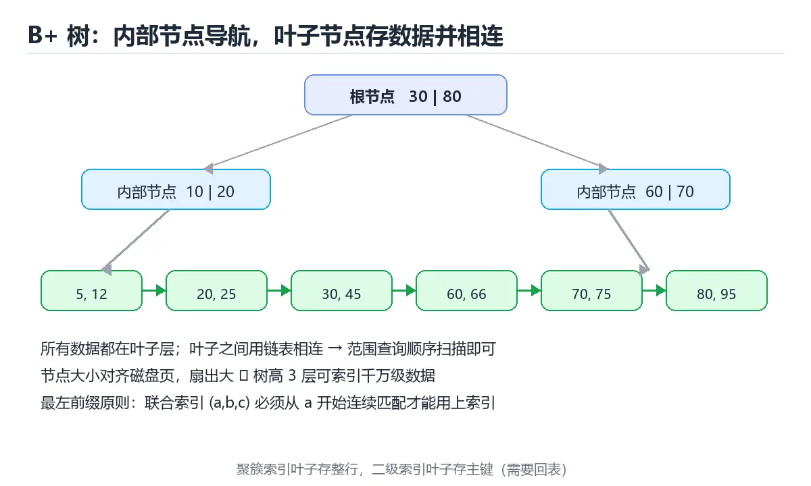

# 图解 B+ 树与数据库索引

> 内容更新时间：2026-10-03 · 学习阶段：进阶 · 预计用时：20 分钟

## 学习目标

- 能用自己的话解释「图解 B+ 树与数据库索引」解决了什么问题，而不是只背术语。
- 能说清 「索引」、「B+ 树」、「最左前缀」、「覆盖索引」 之间的关系，并分别举出一个例子。
- 能把本课知识放回「图解专题」的知识体系，说明它和相邻主题的边界。
- 能完成本课练习，并用验收标准检查自己的结果。

> 一句话摘要：B+ 树结构、聚簇与二级索引、最左前缀与索引失效场景。

## 前置知识

- 先完成上一课《图解 Git 三区与提交流转》；如果已经掌握，可以直接用本课练习自测。
- 本课阶段：进阶。建议先掌握同一分类的基础课程，并能独立运行正文中的最小示例。
- 开始前先复习：索引、B+ 树、最左前缀。
- 如果某一步看不懂，先记录具体卡点，完成练习后再回头读一遍。




## 一句话说清

索引是「为了少读磁盘而多存一份有序结构」。
数据库最常用的是 **B+ 树**：所有数据都在叶子节点，叶子之间用链表相连，因此**范围查询特别快**。

## 一张图看懂 B+ 树

```text
                    ┌───────────────┐
        根节点       │  30  │   80   │
                    └──┬───┴────┬───┘
              ┌────────┘        └────────┐
              ▼                          ▼
        ┌───────────┐              ┌───────────┐
内部节点 │ 10 │  20  │              │ 60 │  70  │
        └─┬──┴───┬───┘              └─┬──┴───┬──┘
          ▼      ▼                    ▼      ▼
      叶子节点（含数据指针，且互相链接）
   ┌────┐  ┌────┐  ┌────┐  ┌────┐  ┌────┐  ┌────┐
   │5,12│─►│20,25│─►│30,45│─►│60,66│─►│70,75│─►│80,95│
   └────┘  └────┘  └────┘  └────┘  └────┘  └────┘
      └────────────── 范围扫描沿着这条链走 ──────────────┘
```

| 特性 | 含义 |
| --- | --- |
| 所有数据在叶子 | 内部节点只做导航 |
| 叶子有序且相连 | 范围查询顺序扫描即可 |
| 树高很低 | 三层可索引千万级数据 |
| 节点大小对齐磁盘页 | 一次 IO 读一个节点 |

## 为什么 B+ 树比二叉树矮

```text
二叉树（一个节点 2 个分支）
  100 万条数据 → 树高约 20 层 → 最多 20 次磁盘 IO

B+ 树（一个节点几百个分支，节点大小 = 磁盘页 16KB）
  100 万条数据 → 树高 3 层 → 最多 3 次磁盘 IO
```

**关键在「扇出」**：一个节点能指向几百个子节点，树高自然低。

## 索引怎么加速查询

```sql
-- 没有索引：全表扫描
SELECT * FROM orders WHERE user_id = 42;
  扫描 100 万行 → 读全部数据页

-- 有索引：先查树，再回表
CREATE INDEX idx_orders_user ON orders(user_id);
  ① 在 B+ 树里定位 user_id = 42 → 拿到主键
  ② 用主键回表取整行
```

```text
查询路径
  索引树：根 → 内部节点 → 叶子（找到主键 1001、1002…）
                                   │
                                   ▼
                          聚簇索引（主键树）取整行
```

## 聚簇索引与二级索引

| 类型 | 叶子存什么 | 例子 |
| --- | --- | --- |
| 聚簇索引 | 整行数据 | InnoDB 的主键索引 |
| 二级索引 | 主键值 | `idx_orders_user` |
| 覆盖索引 | 查询所需字段全在索引里 | 无需回表 |

```sql
-- 需要回表：只查 user_id，还要取 amount
SELECT amount FROM orders WHERE user_id = 42;

-- 覆盖索引：把 amount 也放进联合索引，避免回表
CREATE INDEX idx_orders_user_amount ON orders(user_id, amount);
SELECT amount FROM orders WHERE user_id = 42;   -- 只读索引即可
```

## 联合索引的最左前缀

```sql
CREATE INDEX idx_a_b_c ON t(a, b, c);
```

```text
能用上索引的查询
  WHERE a = 1
  WHERE a = 1 AND b = 2
  WHERE a = 1 AND b = 2 AND c = 3
  WHERE a = 1 AND c = 3          ← 只用到 a

用不上索引
  WHERE b = 2                    ← 跳过最左列
  WHERE b = 2 AND c = 3
  WHERE c = 3
```

**口诀：从最左列开始连续匹配，中间断了后面的就用不上。**

## 索引失效的常见写法

```sql
-- 失效：列上做运算或函数
WHERE YEAR(created_at) = 2026
-- 改成范围
WHERE created_at >= '2026-01-01' AND created_at < '2027-01-01'

-- 失效：前导通配符
WHERE name LIKE '%明'
-- 改成前缀匹配
WHERE name LIKE '明%'

-- 失效：隐式类型转换（user_id 是字符串，却传数字）
WHERE user_id = 42
-- 传正确类型
WHERE user_id = '42'

-- 失效：OR 连接非索引列
WHERE indexed_col = 1 OR other_col = 2
```

## 索引的代价

| 代价 | 说明 |
| --- | --- |
| 占空间 | 索引本身也要存储 |
| 拖慢写入 | 每次增删改都要维护索引 |
| 可能选错 | 优化器可能不走索引 |

```text
经验法则
  · 高频出现在 WHERE / ORDER BY / JOIN 的列才建索引
  · 区分度低的列（如性别、状态）通常不值得单独建索引
  · 写多读少的表要控制索引数量
```

## 新手最容易踩的八个坑

| 坑 | 现象 | 正确做法 |
| --- | --- | --- |
| 在列上用函数 | 索引失效，全表扫描 | 改写成范围条件 |
| 联合索引顺序写错 | 用不上索引 | 把等值条件列放最左 |
| 以为索引越多越好 | 写入变慢 | 只建必要索引 |
| 用前导通配符 | 无法走索引 | 改成后缀匹配或全文索引 |
| 忽略回表成本 | 查询仍慢 | 用覆盖索引 |
| 类型不匹配 | 隐式转换导致失效 | 参数类型与列一致 |
| 不看执行计划 | 猜来猜去 | 用 `EXPLAIN` 验证 |
| 给低区分度列建索引 | 优化器直接忽略 | 用联合索引提升区分度 |

## 本课小结
- B+ 树的核心优势是**矮**（扇出大）和**叶子相连**（范围查询快）。
- 索引设计两条主线：**最左前缀**与**覆盖索引**。
- 判断索引是否生效，永远用执行计划验证，而不是靠猜。

## 动手练习

<!-- practice-diversified:v1 -->

> 本课练习重点：围绕「索引、B+ 树、最左前缀」完成复述、实验和交付，每个结果都要能被别人检查。

先不看原图手绘流程，再标出状态变化，最后用自己的话解释关键一步。

### 练习 1：建立心智模型（10 分钟）

合上教程，用 3～5 句话回答：

1. 「图解 B+ 树与数据库索引」解决了什么问题？
2. 如果没有它，会出现什么具体后果？
3. 它和「B+ 树」是什么关系？

**验收标准**：至少出现一个本课关键词，并写出一个反例、边界条件或失效场景。

### 练习 2：做一次可控实验（20 分钟）

从正文中选一个最小示例，完成以下操作：

1. 先预测修改一个参数、输入或步骤后的结果。
2. 再实际执行或逐步推演，记录真实结果。
3. 如果结果与预测不同，写出差异原因。

**验收标准**：留下「原例 → 改动 → 预测 → 结果 → 原因」五步记录。

### 练习 3：交付一个小结果（30 分钟）

不看原图手绘一遍流程，再用自己的话指出图中的关键状态变化。

任务要求：

- 结果必须能被别人检查，不能只写“我已经理解了”。
- 至少覆盖「索引」和「B+ 树」两个关键词。
- 写出 1 个仍然不确定的问题，以及下一步如何验证。

> 提示：时间有限时优先做练习 1 和练习 2；练习 3 可以拆成两次完成。

<!-- scaffold:v1 -->

<!-- deep-dive:v1 -->

## 深入补充：图解 B+ 树与数据库索引

前面已经建立了基本概念。这一节换一个角度，把「图解 B+ 树与数据库索引」放进真实工程里，
重点回答三件事：它为什么存在、内部如何运转、什么时候会失效。

### 一、核心模型

B+ 树把索引组织成多路平衡树：内部节点负责导航，叶子节点保存数据或主键并顺序相连；一次查询只需访问少量页，范围查询可以顺序扫描叶子链。

```text
根节点比较键 → 选择子指针 → 逐层下降 → 定位叶子页 → 命中或回表 → 范围查询沿叶链扫描
```

### 二、关键机制拆解

1. 阶数 m 决定每个节点的最大子节点数，节点越大，树高越低，但单页占用越多。
2. 所有数据都在叶子层，内部节点只保存分隔键，叶子节点通过指针形成有序链表。
3. 等值查询从根到叶，复杂度与树高成正比；范围查询先定位下界，再沿叶链扫描。
4. 联合索引遵循最左前缀原则，查询条件必须从最左列开始连续匹配才能有效利用。
5. 聚簇索引叶子存整行，二级索引叶子存主键，查非索引列需要回表。
6. 覆盖索引让查询所需列都在索引中，避免回表，是常见的读优化手段。
7. 页分裂发生在插入导致节点溢出时，随机主键会增加分裂和碎片。

### 三、对照表：抓住容易混淆的边界

| 维度 | 一侧 | 另一侧 |
| --- | --- | --- |
| B 树 | 每个节点都可能存数据 | 范围扫描需要中序遍历 |
| B+ 树 | 内部节点只导航，叶子存数据 | 范围查询沿叶链顺序扫描 |
| 聚簇索引 | 叶子存整行 | 按主键查询无需回表 |
| 二级索引 | 叶子存主键 | 查其他列通常需要回表 |

### 四、工作示例

联合索引 `(user_id, status, created_at)` 可以支持 `WHERE user_id=? AND status=? ORDER BY created_at`；只有 `status=?` 的查询无法使用该索引，因为缺少最左列 user_id。

### 五、常见误区与失效边界

| 错误做法或假设 | 后果 | 正确做法 |
| --- | --- | --- |
| 认为索引列越多越好 | 写入变慢、空间膨胀、优化器选择困难 | 围绕高频查询设计少量有效索引 |
| 联合索引顺序随意 | 最左前缀无法匹配 | 按选择性、范围和排序需求排列 |
| 忽略回表成本 | 高并发点查被随机 I/O 拖慢 | 使用覆盖索引或调整聚簇方式 |
| 随机主键插入 | 页分裂和碎片增加 | 使用有序且不过度集中的主键 |

### 六、场景推演

订单列表按用户和状态查询非常慢，执行计划显示全表扫描。建立 `(user_id, status, created_at)` 联合索引后，查询先定位用户，再筛状态，最后按时间顺序返回，无需额外排序。

### 七、自测问答

**Q1：为什么 B+ 树范围查询快？**

叶子节点有序并相连，定位起点后可顺序扫描。

**Q2：最左前缀原则是什么？**

联合索引必须从最左列开始连续使用，跳过左列通常无法有效利用。

**Q3：聚簇索引和二级索引的叶子有什么区别？**

聚簇索引叶子存整行，二级索引叶子通常存主键。

**Q4：覆盖索引为什么能提速？**

它让查询所需列直接来自索引，避免回表随机 I/O。

### 八、小项目：把知识变成可检查的产出

用一张 100 万行订单表分别测试无索引、单列索引和联合索引；记录执行计划、扫描行数、回表次数和查询耗时，并写出联合索引列顺序的理由。

### 九、适用边界

B+ 树适合范围查询和稳定读延迟，但高写入、高压缩或全文检索场景可能需要 LSM 树、列存或倒排索引。索引设计必须结合真实查询和数据分布。

### 十、完成检查清单

- [ ] 能画出 B+ 树结构并解释树高
- [ ] 能分析等值与范围查询路径
- [ ] 能应用最左前缀原则
- [ ] 能区分聚簇索引和二级索引
- [ ] 能根据查询设计覆盖索引

### 十一、复习顺序

1. 先不看资料复述“核心模型”，确认能说出它解决的三个问题。
2. 再对照表逐行解释容易混淆的概念，每个概念补一个反例。
3. 跟着工作示例做一遍，改变一个条件并预测结果。
4. 用自测问答检查理解，错题回到对应小节重新阅读。
5. 最后完成小项目，把结果、失败记录和复查清单整理成一份可提交产物。

> 复习不是重读一遍，而是离开原文重新产出：复述、改写、验证、复盘。

<!-- p2-enrichment:v1 -->

## English Overview

**Title:** B+ Tree Index Illustrated

**Summary:** B+ tree structure, clustered indexes and index misuse.

**Category:** Visual Guide  
**Level:** 进阶  
**Key terms:** 索引, B+ 树, 最左前缀, 覆盖索引, 执行计划

> The full tutorial is written in Chinese. This bilingual overview helps English readers identify the topic, scope and key terms before studying the detailed examples.

## 内容元数据

- 内容版本：v2.0
- 最后更新：2026-10-03
- 学习阶段：进阶
- 适用环境：通用图解与系统原理
- 内容来源：内置结构化课程与工程实践整理
- 相关主题：索引、B+ 树、最左前缀、覆盖索引、执行计划
- 质量版本：P0 测验标准 + P1 覆盖扩展 + P2 体验补全

<!-- p2-references:v1 -->

## 参考资料与复核

- 最后复核：2026-10-04
- 下次复核：2027-04-04
- 复核范围：版本兼容、API 行为、安全建议与工程实践
- 来源性质：官方文档与标准；本课正文为离线教学重组，不复制原文

| 参考资料 | 本课用途 |
| --- | --- |
| [RFC Editor](https://www.rfc-editor.org/) | 协议与状态机 |
| [MDN Web Docs](https://developer.mozilla.org/) | 浏览器与网络流程 |

> 本课主题：B+ 树结构、聚簇与二级索引、最左前缀与索引失效场景。

> App 完全离线展示文字链接，不会自动联网；需要延伸阅读时可复制链接到浏览器。

