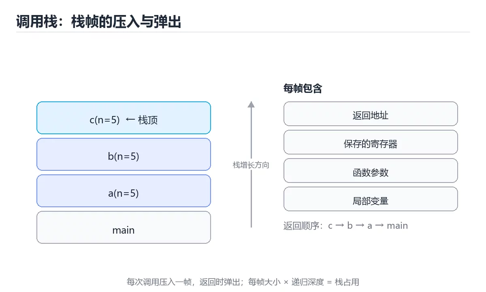
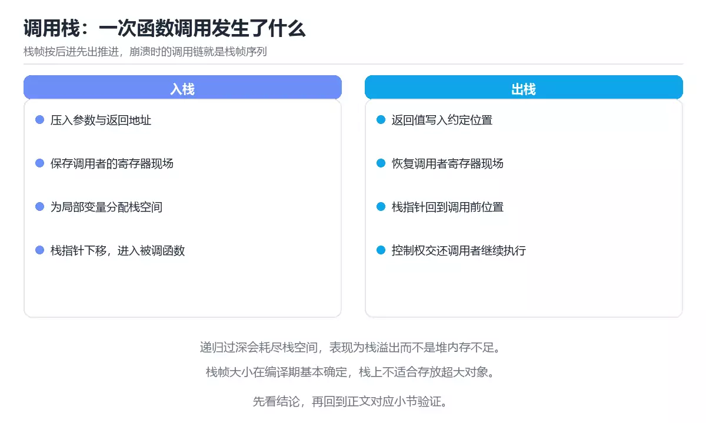

# 图解调用栈与递归

> 内容更新时间：2026-10-06 · 学习阶段：入门 · 预计用时：16 分钟

## 学习目标

- 能用自己的话解释图解调用栈与递归解决了什么问题，而不是只背术语。
- 能说清 「调用栈」、「栈帧」、「递归」、「栈溢出」 之间的关系，并分别举出一个例子。
- 能把本课知识放回「图解专题」的知识体系，说明它和相邻主题的边界。
- 能完成本课练习，并用验收标准检查自己的结果。

> 一句话摘要：栈帧的压入与弹出、递归展开过程、栈溢出的成因。

## 前置知识

- 先完成上一课《图解内存布局：栈、堆与引用》；如果已经掌握，可以直接用本课练习自测。
- 本课阶段：入门。只需要基本计算机操作，不要求编程经验。
- 开始前先复习：调用栈、栈帧、递归。
- 如果某一步看不懂，先记录具体卡点，完成练习后再回头读一遍。



## 一句话说清

每次函数调用都会在栈上压入一个**栈帧**，里面放着参数、局部变量和返回地址。
函数返回时栈帧弹出。看懂栈的形状，递归与栈溢出就都清楚了。

## 一张图看懂函数调用

```python
def c(n):
    return n * 2

def b(n):
    return c(n) + 1

def a(n):
    return b(n) * 10

print(a(5))
```

```text
调用过程（栈从下往上增长）

    ┌──────────────┐
    │ c  n=5       │  ← 栈顶
    ├──────────────┤
    │ b  n=5       │
    ├──────────────┤
    │ a  n=5       │
    ├──────────────┤
    │ main         │
    └──────────────┘

c 返回 10 → 弹出；b 返回 11 → 弹出；a 返回 110 → 弹出
```

## 递归展开：以阶乘为例

```python
def fact(n):
    if n <= 1:
        return 1
    return n * fact(n - 1)

fact(4)
```

```text
递推（压栈）
fact(4) ──► fact(3) ──► fact(2) ──► fact(1) 返回 1

回溯（弹栈）
fact(2) = 2 * 1     = 2
fact(3) = 3 * 2     = 6
fact(4) = 4 * 6     = 24

栈的峰值形状
    ┌──────────────┐
    │ fact(1)      │  最深的栈帧
    ├──────────────┤
    │ fact(2)      │
    ├──────────────┤
    │ fact(3)      │
    ├──────────────┤
    │ fact(4)      │
    └──────────────┘
```

## 栈溢出是怎么发生的

```python
def infinite(n):
    return infinite(n + 1)      # 没有终止条件
```

```text
每调用一次压一个栈帧，栈空间有限：
┌────────┐  栈顶
│ ...    │
│ 帧 N   │
│ 帧 N-1 │
│ ...    │
│ main   │
└────────┘  栈底

压到超出栈上限 → RecursionError / StackOverflowError / 段错误
```

| 语言 | 典型报错 |
| --- | --- |
| Python | `RecursionError: maximum recursion depth exceeded` |
| Java | `StackOverflowError` |
| C# | `StackOverflowException`（不可捕获） |
| C++ | 段错误或未定义行为 |
| Go | panic: stack overflow，且 goroutine 栈会自动扩容后仍可能溢出 |
| Rust | `thread 'main' has overflowed its stack` |

## 递归转循环：尾递归与迭代

```python
# 递归版：栈深度 O(n)
def sum_rec(n):
    return 0 if n == 0 else n + sum_rec(n - 1)

# 迭代版：栈深度 O(1)
def sum_iter(n):
    total = 0
    for i in range(1, n + 1):
        total += i
    return total
```

```text
递归版：栈深随 n 增长        迭代版：栈深恒定
┌──────────┐                 ┌──────────┐
│ 帧 n     │                 │ 循环变量 │
│ 帧 n-1   │                 │ i, total │
│ ...      │                 └──────────┘
└──────────┘
```

## 常见递归的三种终止条件写法

| 场景 | 终止条件 |
| --- | --- |
| 数值递减 | `if n <= 1: return base` |
| 树/图遍历 | 节点为空就返回 |
| 分治 | 区间长度为 1 时直接求解 |

**写递归的顺序永远是：先写出口，再写递推。**

## 新手最容易踩的六个坑

| 坑 | 现象 | 正确做法 |
| --- | --- | --- |
| 忘记终止条件 | 栈溢出 | 先写出口 |
| 终止条件写错边界 | 结果差一 | 用 n=0、n=1 手算验证 |
| 递归深度过大 | 溢出或极慢 | 改迭代或加记忆化 |
| 重复子问题 | 指数级耗时 | 加缓存（记忆化） |
| 以为尾递归一定优化 | 仍然溢出 | 多数语言不保证尾调用优化 |
| 在递归里创建大对象 | 每层都占内存 | 把公共数据提到外层 |



## 本课小结
- **函数调用 = 压栈，返回 = 弹栈**；递归只是同一函数反复压栈。
- 栈空间有限，**深度与每帧大小**共同决定何时溢出。
- 递归的价值在于表达清晰，性能敏感处应改迭代或加记忆化。

## 补充：栈帧布局、尾调用与递归改写

### 一个栈帧里到底存了什么

```text
高地址
┌──────────────────────────────┐
│ 调用者的栈帧                  │
├──────────────────────────────┤
│ 返回地址（回到调用点的下一条） │
│ 保存的寄存器（rbp 等）         │
│ 函数参数                      │
│ 局部变量                      │
│ 临时值 / 对齐填充              │
└──────────────────────────────┘  ← 栈顶（rsp）
低地址
```

| 内容 | 作用 | 出问题时的现象 |
| --- | --- | --- |
| 返回地址 | 函数结束后回到哪 | 被缓冲区溢出覆盖 → 崩溃或劫持 |
| 保存的寄存器 | 恢复调用者状态 | 调用约定不符 → 数据错乱 |
| 参数与局部变量 | 函数的输入与中间状态 | 未初始化 → 随机值 |
| 对齐填充 | 满足 ABI 对齐要求 | 结构体布局不符 → 跨语言调用失败 |

**每帧大小 × 递归深度 = 栈占用**。这也是「递归深度」比「循环次数」更容易触发崩溃的原因。

### 尾调用优化：为什么不能指望它

```python
# 尾递归写法：最后一步只是调用自己
def fact(n, acc=1):
    if n <= 1:
        return acc
    return fact(n - 1, acc * n)     # 位置在「尾」上
```

| 语言 | 是否保证尾调用优化 |
| --- | --- |
| Scheme / 部分函数式语言 | 规范要求 |
| Java / Python / Ruby | **不保证**（Python 明确不优化） |
| JavaScript（严格模式） | 规范曾要求，实际支持有限 |
| Rust / C++ | 编译器可能优化，但不保证 |

结论：**想避免栈溢出，就显式改写成循环或用显式栈**，不要依赖编译器。

### 三种「递归改迭代」的模板

```text
① 尾递归 → 直接换成循环（阶乘、求和）
   把累加器变成循环变量

② 树遍历 → 用显式栈（深度优先）
   手动 push/pop 节点，避免调用栈增长

③ 分治 → 自底向上（动态规划）
   先算子问题再合并，天然无递归
```

```python
# 显式栈模拟递归：前序遍历二叉树
def preorder(root):
    if root is None:
        return []
    result, stack = [], [root]
    while stack:
        node = stack.pop()
        result.append(node.value)
        if node.right:
            stack.append(node.right)   # 先压右，后压左
        if node.left:
            stack.append(node.left)
    return result
```

### 递归的复杂度怎么看

```text
每次只调用一次自己（阶乘）：时间 O(n)，栈深 O(n)
每次调用两次自己（朴素斐波那契）：时间 O(2ⁿ)，栈深 O(n)
分治平均对半（归并排序）：时间 O(n log n)，栈深 O(log n)

关键区别：时间由「调用次数」决定，栈深由「最大嵌套层数」决定
```

```text
记忆化后的斐波那契
  时间从 O(2ⁿ) 降到 O(n)，但栈深仍是 O(n)
  → 数据量大时仍然可能栈溢出，需要改迭代或提高栈上限
```

### 调试时怎么用栈

| 工具 | 命令 | 用途 |
| --- | --- | --- |
| gdb | `bt`、`bt full`、`frame 2` | 看调用链与局部变量 |
| pdb | `where`、`up`、`down` | 在 Python 栈帧间切换 |
| 浏览器 DevTools | Call Stack 面板 | 定位哪一层发起调用 |
| Java | 异常栈 + `jstack` | 线程卡在哪个方法 |

```text
读栈的顺序：从下往上是「谁调用了谁」，最上面是当前执行点
排查卡死时关注：多个线程是否都停在同一个锁上
```

### 自查清单

- [ ] 能说出一帧里存了哪些内容
- [ ] 知道哪种语言保证尾调用优化、哪些不保证
- [ ] 会用显式栈把递归改成迭代
- [ ] 能区分「调用次数」与「最大嵌套深度」
- [ ] 会用调试器读栈并定位卡死点

## 动手练习

> 本课练习重点：围绕「调用栈、栈帧、递归」完成复述、实验和交付，每个结果都要能被别人检查。

先不看原图手绘流程，再标出状态变化，最后用自己的话解释关键一步。

### 练习 1：建立心智模型（10 分钟）

合上教程，用 3～5 句话回答：

1. 图解调用栈与递归解决了什么问题？
2. 如果没有它，会出现什么具体后果？
3. 它和「栈帧」是什么关系？

**验收标准**：至少出现一个本课关键词，并写出一个反例、边界条件或失效场景。

### 练习 2：做一次可控实验（20 分钟）

从正文中选一个最小示例，完成以下操作：

1. 先预测修改一个参数、输入或步骤后的结果。
2. 再实际执行或逐步推演，记录真实结果。
3. 如果结果与预测不同，写出差异原因。

**验收标准**：留下「原例 → 改动 → 预测 → 结果 → 原因」五步记录。

### 练习 3：交付一个小结果（30 分钟）

不看原图手绘一遍流程，再用自己的话指出图中的关键状态变化。

任务要求：

- 结果必须能被别人检查，不能只写“我已经理解了”。
- 至少覆盖「调用栈」和「栈帧」两个关键词。
- 写出 1 个仍然不确定的问题，以及下一步如何验证。

> 提示：时间有限时优先做练习 1 和练习 2；练习 3 可以拆成两次完成。

## 可运行练习

### 任务 1：先跑通，再解释

```python
def c(n):
    return n * 2

def b(n):
    return c(n) + 1

def a(n):
    return b(n) * 10

print(a(5))
```

### 任务 2：只改一个条件

把「图解调用栈与递归」的最小示例复制一份，只改一个条件再跑一次：

- 改动点：只把调用栈的输入换成空值、极值或错误输入，其余保持不变。
- 预测：先写下「图解调用栈与递归」在改动后的输出或错误信息，再运行。
- 记录：对照改动前后的结果，指出差异出在哪一步。
- 验收：换回原条件能复现原结果，改动只影响调用栈。

### 任务 3：迁移到自己的数据

用同一套思路处理一组你自己的数据或场景，保持输出格式与任务 1 一致。

## 故障现场

### 现场 1：本课的 调用栈 常规用例通过，但边界用例失败

**症状**：在本课的练习或生产场景里出现“本课的 调用栈 常规用例通过，但边界用例失败”。

**复现**：准备一组最小输入，只保留触发“本课的 调用栈 常规用例通过，但边界用例失败”的必要条件，连续运行两次确认结果稳定。

**定位**：围绕“调用栈 的前置条件与取值边界没有写进代码，默认值掩盖了空值和极值”检查调用链、输入数据和环境配置，先验证假设再改代码。

**预防**：把“本课的 调用栈 常规用例通过，但边界用例失败”写成一条自动化用例，并在本课的验收清单里保留对应检查项。

### 现场 2：本课的 栈帧 结果在两次运行之间不一致

**症状**：在本课的练习或生产场景里出现“本课的 栈帧 结果在两次运行之间不一致”。

**复现**：准备一组最小输入，只保留触发“本课的 栈帧 结果在两次运行之间不一致”的必要条件，连续运行两次确认结果稳定。

**定位**：围绕“栈帧 依赖了当前版本、执行顺序或共享状态，单次运行无法暴露差异”检查调用链、输入数据和环境配置，先验证假设再改代码。

**预防**：把“本课的 栈帧 结果在两次运行之间不一致”写成一条自动化用例，并在本课的验收清单里保留对应检查项。

### 现场 3：本课的验证只在开发机通过

**症状**：在本课的练习或生产场景里出现“本课的验证只在开发机通过”。

**定位**：围绕“环境版本、配置和输入规模与目标环境不同，调用栈 缺少可重复的验证记录”检查调用链、输入数据和环境配置，先验证假设再改代码。

## 深入补充：图解调用栈与递归 的取舍与边界

### 一、把概念放回真实约束

学习图解调用栈与递归时，最容易只记住结论而忽略前提。先写出三个约束：数据规模、时间预算、可接受的失败方式；再判断 调用栈 与 栈帧 在这些约束下是否仍然成立。只要约束改变，原来的最优解就可能变成错误解。

| 观察到的现象 | 背后的机制 | 验证方式 | 常见误判 |
| --- | --- | --- | --- |
| 延迟突然升高 | 队列堆积或重传 | 分段计时与指标对照 | 只盯平均值 |
| 状态看似随机 | 并发交错或缓存失效 | 固定随机种子复现 | 把时序问题当逻辑错误 |
| 结果与预期不符 | 默认值与边界规则 | 构造最小输入 | 忽略版本差异 |

### 二、三个容易混淆的边界

1. 澄清输入与目标。先写清「图解调用栈与递归」要解决的问题、合法输入范围和成功标准，再进入后续步骤。
2. **把“平均值”当成“全部”**：调用栈 的指标好看，不代表尾部请求、冷启动或失败重试也好看。
3. **把“当前版本”当成“永久行为”**：栈帧 依赖的默认值、API 或性能特征都可能随版本变化，需要固定版本并保留回归用例。

### 三、一个生产场景

假设团队要在真实系统里使用图解调用栈与递归：第一周先做小流量验证，记录 调用栈 的基线与异常；第二周扩大输入规模，观察 栈帧 是否成为瓶颈；第三周再做故障演练，主动注入超时、重复请求和依赖不可用，确认系统能降级、能重试、能恢复。每一步都要留下指标、日志和结论，而不是只留下“感觉更快了”。

### 四、自测清单

- 能否用一句话说出图解调用栈与递归解决的核心问题与不适用场景？
- 能否画出 调用栈 的数据流或状态变化，并标出失败路径？
- 能否给出一个反例，证明某个看似合理的结论在边界条件下不成立？
- 能否写出一条可复现的验证命令，让别人独立得到相同结论？

## 本课复习清单

离开本课前，逐项确认：

- [ ] 不看解析，能说出「函数返回时，栈会发生什么？」的判断依据。
- [ ] 不看解析，能说出「递归函数导致栈溢出的直接原因是？」的判断依据。
- [ ] 不看解析，能说出「把递归改为迭代，最主要解决的是？」的判断依据。
- [ ] 不看解析，能说出「给递归加「记忆化」主要解决什么问题？」的判断依据。
- [ ] 至少运行一次本课示例，记录输入、输出和一个边界情况。
- [ ] 把本课最容易混淆的两个概念写成一句话对照。

| 复盘项 | 记录 |
| --- | --- |
| 已经能独立解释的考点 |  |
| 仍然说不清的概念 |  |
| 下一步验证动作 |  |

## 术语速查

把「图解调用栈与递归」里反复出现的术语集中放在一起。复习时先遮住右列，尝试用自己的话解释，再回到正文核对。

| 术语 | 本课语境 |
| --- | --- |
| `调用栈` | 围绕“环境版本、配置和输入规模与目标环境不同，调用栈 缺少可重复的验证记录”检查调用链、输入数据和环境配置，先验证假设再改代码。 |
| `栈帧` | 围绕“栈帧 依赖了当前版本、执行顺序或共享状态，单次运行无法暴露差异”检查调用链、输入数据和环境配置，先验证假设再改代码。 |
| `递归` | 它在「图解调用栈与递归」里是理解「递归」的关键术语，用来解释定义、适用条件与失败路径；它与调用栈、栈帧共同决定这一节的判断边界。复习时回到正文示例核对输入、输出和验证方式。 |
| `栈溢出` | 它在「图解调用栈与递归」里是理解「栈溢出」的关键术语，用来解释定义、适用条件与失败路径；它与调用栈、栈帧共同决定这一节的判断边界。复习时回到正文示例核对输入、输出和验证方式。 |
| `记忆化` | 它在「图解调用栈与递归」里是理解「记忆化」的关键术语，用来解释定义、适用条件与失败路径；它与调用栈、栈帧共同决定这一节的判断边界。复习时回到正文示例核对输入、输出和验证方式。 |

## 考点精讲

### 考点 1：代码补全·调用栈

- **题目**：下面这段 Python 代码摘自「图解调用栈与递归」的正文示例。关于这段代码，下面哪一项说法与实际内容相符？
- **判断依据**：题干的正确项是这段代码包含循环结构，同一段逻辑会被重复执行，在「图解调用栈与递归」里循环次数与调用栈的输入规模直接相关。这段代码出自「图解调用栈与递归」的正文示例，围绕调用栈、栈帧、递归展开；把输入或边界换成空值、极值或失败情况后，结论要以「图解调用栈与递归」的实际运行结果为准。这道题的关键在「图解调用栈与递归」的调用栈、栈帧、递归：先确认题干“下面这段 Python 代码摘自图解”问的是哪一步，再排除偷换前提的选项。

### 考点 2：概念判断·调用栈

- **题目**：递归函数导致栈溢出的直接原因是？
- **判断依据**：每次调用压一帧，缺少出口就会一直压到超出上限。在「图解调用栈与递归」里，作答时，先用调用栈建立输入与输出的基线，再把递归没有正确终止代入边界条件核对，结论才能复现。「图解调用栈与递归」要求先交代调用栈、栈帧、递归的前提再下结论，所以“递归没有正确终止”只在题干“递归函数导致栈溢出的直接原因是”给定的条件下成立。

### 考点 3：概念判断·调用栈

- **题目**：把递归改为迭代，最主要解决的是？
- **判断依据**：在「图解调用栈与递归」里，栈深度不再随问题规模增长。迭代只用常量级的栈空间，因此不会因规模增大而溢出。在「图解调用栈与递归」里判断这道题，要把调用栈、栈帧、递归的条件、过程与失败路径逐项对齐，换成“把递归改为迭代”这个场景，只有满足前提的结论才成立。回到「图解调用栈与递归」的正文示例，用“把递归改为迭代”走一遍调用栈、栈帧、递归的完整流程，能复现的结论才可以保留。

### 考点 4：概念判断·记忆化

- **题目**：给递归加「记忆化」主要解决什么问题？
- **判断依据**：记忆化把已算过的结果缓存起来，避免指数级的重复计算。在「图解调用栈与递归」里，作答时，先用调用栈建立输入与输出的基线，再把减少重复子问题的计算代入边界条件核对，结论才能复现。在「图解调用栈与递归」里，这道题要求区分概念与边界，「减少重复子问题的计算」只有在题干给出的前提下才成立，而「降低栈深度」、「避免空指针」缺少同一组条件。

### 考点 5：填空·调用栈

- **题目**：补全代码：「图解调用栈与递归」示例中，下面这行代码缺少哪个关键字或函数名？请填入 ____。 `压到超出栈上限 → RecursionError / ____ / 段错误`
- **判断依据**：空格应填写「StackOverflowError」、「stackoverflowerror」。回到「图解调用栈与递归」的正文示例，用“补全代码”走一遍调用栈、栈帧、递归的完整流程，能复现的结论才可以保留。回到调用栈、栈帧、递归本身再看一遍：只有“StackOverflowError”与题干“StackOverflowError”的前提一致，结论才成立。

### 考点 6：多选辨析·调用栈

- **题目**：关于「图解调用栈与递归」，下列哪些说法是正确的？（多选）
- **判断依据**：栈帧的压入与弹出、递归展开过程、栈溢出的成因。在「图解调用栈与递归」里，栈帧被弹出，局部变量随之释放」是否完整覆盖题干的输入、输出和失败路径，并排除「递归没有正确终止」、「栈帧保留到程序结束」这类相邻概念。这道题的关键在「图解调用栈与递归」的调用栈、栈帧、递归：先确认题干“关于图解调用栈与递归”问的是哪一步，再排除偷换前提的选项。

## English Overview

**Title:** Call Stack and Recursion Illustrated

**Summary:** Stack frames, recursion expansion and stack overflow.

**Category:** Visual Guide
**Level:** 入门
**Key terms:** 调用栈, 栈帧, 递归, 栈溢出, 记忆化

## 内容元数据

- 内容版本：v2.0
- 最后更新：2026-10-06
- 学习阶段：入门
- 适用环境：通用图解与系统原理
- 内容来源：内置结构化课程与工程实践整理
- 相关主题：调用栈、栈帧、递归、栈溢出、记忆化
- 质量版本：P0 测验标准 + P1 覆盖扩展 + P2 体验补全

## 参考资料与复核

- 最后复核：2026-10-04
- 下次复核：2027-04-04
- 复核范围：版本兼容、API 行为、安全建议与工程实践
- 来源性质：官方文档、标准或权威教材；正文为离线教学重组

| 参考资料 | 本课用途 |
| --- | --- |
| [MDN 浏览器工作原理](https://developer.mozilla.org/docs/Web/Performance/How_browsers_work) | 从请求到渲染的流程 |
| [Pro Git 内部原理](https://git-scm.com/book/zh/v2/Git-内部原理-Git-对象) | Git 对象与引用关系 |
| [W3C 规范](https://www.w3.org/TR/) | Web 标准结构图 |

> 「图解调用栈与递归」的链接用于离线阅读后的延伸核对；App 不会自动联网。

## 复习与迁移

复习目标：把「图解调用栈与递归」的判断标准放回可复现的例子里。先自己作答，再对照依据；如果结论正确但理由不完整，回到正文补足前提。

### 概念复述

- 用一句话说明「图解调用栈与递归」解决什么问题：栈帧的压入与弹出、递归展开过程、栈溢出的成因。
- 写出调用栈、栈帧、递归之间的关系，并各举一个例子。
- 说出本课最容易混淆的两个概念，以及区分它们的判据。

### 正文逐节复核

- **一句话说清**：每次函数调用都会在栈上压入一个**栈帧**，里面放着参数、局部变量和返回地址。
- **补充：栈帧布局、尾调用与递归改写**：结论：**想避免栈溢出，就显式改写成循环或用显式栈**，不要依赖编译器。
- **深入补充：图解调用栈与递归 的取舍与边界**：学习图解调用栈与递归时，最容易只记住结论而忽略前提。

### 测验回顾

1. 下面这段 Python 代码摘自「图解调用栈与递归」的正文示例。关于这段代码，下面哪一项说法与实际内容相符？
   - 依据：题干的正确项是这段代码包含循环结构，同一段逻辑会被重复执行，在「图解调用栈与递归」里循环次数与调用栈的输入规模直接相关。这段代码出自「图解调用栈与递归」的正文示例，围绕调用栈、栈帧、递归展开；把输入或边界换成空值、极值或失败情况后，结论要以「图解调用栈与递归」的实际运行结果为准。这道题的关键在「图解调用栈与递归」的调用栈、栈帧、递归：先确认题干“下面这段 Python 代码摘自图解”问的是哪一步，再排除偷换前提的选项。
2. 递归函数导致栈溢出的直接原因是？
   - 依据：每次调用压一帧，缺少出口就会一直压到超出上限。在「图解调用栈与递归」里，作答时，先用调用栈建立输入与输出的基线，再把递归没有正确终止代入边界条件核对，结论才能复现。「图解调用栈与递归」要求先交代调用栈、栈帧、递归的前提再下结论，所以“递归没有正确终止”只在题干“递归函数导致栈溢出的直接原因是”给定的条件下成立。
3. 把递归改为迭代，最主要解决的是？
   - 依据：在「图解调用栈与递归」里，栈深度不再随问题规模增长。迭代只用常量级的栈空间，因此不会因规模增大而溢出。在「图解调用栈与递归」里判断这道题，要把调用栈、栈帧、递归的条件、过程与失败路径逐项对齐，换成“把递归改为迭代”这个场景，只有满足前提的结论才成立。回到「图解调用栈与递归」的正文示例，用“把递归改为迭代”走一遍调用栈、栈帧、递归的完整流程，能复现的结论才可以保留。
4. 给递归加「记忆化」主要解决什么问题？
   - 依据：记忆化把已算过的结果缓存起来，避免指数级的重复计算。在「图解调用栈与递归」里，作答时，先用调用栈建立输入与输出的基线，再把减少重复子问题的计算代入边界条件核对，结论才能复现。在「图解调用栈与递归」里，这道题要求区分概念与边界，「减少重复子问题的计算」只有在题干给出的前提下才成立，而「降低栈深度」、「避免空指针」缺少同一组条件。
5. 补全代码：「图解调用栈与递归」示例中，下面这行代码缺少哪个关键字或函数名？请填入 ____。

`压到超出栈上限 → RecursionError / ____ / 段错误`
   - 依据：空格应填写「StackOverflowError」、「stackoverflowerror」。回到「图解调用栈与递归」的正文示例，用“补全代码”走一遍调用栈、栈帧、递归的完整流程，能复现的结论才可以保留。回到调用栈、栈帧、递归本身再看一遍：只有“StackOverflowError”与题干“StackOverflowError”的前提一致，结论才成立。
1. 关于「图解调用栈与递归」，下列哪些说法是正确的？（多选）
   - 依据：栈帧的压入与弹出、递归展开过程、栈溢出的成因。在「图解调用栈与递归」里，栈帧被弹出，局部变量随之释放」是否完整覆盖题干的输入、输出和失败路径，并排除「递归没有正确终止」、「栈帧保留到程序结束」这类相邻概念。这道题的关键在「图解调用栈与递归」的调用栈、栈帧、递归：先确认题干“关于图解调用栈与递归”问的是哪一步，再排除偷换前提的选项。

### 迁移练习

把「图解调用栈与递归」的结论迁移到相邻主题，每次迁移都写清预测与证据：

1. 换输入：用调用栈处理一组你自己的数据，对比教材示例的结果差异。
2. 换失败条件：制造一个栈帧相关的错误，说明如何从错误信息定位根因。
3. 换规模：把数据量或并发度提高一个数量级，说明「图解调用栈与递归」的结论是否仍成立。
