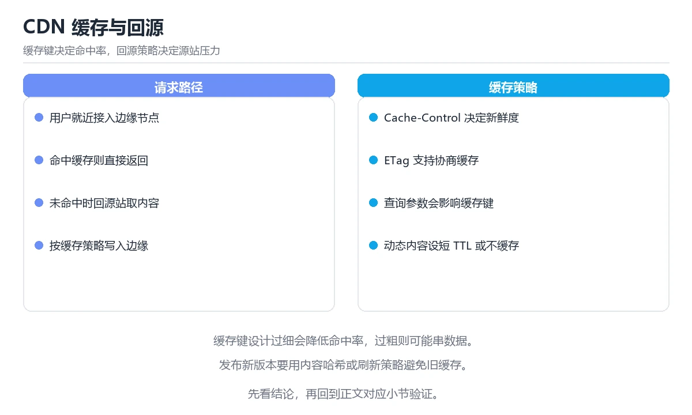

# 图解 CDN 缓存与回源

> 内容更新时间：2026-10-06 · 学习阶段：进阶 · 预计用时：45 分钟


## 本节知识框架

**课程定位**：所属分类为「图解专题」，课程主题为「图解 CDN 缓存与回源」，学习阶段为「进阶」，建议用时 45 分钟。

**本课要解决的主问题**：三层缓存结构、缓存头指令、ETag 校验与回源风暴防护。

| 学习层次 | 要回答的问题 | 完成判据 |
| --- | --- | --- |
| 概念层 | 「图解 CDN 缓存与回源」有哪些必须区分的对象与术语？ | 能用自己的话定义核心术语，并各举一个正例和一个反例。 |
| 机制层 | 这些对象按什么顺序发生作用，输入如何变成输出？ | 能画出或写出机制步骤，并说明每一步的失败条件。 |
| 应用层 | 什么场景适合使用「图解 CDN 缓存与回源」，什么场景不适合？ | 能给出一个真实场景、一个最小示例和一个边界案例。 |
| 性能层 | 时间、空间、吞吐或延迟受哪些量影响？ | 能说出复杂度或性能瓶颈的证据来源；没有证据时明确写“材料未提供”。 |
| 复习层 | 怎样确认自己不是只记住了结论？ | 能独立完成本课自测，并把错误定位到概念、机制、示例或边界。 |

### 阅读路线

1. 先读「核心概念定义」，建立「CDN」等对象的精确定义。
2. 再读「原理与运行机制」，把定义串成可重复的过程。
3. 用「代码/协议/SQL 示例」验证过程，并只改一个条件观察结果变化。
4. 最后检查性能、易错点、知识关系与自测题，形成可复习的证据链。

**前置知识**：《图解 OAuth 2.0 授权码流程与 PKCE》

**学习位置**：本课位于《图解 OAuth 2.0 授权码流程与 PKCE》之后；如果前一课的自测不能通过，应先回补再继续。

**后续衔接**：下一课《图解限流、熔断与降级》会继续使用本课术语，学完后建议立即完成一次自测。

**教材衔接：学习目标**

- 能用自己的话解释图解 CDN 缓存与回源解决了什么问题，而不是只背术语。
- 能说清 「CDN」、「缓存」、「回源」、「ETag」 之间的关系，并分别举出一个例子。
- 能把 CDN 放回「图解 CDN 缓存与回源」的知识体系，说明它和 缓存 的边界。
- 能完成本课练习，并用验收标准检查自己的结果。

> 一句话摘要：三层缓存结构、缓存头指令、ETag 校验与回源风暴防护。

**教材衔接：前置知识**

- 先完成上一课《图解 OAuth 2.0 授权码流程与 PKCE》；如果已经掌握，可以直接用本课练习自测。
- 本课阶段：进阶。建议先完成「图解 OAuth 2.0 授权码流程与 PKCE」，或确认自己能独立跑通正文里的 HTML 示例。
- 开始前先复习：CDN、缓存、回源。
- 卡在 CDN 上时不要跳过：把输入、预期和实际输出写成三行，再回头读正文。

**教材衔接：本课小结**

- CDN 的效果由**缓存键与 TTL** 决定，配置前先想清楚哪些内容可以共享。
- 静态资源用**内容哈希 + 长缓存**，HTML 用**no-cache**。
- 防回源风暴的三件套：`stale-while-revalidate`、请求合并、预热。

## 核心概念定义

> 在阅读《图解 CDN 缓存与回源》时，术语第一次出现先给操作性定义，再给边界；正文说法与这里冲突时，以定义和可复现示例为准。

| 术语 | 操作性定义 | 本课中的边界 |
| --- | --- | --- |
| CDN | 把静态或可缓存内容分发到边缘节点，降低源站压力和用户延迟。 | 仅在「图解 CDN 缓存与回源」明确给出的输入、版本与资源条件下成立。 |
| 缓存 | 把计算或读取结果暂存到更快存储，后续请求直接复用。 | 仅在「图解 CDN 缓存与回源」明确给出的输入、版本与资源条件下成立。 |
| 回源 | 缓存未命中时向源站请求数据并决定是否重新缓存。 | 仅在「图解 CDN 缓存与回源」明确给出的输入、版本与资源条件下成立。 |
| 命中率 | 缓存请求中成功直接返回结果的比例。 | 仅在「图解 CDN 缓存与回源」明确给出的输入、版本与资源条件下成立。 |
| 缓存键 | 决定缓存能否命中的字符串，通常包含依赖锁文件的哈希，写错就会复用到过期的依赖 | 仅在「图解 CDN 缓存与回源」明确给出的输入、版本与资源条件下成立。 |

### 定义如何使用

在「图解 CDN 缓存与回源」中判断一个说法是否成立，先确认它使用的是哪个对象的定义，再检查输入规模、运行环境与失败路径。定义不是口号，而是后续推导、代码示例和自测题共享的约束。

## 原理与运行机制

### 机制总览

1. **建立输入**：把「CDN」按本课定义整理成可观察、可重复的输入条件。
2. **执行转换**：围绕「缓存」执行本课的核心步骤；每一步都记录中间状态，避免只看最终输出。
3. **产生输出**：得到「回源」后，用正文示例或协议/SQL 结果核对输出是否符合预期。
4. **改变一个条件**：只替换一个边界条件或环境参数，观察「图解 CDN 缓存与回源」的结论是否仍然成立。

| 阶段 | 关注对象 | 失败时应检查 |
| --- | --- | --- |
| 输入 | CDN | 类型、范围、编码、版本或前置状态是否满足定义。 |
| 处理 | 缓存 | 顺序、可见性、锁、路由、事务或调度规则是否被破坏。 |
| 输出 | 回源 | 结果是否可复现，错误是否被正确传播而不是被吞掉。 |

本课的机制结论要用「图解 CDN 缓存与回源」自己的示例验证。「图解 CDN 缓存与回源」没有给出某个数量级、吞吐或内存数据时，本课把该判断标为“材料未提供”，不从相邻主题外推。

**教材衔接：一句话说清**

CDN 的本质是「把内容提前放到离用户近的节点」。
它是否有效，取决于两件事：**缓存命中率**与**回源策略**。

## 典型应用场景

| 场景 | 典型输入或前提 | 期望产物 |
| --- | --- | --- |
| 学习验证 | 使用本课最小示例和 CDN、缓存 | 能复现正文结论，并解释每一步。 |
| 工程落地 | 把「图解 CDN 缓存与回源」放入真实模块或服务边界 | 输出可观测、失败可定位、参数可配置。 |
| 故障排查 | 只改一个版本、规模、输入或依赖条件 | 能区分概念错误、实现错误和环境差异。 |

判断「图解 CDN 缓存与回源」的场景是否成立，标准是能否写出输入、处理、输出和失败路径；材料中没有出现的数据在本课标注为“材料未提供”，不用推测替代证据。

## 代码/协议/SQL 示例

以下代码、协议或 SQL 片段来自《图解 CDN 缓存与回源》原文，保留原有语言标记与上下文；先预测《图解 CDN 缓存与回源》示例的输出，再按正文步骤运行或推演，示例依赖外部环境时同时记录版本与输入。

**教材衔接：两种校验方式：ETag 与 Last-Modified**

```text
① 强校验：ETag
   客户端：If-None-Match: "abc123"
   服务端：内容未变 → 304 Not Modified（无正文，省带宽）
              内容已变 → 200 + 新内容

② 时间校验：Last-Modified
   客户端：If-Modified-Since: Wed, 05 Mar 2026 06:02:11 GMT
   服务端：未变 → 304
```

| 方式 | 精度 | 说明 |
| --- | --- | --- |
| ETag | 高（内容指纹） | 推荐 |
| Last-Modified | 秒级 | 简单但有精度限制 |

**304 依然是一次网络往返**，减少的是带宽而不是延迟。

**教材衔接：回源风暴与防护**

```text
场景：缓存刚过期，大量请求同时未命中

  边缘节点 ──┐
  边缘节点 ──┼──► 源站（瞬时 QPS 暴涨）→ 源站被打垮
  边缘节点 ──┘

防护手段
  · stale-while-revalidate：先返回旧内容，只有一个请求回源
  · 请求合并（collapse）：同一 URL 的并发回源合并成一个
  · 源站限流与排队
  · 预热：发布前主动预热热点资源
```

**教材衔接：日志与可观测性**

| 指标 | 含义 | 关注点 |
| --- | --- | --- |
| 命中率 | 命中请求 / 总请求 | 低于 90% 要查原因 |
| 回源率 | 回源请求 / 总请求 | 突升说明缓存被击穿 |
| 回源带宽 | 源站出口流量 | 直接关联成本 |
| 首字节时间 | 边缘到用户的响应 | 体验指标 |

```text
命中率低的四个常见原因
  · 查询参数或 Cookie 导致缓存键频繁变化
  · TTL 设得太短
  · 内容按用户定制（未区分公共与私有）
  · Vary 头设置过宽
```

## 时间/空间复杂度或性能分析

**复杂度证据**：「图解 CDN 缓存与回源」的现有材料没有给出渐近时间或空间复杂度的明确结论，本课只做定性检查，不补写未经验证的 $O$ 记号。

| 维度 | 本课关注点 | 判断依据 |
| --- | --- | --- |
| 时间/延迟 | 「图解 CDN 缓存与回源」的主要步骤是否会随输入规模、并发度或网络往返增长。 | 以正文复杂度、基准数据或可重复测量为准。 |
| 空间/内存 | 中间状态、缓存、副本、连接或索引是否随规模增长。 | 记录峰值内存与数据副本，不只看最终结果。 |
| 吞吐/资源 | 版本、调度、锁、IO、序列化或协议开销是否成为瓶颈。 | 固定环境做对照实验，改变一个变量。 |

评估「图解 CDN 缓存与回源」时要区分“正确性成立”和“性能达标”两件事；材料没有给出基准时，本课只保留量级来源与测量方法，不写不可验证的绝对数字。

**教材衔接：一张图看懂缓存分层**

```text
用户 ──①──► 边缘节点 Edge（就近）
              │  命中 → 直接返回（最快，无需回源）
              │  未命中
              ▼
            ② 上层节点 / 区域中心（可选）
              │  命中 → 返回并回填边缘
              │  未命中
              ▼
            ③ 源站 Origin
                 返回内容 + 缓存头（告诉 CDN 怎么缓存）
                  │
                  ▼
            ④ 逐层回填，下次命中
```

| 层级 | 作用 | 命中收益 |
| --- | --- | --- |
| 边缘节点 | 就近服务 | 延迟最低 |
| 区域中心 | 多层缓存，减少回源 | 中等 |
| 源站 | 权威内容 | 回源成本最高 |

**教材衔接：缓存头：决定 CDN 行为的四个字段**

```http
Cache-Control: public, max-age=31536000, immutable
Cache-Control: no-cache              # 可缓存，但每次要校验
Cache-Control: no-store              # 完全不缓存（敏感数据）
Cache-Control: private, max-age=0    # 只允许浏览器缓存
```

| 指令 | 含义 | 适用 |
| --- | --- | --- |
| `max-age` | 缓存有效期（秒） | 静态资源 |
| `s-maxage` | CDN 专用有效期，优先于 max-age | 需要 CDN 与浏览器不同 TTL |
| `no-cache` | 缓存但每次需校验 | HTML |
| `no-store` | 完全不缓存 | 含隐私的接口 |
| `immutable` | 期限内不校验 | 带哈希的静态文件 |
| `stale-while-revalidate` | 过期后先返回旧内容再后台刷新 | 提升体验 |

```text
推荐的组合
  带内容哈希的静态资源（app.a1b2c3.js）
    Cache-Control: public, max-age=31536000, immutable

  HTML 入口
    Cache-Control: no-cache          # 每次校验，保证能拿到新版本

  用户私有接口
    Cache-Control: private, no-store
```

**教材衔接：缓存失效与刷新**

```text
三种更新方式
  ① 内容哈希（最推荐）：文件名变即新资源，无需刷新
     app.a1b2c3.js → app.d4e5f6.js

  ② 主动刷新（purge）：调用 CDN API 清理指定 URL
     适合紧急修复；注意全量刷新会引发回源风暴

  ③ 版本查询参数：app.js?v=123
     简单，但部分 CDN 对带参数 URL 缓存策略不同，效果不稳定
```

```bash
# 主动刷新示例（伪命令，各厂商 API 不同）
cdn-cli purge --url https://example.com/index.html
cdn-cli purge --prefix https://example.com/assets/
```

**教材衔接：补充：缓存键设计、命中率优化与两类事故**

### 缓存键怎么设计

```text
默认键 = 完整 URL（含查询参数）

常见调整方式
  · 忽略无意义参数：?utm_source=xxx 不影响内容 → 从键里剔除
  · 归一化参数顺序：?b=2&a=1 与 ?a=1&b=2 视为同一资源
  · 设备维度：移动端与桌面端返回不同 → 加入 Vary: User-Agent
  · 语言维度：多语言站点 → 加入 Vary: Accept-Language

原则：键里只放「会影响响应内容」的维度
      维度越多 → 缓存碎片越多 → 命中率越低
```

| 键的维度 | 命中率影响 | 建议 |
| --- | --- | --- |
| 只用 URL | 最高 | 静态资源默认选择 |
| URL + 设备 | 明显下降 | 只在响应确实不同时使用 |
| URL + 用户 ID | 几乎为 0 | 私有内容不应走公共缓存 |

### TTL 与刷新策略对照

| 内容类型 | 缓存头 | 刷新方式 |
| --- | --- | --- |
| 带哈希的 JS/CSS | `max-age=31536000, immutable` | 换文件名即可 |
| HTML 入口 | `no-cache` | 每次校验（304 省带宽） |
| 接口 JSON（可公共） | `max-age=60, stale-while-revalidate=30` | 短 TTL + 后台刷新 |
| 图片/字体 | `max-age=604800` | 需要更新时换文件名 |
| 用户私有数据 | `private, no-store` | 不缓存 |

```text
stale-while-revalidate 的价值
  过期后先返回旧内容（用户零等待），后台异步取新内容
  → 既保证响应快，又能避免大批请求同时回源
```

### 命中率优化的六条清单

```text
① 静态资源统一「内容哈希 + 长缓存」
② HTML 与其引用的资源版本号一致（避免新旧混合）
③ 剔除不影响内容的查询参数
④ 减小 Vary 维度
⑤ 避免带 Cookie 的公共资源请求
⑥ 对热点资源做预热（发布前主动请求一遍）
```

| 指标 | 健康值 | 偏低时先查 |
| --- | --- | --- |
| 命中率 | ≥ 90% | 缓存键、TTL、Vary |
| 回源率 | ≤ 10% | 是否被频繁刷新 |
| 回源带宽 | 按业务基线 | 是否有大文件未缓存 |

### 两类经典事故

```text
① 缓存穿透（查询不存在的数据）
   请求 id=-1 → 缓存无 → 打到数据库 → 数据库压力剧增
   对策：
     · 缓存空值（短 TTL，如 30 秒）
     · 入口做参数校验，拒绝明显非法请求
     · 布隆过滤器拦截不存在的 key

② 缓存雪崩（大量 key 同时失效）
   统一 TTL 到点集体过期 → 全部回源 → 源站被打垮
   对策：
     · TTL 加随机抖动（如 3600 ± 300 秒）
     · 用 stale-while-revalidate 平滑回源
     · 热点数据预热，并做源站限流兜底
```

### 发布时最容易踩的坑

| 坑 | 现象 | 正确做法 |
| --- | --- | --- |
| HTML 长缓存 | 用户长期拿不到新版本 | HTML 用 no-cache |
| 资源文件名不变 | 用户拿到旧的 JS | 文件名带内容哈希 |
| 全量刷新缓存 | 回源风暴 | 按需刷新 + 预热 |
| 私有数据设 public | 串号风险 | `private` 或 `no-store` |
| 忽略 Vary | 缓存了错误变体 | 明确需要区分的请求头 |

### 自查清单

- [ ] 静态资源用内容哈希加长缓存
- [ ] HTML 使用 no-cache 并带 ETag
- [ ] 缓存键只包含影响内容的维度
- [ ] 私有数据明确标记为 private 或 no-store
- [ ] 对穿透与雪崩都有防护（空值缓存、TTL 抖动、预热）

**教材衔接：深入补充：图解 CDN 缓存与回源 的取舍与边界**

### 一、把概念放回真实约束

学习图解 CDN 缓存与回源时，最容易只记住结论而忽略前提。先写出三个约束：数据规模、时间预算、可接受的失败方式；再判断 CDN 与 缓存 在这些约束下是否仍然成立。只要约束改变，原来的最优解就可能变成错误解。

| 观察到的现象 | 背后的机制 | 验证方式 | 常见误判 |
| --- | --- | --- | --- |
| 延迟突然升高 | 队列堆积或重传 | 分段计时与指标对照 | 只盯平均值 |
| 状态看似随机 | 并发交错或缓存失效 | 固定随机种子复现 | 把时序问题当逻辑错误 |
| 结果与预期不符 | 默认值与边界规则 | 构造最小输入 | 忽略版本差异 |

### 二、三个容易混淆的边界

1. 澄清输入与目标。先写清「图解 CDN 缓存与回源」要解决的问题、合法输入范围和成功标准，再进入后续步骤。
2. **把“平均值”当成“全部”**：CDN 的指标好看，不代表尾部请求、冷启动或失败重试也好看。
3. **把“当前版本”当成“永久行为”**：缓存 依赖的默认值、API 或性能特征都可能随版本变化，需要固定版本并保留回归用例。

### 三、一个生产场景

假设团队要在真实系统里使用图解 CDN 缓存与回源：第一周先做小流量验证，记录 CDN 的基线与异常；第二周扩大输入规模，观察 缓存 是否成为瓶颈；第三周再做故障演练，主动注入超时、重复请求和依赖不可用，确认系统能降级、能重试、能恢复。每一步都要留下指标、日志和结论，而不是只留下“感觉更快了”。

### 四、自测清单

- 能否用一句话说出图解 CDN 缓存与回源解决的核心问题与不适用场景？
- 能否画出 CDN 的数据流或状态变化，并标出失败路径？
- 能否给出一个反例，证明 CDN 的结论在边界条件下不成立？
- 能否写出一条可复现的验证命令，让别人独立得到相同结论？

## 常见误区与易错点

> 复核《图解 CDN 缓存与回源》的易错点时，优先保留原文的错误表、故障现场与排错路径；每条修正都要能用本课示例复验。

| 易错点 | 常见表现 | 正确做法 |
| --- | --- | --- |
| 只背结论 | 能复述「图解 CDN 缓存与回源」的定义，却说不清输入、输出与边界。 | 回到机制步骤，用最小示例逐一验证。 |
| 混淆相邻概念 | 把本课对象与相邻主题的对象当成同一类。 | 先比较定义、资源归属、生命周期和失败模式。 |
| 忽略版本与环境 | 在开发机通过后直接外推到生产环境。 | 固定版本、输入和资源条件，再记录可复现结果。 |

**教材衔接：常见错误与排查**

| 坑 | 现象 | 正确做法 |
| --- | --- | --- |
| HTML 长缓存 | 用户拿不到新版本 | HTML 用 no-cache |
| 静态资源短缓存 | 命中率低 | 带哈希后设长 TTL |
| 带 Cookie 请求走缓存 | 串号风险 | 私有内容用 private |
| 用查询参数做版本 | 缓存行为不稳定 | 用文件名哈希 |
| 全量刷新缓存 | 回源风暴 | 按需刷新加预热 |
| 忽略 Vary 头 | 缓存了错误变体 | 明确 Vary 字段 |
| 不监控命中率 | 成本高且慢 | 设命中率告警 |
| 私有数据设 public | 泄露 | 私有内容不缓存或 private |



**教材衔接：故障现场**

### 现场 1：HTML 长缓存

**症状**：在《图解 CDN 缓存与回源》的复现场景中，用户拿不到新版本。

**根因**：当出现“HTML 长缓存”时，执行路径已经绕过了《图解 CDN 缓存与回源》的关键约束，最终以“用户拿不到新版本”暴露出来；修复前必须先确认约束在哪里失效。

**修复**：针对《图解 CDN 缓存与回源》的问题，HTML 用 no-cache。

**验证**：在《图解 CDN 缓存与回源》中按“HTML 用 no-cache”调整后，从“HTML 长缓存”的触发条件重放同一条路径，确认“用户拿不到新版本”不再出现，并补一个相邻边界用例检查没有引入新问题。

### 现场 2：用查询参数做版本

**症状**：在《图解 CDN 缓存与回源》的复现场景中，缓存行为不稳定。

**根因**：当出现“用查询参数做版本”时，执行路径已经绕过了《图解 CDN 缓存与回源》的关键约束，最终以“缓存行为不稳定”暴露出来；修复前必须先确认约束在哪里失效。

**修复**：针对《图解 CDN 缓存与回源》的问题，用文件名哈希。

**验证**：先在《图解 CDN 缓存与回源》中记录“用查询参数做版本”留下的失败证据，再执行“用文件名哈希”并重放；确认错误路径变为明确结果，且修复没有掩盖同类故障。

### 现场 3：忽略 Vary 头

**症状**：在《图解 CDN 缓存与回源》的复现场景中，缓存了错误变体。

**根因**：“缓存了错误变体”只是表层结果。向上追溯会落到“忽略 Vary 头”这一步，因为它省略了《图解 CDN 缓存与回源》的约束，使实现行为和预期模型发生了偏离。

**修复**：针对《图解 CDN 缓存与回源》的问题，明确 Vary 字段。

**验证**：先在《图解 CDN 缓存与回源》中记录“忽略 Vary 头”留下的失败证据，再执行“明确 Vary 字段”并重放；确认错误路径变为明确结果，且修复没有掩盖同类故障。

## 与其他知识点的关系

| 关系 | 课程 | 为什么 |
| --- | --- | --- |
| 先修 | 《图解 OAuth 2.0 授权码流程与 PKCE》 | 本课会直接使用它的概念或操作前提。 |
| 关联 | 《图解限流、熔断与降级》 | 用于横向比较或把本课结论迁移到相邻主题。 |
| 关联 | 《CDN、代理与缓存》 | 用于横向比较或把本课结论迁移到相邻主题。 |
| 前置顺序 | 《图解 OAuth 2.0 授权码流程与 PKCE》 | 同分类中安排在本课之前，建议先完成其自测。 |
| 后续顺序 | 《图解限流、熔断与降级》 | 同分类中安排在本课之后，会继续使用本课术语。 |

把「图解 CDN 缓存与回源」放回知识体系时，不只要记住“前面学过什么”，还要说明两个主题在输入、机制、资源边界和失败模式上的差异。这样才能把单课知识迁移到项目、排障和后续课程。

## 自测题与参考答案

> 先独立完成《图解 CDN 缓存与回源》的自测，再核对答案与解析。答案必须能在本课正文或示例中找到依据，不能只凭语感。

### 自测 1

围绕“图解 CDN 缓存与回源”中的 CDN、缓存、回源，下列哪两项是本课强调的实践判断？

A. 把 缓存 的单次运行结果当成所有版本和规模都成立
B. 学习 CDN 时要同时说明输入、输出和失败路径，不能只看正常流程
C. 只要 CDN 的常规示例通过，就可以跳过边界与异常路径
D. 验证 缓存 时要固定版本并覆盖边界输入，结论才可复现

**参考答案**：学习 CDN 时要同时说明输入、输出和失败路径，不能只看正常流程；验证 缓存 时要固定版本并覆盖边界输入，结论才可复现

**解析**：本课把图解 CDN 缓存与回源拆成概念、示例与故障现场三部分，因此判断 CDN 时必须同时交代输入、输出和失败路径，这使“学习 CDN 时要同时说明输入、输出和失败路径，不能只看正常流程”成立。在图解 CDN 缓存与回源里，判断 缓存 时要固定版本与边界输入，所以“验证 缓存 时要固定版本并覆盖边界输入，结论才可复现”才可复现。

### 自测 2

下面这段代码摘自「图解 CDN 缓存与回源」的正文示例。关于这段代码，下面哪一项说法与实际内容相符？

```http
Cache-Control: public, max-age=31536000, immutable
Cache-Control: no-cache              # 可缓存，但每次要校验
Cache-Control: no-store              # 完全不缓存（敏感数据）
Cache-Control: private, max-age=0    # 只允许浏览器缓存
```

A. 这段代码会产生可观察的输出，运行后能看到结果。
B. 这段代码只做静态声明，没有循环、分支或可观察输出。
C. 这段代码包含异常处理分支，失败时会走专门的补救路径。
D. 这段代码会读取外部输入，结果依赖传入的数据。

**参考答案**：这段代码只做静态声明，没有循环、分支或可观察输出。

**解析**：题干的正确项是这段代码只做静态声明，没有循环、分支或可观察输出，在「图解 CDN 缓存与回源」里它只能证明CDN相关约束存在，不能替代真实运行证据。这段代码出自「图解 CDN 缓存与回源」的正文示例，围绕CDN、缓存、回源展开；把输入或边界换成空值、极值或失败情况后，结论要以「图解 CDN 缓存与回源」的实际运行结果为准。这道题的关键在「图解 CDN 缓存与回源」的CDN、缓存、回源：先确认题干“下面这段代码摘自图解 CDN 缓”问的是哪一步，再排除偷换前提的选项。

### 自测 3

缓存刚过期时大量请求同时回源，最有效的防护是？

A. 关闭 CDN
B. stale-while-revalidate + 请求合并
C. 延长源站超时
D. 直接在源站上不断增加线程数、连接数与带宽来硬扛回源压力，但这会让抖动更明显

**参考答案**：stale-while-revalidate + 请求合并

**解析**：在「图解 CDN 缓存与回源」里，stale-while-revalidate + 请求合并。先返回旧内容并合并回源请求，可避免瞬时洪峰。回到「图解 CDN 缓存与回源」的正文示例，用“缓存刚过期时大量请求同时回源”走一遍CDN、缓存、回源的完整流程，能复现的结论才可以保留。

**教材衔接：动手练习**

> 本课练习重点：围绕「CDN、缓存、回源」完成复述、实验和交付，每个结果都要能被别人检查。

凭记忆画出 HTML 的执行顺序，与正文对照后补上遗漏环节。

### 练习 1：建立心智模型（10 分钟）

合上教程，用 3～5 句话回答：

1. 图解 CDN 缓存与回源解决了什么问题？
2. 如果没有它，会出现什么具体后果？
3. 它和「缓存」是什么关系？

验收标准：用自己的话解释 CDN，并给出一个它不成立的反例。

### 练习 2：做一次可控实验（20 分钟）

从正文中选一个最小示例，完成以下操作：

1. 先预测修改一个参数、输入或步骤后的结果。
2. 再实际执行或逐步推演，记录真实结果。
3. 如果结果与预测不同，写出差异原因。

**验收标准**：用 HTML 复现原例后，把缓存改成边界值，五步记录缺一不可，其中「原因」一栏要写明「图解 CDN 缓存与回源」里哪条规则被触发。

### 练习 3：交付一个小结果（30 分钟）

不看原图手绘一遍流程，再用自己的话指出图中的关键状态变化。

任务要求：

- 结果必须能被别人检查，不能只写“我已经理解了”。
- 至少覆盖「CDN」和「缓存」两个关键词。
- 写出 1 个仍然不确定的问题，以及下一步如何验证。

> 提示：时间有限时优先做练习 1 和练习 2；练习 3 可以拆成两次完成。

**教材衔接：可运行练习**

### 任务 1：先跑通，再解释

```bash
# 主动刷新示例（伪命令，各厂商 API 不同）
cdn-cli purge --url https://example.com/index.html
cdn-cli purge --prefix https://example.com/assets/
```

### 任务 2：只改一个条件

把「图解 CDN 缓存与回源」的最小示例复制一份，只改一个条件再跑一次：

- 改动点：只调整 HTML 的一个参数，其余条件一律不动。
- 预测：先写下「图解 CDN 缓存与回源」在改动后的输出或错误信息，再运行。
- 记录：对照改动前后的结果，指出差异出在哪一步。
- 验收：换回原条件能复现原结果，改动只影响CDN。

### 任务 3：迁移到自己的数据

换一个 缓存 场景重做一次，确认结论不是只对示例数据成立。

**教材衔接：本课复习清单**

离开本课前，逐项确认：

- [ ] 不看解析，能说出「带内容哈希的静态资源（如 app.a1b2c3.js）推荐使用什么缓存策略？」的判断依据。
- [ ] 不看解析，能说出「HTML 入口页面更适合哪种缓存策略？」的判断依据。
- [ ] 不看解析，能说出「缓存刚过期时大量请求同时回源，最有效的防护是？」的判断依据。
- [ ] 不看解析，能说出「304 Not Modified 相比 200 的主要收益是？」的判断依据。
- [ ] 跑通「图解 CDN 缓存与回源」的最小示例，并记录一次失败输入的处理方式。
- [ ] 把本课最容易混淆的两个概念写成一句话对照。

| 复盘项 | 记录 |
| --- | --- |
| 已经能独立解释的考点 |  |
| 仍然说不清的概念 |  |
| 下一步验证动作 |  |

**教材衔接：复习与自测**

- [ ] 能不看正文写出「一句话说清」的关键步骤。
- [ ] 能用一句话说明「一张图看懂缓存分层」解决什么问题。
- [ ] 能把「缓存头：决定 CDN 行为的四个字段」的判断标准套到一个新例子上。
- [ ] 能说清「两种校验方式：ETag 与 Last-Modified」的结论，并说出它的适用边界。
- [ ] 能用自己的话复述「缓存失效与刷新」，并各举一个正例和反例。
- [ ] 能解释「回源风暴与防护」里最容易混淆的两个概念。

---

## 术语速查

把「图解 CDN 缓存与回源」里反复出现的术语集中放在一起。复习时先遮住右列，尝试用自己的话解释，再回到正文核对。

| 术语 | 一句话说明 |
| --- | --- |
| `CDN` | 把静态或可缓存内容分发到边缘节点，降低源站压力和用户延迟。 |
| `缓存` | 把计算或读取结果暂存到更快存储，后续请求直接复用。 |
| `回源` | 缓存未命中时向源站请求数据并决定是否重新缓存。 |
| `命中率` | 缓存请求中成功直接返回结果的比例。 |
| `缓存键` | 决定缓存能否命中的字符串，通常包含依赖锁文件的哈希，写错就会复用到过期的依赖 |

## 考点精讲

### 考点 1：多选辨析·CDN

- **题目**：围绕“图解 CDN 缓存与回源”中的 CDN、缓存、回源，下列哪两项是本课强调的实践判断？
- **判断依据**：本课把图解 CDN 缓存与回源拆成概念、示例与故障现场三部分，因此判断 CDN 时必须同时交代输入、输出和失败路径，这使“学习 CDN 时要同时说明输入、输出和失败路径，不能只看正常流程”成立。在图解 CDN 缓存与回源里，判断 缓存 时要固定版本与边界输入，所以“验证 缓存 时要固定版本并覆盖边界输入，结论才可复现”才可复现。

### 考点 2：代码补全·CDN

- **题目**：下面这段代码摘自「图解 CDN 缓存与回源」的正文示例。关于这段代码，下面哪一项说法与实际内容相符？
- **判断依据**：题干的正确项是这段代码只做静态声明，没有循环、分支或可观察输出，在「图解 CDN 缓存与回源」里它只能证明CDN相关约束存在，不能替代真实运行证据。这段代码出自「图解 CDN 缓存与回源」的正文示例，围绕CDN、缓存、回源展开；把输入或边界换成空值、极值或失败情况后，结论要以「图解 CDN 缓存与回源」的实际运行结果为准。这道题的关键在「图解 CDN 缓存与回源」的CDN、缓存、回源：先确认题干“下面这段代码摘自图解 CDN 缓”问的是哪一步，再排除偷换前提的选项。

### 考点 3：概念判断·CDN

- **题目**：缓存刚过期时大量请求同时回源，最有效的防护是？
- **判断依据**：在「图解 CDN 缓存与回源」里，stale-while-revalidate + 请求合并。先返回旧内容并合并回源请求，可避免瞬时洪峰。回到「图解 CDN 缓存与回源」的正文示例，用“缓存刚过期时大量请求同时回源”走一遍CDN、缓存、回源的完整流程，能复现的结论才可以保留。

### 考点 4：概念判断·CDN

- **题目**：304 Not Modified 相比 200 的主要收益是？
- **判断依据**：在「图解 CDN 缓存与回源」里，作答时，先用CDN建立输入与输出的基线，再把省掉正文传输带宽，但仍有一次往返代入边界条件核对，结论才能复现。在「图解 CDN 缓存与回源」里，这道题要求区分概念与边界，「省掉正文传输带宽，但仍有一次往返」只有在题干给出的前提下才成立，而「减少网络往返次数」、「完全不需要网络」缺少同一组条件。

### 考点 5：填空·CDN

- **题目**：补全代码：「图解 CDN 缓存与回源」示例中，下面这行代码缺少哪个关键字或函数名？请填入 ____。 `Cache-Control: public, max-age=31536000, ____`
- **判断依据**：在「图解 CDN 缓存与回源」里，immutable。这道题的关键在「图解 CDN 缓存与回源」的CDN、缓存、回源：先确认题干“补全代码”问的是哪一步，再排除偷换前提的选项。回到CDN、缓存、回源本身再看一遍：只有“immutable”与题干“缓存与回源示例中”的前提一致，结论才成立。

## English Overview

**Title:** CDN Caching Illustrated

**Summary:** Cache layers, headers, validators and origin storm protection.

**Category:** Visual Guide
**Level:** 进阶
**Key terms:** CDN, 缓存, 回源, ETag, 命中率

## 内容元数据

- 内容版本：v2.0
- 最后更新：2026-10-06
- 学习阶段：进阶
- 适用环境：通用图解与系统原理；本课聚焦 CDN。
- 内容来源：内置结构化课程与工程实践整理
- 相关主题：CDN、缓存、回源、ETag、命中率
- 质量版本：P0 测验标准 + P1 覆盖扩展 + P2 体验补全

## 参考资料与复核

- 最后复核：2026-10-04
- 下次复核：2027-07-10
- 复核范围：版本兼容、API 行为、安全建议与工程实践
- 来源性质：官方文档、标准或权威教材；正文为离线教学重组

| 参考资料 | 本课用途 |
| --- | --- |
| [W3C 规范](https://www.w3.org/TR/) | Web 标准结构图 |
| [Cloudflare Learning](https://www.cloudflare.com/learning/) | 网络流程与概念图解 |
| [Pro Git 内部原理](https://git-scm.com/book/zh/v2/Git-内部原理-Git-对象) | Git 对象与引用关系 |

> 「图解 CDN 缓存与回源」的链接用于离线阅读后的延伸核对；App 不会自动联网。
