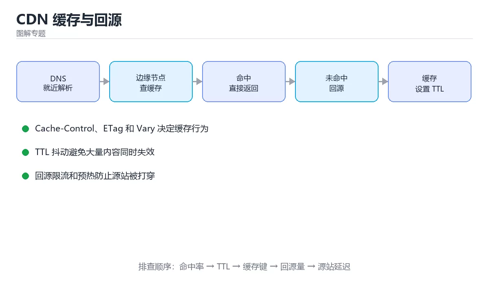

# 图解 CDN 缓存与回源



> 内容更新时间：2026-10-03 · 学习阶段：进阶 · 预计用时：18 分钟

## 学习目标

- 能用自己的话解释「图解 CDN 缓存与回源」解决了什么问题，而不是只背术语。
- 能说清 「CDN」、「缓存」、「回源」、「ETag」 之间的关系，并分别举出一个例子。
- 能把本课知识放回「图解专题」的知识体系，说明它和相邻主题的边界。
- 能完成本课练习，并用验收标准检查自己的结果。

> 一句话摘要：三层缓存结构、缓存头指令、ETag 校验与回源风暴防护。

## 前置知识

- 先完成上一课《图解 OAuth 2.0 授权码流程与 PKCE》；如果已经掌握，可以直接用本课练习自测。
- 本课阶段：进阶。建议先掌握同一分类的基础课程，并能独立运行正文中的最小示例。
- 开始前先复习：CDN、缓存、回源。
- 如果某一步看不懂，先记录具体卡点，完成练习后再回头读一遍。


## 一句话说清

CDN 的本质是「把内容提前放到离用户近的节点」。
它是否有效，取决于两件事：**缓存命中率**与**回源策略**。

## 一张图看懂缓存分层

```text
用户 ──①──► 边缘节点 Edge（就近）
              │  命中 → 直接返回（最快，无需回源）
              │  未命中
              ▼
            ② 上层节点 / 区域中心（可选）
              │  命中 → 返回并回填边缘
              │  未命中
              ▼
            ③ 源站 Origin
                 返回内容 + 缓存头（告诉 CDN 怎么缓存）
                  │
                  ▼
            ④ 逐层回填，下次命中
```

| 层级 | 作用 | 命中收益 |
| --- | --- | --- |
| 边缘节点 | 就近服务 | 延迟最低 |
| 区域中心 | 多层缓存，减少回源 | 中等 |
| 源站 | 权威内容 | 回源成本最高 |

## 缓存头：决定 CDN 行为的四个字段

```http
Cache-Control: public, max-age=31536000, immutable
Cache-Control: no-cache              # 可缓存，但每次要校验
Cache-Control: no-store              # 完全不缓存（敏感数据）
Cache-Control: private, max-age=0    # 只允许浏览器缓存
```

| 指令 | 含义 | 适用 |
| --- | --- | --- |
| `max-age` | 缓存有效期（秒） | 静态资源 |
| `s-maxage` | CDN 专用有效期，优先于 max-age | 需要 CDN 与浏览器不同 TTL |
| `no-cache` | 缓存但每次需校验 | HTML |
| `no-store` | 完全不缓存 | 含隐私的接口 |
| `immutable` | 期限内不校验 | 带哈希的静态文件 |
| `stale-while-revalidate` | 过期后先返回旧内容再后台刷新 | 提升体验 |

```text
推荐的组合
  带内容哈希的静态资源（app.a1b2c3.js）
    Cache-Control: public, max-age=31536000, immutable

  HTML 入口
    Cache-Control: no-cache          # 每次校验，保证能拿到新版本

  用户私有接口
    Cache-Control: private, no-store
```

## 两种校验方式：ETag 与 Last-Modified

```text
① 强校验：ETag
   客户端：If-None-Match: "abc123"
   服务端：内容未变 → 304 Not Modified（无正文，省带宽）
              内容已变 → 200 + 新内容

② 时间校验：Last-Modified
   客户端：If-Modified-Since: Wed, 05 Mar 2026 06:02:11 GMT
   服务端：未变 → 304
```

| 方式 | 精度 | 说明 |
| --- | --- | --- |
| ETag | 高（内容指纹） | 推荐 |
| Last-Modified | 秒级 | 简单但有精度限制 |

**304 依然是一次网络往返**，减少的是带宽而不是延迟。

## 缓存失效与刷新

```text
三种更新方式
  ① 内容哈希（最推荐）：文件名变即新资源，无需刷新
     app.a1b2c3.js → app.d4e5f6.js

  ② 主动刷新（purge）：调用 CDN API 清理指定 URL
     适合紧急修复；注意全量刷新会引发回源风暴

  ③ 版本查询参数：app.js?v=123
     简单，但部分 CDN 对带参数 URL 缓存策略不同，效果不稳定
```

```bash
# 主动刷新示例（伪命令，各厂商 API 不同）
cdn-cli purge --url https://example.com/index.html
cdn-cli purge --prefix https://example.com/assets/
```

## 回源风暴与防护

```text
场景：缓存刚过期，大量请求同时未命中

  边缘节点 ──┐
  边缘节点 ──┼──► 源站（瞬时 QPS 暴涨）→ 源站被打垮
  边缘节点 ──┘

防护手段
  · stale-while-revalidate：先返回旧内容，只有一个请求回源
  · 请求合并（collapse）：同一 URL 的并发回源合并成一个
  · 源站限流与排队
  · 预热：发布前主动预热热点资源
```

## 日志与可观测性

| 指标 | 含义 | 关注点 |
| --- | --- | --- |
| 命中率 | 命中请求 / 总请求 | 低于 90% 要查原因 |
| 回源率 | 回源请求 / 总请求 | 突升说明缓存被击穿 |
| 回源带宽 | 源站出口流量 | 直接关联成本 |
| 首字节时间 | 边缘到用户的响应 | 体验指标 |

```text
命中率低的四个常见原因
  · 查询参数或 Cookie 导致缓存键频繁变化
  · TTL 设得太短
  · 内容按用户定制（未区分公共与私有）
  · Vary 头设置过宽
```

## 新手最容易踩的八个坑

| 坑 | 现象 | 正确做法 |
| --- | --- | --- |
| HTML 长缓存 | 用户拿不到新版本 | HTML 用 no-cache |
| 静态资源短缓存 | 命中率低 | 带哈希后设长 TTL |
| 带 Cookie 请求走缓存 | 串号风险 | 私有内容用 private |
| 用查询参数做版本 | 缓存行为不稳定 | 用文件名哈希 |
| 全量刷新缓存 | 回源风暴 | 按需刷新加预热 |
| 忽略 Vary 头 | 缓存了错误变体 | 明确 Vary 字段 |
| 不监控命中率 | 成本高且慢 | 设命中率告警 |
| 私有数据设 public | 泄露 | 私有内容不缓存或 private |

## 本课小结
- CDN 的效果由**缓存键与 TTL** 决定，配置前先想清楚哪些内容可以共享。
- 静态资源用**内容哈希 + 长缓存**，HTML 用**no-cache**。
- 防回源风暴的三件套：`stale-while-revalidate`、请求合并、预热。


## 补充：缓存键设计、命中率优化与两类事故

### 缓存键怎么设计

```text
默认键 = 完整 URL（含查询参数）

常见调整方式
  · 忽略无意义参数：?utm_source=xxx 不影响内容 → 从键里剔除
  · 归一化参数顺序：?b=2&a=1 与 ?a=1&b=2 视为同一资源
  · 设备维度：移动端与桌面端返回不同 → 加入 Vary: User-Agent
  · 语言维度：多语言站点 → 加入 Vary: Accept-Language

原则：键里只放「会影响响应内容」的维度
      维度越多 → 缓存碎片越多 → 命中率越低
```

| 键的维度 | 命中率影响 | 建议 |
| --- | --- | --- |
| 只用 URL | 最高 | 静态资源默认选择 |
| URL + 设备 | 明显下降 | 只在响应确实不同时使用 |
| URL + 用户 ID | 几乎为 0 | 私有内容不应走公共缓存 |

### TTL 与刷新策略对照

| 内容类型 | 缓存头 | 刷新方式 |
| --- | --- | --- |
| 带哈希的 JS/CSS | `max-age=31536000, immutable` | 换文件名即可 |
| HTML 入口 | `no-cache` | 每次校验（304 省带宽） |
| 接口 JSON（可公共） | `max-age=60, stale-while-revalidate=30` | 短 TTL + 后台刷新 |
| 图片/字体 | `max-age=604800` | 需要更新时换文件名 |
| 用户私有数据 | `private, no-store` | 不缓存 |

```text
stale-while-revalidate 的价值
  过期后先返回旧内容（用户零等待），后台异步取新内容
  → 既保证响应快，又能避免大批请求同时回源
```

### 命中率优化的六条清单

```text
① 静态资源统一「内容哈希 + 长缓存」
② HTML 与其引用的资源版本号一致（避免新旧混合）
③ 剔除不影响内容的查询参数
④ 减小 Vary 维度
⑤ 避免带 Cookie 的公共资源请求
⑥ 对热点资源做预热（发布前主动请求一遍）
```

| 指标 | 健康值 | 偏低时先查 |
| --- | --- | --- |
| 命中率 | ≥ 90% | 缓存键、TTL、Vary |
| 回源率 | ≤ 10% | 是否被频繁刷新 |
| 回源带宽 | 按业务基线 | 是否有大文件未缓存 |

### 两类经典事故

```text
① 缓存穿透（查询不存在的数据）
   请求 id=-1 → 缓存无 → 打到数据库 → 数据库压力剧增
   对策：
     · 缓存空值（短 TTL，如 30 秒）
     · 入口做参数校验，拒绝明显非法请求
     · 布隆过滤器拦截不存在的 key

② 缓存雪崩（大量 key 同时失效）
   统一 TTL 到点集体过期 → 全部回源 → 源站被打垮
   对策：
     · TTL 加随机抖动（如 3600 ± 300 秒）
     · 用 stale-while-revalidate 平滑回源
     · 热点数据预热，并做源站限流兜底
```

### 发布时最容易踩的坑

| 坑 | 现象 | 正确做法 |
| --- | --- | --- |
| HTML 长缓存 | 用户长期拿不到新版本 | HTML 用 no-cache |
| 资源文件名不变 | 用户拿到旧的 JS | 文件名带内容哈希 |
| 全量刷新缓存 | 回源风暴 | 按需刷新 + 预热 |
| 私有数据设 public | 串号风险 | `private` 或 `no-store` |
| 忽略 Vary | 缓存了错误变体 | 明确需要区分的请求头 |

### 自查清单

- [ ] 静态资源用内容哈希加长缓存
- [ ] HTML 使用 no-cache 并带 ETag
- [ ] 缓存键只包含影响内容的维度
- [ ] 私有数据明确标记为 private 或 no-store
- [ ] 对穿透与雪崩都有防护（空值缓存、TTL 抖动、预热）

## 动手练习


> 本课练习重点：围绕「CDN、缓存、回源」完成复述、实验和交付，每个结果都要能被别人检查。

先不看原图手绘流程，再标出状态变化，最后用自己的话解释关键一步。

### 练习 1：建立心智模型（10 分钟）

合上教程，用 3～5 句话回答：

1. 「图解 CDN 缓存与回源」解决了什么问题？
2. 如果没有它，会出现什么具体后果？
3. 它和「缓存」是什么关系？

**验收标准**：至少出现一个本课关键词，并写出一个反例、边界条件或失效场景。

### 练习 2：做一次可控实验（20 分钟）

从正文中选一个最小示例，完成以下操作：

1. 先预测修改一个参数、输入或步骤后的结果。
2. 再实际执行或逐步推演，记录真实结果。
3. 如果结果与预测不同，写出差异原因。

**验收标准**：留下「原例 → 改动 → 预测 → 结果 → 原因」五步记录。

### 练习 3：交付一个小结果（30 分钟）

不看原图手绘一遍流程，再用自己的话指出图中的关键状态变化。

任务要求：

- 结果必须能被别人检查，不能只写“我已经理解了”。
- 至少覆盖「CDN」和「缓存」两个关键词。
- 写出 1 个仍然不确定的问题，以及下一步如何验证。

> 提示：时间有限时优先做练习 1 和练习 2；练习 3 可以拆成两次完成。


## 考点精讲：把测验题还原成判断过程

本课有 4 个判断点。先自己作答，再看「判断依据」；如果结论正确但理由不完整，回到正文对应章节补足概念。

### 考点 1：带内容哈希的静态资源（如 app.a1b2c3.js）推荐使用什么缓存策略？

- **正确判断**：public, max-age=31536000, immutable
- **判断依据**：文件名变了就是新资源，因此可以长期强缓存。「no-store」只看到了表面现象，没有解释题干真正考查的机制。正确项「public, max-age=31536000, immutable」是该问题的规范说法，换成其他表述都会丢失条件。错误项「no-cache」忽略了题目中的限制条件，因此不成立。错误项「private, max-age=0（与课程定义不一致）」属于相邻主题的说法，范围与本题要求不一致。把题干「带内容哈希的静态资源（如 app.a1b2c3.js）推荐使用什么缓存策略？」放回《图解 CDN 缓存与回源》的「三层缓存结构、缓存头指令、ETag 校验与回源风暴防护」语境，逐项对照定义与边界条件，就能排除其余说法。
- **迁移检查**：遮住选项，只根据定义复述一次答案，再回来看哪个选项与复述一致。

### 考点 2：HTML 入口页面更适合哪种缓存策略？

- **正确判断**：no-cache，每次都校验
- **判断依据**：HTML 是入口，必须能及时更新，但校验可省带宽。选项一会导致用户长期拿到旧版本。正确项「no-cache，每次都校验」描述正确，能够解释题干场景中的现象与结果。错误项「immutable 长缓存」与课程给出的定义相冲突，不能回答题目所问。错误项「no-store」在边界或失败路径上会得出错误结果。错误项「不设置任何缓存头」适用于其他场景，但与本题的前提不匹配。把题干「HTML 入口页面更适合哪种缓存策略？」放回《图解 CDN 缓存与回源》的「三层缓存结构、缓存头指令、ETag 校验与回源风暴防护」语境，逐项对照定义与边界条件，就能排除其余说法。
- **迁移检查**：如果给某个错误选项去掉一个限定词，它会不会变成正确？说明理由。

### 考点 3：缓存刚过期时大量请求同时回源，最有效的防护是？

- **正确判断**：stale-while-revalidate 与请求合并（collapse）
- **判断依据**：先返回旧内容并合并回源请求，可避免瞬时洪峰。选项一会失去 CDN 价值。选项三与选项四治标不治本。正确项「stale-while-revalidate 与请求合并（collapse）」与题干要求一致，是本课知识点的准确定义。错误项「关闭 CDN」忽略了题目中的限制条件，因此不成立。错误项「延长源站超时」把不同概念混在一起，缺少题干限定的前提。错误项「增加源站线程数（混淆了相邻概念，也没有覆盖题干给出的全部条件）」与课程给出的定义相冲突，不能回答题目所问。把题干「缓存刚过期时大量请求同时回源，最有效的防护是？」放回《图解 CDN 缓存与回源》的「三层缓存结构、缓存头指令、ETag 校验与回源风暴防护」语境，逐项对照定义与边界条件，就能排除其余说法。
- **迁移检查**：如果给某个错误选项去掉一个限定词，它会不会变成正确？说明理由。

### 考点 4：304 Not Modified 相比 200 的主要收益是？

- **正确判断**：省掉正文传输带宽，但仍有一次往返
- **判断依据**：304 只返回状态，不传正文。选项一与选项三错误：仍然需要一次请求响应。正确项「省掉正文传输带宽，但仍有一次往返」抓住了题干的核心条件，是经得起边界检验的表述。错误项「减少网络往返次数」把不同概念混在一起，缺少题干限定的前提。错误项「完全不需要网络」只看到了表面现象，没有解释题干真正考查的机制。错误项「提升服务端 CPU 性能」在边界或失败路径上会得出错误结果。把题干「304 Not Modified 相比 200 的主要收益是？」放回《图解 CDN 缓存与回源》的「三层缓存结构、缓存头指令、ETag 校验与回源风暴防护」语境，逐项对照定义与边界条件，就能排除其余说法。
- **迁移检查**：遮住选项，只根据定义复述一次答案，再回来看哪个选项与复述一致。

## 本课复习清单

离开本课前，逐项确认：

- [ ] 不看解析，能说出「带内容哈希的静态资源（如 app.a1b2c3.js）推荐使用什么缓存策略？」的判断依据。
- [ ] 不看解析，能说出「HTML 入口页面更适合哪种缓存策略？」的判断依据。
- [ ] 不看解析，能说出「缓存刚过期时大量请求同时回源，最有效的防护是？」的判断依据。
- [ ] 不看解析，能说出「304 Not Modified 相比 200 的主要收益是？」的判断依据。
- [ ] 至少运行一次本课示例，记录输入、输出和一个边界情况。
- [ ] 把本课最容易混淆的两个概念写成一句话对照。

| 复盘项 | 记录 |
| --- | --- |
| 已经能独立解释的考点 |  |
| 仍然说不清的概念 |  |
| 下一步验证动作 |  |

## English Overview

**Title:** CDN Caching Illustrated

**Summary:** Cache layers, headers, validators and origin storm protection.

**Category:** Visual Guide  
**Level:** 进阶  
**Key terms:** CDN, 缓存, 回源, ETag, 命中率

> The full tutorial is written in Chinese. This bilingual overview helps English readers identify the topic, scope and key terms before studying the detailed examples.

## 内容元数据

- 内容版本：v2.0
- 最后更新：2026-10-03
- 学习阶段：进阶
- 适用环境：通用图解与系统原理
- 内容来源：内置结构化课程与工程实践整理
- 相关主题：CDN、缓存、回源、ETag、命中率
- 质量版本：P0 测验标准 + P1 覆盖扩展 + P2 体验补全


## 参考资料与复核

- 最后复核：2026-10-04
- 下次复核：2027-04-04
- 复核范围：版本兼容、API 行为、安全建议与工程实践
- 来源性质：官方文档与标准；本课正文为离线教学重组，不复制原文

| 参考资料 | 本课用途 |
| --- | --- |
| [RFC Editor](https://www.rfc-editor.org/) | 协议与状态机 |
| [MDN Web Docs](https://developer.mozilla.org/) | 浏览器与网络流程 |

> 本课主题：三层缓存结构、缓存头指令、ETag 校验与回源风暴防护。

> App 完全离线展示文字链接，不会自动联网；需要延伸阅读时可复制链接到浏览器。

