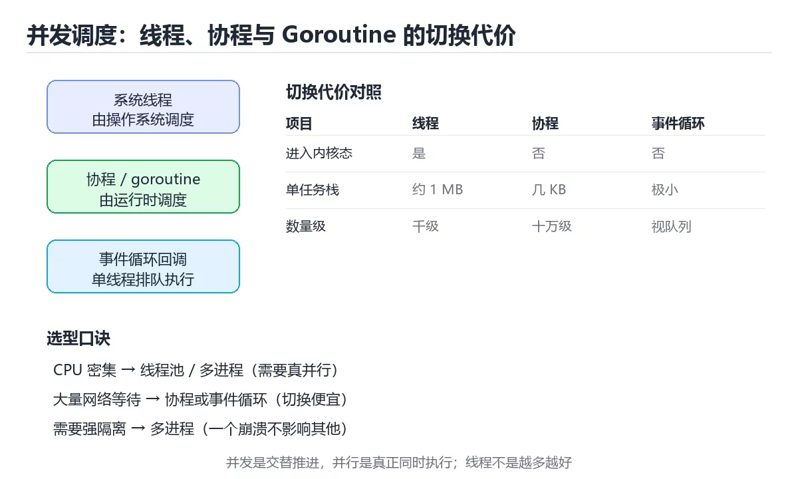

# 图解并发调度：线程、协程与 Goroutine

> 内容更新时间：2026-10-03 · 学习阶段：进阶 · 预计用时：20 分钟

## 学习目标

- 能用自己的话解释「图解并发调度：线程、协程与 Goroutine」解决了什么问题，而不是只背术语。
- 能说清 「并发」、「调度」、「协程」、「Goroutine」 之间的关系，并分别举出一个例子。
- 能把本课知识放回「图解专题」的知识体系，说明它和相邻主题的边界。
- 能完成本课练习，并用验收标准检查自己的结果。

> 一句话摘要：三种调度模型的切换代价、M:N 模型与通道同步时序。

## 前置知识

- 先完成上一课《图解事件循环：同步、微任务与宏任务》；如果已经掌握，可以直接用本课练习自测。
- 本课阶段：进阶。建议先掌握同一分类的基础课程，并能独立运行正文中的最小示例。
- 开始前先复习：并发、调度、协程。
- 如果某一步看不懂，先记录具体卡点，完成练习后再回头读一遍。




## 一句话说清

并发模型要回答两件事：**谁被调度**、**切换时代价多大**。
线程由操作系统调度，协程由运行时或语言调度，Goroutine 则是「用户态任务 + 少量线程」的组合。

## 一张图看懂三种模型

```text
1) 多线程：每个任务占一个系统线程
   任务 A ── 线程 1   ┐
   任务 B ── 线程 2   ├─ 由操作系统调度，切换要进内核
   任务 C ── 线程 3   ┘

2) 协程：多个任务复用少量线程
   任务 1 ┐
   任务 2 ├─ 挂在同一个线程上，运行时按需切换
   任务 3 ┘

3) Goroutine 的 M:N 模型
   G G G G G G        ← 成千上万个 goroutine（G）
    │ │ │ │ │
   ┌─────────┐
   │  P  P   │        ← 逻辑处理器（P），数量约等于核心数
   └─────────┘
    │    │
   M1   M2            ← 操作系统线程（M）
```

| 模型 | 调度者 | 切换代价 | 数量级 |
| --- | --- | --- | --- |
| 线程 | 操作系统 | 高（进内核、换页表） | 数百到数千 |
| 协程 | 运行时 | 低（用户态保存少量状态） | 数万 |
| Goroutine | Go 运行时 | 低（栈按需增长） | 数十万 |
| 事件循环回调 | 运行时 | 最低（无线程切换） | 无上限但受队列影响 |

## 线程切换时发生了什么

```text
线程 A 运行中
   │ 时间片用完或被更高优先级抢占
   ▼
保存 A 的寄存器与栈指针
   │
   ▼
切换页表 / 刷新 TLB（可能）
   │
   ▼
恢复 B 的寄存器与栈指针
   │
   ▼
线程 B 继续运行

代价：寄存器保存恢复 + 缓存与 TLB 命中率下降
```

**结论**：线程不是越多越好，密集切换会让「CPU 很忙但吞吐不涨」。

## 协程切换时发生了什么

```text
协程 A 遇到 await / IO 等待
   │
   ▼
把 A 的状态（局部变量、恢复点）交给运行时保存
   │
   ▼
运行时从就绪队列取协程 B，在原线程上继续执行

代价：一次用户态的函数调用级别的切换，不进内核
```

## 通道同步的时序

```go
ch := make(chan int)      // 无缓冲
go func() { ch <- 42 }()  // 发送方
v := <-ch                 // 接收方
```

```text
时间线
发送方 ──► 阻塞等待 ──┐
                     ├─► 双方就绪，数据交接，同时唤醒
接收方 ──► 阻塞等待 ──┘

带缓冲通道（容量 2）
发送 ─► [ 42 ][   ]  不阻塞
发送 ─► [ 42 ][ 43 ] 不阻塞
发送 ─► 缓冲已满，阻塞直到有人取走
```

| 通道类型 | 发送方行为 | 适用 |
| --- | --- | --- |
| 无缓冲 | 必须等到接收方 | 严格同步、握手 |
| 带缓冲 | 缓冲未满不阻塞 | 解耦生产与消费速度 |
| 已关闭 | 发送会 panic | 由唯一发送方关闭 |

## 并发模型的取舍

| 需求 | 推荐 | 原因 |
| --- | --- | --- |
| CPU 密集计算 | 线程池 / 多进程 | 真并行，避免 GIL 等限制 |
| 高并发网络 IO | 协程 / 事件循环 | 海量连接、内存占用小 |
| 任务编排与流水线 | Goroutine + channel | 结构清晰、易组合 |
| 隔离性要求高 | 多进程 | 一个崩溃不影响其他 |

## 图说「并行不等于并发」

```text
并发（Concurrency）：交替推进，看起来同时
  时间 →  A A A   B B B   A A   B B
          单核也能做到

并行（Parallelism）：真正同时执行
  时间 →  A A A A A A
          B B B B B B
          需要多核
```

## 新手最容易踩的六个坑

| 坑 | 现象 | 正确做法 |
| --- | --- | --- |
| 把并发当并行 | 单核上性能没提升 | 明确是否需要真并行 |
| 线程数开太多 | 切换开销吃掉收益 | 按核心数与 IO 比例设定 |
| 在协程里写阻塞调用 | 整个运行时被卡住 | 用异步 API 或线程池 |
| 共享可变状态 | 数据竞争 | 加锁、原子操作或用通道 |
| 无限创建任务 | 内存与调度压力 | 用信号量或工作池限流 |
| 忽略取消传播 | 任务无法及时停止 | 取消信号传到底层 |

## 本课小结
- **线程**由操作系统调度，切换贵；**协程**由运行时调度，切换便宜。
- 并发解决「同时处理很多事」，并行解决「同时算很多东西」，两者不能互相替代。
- 选模型只看两个问题：任务是 IO 密集还是 CPU 密集，是否需要真并行。


## 补充：线程池参数、泄漏排查与选型

### 线程池大小怎么算

```text
CPU 密集型：线程数 ≈ 核心数 + 1
  · 多出的 1 个用于在偶发缺页时顶上

IO 密集型：线程数 ≈ 核心数 × (1 + 等待时间 / 计算时间)
  · 例：4 核，任务 90% 时间在等网络 → 4 × (1 + 9) = 40

工程做法：按公式给出初值，再用压测确定最终值
```

| 参数 | 设太小 | 设太大 |
| --- | --- | --- |
| 核心线程数 | 请求排队 | 上下文切换开销 |
| 队列容量 | 直接拒绝请求 | 内存堆积、延迟升高 |
| 空闲回收时间 | 频繁创建销毁 | 资源长期占用 |
| 超时时间 | 请求快速失败 | 线程被慢请求占满 |

```java
// 线程池：不要用无界队列，否则拒绝策略永远不会触发
ExecutorService pool = new ThreadPoolExecutor(
    4, 16,                       // 核心与最大线程数
    60, TimeUnit.SECONDS,
    new ArrayBlockingQueue<>(200),        // 有界队列
    new ThreadPoolExecutor.CallerRunsPolicy()  // 满了就让调用方自己执行
);
```

### goroutine 泄漏的四种典型写法

```go
// ① 向无人接收的 channel 发送 → 永久阻塞
go func() { ch <- compute() }()   // 若没人读 ch，这个 goroutine 永远活着

// 修复：带缓冲，或监听 ctx.Done()
go func() {
    select {
    case ch <- compute():
    case <-ctx.Done():
    }
}()

// ② 等待永远不会关闭的 channel → 永久阻塞
for v := range ch { }             // 谁负责 close(ch)？

// ③ 忘了取消 context
ctx, cancel := context.WithCancel(parent)
defer cancel()                    // 缺这一行，子 goroutine 永不退出

// ④ 锁未释放导致后续 goroutine 排队
mu.Lock()
// 中间 panic 时不写 defer Unlock 就会死锁
defer mu.Unlock()
```

```bash
# 用 pprof 一眼看出泄漏：goroutine 数是否随时间单调增长
go tool pprof http://127.0.0.1:6060/debug/pprof/goroutine
(pprof) top        # 看哪个函数堆了最多 goroutine
```

### 三种并发模型的切换代价对照

| 模型 | 切换进入内核 | 单任务内存 | 数量级 | 适用 |
| --- | --- | --- | --- | --- |
| 系统线程 | 是 | 1 MB 栈（典型） | 千级 | CPU 密集、需真并行 |
| 协程 / goroutine | 否 | 几 KB 起 | 十万级 | 高并发 IO |
| 事件循环回调 | 否 | 极小 | 视队列而定 | IO 密集、前端与 Node |

```text
一句话选型
  · 计算密集 → 线程池 / 多进程
  · 大量网络等待 → 协程或事件循环
  · 需要强隔离（互不影响）→ 多进程
```

### 并发正确性的三种验证手段

| 手段 | 能发现 | 局限 |
| --- | --- | --- |
| 数据竞争检测（Go `-race`、TSan） | 无同步的内存访问 | 只对执行到的路径生效 |
| 压力测试（高并发重复执行） | 偶发死锁、丢失更新 | 需要足够轮次 |
| 静态检查（Rust 编译期、clippy） | 借用与所有权问题 | 语言特性决定覆盖范围 |

```bash
# Go：把竞态检测放进 CI，而不是只跑一次
go test -race -count=5 ./...

# 压测：并发 200、持续 60 秒，观察是否出现死锁或计数偏差
hey -c 200 -z 60s http://localhost:8080/api/orders
```

### 自查清单

- [ ] 线程池使用有界队列，并有明确的拒绝策略
- [ ] 每个 goroutine / 协程都有退出条件
- [ ] `context` 与 `cancel()` 成对出现
- [ ] CI 中开启了竞态检测
- [ ] 压测覆盖高并发场景，而不只是功能验证

## 动手练习


> 本课练习重点：围绕「并发、调度、协程」完成复述、实验和交付，每个结果都要能被别人检查。

先不看原图手绘流程，再标出状态变化，最后用自己的话解释关键一步。

### 练习 1：建立心智模型（10 分钟）

合上教程，用 3～5 句话回答：

1. 「图解并发调度：线程、协程与 Goroutine」解决了什么问题？
2. 如果没有它，会出现什么具体后果？
3. 它和「调度」是什么关系？

**验收标准**：至少出现一个本课关键词，并写出一个反例、边界条件或失效场景。

### 练习 2：做一次可控实验（20 分钟）

从正文中选一个最小示例，完成以下操作：

1. 先预测修改一个参数、输入或步骤后的结果。
2. 再实际执行或逐步推演，记录真实结果。
3. 如果结果与预测不同，写出差异原因。

**验收标准**：留下「原例 → 改动 → 预测 → 结果 → 原因」五步记录。

### 练习 3：交付一个小结果（30 分钟）

不看原图手绘一遍流程，再用自己的话指出图中的关键状态变化。

任务要求：

- 结果必须能被别人检查，不能只写“我已经理解了”。
- 至少覆盖「并发」和「调度」两个关键词。
- 写出 1 个仍然不确定的问题，以及下一步如何验证。

> 提示：时间有限时优先做练习 1 和练习 2；练习 3 可以拆成两次完成。


## 考点精讲：把测验题还原成判断过程

本课有 5 个判断点。先自己作答，再看「判断依据」；如果结论正确但理由不完整，回到正文对应章节补足概念。

### 考点 1：线程切换比协程切换昂贵的根本原因是？

- **正确判断**：线程切换需要进入内核
- **判断依据**：正确答案是「线程切换需要进入内核」，本课在「线程切换时发生了什么」中说明：结论：线程不是越多越好，密集切换会让「CPU 很忙但吞吐不涨」。线程由操作系统调度，切换涉及内核态与缓存失效。本课还在「一句话说清」中说明：线程由操作系统调度，协程由运行时或语言调度，Goroutine 则是「用户态任务 + 少量线程」的组合。本课还在「补充：线程池参数、泄漏排查与选型」中说明：每个 goroutine / 协程都有退出条件。
- **迁移检查**：遮住选项，只根据定义复述一次答案，再回来看哪个选项与复述一致。

### 考点 2：向无缓冲通道发送数据时会怎样？

- **正确判断**：阻塞直到有接收方完成同步
- **判断依据**：正确答案是「阻塞直到有接收方完成同步」，本课在「一句话说清」中说明：并发模型要回答两件事：谁被调度、切换时代价多大。无缓冲通道是同步握手，发送与接收必须同时就绪。本课还在「补充：线程池参数、泄漏排查与选型」中说明：每个 goroutine / 协程都有退出条件。本课还在「一句话说清」中说明：线程由操作系统调度，协程由运行时或语言调度，Goroutine 则是「用户态任务 + 少量线程」的组合。
- **迁移检查**：遮住选项，只根据定义复述一次答案，再回来看哪个选项与复述一致。

### 考点 3：关于并发与并行，正确的说法是？

- **正确判断**：并发是交替推进，并行是真正同时执行
- **判断依据**：正确答案是「并发是交替推进，并行是真正同时执行」，本课在「本课小结」中说明：并发解决「同时处理很多事」，并行解决「同时算很多东西」，两者不能互相替代。并发强调的是结构上同时推进，并行要求物理上的同时执行。本课还在「本课小结」中说明：选模型只看两个问题：任务是 IO 密集还是 CPU 密集，是否需要真并行。本课还在「补充：线程池参数、泄漏排查与选型」中说明：context 与 cancel() 成对出现。
- **迁移检查**：把题干里的一个条件换成边界值，原来的结论还成立吗？写出判断过程。

### 考点 4：线程数开得过多，最可能的后果是？

- **正确判断**：切换与内存开销吃掉收益
- **判断依据**：正确答案是「切换与内存开销吃掉收益」，本课在「一句话说清」中说明：并发模型要回答两件事：谁被调度、切换时代价多大。过多线程带来频繁上下文切换与更高内存占用。本课还在「线程切换时发生了什么」中说明：结论：线程不是越多越好，密集切换会让「CPU 很忙但吞吐不涨」。
- **迁移检查**：遮住选项，只根据定义复述一次答案，再回来看哪个选项与复述一致。

### 考点 5：补全代码：「图解并发调度：线程、协程与 Goroutine」示例中，下面这行代码缺少哪个关键字或函数名？请填入 ____。 `并发（____）：交替推进，看起来同时`

- **正确判断**：Concurrency / concurrency
- **判断依据**：正确答案是「Concurrency」，这道题在问补全代码：图解并发调度：线程、协程与Goroutin…并发（____）：交替推进，看起来同时`，判断时要把题干限定的输入、边界与目标逐项对齐。本课示例中还能看到 `并发（Concurrency）：交替推进，看起来同时` 这样的用法，说明该关键字在本课代码中承担实际功能。
- **迁移检查**：不看题干，用自己的话补全这句话，再与标准答案对照。

## 本课复习清单

离开本课前，逐项确认：

- [ ] 不看解析，能说出「线程切换比协程切换昂贵的根本原因是？」的判断依据。
- [ ] 不看解析，能说出「向无缓冲通道发送数据时会怎样？」的判断依据。
- [ ] 不看解析，能说出「关于并发与并行，正确的说法是？」的判断依据。
- [ ] 不看解析，能说出「线程数开得过多，最可能的后果是？」的判断依据。
- [ ] 不看解析，能说出「补全代码：「图解并发调度：线程、协程与 Goroutine」示例中，下面这行代码…」的判断依据。
- [ ] 至少运行一次本课示例，记录输入、输出和一个边界情况。
- [ ] 把本课最容易混淆的两个概念写成一句话对照。

| 复盘项 | 记录 |
| --- | --- |
| 已经能独立解释的考点 |  |
| 仍然说不清的概念 |  |
| 下一步验证动作 |  |

## 术语速查

把本课反复出现的术语集中放在一起。复习时先遮住右列，尝试用自己的话解释，再回到正文核对。

| 术语 | 本课语境 |
| --- | --- |
| `-race` | \| 数据竞争检测（Go `-race`、TSan） \| 无同步的内存访问 \| 只对执行到的路径生效 \| |
| `context` | [ ] `context` 与 `cancel()` 成对出现 |
| `cancel()` | [ ] `context` 与 `cancel()` 成对出现 |
| `，判断时要把题干限定的输入、边界与目标逐项对齐。本课示例中还能看到` | 判断依据**：正确答案是「Concurrency」，这道题在问补全代码：图解并发调度：线程、协程与Goroutin…并发（____）：交替推进，看起来同时`，判断时要把题干限定的输入、边界与目标逐项对齐。本课示例中还能看… |

## 面试问答与自测

下面把本课考点换成面试追问。先口述自己的答案，
再对照参考回答检查是否遗漏了前提、边界或失败路径。

### 追问 1：线程切换比协程切换昂贵的根本原因是？

**参考回答**：正确答案是「线程切换需要进入内核」，本课在「线程切换时发生了什么」中说明：结论：线程不是越多越好，密集切换会让「CPU 很忙但吞吐不涨」。线程由操作系统调度，切换涉及内核态与缓存失效。本课还在「一句话说清」中说明：线程由操作系统调度，协程由运行时或语言调度，Goroutine 则是「用户态任务 + 少量线程」的组合。本课还在「补充·线程池参数、泄漏排查与选型」中说明：每个 goroutine / 协程都有退出条件。

### 追问 2：向无缓冲通道发送数据时会怎样？

**参考回答**：正确答案是「阻塞直到有接收方完成同步」，本课在「一句话说清」中说明：并发模型要回答两件事：谁被调度、切换时代价多大。无缓冲通道是同步握手，发送与接收必须同时就绪。本课还在「补充·线程池参数、泄漏排查与选型」中说明：每个 goroutine / 协程都有退出条件。本课还在「一句话说清」中说明：线程由操作系统调度，协程由运行时或语言调度，Goroutine 则是「用户态任务 + 少量线程」的组合。

### 追问 3：关于并发与并行，正确的说法是？

**参考回答**：正确答案是「并发是交替推进，并行是真正同时执行」，本课在「本课小结」中说明：并发解决「同时处理很多事」，并行解决「同时算很多东西」，两者不能互相替代。并发强调的是结构上同时推进，并行要求物理上的同时执行。本课还在「本课小结」中说明：选模型只看两个问题：任务是 IO 密集还是 CPU 密集，是否需要真并行。本课还在「补充·线程池参数、泄漏排查与选型」中说明：context 与 cancel() 成对出现。

### 追问 4：线程数开得过多，最可能的后果是？

**参考回答**：正确答案是「切换与内存开销吃掉收益」，本课在「一句话说清」中说明：并发模型要回答两件事：谁被调度、切换时代价多大。过多线程带来频繁上下文切换与更高内存占用。本课还在「线程切换时发生了什么」中说明：结论：线程不是越多越好，密集切换会让「CPU 很忙但吞吐不涨」。

### 追问 5：补全代码：「图解并发调度：线程、协程与 Goroutine」示例中，下面这行代码缺少哪个关键字或函数名？请填入 ____。 `并发（____）：交替推进，看起来同时`

**参考回答**：正确答案是「Concurrency」，这道题在问补全代码：图解并发调度：线程、协程与Goroutin…并发（____）：交替推进，看起来同时`，判断时要把题干限定的输入、边界与目标逐项对齐。本课示例中还能看到 `并发（Concurrency）：交替推进，看起来同时` 这样的用法，说明该关键字在本课代码中承担实际功能。

## English Overview

**Title:** Concurrency Scheduling Illustrated

**Summary:** Switching costs, the M:N model and channel timing.

**Category:** Visual Guide  
**Level:** 进阶  
**Key terms:** 并发, 调度, 协程, Goroutine, 通道

> The full tutorial is written in Chinese. This bilingual overview helps English readers identify the topic, scope and key terms before studying the detailed examples.

## 内容元数据

- 内容版本：v2.0
- 最后更新：2026-10-03
- 学习阶段：进阶
- 适用环境：通用图解与系统原理
- 内容来源：内置结构化课程与工程实践整理
- 相关主题：并发、调度、协程、Goroutine、通道
- 质量版本：P0 测验标准 + P1 覆盖扩展 + P2 体验补全


## 参考资料与复核

- 最后复核：2026-10-04
- 下次复核：2027-04-04
- 复核范围：版本兼容、API 行为、安全建议与工程实践
- 来源性质：官方文档与标准；本课正文为离线教学重组，不复制原文

| 参考资料 | 本课用途 |
| --- | --- |
| [RFC Editor](https://www.rfc-editor.org/) | 协议与状态机 |
| [MDN Web Docs](https://developer.mozilla.org/) | 浏览器与网络流程 |

> 本课主题：三种调度模型的切换代价、M:N 模型与通道同步时序。

> App 完全离线展示文字链接，不会自动联网；需要延伸阅读时可复制链接到浏览器。
