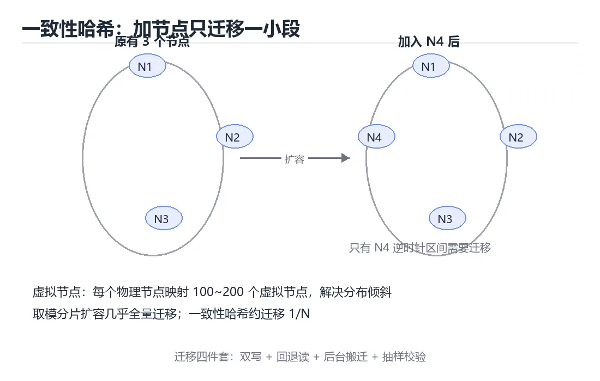

# 图解一致性哈希与数据分片

> 内容更新时间：2026-10-03 · 学习阶段：进阶 · 预计用时：20 分钟

## 学习目标

- 能用自己的话解释「图解一致性哈希与数据分片」解决了什么问题，而不是只背术语。
- 能说清 「一致性哈希」、「分片」、「虚拟节点」、「扩容」 之间的关系，并分别举出一个例子。
- 能把本课知识放回「图解专题」的知识体系，说明它和相邻主题的边界。
- 能完成本课练习，并用验收标准检查自己的结果。

> 一句话摘要：取模扩容的问题、哈希环、虚拟节点、分片键选择与迁移流程。

## 前置知识

- 先完成上一课《图解 Kafka 分区、副本与再平衡》；如果已经掌握，可以直接用本课练习自测。
- 本课阶段：进阶。建议先掌握同一分类的基础课程，并能独立运行正文中的最小示例。
- 开始前先复习：一致性哈希、分片、虚拟节点。
- 如果某一步看不懂，先记录具体卡点，完成练习后再回头读一遍。




## 一句话说清

分片（Sharding）解决「数据太多放一台机器」的问题；
一致性哈希解决「增删节点时如何少搬数据」的问题。

## 普通取模分片的痛点

```text
分片规则：shard = hash(key) % 节点数

3 个节点时
  key=A → hash=10 → 10 % 3 = 1 → 节点 1
  key=B → hash=11 → 11 % 3 = 2 → 节点 2

扩容到 4 个节点后
  key=A → 10 % 4 = 2 → 节点 2   ← 位置变了
  key=B → 11 % 4 = 3 → 节点 3   ← 位置变了

几乎全部 key 都要搬迁 → 缓存集体失效、数据库压力暴涨
```

## 一致性哈希的环形结构

```text
把哈希空间看成一个环（0 ~ 2^32-1），节点与数据都落在这个环上

               0
        ┌──────────────┐
   N3 ──┤              ├── N1       数据顺时针找到第一个节点
        │     环       │
        └──────────────┘
             N2

  key 落在 N1 与 N2 之间 → 顺时针归属 N2

增加节点 N4 后
  只有 N4 逆时针到上一个节点之间的 key 需要搬迁
  其余 key 不受影响（约 1/N 的数据移动）
```

| 方案 | 扩容时迁移比例 | 说明 |
| --- | --- | --- |
| 取模 | 几乎全部 | 不可接受 |
| 一致性哈希 | 约 1/N | 明显改善 |
| 一致性哈希加虚拟节点 | 约 1/N 且分布均匀 | **推荐** |

## 虚拟节点解决数据倾斜

```text
没有虚拟节点：3 个物理节点在环上，区间大小随机，负载不均

  N1 覆盖 60%   ← 热点
  N2 覆盖 25%
  N3 覆盖 15%

加虚拟节点：每个物理节点映射为 100~200 个虚拟节点

  N1 ─► v1-1, v1-2, … v1-150
  N2 ─► v2-1, v2-2, … v2-150
  N3 ─► v3-1, v3-2, … v3-150

  环上均匀交错 → 每个物理节点承担约 1/3
```

| 参数 | 作用 | 经验值 |
| --- | --- | --- |
| 虚拟节点数 | 每个物理节点在环上的副本数 | 100~200 |
| 哈希函数 | 决定均匀性 | MD5、MurmurHash |

## 分片键的选择

| 分片键 | 优点 | 风险 |
| --- | --- | --- |
| 用户 ID | 同用户数据集中，查询快 | 大 V 用户形成热点 |
| 订单 ID | 分布均匀 | 按用户查询要跨分片 |
| 时间 | 便于归档 | 最新数据集中在同一分片（写热点） |
| 租户 ID | 隔离性好 | 大租户占用过多资源 |

```text
三条判断标准
  ① 基数足够大：避免少数值占满
  ② 分布均匀：避免写热点
  ③ 与查询匹配：最常见查询能否命中单分片
```

## 跨分片查询的代价

```text
按用户分片后，查询「最近 10 笔订单」需要：

  分片 1 ──取前 10──┐
  分片 2 ──取前 10──┤
  分片 3 ──取前 10──┼──► 归并排序 ──► 取真正前 10
  分片 4 ──取前 10──┘

代价：扇出请求、延迟取决于最慢分片、需要归并
```

| 需求 | 方案 |
| --- | --- |
| 按分片键查 | 单分片，最快 |
| 跨分片分页 | 并行查询后归并 |
| 全局统计 | 预聚合表或离线计算 |
| 模糊搜索 | 独立搜索引擎（倒排索引） |

## 扩容时的迁移流程

```text
① 增加新节点并加入环
② 计算需要迁移的 key 区间
③ 双写：新写入同时写新旧位置（按优先级）
④ 后台搬迁历史数据并校验
⑤ 读请求逐步切换到新位置（先读新，未命中回退旧）
⑥ 校验一致后停止双写，下线旧位置
```

**关键点**：迁移期间必须能读旧数据（回退读），否则会出错。

## 新手最容易踩的八个坑

| 坑 | 现象 | 正确做法 |
| --- | --- | --- |
| 用取模分片 | 扩容搬全量数据 | 用一致性哈希 |
| 不加虚拟节点 | 负载严重倾斜 | 每节点 100+ 虚拟节点 |
| 分片键基数太低 | 热点集中 | 选高基数字段 |
| 用时间戳分片 | 写入集中在最新分片 | 时间加哈希组合 |
| 迁移不做双写 | 丢数据 | 双写加校验 |
| 跨分片查询频繁 | 延迟高且易超时 | 调整分片键或建预聚合 |
| 忘记处理热点 | 单分片打满 | 热点单独拆分或本地缓存 |
| 迁移没有回退方案 | 出错无法恢复 | 保留旧数据直到验证完成 |

## 本课小结
- 取模分片扩容要搬全量数据，**一致性哈希把迁移量降到约 1/N**。
- 虚拟节点解决倾斜，分片键决定分布与查询效率。
- 迁移的安全三件套：**双写、校验、回退读**。


## 补充：虚拟节点、热点与迁移实现

### 虚拟节点数量怎么选

```text
没有虚拟节点：3 个物理节点，负载可能 60% / 25% / 15%
每节点 150 个虚拟节点：负载接近 33% / 33% / 34%

经验值
  · 10 个以内：倾斜仍明显，只适合节点很多（>100）的场景
  · 100~200 个：通用推荐，内存开销可接受
  · 上千个：分布更均匀，但路由表变大、查找变慢
```

| 虚拟节点数 | 分布均匀度 | 路由表大小 | 说明 |
| --- | --- | --- | --- |
| 1（无虚拟节点） | 差 | 最小 | 节点少时明显倾斜 |
| 100 | 好 | 适中 | **默认选择** |
| 1000 | 很好 | 大 | 需要极均匀时才用 |

### 热点的两种成因与对策

```text
① 键本身热：某个 key 的访问量远高于其他
   · 例：明星微博、秒杀商品
   · 对策：给 key 加随机后缀打散到多个分片，读取时聚合

② 分片热：某个分片承载了过多数据
   · 例：按时间分片导致最新分片写满
   · 对策：调整分片键（时间 + 哈希），或对该分片单独扩容
```

```python
# 热点读打散：写时复制成 N 份，读时随机选一份
import random

SHARDS = 8

def write(redis, key: str, value: str) -> None:
    for i in range(SHARDS):
        redis.set(f"{key}#{i}", value)

def read(redis, key: str) -> str | None:
    return redis.get(f"{key}#{random.randint(0, SHARDS - 1)}")
```

**注意**：打散只适合读多写少；写放大 N 倍，写入路径要谨慎使用。

### 迁移的四种实现方式

| 方式 | 原理 | 优点 | 风险 |
| --- | --- | --- | --- |
| 停机迁移 | 停服后整体搬迁 | 简单 | 不可接受（在线业务） |
| 双写 | 新旧位置同时写 | 不丢数据 | 需要处理写失败 |
| 回退读 | 新位置未命中时读旧位置 | 平滑切换 | 需要保留旧数据 |
| 异步搬迁 | 后台任务逐批搬历史数据 | 对线上影响小 | 需校验一致性 |

```text
推荐的组合：双写 + 回退读 + 后台搬迁 + 校验

  写：写新位置，失败时记入补偿队列再写旧位置
  读：先读新位置，未命中读旧位置并把结果回填
  搬：后台按 key 区间分批搬迁历史数据
  校：抽样比对两边内容，不一致时以旧为准并重搬
  切：校验通过 → 停止双写 → 观察一周 → 删除旧数据
```

### 与其它分流算法的对比

| 算法 | 扩容迁移量 | 实现复杂度 | 特点 |
| --- | --- | --- | --- |
| 取模 | 几乎全部 | 最低 | 只在节点固定时可用 |
| 一致性哈希 | 约 1/N | 中 | 通用，需要虚拟节点 |
| Rendezvous（最高随机权重） | 约 1/N | 低 | 无需环形结构，节点少时也均匀 |
| 显式分片表 | 精确可控 | 高 | 需要中心化元数据管理 |

```text
Rendezvous 哈希的直觉
  对每个 (key, node) 计算 hash(key + node)，选分数最高的节点
  节点下线时只有它负责的 key 会重新分配，其余不变
  代码只有十来行，却能得到与一致性哈希相当的迁移量
```

### 自查清单

- [ ] 分片键基数足够大且分布均匀
- [ ] 每个物理节点配置了 100+ 虚拟节点
- [ ] 迁移期间有双写、回退读与一致性校验
- [ ] 已识别热点键并准备了打散或本地缓存方案
- [ ] 节点扩缩容流程经过演练，能回退

## 动手练习


> 本课练习重点：围绕「一致性哈希、分片、虚拟节点」完成复述、实验和交付，每个结果都要能被别人检查。

先不看原图手绘流程，再标出状态变化，最后用自己的话解释关键一步。

### 练习 1：建立心智模型（10 分钟）

合上教程，用 3～5 句话回答：

1. 「图解一致性哈希与数据分片」解决了什么问题？
2. 如果没有它，会出现什么具体后果？
3. 它和「分片」是什么关系？

**验收标准**：至少出现一个本课关键词，并写出一个反例、边界条件或失效场景。

### 练习 2：做一次可控实验（20 分钟）

从正文中选一个最小示例，完成以下操作：

1. 先预测修改一个参数、输入或步骤后的结果。
2. 再实际执行或逐步推演，记录真实结果。
3. 如果结果与预测不同，写出差异原因。

**验收标准**：留下「原例 → 改动 → 预测 → 结果 → 原因」五步记录。

### 练习 3：交付一个小结果（30 分钟）

不看原图手绘一遍流程，再用自己的话指出图中的关键状态变化。

任务要求：

- 结果必须能被别人检查，不能只写“我已经理解了”。
- 至少覆盖「一致性哈希」和「分片」两个关键词。
- 写出 1 个仍然不确定的问题，以及下一步如何验证。

> 提示：时间有限时优先做练习 1 和练习 2；练习 3 可以拆成两次完成。


## 考点精讲：把测验题还原成判断过程

本课有 5 个判断点。先自己作答，再看「判断依据」；如果结论正确但理由不完整，回到正文对应章节补足概念。

### 考点 1：用「hash(key) % 节点数」分片，从 3 个节点扩到 4 个节点会怎样？

- **正确判断**：几乎所有 key 的归属都会变化
- **判断依据**：正确答案是「几乎所有 key 的归属都会变化」，本课在「本课小结」中说明：取模分片扩容要搬全量数据，一致性哈希把迁移量降到约 1/N。取模分片在节点数变化时会打乱绝大多数映射关系。本课还在「一句话说清」中说明：一致性哈希解决「增删节点时如何少搬数据」的问题。本课还在「本课小结」中说明：虚拟节点解决倾斜，分片键决定分布与查询效率。
- **迁移检查**：把题干里的一个条件换成边界值，原来的结论还成立吗？写出判断过程。

### 考点 2：虚拟节点解决的核心问题是？

- **正确判断**：让节点在哈希环上分布更均匀
- **判断依据**：正确答案是「让节点在哈希环上分布更均匀」，本课在「本课小结」中说明：虚拟节点解决倾斜，分片键决定分布与查询效率。物理节点少时环上区间大小随机，容易倾斜。本课还在「一句话说清」中说明：一致性哈希解决「增删节点时如何少搬数据」的问题。本课还在「本课小结」中说明：取模分片扩容要搬全量数据，一致性哈希把迁移量降到约 1/N。
- **迁移检查**：把题干里的一个条件换成边界值，原来的结论还成立吗？写出判断过程。

### 考点 3：选择分片键时，最重要的三条标准是？

- **正确判断**：基数足够大、分布均匀、与常见查询匹配
- **判断依据**：正确答案是「基数足够大、分布均匀、与常见查询匹配」，本课在「一句话说清」中说明：分片（Sharding）解决「数据太多放一台机器」的问题。这三条决定分布质量与查询效率。本课还在「扩容时的迁移流程」中说明：关键点：迁移期间必须能读旧数据（回退读），否则会出错。
- **迁移检查**：把题干里的一个条件换成边界值，原来的结论还成立吗？写出判断过程。

### 考点 4：分片迁移期间保证不丢数据的关键手段是？

- **正确判断**：双写加校验
- **判断依据**：正确答案是「双写加校验」，本课在「扩容时的迁移流程」中说明：关键点：迁移期间必须能读旧数据（回退读），否则会出错。双写保证新数据不丢，回退读保证迁移期间查询正常。课程摘要指出取模扩容的问题，哈希环，虚拟节点，分片键选择与迁移流程，本课要判断的正是分片迁移期间保证不丢数据的关键手段是。
- **迁移检查**：把题干里的一个条件换成边界值，原来的结论还成立吗？写出判断过程。

### 考点 5：补全代码：「图解一致性哈希与数据分片」示例中，下面这行代码缺少哪个关键字或函数名？请填入 ____。 `____ 哈希的直觉`

- **正确判断**：Rendezvous / rendezvous
- **判断依据**：正确答案是「Rendezvous」，这道题在问补全代码：图解一致性哈希与数据分片示例中，下面这行代…，请填入____，`____哈希的直觉`，判断时要把题干限定的输入、边界与目标逐项对齐。本课示例中还能看到 `Rendezvous 哈希的直觉` 这样的用法，说明该关键字在本课代码中承担实际功能。
- **迁移检查**：不看题干，用自己的话补全这句话，再与标准答案对照。

## 本课复习清单

离开本课前，逐项确认：

- [ ] 不看解析，能说出「用「hash(key) % 节点数」分片，从 3 个节点扩到 4 个节点会怎样？」的判断依据。
- [ ] 不看解析，能说出「虚拟节点解决的核心问题是？」的判断依据。
- [ ] 不看解析，能说出「选择分片键时，最重要的三条标准是？」的判断依据。
- [ ] 不看解析，能说出「分片迁移期间保证不丢数据的关键手段是？」的判断依据。
- [ ] 不看解析，能说出「补全代码：「图解一致性哈希与数据分片」示例中，下面这行代码缺少哪个关键字或函数名…」的判断依据。
- [ ] 至少运行一次本课示例，记录输入、输出和一个边界情况。
- [ ] 把本课最容易混淆的两个概念写成一句话对照。

| 复盘项 | 记录 |
| --- | --- |
| 已经能独立解释的考点 |  |
| 仍然说不清的概念 |  |
| 下一步验证动作 |  |

## 术语速查

把本课反复出现的术语集中放在一起。复习时先遮住右列，尝试用自己的话解释，再回到正文核对。

| 术语 | 本课语境 |
| --- | --- |
| `____哈希的直觉` | 判断依据**：正确答案是「Rendezvous」，这道题在问补全代码：图解一致性哈希与数据分片示例中，下面这行代…，请填入____，`____哈希的直觉`，判断时要把题干限定的输入、边界与目标逐项对齐。本课示例中还能看到… |
| `Rendezvous 哈希的直觉` | 判断依据**：正确答案是「Rendezvous」，这道题在问补全代码：图解一致性哈希与数据分片示例中，下面这行代…，请填入____，`____哈希的直觉`，判断时要把题干限定的输入、边界与目标逐项对齐。本课示例中还能看到… |
| `一致性哈希` | 本课围绕该主题展开，结合正文与代码示例理解它的适用边界。 |
| `分片` | 本课围绕该主题展开，结合正文与代码示例理解它的适用边界。 |
| `虚拟节点` | 本课围绕该主题展开，结合正文与代码示例理解它的适用边界。 |
| `扩容` | 本课围绕该主题展开，结合正文与代码示例理解它的适用边界。 |
| `热点` | 本课围绕该主题展开，结合正文与代码示例理解它的适用边界。 |

## 面试问答与自测

下面把本课考点换成面试追问。先口述自己的答案，
再对照参考回答检查是否遗漏了前提、边界或失败路径。

### 追问 1：用「hash(key) % 节点数」分片，从 3 个节点扩到 4 个节点会怎样？

**参考回答**：正确答案是「几乎所有 key 的归属都会变化」，本课在「本课小结」中说明：取模分片扩容要搬全量数据，一致性哈希把迁移量降到约 1/N。取模分片在节点数变化时会打乱绝大多数映射关系。本课还在「一句话说清」中说明：一致性哈希解决「增删节点时如何少搬数据」的问题。本课还在「本课小结」中说明：虚拟节点解决倾斜，分片键决定分布与查询效率。

### 追问 2：虚拟节点解决的核心问题是？

**参考回答**：正确答案是「让节点在哈希环上分布更均匀」，本课在「本课小结」中说明：虚拟节点解决倾斜，分片键决定分布与查询效率。物理节点少时环上区间大小随机，容易倾斜。本课还在「一句话说清」中说明：一致性哈希解决「增删节点时如何少搬数据」的问题。本课还在「本课小结」中说明：取模分片扩容要搬全量数据，一致性哈希把迁移量降到约 1/N。

### 追问 3：选择分片键时，最重要的三条标准是？

**参考回答**：正确答案是「基数足够大、分布均匀、与常见查询匹配」，本课在「一句话说清」中说明：分片（Sharding）解决「数据太多放一台机器」的问题。这三条决定分布质量与查询效率。本课还在「扩容时的迁移流程」中说明：关键点：迁移期间必须能读旧数据（回退读），否则会出错。

### 追问 4：分片迁移期间保证不丢数据的关键手段是？

**参考回答**：正确答案是「双写加校验」，本课在「扩容时的迁移流程」中说明：关键点：迁移期间必须能读旧数据（回退读），否则会出错。双写保证新数据不丢，回退读保证迁移期间查询正常。课程摘要指出取模扩容的问题，哈希环，虚拟节点，分片键选择与迁移流程，本课要判断的正是分片迁移期间保证不丢数据的关键手段是。

### 追问 5：补全代码：「图解一致性哈希与数据分片」示例中，下面这行代码缺少哪个关键字或函数名？请填入 ____。 `____ 哈希的直觉`

**参考回答**：正确答案是「Rendezvous」，这道题在问补全代码：图解一致性哈希与数据分片示例中，下面这行代…，请填入____，`____哈希的直觉`，判断时要把题干限定的输入、边界与目标逐项对齐。本课示例中还能看到 `Rendezvous 哈希的直觉` 这样的用法，说明该关键字在本课代码中承担实际功能。

## English Overview

**Title:** Consistent Hashing Illustrated

**Summary:** Modulo rehashing, hash rings, virtual nodes and migration.

**Category:** Visual Guide  
**Level:** 进阶  
**Key terms:** 一致性哈希, 分片, 虚拟节点, 扩容, 热点

> The full tutorial is written in Chinese. This bilingual overview helps English readers identify the topic, scope and key terms before studying the detailed examples.

## 内容元数据

- 内容版本：v2.0
- 最后更新：2026-10-03
- 学习阶段：进阶
- 适用环境：通用图解与系统原理
- 内容来源：内置结构化课程与工程实践整理
- 相关主题：一致性哈希、分片、虚拟节点、扩容、热点
- 质量版本：P0 测验标准 + P1 覆盖扩展 + P2 体验补全


## 参考资料与复核

- 最后复核：2026-10-04
- 下次复核：2027-04-04
- 复核范围：版本兼容、API 行为、安全建议与工程实践
- 来源性质：官方文档与标准；本课正文为离线教学重组，不复制原文

| 参考资料 | 本课用途 |
| --- | --- |
| [RFC Editor](https://www.rfc-editor.org/) | 协议与状态机 |
| [MDN Web Docs](https://developer.mozilla.org/) | 浏览器与网络流程 |

> 本课主题：取模扩容的问题、哈希环、虚拟节点、分片键选择与迁移流程。

> App 完全离线展示文字链接，不会自动联网；需要延伸阅读时可复制链接到浏览器。
