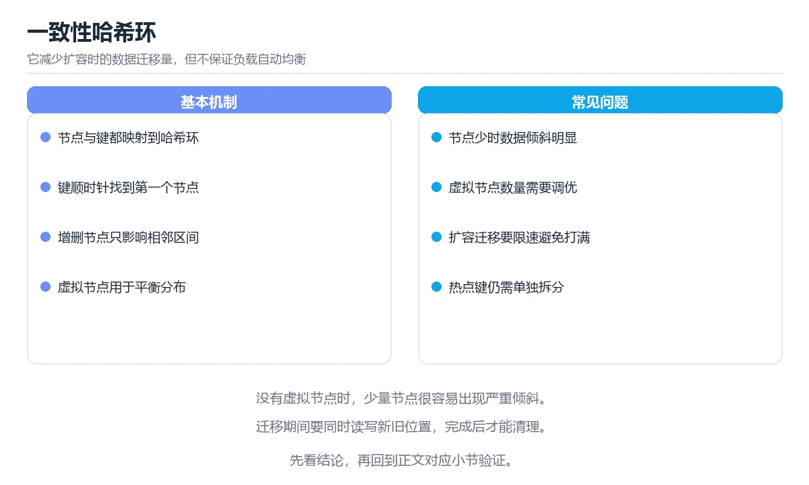

# 图解一致性哈希与数据分片

> 内容更新时间：2026-10-06 · 学习阶段：进阶 · 预计用时：50 分钟

## 本节知识框架

**课程定位**：所属分类为「图解专题」，课程主题为「图解一致性哈希与数据分片」，学习阶段为「进阶」，建议用时 50 分钟。

**本课要解决的主问题**：取模扩容的问题、哈希环、虚拟节点、分片键选择与迁移流程。

| 学习层次 | 要回答的问题 | 完成判据 |
| --- | --- | --- |
| 概念层 | 「图解一致性哈希与数据分片」有哪些必须区分的对象与术语？ | 能用自己的话定义核心术语，并各举一个正例和一个反例。 |
| 机制层 | 这些对象按什么顺序发生作用，输入如何变成输出？ | 能画出或写出机制步骤，并说明每一步的失败条件。 |
| 应用层 | 什么场景适合使用「图解一致性哈希与数据分片」，什么场景不适合？ | 能给出一个真实场景、一个最小示例和一个边界案例。 |
| 性能层 | 时间、空间、吞吐或延迟受哪些量影响？ | 能说出复杂度或性能瓶颈的证据来源；没有证据时明确写“材料未提供”。 |
| 复习层 | 怎样确认自己不是只记住了结论？ | 能独立完成本课自测，并把错误定位到概念、机制、示例或边界。 |

### 阅读路线

1. 先读「核心概念定义」，建立「一致性哈希」等对象的精确定义。
2. 再读「原理与运行机制」，把定义串成可重复的过程。
3. 用「代码/协议/SQL 示例」验证过程，并只改一个条件观察结果变化。
4. 最后检查性能、易错点、知识关系与自测题，形成可复习的证据链。

**前置知识**：《图解 Kafka 分区、副本与再平衡》

**学习位置**：本课位于《图解 Kafka 分区、副本与再平衡》之后；如果前一课的自测不能通过，应先回补再继续。

**后续衔接**：下一课《图解向量检索与 HNSW 索引》会继续使用本课术语，学完后建议立即完成一次自测。

**教材衔接：学习目标**

- 能用自己的话解释图解一致性哈希与数据分片解决了什么问题，而不是只背术语。
- 能说清 「一致性哈希」、「分片」、「虚拟节点」、「扩容」 之间的关系，并分别举出一个例子。
- 能把 一致性哈希 放回「图解一致性哈希与数据分片」的知识体系，说明它和 分片 的边界。
- 能完成本课练习，并用验收标准检查自己的结果。

> 一句话摘要：取模扩容的问题、哈希环、虚拟节点、分片键选择与迁移流程。

**教材衔接：前置知识**

- 先完成上一课《图解 Kafka 分区、副本与再平衡》；如果已经掌握，可以直接用本课练习自测。
- 本课阶段：进阶。建议先完成「图解 Kafka 分区、副本与再平衡」，或确认自己能独立跑通正文里的 SHARDS 示例。
- 开始前先复习：一致性哈希、分片、虚拟节点。
- 看不懂就直接缩小例子：只保留 一致性哈希 相关的两行输入，跑通后再加回其余部分。


**教材衔接：本课小结**

- 取模分片扩容要搬全量数据，**一致性哈希把迁移量降到约 1/N**。
- 虚拟节点解决倾斜，分片键决定分布与查询效率。
- 迁移的安全三件套：**双写、校验、回退读**。

## 核心概念定义

> 在阅读《图解一致性哈希与数据分片》时，术语第一次出现先给操作性定义，再给边界；正文说法与这里冲突时，以定义和可复现示例为准。

| 术语 | 操作性定义 | 本课中的边界 |
| --- | --- | --- |
| 一致性哈希 | 把节点和键映射到同一环上，使节点增减只影响邻近区间。 | 仅在「图解一致性哈希与数据分片」明确给出的输入、版本与资源条件下成立。 |
| 分片 | 把数据按规则分散到多个节点，使单机容量和吞吐可以水平扩展。 | 仅在「图解一致性哈希与数据分片」明确给出的输入、版本与资源条件下成立。 |
| 哈希环 | 把节点与键都映射到同一个环上，键顺时针找到的第一个节点就是归属，扩缩容只影响相邻区间。 | 仅在「图解一致性哈希与数据分片」明确给出的输入、版本与资源条件下成立。 |
| 虚拟节点 | 给每个物理节点在环上放多个副本，缓解数据分布不均与热点问题。 | 仅在「图解一致性哈希与数据分片」明确给出的输入、版本与资源条件下成立。 |

### 定义如何使用

在「图解一致性哈希与数据分片」中判断一个说法是否成立，先确认它使用的是哪个对象的定义，再检查输入规模、运行环境与失败路径。定义不是口号，而是后续推导、代码示例和自测题共享的约束。

## 原理与运行机制

### 机制总览

1. **建立输入**：把「一致性哈希」按本课定义整理成可观察、可重复的输入条件。
2. **执行转换**：围绕「分片」执行本课的核心步骤；每一步都记录中间状态，避免只看最终输出。
3. **产生输出**：得到「哈希环」后，用正文示例或协议/SQL 结果核对输出是否符合预期。
4. **改变一个条件**：只替换一个边界条件或环境参数，观察「图解一致性哈希与数据分片」的结论是否仍然成立。

| 阶段 | 关注对象 | 失败时应检查 |
| --- | --- | --- |
| 输入 | 一致性哈希 | 类型、范围、编码、版本或前置状态是否满足定义。 |
| 处理 | 分片 | 顺序、可见性、锁、路由、事务或调度规则是否被破坏。 |
| 输出 | 哈希环 | 结果是否可复现，错误是否被正确传播而不是被吞掉。 |

本课的机制结论要用「图解一致性哈希与数据分片」自己的示例验证。「图解一致性哈希与数据分片」没有给出某个数量级、吞吐或内存数据时，本课把该判断标为“材料未提供”，不从相邻主题外推。

**教材衔接：一句话说清**

分片（Sharding）解决「数据太多放一台机器」的问题；
一致性哈希解决「增删节点时如何少搬数据」的问题。

**教材衔接：一致性哈希的环形结构**

```text
把哈希空间看成一个环（0 ~ 2^32-1），节点与数据都落在这个环上

               0
        ┌──────────────┐
   N3 ──┤              ├── N1       数据顺时针找到第一个节点
        │     环       │
        └──────────────┘
             N2

  key 落在 N1 与 N2 之间 → 顺时针归属 N2

增加节点 N4 后
  只有 N4 逆时针到上一个节点之间的 key 需要搬迁
  其余 key 不受影响（约 1/N 的数据移动）
```

| 方案 | 扩容时迁移比例 | 说明 |
| --- | --- | --- |
| 取模 | 几乎全部 | 不可接受 |
| 一致性哈希 | 约 1/N | 明显改善 |
| 一致性哈希加虚拟节点 | 约 1/N 且分布均匀 | **推荐** |

**教材衔接：扩容时的迁移流程**

```text
① 增加新节点并加入环
② 计算需要迁移的 key 区间
③ 双写：新写入同时写新旧位置（按优先级）
④ 后台搬迁历史数据并校验
⑤ 读请求逐步切换到新位置（先读新，未命中回退旧）
⑥ 校验一致后停止双写，下线旧位置
```

**关键点**：迁移期间必须能读旧数据（回退读），否则会出错。

**教材衔接：补充：虚拟节点、热点与迁移实现**

### 虚拟节点数量怎么选

```text
没有虚拟节点：3 个物理节点，负载可能 60% / 25% / 15%
每节点 150 个虚拟节点：负载接近 33% / 33% / 34%

经验值
  · 10 个以内：倾斜仍明显，只适合节点很多（>100）的场景
  · 100~200 个：通用推荐，内存开销可接受
  · 上千个：分布更均匀，但路由表变大、查找变慢
```

| 虚拟节点数 | 分布均匀度 | 路由表大小 | 说明 |
| --- | --- | --- | --- |
| 1（无虚拟节点） | 差 | 最小 | 节点少时明显倾斜 |
| 100 | 好 | 适中 | **默认选择** |
| 1000 | 很好 | 大 | 需要极均匀时才用 |

### 热点的两种成因与对策

```text
① 键本身热：某个 key 的访问量远高于其他
   · 例：明星微博、秒杀商品
   · 对策：给 key 加随机后缀打散到多个分片，读取时聚合

② 分片热：某个分片承载了过多数据
   · 例：按时间分片导致最新分片写满
   · 对策：调整分片键（时间 + 哈希），或对该分片单独扩容
```

```python
# 热点读打散：写时复制成 N 份，读时随机选一份
import random

SHARDS = 8

def write(redis, key: str, value: str) -> None:
    for i in range(SHARDS):
        redis.set(f"{key}#{i}", value)

def read(redis, key: str) -> str | None:
    return redis.get(f"{key}#{random.randint(0, SHARDS - 1)}")
```

**注意**：打散只适合读多写少；写放大 N 倍，写入路径要谨慎使用。

### 迁移的四种实现方式

| 方式 | 原理 | 优点 | 风险 |
| --- | --- | --- | --- |
| 停机迁移 | 停服后整体搬迁 | 简单 | 不可接受（在线业务） |
| 双写 | 新旧位置同时写 | 不丢数据 | 需要处理写失败 |
| 回退读 | 新位置未命中时读旧位置 | 平滑切换 | 需要保留旧数据 |
| 异步搬迁 | 后台任务逐批搬历史数据 | 对线上影响小 | 需校验一致性 |

```text
推荐的组合：双写 + 回退读 + 后台搬迁 + 校验

  写：写新位置，失败时记入补偿队列再写旧位置
  读：先读新位置，未命中读旧位置并把结果回填
  搬：后台按 key 区间分批搬迁历史数据
  校：抽样比对两边内容，不一致时以旧为准并重搬
  切：校验通过 → 停止双写 → 观察一周 → 删除旧数据
```

### 与其它分流算法的对比

| 算法 | 扩容迁移量 | 实现复杂度 | 特点 |
| --- | --- | --- | --- |
| 取模 | 几乎全部 | 最低 | 只在节点固定时可用 |
| 一致性哈希 | 约 1/N | 中 | 通用，需要虚拟节点 |
| Rendezvous（最高随机权重） | 约 1/N | 低 | 无需环形结构，节点少时也均匀 |
| 显式分片表 | 精确可控 | 高 | 需要中心化元数据管理 |

```text
Rendezvous 哈希的直觉
  对每个 (key, node) 计算 hash(key + node)，选分数最高的节点
  节点下线时只有它负责的 key 会重新分配，其余不变
  代码只有十来行，却能得到与一致性哈希相当的迁移量
```

### 自查清单

- [ ] 分片键基数足够大且分布均匀
- [ ] 每个物理节点配置了 100+ 虚拟节点
- [ ] 迁移期间有双写、回退读与一致性校验
- [ ] 已识别热点键并准备了打散或本地缓存方案
- [ ] 节点扩缩容流程经过演练，能回退

**教材衔接：深入补充：图解一致性哈希与数据分片 的取舍与边界**

### 一、把概念放回真实约束

学习图解一致性哈希与数据分片时，最容易只记住结论而忽略前提。先写出三个约束：数据规模、时间预算、可接受的失败方式；再判断 一致性哈希 与 分片 在这些约束下是否仍然成立。只要约束改变，原来的最优解就可能变成错误解。

| 观察到的现象 | 背后的机制 | 验证方式 | 常见误判 |
| --- | --- | --- | --- |
| 延迟突然升高 | 队列堆积或重传 | 分段计时与指标对照 | 只盯平均值 |
| 状态看似随机 | 并发交错或缓存失效 | 固定随机种子复现 | 把时序问题当逻辑错误 |
| 结果与预期不符 | 默认值与边界规则 | 构造最小输入 | 忽略版本差异 |

### 二、三个容易混淆的边界

1. 澄清输入与目标。先写清「图解一致性哈希与数据分片」要解决的问题、合法输入范围和成功标准，再进入后续步骤。
2. **把“平均值”当成“全部”**：一致性哈希 的指标好看，不代表尾部请求、冷启动或失败重试也好看。
3. **把“当前版本”当成“永久行为”**：分片 依赖的默认值、API 或性能特征都可能随版本变化，需要固定版本并保留回归用例。

### 三、一个生产场景

假设团队要在真实系统里使用图解一致性哈希与数据分片：第一周先做小流量验证，记录 一致性哈希 的基线与异常；第二周扩大输入规模，观察 分片 是否成为瓶颈；第三周再做故障演练，主动注入超时、重复请求和依赖不可用，确认系统能降级、能重试、能恢复。每一步都要留下指标、日志和结论，而不是只留下“感觉更快了”。

### 四、自测清单

- 能否用一句话说出图解一致性哈希与数据分片解决的核心问题与不适用场景？
- 能否画出 一致性哈希 的数据流或状态变化，并标出失败路径？
- 把 SHARDS 的输入推到边界，说明本课哪一条结论会先失效。
- 能否写出一条可复现的验证命令，让别人独立得到相同结论？

**教材衔接：零基础精讲：把图解一致性哈希与数据分片真正讲透**

### 先建立一个直觉

本课的摘要可以当作一张地图：取模扩容的问题、哈希环、虚拟节点、分片键选择与迁移流程。

### 逐步拆解

1. 澄清输入与目标。先写清「图解一致性哈希与数据分片」要解决的问题、合法输入范围和成功标准，再进入后续步骤。
2. 描述处理过程。把「一致性哈希、分片、虚拟节点、扩容、热点」映射到具体步骤，每步都要求能单独验证。
3. 定义输出。明确 一致性哈希 与 分片 各自的产物，以及失败时留下什么证据。
4. 构造一次一致性哈希越界，记录系统是拒绝、降级还是静默出错；三者对应的修复策略完全不同。
5. 把 SHARDS 的规模缩小到一眼能算清的程度，手动推导结果后再用程序验证，差异处就是理解漏洞。

### 把正文串成一条执行链

- **虚拟节点数量怎么选**：| 虚拟节点数 | 分布均匀度 | 路由表大小 | 说明 |
- **热点的两种成因与对策**：**注意**：打散只适合读多写少；写放大 N 倍，写入路径要谨慎使用
- **迁移的四种实现方式**：| 方式 | 原理 | 优点 | 风险 |
- **与其它分流算法的对比**：| 算法 | 扩容迁移量 | 实现复杂度 | 特点 |
- **自查清单**：- [ ] 分片键基数足够大且分布均匀
- **练习 1：建立心智模型（10 分钟）**：在「图解一致性哈希与数据分片」里，「练习 1：建立心智模型（10 分钟）」这一步要先写清输入与预期，再记录实际结果和差异；结果不符时回到对应小节核对前提。

### 从测验反推易错点

**检查点 1：用「hash(key) % 节点数」分片，从 3 个节点扩到 4 个节点会怎样？**

- 参考判断：几乎所有 key 的归属都会变化
- 自问：如果去掉题干里的一个限定词，结论还成立吗？

**检查点 2：虚拟节点解决的核心问题是？**

- 参考判断：让节点在哈希环上分布更均匀

**检查点 3：选择分片键时，最重要的三条标准是？**

- 参考判断：基数足够大、分布均匀、与常见查询匹配

**检查点 4：分片迁移期间保证不丢数据的关键手段是？**

- 参考判断：双写加校验

- 参考判断：Rendezvous、rendezvous

### 工程排错顺序

| 先查什么 | 要得到的证据 | 判断标准 |
| --- | --- | --- |
| 输入与前提是否满足 | 日志、输入样例、测试或指标 | 能复现并解释，才算定位 |
| 核心步骤是否产生了预期中间结果 | 日志、输入样例、测试或指标 | 能复现并解释，才算定位 |
| 失败路径是否可观测、可恢复 | 日志、输入样例、测试或指标 | 能复现并解释，才算定位 |
| 资源、权限与成本是否在预算内 | 日志、输入样例、测试或指标 | 能复现并解释，才算定位 |

### 变式训练

1. 先用一个单文件示例验证 SHARDS，确认正确性后再引入框架或分布式组件。
2. 扩大 分片 的规模，记录本课结论在哪一个量级开始不成立。
3. 把 分片 换成失败输入，记录错误信息与恢复动作。
5. 故意跳过 分片 的检查再运行，比较与正常流程的差异，并说明这个检查挡住的到底是哪一类失败。
6. 限制 CPU 与内存上限后重跑 SHARDS，观察哪一项参数需要重新设定。

### 本课自测

- [ ] 能用一句话解释「一致性哈希」在本课中的角色与边界。
- [ ] 能举出一个正常例子和一个失败例子。
- [ ] 能说出最小验证步骤，以及需要记录的证据。
- [ ] 能用一句话解释「分片」在本课中的角色与边界。
- [ ] 能用一句话解释「虚拟节点」在本课中的角色与边界。
- [ ] 能用一句话解释「扩容」在本课中的角色与边界。
- [ ] 能用一句话解释「热点」在本课中的角色与边界。

### 迁移案例库

围绕 SHARDS 重复同一套方法，每完成一轮就把差异写进笔记。

#### 迁移案例 1：围绕「一致性哈希」做一次小实验

**目标**：在不改变课程主体的前提下，验证图解一致性哈希与数据分片中的一个关键判断。

**步骤**：
1. 复述当前方案对「一致性哈希」的假设，写成一句可证伪的话。
2. 设计一个正常输入和一个边界输入，分别预测输出。
3. 运行或逐步演算，记录实际输出、耗时和失败信息。
4. 只调整一个参数，比较前后差异并解释原因。
5. 补充一条测试或复习卡，确保下次能更快复现。

**验收**：迁移过程要留下 SHARDS 的可运行记录，并说明分片在新场景下是否仍然成立。

#### 迁移案例 2：围绕「分片」做一次小实验

**步骤**：
1. 复述当前方案对「分片」的假设，写成一句可证伪的话。

#### 迁移案例 3：围绕「虚拟节点」做一次小实验

**步骤**：
1. 复述当前方案对「虚拟节点」的假设，写成一句可证伪的话。

#### 迁移案例 4：围绕「扩容」做一次小实验

**步骤**：
1. 复述当前方案对「扩容」的假设，写成一句可证伪的话。

#### 迁移案例 5：围绕「热点」做一次小实验

**步骤**：
1. 复述当前方案对「热点」的假设，写成一句可证伪的话。

#### 迁移案例 6：围绕「一致性哈希」做一次小实验

**步骤**：

#### 迁移案例 7：围绕「分片」做一次小实验

**步骤**：

#### 迁移案例 8：围绕「虚拟节点」做一次小实验

**步骤**：

#### 迁移案例 9：围绕「扩容」做一次小实验

**步骤**：

#### 迁移案例 10：围绕「热点」做一次小实验

**步骤**：

#### 迁移案例 11：围绕「一致性哈希」做一次小实验

**步骤**：

#### 迁移案例 12：围绕「分片」做一次小实验

**步骤**：

#### 迁移案例 13：围绕「虚拟节点」做一次小实验

**步骤**：

#### 迁移案例 14：围绕「扩容」做一次小实验

**步骤**：

#### 迁移案例 15：围绕「热点」做一次小实验

**步骤**：

#### 迁移案例 16：围绕「一致性哈希」做一次小实验

**步骤**：

<!-- p0-depth-v2:end -->

## 典型应用场景

| 场景 | 典型输入或前提 | 期望产物 |
| --- | --- | --- |
| 学习验证 | 使用本课最小示例和 一致性哈希、分片 | 能复现正文结论，并解释每一步。 |
| 工程落地 | 把「图解一致性哈希与数据分片」放入真实模块或服务边界 | 输出可观测、失败可定位、参数可配置。 |
| 故障排查 | 只改一个版本、规模、输入或依赖条件 | 能区分概念错误、实现错误和环境差异。 |

判断「图解一致性哈希与数据分片」的场景是否成立，标准是能否写出输入、处理、输出和失败路径；材料中没有出现的数据在本课标注为“材料未提供”，不用推测替代证据。

## 代码/协议/SQL 示例

以下代码、协议或 SQL 片段来自《图解一致性哈希与数据分片》原文，保留原有语言标记与上下文；先预测《图解一致性哈希与数据分片》示例的输出，再按正文步骤运行或推演，示例依赖外部环境时同时记录版本与输入。

**教材衔接：普通取模分片的痛点**

```text
分片规则：shard = hash(key) % 节点数

3 个节点时
  key=A → hash=10 → 10 % 3 = 1 → 节点 1
  key=B → hash=11 → 11 % 3 = 2 → 节点 2

扩容到 4 个节点后
  key=A → 10 % 4 = 2 → 节点 2   ← 位置变了
  key=B → 11 % 4 = 3 → 节点 3   ← 位置变了

几乎全部 key 都要搬迁 → 缓存集体失效、数据库压力暴涨
```

**教材衔接：虚拟节点解决数据倾斜**

```text
没有虚拟节点：3 个物理节点在环上，区间大小随机，负载不均

  N1 覆盖 60%   ← 热点
  N2 覆盖 25%
  N3 覆盖 15%

加虚拟节点：每个物理节点映射为 100~200 个虚拟节点

  N1 ─► v1-1, v1-2, … v1-150
  N2 ─► v2-1, v2-2, … v2-150
  N3 ─► v3-1, v3-2, … v3-150

  环上均匀交错 → 每个物理节点承担约 1/3
```

| 参数 | 作用 | 经验值 |
| --- | --- | --- |
| 虚拟节点数 | 每个物理节点在环上的副本数 | 100~200 |
| 哈希函数 | 决定均匀性 | MD5、MurmurHash |

**教材衔接：分片键的选择**

| 分片键 | 优点 | 风险 |
| --- | --- | --- |
| 用户 ID | 同用户数据集中，查询快 | 大 V 用户形成热点 |
| 订单 ID | 分布均匀 | 按用户查询要跨分片 |
| 时间 | 便于归档 | 最新数据集中在同一分片（写热点） |
| 租户 ID | 隔离性好 | 大租户占用过多资源 |

```text
三条判断标准
  ① 基数足够大：避免少数值占满
  ② 分布均匀：避免写热点
  ③ 与查询匹配：最常见查询能否命中单分片
```

**教材衔接：跨分片查询的代价**

```text
按用户分片后，查询「最近 10 笔订单」需要：

  分片 1 ──取前 10──┐
  分片 2 ──取前 10──┤
  分片 3 ──取前 10──┼──► 归并排序 ──► 取真正前 10
  分片 4 ──取前 10──┘

代价：扇出请求、延迟取决于最慢分片、需要归并
```

| 需求 | 方案 |
| --- | --- |
| 按分片键查 | 单分片，最快 |
| 跨分片分页 | 并行查询后归并 |
| 全局统计 | 预聚合表或离线计算 |
| 模糊搜索 | 独立搜索引擎（倒排索引） |

## 时间/空间复杂度或性能分析

**复杂度证据**：「图解一致性哈希与数据分片」的现有材料没有给出渐近时间或空间复杂度的明确结论，本课只做定性检查，不补写未经验证的 $O$ 记号。

| 维度 | 本课关注点 | 判断依据 |
| --- | --- | --- |
| 时间/延迟 | 「图解一致性哈希与数据分片」的主要步骤是否会随输入规模、并发度或网络往返增长。 | 以正文复杂度、基准数据或可重复测量为准。 |
| 空间/内存 | 中间状态、缓存、副本、连接或索引是否随规模增长。 | 记录峰值内存与数据副本，不只看最终结果。 |
| 吞吐/资源 | 版本、调度、锁、IO、序列化或协议开销是否成为瓶颈。 | 固定环境做对照实验，改变一个变量。 |

评估「图解一致性哈希与数据分片」时要区分“正确性成立”和“性能达标”两件事；材料没有给出基准时，本课只保留量级来源与测量方法，不写不可验证的绝对数字。

## 常见误区与易错点

> 复核《图解一致性哈希与数据分片》的易错点时，优先保留原文的错误表、故障现场与排错路径；每条修正都要能用本课示例复验。

| 易错点 | 常见表现 | 正确做法 |
| --- | --- | --- |
| 只背结论 | 能复述「图解一致性哈希与数据分片」的定义，却说不清输入、输出与边界。 | 回到机制步骤，用最小示例逐一验证。 |
| 混淆相邻概念 | 把本课对象与相邻主题的对象当成同一类。 | 先比较定义、资源归属、生命周期和失败模式。 |
| 忽略版本与环境 | 在开发机通过后直接外推到生产环境。 | 固定版本、输入和资源条件，再记录可复现结果。 |

**教材衔接：常见错误与排查**

| 坑 | 现象 | 正确做法 |
| --- | --- | --- |
| 用取模分片 | 扩容搬全量数据 | 用一致性哈希 |
| 不加虚拟节点 | 负载严重倾斜 | 每节点 100+ 虚拟节点 |
| 分片键基数太低 | 热点集中 | 选高基数字段 |
| 用时间戳分片 | 写入集中在最新分片 | 时间加哈希组合 |
| 迁移不做双写 | 丢数据 | 双写加校验 |
| 跨分片查询频繁 | 延迟高且易超时 | 调整分片键或建预聚合 |
| 忘记处理热点 | 单分片打满 | 热点单独拆分或本地缓存 |
| 迁移没有回退方案 | 出错无法恢复 | 保留旧数据直到验证完成 |



**教材衔接：故障现场**

### 现场 1：不加虚拟节点

**症状**：在《图解一致性哈希与数据分片》的复现场景中，负载严重倾斜。

**根因**：“负载严重倾斜”只是表层结果。向上追溯会落到“不加虚拟节点”这一步，因为它省略了《图解一致性哈希与数据分片》的约束，使实现行为和预期模型发生了偏离。

**修复**：针对《图解一致性哈希与数据分片》的问题，每节点 100+ 虚拟节点。

**验证**：保留《图解一致性哈希与数据分片》里触发“负载严重倾斜”的输入、版本和日志，按“每节点 100+ 虚拟节点”完成修改后原样重放；只有失败现象消失且相邻场景仍可解释，才保留改动。

### 现场 2：用时间戳分片

**症状**：在《图解一致性哈希与数据分片》的复现场景中，写入集中在最新分片。

**根因**：当出现“用时间戳分片”时，执行路径已经绕过了《图解一致性哈希与数据分片》的关键约束，最终以“写入集中在最新分片”暴露出来；修复前必须先确认约束在哪里失效。

**修复**：针对《图解一致性哈希与数据分片》的问题，时间加哈希组合。

**验证**：保留《图解一致性哈希与数据分片》里触发“写入集中在最新分片”的输入、版本和日志，按“时间加哈希组合”完成修改后原样重放；只有失败现象消失且相邻场景仍可解释，才保留改动。

### 现场 3：跨分片查询频繁

**症状**：在《图解一致性哈希与数据分片》的复现场景中，延迟高且易超时。

**根因**：当出现“跨分片查询频繁”时，执行路径已经绕过了《图解一致性哈希与数据分片》的关键约束，最终以“延迟高且易超时”暴露出来；修复前必须先确认约束在哪里失效。

**修复**：针对《图解一致性哈希与数据分片》的问题，调整分片键或建预聚合。

**验证**：在《图解一致性哈希与数据分片》中按“调整分片键或建预聚合”调整后，从“跨分片查询频繁”的触发条件重放同一条路径，确认“延迟高且易超时”不再出现，并补一个相邻边界用例检查没有引入新问题。

## 与其他知识点的关系

| 关系 | 课程 | 为什么 |
| --- | --- | --- |
| 先修 | 《图解 Kafka 分区、副本与再平衡》 | 本课会直接使用它的概念或操作前提。 |
| 关联 | 《图解向量检索与 HNSW 索引》 | 用于横向比较或把本课结论迁移到相邻主题。 |
| 前置顺序 | 《图解 Kafka 分区、副本与再平衡》 | 同分类中安排在本课之前，建议先完成其自测。 |
| 后续顺序 | 《图解向量检索与 HNSW 索引》 | 同分类中安排在本课之后，会继续使用本课术语。 |

把「图解一致性哈希与数据分片」放回知识体系时，不只要记住“前面学过什么”，还要说明两个主题在输入、机制、资源边界和失败模式上的差异。这样才能把单课知识迁移到项目、排障和后续课程。

## 自测题与参考答案

> 先独立完成《图解一致性哈希与数据分片》的自测，再核对答案与解析。答案必须能在本课正文或示例中找到依据，不能只凭语感。

### 自测 1

围绕“图解一致性哈希与数据分片”中的 一致性哈希、分片、虚拟节点，下列哪两项是本课强调的实践判断？

A. 学习 一致性哈希 时要同时说明输入、输出和失败路径，不能只看正常流程
B. 只要 一致性哈希 的常规示例通过，就可以跳过边界与异常路径
C. 验证 分片 时要固定版本并覆盖边界输入，结论才可复现
D. 把 分片 的单次运行结果当成所有版本和规模都成立

**参考答案**：学习 一致性哈希 时要同时说明输入、输出和失败路径，不能只看正常流程；验证 分片 时要固定版本并覆盖边界输入，结论才可复现

**解析**：本课把图解一致性哈希与数据分片拆成概念、示例与故障现场三部分，因此判断 一致性哈希 时必须同时交代输入、输出和失败路径，这使“学习 一致性哈希 时要同时说明输入、输出和失败路径，不能只看正常流程”成立。在图解一致性哈希与数据分片里，判断 分片 时要固定版本与边界输入，所以“验证 分片 时要固定版本并覆盖边界输入，结论才可复现”才可复现。

### 自测 2

下面这段 Python 代码摘自「图解一致性哈希与数据分片」的正文示例。关于这段代码，下面哪一项说法与实际内容相符？

```python
# 热点读打散：写时复制成 N 份，读时随机选一份
import random

SHARDS = 8

def write(redis, key: str, value: str) -> None:
    for i in range(SHARDS):
        redis.set(f"{key}#{i}", value)

def read(redis, key: str) -> str | None:
    return redis.get(f"{key}#{random.randint(0, SHARDS - 1)}")
```

A. 这段代码会产生可观察的输出，运行后能看到结果。
B. 这段代码只做静态声明，没有循环、分支或可观察输出。
C. 这段代码包含循环结构，同一段逻辑会被重复执行。
D. 这段代码会读取外部输入，结果依赖传入的数据。

**参考答案**：这段代码包含循环结构，同一段逻辑会被重复执行。

**解析**：题干的正确项是这段代码包含循环结构，同一段逻辑会被重复执行，在「图解一致性哈希与数据分片」里循环次数与一致性哈希的输入规模直接相关。这段代码出自「图解一致性哈希与数据分片」的正文示例，围绕一致性哈希、分片、虚拟节点展开；把输入或边界换成空值、极值或失败情况后，结论要以「图解一致性哈希与数据分片」的实际运行结果为准。“下面这段”与「图解一致性哈希与数据分片」的术语表相呼应，只有符合一致性哈希、分片、虚拟节点约束的“这段代码包含循环结构”才是正文支持的结论。

### 自测 3

选择分片键时，最重要的三条标准是？

A. 与业务无关、随机、不可预测
B. 短、好记、按字母排序
C. 基数足够大、分布均匀、与常见查询匹配
D. 必须自增、必须唯一、必须为数字

**参考答案**：基数足够大、分布均匀、与常见查询匹配

**解析**：在「图解一致性哈希与数据分片」里，基数足够大、分布均匀、与常见查询匹配。这道题的关键在「图解一致性哈希与数据分片」的一致性哈希、分片、虚拟节点：先确认题干“选择分片键时”问的是哪一步，再排除偷换前提的选项。把“基数足够大、分布均匀、与常见查询匹配”代回「图解一致性哈希与数据分片」里“分片键时”的例子核对，条件一旦改变，结论就要用一致性哈希、分片、虚拟节点重新推导。

**教材衔接：动手练习**

> 本课练习重点：围绕「一致性哈希、分片、虚拟节点」完成复述、实验和交付，每个结果都要能被别人检查。

手绘 分片 的状态转移图，标出哪一步会写数据。

### 练习 1：建立心智模型（10 分钟）

合上教程，用 3～5 句话回答：

1. 图解一致性哈希与数据分片解决了什么问题？
2. 如果没有它，会出现什么具体后果？
3. 它和「分片」是什么关系？

验收标准：用自己的话解释 一致性哈希，并给出一个它不成立的反例。

### 练习 2：做一次可控实验（20 分钟）

从正文中选一个最小示例，完成以下操作：

1. 先预测修改一个参数、输入或步骤后的结果。
2. 再实际执行或逐步推演，记录真实结果。
3. 如果结果与预测不同，写出差异原因。

**验收标准**：把 SHARDS 当作原例，改动一次分片的取值，记录命令、输出与差异原因；五步里缺任意一步都算未完成。

### 练习 3：交付一个小结果（30 分钟）

不看原图手绘一遍流程，再用自己的话指出图中的关键状态变化。

任务要求：

- 结果必须能被别人检查，不能只写“我已经理解了”。
- 至少覆盖「一致性哈希」和「分片」两个关键词。
- 写出 1 个仍然不确定的问题，以及下一步如何验证。

> 提示：时间有限时优先做练习 1 和练习 2；练习 3 可以拆成两次完成。

**教材衔接：可运行练习**

### 任务 1：先跑通，再解释

```python
# 热点读打散：写时复制成 N 份，读时随机选一份
import random

SHARDS = 8

def write(redis, key: str, value: str) -> None:
    for i in range(SHARDS):
        redis.set(f"{key}#{i}", value)

def read(redis, key: str) -> str | None:
    return redis.get(f"{key}#{random.randint(0, SHARDS - 1)}")
```

### 任务 2：只改一个条件

把「图解一致性哈希与数据分片」的最小示例复制一份，只改一个条件再跑一次：

- 改动点：只调整 SHARDS 的一个参数，其余条件一律不动。
- 预测：先写下「图解一致性哈希与数据分片」在改动后的输出或错误信息，再运行。
- 记录：对照改动前后的结果，指出差异出在哪一步。
- 验收：换回原条件能复现原结果，改动只影响一致性哈希。

### 任务 3：迁移到自己的数据

换一个 分片 场景重做一次，确认结论不是只对示例数据成立。

**教材衔接：本课复习清单**

离开本课前，逐项确认：

- [ ] 不看解析，能说出「用「hash(key) % 节点数」分片，从 3 个节点扩到 4 个节点会怎样？」的判断依据。
- [ ] 不看解析，能说出「虚拟节点解决的核心问题是？」的判断依据。
- [ ] 不看解析，能说出「选择分片键时，最重要的三条标准是？」的判断依据。
- [ ] 不看解析，能说出「分片迁移期间保证不丢数据的关键手段是？」的判断依据。
- [ ] 至少运行一次 SHARDS 的示例，记录输入、输出和 一致性哈希 的边界情况。
- [ ] 把本课最容易混淆的两个概念写成一句话对照。

| 复盘项 | 记录 |
| --- | --- |
| 已经能独立解释的考点 |  |
| 仍然说不清的概念 |  |
| 下一步验证动作 |  |

**教材衔接：复习与自测**

- [ ] 能说清「一句话说清」的结论，并说出它的适用边界。
- [ ] 能用自己的话复述「普通取模分片的痛点」，并各举一个正例和反例。
- [ ] 能解释「一致性哈希的环形结构」里最容易混淆的两个概念。
- [ ] 能不看正文写出「虚拟节点解决数据倾斜」的关键步骤。
- [ ] 能用一句话说明「分片键的选择」解决什么问题。
- [ ] 能把「跨分片查询的代价」的判断标准套到一个新例子上。

---

## 术语速查

把「图解一致性哈希与数据分片」里反复出现的术语集中放在一起。复习时先遮住右列，尝试用自己的话解释，再回到正文核对。

| 术语 | 一句话说明 |
| --- | --- |
| `一致性哈希` | 把节点和键映射到同一环上，使节点增减只影响邻近区间。 |
| `分片` | 把数据按规则分散到多个节点，使单机容量和吞吐可以水平扩展。 |
| `哈希环` | 把节点与键都映射到同一个环上，键顺时针找到的第一个节点就是归属，扩缩容只影响相邻区间。 |
| `虚拟节点` | 给每个物理节点在环上放多个副本，缓解数据分布不均与热点问题。 |

## 考点精讲

### 考点 1：多选辨析·一致性哈希

- **题目**：围绕“图解一致性哈希与数据分片”中的 一致性哈希、分片、虚拟节点，下列哪两项是本课强调的实践判断？
- **判断依据**：本课把图解一致性哈希与数据分片拆成概念、示例与故障现场三部分，因此判断 一致性哈希 时必须同时交代输入、输出和失败路径，这使“学习 一致性哈希 时要同时说明输入、输出和失败路径，不能只看正常流程”成立。在图解一致性哈希与数据分片里，判断 分片 时要固定版本与边界输入，所以“验证 分片 时要固定版本并覆盖边界输入，结论才可复现”才可复现。

### 考点 2：代码补全·一致性哈希

- **题目**：下面这段 Python 代码摘自「图解一致性哈希与数据分片」的正文示例。关于这段代码，下面哪一项说法与实际内容相符？
- **判断依据**：题干的正确项是这段代码包含循环结构，同一段逻辑会被重复执行，在「图解一致性哈希与数据分片」里循环次数与一致性哈希的输入规模直接相关。这段代码出自「图解一致性哈希与数据分片」的正文示例，围绕一致性哈希、分片、虚拟节点展开；把输入或边界换成空值、极值或失败情况后，结论要以「图解一致性哈希与数据分片」的实际运行结果为准。“下面这段”与「图解一致性哈希与数据分片」的术语表相呼应，只有符合一致性哈希、分片、虚拟节点约束的“这段代码包含循环结构”才是正文支持的结论。

### 考点 3：概念判断·一致性哈希

- **题目**：选择分片键时，最重要的三条标准是？
- **判断依据**：在「图解一致性哈希与数据分片」里，基数足够大、分布均匀、与常见查询匹配。这道题的关键在「图解一致性哈希与数据分片」的一致性哈希、分片、虚拟节点：先确认题干“选择分片键时”问的是哪一步，再排除偷换前提的选项。把“基数足够大、分布均匀、与常见查询匹配”代回「图解一致性哈希与数据分片」里“分片键时”的例子核对，条件一旦改变，结论就要用一致性哈希、分片、虚拟节点重新推导。

### 考点 4：概念判断·一致性哈希

- **题目**：分片迁移期间保证不丢数据的关键手段是？
- **判断依据**：双写保证新数据不丢，回退读保证迁移期间查询正常。作答时，先用一致性哈希建立输入与输出的基线，再把双写加校验代入边界条件核对，结论才能复现。在「图解一致性哈希与数据分片」里，这道题要求区分概念与边界，「双写加校验」只有在题干给出的前提下才成立，而「直接切换流量」、「先删除旧数据再写新数据」缺少同一组条件。

### 考点 5：填空·____ 哈希的直觉

- **题目**：补全代码：「图解一致性哈希与数据分片」示例中，下面这行代码缺少哪个关键字或函数名？请填入 ____。 `____ 哈希的直觉`
- **判断依据**：在「图解一致性哈希与数据分片」里，Rendezvous。在「图解一致性哈希与数据分片」里判断这道题，要把一致性哈希、分片、虚拟节点的条件、过程与失败路径逐项对齐，换成“补全代码”这个场景，只有满足前提的结论才成立。回到「图解一致性哈希与数据分片」的正文示例，用“补全代码”走一遍一致性哈希、分片、虚拟节点的完整流程，能复现的结论才可以保留。

## English Overview

**Title:** Consistent Hashing Illustrated

**Summary:** Modulo rehashing, hash rings, virtual nodes and migration.

**Category:** Visual Guide
**Level:** 进阶
**Key terms:** 一致性哈希, 分片, 虚拟节点, 扩容, 热点

## 内容元数据

- 内容版本：v2.0
- 最后更新：2026-10-06
- 学习阶段：进阶
- 适用环境：通用图解与系统原理；本课聚焦 一致性哈希。
- 内容来源：内置结构化课程与工程实践整理
- 相关主题：一致性哈希、分片、虚拟节点、扩容、热点
- 质量版本：P0 测验标准 + P1 覆盖扩展 + P2 体验补全

## 参考资料与复核

- 最后复核：2026-10-04
- 下次复核：2027-07-10
- 复核范围：版本兼容、API 行为、安全建议与工程实践
- 来源性质：官方文档、标准或权威教材；正文为离线教学重组

| 参考资料 | 本课用途 |
| --- | --- |
| [Kubernetes 架构](https://kubernetes.io/docs/concepts/architecture/) | 控制平面与节点流程 |
| [MDN 浏览器工作原理](https://developer.mozilla.org/docs/Web/Performance/How_browsers_work) | 从请求到渲染的流程 |
| [W3C 规范](https://www.w3.org/TR/) | Web 标准结构图 |

> 「图解一致性哈希与数据分片」的链接用于离线阅读后的延伸核对；App 不会自动联网。
