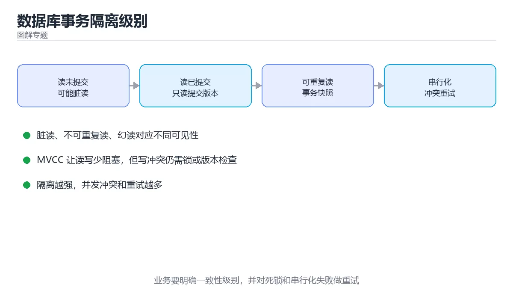

# 图解数据库事务隔离级别



> 内容更新时间：2026-10-03 · 学习阶段：进阶 · 预计用时：20 分钟

## 学习目标

- 能用自己的话解释「图解数据库事务隔离级别」解决了什么问题，而不是只背术语。
- 能说清 「事务」、「隔离级别」、「幻读」、「MVCC」 之间的关系，并分别举出一个例子。
- 能把本课知识放回「图解专题」的知识体系，说明它和相邻主题的边界。
- 能完成本课练习，并用验收标准检查自己的结果。

> 一句话摘要：脏读、不可重复读、幻读三现象，四种隔离级别与死锁成因。

## 前置知识

- 先完成上一课《图解 RAG 检索增强生成流程》；如果已经掌握，可以直接用本课练习自测。
- 本课阶段：进阶。建议先掌握同一分类的基础课程，并能独立运行正文中的最小示例。
- 开始前先复习：事务、隔离级别、幻读。
- 如果某一步看不懂，先记录具体卡点，完成练习后再回头读一遍。


## 一句话说清

隔离级别就是在「并发正确性」与「性能」之间选一个档位。
三个经典现象（脏读、不可重复读、幻读）几乎都由它决定。

## 三个现象的定义

```text
① 脏读 Dirty Read
   事务 A 读到了事务 B 尚未提交的修改；B 回滚后，A 读到的是从未存在的数据

   时间 →   T1                      T2
            BEGIN                   BEGIN
            修改金额 = 100（未提交）
                                    SELECT 金额 → 读到 100   ← 脏读
            ROLLBACK（金额回到 50）
                                    T2 以为自己读到了 100

② 不可重复读 Non-Repeatable Read
   同一事务内两次读同一行，结果不同（因为别的事务提交了修改）

   时间 →   T1                      T2
            SELECT 金额 → 50
                                    UPDATE 金额 = 100; COMMIT
            SELECT 金额 → 100        ← 同事务内不一致

③ 幻读 Phantom Read
   同一事务内两次执行同一范围查询，行数变了（别的事务插入/删除了行）

   时间 →   T1                      T2
            SELECT COUNT(*) WHERE 状态='待处理' → 5
                                    INSERT 一条待处理; COMMIT
            SELECT COUNT(*) WHERE 状态='待处理' → 6   ← 多出了「幻影行」
```

## 四种隔离级别对照

| 级别 | 脏读 | 不可重复读 | 幻读 | 典型实现 |
| --- | --- | --- | --- | --- |
| 读未提交 Read Uncommitted | 可能 | 可能 | 可能 | 几乎不用 |
| 读已提交 Read Committed | 不会 | 可能 | 可能 | PostgreSQL 默认、Oracle 默认 |
| 可重复读 Repeatable Read | 不会 | 不会 | 可能（MySQL 基本避免） | MySQL InnoDB 默认 |
| 串行化 Serializable | 不会 | 不会 | 不会 | 加锁或串行执行，性能最低 |

```text
隔离级别越高 → 一致性越强 → 并发度越低

  读未提交 ──► 读已提交 ──► 可重复读 ──► 串行化
   最快                                    最安全
```

## 实现机制：锁与快照

```text
① 行锁（写写冲突）
   事务 A 更新某行 → 持有排他锁
   事务 B 想更新同一行 → 等待

② 间隙锁（防幻读，MySQL InnoDB）
   在索引记录的间隙上加锁，阻止其他事务插入新行

③ MVCC 多版本并发控制（读不加锁）
   每行保留多个版本，事务按自己的快照读取

   行版本：   v1(已提交)   v2(已提交)   v3(未提交)
   事务 T1 的快照 ──► 读 v2
   事务 T2 的快照 ──► 读 v3（仅自己可见）
```

| 机制 | 作用 | 代价 |
| --- | --- | --- |
| 行锁 | 阻止写写冲突 | 可能死锁 |
| 间隙锁 | 阻止范围插入（防幻读） | 锁范围更大 |
| MVCC | 读不加锁，提高并发 | 需要清理旧版本 |

## 各数据库的默认与差异

| 数据库 | 默认隔离级别 | 说明 |
| --- | --- | --- |
| MySQL InnoDB | 可重复读 | 通过间隙锁基本避免幻读 |
| PostgreSQL | 读已提交 | 可显式提升到可重复读或串行化 |
| Oracle | 读已提交 | 通过 MVCC 提供语句级一致性 |
| SQL Server | 读已提交 | 支持快照隔离选项 |

```sql
-- 查看与设置（MySQL）
SELECT @@transaction_isolation;
SET SESSION TRANSACTION ISOLATION LEVEL READ COMMITTED;

-- PostgreSQL
SHOW default_transaction_isolation;
BEGIN TRANSACTION ISOLATION LEVEL REPEATABLE READ;
```

## 死锁是怎么形成的

```text
事务 A                          事务 B
持有行 1 的锁                    持有行 2 的锁
请求行 2 的锁 ──► 等待            请求行 1 的锁 ──► 等待
        ▲                                │
        └────────── 循环等待 ────────────┘

数据库检测到环 → 回滚其中一个事务（通常是代价小的那个）
```

```text
避免死锁的三条经验
  · 所有事务按相同顺序访问资源
  · 事务尽量短小，减少持锁时间
  · 给关键操作加唯一约束，用「插入冲突」代替「先查后插」
```

## 隔离级别的选择建议

| 场景 | 建议 |
| --- | --- |
| 普通业务读写 | 读已提交（多数数据库默认） |
| 需要同一事务内多次读一致 | 可重复读 |
| 金融转账、库存扣减 | 可重复读加行锁，或串行化 |
| 报表统计（可容忍偏差） | 读已提交 |
| 计数与对账 | 唯一约束加乐观锁 |

```sql
-- 乐观锁：用版本号避免覆盖
UPDATE orders
   SET status = 'paid', version = version + 1
 WHERE id = 1001 AND version = 7;
-- 受影响行数为 0 说明期间被别人改过，需要重试
```

## 新手最容易踩的八个坑

| 坑 | 现象 | 正确做法 |
| --- | --- | --- |
| 以为默认级别最安全 | 出现不可重复读 | 明确各库默认值 |
| 长事务里做大量查询 | 锁等待与膨胀 | 缩短事务 |
| 用「先查后写」防重复 | 并发下仍重复 | 用唯一约束 |
| 忽略死锁重试 | 偶发报错 | 捕获死锁并重试 |
| 在事务里调用外部接口 | 持锁时间不可控 | 先提交再调用 |
| 认为串行化万能 | 吞吐骤降 | 优先用约束与乐观锁 |
| 不区分读与写的锁 | 读也被阻塞 | 依赖 MVCC 的快照读 |
| 不做并发测试 | 上线才发现 | 用并发用例压测 |

## 本课小结
- 三种现象：**脏读（读到未提交）、不可重复读（同一行变了）、幻读（行数变了）**。
- 隔离级别是**一致性与并发度的取舍**，不是越高越好。
- 工程上更有效的手段是**唯一约束、乐观锁与短事务**。

## 动手练习


> 本课练习重点：围绕「事务、隔离级别、幻读」完成复述、实验和交付，每个结果都要能被别人检查。

先不看原图手绘流程，再标出状态变化，最后用自己的话解释关键一步。

### 练习 1：建立心智模型（10 分钟）

合上教程，用 3～5 句话回答：

1. 「图解数据库事务隔离级别」解决了什么问题？
2. 如果没有它，会出现什么具体后果？
3. 它和「隔离级别」是什么关系？

**验收标准**：至少出现一个本课关键词，并写出一个反例、边界条件或失效场景。

### 练习 2：做一次可控实验（20 分钟）

从正文中选一个最小示例，完成以下操作：

1. 先预测修改一个参数、输入或步骤后的结果。
2. 再实际执行或逐步推演，记录真实结果。
3. 如果结果与预测不同，写出差异原因。

**验收标准**：留下「原例 → 改动 → 预测 → 结果 → 原因」五步记录。

### 练习 3：交付一个小结果（30 分钟）

不看原图手绘一遍流程，再用自己的话指出图中的关键状态变化。

任务要求：

- 结果必须能被别人检查，不能只写“我已经理解了”。
- 至少覆盖「事务」和「隔离级别」两个关键词。
- 写出 1 个仍然不确定的问题，以及下一步如何验证。

> 提示：时间有限时优先做练习 1 和练习 2；练习 3 可以拆成两次完成。


## 深入补充：图解数据库事务隔离级别

前面已经建立了基本概念。这一节换一个角度，把「图解数据库事务隔离级别」放进真实工程里，
重点回答三件事：它为什么存在、内部如何运转、什么时候会失效。

### 一、核心模型

事务隔离级别定义并发事务之间能看到什么：读未提交、读已提交、可重复读和串行化逐级增强一致性，同时增加锁等待和重试成本。

```text
事务开始 → 读取/写入 → 加锁或创建版本 → 并发事务提交 → 可见性判断 → 提交或回滚
```

### 二、关键机制拆解

1. 脏读是读到了未提交数据；读已提交保证只能看到已提交版本。
2. 不可重复读是同一行在两次读取之间发生变化；幻读是同一范围查询出现了新行。
3. 可重复读通常通过快照或范围锁实现，但不同数据库对幻读的处理不同。
4. 串行化提供最强隔离，可通过串行执行、严格锁或冲突检测实现。
5. MVCC 通过版本链让读不阻塞写，但需要清理旧版本并处理长事务。
6. 隔离级别越高，并发冲突和重试越多，必须在正确性和吞吐之间选择。
7. 应用层要处理死锁、锁等待超时和串行化失败，不能假设事务永远一次成功。

### 三、对照表：抓住容易混淆的边界

| 维度 | 一侧 | 另一侧 |
| --- | --- | --- |
| 读未提交 | 可能读到未提交数据 | 一致性最弱，性能最高 |
| 读已提交 | 只读已提交版本 | 常见默认级别 |
| 可重复读 | 同一事务内快照稳定 | 可能仍有范围幻读或写冲突 |
| 串行化 | 等价于串行执行 | 最强但冲突和重试最多 |

### 四、工作示例

银行转账在可重复读下，事务 A 读取余额后事务 B 修改并提交；A 再次读取仍看到旧快照。若 A 基于旧值写回，就可能覆盖 B；因此写操作仍需行锁或乐观版本检查。

### 五、常见误区与失效边界

| 错误做法或假设 | 后果 | 正确做法 |
| --- | --- | --- |
| 认为隔离级别越高越好 | 吞吐下降、重试增多 | 按业务一致性要求选择级别 |
| 忽略长事务 | 旧版本堆积、锁等待 | 缩短事务并监控持续时间 |
| 不做重试处理 | 串行化冲突直接失败 | 捕获冲突错误并幂等重试 |
| 把快照读当当前读 | 写回旧数据 | 写操作使用锁或版本比较 |

### 六、场景推演

库存扣减偶发超卖。排查发现事务先读库存再写回，隔离级别只保证读一致性，不保证读后写不被覆盖。改用条件更新 `UPDATE stock SET n=n-1 WHERE n>0` 或加行锁后问题消失。

### 七、自测问答

**Q1：脏读和不可重复读有什么区别？**

脏读看到未提交数据，不可重复读看到已提交数据在两次读取间变化。

**Q2：MVCC 的优点是什么？**

读写通常不互相阻塞，提高并发能力。

**Q3：串行化隔离为什么需要重试？**

冲突检测会让部分事务失败，需要重新执行。

**Q4：快照读为什么不能直接用于扣库存？**

它看到的是旧版本，写回可能覆盖其他事务的更新。

### 八、小项目：把知识变成可检查的产出

用两个并发的 SQL 会话演示脏读、不可重复读、幻读和写覆盖；分别切换到四种隔离级别，记录可见结果、锁等待和冲突错误，并写出业务选型结论。

### 九、适用边界

隔离级别只定义事务可见性，不自动保证业务幂等、防止超卖或处理分布式事务。跨服务一致性仍需要幂等、补偿和对账。

### 十、完成检查清单

- [ ] 能解释四种隔离级别的差异
- [ ] 能识别脏读、不可重复读和幻读
- [ ] 能说明 MVCC 与锁的关系
- [ ] 能为扣库存选择正确写策略
- [ ] 能处理死锁和重试

### 十一、复习顺序

1. 先不看资料复述“核心模型”，确认能说出它解决的三个问题。
2. 再对照表逐行解释容易混淆的概念，每个概念补一个反例。
3. 跟着工作示例做一遍，改变一个条件并预测结果。
4. 用自测问答检查理解，错题回到对应小节重新阅读。
5. 最后完成小项目，把结果、失败记录和复查清单整理成一份可提交产物。

> 复习不是重读一遍，而是离开原文重新产出：复述、改写、验证、复盘。


## 考点精讲：把测验题还原成判断过程

本课有 5 个判断点。先自己作答，再看「判断依据」；如果结论正确但理由不完整，回到正文对应章节补足概念。

### 考点 1：「不可重复读」指的是？

- **正确判断**：同一事务内两次读同一行结果不同
- **判断依据**：正确答案是「同一事务内两次读同一行结果不同」，本课在「深入补充：图解数据库事务隔离级别」中说明：事务隔离级别定义并发事务之间能看到什么：读未提交、读已提交、可重复读和串行化逐级增强一致性，同时增加锁等待和重试成本。不可重复读针对同一行的内容变化。本课还在「本课小结」中说明：三种现象：脏读（读到未提交）、不可重复读（同一行变了）、幻读（行数变了）。本课还在「深入补充：图解数据库事务隔离级别」中说明：脏读看到未提交数据，不可重复读看到已提交数据在两次读取间变化。
- **迁移检查**：把题干里的一个条件换成边界值，原来的结论还成立吗？写出判断过程。

### 考点 2：MySQL InnoDB 与 PostgreSQL 的默认隔离级别分别是？

- **正确判断**：InnoDB 是可重复读，PostgreSQL 是读已提交
- **判断依据**：正确答案是「InnoDB 是可重复读，PostgreSQL 是读已提交」，本课在「深入补充：图解数据库事务隔离级别」中说明：事务隔离级别定义并发事务之间能看到什么：读未提交、读已提交、可重复读和串行化逐级增强一致性，同时增加锁等待和重试成本。InnoDB 默认可重复读并通过间隙锁基本避免幻读，PostgreSQL 默认读已提交。本课还在「深入补充：图解数据库事务隔离级别」中说明：脏读看到未提交数据，不可重复读看到已提交数据在两次读取间变化。
- **迁移检查**：如果给某个错误选项去掉一个限定词，它会不会变成正确？说明理由。

### 考点 3：MVCC 的核心好处是？

- **正确判断**：读操作不加锁
- **判断依据**：正确答案是「读操作不加锁」，本课在「深入补充：图解数据库事务隔离级别」中说明：隔离级别越高，并发冲突和重试越多，必须在正确性和吞吐之间选择。多版本并发控制让读不阻塞写、写不阻塞读。本课还在「深入补充：图解数据库事务隔离级别」中说明：排查发现事务先读库存再写回，隔离级别只保证读一致性，不保证读后写不被覆盖。本课还在「深入补充：图解数据库事务隔离级别」中说明：隔离级别只定义事务可见性，不自动保证业务幂等、防止超卖或处理分布式事务。
- **迁移检查**：遮住选项，只根据定义复述一次答案，再回来看哪个选项与复述一致。

### 考点 4：在并发场景下防止「重复插入」，最可靠的做法是？

- **正确判断**：使用唯一约束，让数据库拒绝重复
- **判断依据**：正确答案是「使用唯一约束，让数据库拒绝重复」，本课在「一句话说清」中说明：隔离级别就是在「并发正确性」与「性能」之间选一个档位。唯一约束由数据库保证原子性，是根本手段。本课还在「本课小结」中说明：隔离级别是一致性与并发度的取舍，不是越高越好。本课还在「本课小结」中说明：工程上更有效的手段是唯一约束、乐观锁与短事务。
- **迁移检查**：如果给某个错误选项去掉一个限定词，它会不会变成正确？说明理由。

### 考点 5：补全代码：「图解数据库事务隔离级别」示例中，下面这行代码缺少哪个关键字或函数名？请填入 ____。 `SET SESSION ____ ISOLATION LEVEL READ COMMITTED;`

- **正确判断**：TRANSACTION / transaction
- **判断依据**：正确答案是「TRANSACTION」，本课在「深入补充：图解数据库事务隔离级别」中说明：分别切换到四种隔离级别，记录可见结果、锁等待和冲突错误，并写出业务选型结论。本课还在「深入补充：图解数据库事务隔离级别」中说明：排查发现事务先读库存再写回，隔离级别只保证读一致性，不保证读后写不被覆盖。本课还在「深入补充：图解数据库事务隔离级别」中说明：隔离级别只定义事务可见性，不自动保证业务幂等、防止超卖或处理分布式事务。
- **迁移检查**：不看题干，用自己的话补全这句话，再与标准答案对照。

## 本课复习清单

离开本课前，逐项确认：

- [ ] 不看解析，能说出「「不可重复读」指的是？」的判断依据。
- [ ] 不看解析，能说出「MySQL InnoDB 与 PostgreSQL 的默认隔离级别分别是？」的判断依据。
- [ ] 不看解析，能说出「MVCC 的核心好处是？」的判断依据。
- [ ] 不看解析，能说出「在并发场景下防止「重复插入」，最可靠的做法是？」的判断依据。
- [ ] 不看解析，能说出「补全代码：「图解数据库事务隔离级别」示例中，下面这行代码缺少哪个关键字或函数名？…」的判断依据。
- [ ] 至少运行一次本课示例，记录输入、输出和一个边界情况。
- [ ] 把本课最容易混淆的两个概念写成一句话对照。

| 复盘项 | 记录 |
| --- | --- |
| 已经能独立解释的考点 |  |
| 仍然说不清的概念 |  |
| 下一步验证动作 |  |

## English Overview

**Title:** Transaction Isolation Illustrated

**Summary:** Dirty reads, non-repeatable reads, phantoms and isolation levels.

**Category:** Visual Guide  
**Level:** 进阶  
**Key terms:** 事务, 隔离级别, 幻读, MVCC, 死锁

> The full tutorial is written in Chinese. This bilingual overview helps English readers identify the topic, scope and key terms before studying the detailed examples.

## 内容元数据

- 内容版本：v2.0
- 最后更新：2026-10-03
- 学习阶段：进阶
- 适用环境：通用图解与系统原理
- 内容来源：内置结构化课程与工程实践整理
- 相关主题：事务、隔离级别、幻读、MVCC、死锁
- 质量版本：P0 测验标准 + P1 覆盖扩展 + P2 体验补全


## 参考资料与复核

- 最后复核：2026-10-04
- 下次复核：2027-04-04
- 复核范围：版本兼容、API 行为、安全建议与工程实践
- 来源性质：官方文档与标准；本课正文为离线教学重组，不复制原文

| 参考资料 | 本课用途 |
| --- | --- |
| [RFC Editor](https://www.rfc-editor.org/) | 协议与状态机 |
| [MDN Web Docs](https://developer.mozilla.org/) | 浏览器与网络流程 |

> 本课主题：脏读、不可重复读、幻读三现象，四种隔离级别与死锁成因。

> App 完全离线展示文字链接，不会自动联网；需要延伸阅读时可复制链接到浏览器。

