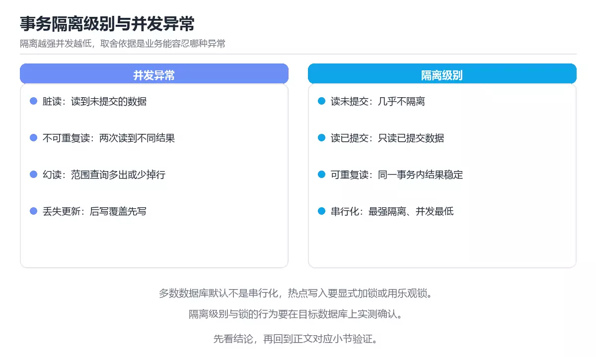

# 图解数据库事务隔离级别

> 内容更新时间：2026-10-06 · 学习阶段：进阶 · 预计用时：40 分钟


## 本节知识框架

**课程定位**：所属分类 `visual_guide`（图解专题），课程主题 `图解数据库事务隔离级别`，学习阶段 进阶，建议用时 45 分钟。

本课主线：脏读、不可重复读、幻读三现象，四种隔离级别与死锁成因。

**学完本课应当能够**
- 说清 `事务` 与 `隔离级别` 的含义与区别，并各举一个正例和一个反例。
- 用本课示例验证 `幻读` 的行为，记录输入、输出与失败条件。
- 遇到「认为隔离级别越高越好」这类问题时，能说出触发条件与修复顺序。

### 从概念到验证的学习链条

1. `事务`：先掌握 一组要么全部成功要么全部回滚的数据库操作，再用它解释 `隔离级别` 为什么会出现。
2. `隔离级别`：先掌握 隔离级别是一致性与并发度的取舍，不是越高越好，再用它解释 `幻读` 为什么会出现。
3. `幻读`：先掌握 同一事务两次范围查询之间，其他事务插入或删除记录，使第二次看到不同的行集合，再用它解释 `MVCC` 为什么会出现。
4. `MVCC`：先掌握 MVCC 通过版本链让读不阻塞写，但需要清理旧版本并处理长事务，再用它解释 `死锁` 为什么会出现。
5. `死锁`：先掌握 多个执行单元互相等待对方持有的资源，导致都无法继续，再用它解释 本课示例的观察结果 为什么会出现。

**先修与衔接**：本课是「图解专题」分类的第 13 课。先修内容：《图解 RAG 检索增强生成流程》。《图解 RAG 检索增强生成流程》里的 `RAG`、`分块` 是本课的前提。相关或后续课程：《图解消息队列投递语义》、《事务》、《MySQL 锁与 MVCC》。

### 完成判据

- **定义关**：不看正文也能说明 `事务` 是 一组要么全部成功要么全部回滚的数据库操作，并指出一个反例。
- **机制关**：能按“输入 → 转换 → 输出 → 验证”复述 `图解数据库事务隔离级别`，而不是只背结论。
- **示例关**：能运行或推演 `图解数据库事务隔离级别` 的 `text` 示例，并说明一个真实出现的标识符或字面量。
- **证据关**：能指出 `图解数据库事务隔离级别` 示例里的 调用了 `COUNT()`，并说明它支持或反驳了本课的哪一条结论。
- **排错关**：能复现 认为隔离级别越高越好，记录现象并按 按业务一致性要求选择级别 修复。
- **迁移关**：能把 `事务`、`隔离级别`、`幻读`、`MVCC` 放进一个与 `图解数据库事务隔离级别` 不同的项目场景，并保持输入与验证条件可追踪。
- **复盘关**：学完 `图解数据库事务隔离级别` 后，用一句话写下仍然不确定的结论，并列出下一次验证需要的输入、环境和成功判据。

### 复习清单

- [ ] 能不看正文复述本课核心术语，并指出一个边界或反例。
- [ ] 能运行或推演本课示例，记录输入、输出与失败现象。
- [ ] 能完成一次自测，并把错题对照错误表定位原因。

**本课配图**



## 核心概念定义

| 术语 | 操作性定义 | 常见边界与风险 |
| --- | --- | --- |
| 事务 | 一组要么全部成功要么全部回滚的数据库操作。 | 易错：旧版本堆积、锁等待；正确做法是缩短事务并监控持续时间。 |
| 隔离级别 | 隔离级别是一致性与并发度的取舍，不是越高越好。 | 易错：吞吐下降、重试增多；正确做法是按业务一致性要求选择级别。 |
| 幻读 | 同一事务两次范围查询之间，其他事务插入或删除记录，使第二次看到不同的行集合。 | 易错：出现脏读或幻读；正确做法是按一致性需求选择隔离级别并验证行为。 |
| MVCC | MVCC 通过版本链让读不阻塞写，但需要清理旧版本并处理长事务。 | 不同版本与依赖组合的行为可能不同，升级或换环境前要按官方变更说明重新验证。 |
| 死锁 | 多个执行单元互相等待对方持有的资源，导致都无法继续。 | 只在「多个执行单元互相等待对方持有的资源，导致都无法继续」这一前提下成立，换输入或换环境要重新验证。 |

## 原理与运行机制

### 机制总览

| 阶段 | 关注对象 | 失败时应检查 |
| --- | --- | --- |
| 输入 | 事务 | 类型、范围、编码、版本或前置状态是否满足定义。 |
| 处理 | 隔离级别 | 顺序、可见性、锁、路由、事务或调度规则是否被破坏。 |
| 输出 | 幻读 | 结果是否可复现，错误是否被正确传播而不是被吞掉。 |

**教材衔接：一句话说清**

隔离级别就是在「并发正确性」与「性能」之间选一个档位。
三个经典现象（脏读、不可重复读、幻读）几乎都由它决定。

**教材衔接：实现机制：锁与快照**

```text
① 行锁（写写冲突）
   事务 A 更新某行 → 持有排他锁
   事务 B 想更新同一行 → 等待

② 间隙锁（防幻读，MySQL InnoDB）
   在索引记录的间隙上加锁，阻止其他事务插入新行

③ MVCC 多版本并发控制（读不加锁）
   每行保留多个版本，事务按自己的快照读取

   行版本：   v1(已提交)   v2(已提交)   v3(未提交)
   事务 T1 的快照 ──► 读 v2
   事务 T2 的快照 ──► 读 v3（仅自己可见）
```

| 机制 | 作用 | 代价 |
| --- | --- | --- |
| 行锁 | 阻止写写冲突 | 可能死锁 |
| 间隙锁 | 阻止范围插入（防幻读） | 锁范围更大 |
| MVCC | 读不加锁，提高并发 | 需要清理旧版本 |

### 机制拆解：每一步的输入、动作与输出

#### 1. `事务`
- 输入：`事务`；本步把 一组要么全部成功要么全部回滚的数据库操作 当作判断规则。
- 动作：围绕 `事务` 保留中间状态，并记录它与 `隔离级别` 的对应关系。
- 输出：`隔离级别`，它可以被下一段代码、测试或记录继续使用。
- `事务` 的失败条件：当忽略长事务时，会出现旧版本堆积、锁等待。

#### 2. `隔离级别`
- 输入：`事务`；本步把 隔离级别是一致性与并发度的取舍，不是越高越好 当作判断规则。
- 动作：围绕 `隔离级别` 保留中间状态，并记录它与 `幻读` 的对应关系。
- 输出：`幻读`，它可以被下一段代码、测试或记录继续使用。
- `隔离级别` 的失败条件：当认为隔离级别越高越好时，会出现吞吐下降、重试增多。

#### 3. `幻读`
- 输入：`隔离级别`；本步把 同一事务两次范围查询之间，其他事务插入或删除记录，使第二次看到不同的行集合 当作判断规则。
- 动作：围绕 `幻读` 保留中间状态，并记录它与 `MVCC` 的对应关系。
- 输出：`MVCC`，它可以被下一段代码、测试或记录继续使用。
- `幻读` 的失败条件：当隔离级别与业务需求不匹配时，会出现出现脏读或幻读。

#### 4. `MVCC`
- 输入：`幻读`；本步把 MVCC 通过版本链让读不阻塞写，但需要清理旧版本并处理长事务 当作判断规则。
- 动作：围绕 `MVCC` 保留中间状态，并记录它与 `死锁` 的对应关系。
- 输出：`死锁`，它可以被下一段代码、测试或记录继续使用。
- `MVCC` 的失败条件：不同版本与依赖组合的行为可能不同，升级或换环境前要按官方变更说明重新验证。

#### 5. `死锁`
- 输入：`MVCC`；本步把 多个执行单元互相等待对方持有的资源，导致都无法继续 当作判断规则。
- 动作：围绕 `死锁` 保留中间状态，并记录它与 `COUNT` 的对应关系。
- 输出：`COUNT`，它可以被下一段代码、测试或记录继续使用。
- `死锁` 的失败条件：只在「多个执行单元互相等待对方持有的资源，导致都无法继续」这一前提下成立，换输入或换环境要重新验证。

### 示例中的可观察事实

1. 调用了 `COUNT()`；它对应的课程主题是 `图解数据库事务隔离级别`。
2. 出现字面量 `待处理`；它对应的课程主题是 `图解数据库事务隔离级别`。

### 复现实验记录

- 环境：`图解数据库事务隔离级别` 使用 `text` 示例，固定 `事务`、`隔离级别`、`幻读`、`MVCC` 作为第一组条件。
- 首轮输入：先确认 调用了 `COUNT()`，预测 `事务` 会怎样变化。
- 基线观察：记录命令、输入、输出和错误原文，不用截图代替可复制的文本。
- 单变量修改：只改变 `事务`，观察 `死锁` 是否仍满足定义。
- 失败注入：复现 认为隔离级别越高越好，确认现象是 吞吐下降、重试增多。
- 记录结论：把“修改前、修改后、预期变化、实际变化”写成四列表，这样复盘 `图解数据库事务隔离级别` 时才能区分概念错误与实现错误。

## 典型应用场景

- **认为隔离级别越高越好**：典型现象是吞吐下降、重试增多；正确做法是按业务一致性要求选择级别。
- **忽略长事务**：典型现象是旧版本堆积、锁等待；正确做法是缩短事务并监控持续时间。
- **不做重试处理**：典型现象是串行化冲突直接失败；正确做法是捕获冲突错误并幂等重试。
- **把快照读当当前读**：典型现象是写回旧数据；正确做法是写操作使用锁或版本比较。

### 最小验证场景

- 准备：保留 `text` 示例的原始输入，先记录 `图解数据库事务隔离级别` 的基线输出和完整运行命令。
- 观察：先核对 调用了 `COUNT()`，再改变一个与 `事务` 相关的条件。
- 判定：新结果与 `图解数据库事务隔离级别` 的基线不同不等于错误；只有当差异破坏了 `事务` 的定义或错误表中的约束，才判定为失败。

### 选择与边界

- 使用 `事务` 时，先满足它的定义：一组要么全部成功要么全部回滚的数据库操作；易错：旧版本堆积、锁等待；正确做法是缩短事务并监控持续时间。
- 使用 `隔离级别` 时，先满足它的定义：隔离级别是一致性与并发度的取舍，不是越高越好；易错：吞吐下降、重试增多；正确做法是按业务一致性要求选择级别。
- 使用 `幻读` 时，先满足它的定义：同一事务两次范围查询之间，其他事务插入或删除记录，使第二次看到不同的行集合；易错：出现脏读或幻读；正确做法是按一致性需求选择隔离级别并验证行为。
- 使用 `MVCC` 时，先满足它的定义：MVCC 通过版本链让读不阻塞写，但需要清理旧版本并处理长事务；不同版本与依赖组合的行为可能不同，升级或换环境前要按官方变更说明重新验证。
- 使用 `死锁` 时，先满足它的定义：多个执行单元互相等待对方持有的资源，导致都无法继续；只在「多个执行单元互相等待对方持有的资源，导致都无法继续」这一前提下成立，换输入或换环境要重新验证。

## 代码/协议/SQL 示例

**教材衔接：各数据库的默认与差异**

| 数据库 | 默认隔离级别 | 说明 |
| --- | --- | --- |
| MySQL InnoDB | 可重复读 | 通过间隙锁基本避免幻读 |
| PostgreSQL | 读已提交 | 可显式提升到可重复读或串行化 |
| Oracle | 读已提交 | 通过 MVCC 提供语句级一致性 |
| SQL Server | 读已提交 | 支持快照隔离选项 |

```sql
-- 查看与设置（MySQL）
SELECT @@transaction_isolation;
SET SESSION TRANSACTION ISOLATION LEVEL READ COMMITTED;

-- PostgreSQL
SHOW default_transaction_isolation;
BEGIN TRANSACTION ISOLATION LEVEL REPEATABLE READ;
```

**教材衔接：死锁是怎么形成的**

```text
事务 A                          事务 B
持有行 1 的锁                    持有行 2 的锁
请求行 2 的锁 ──► 等待            请求行 1 的锁 ──► 等待
        ▲                                │
        └────────── 循环等待 ────────────┘

数据库检测到环 → 回滚其中一个事务（通常是代价小的那个）
```

```text
避免死锁的三条经验
  · 所有事务按相同顺序访问资源
  · 事务尽量短小，减少持锁时间
  · 给关键操作加唯一约束，用「插入冲突」代替「先查后插」
```

**教材衔接：隔离级别的选择建议**

| 场景 | 建议 |
| --- | --- |
| 普通业务读写 | 读已提交（多数数据库默认） |
| 需要同一事务内多次读一致 | 可重复读 |
| 金融转账、库存扣减 | 可重复读加行锁，或串行化 |
| 报表统计（可容忍偏差） | 读已提交 |
| 计数与对账 | 唯一约束加乐观锁 |

```sql
-- 乐观锁：用版本号避免覆盖
UPDATE orders
   SET status = 'paid', version = version + 1
 WHERE id = 1001 AND version = 7;
-- 受影响行数为 0 说明期间被别人改过，需要重试
```

**教材衔接：深入补充：图解数据库事务隔离级别**

前面已经建立了基本概念。这一节换一个角度，把图解数据库事务隔离级别放进真实工程里，
重点回答三件事：default_transaction_isolation 解决什么问题、依赖哪些前提、在什么条件下失效。

### 一、核心模型

事务隔离级别定义并发事务之间能看到什么：读未提交、读已提交、可重复读和串行化逐级增强一致性，同时增加锁等待和重试成本。

```text
事务开始 → 读取/写入 → 加锁或创建版本 → 并发事务提交 → 可见性判断 → 提交或回滚
```

### 二、关键机制拆解

1. 脏读是读到了未提交数据；读已提交保证只能看到已提交版本。
2. 不可重复读是同一行在两次读取之间发生变化；幻读是同一范围查询出现了新行。
3. 可重复读通常通过快照或范围锁实现，但不同数据库对幻读的处理不同。
4. 串行化提供最强隔离，可通过串行执行、严格锁或冲突检测实现。
5. MVCC 通过版本链让读不阻塞写，但需要清理旧版本并处理长事务。
6. 隔离级别越高，并发冲突和重试越多，必须在正确性和吞吐之间选择。
7. 应用层要处理死锁、锁等待超时和串行化失败，不能假设事务永远一次成功。

### 三、对照表：抓住容易混淆的边界

| 维度 | 一侧 | 另一侧 |
| --- | --- | --- |
| 读未提交 | 可能读到未提交数据 | 一致性最弱，性能最高 |
| 读已提交 | 只读已提交版本 | 常见默认级别 |
| 可重复读 | 同一事务内快照稳定 | 可能仍有范围幻读或写冲突 |
| 串行化 | 等价于串行执行 | 最强但冲突和重试最多 |

### 四、工作示例

银行转账在可重复读下，事务 A 读取余额后事务 B 修改并提交；A 再次读取仍看到旧快照。若 A 基于旧值写回，就可能覆盖 B；因此写操作仍需行锁或乐观版本检查。

### 五、常见误区与失效边界

| 错误做法或假设 | 后果 | 正确做法 |
| --- | --- | --- |
| 认为隔离级别越高越好 | 吞吐下降、重试增多 | 按业务一致性要求选择级别 |
| 忽略长事务 | 旧版本堆积、锁等待 | 缩短事务并监控持续时间 |
| 不做重试处理 | 串行化冲突直接失败 | 捕获冲突错误并幂等重试 |
| 把快照读当当前读 | 写回旧数据 | 写操作使用锁或版本比较 |

### 六、场景推演

库存扣减偶发超卖。排查发现事务先读库存再写回，隔离级别只保证读一致性，不保证读后写不被覆盖。改用条件更新 `UPDATE stock SET n=n-1 WHERE n>0` 或加行锁后问题消失。

### 七、自测问答

**Q1：脏读和不可重复读有什么区别？**

脏读看到未提交数据，不可重复读看到已提交数据在两次读取间变化。

**Q2：MVCC 的优点是什么？**

读写通常不互相阻塞，提高并发能力。

**Q3：串行化隔离为什么需要重试？**

冲突检测会让部分事务失败，需要重新执行。

**Q4：快照读为什么不能直接用于扣库存？**

它看到的是旧版本，写回可能覆盖其他事务的更新。

### 八、小项目：把知识变成可检查的产出

用两个并发的 SQL 会话演示脏读、不可重复读、幻读和写覆盖；分别切换到四种隔离级别，记录可见结果、锁等待和冲突错误，并写出业务选型结论。

### 九、适用边界

隔离级别只定义事务可见性，不自动保证业务幂等、防止超卖或处理分布式事务。跨服务一致性仍需要幂等、补偿和对账。

### 十、完成检查清单

- [ ] 能解释四种隔离级别的差异
- [ ] 能识别脏读、不可重复读和幻读
- [ ] 能说明 MVCC 与锁的关系
- [ ] 能为扣库存选择正确写策略
- [ ] 能处理死锁和重试

### 十一、复习顺序

1. 不看资料讲清「图解数据库事务隔离级别」的核心模型，并各举一个正例和反例。
2. 再对照表逐行解释容易混淆的概念，每个概念补一个反例。
3. 跟着工作示例做一遍，改变一个条件并预测结果。
4. 用自测问答检查理解，错题回到对应小节重新阅读。
5. 把 隔离级别 的实现、测试与复盘整理成一份可提交的产物。

> 复习不是重读一遍，而是离开原文重新产出：复述、改写、验证、复盘。

### 示例精读：先找证据，再改一个条件

1. 调用了 `COUNT()`；它出现在 `图解数据库事务隔离级别` 的示例中，阅读时先确认它前后各发生了什么。
2. 出现字面量 `待处理`；它出现在 `图解数据库事务隔离级别` 的示例中，阅读时先确认它前后各发生了什么。
- 在 `图解数据库事务隔离级别` 中与 `事务` 对照：示例必须能支持 一组要么全部成功要么全部回滚的数据库操作，否则说明这一段还缺少实现或验证步骤。
- 在 `图解数据库事务隔离级别` 中与 `隔离级别` 对照：示例必须能支持 隔离级别是一致性与并发度的取舍，不是越高越好，否则说明这一段还缺少实现或验证步骤。
- 在 `图解数据库事务隔离级别` 中与 `幻读` 对照：示例必须能支持 同一事务两次范围查询之间，其他事务插入或删除记录，使第二次看到不同的行集合，否则说明这一段还缺少实现或验证步骤。
- 在 `图解数据库事务隔离级别` 中与 `MVCC` 对照：示例必须能支持 MVCC 通过版本链让读不阻塞写，但需要清理旧版本并处理长事务，否则说明这一段还缺少实现或验证步骤。

## 时间/空间复杂度或性能分析

**性能关注点（图解数据库事务隔离级别）**：图解类课程的性能点在渲染与交互响应：记录首屏时间与交互延迟。

**本课特有开销（图解数据库事务隔离级别 · 事务）**：长事务会放大锁等待，记录事务持续时间与锁冲突次数。

**测量方法**：以 `图解数据库事务隔离级别` 的 `事务` 场景为对象，固定输入跑一遍记录基线，再把规模或并发度提高一个数量级复测；两次结果的差值与波动范围才是结论依据。

### 需要控制的变量与记录项

- `图解数据库事务隔离级别` 的 `事务`：固定它的版本、输入范围和资源上限，分别记录速度、内存与失败率的变化。
- `图解数据库事务隔离级别` 的 `隔离级别`：固定它的版本、输入范围和资源上限，分别记录速度、内存与失败率的变化。
- `图解数据库事务隔离级别` 的 `幻读`：固定它的版本、输入范围和资源上限，分别记录速度、内存与失败率的变化。
- `图解数据库事务隔离级别` 的 `MVCC`：固定它的版本、输入范围和资源上限，分别记录速度、内存与失败率的变化。
- `图解数据库事务隔离级别` 的 `死锁`：固定它的版本、输入范围和资源上限，分别记录速度、内存与失败率的变化。
- `图解数据库事务隔离级别` 中 `事务` 的边界：易错：旧版本堆积、锁等待；正确做法是缩短事务并监控持续时间。达到边界时不要外推，必须重新测量。
- `图解数据库事务隔离级别` 中 `隔离级别` 的边界：易错：吞吐下降、重试增多；正确做法是按业务一致性要求选择级别。达到边界时不要外推，必须重新测量。
- `图解数据库事务隔离级别` 中 `幻读` 的边界：易错：出现脏读或幻读；正确做法是按一致性需求选择隔离级别并验证行为。达到边界时不要外推，必须重新测量。
- `图解数据库事务隔离级别` 中 `MVCC` 的边界：不同版本与依赖组合的行为可能不同，升级或换环境前要按官方变更说明重新验证。达到边界时不要外推，必须重新测量。
- `图解数据库事务隔离级别` 中 `死锁` 的边界：只在「多个执行单元互相等待对方持有的资源，导致都无法继续」这一前提下成立，换输入或换环境要重新验证。达到边界时不要外推，必须重新测量。
- `图解数据库事务隔离级别` 的代码证据：先验证 调用了 `COUNT()`，再记录该路径的输入规模与耗时；只看代码行数不能推出复杂度。

## 常见误区与易错点

| 容易写错的做法 | 实际现象 | 原因与正确做法 |
| --- | --- | --- |
| 认为隔离级别越高越好 | 吞吐下降、重试增多 | 按业务一致性要求选择级别 |
| 忽略长事务 | 旧版本堆积、锁等待 | 缩短事务并监控持续时间 |
| 不做重试处理 | 串行化冲突直接失败 | 捕获冲突错误并幂等重试 |
| 把快照读当当前读 | 写回旧数据 | 写操作使用锁或版本比较 |
| 隔离级别与业务需求不匹配 | 出现脏读或幻读。 | 按一致性需求选择隔离级别并验证行为。 |
| 长事务不收敛 | 锁等待与版本堆积。 | 缩短事务范围并监控等待时间。 |
| 以为默认级别没有问题 | 忽略不可重复读等现象。 | 明确默认级别的异常并在测试中覆盖。 |

### 现场 1：认为隔离级别越高越好

**症状**：吞吐下降、重试增多。

**根因与修复**：按业务一致性要求选择级别。

**自检**：在本课示例里复现「认为隔离级别越高越好」，改成按业务一致性要求选择级别后重跑；如果症状消失且失败路径按预期变化，说明定位正确。

### 现场 2：忽略长事务

**症状**：旧版本堆积、锁等待。

**根因与修复**：缩短事务并监控持续时间。

**自检**：在本课示例里复现「忽略长事务」，改成缩短事务并监控持续时间后重跑；如果症状消失且失败路径按预期变化，说明定位正确。

### 现场 3：不做重试处理

**症状**：串行化冲突直接失败。

**根因与修复**：捕获冲突错误并幂等重试。

**自检**：在本课示例里复现「不做重试处理」，改成捕获冲突错误并幂等重试后重跑；如果症状消失且失败路径按预期变化，说明定位正确。

### 现场 4：把快照读当当前读

**症状**：写回旧数据。

**根因与修复**：写操作使用锁或版本比较。

**自检**：在本课示例里复现「把快照读当当前读」，改成写操作使用锁或版本比较后重跑；如果症状消失且失败路径按预期变化，说明定位正确。

### 现场 5：隔离级别与业务需求不匹配

**症状**：出现脏读或幻读。

**根因与修复**：按一致性需求选择隔离级别并验证行为。

**自检**：在本课示例里复现「隔离级别与业务需求不匹配」，改成按一致性需求选择隔离级别并验证行为后重跑；如果症状消失且失败路径按预期变化，说明定位正确。

### 现场 6：长事务不收敛

**症状**：锁等待与版本堆积。

**根因与修复**：缩短事务范围并监控等待时间。

**自检**：在本课示例里复现「长事务不收敛」，改成缩短事务范围并监控等待时间后重跑；如果症状消失且失败路径按预期变化，说明定位正确。

### 现场 7：以为默认级别没有问题

**症状**：忽略不可重复读等现象。

**根因与修复**：明确默认级别的异常并在测试中覆盖。

**自检**：在本课示例里复现「以为默认级别没有问题」，改成明确默认级别的异常并在测试中覆盖后重跑；如果症状消失且失败路径按预期变化，说明定位正确。

## 与其他知识点的关系

**教材衔接：四种隔离级别对照**

| 级别 | 脏读 | 不可重复读 | 幻读 | 典型实现 |
| --- | --- | --- | --- | --- |
| 读未提交 Read Uncommitted | 可能 | 可能 | 可能 | 几乎不用 |
| 读已提交 Read Committed | 不会 | 可能 | 可能 | PostgreSQL 默认、Oracle 默认 |
| 可重复读 Repeatable Read | 不会 | 不会 | 可能（MySQL 基本避免） | MySQL InnoDB 默认 |
| 串行化 Serializable | 不会 | 不会 | 不会 | 加锁或串行执行，性能最低 |

```text
隔离级别越高 → 一致性越强 → 并发度越低

  读未提交 ──► 读已提交 ──► 可重复读 ──► 串行化
   最快                                    最安全
```

**教材衔接：复习与迁移**

### 概念复述

- 用一句话说明「图解数据库事务隔离级别」解决什么问题：脏读、不可重复读、幻读三现象，四种隔离级别与死锁成因。
- 写出事务、隔离级别、幻读之间的关系，并各举一个例子。
- 说出本课最容易混淆的两个概念，以及区分它们的判据。

### 正文逐节复核

- **一句话说清**：隔离级别就是在「并发正确性」与「性能」之间选一个档位。
- **深入补充：图解数据库事务隔离级别**：前面已经建立了基本概念。这一节换一个角度，把图解数据库事务隔离级别放进真实工程里。


### 迁移练习

把「图解数据库事务隔离级别」的结论迁移到相邻主题，每次迁移都写清预测与证据：

- **先修**：`图解 RAG 检索增强生成流程`。本课默认这些内容已经掌握。
- **相关或后续**：`图解消息队列投递语义`、`事务`、`MySQL 锁与 MVCC`。本课术语会在这些课程里继续使用。
- **术语归属**：`事务`、`隔离级别`、`幻读` 的定义以本课「核心概念定义」为准，换到其他课程时先确认定义是否被改写。

### 先修与后续术语接口

- `事务`：共享术语 `事务`、`隔离级别`，共同关键词 `事务`、`隔离级别`、`幻读`。
- `MySQL 锁与 MVCC`：共同关键词 `MVCC`、`死锁`。
- `图解 RAG 检索增强生成流程`：两者通过本分类的学习顺序衔接，阅读时重点比较各自的输入与失败条件。
- `图解消息队列投递语义`：两者通过本分类的学习顺序衔接，阅读时重点比较各自的输入与失败条件。

### 容易混淆的相邻概念

- `事务` 与 `隔离级别`：前者强调 一组要么全部成功要么全部回滚的数据库操作；后者强调 隔离级别是一致性与并发度的取舍，不是越高越好。判断时分别检查两条定义的适用范围，不要只看名称相似就互换。
- `隔离级别` 与 `幻读`：前者强调 隔离级别是一致性与并发度的取舍，不是越高越好；后者强调 同一事务两次范围查询之间，其他事务插入或删除记录，使第二次看到不同的行集合。判断时分别检查两条定义的适用范围，不要只看名称相似就互换。
- `幻读` 与 `MVCC`：前者强调 同一事务两次范围查询之间，其他事务插入或删除记录，使第二次看到不同的行集合；后者强调 MVCC 通过版本链让读不阻塞写，但需要清理旧版本并处理长事务。判断时分别检查两条定义的适用范围，不要只看名称相似就互换。
- `MVCC` 与 `死锁`：前者强调 MVCC 通过版本链让读不阻塞写，但需要清理旧版本并处理长事务；后者强调 多个执行单元互相等待对方持有的资源，导致都无法继续。判断时分别检查两条定义的适用范围，不要只看名称相似就互换。

## 自测题与参考答案

> 先独立作答，再对照参考答案；答案都能在本课正文、术语表或错误表里找到依据。

### 自测 1（概念复述）

不看正文，写出 `事务` 的操作性定义，并说明它与 `隔离级别` 的区别。

**参考答案**：一组要么全部成功要么全部回滚的数据库操作。

`隔离级别` 的定位是：隔离级别是一致性与并发度的取舍，不是越高越好；两者的差别要从适用对象与失败模式上说明。

### 自测 2（排错）

本课错误表记录了「认为隔离级别越高越好」这类做法。请写出它会出现的现象、根因，以及修复顺序。

**参考答案**：现象是吞吐下降、重试增多；正确做法是按业务一致性要求选择级别。修复时先复现现象并保留证据，再改动一处假设重跑，确认现象消失。

### 自测 3（动手验证）

运行本课的 `text` 示例，把其中的 `'待处理'` 换成一个边界值后重新运行，记录输出与错误信息。

**参考答案**：正常输入下 `text` 示例应当复现正文给出的结果；把 `'待处理'` 换成边界值后，如果结果改变或报错，先核对它是否满足 `图解数据库事务隔离级别` 中`事务` 的适用范围，再检查错误表里是否有同类现象。

### 自测 4（代码阅读）

阅读本课开头的 `text` 示例，说明它体现了`事务` 的哪一条性质，并指出改动哪个输入会让这条性质不再成立。

**参考答案**：`事务` 的定义是 一组要么全部成功要么全部回滚的数据库操作，示例正是在实现这条定义。改动与 `事务` 有关的一个输入后，如果结果不再符合 `图解数据库事务隔离级别` 的正文描述，就说明该性质只在当前前提成立。

### 自测 5（迁移）

把 `图解数据库事务隔离级别` 的方法迁移到自己的项目：围绕 `事务` 写出一个与错误表同类的风险点，并说明触发条件和检验方式。

**参考答案**：例如「以为默认级别没有问题」，它会导致忽略不可重复读等现象；检验方式是按明确默认级别的异常并在测试中覆盖改一处再复现，确认现象消失且没有引入新的失败分支。

### 自测 6（对比）

用一个表格对比 `事务` 与 `隔离级别`：各写一行适用场景、一行失败表现。

**参考答案**：`事务` 的定义是一组要么全部成功要么全部回滚的数据库操作；`隔离级别` 的定义是隔离级别是一致性与并发度的取舍，不是越高越好。两者的失败表现分别对应本课错误表里与本术语相关的行。

### 自测 7（排错顺序）

面对「认为隔离级别越高越好」引发的问题，请把“复现 吞吐下降、重试增多 → 保留证据 → 按业务一致性要求选择级别 → 回归验证”四步写成可执行的检查清单。

**参考答案**：第一步按吞吐下降、重试增多复现；第二步记录输入、版本与完整报错；第三步按按业务一致性要求选择级别只改一处；第四步重跑并确认失败路径也按预期变化。

### 自测 8（边界判断）

针对 `死锁`，分别写出“可以使用”的条件和“结论不再成立”的条件。

**参考答案**：只在「多个执行单元互相等待对方持有的资源，导致都无法继续」这一前提下成立，换输入或换环境要重新验证。 同时要把 `死锁` 的定义 多个执行单元互相等待对方持有的资源，导致都无法继续 与实际输入逐项对照。

### 自测 9（机制重建）

不看正文，按输入、转换、输出、验证四段重建 `事务` → `隔离级别` → `幻读` → `MVCC` 的作用链。

**参考答案**：起点是 `事务` 的定义 一组要么全部成功要么全部回滚的数据库操作；中间每一步都保留可观察状态；终点由 `死锁` 检查，失败时回到错误表定位第一个偏离定义的步骤。

### 自测 10（综合排错）

在 `图解数据库事务隔离级别` 中，现象是 忽略不可重复读等现象。请围绕 以为默认级别没有问题 写出最小复现、关键证据、修复动作和回归验证，并说明为什么不能只凭一次运行下结论。

**参考答案**：先复现 以为默认级别没有问题，记录输入与完整错误；再按 明确默认级别的异常并在测试中覆盖 只改一处。回归时同时跑正常路径和边界路径，只有两次结果都可解释，才把修复视为完成。

### 自测 11（一分钟复述）

用每分钟约 200 字的速度复述 `图解数据库事务隔离级别`：先给主问题，再按顺序说出 `事务`、`隔离级别`、`幻读`、`MVCC`，最后给一个失败案例。

**自评标准**：主问题必须对应 脏读、不可重复读、幻读三现象，四种隔离级别与死锁成因；每个术语都要能接上一句定义或边界；失败案例必须写成可观察现象，不能用“可能有风险”代替证据。

## 术语速查

| 术语 | 一句话说明 |
| --- | --- |
| `事务` | 一组要么全部成功要么全部回滚的数据库操作。 |
| `隔离级别` | 隔离级别是一致性与并发度的取舍，不是越高越好。 |
| `幻读` | 同一事务两次范围查询之间，其他事务插入或删除记录，使第二次看到不同的行集合。 |
| `MVCC` | MVCC 通过版本链让读不阻塞写，但需要清理旧版本并处理长事务。 |
| `死锁` | 多个执行单元互相等待对方持有的资源，导致都无法继续。 |

**术语关系**：`事务`（一组要么全部成功要么全部回滚的数据库操作） → `隔离级别`（隔离级别是一致性与并发度的取舍） → `幻读`（同一事务两次范围查询之间） → `MVCC`（MVCC 通过版本链让读不阻塞写）。

## 考点精讲

`图解数据库事务隔离级别` 的题库有 5 道题，下面逐题给出题干、正确项与判断依据：先自己作答，再核对正确项，最后回到正文对应小节复核。

### 考点 1：第 1 题

- **题目**：围绕“图解数据库事务隔离级别”中的 事务、隔离级别、幻读，下列哪两项是本课强调的实践判断？
- **正确项**：验证 隔离级别 时要固定版本并覆盖边界输入，结论才可复现；学习 事务 时要同时说明输入、输出和失败路径，不能只看正常流程
- **判断依据**：这道题落在术语 `事务` 上：一组要么全部成功要么全部回滚的数据库操作。复习时把 `事务` 的定义、适用边界和一个反例一起说清楚，再回到「核心概念定义」核对原文。

### 考点 2：第 2 题

- **题目**：下面这段 `sql` 代码来自 `图解数据库事务隔离级别`。课程主线是脏读、不可重复读、幻读三现象，四种隔离级别与死锁成因。代码与 `事务` 有关。哪一项是代码里真实出现的内容？
- **正确项**：调用了 `COUNT()`
- **判断依据**：这道题落在术语 `事务` 上：一组要么全部成功要么全部回滚的数据库操作。复习时把 `事务` 的定义、适用边界和一个反例一起说清楚，再回到「核心概念定义」核对原文。

### 考点 3：第 3 题

- **题目**：MVCC 的核心好处是？
- **正确项**：读操作不加锁
- **判断依据**：这道题落在术语 `MVCC` 上：MVCC 通过版本链让读不阻塞写，但需要清理旧版本并处理长事务。复习时把 `MVCC` 的定义、适用边界和一个反例一起说清楚，再回到「核心概念定义」核对原文。

### 考点 4：第 4 题

- **题目**：在并发场景下防止「重复插入」，最可靠的做法是？
- **正确项**：使用唯一约束，让数据库拒绝重复
- **判断依据**：这道题检验本课主问题：脏读、不可重复读、幻读三现象，四种隔离级别与死锁成因。复习时先复述本课主问题，再举一个会让结论失效的输入。

### 考点 5：第 5 题

- **题目**：填空：补齐下面这段术语说明中的空缺。课程 `脏读、不可重复读、幻读三现象，四种隔离级别与死锁成因。`，这段说明是：`____` 通过版本链让读不阻塞写，但需要清理旧版本并处理长事务。空缺处应填哪个术语？
- **正确项**：MVCC
- **判断依据**：这道题落在术语 `事务` 上：一组要么全部成功要么全部回滚的数据库操作。复习时把 `事务` 的定义、适用边界和一个反例一起说清楚，再回到「核心概念定义」核对原文。

### 考点 6：`事务`

- **要点**：一组要么全部成功要么全部回滚的数据库操作。
- **事务 的边界**：易错：旧版本堆积、锁等待；正确做法是缩短事务并监控持续时间。

### 考点 7：`隔离级别`

- **要点**：隔离级别是一致性与并发度的取舍，不是越高越好。
- **隔离级别 的边界**：易错：吞吐下降、重试增多；正确做法是按业务一致性要求选择级别。

### 考点 8：`幻读`

- **要点**：同一事务两次范围查询之间，其他事务插入或删除记录，使第二次看到不同的行集合。
- **幻读 的边界**：易错：出现脏读或幻读；正确做法是按一致性需求选择隔离级别并验证行为。

### 考点 9：`MVCC`

- **要点**：MVCC 通过版本链让读不阻塞写，但需要清理旧版本并处理长事务。
- **MVCC 的边界**：不同版本与依赖组合的行为可能不同，升级或换环境前要按官方变更说明重新验证。

### 考点 10：`死锁`

- **要点**：多个执行单元互相等待对方持有的资源，导致都无法继续。
- **死锁 的边界**：只在「多个执行单元互相等待对方持有的资源，导致都无法继续」这一前提下成立，换输入或换环境要重新验证。

### 考点 11：排错——认为隔离级别越高越好

- **现象**：吞吐下降、重试增多。
- **处理**：按业务一致性要求选择级别。

### 考点 12：排错——忽略长事务

- **现象**：旧版本堆积、锁等待。
- **处理**：缩短事务并监控持续时间。

### 考点 13：综合辨析——`事务` 与 `死锁`

- **辨析点**：`事务` 的定义是 一组要么全部成功要么全部回滚的数据库操作；`死锁` 的定义是 多个执行单元互相等待对方持有的资源，导致都无法继续。
- **答题要求**：面对 `图解数据库事务隔离级别` 的题目，先判断描述的是 `事务` 还是 `死锁`，再归到对应定义，最后写出一个会让该定义失效的边界输入。

### 考点 14：排错评分点

- **现象分**：能写出 吞吐下降、重试增多，而不是只写“程序有错”。
- **证据分**：保留触发 认为隔离级别越高越好 的输入、版本和错误原文。
- **修复分**：按 按业务一致性要求选择级别 只改一处，并同时回归正常路径与边界路径。

## 内容元数据

- 内容版本：v2.0
- 最后更新：2026-10-06
- 学习阶段：进阶
- 适用环境：通用图解与系统原理；本课聚焦 事务。
- 内容来源：内置结构化课程与工程实践整理
- 相关主题：事务、隔离级别、幻读、MVCC、死锁
- 质量版本：P0 测验标准 + P1 覆盖扩展 + P2 体验补全

## 参考资料与复核

- 最后复核：2026-10-04
- 下次复核：2027-07-10
- 复核范围：版本兼容、API 行为、安全建议与工程实践
- 来源性质：官方文档、标准或权威教材；本课核对关键词：事务、隔离级别、幻读、MVCC、死锁。

| 参考资料 | 本课用途 |
| --- | --- |
| [Kubernetes 架构](https://kubernetes.io/docs/concepts/architecture/) | 控制平面与节点流程 |
| [MDN 浏览器工作原理](https://developer.mozilla.org/docs/Web/Performance/How_browsers_work) | 从请求到渲染的流程 |
| [Mermaid 文档](https://mermaid.js.org/intro/) | 流程图、时序图与状态图 |

| [本课术语索引：图解数据库事务隔离级别](#核心概念定义) | 按本课输入、术语边界和错误表现逐项核对 |
> 「图解数据库事务隔离级别」的链接用于离线阅读后的延伸核对；App 不会自动联网。