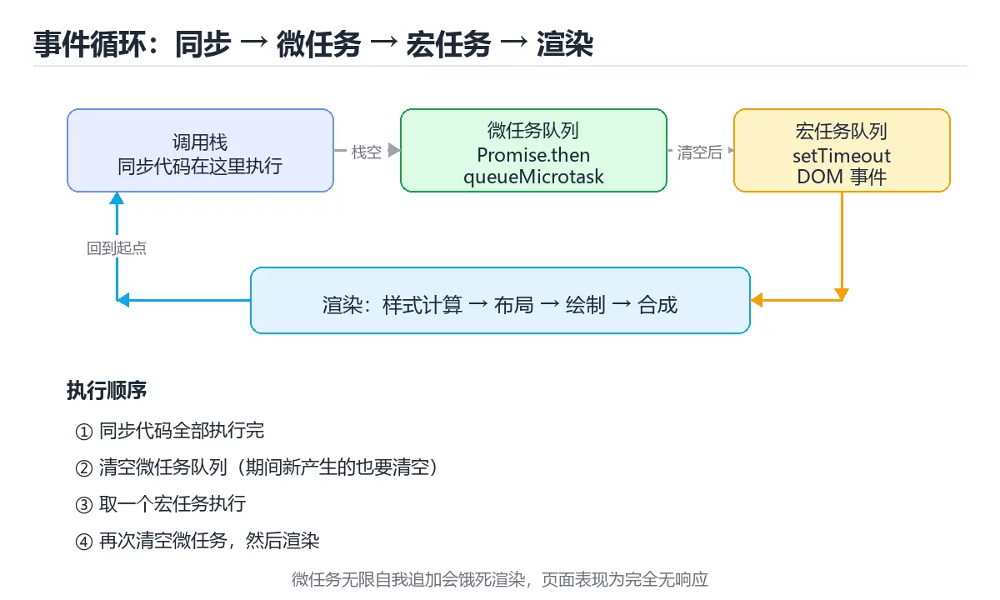

# 图解事件循环：同步、微任务与宏任务

> 内容更新时间：2026-10-03

## 学习目标

- 能用自己的话解释图解事件循环：同步、微任务与宏任务解决了什么问题，而不是只背术语。
- 能说清 「事件循环」、「微任务」、「宏任务」、「Promise」 之间的关系，并分别举出一个例子。
- 能把本课知识放回「图解专题」的知识体系，说明它和相邻主题的边界。
- 能完成本课练习，并用验收标准检查自己的结果。

> 一句话摘要：用时间线讲清执行顺序、渲染时机与长任务卡顿的原因。

## 前置知识

- 先完成上一课《图解调用栈与递归》；如果已经掌握，可以直接用本课练习自测。
- 本课阶段：进阶。建议先掌握同一分类的基础课程，并能独立运行正文中的最小示例。
- 开始前先复习：事件循环、微任务、宏任务。
- 如果某一步看不懂，先记录具体卡点，完成练习后再回头读一遍。



## 一句话说清

JavaScript 只有一条主线程：**同步代码先跑完，再清空微任务队列，然后取一个宏任务**，
如此循环。看懂这条流水线，所有「为什么输出顺序和我写的不一样」都能解释。

## 一张图看懂事件循环

```text
        ┌───────────────────────────┐
        │      调用栈 Call Stack     │  同步代码在这里执行
        └─────────────┬─────────────┘
                      │ 栈空
                      ▼
        ┌───────────────────────────┐
        │   微任务队列 Microtasks    │  Promise.then、queueMicrotask
        │   全部清空，一个不留        │  MutationObserver
        └─────────────┬─────────────┘
                      │ 清空后
                      ▼
        ┌───────────────────────────┐
        │   宏任务队列 Macrotasks    │  setTimeout、setInterval
        │   只取一个，执行完再回头看 │  I/O、UI 事件
        └─────────────┬─────────────┘
                      │
                      └──────► 回到微任务检查（循环）
```

## 一段代码验证顺序

```javascript
console.log("1 同步");

setTimeout(() => console.log("5 宏任务"), 0);

Promise.resolve()
  .then(() => console.log("3 微任务"))
  .then(() => console.log("4 微任务链"));

console.log("2 同步");

// 输出：1 同步 → 2 同步 → 3 微任务 → 4 微任务链 → 5 宏任务
```

```text
时间线
  t0  ┌─ 同步：打印 1
      ├─ 注册 setTimeout 回调 → 放进宏任务队列
      ├─ 注册 Promise.then → 放进微任务队列
      ├─ 同步：打印 2
      │   同步结束，栈空
  t1  ├─ 清空微任务：打印 3
      ├─ 微任务里又注册了 then → 继续清空：打印 4
  t2  ├─ 取一个宏任务：打印 5
      └─ 循环
```

## 为什么 setTimeout(fn, 0) 不是立刻执行

| 阶段 | 说明 |
| --- | --- |
| `setTimeout(fn, 0)` 的真实含义 | 最快也要等下一轮宏任务 |
| 前面还有同步代码 | 必须等同步全部执行完 |
| 前面还有微任务 | 微任务优先于任何宏任务 |
| 浏览器还要渲染 | 渲染时机也在事件循环里排队 |

## 微任务与宏任务速查

| 类别 | 常见来源 | 执行时机 |
| --- | --- | --- |
| 同步代码 | 普通语句 | 立即，在调用栈上 |
| 微任务 | `Promise.then`、`queueMicrotask`、`await` 之后 | 每个宏任务后全部清空 |
| 宏任务 | `setTimeout`、`setInterval`、I/O、UI 事件 | 每轮只取一个 |
| 渲染 | 样式计算、布局、绘制 | 通常在微任务清空后、下一个宏任务前 |

**注意**：`await` 之后的部分相当于接在微任务里执行。

```javascript
async function run() {
  console.log("A");
  await null;              // 之后的代码进入微任务
  console.log("C");
}
run();
console.log("B");
// 输出：A → B → C
```

## 长任务为什么会卡住界面

```text
理想情况（每帧 16.7ms 内完成）
  [同步任务 5ms][微任务 2ms][渲染 5ms][空闲]

长任务阻塞（同步任务 200ms）
  [────────同步任务 200ms────────][渲染]  ← 中间 12 帧被跳过，用户看到卡顿
```

对策：

| 手段 | 说明 |
| --- | --- |
| 拆分任务 | 用 `setTimeout` 或 `requestIdleCallback` 切片 |
| 移出主线程 | 用 Web Worker 处理计算 |
| 减少同步计算 | 缓存、记忆化、虚拟列表 |
| 避免强制同步布局 | 批量读、批量写 |

## 新手最容易踩的六个坑

| 坑 | 现象 | 正确做法 |
| --- | --- | --- |
| 以为 `setTimeout(0)` 立即执行 | 顺序不符预期 | 记住同步与微任务优先 |
| 在微任务里无限注册微任务 | 页面卡死，宏任务饿死 | 微任务里别无限自增 |
| 用 `await` 当同步用 | 顺序错乱 | 记住 `await` 之后进微任务 |
| 循环里同步做重计算 | 界面卡顿 | 拆分或放 Worker |
| 期望 `forEach` + `await` 生效 | 循环不等待 | 改 `for...of` 或 `Promise.all` |
| 忘记清理定时器 | 组件卸载后仍执行 | 卸载时 `clearTimeout` |

## 本课小结
- 执行顺序口诀：**同步 → 微任务清空 → 一个宏任务 → 再清微任务 → 循环**。
- 想让某段代码「尽快但在当前同步代码之后」执行，用微任务；想「下一轮再执行」用宏任务。
- 卡顿的根因永远是**主线程被长时间占用**，而不是异步本身。

## 补充：任务队列细分、渲染时机与长任务治理

### 宏任务不止一种

```text
浏览器事件循环里的宏任务来源
  · setTimeout / setInterval 回调
  · DOM 事件回调（点击、输入）
  · 网络请求完成回调
  · MessageChannel（常用于 polyfill 与调度）
  · requestAnimationFrame 回调（在渲染前执行）

每轮循环只取一个宏任务，执行完清空微任务，然后才可能渲染
```

| 任务类型 | 执行时机 | 用途 |
| --- | --- | --- |
| 同步代码 | 立刻，在调用栈上 | 普通逻辑 |
| 微任务 | 每个宏任务后全部清空 | Promise、queueMicrotask |
| 宏任务 | 每轮一个 | 定时器、事件 |
| requestAnimationFrame | 渲染前 | 动画更新 |
| requestIdleCallback | 空闲时（可能不执行） | 低优先级任务 |

### 渲染到底发生在什么时候

```text
一帧的理想顺序（约 16.7ms）
  输入事件 → 微任务清空 → rAF 回调 → 样式计算 → 布局 → 绘制 → 合成

关键推论
  · 在 rAF 里改样式，可以在同一帧内被应用
  · 在 setTimeout 里改样式，可能要等到下一帧
  · 微任务如果一直追加，渲染永远轮不到 → 页面「卡死」
```

```javascript
// 反例：微任务里无限自我追加，页面完全无响应
function spin() {
  Promise.resolve().then(spin);   // 永不回到渲染阶段
}
```

### Node 的六个阶段

```text
   ┌───────────────┐
   │   timers      │  setTimeout / setInterval 到期回调
   ├───────────────┤
   │   pending     │  系统级回调
   ├───────────────┤
   │   poll        │  IO 回调（多数时间停在这里）
   ├───────────────┤
   │   check       │  setImmediate
   ├───────────────┤
   │   close       │  关闭回调
   └───────────────┘
   每个阶段之间清空微任务队列

setImmediate 通常在 poll 之后的 check 阶段执行，
而 setTimeout(fn, 0) 要等下一轮 timers —— 因此两者顺序在主模块中不确定
```

### 长任务治理的四种手段

| 手段 | 做法 | 适用 |
| --- | --- | --- |
| 时间切片 | 每处理 N 条就让出主线程 | 大数组处理 |
| Web Worker | 把纯计算搬到 Worker | 解析、加密、图像处理 |
| 增量渲染 | 分批插入 DOM | 列表首屏 |
| 让出执行权 | `await scheduler.yield()` 或 `setTimeout(0)` | 需要保持可交互 |

```javascript
// 时间切片：每 5ms 让出一次，保持页面可响应
async function processInChunks(items, handle) {
  const CHUNK_MS = 5;
  let start = performance.now();
  for (const item of items) {
    handle(item);
    if (performance.now() - start > CHUNK_MS) {
      await new Promise((r) => setTimeout(r, 0));   // 让出主线程
      start = performance.now();
    }
  }
}
```

### 用性能面板定位问题

```text
DevTools → Performance 录制时重点看三样
  · 长任务（红色三角标记）：超过 50ms 的任务
  · Main 泳道：函数调用的耗时排序
  · Frames：是否有掉帧（帧间隔 > 16.7ms）

常见结论
  · 长任务集中在一次 map 里 → 时间切片或 Worker
  · 掉帧伴随大量 Layout → 避免强制同步布局
  · 微任务堆积 → 检查 Promise 递归与 await 链
```

### 自查清单

- [ ] 能说出宏任务与微任务的执行顺序
- [ ] 知道 rAF 在渲染前执行，适合做动画
- [ ] 知道微任务无限追加会导致页面失去响应
- [ ] 能用时间切片或 Worker 拆分长任务
- [ ] 会用 Performance 面板识别长任务与掉帧

## 动手练习

### 练习 1：概念复述（10 分钟）

合上教程，用 3～5 句话解释图解事件循环：同步、微任务与宏任务解决什么问题，并写出一个边界条件。

**验收标准**：至少使用一个本课关键词，并给出一个反例。

### 练习 2：示例改写（20 分钟）

从正文选一个最小示例，先预测修改一个输入后的结果，再实际验证并记录差异。

**验收标准**：留下「原例 → 改动 → 预测 → 结果 → 原因」五步记录。

### 练习 3：迁移任务（30 分钟）

不看原图手绘一遍流程，再用自己的话指出图中的关键状态变化。

- 至少覆盖「事件循环」和「微任务」两个关键词。
- 产出一个别人可以检查的结果。
- 写出一个仍不确定的问题和验证方法。

## 可运行练习

### 任务 1：先跑通，再解释

```javascript
console.log("1 同步");

setTimeout(() => console.log("5 宏任务"), 0);

Promise.resolve()
  .then(() => console.log("3 微任务"))
  .then(() => console.log("4 微任务链"));

console.log("2 同步");

// 输出：1 同步 → 2 同步 → 3 微任务 → 4 微任务链 → 5 宏任务
```

**预期输出**：2 同步

### 任务 2：只改一个条件

### 任务 3：迁移到自己的数据

用同一套思路处理一组你自己的数据或场景，保持输出格式与任务 1 一致。

## 故障现场

### 现场 1：本课的 事件循环 常规用例通过，但边界用例失败

**症状**：在本课的练习或生产场景里出现“本课的 事件循环 常规用例通过，但边界用例失败”。

**复现**：准备一组最小输入，只保留触发“本课的 事件循环 常规用例通过，但边界用例失败”的必要条件，连续运行两次确认结果稳定。

**定位**：围绕“事件循环 的前置条件与取值边界没有写进代码，默认值掩盖了空值和极值”检查调用链、输入数据和环境配置，先验证假设再改代码。

**预防**：把“本课的 事件循环 常规用例通过，但边界用例失败”写成一条自动化用例，并在本课的验收清单里保留对应检查项。

### 现场 2：本课的 微任务 结果在两次运行之间不一致

**症状**：在本课的练习或生产场景里出现“本课的 微任务 结果在两次运行之间不一致”。

**复现**：准备一组最小输入，只保留触发“本课的 微任务 结果在两次运行之间不一致”的必要条件，连续运行两次确认结果稳定。

**定位**：围绕“微任务 依赖了当前版本、执行顺序或共享状态，单次运行无法暴露差异”检查调用链、输入数据和环境配置，先验证假设再改代码。

**预防**：把“本课的 微任务 结果在两次运行之间不一致”写成一条自动化用例，并在本课的验收清单里保留对应检查项。

### 现场 3：本课的验证只在开发机通过

**症状**：在本课的练习或生产场景里出现“本课的验证只在开发机通过”。

**定位**：围绕“环境版本、配置和输入规模与目标环境不同，事件循环 缺少可重复的验证记录”检查调用链、输入数据和环境配置，先验证假设再改代码。

## 深入补充：图解事件循环：同步、微任务与宏任务 的取舍与边界

### 一、把概念放回真实约束

学习图解事件循环：同步、微任务与宏任务时，最容易只记住结论而忽略前提。先写出三个约束：数据规模、时间预算、可接受的失败方式；再判断 事件循环 与 微任务 在这些约束下是否仍然成立。只要约束改变，原来的最优解就可能变成错误解。

| 观察到的现象 | 背后的机制 | 验证方式 | 常见误判 |
| --- | --- | --- | --- |
| 延迟突然升高 | 队列堆积或重传 | 分段计时与指标对照 | 只盯平均值 |
| 状态看似随机 | 并发交错或缓存失效 | 固定随机种子复现 | 把时序问题当逻辑错误 |
| 结果与预期不符 | 默认值与边界规则 | 构造最小输入 | 忽略版本差异 |

### 二、三个容易混淆的边界

2. **把“平均值”当成“全部”**：事件循环 的指标好看，不代表尾部请求、冷启动或失败重试也好看。
3. **把“当前版本”当成“永久行为”**：微任务 依赖的默认值、API 或性能特征都可能随版本变化，需要固定版本并保留回归用例。

### 三、一个生产场景

假设团队要在真实系统里使用图解事件循环：同步、微任务与宏任务：第一周先做小流量验证，记录 事件循环 的基线与异常；第二周扩大输入规模，观察 微任务 是否成为瓶颈；第三周再做故障演练，主动注入超时、重复请求和依赖不可用，确认系统能降级、能重试、能恢复。每一步都要留下指标、日志和结论，而不是只留下“感觉更快了”。

### 四、自测清单

- 能否用一句话说出图解事件循环：同步、微任务与宏任务解决的核心问题与不适用场景？
- 能否画出 事件循环 的数据流或状态变化，并标出失败路径？
- 能否给出一个反例，证明某个看似合理的结论在边界条件下不成立？
- 能否写出一条可复现的验证命令，让别人独立得到相同结论？

## 本课复习清单

离开本课前，逐项确认：

- [ ] 不看解析，能说出「JavaScript 中同步代码、微任务与宏任务的执行顺序是？」的判断依据。
- [ ] 不看解析，能说出「`setTimeout(fn, 0)` 不会立即执行，原因是？」的判断依据。
- [ ] 不看解析，能说出「`await` 之后的代码相当于在什么时机执行？」的判断依据。
- [ ] 不看解析，能说出「页面出现明显卡顿，最可能的原因是？」的判断依据。
- [ ] 不看解析，能说出的判断依据。
- [ ] 至少运行一次本课示例，记录输入、输出和一个边界情况。
- [ ] 把本课最容易混淆的两个概念写成一句话对照。

| 复盘项 | 记录 |
| --- | --- |
| 已经能独立解释的考点 |  |
| 仍然说不清的概念 |  |
| 下一步验证动作 |  |

## 术语速查

| 术语 | 本课语境 |
| --- | --- |
| `setTimeout(fn, 0)` | \| `setTimeout(fn, 0)` 的真实含义 \| 最快也要等下一轮宏任务 \| |
| `Promise.then` | \| 微任务 \| `Promise.then`、`queueMicrotask`、`await` 之后 \| 每个宏任务后全部清空 \| |
| `queueMicrotask` | \| 微任务 \| `Promise.then`、`queueMicrotask`、`await` 之后 \| 每个宏任务后全部清空 \| |
| `await` | \| 微任务 \| `Promise.then`、`queueMicrotask`、`await` 之后 \| 每个宏任务后全部清空 \| |
| `setTimeout` | \| 宏任务 \| `setTimeout`、`setInterval`、I/O、UI 事件 \| 每轮只取一个 \| |
| `setInterval` | \| 宏任务 \| `setTimeout`、`setInterval`、I/O、UI 事件 \| 每轮只取一个 \| |
| `requestIdleCallback` | \| 拆分任务 \| 用 `setTimeout` 或 `requestIdleCallback` 切片 \| |
| `setTimeout(0)` | \| 以为 `setTimeout(0)` 立即执行 \| 顺序不符预期 \| 记住同步与微任务优先 \| |
| `forEach` | \| 期望 `forEach` + `await` 生效 \| 循环不等待 \| 改 `for...of` 或 `Promise.all` \| |
| `for...of` | \| 期望 `forEach` + `await` 生效 \| 循环不等待 \| 改 `for...of` 或 `Promise.all` \| |
| `Promise.all` | \| 期望 `forEach` + `await` 生效 \| 循环不等待 \| 改 `for...of` 或 `Promise.all` \| |
| `clearTimeout` | \| 忘记清理定时器 \| 组件卸载后仍执行 \| 卸载时 `clearTimeout` \| |

## 考点精讲

### 考点 1：阅读「图解事件循环：同步、微任务与宏任务」正文里的这段 JavaScript 代码，下面哪一项判断是正确的？

- **判断依据**：在「图解事件循环：同步、微任务与宏任务」里，这段代码会产生可观察的输出，运行后能看到结果。这段代码出自「图解事件循环：同步、微任务与宏任务」的正文示例，围绕事件循环、微任务、宏任务展开；把输入或边界换成空值、极值或失败情况后，结论要以「图解事件循环：同步、微任务与宏任务」的实际运行结果为准。

### 考点 2：`setTimeout(fn, 0)` 不会立即执行，原因是？

- **判断依据**：在「图解事件循环：同步、微任务与宏任务」里，它属于宏任务。0 只表示最快排入下一轮宏任务，前面的同步与微任务必须先完成。这道题的关键在「图解事件循环：同步、微任务与宏任务」的事件循环、微任务、宏任务：先确认题干“setTimeout(fn”问的是哪一步，再排除偷换前提的选项。这道题的关键在「图解事件循环：同步、微任务与宏任务」的事件循环、微任务、宏任务：先确认题干“setTimeout(fn”问的是哪一步，再排除偷换前提的选项。

### 考点 3：`await` 之后的代码相当于在什么时机执行？

- **判断依据**：await 会挂起函数，恢复的代码进入微任务队列。围绕 await 之后的代码相当于在什么时机执行。在「图解事件循环：同步、微任务与宏任务」里，如果只凭关键词作答，很容易把「立即同步执行」、「在下一个宏任务之后」与「作为微任务」混在一起；把“作为微任务”代回「图解事件循环：同步、微任务与宏任务」里“await 之后的代码相当于在什么时机执行”的例子核对，条件一旦改变，结论就要用事件循环、微任务、宏任务重新推导。

### 考点 4：页面出现明显卡顿，最可能的原因是？

- **判断依据**：在「图解事件循环：同步、微任务与宏任务」里，结论应落在「主线程被长时间占用的长任务阻塞」。渲染与交互都排在主线程上，长任务会挤掉渲染帧。在「图解事件循环：同步、微任务与宏任务」里，这道题要求区分概念与边界，「主线程被长时间占用的长任务阻塞」只有在题干给出的前提下才成立，而「微任务太多但每个都很短」、「使用了 Promise」缺少同一组条件。

### 考点 5：补全代码：「图解事件循环：同步、微任务与宏任务」示例中，下面这行代码缺少哪个关键字或函数名？请填入 ____。

`· ____ 回调（在渲染前执行）`

- **判断依据**：空格应填写「requestAnimationFrame」、「requestanimationframe」。这道题的关键在「图解事件循环：同步、微任务与宏任务」的事件循环、微任务、宏任务：先确认题干“补全代码”问的是哪一步，再排除偷换前提的选项。这道题的关键在「图解事件循环：同步、微任务与宏任务」的事件循环、微任务、宏任务：先确认题干“图解事件循环”问的是哪一步，再排除偷换前提的选项。

### 考点 6：关于「图解事件循环：同步、微任务与宏任务」，下列哪些说法是正确的？（多选）

- **判断依据**：用时间线讲清执行顺序、渲染时机与长任务卡顿的原因。在「图解事件循环：同步、微任务与宏任务」里，同步 → 清空微任务 → 取一个宏任务 → 再清微任务是否完整覆盖题干的输入、输出和失败路径，并排除它属于宏任务、宏任务 → 微任务 → 同步（仅部分场景成立）这类相邻概念。这道题的关键在「图解事件循环：同步、微任务与宏任务」的事件循环、微任务、宏任务：先确认题干“关于图解事件循环”问的是哪一步，再排除偷换前提的选项。

## English Overview

**Title:** Event Loop Illustrated

**Summary:** Execution order, rendering timing and long-task blocking.

**Category:** Visual Guide
**Level:** 进阶
**Key terms:** 事件循环, 微任务, 宏任务, Promise, 渲染

## 内容元数据

- 内容版本：v2.0
- 最后更新：2026-10-03
- 学习阶段：进阶
- 适用环境：通用图解与系统原理
- 内容来源：内置结构化课程与工程实践整理
- 相关主题：事件循环、微任务、宏任务、Promise、渲染
- 质量版本：P0 测验标准 + P1 覆盖扩展 + P2 体验补全

## 参考资料与复核

- 最后复核：2026-10-04
- 下次复核：2027-04-04
- 复核范围：版本兼容、API 行为、安全建议与工程实践
- 来源性质：官方文档、标准或权威教材；正文为离线教学重组

| 参考资料 | 本课用途 |
| --- | --- |
| [MDN 浏览器工作原理](https://developer.mozilla.org/docs/Web/Performance/How_browsers_work) | 从请求到渲染的流程 |
| [Kubernetes 架构](https://kubernetes.io/docs/concepts/architecture/) | 控制平面与节点流程 |
| [Pro Git 内部原理](https://git-scm.com/book/zh/v2/Git-内部原理-Git-对象) | Git 对象与引用关系 |

> 「图解事件循环：同步、微任务与宏任务」的链接用于离线阅读后的延伸核对；App 不会自动联网。
