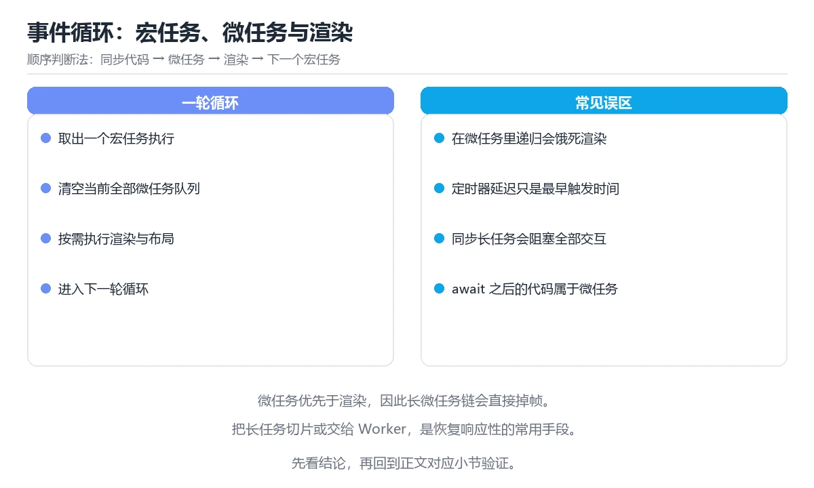

# 图解事件循环：同步、微任务与宏任务

> 内容更新时间：2026-10-06 · 学习阶段：进阶 · 预计用时：50 分钟

## 本节知识框架

**课程定位**：所属分类 `visual_guide`（图解专题），课程主题 `图解事件循环：同步、微任务与宏任务`，学习阶段 进阶，建议用时 45 分钟。

本课主线：用时间线讲清执行顺序、渲染时机与长任务卡顿的原因。

**学完本课应当能够**
- 说清 `事件循环` 与 `微任务` 的含义与区别，并各举一个正例和一个反例。
- 用本课示例验证 `Promise` 的行为，记录输入、输出与失败条件。
- 遇到「以为 `setTimeout(0)` 立即执行」这类问题时，能说出触发条件与修复顺序。

### 从概念到验证的学习链条

1. `事件循环`：先掌握 运行时从任务队列取出回调并执行的调度循环，负责协调同步栈与异步任务，再用它解释 `微任务` 为什么会出现。
2. `微任务`：先掌握 t1 ├─ 清空微任务：打印 3，再用它解释 `Promise` 为什么会出现。
3. `Promise`：先掌握 表示异步操作最终结果的对象，可链式处理成功和失败，再用它解释 `宏任务不止一种` 为什么会出现。
4. `宏任务不止一种`：先掌握 浏览器事件循环里的宏任务来源，再用它解释 本课示例的观察结果 为什么会出现。

**先修与衔接**：本课是「图解专题」分类的第 4 课。先修内容：《图解调用栈与递归》。《图解调用栈与递归》里的 `调用栈`、`栈帧` 是本课的前提。相关或后续课程：《图解并发调度：线程、协程与 Goroutine》、《浏览器渲染与事件循环深入》、《异步编程》。

### 完成判据

- **定义关**：不看正文也能说明 `事件循环` 是 运行时从任务队列取出回调并执行的调度循环，负责协调同步栈与异步任务，并指出一个反例。
- **机制关**：能按“输入 → 转换 → 输出 → 验证”复述 `图解事件循环：同步、微任务与宏任务`，而不是只背结论。
- **示例关**：能运行或推演 `图解事件循环：同步、微任务与宏任务` 的 `text` 示例，并说明一个真实出现的标识符或字面量。
- **证据关**：能指出 `图解事件循环：同步、微任务与宏任务` 示例里的 调用了 `log()`，并说明它支持或反驳了本课的哪一条结论。
- **排错关**：能复现 以为 `setTimeout(0)` 立即执行，记录现象并按 记住同步与微任务优先 修复。
- **迁移关**：能把 `事件循环`、`微任务`、`宏任务`、`Promise` 放进一个与 `图解事件循环：同步、微任务与宏任务` 不同的项目场景，并保持输入与验证条件可追踪。
- **复盘关**：学完 `图解事件循环：同步、微任务与宏任务` 后，用一句话写下仍然不确定的结论，并列出下一次验证需要的输入、环境和成功判据。

### 复习清单

- [ ] 能不看正文复述本课核心术语，并指出一个边界或反例。
- [ ] 能运行或推演本课示例，记录输入、输出与失败现象。
- [ ] 能完成一次自测，并把错题对照错误表定位原因。

**本课配图**




## 核心概念定义

| 术语 | 操作性定义 | 常见边界与风险 |
| --- | --- | --- |
| 事件循环 | 运行时从任务队列取出回调并执行的调度循环，负责协调同步栈与异步任务。 | 越界、悬垂引用与释放顺序会破坏结论，必须在边界输入下复验。 |
| 微任务 | t1 ├─ 清空微任务：打印 3。 | 易错：顺序不符预期；正确做法是记住同步与微任务优先。 |
| Promise | 表示异步操作最终结果的对象，可链式处理成功和失败。 | 易错：循环不等待；正确做法是改 `for...of` 或 `Promise.all`。 |
| 宏任务不止一种 | 浏览器事件循环里的宏任务来源。 | 只在「浏览器事件循环里的宏任务来源」这一前提下成立，换输入或换环境要重新验证。 |

## 原理与运行机制

### 机制总览

**教材衔接：一句话说清**

JavaScript 只有一条主线程：**同步代码先跑完，再清空微任务队列，然后取一个宏任务**，
如此循环。看懂这条流水线，所有「为什么输出顺序和我写的不一样」都能解释。

**教材衔接：为什么 setTimeout(fn, 0) 不是立刻执行**

| 阶段 | 说明 |
| --- | --- |
| `setTimeout(fn, 0)` 的真实含义 | 最快也要等下一轮宏任务 |
| 前面还有同步代码 | 必须等同步全部执行完 |
| 前面还有微任务 | 微任务优先于任何宏任务 |
| 浏览器还要渲染 | 渲染时机也在事件循环里排队 |

**教材衔接：深入补充：图解事件循环：同步、微任务与宏任务 的取舍与边界**

### 一、把概念放回真实约束

| 观察到的现象 | 背后的机制 | 验证方式 | 常见误判 |
| --- | --- | --- | --- |
| 延迟突然升高 | 队列堆积或重传 | 分段计时与指标对照 | 只盯平均值 |
| 状态看似随机 | 并发交错或缓存失效 | 固定随机种子复现 | 把时序问题当逻辑错误 |
| 结果与预期不符 | 默认值与边界规则 | 构造最小输入 | 忽略版本差异 |


### 机制拆解：每一步的输入、动作与输出

#### 1. `事件循环`
- 输入：`事件循环`；本步把 运行时从任务队列取出回调并执行的调度循环，负责协调同步栈与异步任务 当作判断规则。
- 动作：围绕 `事件循环` 保留中间状态，并记录它与 `微任务` 的对应关系。
- 输出：`微任务`，它可以被下一段代码、测试或记录继续使用。
- `事件循环` 的失败条件：越界、悬垂引用与释放顺序会破坏结论，必须在边界输入下复验。

#### 2. `微任务`
- 输入：`事件循环`；本步把 t1 ├─ 清空微任务：打印 3 当作判断规则。
- 动作：围绕 `微任务` 保留中间状态，并记录它与 `Promise` 的对应关系。
- 输出：`Promise`，它可以被下一段代码、测试或记录继续使用。
- `微任务` 的失败条件：当以为 `setTimeout(0)` 立即执行时，会出现顺序不符预期。

#### 3. `Promise`
- 输入：`微任务`；本步把 表示异步操作最终结果的对象，可链式处理成功和失败 当作判断规则。
- 动作：围绕 `Promise` 保留中间状态，并记录它与 `宏任务不止一种` 的对应关系。
- 输出：`宏任务不止一种`，它可以被下一段代码、测试或记录继续使用。
- `Promise` 的失败条件：当期望 `forEach` + `await` 生效时，会出现循环不等待。

#### 4. `宏任务不止一种`
- 输入：`Promise`；本步把 浏览器事件循环里的宏任务来源 当作判断规则。
- 动作：围绕 `宏任务不止一种` 保留中间状态，并记录它与 `log` 的对应关系。
- 输出：`log`，它可以被下一段代码、测试或记录继续使用。
- `宏任务不止一种` 的失败条件：只在「浏览器事件循环里的宏任务来源」这一前提下成立，换输入或换环境要重新验证。

### 示例中的可观察事实

1. 调用了 `log()`；它对应的课程主题是 `图解事件循环：同步、微任务与宏任务`。
2. 调用了 `setTimeout()`；它对应的课程主题是 `图解事件循环：同步、微任务与宏任务`。
3. 调用了 `resolve()`；它对应的课程主题是 `图解事件循环：同步、微任务与宏任务`。
4. 调用了 `then()`；它对应的课程主题是 `图解事件循环：同步、微任务与宏任务`。
5. 出现字面量 `1 同步`；它对应的课程主题是 `图解事件循环：同步、微任务与宏任务`。
6. 出现字面量 `5 宏任务`；它对应的课程主题是 `图解事件循环：同步、微任务与宏任务`。
7. 出现字面量 `3 微任务`；它对应的课程主题是 `图解事件循环：同步、微任务与宏任务`。
8. 出现字面量 `4 微任务链`；它对应的课程主题是 `图解事件循环：同步、微任务与宏任务`。

### 复现实验记录

- 环境：`图解事件循环：同步、微任务与宏任务` 使用 `text` 示例，固定 `事件循环`、`微任务`、`宏任务`、`Promise` 作为第一组条件。
- 首轮输入：先确认 调用了 `log()`，预测 `事件循环` 会怎样变化。
- 基线观察：记录命令、输入、输出和错误原文，不用截图代替可复制的文本。
- 单变量修改：只改变 `事件循环`，观察 `宏任务不止一种` 是否仍满足定义。
- 失败注入：复现 以为 `setTimeout(0)` 立即执行，确认现象是 顺序不符预期。
- 记录结论：把“修改前、修改后、预期变化、实际变化”写成四列表，这样复盘 `图解事件循环：同步、微任务与宏任务` 时才能区分概念错误与实现错误。

## 典型应用场景

- **以为 `setTimeout(0)` 立即执行**：典型现象是顺序不符预期；正确做法是记住同步与微任务优先。
- **在微任务里无限注册微任务**：典型现象是页面卡死，宏任务饿死；正确做法是微任务里别无限自增。
- **用 `await` 当同步用**：典型现象是顺序错乱；正确做法是记住 `await` 之后进微任务。
- **循环里同步做重计算**：典型现象是界面卡顿；正确做法是拆分或放 Worker。

### 最小验证场景

- 准备：保留 `text` 示例的原始输入，先记录 `图解事件循环：同步、微任务与宏任务` 的基线输出和完整运行命令。
- 观察：先核对 调用了 `log()`，再改变一个与 `事件循环` 相关的条件。
- 判定：新结果与 `图解事件循环：同步、微任务与宏任务` 的基线不同不等于错误；只有当差异破坏了 `事件循环` 的定义或错误表中的约束，才判定为失败。

### 选择与边界

- 使用 `事件循环` 时，先满足它的定义：运行时从任务队列取出回调并执行的调度循环，负责协调同步栈与异步任务；越界、悬垂引用与释放顺序会破坏结论，必须在边界输入下复验。
- 使用 `微任务` 时，先满足它的定义：t1 ├─ 清空微任务：打印 3；易错：顺序不符预期；正确做法是记住同步与微任务优先。
- 使用 `Promise` 时，先满足它的定义：表示异步操作最终结果的对象，可链式处理成功和失败；易错：循环不等待；正确做法是改 `for...of` 或 `Promise.all`。
- 使用 `宏任务不止一种` 时，先满足它的定义：浏览器事件循环里的宏任务来源；只在「浏览器事件循环里的宏任务来源」这一前提下成立，换输入或换环境要重新验证。

## 代码/协议/SQL 示例

**教材衔接：一张图看懂事件循环**

```text
        ┌───────────────────────────┐
        │      调用栈 Call Stack     │  同步代码在这里执行
        └─────────────┬─────────────┘
                      │ 栈空
                      ▼
        ┌───────────────────────────┐
        │   微任务队列 Microtasks    │  Promise.then、queueMicrotask
        │   全部清空，一个不留        │  MutationObserver
        └─────────────┬─────────────┘
                      │ 清空后
                      ▼
        ┌───────────────────────────┐
        │   宏任务队列 Macrotasks    │  setTimeout、setInterval
        │   只取一个，执行完再回头看 │  I/O、UI 事件
        └─────────────┬─────────────┘
                      │
                      └──────► 回到微任务检查（循环）
```

**教材衔接：一段代码验证顺序**

```javascript
console.log("1 同步");

setTimeout(() => console.log("5 宏任务"), 0);

Promise.resolve()
  .then(() => console.log("3 微任务"))
  .then(() => console.log("4 微任务链"));

console.log("2 同步");

// 输出：1 同步 → 2 同步 → 3 微任务 → 4 微任务链 → 5 宏任务
```

```text
时间线
  t0  ┌─ 同步：打印 1
      ├─ 注册 setTimeout 回调 → 放进宏任务队列
      ├─ 注册 Promise.then → 放进微任务队列
      ├─ 同步：打印 2
      │   同步结束，栈空
  t1  ├─ 清空微任务：打印 3
      ├─ 微任务里又注册了 then → 继续清空：打印 4
  t2  ├─ 取一个宏任务：打印 5
      └─ 循环
```

**教材衔接：微任务与宏任务速查**

| 类别 | 常见来源 | 执行时机 |
| --- | --- | --- |
| 同步代码 | 普通语句 | 立即，在调用栈上 |
| 微任务 | `Promise.then`、`queueMicrotask`、`await` 之后 | 每个宏任务后全部清空 |
| 宏任务 | `setTimeout`、`setInterval`、I/O、UI 事件 | 每轮只取一个 |
| 渲染 | 样式计算、布局、绘制 | 通常在微任务清空后、下一个宏任务前 |

**注意**：`await` 之后的部分相当于接在微任务里执行。

```javascript
async function run() {
  console.log("A");
  await null;              // 之后的代码进入微任务
  console.log("C");
}
run();
console.log("B");
// 输出：A → B → C
```

**教材衔接：长任务为什么会卡住界面**

```text
理想情况（每帧 16.7ms 内完成）
  [同步任务 5ms][微任务 2ms][渲染 5ms][空闲]

长任务阻塞（同步任务 200ms）
  [────────同步任务 200ms────────][渲染]  ← 中间 12 帧被跳过，用户看到卡顿
```

对策：

| 手段 | 说明 |
| --- | --- |
| 拆分任务 | 用 `setTimeout` 或 `requestIdleCallback` 切片 |
| 移出主线程 | 用 Web Worker 处理计算 |
| 减少同步计算 | 缓存、记忆化、虚拟列表 |
| 避免强制同步布局 | 批量读、批量写 |

**教材衔接：补充：任务队列细分、渲染时机与长任务治理**

### 宏任务不止一种

```text
浏览器事件循环里的宏任务来源
  · setTimeout / setInterval 回调
  · DOM 事件回调（点击、输入）
  · 网络请求完成回调
  · MessageChannel（常用于 polyfill 与调度）
  · requestAnimationFrame 回调（在渲染前执行）

每轮循环只取一个宏任务，执行完清空微任务，然后才可能渲染
```

| 任务类型 | 执行时机 | 用途 |
| --- | --- | --- |
| 同步代码 | 立刻，在调用栈上 | 普通逻辑 |
| 微任务 | 每个宏任务后全部清空 | Promise、queueMicrotask |
| 宏任务 | 每轮一个 | 定时器、事件 |
| requestAnimationFrame | 渲染前 | 动画更新 |
| requestIdleCallback | 空闲时（可能不执行） | 低优先级任务 |

### 渲染到底发生在什么时候

```text
一帧的理想顺序（约 16.7ms）
  输入事件 → 微任务清空 → rAF 回调 → 样式计算 → 布局 → 绘制 → 合成

关键推论
  · 在 rAF 里改样式，可以在同一帧内被应用
  · 在 setTimeout 里改样式，可能要等到下一帧
  · 微任务如果一直追加，渲染永远轮不到 → 页面「卡死」
```

```javascript
// 反例：微任务里无限自我追加，页面完全无响应
function spin() {
  Promise.resolve().then(spin);   // 永不回到渲染阶段
}
```

### Node 的六个阶段

```text
   ┌───────────────┐
   │   timers      │  setTimeout / setInterval 到期回调
   ├───────────────┤
   │   pending     │  系统级回调
   ├───────────────┤
   │   poll        │  IO 回调（多数时间停在这里）
   ├───────────────┤
   │   check       │  setImmediate
   ├───────────────┤
   │   close       │  关闭回调
   └───────────────┘
   每个阶段之间清空微任务队列

setImmediate 通常在 poll 之后的 check 阶段执行，
而 setTimeout(fn, 0) 要等下一轮 timers —— 因此两者顺序在主模块中不确定
```

### 长任务治理的四种手段

| 手段 | 做法 | 适用 |
| --- | --- | --- |
| 时间切片 | 每处理 N 条就让出主线程 | 大数组处理 |
| Web Worker | 把纯计算搬到 Worker | 解析、加密、图像处理 |
| 增量渲染 | 分批插入 DOM | 列表首屏 |
| 让出执行权 | `await scheduler.yield()` 或 `setTimeout(0)` | 需要保持可交互 |

```javascript
// 时间切片：每 5ms 让出一次，保持页面可响应
async function processInChunks(items, handle) {
  const CHUNK_MS = 5;
  let start = performance.now();
  for (const item of items) {
    handle(item);
    if (performance.now() - start > CHUNK_MS) {
      await new Promise((r) => setTimeout(r, 0));   // 让出主线程
      start = performance.now();
    }
  }
}
```

### 用性能面板定位问题

```text
DevTools → Performance 录制时重点看三样
  · 长任务（红色三角标记）：超过 50ms 的任务
  · Main 泳道：函数调用的耗时排序
  · Frames：是否有掉帧（帧间隔 > 16.7ms）

常见结论
  · 长任务集中在一次 map 里 → 时间切片或 Worker
  · 掉帧伴随大量 Layout → 避免强制同步布局
  · 微任务堆积 → 检查 Promise 递归与 await 链
```

### 自查清单

- [ ] 能说出宏任务与微任务的执行顺序
- [ ] 知道 rAF 在渲染前执行，适合做动画
- [ ] 知道微任务无限追加会导致页面失去响应
- [ ] 能用时间切片或 Worker 拆分长任务
- [ ] 会用 Performance 面板识别长任务与掉帧

### 示例精读：先找证据，再改一个条件

1. 调用了 `log()`；它出现在 `图解事件循环：同步、微任务与宏任务` 的示例中，阅读时先确认它前后各发生了什么。
2. 调用了 `setTimeout()`；它出现在 `图解事件循环：同步、微任务与宏任务` 的示例中，阅读时先确认它前后各发生了什么。
3. 调用了 `resolve()`；它出现在 `图解事件循环：同步、微任务与宏任务` 的示例中，阅读时先确认它前后各发生了什么。
4. 调用了 `then()`；它出现在 `图解事件循环：同步、微任务与宏任务` 的示例中，阅读时先确认它前后各发生了什么。
5. 出现字面量 `1 同步`；它出现在 `图解事件循环：同步、微任务与宏任务` 的示例中，阅读时先确认它前后各发生了什么。
6. 出现字面量 `5 宏任务`；它出现在 `图解事件循环：同步、微任务与宏任务` 的示例中，阅读时先确认它前后各发生了什么。
7. 出现字面量 `3 微任务`；它出现在 `图解事件循环：同步、微任务与宏任务` 的示例中，阅读时先确认它前后各发生了什么。
8. 出现字面量 `4 微任务链`；它出现在 `图解事件循环：同步、微任务与宏任务` 的示例中，阅读时先确认它前后各发生了什么。
- 在 `图解事件循环：同步、微任务与宏任务` 中与 `事件循环` 对照：示例必须能支持 运行时从任务队列取出回调并执行的调度循环，负责协调同步栈与异步任务，否则说明这一段还缺少实现或验证步骤。
- 在 `图解事件循环：同步、微任务与宏任务` 中与 `微任务` 对照：示例必须能支持 t1 ├─ 清空微任务：打印 3，否则说明这一段还缺少实现或验证步骤。
- 在 `图解事件循环：同步、微任务与宏任务` 中与 `Promise` 对照：示例必须能支持 表示异步操作最终结果的对象，可链式处理成功和失败，否则说明这一段还缺少实现或验证步骤。
- 在 `图解事件循环：同步、微任务与宏任务` 中与 `宏任务不止一种` 对照：示例必须能支持 浏览器事件循环里的宏任务来源，否则说明这一段还缺少实现或验证步骤。

## 时间/空间复杂度或性能分析

**性能关注点（图解事件循环：同步、微任务与宏任务）**：图解类课程的性能点在渲染与交互响应：记录首屏时间与交互延迟。

**本课特有开销（图解事件循环：同步、微任务与宏任务 · 事件循环）**：并发度提高后要观察是否出现拐点：延迟上升而吞吐不增，说明瓶颈已转移。

**测量方法**：以 `图解事件循环：同步、微任务与宏任务` 的 `事件循环` 场景为对象，固定输入跑一遍记录基线，再把规模或并发度提高一个数量级复测；两次结果的差值与波动范围才是结论依据。

### 需要控制的变量与记录项

- `图解事件循环：同步、微任务与宏任务` 的 `事件循环`：固定它的版本、输入范围和资源上限，分别记录速度、内存与失败率的变化。
- `图解事件循环：同步、微任务与宏任务` 的 `微任务`：固定它的版本、输入范围和资源上限，分别记录速度、内存与失败率的变化。
- `图解事件循环：同步、微任务与宏任务` 的 `宏任务`：固定它的版本、输入范围和资源上限，分别记录速度、内存与失败率的变化。
- `图解事件循环：同步、微任务与宏任务` 的 `Promise`：固定它的版本、输入范围和资源上限，分别记录速度、内存与失败率的变化。
- `图解事件循环：同步、微任务与宏任务` 的 `渲染`：固定它的版本、输入范围和资源上限，分别记录速度、内存与失败率的变化。
- `图解事件循环：同步、微任务与宏任务` 中 `事件循环` 的边界：越界、悬垂引用与释放顺序会破坏结论，必须在边界输入下复验。达到边界时不要外推，必须重新测量。
- `图解事件循环：同步、微任务与宏任务` 中 `微任务` 的边界：易错：顺序不符预期；正确做法是记住同步与微任务优先。达到边界时不要外推，必须重新测量。
- `图解事件循环：同步、微任务与宏任务` 中 `Promise` 的边界：易错：循环不等待；正确做法是改 `for...of` 或 `Promise.all`。达到边界时不要外推，必须重新测量。
- `图解事件循环：同步、微任务与宏任务` 中 `宏任务不止一种` 的边界：只在「浏览器事件循环里的宏任务来源」这一前提下成立，换输入或换环境要重新验证。达到边界时不要外推，必须重新测量。
- `图解事件循环：同步、微任务与宏任务` 的代码证据：先验证 调用了 `log()`，再记录该路径的输入规模与耗时；只看代码行数不能推出复杂度。

## 常见误区与易错点

| 容易写错的做法 | 实际现象 | 原因与正确做法 |
| --- | --- | --- |
| 以为 `setTimeout(0)` 立即执行 | 顺序不符预期 | 记住同步与微任务优先 |
| 在微任务里无限注册微任务 | 页面卡死，宏任务饿死 | 微任务里别无限自增 |
| 用 `await` 当同步用 | 顺序错乱 | 记住 `await` 之后进微任务 |
| 循环里同步做重计算 | 界面卡顿 | 拆分或放 Worker |
| 期望 `forEach` + `await` 生效 | 循环不等待 | 改 `for...of` 或 `Promise.all` |
| 忘记清理定时器 | 组件卸载后仍执行 | 卸载时 `clearTimeout` |
| 以为 setTimeout(0) 立即执行 | 顺序不符预期。 | 记住同步与微任务优先。 |

### 现场 1：以为 `setTimeout(0)` 立即执行

**症状**：顺序不符预期。

**根因与修复**：记住同步与微任务优先。

**自检**：在本课示例里复现「以为 `setTimeout(0)` 立即执行」，改成记住同步与微任务优先后重跑；如果症状消失且失败路径按预期变化，说明定位正确。

### 现场 2：在微任务里无限注册微任务

**症状**：页面卡死，宏任务饿死。

**根因与修复**：微任务里别无限自增。

**自检**：在本课示例里复现「在微任务里无限注册微任务」，改成微任务里别无限自增后重跑；如果症状消失且失败路径按预期变化，说明定位正确。

### 现场 3：用 `await` 当同步用

**症状**：顺序错乱。

**根因与修复**：记住 `await` 之后进微任务。

**自检**：在本课示例里复现「用 `await` 当同步用」，改成记住 `await` 之后进微任务后重跑；如果症状消失且失败路径按预期变化，说明定位正确。

### 现场 4：循环里同步做重计算

**症状**：界面卡顿。

**根因与修复**：拆分或放 Worker。

**自检**：在本课示例里复现「循环里同步做重计算」，改成拆分或放 Worker后重跑；如果症状消失且失败路径按预期变化，说明定位正确。

### 现场 5：期望 `forEach` + `await` 生效

**症状**：循环不等待。

**根因与修复**：改 `for...of` 或 `Promise.all`。

**自检**：在本课示例里复现「期望 `forEach` + `await` 生效」，改成改 `for...of` 或 `Promise.all`后重跑；如果症状消失且失败路径按预期变化，说明定位正确。

### 现场 6：忘记清理定时器

**症状**：组件卸载后仍执行。

**根因与修复**：卸载时 `clearTimeout`。

**自检**：在本课示例里复现「忘记清理定时器」，改成卸载时 `clearTimeout`后重跑；如果症状消失且失败路径按预期变化，说明定位正确。

### 现场 7：以为 setTimeout(0) 立即执行

**症状**：顺序不符预期。

**根因与修复**：记住同步与微任务优先。

**自检**：在本课示例里复现「以为 setTimeout(0) 立即执行」，改成记住同步与微任务优先后重跑；如果症状消失且失败路径按预期变化，说明定位正确。

## 与其他知识点的关系

- **先修**：`图解调用栈与递归`。本课默认这些内容已经掌握。
- **相关或后续**：`图解并发调度：线程、协程与 Goroutine`、`浏览器渲染与事件循环深入`、`异步编程`。本课术语会在这些课程里继续使用。
- **术语归属**：`事件循环`、`微任务`、`Promise` 的定义以本课「核心概念定义」为准，换到其他课程时先确认定义是否被改写。
- 同一分类的《图解一次网页请求的完整链路》也涉及 `渲染`；两课衔接时先确认这个术语的定义是否一致。

### 先修与后续术语接口

- `浏览器渲染与事件循环深入`：共享术语 `事件循环`、`微任务`，共同关键词 `事件循环`、`微任务`。
- `异步编程`：共享术语 `Promise`、`事件循环`，共同关键词 `Promise`、`事件循环`、`微任务`。
- `图解调用栈与递归`：两者通过本分类的学习顺序衔接，阅读时重点比较各自的输入与失败条件。
- `图解并发调度：线程、协程与 Goroutine`：两者通过本分类的学习顺序衔接，阅读时重点比较各自的输入与失败条件。

### 容易混淆的相邻概念

- `事件循环` 与 `微任务`：前者强调 运行时从任务队列取出回调并执行的调度循环，负责协调同步栈与异步任务；后者强调 t1 ├─ 清空微任务：打印 3。判断时分别检查两条定义的适用范围，不要只看名称相似就互换。
- `微任务` 与 `Promise`：前者强调 t1 ├─ 清空微任务：打印 3；后者强调 表示异步操作最终结果的对象，可链式处理成功和失败。判断时分别检查两条定义的适用范围，不要只看名称相似就互换。
- `Promise` 与 `宏任务不止一种`：前者强调 表示异步操作最终结果的对象，可链式处理成功和失败；后者强调 浏览器事件循环里的宏任务来源。判断时分别检查两条定义的适用范围，不要只看名称相似就互换。

## 自测题与参考答案

> 先独立作答，再对照参考答案；答案都能在本课正文、术语表或错误表里找到依据。

### 自测 1（概念复述）

不看正文，写出 `事件循环` 的操作性定义，并说明它与 `微任务` 的区别。

**参考答案**：运行时从任务队列取出回调并执行的调度循环，负责协调同步栈与异步任务。

`微任务` 的定位是：t1 ├─ 清空微任务：打印 3；两者的差别要从适用对象与失败模式上说明。

### 自测 2（排错）

本课错误表记录了「以为 `setTimeout(0)` 立即执行」这类做法。请写出它会出现的现象、根因，以及修复顺序。

**参考答案**：现象是顺序不符预期；正确做法是记住同步与微任务优先。修复时先复现现象并保留证据，再改动一处假设重跑，确认现象消失。

### 自测 3（动手验证）

运行本课的 `text` 示例，改动其中一个输入后重新运行，记录输出与错误信息。

**参考答案**：正常输入下 `text` 示例应当复现正文给出的结果；改动输入后，如果结果改变或报错，先核对它是否满足 `图解事件循环：同步、微任务与宏任务` 中`事件循环` 的适用范围，再检查错误表里是否有同类现象。

### 自测 4（代码阅读）

阅读本课开头的 `text` 示例，说明它体现了`事件循环` 的哪一条性质，并指出改动哪个输入会让这条性质不再成立。

**参考答案**：`事件循环` 的定义是 运行时从任务队列取出回调并执行的调度循环，负责协调同步栈与异步任务，示例正是在实现这条定义。改动与 `事件循环` 有关的一个输入后，如果结果不再符合 `图解事件循环：同步、微任务与宏任务` 的正文描述，就说明该性质只在当前前提成立。

### 自测 5（迁移）

把 `图解事件循环：同步、微任务与宏任务` 的方法迁移到自己的项目：围绕 `事件循环` 写出一个与错误表同类的风险点，并说明触发条件和检验方式。

**参考答案**：例如「以为 setTimeout(0) 立即执行」，它会导致顺序不符预期；检验方式是按记住同步与微任务优先改一处再复现，确认现象消失且没有引入新的失败分支。

### 自测 6（对比）

用一个表格对比 `事件循环` 与 `微任务`：各写一行适用场景、一行失败表现。

**参考答案**：`事件循环` 的定义是运行时从任务队列取出回调并执行的调度循环，负责协调同步栈与异步任务；`微任务` 的定义是t1 ├─ 清空微任务：打印 3。两者的失败表现分别对应本课错误表里与本术语相关的行。

### 自测 7（排错顺序）

面对「以为 `setTimeout(0)` 立即执行」引发的问题，请把“复现 顺序不符预期 → 保留证据 → 记住同步与微任务优先 → 回归验证”四步写成可执行的检查清单。

**参考答案**：第一步按顺序不符预期复现；第二步记录输入、版本与完整报错；第三步按记住同步与微任务优先只改一处；第四步重跑并确认失败路径也按预期变化。

### 自测 8（边界判断）

针对 `宏任务不止一种`，分别写出“可以使用”的条件和“结论不再成立”的条件。

**参考答案**：只在「浏览器事件循环里的宏任务来源」这一前提下成立，换输入或换环境要重新验证。 同时要把 `宏任务不止一种` 的定义 浏览器事件循环里的宏任务来源 与实际输入逐项对照。

### 自测 9（机制重建）

不看正文，按输入、转换、输出、验证四段重建 `事件循环` → `微任务` → `Promise` → `宏任务不止一种` 的作用链。

**参考答案**：起点是 `事件循环` 的定义 运行时从任务队列取出回调并执行的调度循环，负责协调同步栈与异步任务；中间每一步都保留可观察状态；终点由 `宏任务不止一种` 检查，失败时回到错误表定位第一个偏离定义的步骤。

### 自测 10（综合排错）

在 `图解事件循环：同步、微任务与宏任务` 中，现象是 顺序不符预期。请围绕 以为 setTimeout(0) 立即执行 写出最小复现、关键证据、修复动作和回归验证，并说明为什么不能只凭一次运行下结论。

**参考答案**：先复现 以为 setTimeout(0) 立即执行，记录输入与完整错误；再按 记住同步与微任务优先 只改一处。回归时同时跑正常路径和边界路径，只有两次结果都可解释，才把修复视为完成。

### 自测 11（一分钟复述）

用每分钟约 200 字的速度复述 `图解事件循环：同步、微任务与宏任务`：先给主问题，再按顺序说出 `事件循环`、`微任务`、`Promise`、`宏任务不止一种`，最后给一个失败案例。

**自评标准**：主问题必须对应 用时间线讲清执行顺序、渲染时机与长任务卡顿的原因；每个术语都要能接上一句定义或边界；失败案例必须写成可观察现象，不能用“可能有风险”代替证据。

## 术语速查

| 术语 | 一句话说明 |
| --- | --- |
| `事件循环` | 运行时从任务队列取出回调并执行的调度循环，负责协调同步栈与异步任务。 |
| `微任务` | t1 ├─ 清空微任务：打印 3。 |
| `Promise` | 表示异步操作最终结果的对象，可链式处理成功和失败。 |
| `宏任务不止一种` | 浏览器事件循环里的宏任务来源。 |

**术语关系**：`事件循环`（运行时从任务队列取出回调并执行的调度循环） → `微任务`（t1 ├─ 清空微任务：打印 3） → `Promise`（表示异步操作最终结果的对象） → `宏任务不止一种`（浏览器事件循环里的宏任务来源）。

## 考点精讲

`图解事件循环：同步、微任务与宏任务` 的题库有 6 道题，下面逐题给出题干、正确项与判断依据：先自己作答，再核对正确项，最后回到正文对应小节复核。

### 考点 1：第 1 题

- **题目**：这段 `javascript` 代码对应 `图解事件循环：同步、微任务与宏任务` 的 `事件循环`。课程要解决的是用时间线讲清执行顺序、渲染时机与长任务卡顿的原因。关于代码内容，哪一项说法准确？
- **正确项**：出现字面量 `3 微任务`
- **判断依据**：这道题落在术语 `事件循环` 上：运行时从任务队列取出回调并执行的调度循环，负责协调同步栈与异步任务。复习时把 `事件循环` 的定义、适用边界和一个反例一起说清楚，再回到「核心概念定义」核对原文。

### 考点 2：第 2 题

- **题目**：`setTimeout(fn, 0)` 不会立即执行，原因是？
- **正确项**：它属于宏任务
- **判断依据**：这道题检验本课主问题：用时间线讲清执行顺序、渲染时机与长任务卡顿的原因。复习时先复述本课主问题，再举一个会让结论失效的输入。

### 考点 3：第 3 题

- **题目**：`await` 之后的代码相当于在什么时机执行？
- **正确项**：作为微任务
- **判断依据**：这道题落在术语 `微任务` 上：t1 ├─ 清空微任务：打印 3。复习时把 `微任务` 的定义、适用边界和一个反例一起说清楚，再回到「核心概念定义」核对原文。

### 考点 4：第 4 题

- **题目**：页面出现明显卡顿，最可能的原因是？
- **正确项**：主线程被长时间占用的长任务阻塞
- **判断依据**：这道题检验本课主问题：用时间线讲清执行顺序、渲染时机与长任务卡顿的原因。复习时先复述本课主问题，再举一个会让结论失效的输入。

### 考点 5：第 5 题

- **题目**：填空：补齐下面这段术语说明中的空缺。课程 `用时间线讲清执行顺序、渲染时机与长任务卡顿的原因。`，这段说明是：t1 ├─ 清空`____`：打印 3。空缺处应填哪个术语？
- **正确项**：微任务
- **判断依据**：这道题落在术语 `微任务` 上：t1 ├─ 清空微任务：打印 3。复习时把 `微任务` 的定义、适用边界和一个反例一起说清楚，再回到「核心概念定义」核对原文。

### 考点 6：第 6 题

- **题目**：关于 `事件循环`，下列哪些说法与 `图解事件循环：同步、微任务与宏任务` 的正文一致？判断时以用时间线讲清执行顺序、渲染时机与长任务卡顿的原因。为主线。（多选）
- **正确项**：它属于宏任务；同步 → 清空微任务 → 取一个宏任务 → 再清微任务
- **判断依据**：这道题落在术语 `事件循环` 上：运行时从任务队列取出回调并执行的调度循环，负责协调同步栈与异步任务。复习时把 `事件循环` 的定义、适用边界和一个反例一起说清楚，再回到「核心概念定义」核对原文。

### 考点 7：`事件循环`

- **要点**：运行时从任务队列取出回调并执行的调度循环，负责协调同步栈与异步任务。
- **事件循环 的边界**：越界、悬垂引用与释放顺序会破坏结论，必须在边界输入下复验。

### 考点 8：`微任务`

- **要点**：t1 ├─ 清空微任务：打印 3。
- **微任务 的边界**：易错：顺序不符预期；正确做法是记住同步与微任务优先。

### 考点 9：`Promise`

- **要点**：表示异步操作最终结果的对象，可链式处理成功和失败。
- **Promise 的边界**：易错：循环不等待；正确做法是改 `for...of` 或 `Promise.all`。

### 考点 10：`宏任务不止一种`

- **要点**：浏览器事件循环里的宏任务来源。
- **宏任务不止一种 的边界**：只在「浏览器事件循环里的宏任务来源」这一前提下成立，换输入或换环境要重新验证。

### 考点 11：排错——以为 `setTimeout(0)` 立即执行

- **现象**：顺序不符预期。
- **处理**：记住同步与微任务优先。

### 考点 12：排错——在微任务里无限注册微任务

- **现象**：页面卡死，宏任务饿死。
- **处理**：微任务里别无限自增。

### 考点 13：综合辨析——`事件循环` 与 `宏任务不止一种`

- **辨析点**：`事件循环` 的定义是 运行时从任务队列取出回调并执行的调度循环，负责协调同步栈与异步任务；`宏任务不止一种` 的定义是 浏览器事件循环里的宏任务来源。
- **答题要求**：面对 `图解事件循环：同步、微任务与宏任务` 的题目，先判断描述的是 `事件循环` 还是 `宏任务不止一种`，再归到对应定义，最后写出一个会让该定义失效的边界输入。

### 考点 14：排错评分点

- **现象分**：能写出 顺序不符预期，而不是只写“程序有错”。
- **证据分**：保留触发 以为 `setTimeout(0)` 立即执行 的输入、版本和错误原文。
- **修复分**：按 记住同步与微任务优先 只改一处，并同时回归正常路径与边界路径。

## 内容元数据

- 内容版本：v2.0
- 最后更新：2026-10-06
- 学习阶段：进阶
- 适用环境：通用图解与系统原理
；本课聚焦 事件循环。
- 内容来源：内置结构化课程与工程实践整理
- 相关主题：事件循环、微任务、宏任务、Promise、渲染
- 质量版本：P0 测验标准 + P1 覆盖扩展 + P2 体验补全

## 参考资料与复核

- 最后复核：2026-10-04
- 下次复核：2027-07-10
- 复核范围：版本兼容、API 行为、安全建议与工程实践
- 来源性质：官方文档、标准或权威教材；本课核对关键词：事件循环、微任务、宏任务、Promise、渲染。

| 参考资料 | 本课用途 |
| --- | --- |
| [MDN 浏览器工作原理](https://developer.mozilla.org/docs/Web/Performance/How_browsers_work) | 从请求到渲染的流程 |
| [Kubernetes 架构](https://kubernetes.io/docs/concepts/architecture/) | 控制平面与节点流程 |
| [Pro Git 内部原理](https://git-scm.com/book/zh/v2/Git-内部原理-Git-对象) | Git 对象与引用关系 |

| [本课术语索引：图解事件循环：同步、微任务与宏任务](#核心概念定义) | 按本课输入、术语边界和错误表现逐项核对 |
> 「图解事件循环：同步、微任务与宏任务」的链接用于离线阅读后的延伸核对；App 不会自动联网。