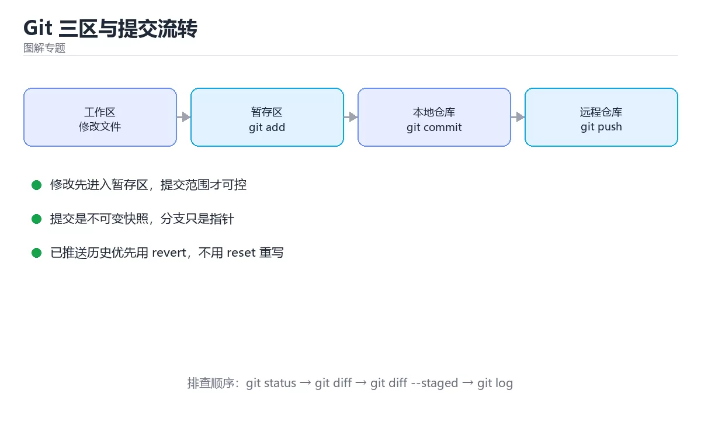
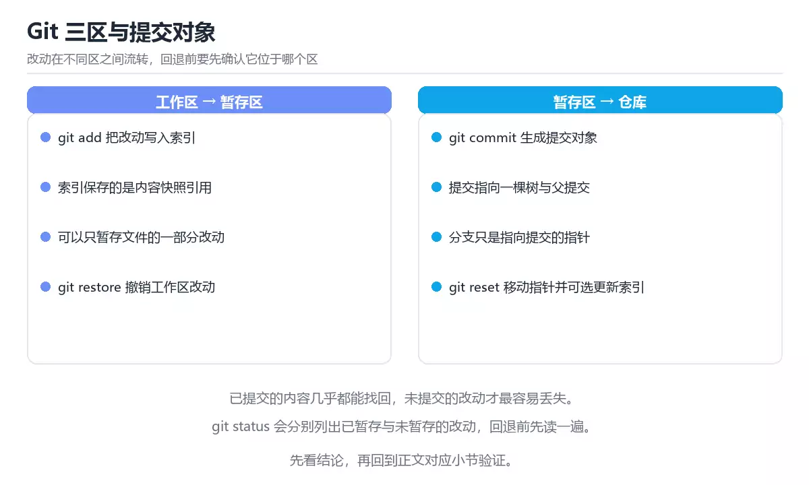

# 图解 Git 三区与提交流转



> 内容更新时间：2026-10-06 · 学习阶段：入门 · 预计用时：45 分钟

## 本节知识框架

**课程定位**：所属分类 `visual_guide`（图解专题），课程主题 `图解 Git 三区与提交流转`，学习阶段 入门，建议用时 40 分钟。

本课主线：工作区、暂存区、本地仓库的流转，以及三类 reset 与撤销场景。

**学完本课应当能够**
- 说清 `add` 与 `Git` 的含义与区别，并各举一个正例和一个反例。
- 用本课示例验证 `工作区` 的行为，记录输入、输出与失败条件。
- 遇到「git add . 后直接提交」这类问题时，能说出触发条件与修复顺序。

### 从概念到验证的学习链条

1. `add`：先掌握 看清一张流转图，`add`、`commit`、`reset`、`restore` 的差别就一目了然，再用它解释 `Git` 为什么会出现。
2. `Git`：先掌握 Git 把文件状态分为工作区、暂存区和提交历史：工作区是当前文件，暂存区准备下一次提交，提交历史保存不可变快照，再用它解释 `工作区` 为什么会出现。
3. `工作区`：先掌握 你正在编辑的文件状态，与暂存区和最后一次提交三者可能各不相同，再用它解释 `HEAD` 为什么会出现。
4. `HEAD`：先掌握 指向当前分支最新提交的引用，切换分支或回退时它随之移动，再用它解释 本课示例的观察结果 为什么会出现。

**先修与衔接**：本课是「图解专题」分类的第 3 课。相关或后续课程：《图解 B+ 树与数据库索引》、《Git 版本控制》。

### 完成判据

- **定义关**：不看正文也能说明 `add` 是 看清一张流转图，`add`、`commit`、`reset`、`restore` 的差别就一目了然，并指出一个反例。
- **机制关**：能按“输入 → 转换 → 输出 → 验证”复述 `图解 Git 三区与提交流转`，而不是只背结论。
- **示例关**：能运行或推演 `图解 Git 三区与提交流转` 的 `text` 示例，并说明一个真实出现的标识符或字面量。
- **证据关**：能从 `图解 Git 三区与提交流转` 的示例写出一个输入、处理、输出三元组，并说明它支持或反驳了本课的哪一条结论。
- **排错关**：能复现 git add . 后直接提交，记录现象并按 先看 status/diff 并精确暂存 修复。
- **迁移关**：能把 `Git`、`暂存区`、`reset`、`revert` 放进一个与 `图解 Git 三区与提交流转` 不同的项目场景，并保持输入与验证条件可追踪。
- **复盘关**：学完 `图解 Git 三区与提交流转` 后，用一句话写下仍然不确定的结论，并列出下一次验证需要的输入、环境和成功判据。

### 复习清单

- [ ] 能不看正文复述本课核心术语，并指出一个边界或反例。
- [ ] 能运行或推演本课示例，记录输入、输出与失败现象。
- [ ] 能完成一次自测，并把错题对照错误表定位原因。

**本课配图**



## 核心概念定义

| 术语 | 操作性定义 | 常见边界与风险 |
| --- | --- | --- |
| add | 看清一张流转图，add、commit、reset、restore 的差别就一目了然。 | 易错：误提交密钥、构建产物和无关改动；正确做法是先看 status/diff 并精确暂存。 |
| Git | Git 把文件状态分为工作区、暂存区和提交历史：工作区是当前文件，暂存区准备下一次提交，提交历史保存不可变快照。 | 易错：仓库体积膨胀；正确做法是用 `.gitignore` 与 Git LFS。 |
| 工作区 | 你正在编辑的文件状态，与暂存区和最后一次提交三者可能各不相同。 | 隔离级别与并发事务会影响可见性，换级别或换存储引擎后要重新验证。 |
| HEAD | 指向当前分支最新提交的引用，切换分支或回退时它随之移动。 | 隔离级别与并发事务会影响可见性，换级别或换存储引擎后要重新验证。 |

## 原理与运行机制

### 机制总览

**教材衔接：一句话说清**

Git 的大部分困惑都来自没分清**工作区、暂存区、本地仓库**这三个区域。
看清一张流转图，`add`、`commit`、`reset`、`restore` 的差别就一目了然。

**教材衔接：验证步骤**

**失败路径（来自本课错误表）**
- git add . 后直接提交 → 误提交密钥、构建产物和无关改动 → 先看 status/diff 并精确暂存。
- 对已推送提交做 reset → 重写共享历史导致协作混乱 → 使用 revert 生成反向提交。
- 在共享分支随意变基 → 其他成员历史分叉 → 只变基未共享的本地提交。
- 提交信息写 fix → 无法理解变更意图 → 写清问题、动作和影响范围。
### 机制拆解：每一步的输入、动作与输出

#### 1. `add`
- 输入：`Git`；本步把 看清一张流转图，`add`、`commit`、`reset`、`restore` 的差别就一目了然 当作判断规则。
- 动作：围绕 `add` 保留中间状态，并记录它与 `Git` 的对应关系。
- 输出：`Git`，它可以被下一段代码、测试或记录继续使用。
- `add` 的失败条件：当git add . 后直接提交时，会出现误提交密钥、构建产物和无关改动。

#### 2. `Git`
- 输入：`add`；本步把 Git 把文件状态分为工作区、暂存区和提交历史：工作区是当前文件，暂存区准备下一次提交，提交历史保存不可变快照 当作判断规则。
- 动作：围绕 `Git` 保留中间状态，并记录它与 `工作区` 的对应关系。
- 输出：`工作区`，它可以被下一段代码、测试或记录继续使用。
- `Git` 的失败条件：当提交大文件时，会出现仓库体积膨胀。

#### 3. `工作区`
- 输入：`Git`；本步把 你正在编辑的文件状态，与暂存区和最后一次提交三者可能各不相同 当作判断规则。
- 动作：围绕 `工作区` 保留中间状态，并记录它与 `HEAD` 的对应关系。
- 输出：`HEAD`，它可以被下一段代码、测试或记录继续使用。
- `工作区` 的失败条件：隔离级别与并发事务会影响可见性，换级别或换存储引擎后要重新验证。

#### 4. `HEAD`
- 输入：`工作区`；本步把 指向当前分支最新提交的引用，切换分支或回退时它随之移动 当作判断规则。
- 动作：围绕 `HEAD` 保留中间状态，并记录它与 `本课示例的最终结果` 的对应关系。
- 输出：`本课示例的最终结果`，它可以被下一段代码、测试或记录继续使用。
- `HEAD` 的失败条件：隔离级别与并发事务会影响可见性，换级别或换存储引擎后要重新验证。

### 复现实验记录

- 环境：`图解 Git 三区与提交流转` 使用 `text` 示例，固定 `Git`、`暂存区`、`reset`、`revert` 作为第一组条件。
- 首轮输入：从示例中的第一个输入开始，预测 `add` 会怎样变化。
- 基线观察：记录命令、输入、输出和错误原文，不用截图代替可复制的文本。
- 单变量修改：只改变 `Git`，观察 `HEAD` 是否仍满足定义。
- 失败注入：复现 git add . 后直接提交，确认现象是 误提交密钥、构建产物和无关改动。
- 记录结论：把“修改前、修改后、预期变化、实际变化”写成四列表，这样复盘 `图解 Git 三区与提交流转` 时才能区分概念错误与实现错误。

## 典型应用场景

- **git add . 后直接提交**：典型现象是误提交密钥、构建产物和无关改动；正确做法是先看 status/diff 并精确暂存。
- **对已推送提交做 reset**：典型现象是重写共享历史导致协作混乱；正确做法是使用 revert 生成反向提交。
- **在共享分支随意变基**：典型现象是其他成员历史分叉；正确做法是只变基未共享的本地提交。
- **提交信息写 fix**：典型现象是无法理解变更意图；正确做法是写清问题、动作和影响范围。

### 最小验证场景

- 准备：保留 `text` 示例的原始输入，先记录 `图解 Git 三区与提交流转` 的基线输出和完整运行命令。
- 判定：新结果与 `图解 Git 三区与提交流转` 的基线不同不等于错误；只有当差异破坏了 `add` 的定义或错误表中的约束，才判定为失败。

### 选择与边界

- 使用 `add` 时，先满足它的定义：看清一张流转图，`add`、`commit`、`reset`、`restore` 的差别就一目了然；易错：误提交密钥、构建产物和无关改动；正确做法是先看 status/diff 并精确暂存。
- 使用 `Git` 时，先满足它的定义：Git 把文件状态分为工作区、暂存区和提交历史：工作区是当前文件，暂存区准备下一次提交，提交历史保存不可变快照；易错：仓库体积膨胀；正确做法是用 `.gitignore` 与 Git LFS。
- 使用 `工作区` 时，先满足它的定义：你正在编辑的文件状态，与暂存区和最后一次提交三者可能各不相同；隔离级别与并发事务会影响可见性，换级别或换存储引擎后要重新验证。
- 使用 `HEAD` 时，先满足它的定义：指向当前分支最新提交的引用，切换分支或回退时它随之移动；隔离级别与并发事务会影响可见性，换级别或换存储引擎后要重新验证。

## 代码/协议/SQL 示例

**教材衔接：一张图看懂三区**

```text
  工作区                暂存区                本地仓库            远程仓库
 Working Tree          Staging Area            .git              Remote
───────────────      ───────────────       ───────────────    ───────────────
  你正在编辑的           下一次提交的            已提交的
  文件内容               快照清单                历史记录

      │  git add        │  git commit        │  git push
      ├────────────────►├───────────────────►├──────────────────►
      │                 │                    │
      │◄────────────────┤◄───────────────────┤◄──────────────────
      │ git restore     │ git reset          │ git fetch/pull
```

**教材衔接：各命令到底动了哪个区**

| 命令 | 影响区域 | 常见用途 |
| --- | --- | --- |
| `git add <file>` | 工作区 → 暂存区 | 把改动加入下次提交 |
| `git commit` | 暂存区 → 本地仓库 | 生成一次提交 |
| `git push` | 本地仓库 → 远程 | 分享提交 |
| `git fetch` | 远程 → 本地仓库 | 拉取但不合并工作区 |
| `git pull` | 远程 → 本地仓库 + 工作区 | 拉取并合并 |
| `git restore <file>` | 暂存区 → 工作区 | 丢弃工作区改动（危险） |
| `git restore --staged <file>` | 本地仓库 → 暂存区 | 取消暂存，保留改动 |
| `git reset --soft HEAD~1` | 本地仓库 → 暂存区 | 撤销提交，改动仍在暂存区 |
| `git reset --mixed HEAD~1` | 本地仓库 → 工作区 | 撤销提交与暂存，改动保留 |
| `git reset --hard HEAD~1` | 全部覆盖 | **丢弃改动，慎用** |

**教材衔接：三种 reset 的差别**

```text
提交历史：  A ── B ── C          （HEAD 在 C）

git reset --soft B
  历史：A ── B                 C 的改动 → 暂存区

git reset --mixed B（默认）
  历史：A ── B                 C 的改动 → 工作区（未暂存）

git reset --hard B
  历史：A ── B                 C 的改动 → 彻底丢弃
```

**共享分支上不要用 reset**：历史改写会让其他协作者出错，应改用 `git revert`。

**教材衔接：分支与合并的形状**

```text
git merge（保留分支结构）
        ┌── feature ──┐
  main ─┘             └──► main（多一个合并提交）

git rebase（线性历史）
  main ──► main ── feature' ──►   （提交被搬到新基底，哈希改变）
```

| 选择 | 何时用 | 注意 |
| --- | --- | --- |
| `merge` | 共享分支、需要保留上下文 | 历史多分叉 |
| `rebase` | 本地未共享分支、追求线性 | **不要 rebase 已推送的共享分支** |
| `squash merge` | 一个 PR 合成一个提交 | 丢失细粒度历史 |

**教材衔接：冲突是怎么产生的**

```text
共同祖先：content = "A"

分支 1 改成 "B"        分支 2 改成 "C"
        │                      │
        └────── 合并 ──────────┘
                  │
                  ▼
         Git 无法判断该用哪个
         → 冲突标记 <<<<<<< ======= >>>>>>>
```

```text
<<<<<<< HEAD
content = "B"          ← 当前分支
=======
content = "C"          ← 被合并分支
>>>>>>> feature
```

解决步骤：**看清两边的意图 → 手动改成最终想要的样子 → 删掉标记行 → 测试 → `git add` 后继续**。

**教材衔接：深入补充：图解 Git 三区与提交流转**

前面已经建立了基本概念。这一节换一个角度，把图解 Git 三区与提交流转放进真实工程里，
重点回答三件事：一句话说清 的机制、代价与边界。

### 一、核心模型

Git 把文件状态分为工作区、暂存区和提交历史：工作区是当前文件，暂存区准备下一次提交，提交历史保存不可变快照；分支只是指向提交的可移动指针。

```text
修改工作区 → git add 写入暂存区 → git commit 生成快照 → 分支指针前移 → 远程同步 → 合并或变基
```

### 二、关键机制拆解

1. 工作区修改不会自动进入提交，必须先 add 到暂存区，才能形成精确提交。
2. 提交保存的是完整快照的引用关系，不是简单的文件差异列表。
3. HEAD 指向当前分支或某个提交，分支指针移动不会改变旧提交。
4. git reset 会移动分支指针，git revert 通过新提交反向抵消历史，推送后优先使用 revert。
5. git checkout/switch 切换分支，git restore 恢复文件，理解目标状态比记命令更重要。
6. 合并保留分叉历史，变基重写历史以获得线性记录，但不要变基已共享提交。
7. 提交前用 diff、status 和 staged 内容确认范围，避免把密钥和无关文件提交。

### 三、对照表：抓住容易混淆的边界

| 维度 | 一侧 | 另一侧 |
| --- | --- | --- |
| 工作区 | 当前编辑的文件 | 未 add 的修改不在暂存区 |
| 暂存区 | 下一次提交的内容 | 可精确选择提交范围 |
| 本地仓库 | 已提交的历史快照 | 可离线提交和分支 |
| 远程仓库 | 共享的引用和对象 | 需要 push/pull 同步 |

### 四、工作示例

修复两个独立问题时应分两次提交：先 add 文件 A 并提交，再 add 文件 B 并提交。这样评审、回滚和定位问题时都能单独处理，而不是形成一个巨大的混合提交。

### 五、常见误区与失效边界

| 错误做法或假设 | 后果 | 正确做法 |
| --- | --- | --- |
| git add . 后直接提交 | 误提交密钥、构建产物和无关改动 | 先看 status/diff 并精确暂存 |
| 对已推送提交做 reset | 重写共享历史导致协作混乱 | 使用 revert 生成反向提交 |
| 在共享分支随意变基 | 其他成员历史分叉 | 只变基未共享的本地提交 |
| 提交信息写 fix | 无法理解变更意图 | 写清问题、动作和影响范围 |

### 六、场景推演

误把生产密钥提交并推送。处理顺序是：立即轮换密钥并确认访问日志；从当前版本移除密钥；对历史做必要的清理和强制同步；增加 secret scanning 和提交前检查，防止再次发生。

### 七、自测问答

**Q1：暂存区的作用是什么？**

它定义下一次提交包含哪些修改，让提交范围可控。

**Q2：reset 和 revert 有什么区别？**

reset 移动指针并可能重写历史，revert 用新提交抵消旧变更。

**Q3：为什么不要变基已共享提交？**

它会改变提交身份，导致其他人的历史与远程分叉。

**Q4：提交信息应包含什么？**

变更解决的问题、主要动作和影响范围。

### 八、小项目：把知识变成可检查的产出

在一个练习仓库中完成：分离两个独立修改为两次提交、创建分支、解决一次合并冲突、用 revert 回滚已推送提交、用 stash 暂存工作进度；记录每步前后 `git status`。

### 九、适用边界

Git 管理的是文本和二进制快照，不管理数据库数据、密钥和运行时状态。大文件应使用专用存储，敏感信息必须使用密钥管理而不是提交历史。

### 十、完成检查清单

- [ ] 能画出工作区、暂存区和仓库
- [ ] 能精确控制一次提交的范围
- [ ] 能安全回滚已推送变更
- [ ] 能处理分支合并与冲突
- [ ] 能避免提交密钥和大文件

### 十一、复习顺序

1. 不看资料讲清「图解 Git 三区与提交流转」的核心模型，并各举一个正例和反例。
2. 再对照表逐行解释容易混淆的概念，每个概念补一个反例。
3. 跟着工作示例做一遍，改变一个条件并预测结果。
4. 用自测问答检查理解，错题回到对应小节重新阅读。
5. 用 HEAD 做一个最小交付，附上运行命令与失败样例。

> 复习不是重读一遍，而是离开原文重新产出：复述、改写、验证、复盘。

**教材衔接：最小可运行示例**

下面示例用于验证 Git 的最小输入、处理和输出。先原样运行，再只修改一个值：

```python
steps = ["input", "process", "output"]
print(" -> ".join(steps))
```

**教材衔接：预期输出**

```text
input -> process -> output
```

### 示例精读：先找证据，再改一个条件

- 在 `图解 Git 三区与提交流转` 中与 `add` 对照：示例必须能支持 看清一张流转图，`add`、`commit`、`reset`、`restore` 的差别就一目了然，否则说明这一段还缺少实现或验证步骤。
- 在 `图解 Git 三区与提交流转` 中与 `Git` 对照：示例必须能支持 Git 把文件状态分为工作区、暂存区和提交历史：工作区是当前文件，暂存区准备下一次提交，提交历史保存不可变快照，否则说明这一段还缺少实现或验证步骤。
- 在 `图解 Git 三区与提交流转` 中与 `工作区` 对照：示例必须能支持 你正在编辑的文件状态，与暂存区和最后一次提交三者可能各不相同，否则说明这一段还缺少实现或验证步骤。
- 在 `图解 Git 三区与提交流转` 中与 `HEAD` 对照：示例必须能支持 指向当前分支最新提交的引用，切换分支或回退时它随之移动，否则说明这一段还缺少实现或验证步骤。
- `图解 Git 三区与提交流转` 的示例没有抽取到函数调用或字面量；按行记录输入、控制流和输出，避免只背代码外形。

## 时间/空间复杂度或性能分析

**性能关注点（图解 Git 三区与提交流转）**：图解类课程的性能点在渲染与交互响应：记录首屏时间与交互延迟。

**本课特有开销（图解 Git 三区与提交流转 · Git）**：递归深度受栈限制，深递归会栈溢出，必要时改为迭代或显式栈。

**测量方法**：以 `图解 Git 三区与提交流转` 的 `Git` 场景为对象，固定输入跑一遍记录基线，再把规模或并发度提高一个数量级复测；两次结果的差值与波动范围才是结论依据。

### 需要控制的变量与记录项

- `图解 Git 三区与提交流转` 的 `Git`：固定它的版本、输入范围和资源上限，分别记录速度、内存与失败率的变化。
- `图解 Git 三区与提交流转` 的 `暂存区`：固定它的版本、输入范围和资源上限，分别记录速度、内存与失败率的变化。
- `图解 Git 三区与提交流转` 的 `reset`：固定它的版本、输入范围和资源上限，分别记录速度、内存与失败率的变化。
- `图解 Git 三区与提交流转` 的 `revert`：固定它的版本、输入范围和资源上限，分别记录速度、内存与失败率的变化。
- `图解 Git 三区与提交流转` 的 `冲突`：固定它的版本、输入范围和资源上限，分别记录速度、内存与失败率的变化。
- `图解 Git 三区与提交流转` 中 `add` 的边界：易错：误提交密钥、构建产物和无关改动；正确做法是先看 status/diff 并精确暂存。达到边界时不要外推，必须重新测量。
- `图解 Git 三区与提交流转` 中 `Git` 的边界：易错：仓库体积膨胀；正确做法是用 `.gitignore` 与 Git LFS。达到边界时不要外推，必须重新测量。
- `图解 Git 三区与提交流转` 中 `工作区` 的边界：隔离级别与并发事务会影响可见性，换级别或换存储引擎后要重新验证。达到边界时不要外推，必须重新测量。
- `图解 Git 三区与提交流转` 中 `HEAD` 的边界：隔离级别与并发事务会影响可见性，换级别或换存储引擎后要重新验证。达到边界时不要外推，必须重新测量。

## 常见误区与易错点

| 容易写错的做法 | 实际现象 | 原因与正确做法 |
| --- | --- | --- |
| git add . 后直接提交 | 误提交密钥、构建产物和无关改动 | 先看 status/diff 并精确暂存 |
| 对已推送提交做 reset | 重写共享历史导致协作混乱 | 使用 revert 生成反向提交 |
| 在共享分支随意变基 | 其他成员历史分叉 | 只变基未共享的本地提交 |
| 提交信息写 fix | 无法理解变更意图 | 写清问题、动作和影响范围 |
| 用 `reset --hard` 救场 | 本地改动被清空 | 先 `git stash` 或备份 |
| 在共享分支 rebase | 别人拉取后历史错乱 | 只用 merge |
| 提交了敏感文件 | 密钥进历史 | 立即轮换密钥并清理历史 |
| 提交大文件 | 仓库体积膨胀 | 用 `.gitignore` 与 Git LFS |
| 提交信息写 update | 半年后无法理解 | 写清做了什么与为什么 |
| 忘记拉取就推送 | 推送被拒 | 先 `pull --rebase` 再推 |
| 在错误分支上改代码 | 需要搬移改动 | `git stash` 后切分支再 `pop` |
| 冲突标记没删干净 | 代码编译不过 | 搜索 `<<<<<<<` 确认清空 |
| 用 reset --hard 救场 | 本地改动被清空。 | 先 git stash 或备份。 |

### 现场 1：git add . 后直接提交

**症状**：误提交密钥、构建产物和无关改动。

**根因与修复**：先看 status/diff 并精确暂存。

**自检**：在本课示例里复现「git add . 后直接提交」，改成先看 status/diff 并精确暂存后重跑；如果症状消失且失败路径按预期变化，说明定位正确。

### 现场 2：对已推送提交做 reset

**症状**：重写共享历史导致协作混乱。

**根因与修复**：使用 revert 生成反向提交。

**自检**：在本课示例里复现「对已推送提交做 reset」，改成使用 revert 生成反向提交后重跑；如果症状消失且失败路径按预期变化，说明定位正确。

### 现场 3：在共享分支随意变基

**症状**：其他成员历史分叉。

**根因与修复**：只变基未共享的本地提交。

**自检**：在本课示例里复现「在共享分支随意变基」，改成只变基未共享的本地提交后重跑；如果症状消失且失败路径按预期变化，说明定位正确。

### 现场 4：提交信息写 fix

**症状**：无法理解变更意图。

**根因与修复**：写清问题、动作和影响范围。

**自检**：在本课示例里复现「提交信息写 fix」，改成写清问题、动作和影响范围后重跑；如果症状消失且失败路径按预期变化，说明定位正确。

### 现场 5：用 `reset --hard` 救场

**症状**：本地改动被清空。

**根因与修复**：先 `git stash` 或备份。

**自检**：在本课示例里复现「用 `reset --hard` 救场」，改成先 `git stash` 或备份后重跑；如果症状消失且失败路径按预期变化，说明定位正确。

### 现场 6：在共享分支 rebase

**症状**：别人拉取后历史错乱。

**根因与修复**：只用 merge。

**自检**：在本课示例里复现「在共享分支 rebase」，改成只用 merge后重跑；如果症状消失且失败路径按预期变化，说明定位正确。

### 现场 7：提交了敏感文件

**症状**：密钥进历史。

**根因与修复**：立即轮换密钥并清理历史。

**自检**：在本课示例里复现「提交了敏感文件」，改成立即轮换密钥并清理历史后重跑；如果症状消失且失败路径按预期变化，说明定位正确。

### 现场 8：提交大文件

**症状**：仓库体积膨胀。

**根因与修复**：用 `.gitignore` 与 Git LFS。

**自检**：在本课示例里复现「提交大文件」，改成用 `.gitignore` 与 Git LFS后重跑；如果症状消失且失败路径按预期变化，说明定位正确。

### 现场 9：提交信息写 update

**症状**：半年后无法理解。

**根因与修复**：写清做了什么与为什么。

**自检**：在本课示例里复现「提交信息写 update」，改成写清做了什么与为什么后重跑；如果症状消失且失败路径按预期变化，说明定位正确。

## 与其他知识点的关系

| 关系 | 课程 | 为什么 |
| --- | --- | --- |
| 关联 | 《图解 B+ 树与数据库索引》 | 用于横向比较或把本课结论迁移到相邻主题。 |
| 关联 | 《Git 版本控制》 | 用于横向比较或把本课结论迁移到相邻主题。 |
| 前置顺序 | 《图解调用栈与递归》 | 同分类中安排在本课之前，建议先完成其自测。 |
| 后续顺序 | 《图解事件循环：同步、微任务与宏任务》 | 同分类中安排在本课之后，会继续使用本课术语。 |

**教材衔接：撤销的四种场景对照**

| 我想… | 命令 | 是否改写历史 |
| --- | --- | --- |
| 丢弃工作区某个文件的改动 | `git restore <file>` | 否 |
| 取消已 add 但还没提交 | `git restore --staged <file>` | 否 |
| 撤销最近一次提交但保留改动 | `git reset --soft HEAD~1` | 是（本地） |
| 撤销已推送的提交 | `git revert <sha>` | 否，生成反向提交 |

```text
revert 的原理
  历史：A ── B ── C ── C'      C' 抵消 C 的改动
  好处：不改写历史，别人拉取不会冲突
```

- **相关或后续**：`图解 B+ 树与数据库索引`、`Git 版本控制`。本课术语会在这些课程里继续使用。
- **术语归属**：`add`、`Git`、`工作区` 的定义以本课「核心概念定义」为准，换到其他课程时先确认定义是否被改写。

### 先修与后续术语接口

- `Git 版本控制`：共同关键词 `Git`、`revert`、`暂存区`。
- `图解 B+ 树与数据库索引`：两者通过本分类的学习顺序衔接，阅读时重点比较各自的输入与失败条件。

### 容易混淆的相邻概念

- `add` 与 `Git`：前者强调 看清一张流转图，`add`、`commit`、`reset`、`restore` 的差别就一目了然；后者强调 Git 把文件状态分为工作区、暂存区和提交历史：工作区是当前文件，暂存区准备下一次提交，提交历史保存不可变快照。判断时分别检查两条定义的适用范围，不要只看名称相似就互换。
- `Git` 与 `工作区`：前者强调 Git 把文件状态分为工作区、暂存区和提交历史：工作区是当前文件，暂存区准备下一次提交，提交历史保存不可变快照；后者强调 你正在编辑的文件状态，与暂存区和最后一次提交三者可能各不相同。判断时分别检查两条定义的适用范围，不要只看名称相似就互换。
- `工作区` 与 `HEAD`：前者强调 你正在编辑的文件状态，与暂存区和最后一次提交三者可能各不相同；后者强调 指向当前分支最新提交的引用，切换分支或回退时它随之移动。判断时分别检查两条定义的适用范围，不要只看名称相似就互换。

## 自测题与参考答案

> 先独立作答，再对照参考答案；答案都能在本课正文、术语表或错误表里找到依据。

### 自测 1（概念复述）

不看正文，写出 `add` 的操作性定义，并说明它与 `Git` 的区别。

**参考答案**：看清一张流转图，`add`、`commit`、`reset`、`restore` 的差别就一目了然。

`Git` 的定位是：Git 把文件状态分为工作区、暂存区和提交历史：工作区是当前文件，暂存区准备下一次提交，提交历史保存不可变快照；两者的差别要从适用对象与失败模式上说明。

### 自测 2（排错）

本课错误表记录了「git add . 后直接提交」这类做法。请写出它会出现的现象、根因，以及修复顺序。

**参考答案**：现象是误提交密钥、构建产物和无关改动；正确做法是先看 status/diff 并精确暂存。修复时先复现现象并保留证据，再改动一处假设重跑，确认现象消失。

### 自测 3（动手验证）

运行本课的 `text` 示例，改动其中一个输入后重新运行，记录输出与错误信息。

**参考答案**：正常输入下 `text` 示例应当复现正文给出的结果；改动输入后，如果结果改变或报错，先核对它是否满足 `图解 Git 三区与提交流转` 中`add` 的适用范围，再检查错误表里是否有同类现象。

### 自测 4（代码阅读）

阅读本课开头的 `text` 示例，说明它体现了`add` 的哪一条性质，并指出改动哪个输入会让这条性质不再成立。

**参考答案**：`add` 的定义是 看清一张流转图，`add`、`commit`、`reset`、`restore` 的差别就一目了然，示例正是在实现这条定义。改动与 `add` 有关的一个输入后，如果结果不再符合 `图解 Git 三区与提交流转` 的正文描述，就说明该性质只在当前前提成立。

### 自测 5（迁移）

把 `图解 Git 三区与提交流转` 的方法迁移到自己的项目：围绕 `add` 写出一个与错误表同类的风险点，并说明触发条件和检验方式。

**参考答案**：例如「用 reset --hard 救场」，它会导致本地改动被清空；检验方式是按先 git stash 或备份改一处再复现，确认现象消失且没有引入新的失败分支。

### 自测 6（对比）

用一个表格对比 `add` 与 `Git`：各写一行适用场景、一行失败表现。

**参考答案**：`add` 的定义是看清一张流转图，`add`、`commit`、`reset`、`restore` 的差别就一目了然；`Git` 的定义是Git 把文件状态分为工作区、暂存区和提交历史：工作区是当前文件，暂存区准备下一次提交，提交历史保存不可变快照。两者的失败表现分别对应本课错误表里与本术语相关的行。

### 自测 7（排错顺序）

面对「git add . 后直接提交」引发的问题，请把“复现 误提交密钥、构建产物和无关改动 → 保留证据 → 先看 status/diff 并精确暂存 → 回归验证”四步写成可执行的检查清单。

**参考答案**：第一步按误提交密钥、构建产物和无关改动复现；第二步记录输入、版本与完整报错；第三步按先看 status/diff 并精确暂存只改一处；第四步重跑并确认失败路径也按预期变化。

### 自测 8（边界判断）

针对 `HEAD`，分别写出“可以使用”的条件和“结论不再成立”的条件。

**参考答案**：隔离级别与并发事务会影响可见性，换级别或换存储引擎后要重新验证。 同时要把 `HEAD` 的定义 指向当前分支最新提交的引用，切换分支或回退时它随之移动 与实际输入逐项对照。

### 自测 9（机制重建）

不看正文，按输入、转换、输出、验证四段重建 `add` → `Git` → `工作区` → `HEAD` 的作用链。

**参考答案**：起点是 `add` 的定义 看清一张流转图，`add`、`commit`、`reset`、`restore` 的差别就一目了然；中间每一步都保留可观察状态；终点由 `HEAD` 检查，失败时回到错误表定位第一个偏离定义的步骤。

### 自测 10（综合排错）

在 `图解 Git 三区与提交流转` 中，现象是 本地改动被清空。请围绕 用 reset --hard 救场 写出最小复现、关键证据、修复动作和回归验证，并说明为什么不能只凭一次运行下结论。

**参考答案**：先复现 用 reset --hard 救场，记录输入与完整错误；再按 先 git stash 或备份 只改一处。回归时同时跑正常路径和边界路径，只有两次结果都可解释，才把修复视为完成。

### 自测 11（一分钟复述）

用每分钟约 200 字的速度复述 `图解 Git 三区与提交流转`：先给主问题，再按顺序说出 `add`、`Git`、`工作区`、`HEAD`，最后给一个失败案例。

**自评标准**：主问题必须对应 工作区、暂存区、本地仓库的流转，以及三类 reset 与撤销场景；每个术语都要能接上一句定义或边界；失败案例必须写成可观察现象，不能用“可能有风险”代替证据。

## 术语速查

| 术语 | 一句话说明 |
| --- | --- |
| `add` | 看清一张流转图，`add`、`commit`、`reset`、`restore` 的差别就一目了然。 |
| `Git` | Git 把文件状态分为工作区、暂存区和提交历史：工作区是当前文件，暂存区准备下一次提交，提交历史保存不可变快照。 |
| `工作区` | 你正在编辑的文件状态，与暂存区和最后一次提交三者可能各不相同。 |
| `HEAD` | 指向当前分支最新提交的引用，切换分支或回退时它随之移动。 |

**术语关系**：`add`（看清一张流转图） → `Git`（Git 把文件状态分为工作区、暂存区和提交历史：工作区是当前文件） → `工作区`（你正在编辑的文件状态） → `HEAD`（指向当前分支最新提交的引用）。

## 考点精讲

`图解 Git 三区与提交流转` 的题库有 5 道题，下面逐题给出题干、正确项与判断依据：先自己作答，再核对正确项，最后回到正文对应小节复核。

### 考点 1：第 1 题

- **题目**：围绕“图解 Git 三区与提交流转”中的 Git、暂存区、reset，下列哪两项是本课强调的实践判断？
- **正确项**：学习 Git 时要同时说明输入、输出和失败路径，不能只看正常流程；验证 暂存区 时要固定版本并覆盖边界输入，结论才可复现
- **判断依据**：这道题落在术语 `Git` 上：Git 把文件状态分为工作区、暂存区和提交历史：工作区是当前文件，暂存区准备下一次提交，提交历史保存不可变快照。复习时把 `Git` 的定义、适用边界和一个反例一起说清楚，再回到「核心概念定义」核对原文。

### 考点 2：第 2 题

- **题目**：下面这段 `python` 代码来自 `图解 Git 三区与提交流转`。课程主线是工作区、暂存区、本地仓库的流转，以及三类 reset 与撤销场景。代码与 `add` 有关。哪一项是代码里真实出现的内容？
- **正确项**：这段示例用于说明本课术语 `HEAD` 的行为
- **判断依据**：这道题落在术语 `add` 上：看清一张流转图，`add`、`commit`、`reset`、`restore` 的差别就一目了然。复习时把 `add` 的定义、适用边界和一个反例一起说清楚，再回到「核心概念定义」核对原文。

### 考点 3：第 3 题

- **题目**：为什么在共享分支上应该用 revert 而不是 reset？
- **正确项**：reset 会改写历史
- **判断依据**：这道题检验本课主问题：工作区、暂存区、本地仓库的流转，以及三类 reset 与撤销场景。复习时先复述本课主问题，再举一个会让结论失效的输入。

### 考点 4：第 4 题

- **题目**：解决合并冲突的正确顺序是？
- **正确项**：看清两边意图 → 改成正确结果 → 删除标记 → 测试
- **判断依据**：这道题检验本课主问题：工作区、暂存区、本地仓库的流转，以及三类 reset 与撤销场景。复习时先复述本课主问题，再举一个会让结论失效的输入。

### 考点 5：第 5 题

- **题目**：把 `图解 Git 三区与提交流转` 中与 `add` 有关的步骤调整为正确顺序；该课主线是工作区、暂存区、本地仓库的流转，以及三类 reset 与撤销场景。
- **正确项**：记录运行环境、命令和真实输出 → 修改一个输入，先写预测再运行 → 制造一次错误输入，记录错误信息与修复方式 → 把结论写回本课笔记或测试用例
- **判断依据**：这道题落在术语 `add` 上：看清一张流转图，`add`、`commit`、`reset`、`restore` 的差别就一目了然。复习时把 `add` 的定义、适用边界和一个反例一起说清楚，再回到「核心概念定义」核对原文。

### 考点 6：`add`

- **要点**：看清一张流转图，`add`、`commit`、`reset`、`restore` 的差别就一目了然。
- **add 的边界**：易错：误提交密钥、构建产物和无关改动；正确做法是先看 status/diff 并精确暂存。

### 考点 7：`Git`

- **要点**：Git 把文件状态分为工作区、暂存区和提交历史：工作区是当前文件，暂存区准备下一次提交，提交历史保存不可变快照。
- **Git 的边界**：易错：仓库体积膨胀；正确做法是用 `.gitignore` 与 Git LFS。

### 考点 8：`工作区`

- **要点**：你正在编辑的文件状态，与暂存区和最后一次提交三者可能各不相同。
- **工作区 的边界**：隔离级别与并发事务会影响可见性，换级别或换存储引擎后要重新验证。

### 考点 9：`HEAD`

- **要点**：指向当前分支最新提交的引用，切换分支或回退时它随之移动。
- **HEAD 的边界**：隔离级别与并发事务会影响可见性，换级别或换存储引擎后要重新验证。

### 考点 10：排错——git add . 后直接提交

- **现象**：误提交密钥、构建产物和无关改动。
- **处理**：先看 status/diff 并精确暂存。

### 考点 11：排错——对已推送提交做 reset

- **现象**：重写共享历史导致协作混乱。
- **处理**：使用 revert 生成反向提交。

### 考点 12：综合辨析——`add` 与 `HEAD`

- **辨析点**：`add` 的定义是 看清一张流转图，`add`、`commit`、`reset`、`restore` 的差别就一目了然；`HEAD` 的定义是 指向当前分支最新提交的引用，切换分支或回退时它随之移动。
- **答题要求**：面对 `图解 Git 三区与提交流转` 的题目，先判断描述的是 `add` 还是 `HEAD`，再归到对应定义，最后写出一个会让该定义失效的边界输入。

### 考点 13：排错评分点

- **现象分**：能写出 误提交密钥、构建产物和无关改动，而不是只写“程序有错”。
- **证据分**：保留触发 git add . 后直接提交 的输入、版本和错误原文。
- **修复分**：按 先看 status/diff 并精确暂存 只改一处，并同时回归正常路径与边界路径。

## 内容元数据

- 内容版本：v2.0
- 最后更新：2026-10-06
- 学习阶段：入门
- 适用环境：通用图解与系统原理
；本课聚焦 Git。
- 内容来源：内置结构化课程与工程实践整理
- 相关主题：Git、暂存区、reset、revert、冲突
- 质量版本：P0 测验标准 + P1 覆盖扩展 + P2 体验补全

## 参考资料与复核

- 最后复核：2026-10-04
- 下次复核：2027-07-10
- 复核范围：版本兼容、API 行为、安全建议与工程实践
- 来源性质：官方文档、标准或权威教材；本课核对关键词：Git、暂存区、reset、revert、冲突。

| 参考资料 | 本课用途 |
| --- | --- |
| [Pro Git 内部原理](https://git-scm.com/book/zh/v2/Git-内部原理-Git-对象) | Git 对象与引用关系 |
| [Kubernetes 架构](https://kubernetes.io/docs/concepts/architecture/) | 控制平面与节点流程 |
| [Mermaid 文档](https://mermaid.js.org/intro/) | 流程图、时序图与状态图 |

| [本课术语索引：图解 Git 三区与提交流转](#核心概念定义) | 按本课输入、术语边界和错误表现逐项核对 |
> 「图解 Git 三区与提交流转」的链接用于离线阅读后的延伸核对；App 不会自动联网。