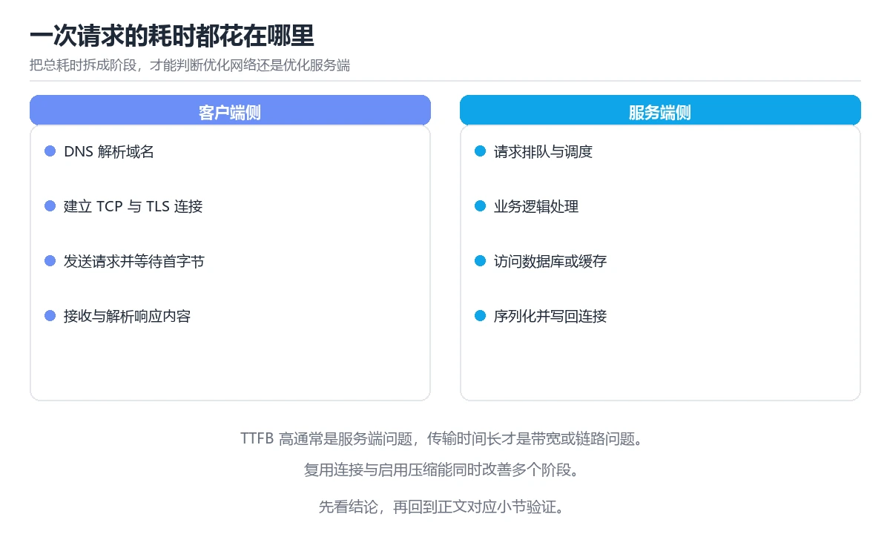

# 图解一次网页请求的完整链路

> 内容更新时间：2026-10-06 · 学习阶段：进阶 · 预计用时：30 分钟

## 学习目标

- 能用自己的话解释图解一次网页请求的完整链路解决了什么问题，而不是只背术语。
- 能说清 「HTTP」、「DNS」、「TLS」、「渲染」 之间的关系，并分别举出一个例子。
- 能把 HTTP 放回「图解一次网页请求的完整链路」的知识体系，说明它和 DNS 的边界。
- 能完成本课练习，并用验收标准检查自己的结果。

> 一句话摘要：DNS、TCP、TLS、HTTP 与渲染五段时序，以及每段的优化手段。

## 前置知识

- 先完成上一课《图解并发调度：线程、协程与 Goroutine》；如果已经掌握，可以直接用本课练习自测。
- 本课阶段：进阶。建议先完成「图解并发调度：线程、协程与 Goroutine」，或确认自己能独立跑通正文里的 time_starttransfer 示例。
- 开始前先复习：HTTP、DNS、TLS。
- 看不懂就直接缩小例子：只保留 HTTP 相关的两行输入，跑通后再加回其余部分。


## 一句话说清

在浏览器地址栏敲下回车到看见页面，中间至少经历
**DNS 解析 → TCP 握手 → TLS 握手 → HTTP 请求响应 → 浏览器渲染**五段。
每一段都有自己的耗时，优化前先看清时间花在哪一段。

## 全链路时序图

```text
浏览器                                    服务器
   │
   │ ① DNS 解析：example.com → 93.184.216.34
   │   （先查本地缓存 → hosts → 递归解析）
   │
   │ ② TCP 三次握手
   ├──── SYN ─────────────────────────────►│
   │◄─── SYN + ACK ────────────────────────┤
   ├──── ACK ─────────────────────────────►│
   │
   │ ③ TLS 握手（HTTPS 才有）
   ├──── ClientHello ─────────────────────►│
   │◄─── ServerHello + 证书 ───────────────┤
   ├──── 密钥交换 + Finished ─────────────►│
   │◄─── Finished ─────────────────────────┤
   │
   │ ④ HTTP 请求与响应
   ├──── GET /index.html ─────────────────►│
   │◄─── 200 OK + HTML ────────────────────┤
   │
   │ ⑤ 解析与渲染
   │   HTML → DOM 树
   │   CSS  → CSSOM
   │   DOM + CSSOM → 渲染树 → 布局 → 绘制 → 合成
   │
   ▼ 首屏可见
```

## 每段耗时怎么量

```bash
curl -w "\nDNS: %{time_namelookup}s\nTCP: %{time_connect}s\nTLS: %{time_appconnect}s\nTTFB: %{time_starttransfer}s\n总计: %{time_total}s\n" \
  -o /dev/null -s https://example.com
```

| 指标 | 含义 | 变慢常见原因 |
| --- | --- | --- |
| `time_namelookup` | DNS 解析耗时 | DNS 服务器远、无缓存 |
| `time_connect` | TCP 握手耗时 | 网络距离远、丢包 |
| `time_appconnect` | TLS 握手耗时 | 证书链长、未启用会话复用 |
| `time_starttransfer` | 首字节时间 TTFB | 服务端处理慢、数据库慢 |
| `time_total` | 总耗时 | 内容太大、无压缩 |

## 浏览器渲染的五步

```text
HTML 字节 ──► 分词 ──► DOM 树
CSS  字节 ──► 解析 ──► CSSOM
                        │
          DOM + CSSOM ──► 渲染树（Render Tree）
                        │
                        ▼
                     布局 Layout（算位置与大小）
                        │
                        ▼
                     绘制 Paint（填像素）
                        │
                        ▼
                     合成 Composite（GPU 合成图层）
```

| 阶段 | 触发变化 | 代价 |
| --- | --- | --- |
| 布局 | 宽高、位置、字体大小 | 最高，重排整棵树 |
| 绘制 | 颜色、背景、阴影 | 中 |
| 合成 | `transform`、`opacity` | 最低，可交给 GPU |

**结论**：动画优先改 `transform` 与 `opacity`，避免触发布局。

## 关键性能指标落在哪一段

| 指标 | 含义 | 对应阶段 |
| --- | --- | --- |
| TTFB | 首字节时间 | DNS + 连接 + 服务端处理 |
| FCP | 首次内容绘制 | 渲染开始 |
| LCP | 最大内容绘制 | 主要内容可见 |
| CLS | 累积布局偏移 | 渲染稳定性 |
| INP | 交互响应 | 主线程是否被阻塞 |

## 优化手段与对应阶段

| 阶段 | 优化手段 |
| --- | --- |
| DNS | 使用可靠 DNS、`dns-prefetch` |
| TCP / TLS | 就近部署、开启 TLS 1.3 与会话复用、HTTP/2 多路复用 |
| 服务端 | 加缓存、优化慢查询、CDN 回源优化 |
| 传输 | 压缩（gzip / brotli）、开启缓存头、减少体积 |
| 渲染 | 关键 CSS 内联、脚本 `defer`、图片预留尺寸 |
| 交互 | 拆分长任务、Web Worker、虚拟列表 |

## 常见错误与排查

> 说明：本表由《图解一次网页请求的完整链路》的核心知识整理（2026-10-07），人工复核进度见 docs/content_review_batches.md。

| 易错点 | 容易踩的做法 | 正确结论 |
| --- | --- | --- |
| 只关注总耗时 | 分不清是连接慢还是服务端慢 | 按解析、连接、传输与服务端分段时间定位 |
| 忽略缓存与重定向 | 重复请求拖慢加载 | 检查缓存命中与重定向链路 |
| 忽略连接复用 | 频繁建立连接增加延迟 | 复用连接并控制并发数量 |



## 本课小结

- 一次请求的成本分布在 **DNS、连接、TLS、服务端、传输、渲染** 六处。
- 排障顺序永远是：**先测量分段耗时，再针对最慢的一段优化**。
- 用户感知的性能由 LCP、CLS、INP 三个指标共同决定，而不是单一的总耗时。

## 补充：HTTP 版本差异、缓存协商与分段测量

### 三个版本的连接模型

```text
HTTP/1.1
  一个连接同时只处理一个请求
  → 浏览器开 6 条并发连接，队头阻塞（HOL）明显

HTTP/2
  单连接多路复用：多个流交织在同一连接上
  → 解决了应用层队头阻塞
  → 但 TCP 层丢包仍会阻塞所有流（TCP 层 HOL）

HTTP/3
  基于 QUIC（UDP）：流之间真正独立
  → 一个流丢包不影响其他流
  → 连接建立更快（0-RTT/1-RTT），并内置加密
```

| 维度 | HTTP/1.1 | HTTP/2 | HTTP/3 |
| --- | --- | --- | --- |
| 传输层 | TCP | TCP | QUIC over UDP |
| 多路复用 | 无 | 有 | 有 |
| 队头阻塞 | 应用层 | TCP 层 | 基本消除 |
| 握手往返 | TCP+TLS 多次 | 同左（可复用） | 1-RTT，复用到 0-RTT |
| 部署要求 | 无 | TLS 基本必须 | UDP 可达 |

### 缓存协商的完整流程

```text
第一次请求
  GET /app.js
  ← 200 OK + Cache-Control: max-age=3600 + ETag: "abc123"

一小时内再次请求
  → 直接用本地缓存，不发请求

一小时后
  GET /app.js
  If-None-Match: "abc123"
  ← 304 Not Modified（无正文，省带宽）

内容变了
  ← 200 OK + 新 ETag: "def456"
```

| 头 | 作用 | 注意 |
| --- | --- | --- |
| `Cache-Control` | 缓存策略 | `no-cache` 仍需校验，`no-store` 完全不存 |
| `ETag` / `If-None-Match` | 内容指纹校验 | 精度高，推荐 |
| `Last-Modified` / `If-Modified-Since` | 时间校验 | 秒级精度 |
| `Vary` | 按哪些请求头区分缓存 | 设置过宽会降低命中率 |

### 分段测量：三条命令

```bash
# 1. 分段耗时（DNS / 连接 / TLS / 首字节 / 总时长）
curl -w "\nDNS %{time_namelookup}s\nTCP %{time_connect}s\nTLS %{time_appconnect}s\nTTFB %{time_starttransfer}s\n总 %{time_total}s\n" \
  -o /dev/null -s https://example.com

# 2. 看响应头是否可缓存、是否命中 CDN
curl -sI https://example.com | grep -iE 'cache-control|etag|age|via|x-cache'

# 3. 复现压缩与协议差异
curl -s -o /dev/null -w '%{size_download} 字节 %{http_version}\n' \
  -H 'Accept-Encoding: br,gzip' https://example.com
```

```text
四个头部的诊断含义
  Age: 120          → 由 CDN 缓存的副本，已存在 120 秒
  X-Cache: HIT      → 边缘节点命中
  Via: 1.1 varnish  → 经过了缓存代理
  Content-Encoding: br  → 使用了 Brotli 压缩
```

### 浏览器侧的三个关键观察

| 工具/面板 | 看什么 | 常见结论 |
| --- | --- | --- |
| Network → Timing | 五段耗时分布 | 哪一段最长就优化哪一段 |
| Performance → Frames | 是否掉帧 | 掉帧通常来自长任务 |
| Lighthouse | LCP/CLS/INP | 按指标定位具体资源 |

```text
常见因果关系速查
  TTFB 高 → 服务端或数据库慢，或未命中缓存
  内容下载慢 → 未压缩、资源太大、未用 CDN
  渲染慢 → 关键 CSS 阻塞、脚本同步加载
  交互慢 → 主线程长任务
```

### 自查清单

- [ ] 能说出 HTTP/1.1、2、3 的队头阻塞分别在哪一层
- [ ] 能为静态资源设计「长缓存 + 哈希文件名」策略
- [ ] 会用 `curl -w` 分段定位耗时
- [ ] 能从响应头判断是否命中 CDN 缓存
- [ ] 知道 TTFB、LCP、INP 各自对应哪一段

## 动手练习

> 本课练习重点：围绕「HTTP、DNS、TLS」完成复述、实验和交付，每个结果都要能被别人检查。

先不看原图手绘 HTTP 的流程，再标出状态变化，最后解释关键一步。

### 练习 1：建立心智模型（10 分钟）

合上教程，用 3～5 句话回答：

1. 图解一次网页请求的完整链路解决了什么问题？
2. 如果没有它，会出现什么具体后果？
3. 它和「DNS」是什么关系？

验收标准：回答里必须出现 HTTP，并写出一个让结论失效的边界条件。

### 练习 2：做一次可控实验（20 分钟）

从正文中选一个最小示例，完成以下操作：

1. 先预测修改一个参数、输入或步骤后的结果。
2. 再实际执行或逐步推演，记录真实结果。
3. 如果结果与预测不同，写出差异原因。

**验收标准**：五步记录要写进笔记——原例是 time_starttransfer，改动落在HTTP上，结论必须能被他人在同一环境里复现。

### 练习 3：交付一个小结果（30 分钟）

不看原图手绘一遍流程，再用自己的话指出图中的关键状态变化。

任务要求：

- 结果必须能被别人检查，不能只写“我已经理解了”。
- 至少覆盖「HTTP」和「DNS」两个关键词。
- 写出 1 个仍然不确定的问题，以及下一步如何验证。

> 提示：时间有限时优先做练习 1 和练习 2；练习 3 可以拆成两次完成。

## 可运行练习

本节围绕图解一次网页请求的完整链路安排 3 个可交付任务，每个任务都要求留下可以复查的记录。

### 任务 1：用自己的话画出结构

不看书，用一张图说清「图解一次网页请求的完整链路」的结构，画完再对照骨架：

- 主干：一句话说清 → 全链路时序图 → 每段耗时怎么量 → 浏览器渲染的五步
- 连接线：在每条边上标出输入、输出与失败路径。
- 自检：能否用一句话说明HTTP与DNS的关系？

### 任务 2：做一次对比实验

**验收标准**：写出换方案的触发条件——当DNS的规模、精度或资源上限变化到什么程度时，「一句话说清」里的结论不再成立。

### 任务 3：迁移到自己的场景

**验收标准**：结论要附带 time_starttransfer 的可复现记录，并说明 HTTP 在「一句话说清」里的位置。

## 故障现场

### 现场 1：只关注总耗时

**症状**：在《图解一次网页请求的完整链路》的复现场景中，分不清是连接慢还是服务端慢。

**根因**：“分不清是连接慢还是服务端慢”只是表层结果。向上追溯会落到“只关注总耗时”这一步，因为它省略了《图解一次网页请求的完整链路》的约束，使实现行为和预期模型发生了偏离。

**修复**：针对《图解一次网页请求的完整链路》的问题，按解析、连接、传输与服务端分段时间定位。

**验证**：保留《图解一次网页请求的完整链路》里触发“分不清是连接慢还是服务端慢”的输入、版本和日志，按“按解析、连接、传输与服务端分段时间定位”完成修改后原样重放；只有失败现象消失且相邻场景仍可解释，才保留改动。

### 现场 2：忽略缓存与重定向

**症状**：在《图解一次网页请求的完整链路》的复现场景中，重复请求拖慢加载。

**根因**：触发点是把“忽略缓存与重定向”当成安全做法。它没有满足《图解一次网页请求的完整链路》要求的前提，因此先表现为“重复请求拖慢加载”；排查时先完整复现这一段，再核对输入、配置与依赖。

**修复**：针对《图解一次网页请求的完整链路》的问题，检查缓存命中与重定向链路。

**验证**：先在《图解一次网页请求的完整链路》中记录“忽略缓存与重定向”留下的失败证据，再执行“检查缓存命中与重定向链路”并重放；确认错误路径变为明确结果，且修复没有掩盖同类故障。

### 现场 3：忽略连接复用

**症状**：在《图解一次网页请求的完整链路》的复现场景中，频繁建立连接增加延迟。

**根因**：“频繁建立连接增加延迟”只是表层结果。向上追溯会落到“忽略连接复用”这一步，因为它省略了《图解一次网页请求的完整链路》的约束，使实现行为和预期模型发生了偏离。

**修复**：针对《图解一次网页请求的完整链路》的问题，复用连接并控制并发数量。

**验证**：在《图解一次网页请求的完整链路》中按“复用连接并控制并发数量”调整后，从“忽略连接复用”的触发条件重放同一条路径，确认“频繁建立连接增加延迟”不再出现，并补一个相邻边界用例检查没有引入新问题。

## 深入补充：图解一次网页请求的完整链路 的取舍与边界

### 一、把概念放回真实约束

学习图解一次网页请求的完整链路时，最容易只记住结论而忽略前提。先写出三个约束：数据规模、时间预算、可接受的失败方式；再判断 HTTP 与 DNS 在这些约束下是否仍然成立。只要约束改变，原来的最优解就可能变成错误解。

| 观察到的现象 | 背后的机制 | 验证方式 | 常见误判 |
| --- | --- | --- | --- |
| 延迟突然升高 | 队列堆积或重传 | 分段计时与指标对照 | 只盯平均值 |
| 状态看似随机 | 并发交错或缓存失效 | 固定随机种子复现 | 把时序问题当逻辑错误 |
| 结果与预期不符 | 默认值与边界规则 | 构造最小输入 | 忽略版本差异 |

### 二、三个容易混淆的边界

1. 澄清输入与目标。先写清「图解一次网页请求的完整链路」要解决的问题、合法输入范围和成功标准，再进入后续步骤。
2. **把“平均值”当成“全部”**：HTTP 的指标好看，不代表尾部请求、冷启动或失败重试也好看。
3. **把“当前版本”当成“永久行为”**：DNS 依赖的默认值、API 或性能特征都可能随版本变化，需要固定版本并保留回归用例。

### 三、一个生产场景

假设团队要在真实系统里使用图解一次网页请求的完整链路：第一周先做小流量验证，记录 HTTP 的基线与异常；第二周扩大输入规模，观察 DNS 是否成为瓶颈；第三周再做故障演练，主动注入超时、重复请求和依赖不可用，确认系统能降级、能重试、能恢复。每一步都要留下指标、日志和结论，而不是只留下“感觉更快了”。

### 四、自测清单

- 能否用一句话说出图解一次网页请求的完整链路解决的核心问题与不适用场景？
- 能否画出 HTTP 的数据流或状态变化，并标出失败路径？
- 能否给出一个反例，证明 HTTP 的结论在边界条件下不成立？
- 能否写出一条可复现的验证命令，让别人独立得到相同结论？

## 本课复习清单

离开本课前，逐项确认：

- [ ] 不看解析，能说出「`curl -w` 输出中 `time_appconnect` 表示的是？」的判断依据。
- [ ] 不看解析，能说出「TTFB 偏高，最可能与哪一段有关？」的判断依据。
- [ ] 不看解析，能说出「做动画时优先修改哪两个属性，代价最低？」的判断依据。
- [ ] 不看解析，能说出「为避免累积布局偏移（CLS），图片应该？」的判断依据。
- [ ] 至少运行一次 time_starttransfer 的示例，记录输入、输出和 HTTP 的边界情况。
- [ ] 把本课最容易混淆的两个概念写成一句话对照。

| 复盘项 | 记录 |
| --- | --- |
| 已经能独立解释的考点 |  |
| 仍然说不清的概念 |  |
| 下一步验证动作 |  |

## 术语速查

| 术语 | 一句话说明 |
| --- | --- |
| `TLS` | 在传输层之上提供加密、身份认证和完整性校验的安全协议。 |
| `DNS 解析` | 把域名换成 IP 的第一步，解析慢会直接推后后面的所有阶段。 |
| `首字节时间` | 从发出请求到收到第一个字节的时间，包含网络往返与服务端处理。 |
| `缓存协商` | 用 Cache-Control 与 ETag 决定是否复用本地副本，命中时返回 304 省掉重复传输。 |

## 考点精讲

### 考点 1：多选辨析·HTTP

- **题目**：围绕“图解一次网页请求的完整链路”中的 HTTP、DNS、TLS，下列哪两项是本课强调的实践判断？
- **判断依据**：本课把图解一次网页请求的完整链路拆成概念、示例与故障现场三部分，因此判断 HTTP 时必须同时交代输入、输出和失败路径，这使“学习 HTTP 时要同时说明输入、输出和失败路径，不能只看正常流程”成立。在图解一次网页请求的完整链路里，判断 DNS 时要固定版本与边界输入，所以“验证 DNS 时要固定版本并覆盖边界输入，结论才可复现”才可复现。

### 考点 2：代码补全·HTTP

- **题目**：下面这段代码摘自「图解一次网页请求的完整链路」的正文示例。关于这段代码，下面哪一项说法与实际内容相符？
- **判断依据**：题干的正确项是这段代码只做静态声明，没有循环、分支或可观察输出，在「图解一次网页请求的完整链路」里它只能证明HTTP相关约束存在，不能替代真实运行证据。这段代码出自「图解一次网页请求的完整链路」的正文示例，围绕HTTP、DNS、TLS展开；把输入或边界换成空值、极值或失败情况后，结论要以「图解一次网页请求的完整链路」的实际运行结果为准。回到「图解一次网页请求的完整链路」的正文示例，用“下面这段代码摘自图解一次网页请求”走一遍HTTP、DNS、TLS的完整流程，能复现的结论才可以保留。

### 考点 3：概念判断·HTTP

- **题目**：做动画时优先修改哪两个属性，代价最低？
- **判断依据**：在「图解一次网页请求的完整链路」里，transform 与 opacity 通常只需合成，跳过布局与绘制。在「图解一次网页请求的完整链路」里，「width 与 height」、「margin 与 padding」、「top 与 left」都会触发几何变化，进而引起重排，代价最高。

### 考点 4：概念判断·HTTP

- **题目**：为避免累积布局偏移（CLS），图片应该？
- **判断依据**：在「图解一次网页请求的完整链路」里，结论应落在「提前预留宽高或使用 aspect-ratio」。预留尺寸能让浏览器提前占位，避免加载后内容跳动。在「图解一次网页请求的完整链路」里，这道题要求区分概念与边界，「提前预留宽高或使用 aspect-ratio」只有在题干给出的前提下才成立，而「懒加载即可」、「统一用背景图，但这会引入新的复杂度，需要额外的验证与维护」缺少同一组条件。

### 考点 5：填空·HTTP

- **题目**：补全代码：「图解一次网页请求的完整链路」示例中，下面这行代码缺少哪个关键字或函数名？请填入 ____。 `│ ① DNS 解析：____.com → 93.184.216.34`
- **判断依据**：在「图解一次网页请求的完整链路」里，example。回到「图解一次网页请求的完整链路」的正文示例，用“补全代码”走一遍HTTP、DNS、TLS的完整流程，能复现的结论才可以保留。回到HTTP、DNS、TLS本身再看一遍：只有“example”与题干“example”的前提一致，结论才成立。

## 复习与自测

- [ ] 能用一句话说明「一句话说清」解决什么问题。
- [ ] 能把「全链路时序图」的判断标准套到一个新例子上。
- [ ] 能说清「每段耗时怎么量」的结论，并说出它的适用边界。
- [ ] 能用自己的话复述「浏览器渲染的五步」，并各举一个正例和反例。
- [ ] 能解释「关键性能指标落在哪一段」里最容易混淆的两个概念。
- [ ] 能不看正文写出「优化手段与对应阶段」的关键步骤。

## English Overview

**Title:** HTTP Request Timeline Illustrated

**Summary:** DNS, TCP, TLS, HTTP and rendering stages with optimizations.

**Category:** Visual Guide
**Level:** 进阶
**Key terms:** HTTP, DNS, TLS, 渲染, 性能指标

## 内容元数据

- 内容版本：v2.0
- 最后更新：2026-10-06
- 学习阶段：进阶
- 适用环境：通用图解与系统原理
；本课聚焦 HTTP。
- 内容来源：内置结构化课程与工程实践整理
- 相关主题：HTTP、DNS、TLS、渲染、性能指标
- 质量版本：P0 测验标准 + P1 覆盖扩展 + P2 体验补全

## 参考资料与复核

- 最后复核：2026-10-04
- 下次复核：2027-07-24
- 复核范围：版本兼容、API 行为、安全建议与工程实践
- 来源性质：官方文档、标准或权威教材；正文为离线教学重组

| 参考资料 | 本课用途 |
| --- | --- |
| [Cloudflare Learning](https://www.cloudflare.com/learning/) | 网络流程与概念图解 |
| [MDN 浏览器工作原理](https://developer.mozilla.org/docs/Web/Performance/How_browsers_work) | 从请求到渲染的流程 |
| [Diagrams.net 文档](https://www.drawio.com/doc/) | 通用图表绘制 |

> 「图解一次网页请求的完整链路」的链接用于离线阅读后的延伸核对；App 不会自动联网。
