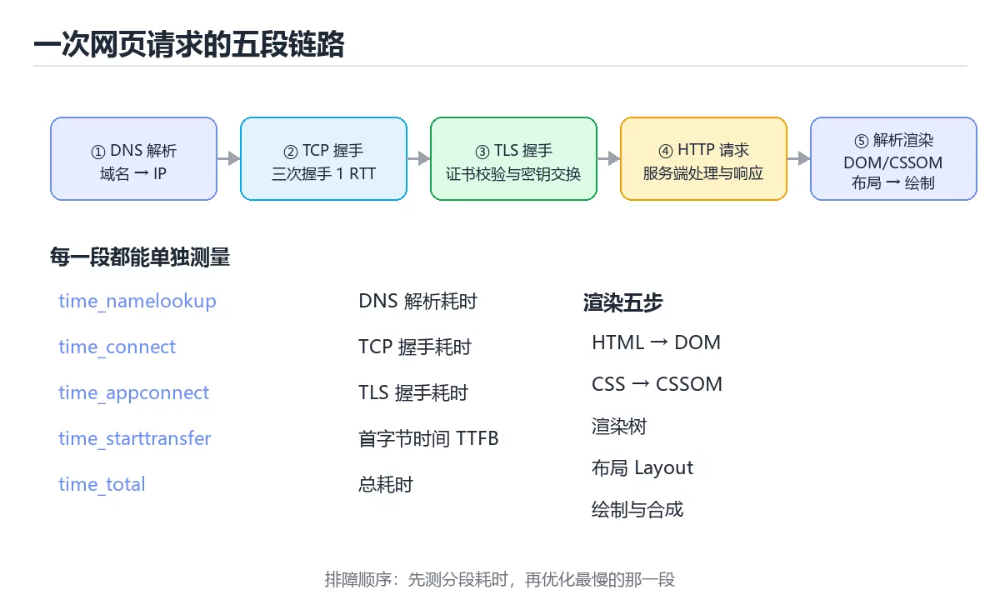

# 图解一次网页请求的完整链路

> 内容更新时间：2026-10-03 · 学习阶段：进阶 · 预计用时：20 分钟

## 学习目标

- 能用自己的话解释「图解一次网页请求的完整链路」解决了什么问题，而不是只背术语。
- 能说清 「HTTP」、「DNS」、「TLS」、「渲染」 之间的关系，并分别举出一个例子。
- 能把本课知识放回「图解专题」的知识体系，说明它和相邻主题的边界。
- 能完成本课练习，并用验收标准检查自己的结果。

> 一句话摘要：DNS、TCP、TLS、HTTP 与渲染五段时序，以及每段的优化手段。

## 前置知识

- 先完成上一课《图解并发调度：线程、协程与 Goroutine》；如果已经掌握，可以直接用本课练习自测。
- 本课阶段：进阶。建议先掌握同一分类的基础课程，并能独立运行正文中的最小示例。
- 开始前先复习：HTTP、DNS、TLS。
- 如果某一步看不懂，先记录具体卡点，完成练习后再回头读一遍。




## 一句话说清

在浏览器地址栏敲下回车到看见页面，中间至少经历
**DNS 解析 → TCP 握手 → TLS 握手 → HTTP 请求响应 → 浏览器渲染**五段。
每一段都有自己的耗时，优化前先看清时间花在哪一段。

## 全链路时序图

```text
浏览器                                    服务器
   │
   │ ① DNS 解析：example.com → 93.184.216.34
   │   （先查本地缓存 → hosts → 递归解析）
   │
   │ ② TCP 三次握手
   ├──── SYN ─────────────────────────────►│
   │◄─── SYN + ACK ────────────────────────┤
   ├──── ACK ─────────────────────────────►│
   │
   │ ③ TLS 握手（HTTPS 才有）
   ├──── ClientHello ─────────────────────►│
   │◄─── ServerHello + 证书 ───────────────┤
   ├──── 密钥交换 + Finished ─────────────►│
   │◄─── Finished ─────────────────────────┤
   │
   │ ④ HTTP 请求与响应
   ├──── GET /index.html ─────────────────►│
   │◄─── 200 OK + HTML ────────────────────┤
   │
   │ ⑤ 解析与渲染
   │   HTML → DOM 树
   │   CSS  → CSSOM
   │   DOM + CSSOM → 渲染树 → 布局 → 绘制 → 合成
   │
   ▼ 首屏可见
```

## 每段耗时怎么量

```bash
curl -w "\nDNS: %{time_namelookup}s\nTCP: %{time_connect}s\nTLS: %{time_appconnect}s\nTTFB: %{time_starttransfer}s\n总计: %{time_total}s\n" \
  -o /dev/null -s https://example.com
```

| 指标 | 含义 | 变慢常见原因 |
| --- | --- | --- |
| `time_namelookup` | DNS 解析耗时 | DNS 服务器远、无缓存 |
| `time_connect` | TCP 握手耗时 | 网络距离远、丢包 |
| `time_appconnect` | TLS 握手耗时 | 证书链长、未启用会话复用 |
| `time_starttransfer` | 首字节时间 TTFB | 服务端处理慢、数据库慢 |
| `time_total` | 总耗时 | 内容太大、无压缩 |

## 浏览器渲染的五步

```text
HTML 字节 ──► 分词 ──► DOM 树
CSS  字节 ──► 解析 ──► CSSOM
                        │
          DOM + CSSOM ──► 渲染树（Render Tree）
                        │
                        ▼
                     布局 Layout（算位置与大小）
                        │
                        ▼
                     绘制 Paint（填像素）
                        │
                        ▼
                     合成 Composite（GPU 合成图层）
```

| 阶段 | 触发变化 | 代价 |
| --- | --- | --- |
| 布局 | 宽高、位置、字体大小 | 最高，重排整棵树 |
| 绘制 | 颜色、背景、阴影 | 中 |
| 合成 | `transform`、`opacity` | 最低，可交给 GPU |

**结论**：动画优先改 `transform` 与 `opacity`，避免触发布局。

## 关键性能指标落在哪一段

| 指标 | 含义 | 对应阶段 |
| --- | --- | --- |
| TTFB | 首字节时间 | DNS + 连接 + 服务端处理 |
| FCP | 首次内容绘制 | 渲染开始 |
| LCP | 最大内容绘制 | 主要内容可见 |
| CLS | 累积布局偏移 | 渲染稳定性 |
| INP | 交互响应 | 主线程是否被阻塞 |

## 优化手段与对应阶段

| 阶段 | 优化手段 |
| --- | --- |
| DNS | 使用可靠 DNS、`dns-prefetch` |
| TCP / TLS | 就近部署、开启 TLS 1.3 与会话复用、HTTP/2 多路复用 |
| 服务端 | 加缓存、优化慢查询、CDN 回源优化 |
| 传输 | 压缩（gzip / brotli）、开启缓存头、减少体积 |
| 渲染 | 关键 CSS 内联、脚本 `defer`、图片预留尺寸 |
| 交互 | 拆分长任务、Web Worker、虚拟列表 |

## 新手最容易踩的六个坑

| 坑 | 现象 | 正确做法 |
| --- | --- | --- |
| 只看总耗时 | 不知道瓶颈在哪 | 用 `curl -w` 或 devtools 分段看 |
| 以为慢都是服务端 | 其实是 DNS 或 TLS | 先看分段数据 |
| 首屏加载大量 JS | 白屏时间长 | 代码分割、按需加载 |
| 图片不预留尺寸 | 布局跳动，CLS 高 | 设宽高或 `aspect-ratio` |
| 用同步脚本阻塞解析 | 首屏延迟 | 用 `defer` 或 `async` |
| 忽略缓存头 | 每次都全量下载 | 设 `Cache-Control` 与 ETag |

## 本课小结
- 一次请求的成本分布在 **DNS、连接、TLS、服务端、传输、渲染** 六处。
- 排障顺序永远是：**先测量分段耗时，再针对最慢的一段优化**。
- 用户感知的性能由 LCP、CLS、INP 三个指标共同决定，而不是单一的总耗时。


## 补充：HTTP 版本差异、缓存协商与分段测量

### 三个版本的连接模型

```text
HTTP/1.1
  一个连接同时只处理一个请求
  → 浏览器开 6 条并发连接，队头阻塞（HOL）明显

HTTP/2
  单连接多路复用：多个流交织在同一连接上
  → 解决了应用层队头阻塞
  → 但 TCP 层丢包仍会阻塞所有流（TCP 层 HOL）

HTTP/3
  基于 QUIC（UDP）：流之间真正独立
  → 一个流丢包不影响其他流
  → 连接建立更快（0-RTT/1-RTT），并内置加密
```

| 维度 | HTTP/1.1 | HTTP/2 | HTTP/3 |
| --- | --- | --- | --- |
| 传输层 | TCP | TCP | QUIC over UDP |
| 多路复用 | 无 | 有 | 有 |
| 队头阻塞 | 应用层 | TCP 层 | 基本消除 |
| 握手往返 | TCP+TLS 多次 | 同左（可复用） | 1-RTT，复用到 0-RTT |
| 部署要求 | 无 | TLS 基本必须 | UDP 可达 |

### 缓存协商的完整流程

```text
第一次请求
  GET /app.js
  ← 200 OK + Cache-Control: max-age=3600 + ETag: "abc123"

一小时内再次请求
  → 直接用本地缓存，不发请求

一小时后
  GET /app.js
  If-None-Match: "abc123"
  ← 304 Not Modified（无正文，省带宽）

内容变了
  ← 200 OK + 新 ETag: "def456"
```

| 头 | 作用 | 注意 |
| --- | --- | --- |
| `Cache-Control` | 缓存策略 | `no-cache` 仍需校验，`no-store` 完全不存 |
| `ETag` / `If-None-Match` | 内容指纹校验 | 精度高，推荐 |
| `Last-Modified` / `If-Modified-Since` | 时间校验 | 秒级精度 |
| `Vary` | 按哪些请求头区分缓存 | 设置过宽会降低命中率 |

### 分段测量：三条命令

```bash
# 1. 分段耗时（DNS / 连接 / TLS / 首字节 / 总时长）
curl -w "\nDNS %{time_namelookup}s\nTCP %{time_connect}s\nTLS %{time_appconnect}s\nTTFB %{time_starttransfer}s\n总 %{time_total}s\n" \
  -o /dev/null -s https://example.com

# 2. 看响应头是否可缓存、是否命中 CDN
curl -sI https://example.com | grep -iE 'cache-control|etag|age|via|x-cache'

# 3. 复现压缩与协议差异
curl -s -o /dev/null -w '%{size_download} 字节 %{http_version}\n' \
  -H 'Accept-Encoding: br,gzip' https://example.com
```

```text
四个头部的诊断含义
  Age: 120          → 由 CDN 缓存的副本，已存在 120 秒
  X-Cache: HIT      → 边缘节点命中
  Via: 1.1 varnish  → 经过了缓存代理
  Content-Encoding: br  → 使用了 Brotli 压缩
```

### 浏览器侧的三个关键观察

| 工具/面板 | 看什么 | 常见结论 |
| --- | --- | --- |
| Network → Timing | 五段耗时分布 | 哪一段最长就优化哪一段 |
| Performance → Frames | 是否掉帧 | 掉帧通常来自长任务 |
| Lighthouse | LCP/CLS/INP | 按指标定位具体资源 |

```text
常见因果关系速查
  TTFB 高 → 服务端或数据库慢，或未命中缓存
  内容下载慢 → 未压缩、资源太大、未用 CDN
  渲染慢 → 关键 CSS 阻塞、脚本同步加载
  交互慢 → 主线程长任务
```

### 自查清单

- [ ] 能说出 HTTP/1.1、2、3 的队头阻塞分别在哪一层
- [ ] 能为静态资源设计「长缓存 + 哈希文件名」策略
- [ ] 会用 `curl -w` 分段定位耗时
- [ ] 能从响应头判断是否命中 CDN 缓存
- [ ] 知道 TTFB、LCP、INP 各自对应哪一段

## 动手练习


> 本课练习重点：围绕「HTTP、DNS、TLS」完成复述、实验和交付，每个结果都要能被别人检查。

先不看原图手绘流程，再标出状态变化，最后用自己的话解释关键一步。

### 练习 1：建立心智模型（10 分钟）

合上教程，用 3～5 句话回答：

1. 「图解一次网页请求的完整链路」解决了什么问题？
2. 如果没有它，会出现什么具体后果？
3. 它和「DNS」是什么关系？

**验收标准**：至少出现一个本课关键词，并写出一个反例、边界条件或失效场景。

### 练习 2：做一次可控实验（20 分钟）

从正文中选一个最小示例，完成以下操作：

1. 先预测修改一个参数、输入或步骤后的结果。
2. 再实际执行或逐步推演，记录真实结果。
3. 如果结果与预测不同，写出差异原因。

**验收标准**：留下「原例 → 改动 → 预测 → 结果 → 原因」五步记录。

### 练习 3：交付一个小结果（30 分钟）

不看原图手绘一遍流程，再用自己的话指出图中的关键状态变化。

任务要求：

- 结果必须能被别人检查，不能只写“我已经理解了”。
- 至少覆盖「HTTP」和「DNS」两个关键词。
- 写出 1 个仍然不确定的问题，以及下一步如何验证。

> 提示：时间有限时优先做练习 1 和练习 2；练习 3 可以拆成两次完成。


## 考点精讲：把测验题还原成判断过程

本课有 5 个判断点。先自己作答，再看「判断依据」；如果结论正确但理由不完整，回到正文对应章节补足概念。

### 考点 1：`curl -w` 输出中 `time_appconnect` 表示的是？

- **正确判断**：TLS 握手完成的耗时
- **判断依据**：正确答案是「TLS 握手完成的耗时」，本课在「本课小结」中说明：一次请求的成本分布在 DNS、连接、TLS、服务端、传输、渲染 六处。timeappconnect 是应用层连接（含 TLS 握手）完成的时刻。本课还在「本课小结」中说明：用户感知的性能由 LCP、CLS、INP 三个指标共同决定，而不是单一的总耗时。本课还在「一句话说清」中说明：每一段都有自己的耗时，优化前先看清时间花在哪一段。
- **迁移检查**：把题干里的一个条件换成边界值，原来的结论还成立吗？写出判断过程。

### 考点 2：TTFB 偏高，最可能与哪一段有关？

- **正确判断**：DNS 解析
- **判断依据**：正确答案是「DNS 解析」，本课在「一句话说清」中说明：DNS 解析 → TCP 握手 → TLS 握手 → HTTP 请求响应 → 浏览器渲染五段。TTFB 覆盖从请求发出到收到第一个字节的全过程，包含解析、连接与服务端处理。本课还在「一句话说清」中说明：在浏览器地址栏敲下回车到看见页面，中间至少经历。本课还在「本课小结」中说明：一次请求的成本分布在 DNS、连接、TLS、服务端、传输、渲染 六处。
- **迁移检查**：把题干里的一个条件换成边界值，原来的结论还成立吗？写出判断过程。

### 考点 3：做动画时优先修改哪两个属性，代价最低？

- **正确判断**：transform 与 opacity
- **判断依据**：transform 与 opacity 通常只需合成，跳过布局与绘制。「width 与 height」、「margin 与 padding」、「top 与 left」都会触发几何变化，进而引起重排，代价最高。针对「做动画时优先修改哪两个属性，代价最低，」，本课在「浏览器渲染的五步」中说明：结论：动画优先改 transform 与 opacity，避免触发布局。
- **迁移检查**：把题干里的一个条件换成边界值，原来的结论还成立吗？写出判断过程。

### 考点 4：为避免累积布局偏移（CLS），图片应该？

- **正确判断**：提前预留宽高或使用 aspect-ratio
- **判断依据**：正确答案是「提前预留宽高或使用 aspect-ratio」，这道题在问为避免累积布局偏移（CLS），图片应该，判断时要把题干限定的输入、边界与目标逐项对齐。预留尺寸能让浏览器提前占位，避免加载后内容跳动。课程摘要指出DNS，TCP，TLS，HTTP 与渲染五段时序，以及每段的优化手段，本课要判断的正是为避免累积布局偏移（CLS），图片应该。
- **迁移检查**：遮住选项，只根据定义复述一次答案，再回来看哪个选项与复述一致。

### 考点 5：补全代码：「图解一次网页请求的完整链路」示例中，下面这行代码缺少哪个关键字或函数名？请填入 ____。 `│ ① DNS 解析：____.com → 93.184.216.34`

- **正确判断**：example
- **判断依据**：正确答案是「example」，本课在「一句话说清」中说明：DNS 解析 → TCP 握手 → TLS 握手 → HTTP 请求响应 → 浏览器渲染五段。本课示例中还能看到 `-o /dev/null -s https://example.com` 这样的用法，说明该关键字在本课代码中承担实际功能。
- **迁移检查**：不看题干，用自己的话补全这句话，再与标准答案对照。

## 本课复习清单

离开本课前，逐项确认：

- [ ] 不看解析，能说出「`curl -w` 输出中 `time_appconnect` 表示的是？」的判断依据。
- [ ] 不看解析，能说出「TTFB 偏高，最可能与哪一段有关？」的判断依据。
- [ ] 不看解析，能说出「做动画时优先修改哪两个属性，代价最低？」的判断依据。
- [ ] 不看解析，能说出「为避免累积布局偏移（CLS），图片应该？」的判断依据。
- [ ] 不看解析，能说出「补全代码：「图解一次网页请求的完整链路」示例中，下面这行代码缺少哪个关键字或函数…」的判断依据。
- [ ] 至少运行一次本课示例，记录输入、输出和一个边界情况。
- [ ] 把本课最容易混淆的两个概念写成一句话对照。

| 复盘项 | 记录 |
| --- | --- |
| 已经能独立解释的考点 |  |
| 仍然说不清的概念 |  |
| 下一步验证动作 |  |

## English Overview

**Title:** HTTP Request Timeline Illustrated

**Summary:** DNS, TCP, TLS, HTTP and rendering stages with optimizations.

**Category:** Visual Guide  
**Level:** 进阶  
**Key terms:** HTTP, DNS, TLS, 渲染, 性能指标

> The full tutorial is written in Chinese. This bilingual overview helps English readers identify the topic, scope and key terms before studying the detailed examples.

## 内容元数据

- 内容版本：v2.0
- 最后更新：2026-10-03
- 学习阶段：进阶
- 适用环境：通用图解与系统原理
- 内容来源：内置结构化课程与工程实践整理
- 相关主题：HTTP、DNS、TLS、渲染、性能指标
- 质量版本：P0 测验标准 + P1 覆盖扩展 + P2 体验补全


## 参考资料与复核

- 最后复核：2026-10-04
- 下次复核：2027-04-04
- 复核范围：版本兼容、API 行为、安全建议与工程实践
- 来源性质：官方文档与标准；本课正文为离线教学重组，不复制原文

| 参考资料 | 本课用途 |
| --- | --- |
| [RFC Editor](https://www.rfc-editor.org/) | 协议与状态机 |
| [MDN Web Docs](https://developer.mozilla.org/) | 浏览器与网络流程 |

> 本课主题：DNS、TCP、TLS、HTTP 与渲染五段时序，以及每段的优化手段。

> App 完全离线展示文字链接，不会自动联网；需要延伸阅读时可复制链接到浏览器。

