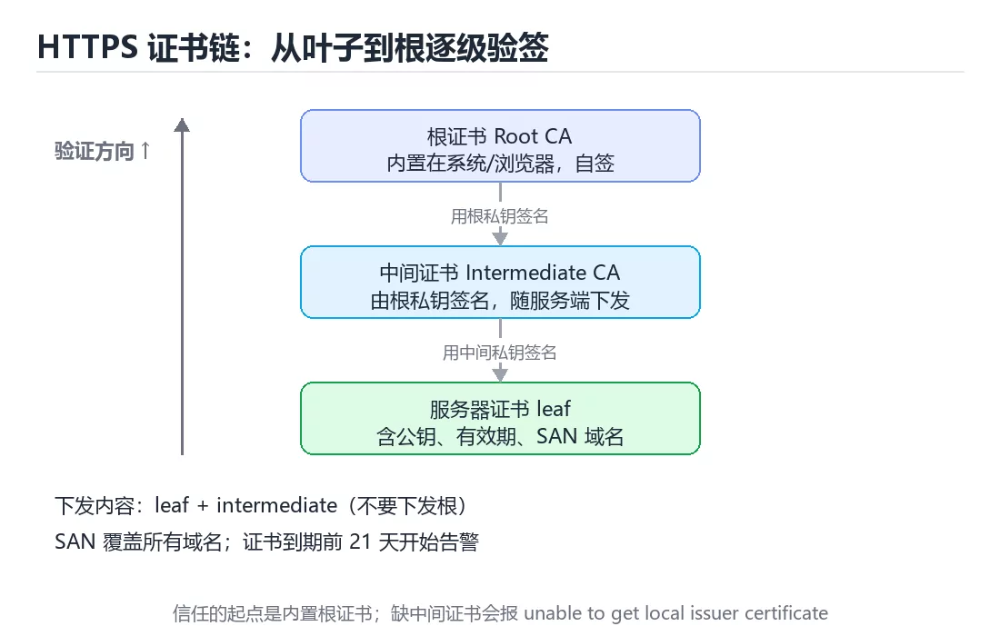
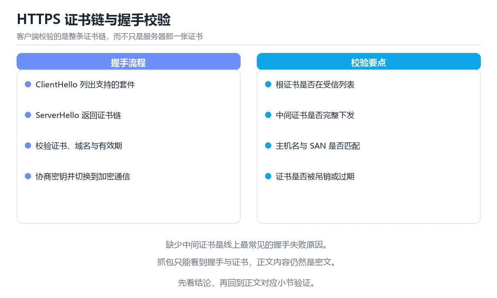

# 图解 HTTPS 证书链与 TLS 握手

> 内容更新时间：2026-10-06 · 学习阶段：进阶 · 预计用时：45 分钟

## 本节知识框架

**课程定位**：所属分类为「图解专题」，课程主题为「图解 HTTPS 证书链与 TLS 握手」，学习阶段为「进阶」，建议用时 45 分钟。

**本课要解决的主问题**：证书链结构、TLS 1.3 握手、命令验证与五类常见证书错误。

| 学习层次 | 要回答的问题 | 完成判据 |
| --- | --- | --- |
| 概念层 | 「图解 HTTPS 证书链与 TLS 握手」有哪些必须区分的对象与术语？ | 能用自己的话定义核心术语，并各举一个正例和一个反例。 |
| 机制层 | 这些对象按什么顺序发生作用，输入如何变成输出？ | 能画出或写出机制步骤，并说明每一步的失败条件。 |
| 应用层 | 什么场景适合使用「图解 HTTPS 证书链与 TLS 握手」，什么场景不适合？ | 能给出一个真实场景、一个最小示例和一个边界案例。 |
| 性能层 | 时间、空间、吞吐或延迟受哪些量影响？ | 能说出复杂度或性能瓶颈的证据来源；没有证据时明确写“材料未提供”。 |
| 复习层 | 怎样确认自己不是只记住了结论？ | 能独立完成本课自测，并把错误定位到概念、机制、示例或边界。 |

### 阅读路线

1. 先读「核心概念定义」，建立「HTTPS」等对象的精确定义。
2. 再读「原理与运行机制」，把定义串成可重复的过程。
3. 用「代码/协议/SQL 示例」验证过程，并只改一个条件观察结果变化。
4. 最后检查性能、易错点、知识关系与自测题，形成可复习的证据链。

**前置知识**：《图解 JVM 内存模型与垃圾回收》

**学习位置**：本课位于《图解 JVM 内存模型与垃圾回收》之后；如果前一课的自测不能通过，应先回补再继续。

**后续衔接**：下一课《图解 Kubernetes 调度与探针》会继续使用本课术语，学完后建议立即完成一次自测。

**教材衔接：学习目标**

- 能用自己的话解释图解 HTTPS 证书链与 TLS 握手解决了什么问题，而不是只背术语。
- 能说清 「HTTPS」、「证书链」、「TLS」、「SAN」 之间的关系，并分别举出一个例子。
- 能把 HTTPS 放回「图解 HTTPS 证书链与 TLS 握手」的知识体系，说明它和 证书链 的边界。
- 能完成本课练习，并用验收标准检查自己的结果。

> 一句话摘要：证书链结构、TLS 1.3 握手、命令验证与五类常见证书错误。

**教材衔接：前置知识**

- 先完成上一课《图解 JVM 内存模型与垃圾回收》；如果已经掌握，可以直接用本课练习自测。
- 本课阶段：进阶。建议先完成「图解 JVM 内存模型与垃圾回收」，或确认自己能独立跑通正文里的 CertificateVerify 示例。
- 开始前先复习：HTTPS、证书链、TLS。
- 卡在 HTTPS 上时不要跳过：把输入、预期和实际输出写成三行，再回头读正文。



**教材衔接：本课小结**

- 信任来自**证书链**：叶子 → 中间 → 根，逐级验签。
- TLS 1.3 把握手压到 1-RTT，复用可到 0-RTT，但要注意重放风险。
- 部署 HTTPS 三件事：**完整链、自动续期、配置体检**。

## 核心概念定义

> 在阅读《图解 HTTPS 证书链与 TLS 握手》时，术语第一次出现先给操作性定义，再给边界；正文说法与这里冲突时，以定义和可复现示例为准。

| 术语 | 操作性定义 | 本课中的边界 |
| --- | --- | --- |
| HTTPS | 在 HTTP 下使用 TLS 提供加密、身份认证和完整性保护。 | 仅在「图解 HTTPS 证书链与 TLS 握手」明确给出的输入、版本与资源条件下成立。 |
| 证书链 | 从站点证书经过中间证书到受信根证书的签名验证路径。 | 仅在「图解 HTTPS 证书链与 TLS 握手」明确给出的输入、版本与资源条件下成立。 |
| TLS | 传输层安全协议：握手协商密钥并用证书验证身份，之后的数据对称加密传输。 | 仅在「图解 HTTPS 证书链与 TLS 握手」明确给出的输入、版本与资源条件下成立。 |
| SAN | TLS 证书中列出可被该证书代表的域名或 IP，客户端据此校验主机名。 | 仅在「图解 HTTPS 证书链与 TLS 握手」明确给出的输入、版本与资源条件下成立。 |
| 续期 | 在证书或令牌到期前重新签发或更新，避免服务因过期而中断。 | 仅在「图解 HTTPS 证书链与 TLS 握手」明确给出的输入、版本与资源条件下成立。 |

### 定义如何使用

在「图解 HTTPS 证书链与 TLS 握手」中判断一个说法是否成立，先确认它使用的是哪个对象的定义，再检查输入规模、运行环境与失败路径。定义不是口号，而是后续推导、代码示例和自测题共享的约束。

## 原理与运行机制

### 机制总览

1. **建立输入**：把「HTTPS」按本课定义整理成可观察、可重复的输入条件。
2. **执行转换**：围绕「证书链」执行本课的核心步骤；每一步都记录中间状态，避免只看最终输出。
3. **产生输出**：得到「TLS」后，用正文示例或协议/SQL 结果核对输出是否符合预期。
4. **改变一个条件**：只替换一个边界条件或环境参数，观察「图解 HTTPS 证书链与 TLS 握手」的结论是否仍然成立。

| 阶段 | 关注对象 | 失败时应检查 |
| --- | --- | --- |
| 输入 | HTTPS | 类型、范围、编码、版本或前置状态是否满足定义。 |
| 处理 | 证书链 | 顺序、可见性、锁、路由、事务或调度规则是否被破坏。 |
| 输出 | TLS | 结果是否可复现，错误是否被正确传播而不是被吞掉。 |

本课的机制结论要用「图解 HTTPS 证书链与 TLS 握手」自己的示例验证。「图解 HTTPS 证书链与 TLS 握手」没有给出某个数量级、吞吐或内存数据时，本课把该判断标为“材料未提供”，不从相邻主题外推。

**教材衔接：一句话说清**

HTTPS 等于 HTTP 加 TLS。TLS 解决三个问题：**加密、完整性、身份认证**。
身份认证靠**证书链**，而信任的起点是系统或浏览器内置的**根证书**。

**教材衔接：深入补充：图解 HTTPS 证书链与 TLS 握手 的取舍与边界**

### 一、把概念放回真实约束

学习图解 HTTPS 证书链与 TLS 握手时，最容易只记住结论而忽略前提。先写出三个约束：数据规模、时间预算、可接受的失败方式；再判断 HTTPS 与 证书链 在这些约束下是否仍然成立。只要约束改变，原来的最优解就可能变成错误解。

| 观察到的现象 | 背后的机制 | 验证方式 | 常见误判 |
| --- | --- | --- | --- |
| 延迟突然升高 | 队列堆积或重传 | 分段计时与指标对照 | 只盯平均值 |
| 状态看似随机 | 并发交错或缓存失效 | 固定随机种子复现 | 把时序问题当逻辑错误 |
| 结果与预期不符 | 默认值与边界规则 | 构造最小输入 | 忽略版本差异 |

### 二、三个容易混淆的边界

1. 澄清输入与目标。先写清「图解 HTTPS 证书链与 TLS 握手」要解决的问题、合法输入范围和成功标准，再进入后续步骤。
2. **把“平均值”当成“全部”**：HTTPS 的指标好看，不代表尾部请求、冷启动或失败重试也好看。
3. **把“当前版本”当成“永久行为”**：证书链 依赖的默认值、API 或性能特征都可能随版本变化，需要固定版本并保留回归用例。

### 三、一个生产场景

假设团队要在真实系统里使用图解 HTTPS 证书链与 TLS 握手：第一周先做小流量验证，记录 HTTPS 的基线与异常；第二周扩大输入规模，观察 证书链 是否成为瓶颈；第三周再做故障演练，主动注入超时、重复请求和依赖不可用，确认系统能降级、能重试、能恢复。每一步都要留下指标、日志和结论，而不是只留下“感觉更快了”。

### 四、自测清单

- 能否用一句话说出图解 HTTPS 证书链与 TLS 握手解决的核心问题与不适用场景？
- 能否画出 HTTPS 的数据流或状态变化，并标出失败路径？
- 把 CertificateVerify 的输入推到边界，说明本课哪一条结论会先失效。
- 能否写出一条可复现的验证命令，让别人独立得到相同结论？

## 典型应用场景

| 场景 | 典型输入或前提 | 期望产物 |
| --- | --- | --- |
| 学习验证 | 使用本课最小示例和 HTTPS、证书链 | 能复现正文结论，并解释每一步。 |
| 工程落地 | 把「图解 HTTPS 证书链与 TLS 握手」放入真实模块或服务边界 | 输出可观测、失败可定位、参数可配置。 |
| 故障排查 | 只改一个版本、规模、输入或依赖条件 | 能区分概念错误、实现错误和环境差异。 |

判断「图解 HTTPS 证书链与 TLS 握手」的场景是否成立，标准是能否写出输入、处理、输出和失败路径；材料中没有出现的数据在本课标注为“材料未提供”，不用推测替代证据。

## 代码/协议/SQL 示例

以下代码、协议或 SQL 片段来自《图解 HTTPS 证书链与 TLS 握手》原文，保留原有语言标记与上下文；先预测《图解 HTTPS 证书链与 TLS 握手》示例的输出，再按正文步骤运行或推演，示例依赖外部环境时同时记录版本与输入。

**教材衔接：一张图看懂证书链**

```text
        ┌──────────────────────────────┐
        │  根证书 Root CA              │  ← 内置在系统/浏览器，自签
        │  subject = Root CA           │
        │  issuer  = Root CA           │
        └───────────────┬──────────────┘
                        │ 用根私钥签名
                        ▼
        ┌──────────────────────────────┐
        │  中间证书 Intermediate CA     │  ← 服务器通常一并下发
        │  subject = Intermediate CA   │
        │  issuer  = Root CA           │
        └───────────────┬──────────────┘
                        │ 用中间私钥签名
                        ▼
        ┌──────────────────────────────┐
        │  服务器证书 leaf              │  ← 部署在服务器上
        │  subject = example.com       │
        │  issuer  = Intermediate CA   │
        │  含公钥、有效期、SAN 域名      │
        └──────────────────────────────┘

验证方向：从叶子往上逐级验签，直到找到一个受信任的根
```

| 字段 | 作用 |
| --- | --- |
| `subject` | 这张证书发给谁 |
| `issuer` | 由谁签名 |
| `SAN` | 覆盖哪些域名（现代校验看它，不看 CN） |
| 有效期 | `notBefore` 到 `notAfter` |
| 公钥 | 用于密钥交换与签名校验 |

**教材衔接：TLS 1.3 握手（简化）**

```text
客户端                                          服务端
   │ ① ClientHello（版本、密码套件、随机数、密钥共享）      │
   ├──────────────────────────────────────────────────────►│
   │                                                       │
   │ ② ServerHello（选定参数、密钥共享）                     │
   │   + 证书链                                             │
   │   + CertificateVerify（用私钥签名，证明持有私钥）        │
   │   + Finished                                          │
   │◄──────────────────────────────────────────────────────┤
   │                                                       │
   │ ③ Finished                                            │
   ├──────────────────────────────────────────────────────►│
   │                                                       │
   ▼ 双方派生会话密钥，开始加密通信（1-RTT）                  ▼
```

| 版本 | 握手往返 | 特点 |
| --- | --- | --- |
| TLS 1.2 | 2-RTT | 兼容性好，配置复杂 |
| TLS 1.3 | 1-RTT，复用可 0-RTT | 更快、默认更安全 |

**注意**：0-RTT 有重放风险，只适合幂等的请求。

**教材衔接：用命令行验证证书链**

```bash
# 查看服务器下发的完整证书链
openssl s_client -connect example.com:443 -servername example.com -showcerts </dev/null

# 只看叶子证书的关键信息
echo | openssl s_client -connect example.com:443 -servername example.com 2>/dev/null \
  | openssl x509 -noout -subject -issuer -dates -ext subjectAltName

# 检查证书是否即将过期（7 天内）
echo | openssl s_client -connect example.com:443 2>/dev/null \
  | openssl x509 -noout -checkend 604800 && echo "7 天内不会过期"
```

**教材衔接：五类常见证书错误**

| 报错 | 原因 | 处理 |
| --- | --- | --- |
| `certificate has expired` | 证书过期 | 续期并配置自动续期 |
| `unable to get local issuer certificate` | 中间证书没下发 | 配置完整链 |
| `hostname mismatch` | SAN 里没有这个域名 | 重新签发或改域名 |
| `self signed certificate` | 自签证书 | 内网导入根证书或用正式 CA |
| `certificate revoked` | 证书被吊销 | 更换证书 |

```bash
# 一次排查多个域名
for host in example.com www.example.com; do
  echo "=== $host ==="
  echo | openssl s_client -connect "$host:443" -servername "$host" 2>/dev/null \
    | openssl x509 -noout -subject -issuer -dates
done
```

**教材衔接：部署时的四个要点**

```text
1. 下发完整链：叶子 + 中间（根证书不要下发）
2. 开启 TLS 1.3 与会话复用，关闭 SSLv3 与 TLS 1.0/1.1
3. 配置自动续期，并对剩余天数告警（例如少于 21 天）
4. 用工具体检配置：testssl.sh 或 SSL Labs
```

```bash
# testssl.sh 快速体检
./testssl.sh --protocols --certificate example.com
```

## 时间/空间复杂度或性能分析

**复杂度证据**：「图解 HTTPS 证书链与 TLS 握手」的现有材料没有给出渐近时间或空间复杂度的明确结论，本课只做定性检查，不补写未经验证的 $O$ 记号。

| 维度 | 本课关注点 | 判断依据 |
| --- | --- | --- |
| 时间/延迟 | 「图解 HTTPS 证书链与 TLS 握手」的主要步骤是否会随输入规模、并发度或网络往返增长。 | 以正文复杂度、基准数据或可重复测量为准。 |
| 空间/内存 | 中间状态、缓存、副本、连接或索引是否随规模增长。 | 记录峰值内存与数据副本，不只看最终结果。 |
| 吞吐/资源 | 版本、调度、锁、IO、序列化或协议开销是否成为瓶颈。 | 固定环境做对照实验，改变一个变量。 |

评估「图解 HTTPS 证书链与 TLS 握手」时要区分“正确性成立”和“性能达标”两件事；材料没有给出基准时，本课只保留量级来源与测量方法，不写不可验证的绝对数字。

## 常见误区与易错点

> 复核《图解 HTTPS 证书链与 TLS 握手》的易错点时，优先保留原文的错误表、故障现场与排错路径；每条修正都要能用本课示例复验。

| 易错点 | 常见表现 | 正确做法 |
| --- | --- | --- |
| 只背结论 | 能复述「图解 HTTPS 证书链与 TLS 握手」的定义，却说不清输入、输出与边界。 | 回到机制步骤，用最小示例逐一验证。 |
| 混淆相邻概念 | 把本课对象与相邻主题的对象当成同一类。 | 先比较定义、资源归属、生命周期和失败模式。 |
| 忽略版本与环境 | 在开发机通过后直接外推到生产环境。 | 固定版本、输入和资源条件，再记录可复现结果。 |

**教材衔接：常见错误与排查**

| 坑 | 现象 | 正确做法 |
| --- | --- | --- |
| 只部署叶子证书 | 部分客户端报链不完整 | 一并下发中间证书 |
| 把根证书也下发 | 多余且增大体积 | 只发叶子与中间 |
| 只看 CN 忽略 SAN | 新浏览器校验失败 | 保证 SAN 覆盖所有域名 |
| 到期才想起来 | 线上中断 | 自动续期加提前告警 |
| 对外用自签证书 | 用户看到警告 | 使用受信任 CA |
| 关闭证书校验 | 中间人攻击 | 生产环境必须校验 |
| 只开 TLS 1.0 | 扫描不合格 | 至少 1.2，优先 1.3 |
| 忽略吊销检查 | 泄露证书仍可用 | 启用 OCSP 或 CRL 检查 |



**教材衔接：故障现场**

### 现场 1：只部署叶子证书

**症状**：在《图解 HTTPS 证书链与 TLS 握手》的复现场景中，部分客户端报链不完整。

**根因**：触发点是把“只部署叶子证书”当成安全做法。它没有满足《图解 HTTPS 证书链与 TLS 握手》要求的前提，因此先表现为“部分客户端报链不完整”；排查时先完整复现这一段，再核对输入、配置与依赖。

**修复**：针对《图解 HTTPS 证书链与 TLS 握手》的问题，一并下发中间证书。

**验证**：保留《图解 HTTPS 证书链与 TLS 握手》里触发“部分客户端报链不完整”的输入、版本和日志，按“一并下发中间证书”完成修改后原样重放；只有失败现象消失且相邻场景仍可解释，才保留改动。

### 现场 2：把根证书也下发

**症状**：在《图解 HTTPS 证书链与 TLS 握手》的复现场景中，多余且增大体积。

**根因**：当出现“把根证书也下发”时，执行路径已经绕过了《图解 HTTPS 证书链与 TLS 握手》的关键约束，最终以“多余且增大体积”暴露出来；修复前必须先确认约束在哪里失效。

**修复**：针对《图解 HTTPS 证书链与 TLS 握手》的问题，只发叶子与中间。

**验证**：保留《图解 HTTPS 证书链与 TLS 握手》里触发“多余且增大体积”的输入、版本和日志，按“只发叶子与中间”完成修改后原样重放；只有失败现象消失且相邻场景仍可解释，才保留改动。

### 现场 3：只看 CN 忽略 SAN

**症状**：在《图解 HTTPS 证书链与 TLS 握手》的复现场景中，新浏览器校验失败。

**根因**：当出现“只看 CN 忽略 SAN”时，执行路径已经绕过了《图解 HTTPS 证书链与 TLS 握手》的关键约束，最终以“新浏览器校验失败”暴露出来；修复前必须先确认约束在哪里失效。

**修复**：针对《图解 HTTPS 证书链与 TLS 握手》的问题，保证 SAN 覆盖所有域名。

**验证**：保留《图解 HTTPS 证书链与 TLS 握手》里触发“新浏览器校验失败”的输入、版本和日志，按“保证 SAN 覆盖所有域名”完成修改后原样重放；只有失败现象消失且相邻场景仍可解释，才保留改动。

## 与其他知识点的关系

| 关系 | 课程 | 为什么 |
| --- | --- | --- |
| 先修 | 《图解 JVM 内存模型与垃圾回收》 | 本课会直接使用它的概念或操作前提。 |
| 关联 | 《图解 Kubernetes 调度与探针》 | 用于横向比较或把本课结论迁移到相邻主题。 |
| 关联 | 《HTTPS 与 TLS》 | 用于横向比较或把本课结论迁移到相邻主题。 |
| 前置顺序 | 《图解 JVM 内存模型与垃圾回收》 | 同分类中安排在本课之前，建议先完成其自测。 |
| 后续顺序 | 《图解 Kubernetes 调度与探针》 | 同分类中安排在本课之后，会继续使用本课术语。 |

把「图解 HTTPS 证书链与 TLS 握手」放回知识体系时，不只要记住“前面学过什么”，还要说明两个主题在输入、机制、资源边界和失败模式上的差异。这样才能把单课知识迁移到项目、排障和后续课程。

**教材衔接：HTTPS 与性能的关系**

```text
连接建立成本：TCP 握手 1 RTT + TLS 握手 1 RTT
  复用连接与会话复用能省掉大部分成本

额外成本：加解密（现代 CPU 开销很小）、证书校验（可缓存）

优化手段：
  · 开启 HTTP/2 或 HTTP/3 多路复用
  · 启用会话复用与会话票据
  · 就近部署（CDN）减少 RTT
  · 使用 ECDSA 证书（握手更快、体积更小）
```

**教材衔接：复习与迁移**

复习目标：把「图解 HTTPS 证书链与 TLS 握手」的判断标准放回可复现的例子里。先自己作答，再对照依据；如果结论正确但理由不完整，回到正文补足前提。

### 概念复述

- 用一句话说明「图解 HTTPS 证书链与 TLS 握手」解决什么问题：证书链结构、TLS 1.3 握手、命令验证与五类常见证书错误。
- 写出HTTPS、证书链、TLS之间的关系，并各举一个例子。
- 说出本课最容易混淆的两个概念，以及区分它们的判据。

### 正文逐节复核

- **一句话说清**：身份认证靠**证书链**，而信任的起点是系统或浏览器内置的**根证书**。
- **深入补充：图解 HTTPS 证书链与 TLS 握手 的取舍与边界**：学习图解 HTTPS 证书链与 TLS 握手时，最容易只记住结论而忽略前提。

### 测验回顾

1. 围绕“图解 HTTPS 证书链与 TLS 握手”中的 HTTPS、证书链、TLS，下列哪两项是本课强调的实践判断？
   - 依据：本课把图解 HTTPS 证书链与 TLS 握手拆成概念、示例与故障现场三部分，因此判断 HTTPS 时必须同时交代输入、输出和失败路径，这使“学习 HTTPS 时要同时说明输入、输出和失败路径，不能只看正常流程”成立。在图解 HTTPS 证书链与 TLS 握手里，判断 证书链 时要固定版本与边界输入，所以“验证 证书链 时要固定版本并覆盖边界输入，结论才可复现”才可复现。
2. 这段代码是「图解 HTTPS 证书链与 TLS 握手」的示例片段，下面哪一项描述与它一致？
   - 依据：在「图解 HTTPS 证书链与 TLS 握手」里，这段代码会产生可观察的输出，运行后能看到结果。这段代码出自「图解 HTTPS 证书链与 TLS 握手」的正文示例，围绕HTTPS、证书链、TLS展开；把输入或边界换成空值、极值或失败情况后，结论要以「图解 HTTPS 证书链与 TLS 握手」的实际运行结果为准。
3. 关于 TLS 1.3 的 0-RTT，正确的说法是？
   - 依据：在「图解 HTTPS 证书链与 TLS 握手」里，存在重放风险，只适合幂等请求。0-RTT 数据可被重放，因此不适合非幂等操作。回到「图解 HTTPS 证书链与 TLS 握手」的正文示例，用“关于 TLS 1.3 的 0-RTT”走一遍HTTPS、证书链、TLS的完整流程，能复现的结论才可以保留。
4. 部署 HTTPS 时，下列哪项做法是正确的？
   - 依据：在「图解 HTTPS 证书链与 TLS 握手」里，作答时，先用HTTPS建立输入与输出的基线，再把部署叶子加中间证书代入边界条件核对，结论才能复现。在「图解 HTTPS 证书链与 TLS 握手」里，这道题要求区分概念与边界，「部署叶子加中间证书」只有在题干给出的前提下才成立，而「只部署叶子证书」、「把根证书也一并下发」缺少同一组条件。
5. 补全代码：「图解 HTTPS 证书链与 TLS 握手」示例中，下面这行代码缺少哪个关键字或函数名？请填入 ____。

`./testssl.sh --protocols --____ example.com`
   - 依据：在「图解 HTTPS 证书链与 TLS 握手」里，certificate。在「图解 HTTPS 证书链与 TLS 握手」里判断这道题，要把HTTPS、证书链、TLS的条件、过程与失败路径逐项对齐，换成“补全代码”这个场景，只有满足前提的结论才成立。“HTTPS”与「图解 HTTPS 证书链与 TLS 握手」的术语表相呼应，只有符合HTTPS、证书链、TLS约束的“certificate”才是正文支持的结论。

### 迁移练习

把「图解 HTTPS 证书链与 TLS 握手」的结论迁移到相邻主题，每次迁移都写清预测与证据：

1. 换输入：用HTTPS处理一组你自己的数据，对比教材示例的结果差异。
2. 换失败条件：制造一个证书链相关的错误，说明如何从错误信息定位根因。
3. 换规模：把数据量或并发度提高一个数量级，说明「图解 HTTPS 证书链与 TLS 握手」的结论是否仍成立。

## 自测题与参考答案

> 先独立完成《图解 HTTPS 证书链与 TLS 握手》的自测，再核对答案与解析。答案必须能在本课正文或示例中找到依据，不能只凭语感。

### 自测 1

围绕“图解 HTTPS 证书链与 TLS 握手”中的 HTTPS、证书链、TLS，下列哪两项是本课强调的实践判断？

A. 只要 HTTPS 的常规示例通过，就可以跳过边界与异常路径
B. 验证 证书链 时要固定版本并覆盖边界输入，结论才可复现
C. 把 证书链 的单次运行结果当成所有版本和规模都成立
D. 学习 HTTPS 时要同时说明输入、输出和失败路径，不能只看正常流程

**参考答案**：验证 证书链 时要固定版本并覆盖边界输入，结论才可复现；学习 HTTPS 时要同时说明输入、输出和失败路径，不能只看正常流程

**解析**：本课把图解 HTTPS 证书链与 TLS 握手拆成概念、示例与故障现场三部分，因此判断 HTTPS 时必须同时交代输入、输出和失败路径，这使“学习 HTTPS 时要同时说明输入、输出和失败路径，不能只看正常流程”成立。在图解 HTTPS 证书链与 TLS 握手里，判断 证书链 时要固定版本与边界输入，所以“验证 证书链 时要固定版本并覆盖边界输入，结论才可复现”才可复现。

### 自测 2

这段代码是「图解 HTTPS 证书链与 TLS 握手」的示例片段，下面哪一项描述与它一致？

```bash
# 查看服务器下发的完整证书链
openssl s_client -connect example.com:443 -servername example.com -showcerts </dev/null

# 只看叶子证书的关键信息
echo | openssl s_client -connect example.com:443 -servername example.com 2>/dev/null \
  | openssl x509 -noout -subject -issuer -dates -ext subjectAltName

# 检查证书是否即将过期（7 天内）
echo | openssl s_client -connect example.com:443 2>/dev/null \
  | openssl x509 -noout -checkend 604800 && echo "7 天内不会过期"
```

A. 这段代码会产生可观察的输出，运行后能看到结果。
B. 这段代码把主要逻辑封装在函数或方法里，需要被调用才会执行。
C. 这段代码包含异常处理分支，失败时会走专门的补救路径。
D. 这段代码会读取外部输入，结果依赖传入的数据。

**参考答案**：这段代码会产生可观察的输出，运行后能看到结果。

**解析**：在「图解 HTTPS 证书链与 TLS 握手」里，这段代码会产生可观察的输出，运行后能看到结果。这段代码出自「图解 HTTPS 证书链与 TLS 握手」的正文示例，围绕HTTPS、证书链、TLS展开；把输入或边界换成空值、极值或失败情况后，结论要以「图解 HTTPS 证书链与 TLS 握手」的实际运行结果为准。

### 自测 3

关于 TLS 1.3 的 0-RTT，正确的说法是？

A. 只能用于 HTTP/1.1
B. 比 1-RTT 慢
C. 没有安全风险，可放心使用
D. 存在重放风险，只适合幂等请求

**参考答案**：存在重放风险，只适合幂等请求

**解析**：在「图解 HTTPS 证书链与 TLS 握手」里，存在重放风险，只适合幂等请求。0-RTT 数据可被重放，因此不适合非幂等操作。回到「图解 HTTPS 证书链与 TLS 握手」的正文示例，用“关于 TLS 1.3 的 0-RTT”走一遍HTTPS、证书链、TLS的完整流程，能复现的结论才可以保留。

**教材衔接：动手练习**

> 本课练习重点：围绕「HTTPS、证书链、TLS」完成复述、实验和交付，每个结果都要能被别人检查。

凭记忆画出 CertificateVerify 的执行顺序，与正文对照后补上遗漏环节。

### 练习 1：建立心智模型（10 分钟）

合上教程，用 3～5 句话回答：

1. 图解 HTTPS 证书链与 TLS 握手解决了什么问题？
2. 如果没有它，会出现什么具体后果？
3. 它和「证书链」是什么关系？

验收标准：说明 HTTPS 与 证书链 的分工，并写出一个失效场景。

### 练习 2：做一次可控实验（20 分钟）

从正文中选一个最小示例，完成以下操作：

1. 先预测修改一个参数、输入或步骤后的结果。
2. 再实际执行或逐步推演，记录真实结果。
3. 如果结果与预测不同，写出差异原因。

**验收标准**：五步记录要写进笔记——原例是 CertificateVerify，改动落在HTTPS上，结论必须能被他人在同一环境里复现。

### 练习 3：交付一个小结果（30 分钟）

不看原图手绘一遍流程，再用自己的话指出图中的关键状态变化。

任务要求：

- 结果必须能被别人检查，不能只写“我已经理解了”。
- 至少覆盖「HTTPS」和「证书链」两个关键词。
- 写出 1 个仍然不确定的问题，以及下一步如何验证。

> 提示：时间有限时优先做练习 1 和练习 2；练习 3 可以拆成两次完成。

**教材衔接：可运行练习**

### 任务 1：先跑通，再解释

```bash
# 查看服务器下发的完整证书链
openssl s_client -connect example.com:443 -servername example.com -showcerts </dev/null

# 只看叶子证书的关键信息
echo | openssl s_client -connect example.com:443 -servername example.com 2>/dev/null \
  | openssl x509 -noout -subject -issuer -dates -ext subjectAltName

# 检查证书是否即将过期（7 天内）
echo | openssl s_client -connect example.com:443 2>/dev/null \
  | openssl x509 -noout -checkend 604800 && echo "7 天内不会过期"
```

**预期输出**：7 天内不会过期

### 任务 2：只改一个条件

把「图解 HTTPS 证书链与 TLS 握手」的最小示例复制一份，只改一个条件再跑一次：

- 改动点：只调整 CertificateVerify 的一个参数，其余条件一律不动。
- 预测：先写下「图解 HTTPS 证书链与 TLS 握手」在改动后的输出或错误信息，再运行。
- 记录：对照改动前后的结果，指出差异出在哪一步。
- 验收：换回原条件能复现原结果，改动只影响HTTPS。

### 任务 3：迁移到自己的数据

把 CertificateVerify 换成你自己的输入，先保持步骤不变，再比较输出差异。

**教材衔接：本课复习清单**

离开本课前，逐项确认：

- [ ] 不看解析，能说出「HTTPS 证书的信任起点是？」的判断依据。
- [ ] 不看解析，能说出「关于 TLS 1.3 的 0-RTT，正确的说法是？」的判断依据。
- [ ] 不看解析，能说出「部署 HTTPS 时，下列哪项做法是正确的？」的判断依据。
- [ ] 至少运行一次 CertificateVerify 的示例，记录输入、输出和 HTTPS 的边界情况。
- [ ] 把本课最容易混淆的两个概念写成一句话对照。

| 复盘项 | 记录 |
| --- | --- |
| 已经能独立解释的考点 |  |
| 仍然说不清的概念 |  |
| 下一步验证动作 |  |

**教材衔接：复习与自测**

- [ ] 能解释「一句话说清」里最容易混淆的两个概念。
- [ ] 能不看正文写出「一张图看懂证书链」的关键步骤。
- [ ] 能用一句话说明「TLS 1.3 握手（简化）」解决什么问题。
- [ ] 能把「用命令行验证证书链」的判断标准套到一个新例子上。
- [ ] 能说清「五类常见证书错误」的结论，并说出它的适用边界。
- [ ] 能用自己的话复述「部署时的四个要点」，并各举一个正例和反例。

---

## 术语速查

把「图解 HTTPS 证书链与 TLS 握手」里反复出现的术语集中放在一起。复习时先遮住右列，尝试用自己的话解释，再回到正文核对。

| 术语 | 一句话说明 |
| --- | --- |
| `HTTPS` | 在 HTTP 下使用 TLS 提供加密、身份认证和完整性保护。 |
| `证书链` | 从站点证书经过中间证书到受信根证书的签名验证路径。 |
| `TLS` | 传输层安全协议：握手协商密钥并用证书验证身份，之后的数据对称加密传输。 |
| `SAN` | TLS 证书中列出可被该证书代表的域名或 IP，客户端据此校验主机名。 |
| `续期` | 在证书或令牌到期前重新签发或更新，避免服务因过期而中断。 |

## 考点精讲

### 考点 1：多选辨析·HTTPS

- **题目**：围绕“图解 HTTPS 证书链与 TLS 握手”中的 HTTPS、证书链、TLS，下列哪两项是本课强调的实践判断？
- **判断依据**：本课把图解 HTTPS 证书链与 TLS 握手拆成概念、示例与故障现场三部分，因此判断 HTTPS 时必须同时交代输入、输出和失败路径，这使“学习 HTTPS 时要同时说明输入、输出和失败路径，不能只看正常流程”成立。在图解 HTTPS 证书链与 TLS 握手里，判断 证书链 时要固定版本与边界输入，所以“验证 证书链 时要固定版本并覆盖边界输入，结论才可复现”才可复现。

### 考点 2：代码补全·HTTPS

- **题目**：这段代码是「图解 HTTPS 证书链与 TLS 握手」的示例片段，下面哪一项描述与它一致？
- **判断依据**：在「图解 HTTPS 证书链与 TLS 握手」里，这段代码会产生可观察的输出，运行后能看到结果。这段代码出自「图解 HTTPS 证书链与 TLS 握手」的正文示例，围绕HTTPS、证书链、TLS展开；把输入或边界换成空值、极值或失败情况后，结论要以「图解 HTTPS 证书链与 TLS 握手」的实际运行结果为准。

### 考点 3：概念判断·HTTPS

- **题目**：关于 TLS 1.3 的 0-RTT，正确的说法是？
- **判断依据**：在「图解 HTTPS 证书链与 TLS 握手」里，存在重放风险，只适合幂等请求。0-RTT 数据可被重放，因此不适合非幂等操作。回到「图解 HTTPS 证书链与 TLS 握手」的正文示例，用“关于 TLS 1.3 的 0-RTT”走一遍HTTPS、证书链、TLS的完整流程，能复现的结论才可以保留。

### 考点 4：概念判断·HTTPS

- **题目**：部署 HTTPS 时，下列哪项做法是正确的？
- **判断依据**：在「图解 HTTPS 证书链与 TLS 握手」里，作答时，先用HTTPS建立输入与输出的基线，再把部署叶子加中间证书代入边界条件核对，结论才能复现。在「图解 HTTPS 证书链与 TLS 握手」里，这道题要求区分概念与边界，「部署叶子加中间证书」只有在题干给出的前提下才成立，而「只部署叶子证书」、「把根证书也一并下发」缺少同一组条件。

### 考点 5：填空·HTTPS

- **题目**：补全代码：「图解 HTTPS 证书链与 TLS 握手」示例中，下面这行代码缺少哪个关键字或函数名？请填入 ____。 `./testssl.sh --protocols --____ example.com`
- **判断依据**：在「图解 HTTPS 证书链与 TLS 握手」里，certificate。在「图解 HTTPS 证书链与 TLS 握手」里判断这道题，要把HTTPS、证书链、TLS的条件、过程与失败路径逐项对齐，换成“补全代码”这个场景，只有满足前提的结论才成立。“HTTPS”与「图解 HTTPS 证书链与 TLS 握手」的术语表相呼应，只有符合HTTPS、证书链、TLS约束的“certificate”才是正文支持的结论。

## English Overview

**Title:** HTTPS Certificate Chain Illustrated

**Summary:** Certificate chain, TLS 1.3 handshake and verification commands.

**Category:** Visual Guide
**Level:** 进阶
**Key terms:** HTTPS, 证书链, TLS, SAN, 续期

## 内容元数据

- 内容版本：v2.0
- 最后更新：2026-10-06
- 学习阶段：进阶
- 适用环境：通用图解与系统原理；本课聚焦 HTTPS。
- 内容来源：内置结构化课程与工程实践整理
- 相关主题：HTTPS、证书链、TLS、SAN、续期
- 质量版本：P0 测验标准 + P1 覆盖扩展 + P2 体验补全

## 参考资料与复核

- 最后复核：2026-10-04
- 下次复核：2027-07-10
- 复核范围：版本兼容、API 行为、安全建议与工程实践
- 来源性质：官方文档、标准或权威教材；正文为离线教学重组

| 参考资料 | 本课用途 |
| --- | --- |
| [Cloudflare Learning](https://www.cloudflare.com/learning/) | 网络流程与概念图解 |
| [MDN 浏览器工作原理](https://developer.mozilla.org/docs/Web/Performance/How_browsers_work) | 从请求到渲染的流程 |
| [PlantUML 文档](https://plantuml.com/) | UML 与架构图表达 |

> 「图解 HTTPS 证书链与 TLS 握手」的链接用于离线阅读后的延伸核对；App 不会自动联网。
