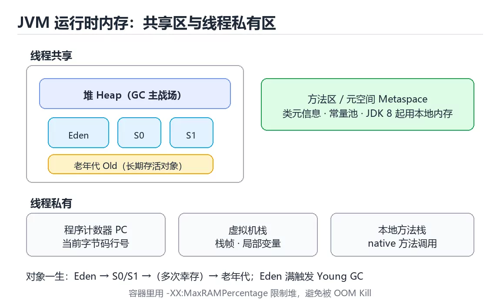
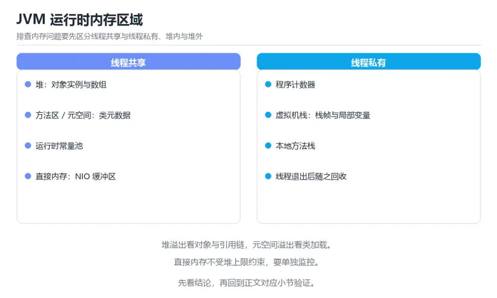

# 图解 JVM 内存模型与垃圾回收

> 内容更新时间：2026-10-06 · 学习阶段：进阶 · 预计用时：35 分钟

## 学习目标

- 能用自己的话解释图解 JVM 内存模型与垃圾回收解决了什么问题，而不是只背术语。
- 能说清 「JVM」、「内存模型」、「垃圾回收」、「G1」 之间的关系，并分别举出一个例子。
- 能把 JVM 放回「图解 JVM 内存模型与垃圾回收」的知识体系，说明它和 内存模型 的边界。
- 能完成本课练习，并用验收标准检查自己的结果。

> 一句话摘要：运行时内存分区、对象生命周期、三种收集器与常见 OOM 排查。

## 前置知识

- 先完成上一课《图解 TCP 握手、挥手与拥塞控制》；如果已经掌握，可以直接用本课练习自测。
- 本课阶段：进阶。建议先完成「图解 TCP 握手、挥手与拥塞控制」，或确认自己能独立跑通正文里的 MaxTenuringThreshold 示例。
- 开始前先复习：JVM、内存模型、垃圾回收。
- 看不懂就直接缩小例子：只保留 JVM 相关的两行输入，跑通后再加回其余部分。



## 一句话说清

JVM 把内存划分成**线程私有**与**线程共享**两类区域，垃圾回收主要发生在堆里。
看懂分区与 GC 流程，就能解释 `OutOfMemoryError`、`StackOverflowError` 与长暂停从哪来。

## JVM 运行时内存分区

```text
┌──────────────────────── JVM 进程内存 ────────────────────────┐
│                                                              │
│  线程共享区                                                   │
│  ┌────────────────────────┐  ┌───────────────────────────┐  │
│  │  堆 Heap（GC 主战场）   │  │ 方法区 / 元空间 Metaspace  │  │
│  │  · 新生代 Young         │  │ · 类元信息、常量、静态变量 │  │
│  │    - Eden              │  │ · JDK 8 起用本地内存        │  │
│  │    - Survivor S0 / S1  │  └───────────────────────────┘  │
│  │  · 老年代 Old           │                                 │
│  └────────────────────────┘                                 │
│                                                              │
│  线程私有区                                                   │
│  ┌──────────┐ ┌──────────────┐ ┌──────────────────────────┐ │
│  │程序计数器 │ │ 虚拟机栈 VM   │ │ 本地方法栈 Native Stack  │ │
│  │ PC       │ │ Stack        │ │                          │ │
│  └──────────┘ └──────────────┘ └──────────────────────────┘ │
└──────────────────────────────────────────────────────────────┘
```

| 区域 | 线程 | 存放 | 溢出时报错 |
| --- | --- | --- | --- |
| 堆 | 共享 | 对象实例、数组 | `OutOfMemoryError: Java heap space` |
| 方法区 / 元空间 | 共享 | 类元信息、常量池 | `OutOfMemoryError: Metaspace` |
| 虚拟机栈 | 私有 | 栈帧、局部变量 | `StackOverflowError` |
| 程序计数器 | 私有 | 当前字节码行号 | 不会溢出 |
| 本地方法栈 | 私有 | native 方法调用 | `StackOverflowError` |

## 一个对象的一生

```text
new Object()
     │
     ▼
┌─────────────┐   幸存    ┌──────────────┐   多次幸存   ┌──────────┐
│ Eden 伊甸园 │─────────►│ Survivor S0/S1│────────────►│ Old 老年代│
└─────────────┘  复制算法  └──────────────┘  晋升阈值(15) └──────────┘
     │                          │                            │
     └──────── 无人引用 ────────┴───────── 无人引用 ──────────┘
                     │
                     ▼
                 被 GC 回收
```

```bash
# 常用参数
-Xms2g -Xmx2g                  # 堆初始与最大值设成一样，避免动态扩缩容抖动
-Xmn1g                         # 新生代大小
-XX:SurvivorRatio=8            # Eden 与一个 Survivor 的比例
-XX:MaxTenuringThreshold=15    # 晋升老年代的年龄阈值
-XX:MetaspaceSize=256m
-Xss1m                         # 每个线程栈大小
```

## 判断对象是否可回收

| 方法 | 说明 |
| --- | --- |
| 引用计数 | 简单，但无法处理循环引用（JVM 不用它判断） |
| **可达性分析** | 从 GC Roots 出发，走不到的即可回收 |

```text
GC Roots 常见来源
  · 虚拟机栈中引用的对象（局部变量）
  · 方法区静态变量引用的对象
  · 常量引用的对象
  · 本地方法栈中 JNI 引用的对象

        GC Root               可达（存活）
           │                ┌──► A ──► C
           └────────────────┤
                            └──► B

        X ──► Y               不可达（可回收），即使内部互相引用
```

## 三种垃圾回收器对照

| 收集器 | 特点 | 适用 |
| --- | --- | --- |
| Serial | 单线程，简单 | 小内存、客户端 |
| Parallel | 多线程吞吐优先 | 批处理、重视吞吐 |
| G1 | 分区，可设暂停目标 | 大堆、通用服务 |
| ZGC / Shenandoah | 低暂停（毫秒级） | 低延迟服务、大堆 |

```bash
# 选择收集器与设置暂停目标
-XX:+UseG1GC -XX:MaxGCPauseMillis=200
-XX:+UseZGC

# 打印 GC 日志（排查停顿必备）
-Xlog:gc*:file=gc.log:time,uptime,level,tags
```

## 一次 Young GC 的流程

```text
① Eden 满 → 触发 Young GC
        │
        ▼
② 标记 Eden + S0 中的存活对象
        │
        ▼
③ 复制到 S1（年龄 +1），清空 Eden 与 S0
        │
        ▼
④ S0 与 S1 角色互换
        │
        ▼
⑤ 年龄达到阈值或 S 区放不下 → 晋升老年代

老年代空间不足 → Full GC / Mixed GC（停顿更长）
```

## 常见错误与排查

| 现象 | 可能原因 | 排查 |
| --- | --- | --- |
| `OutOfMemoryError: Java heap space` | 内存泄漏或堆太小 | 堆快照 + 支配树分析 |
| `OutOfMemoryError: Metaspace` | 类加载过多（热部署、动态代理） | 看类加载数量 |
| `StackOverflowError` | 递归过深 | 检查出口条件 |
| GC 频繁 | 分配速率高或堆太小 | 看分配速率与 GC 日志 |
| 长暂停 | 大对象晋升、收集器不合适 | 换低暂停收集器并设目标 |

```bash
# 查看堆与 GC 情况
jstat -gcutil <pid> 1000
jmap -dump:live,format=b,file=heap.hprof <pid>
jcmd <pid> GC.heap_info
```
| 坑 | 现象 | 正确做法 |
| 用 `System.gc()` | 暂停加剧 | 交给 JVM 决定 |
| 堆最大值设得过大 | 一次 Full GC 停很久 | 按暂停目标选收集器并压测 |
| 不开启 GC 日志 | 出问题没有现场 | 生产默认开启并滚动 |
| 只看 CPU 不看 GC | 定位不到停顿来源 | 结合 GC 日志与暂停时间 |
| 缓存无上限 | 最终 OOM | 用有容量限制的缓存 |
| 监听器未注销 | 对象无法回收 | 生命周期配对注销 |
| 大量字符串拼接 | 分配速率高 | 用 `StringBuilder` |
| 容器里没设内存上限 | 被 OOM Kill | 设 `-XX:MaxRAMPercentage` |



## 本课小结

- JVM 内存分**线程共享（堆、元空间）**与**线程私有（栈、PC）**两大部分。
- 对象经历 **Eden → Survivor → 老年代**，大多数对象在新生代就被回收。
- 排查内存问题：先看 GC 日志与堆快照，再谈调参。

## 动手练习

> 本课练习重点：围绕「JVM、内存模型、垃圾回收」完成复述、实验和交付，每个结果都要能被别人检查。

凭记忆画出 MaxTenuringThreshold 的执行顺序，与正文对照后补上遗漏环节。

### 练习 1：建立心智模型（10 分钟）

合上教程，用 3～5 句话回答：

1. 图解 JVM 内存模型与垃圾回收解决了什么问题？
2. 如果没有它，会出现什么具体后果？
3. 它和「内存模型」是什么关系？

验收标准：说明 JVM 与 内存模型 的分工，并写出一个失效场景。

### 练习 2：做一次可控实验（20 分钟）

从正文中选一个最小示例，完成以下操作：

1. 先预测修改一个参数、输入或步骤后的结果。
2. 再实际执行或逐步推演，记录真实结果。
3. 如果结果与预测不同，写出差异原因。

**验收标准**：先原样跑通正文里的 `MaxTenuringThreshold`，再只改JVM相关的输入，按「原例 → 改动 → 预测 → 结果 → 原因」记录；预测必须写在实际运行之前。

### 练习 3：交付一个小结果（30 分钟）

不看原图手绘一遍流程，再用自己的话指出图中的关键状态变化。

任务要求：

- 结果必须能被别人检查，不能只写“我已经理解了”。
- 至少覆盖「JVM」和「内存模型」两个关键词。
- 写出 1 个仍然不确定的问题，以及下一步如何验证。

> 提示：时间有限时优先做练习 1 和练习 2；练习 3 可以拆成两次完成。

## 可运行练习

### 任务 1：先跑通，再解释

```bash
# 常用参数
-Xms2g -Xmx2g                  # 堆初始与最大值设成一样，避免动态扩缩容抖动
-Xmn1g                         # 新生代大小
-XX:SurvivorRatio=8            # Eden 与一个 Survivor 的比例
-XX:MaxTenuringThreshold=15    # 晋升老年代的年龄阈值
-XX:MetaspaceSize=256m
-Xss1m                         # 每个线程栈大小
```

### 任务 2：只改一个条件

把「图解 JVM 内存模型与垃圾回收」的最小示例复制一份，只改一个条件再跑一次：

- 改动点：只调整 MaxTenuringThreshold 的一个参数，其余条件一律不动。
- 预测：先写下「图解 JVM 内存模型与垃圾回收」在改动后的输出或错误信息，再运行。
- 记录：对照改动前后的结果，指出差异出在哪一步。
- 验收：换回原条件能复现原结果，改动只影响JVM。

### 任务 3：迁移到自己的数据

把 MaxTenuringThreshold 换成你自己的输入，先保持步骤不变，再比较输出差异。

## 故障现场

### 现场 1：OutOfMemoryError: Java heap space

**症状**：在《图解 JVM 内存模型与垃圾回收》的复现场景中，内存泄漏或堆太小。

**根因**：当出现“OutOfMemoryError: Java heap space”时，执行路径已经绕过了《图解 JVM 内存模型与垃圾回收》的关键约束，最终以“内存泄漏或堆太小”暴露出来；修复前必须先确认约束在哪里失效。

**修复**：针对《图解 JVM 内存模型与垃圾回收》的问题，堆快照 + 支配树分析。

**验证**：先在《图解 JVM 内存模型与垃圾回收》中记录“OutOfMemoryError: Java heap space”留下的失败证据，再执行“堆快照 + 支配树分析”并重放；确认错误路径变为明确结果，且修复没有掩盖同类故障。

### 现场 2：OutOfMemoryError: Metaspace

**症状**：在《图解 JVM 内存模型与垃圾回收》的复现场景中，类加载过多（热部署、动态代理）。

**根因**：触发点是把“OutOfMemoryError: Metaspace”当成安全做法。它没有满足《图解 JVM 内存模型与垃圾回收》要求的前提，因此先表现为“类加载过多（热部署、动态代理）”；排查时先完整复现这一段，再核对输入、配置与依赖。

**修复**：针对《图解 JVM 内存模型与垃圾回收》的问题，看类加载数量。

**验证**：保留《图解 JVM 内存模型与垃圾回收》里触发“类加载过多（热部署、动态代理）”的输入、版本和日志，按“看类加载数量”完成修改后原样重放；只有失败现象消失且相邻场景仍可解释，才保留改动。

### 现场 3：堆最大值设得过大

**症状**：在《图解 JVM 内存模型与垃圾回收》的复现场景中，一次 Full GC 停很久。

**根因**：当出现“堆最大值设得过大”时，执行路径已经绕过了《图解 JVM 内存模型与垃圾回收》的关键约束，最终以“一次 Full GC 停很久”暴露出来；修复前必须先确认约束在哪里失效。

**修复**：针对《图解 JVM 内存模型与垃圾回收》的问题，按暂停目标选收集器并压测。

**验证**：先在《图解 JVM 内存模型与垃圾回收》中记录“堆最大值设得过大”留下的失败证据，再执行“按暂停目标选收集器并压测”并重放；确认错误路径变为明确结果，且修复没有掩盖同类故障。

## 深入补充：图解 JVM 内存模型与垃圾回收 的取舍与边界

### 一、把概念放回真实约束

学习图解 JVM 内存模型与垃圾回收时，最容易只记住结论而忽略前提。先写出三个约束：数据规模、时间预算、可接受的失败方式；再判断 JVM 与 内存模型 在这些约束下是否仍然成立。只要约束改变，原来的最优解就可能变成错误解。

| 观察到的现象 | 背后的机制 | 验证方式 | 常见误判 |
| --- | --- | --- | --- |
| 延迟突然升高 | 队列堆积或重传 | 分段计时与指标对照 | 只盯平均值 |
| 状态看似随机 | 并发交错或缓存失效 | 固定随机种子复现 | 把时序问题当逻辑错误 |
| 结果与预期不符 | 默认值与边界规则 | 构造最小输入 | 忽略版本差异 |

### 二、三个容易混淆的边界

1. 澄清输入与目标。先写清「图解 JVM 内存模型与垃圾回收」要解决的问题、合法输入范围和成功标准，再进入后续步骤。
2. **把“平均值”当成“全部”**：JVM 的指标好看，不代表尾部请求、冷启动或失败重试也好看。
3. **把“当前版本”当成“永久行为”**：内存模型 依赖的默认值、API 或性能特征都可能随版本变化，需要固定版本并保留回归用例。

### 三、一个生产场景

假设团队要在真实系统里使用图解 JVM 内存模型与垃圾回收：第一周先做小流量验证，记录 JVM 的基线与异常；第二周扩大输入规模，观察 内存模型 是否成为瓶颈；第三周再做故障演练，主动注入超时、重复请求和依赖不可用，确认系统能降级、能重试、能恢复。每一步都要留下指标、日志和结论，而不是只留下“感觉更快了”。

### 四、自测清单

- 能否用一句话说出图解 JVM 内存模型与垃圾回收解决的核心问题与不适用场景？
- 能否画出 JVM 的数据流或状态变化，并标出失败路径？
- 把 MaxTenuringThreshold 的输入推到边界，说明本课哪一条结论会先失效。
- 能否写出一条可复现的验证命令，让别人独立得到相同结论？

## 本课复习清单

离开本课前，逐项确认：

- [ ] 不看解析，能说出「JVM 中哪一区域是线程私有的？」的判断依据。
- [ ] 不看解析，能说出「JVM 判断对象是否可回收，采用的方法是？」的判断依据。
- [ ] 不看解析，能说出「一个新创建的对象通常会先分配到哪里？」的判断依据。
- [ ] 不看解析，能说出「服务出现长时间 GC 暂停，更合适的处理方向是？」的判断依据。
- [ ] 至少运行一次 MaxTenuringThreshold 的示例，记录输入、输出和 JVM 的边界情况。
- [ ] 把本课最容易混淆的两个概念写成一句话对照。

| 复盘项 | 记录 |
| --- | --- |
| 已经能独立解释的考点 |  |
| 仍然说不清的概念 |  |
| 下一步验证动作 |  |

## 术语速查

把「图解 JVM 内存模型与垃圾回收」里反复出现的术语集中放在一起。复习时先遮住右列，尝试用自己的话解释，再回到正文核对。

| 术语 | 一句话说明 |
| --- | --- |
| `JVM` | JVM 把内存划分成线程私有与线程共享两类区域，垃圾回收主要发生在堆里。 |
| `内存模型` | 编程语言或硬件对多线程读写可见性、原子性和重排序给出的规则集合。 |
| `垃圾回收` | 运行时自动识别并回收不再可达的对象，避免手动释放并控制停顿。 |
| `G1` | JVM 面向大堆的垃圾收集器，用分区和可预测停顿目标平衡吞吐与延迟。 |
| `OOM` | 内存溢出：堆或元空间耗尽时抛 OutOfMemoryError，需要区分泄漏、堆太小还是元数据过多。 |

## 考点精讲

### 考点 1：多选辨析·JVM

- **题目**：围绕“图解 JVM 内存模型与垃圾回收”中的 JVM、内存模型、垃圾回收，下列哪两项是本课强调的实践判断？
- **判断依据**：本课把图解 JVM 内存模型与垃圾回收拆成概念、示例与故障现场三部分，因此判断 JVM 时必须同时交代输入、输出和失败路径，这使“学习 JVM 时要同时说明输入、输出和失败路径，不能只看正常流程”成立。在图解 JVM 内存模型与垃圾回收里，判断 内存模型 时要固定版本与边界输入，所以“验证 内存模型 时要固定版本并覆盖边界输入，结论才可复现”才可复现。

### 考点 2：代码补全·JVM

- **题目**：阅读「图解 JVM 内存模型与垃圾回收」正文里的这段代码，下面哪一项判断是正确的？
- **判断依据**：在「图解 JVM 内存模型与垃圾回收」里，这段代码只做静态声明，没有循环、分支或可观察输出。这段代码出自「图解 JVM 内存模型与垃圾回收」的正文示例，围绕JVM、内存模型、垃圾回收展开；把输入或边界换成空值、极值或失败情况后，结论要以「图解 JVM 内存模型与垃圾回收」的实际运行结果为准。

### 考点 3：概念判断·JVM

- **题目**：一个新创建的对象通常会先分配到哪里？
- **判断依据**：在「图解 JVM 内存模型与垃圾回收」里，Eden 区。多数对象先在 Eden 分配，经 Survivor 区多次存活后才晋升老年代。「图解 JVM 内存模型与垃圾回收」要求先交代JVM、内存模型、垃圾回收的前提再下结论，所以“Eden 区”只在题干“一个新创建的对象通常会先分配到哪里”给定的条件下成立。

### 考点 4：概念判断·JVM

- **题目**：服务出现长时间 GC 暂停，更合适的处理方向是？
- **判断依据**：在「图解 JVM 内存模型与垃圾回收」里，结论应落在「查看 GC 日志定位原因」。先用日志定位（大对象、晋升失败或收集器不合适），再针对性调整。在「图解 JVM 内存模型与垃圾回收」里，这道题要求区分概念与边界，「查看 GC 日志定位原因」只有在题干给出的前提下才成立，而「调用 System.gc 手动回收」、「把堆调到最大」缺少同一组条件。

### 考点 5：填空·JVM

- **题目**：补全代码：「图解 JVM 内存模型与垃圾回收」示例中，下面这行代码缺少哪个关键字或函数名？请填入 ____。 `│ │ 堆 Heap（GC 主战场） │ │ 方法区 / 元空间 ____ │ │`
- **判断依据**：在「图解 JVM 内存模型与垃圾回收」里，Metaspace。在「图解 JVM 内存模型与垃圾回收」里判断这道题，要把JVM、内存模型、垃圾回收的条件、过程与失败路径逐项对齐，换成“补全代码”这个场景，只有满足前提的结论才成立。回到「图解 JVM 内存模型与垃圾回收」的正文示例，用“补全代码”走一遍JVM、内存模型、垃圾回收的完整流程，能复现的结论才可以保留。

## English Overview

**Title:** JVM Memory and GC Illustrated

**Summary:** Runtime memory areas, object lifecycle, collectors and OOM debugging.

**Category:** Visual Guide
**Level:** 进阶
**Key terms:** JVM, 内存模型, 垃圾回收, G1, OOM

## 内容元数据

- 内容版本：v2.0
- 最后更新：2026-10-06
- 学习阶段：进阶
- 适用环境：通用图解与系统原理；本课聚焦 JVM。
- 内容来源：内置结构化课程与工程实践整理
- 相关主题：JVM、内存模型、垃圾回收、G1、OOM
- 质量版本：P0 测验标准 + P1 覆盖扩展 + P2 体验补全

## 参考资料与复核

- 最后复核：2026-10-04
- 下次复核：2027-07-10
- 复核范围：版本兼容、API 行为、安全建议与工程实践
- 来源性质：官方文档、标准或权威教材；正文为离线教学重组

| 参考资料 | 本课用途 |
| --- | --- |
| [Pro Git 内部原理](https://git-scm.com/book/zh/v2/Git-内部原理-Git-对象) | Git 对象与引用关系 |
| [Mermaid 文档](https://mermaid.js.org/intro/) | 流程图、时序图与状态图 |
| [PlantUML 文档](https://plantuml.com/) | UML 与架构图表达 |

> 「图解 JVM 内存模型与垃圾回收」的链接用于离线阅读后的延伸核对；App 不会自动联网。

## 复习与迁移

复习目标：把「图解 JVM 内存模型与垃圾回收」的判断标准放回可复现的例子里。先自己作答，再对照依据；如果结论正确但理由不完整，回到正文补足前提。

### 概念复述

- 用一句话说明「图解 JVM 内存模型与垃圾回收」解决什么问题：运行时内存分区、对象生命周期、三种收集器与常见 OOM 排查。
- 写出JVM、内存模型、垃圾回收之间的关系，并各举一个例子。
- 说出本课最容易混淆的两个概念，以及区分它们的判据。

### 正文逐节复核

- **一句话说清**：JVM 把内存划分成**线程私有**与**线程共享**两类区域，垃圾回收主要发生在堆里。
- **深入补充：图解 JVM 内存模型与垃圾回收 的取舍与边界**：学习图解 JVM 内存模型与垃圾回收时，最容易只记住结论而忽略前提。

### 测验回顾

1. 围绕“图解 JVM 内存模型与垃圾回收”中的 JVM、内存模型、垃圾回收，下列哪两项是本课强调的实践判断？
   - 依据：本课把图解 JVM 内存模型与垃圾回收拆成概念、示例与故障现场三部分，因此判断 JVM 时必须同时交代输入、输出和失败路径，这使“学习 JVM 时要同时说明输入、输出和失败路径，不能只看正常流程”成立。在图解 JVM 内存模型与垃圾回收里，判断 内存模型 时要固定版本与边界输入，所以“验证 内存模型 时要固定版本并覆盖边界输入，结论才可复现”才可复现。
2. 阅读「图解 JVM 内存模型与垃圾回收」正文里的这段代码，下面哪一项判断是正确的？
   - 依据：在「图解 JVM 内存模型与垃圾回收」里，这段代码只做静态声明，没有循环、分支或可观察输出。这段代码出自「图解 JVM 内存模型与垃圾回收」的正文示例，围绕JVM、内存模型、垃圾回收展开；把输入或边界换成空值、极值或失败情况后，结论要以「图解 JVM 内存模型与垃圾回收」的实际运行结果为准。
3. 一个新创建的对象通常会先分配到哪里？
   - 依据：在「图解 JVM 内存模型与垃圾回收」里，Eden 区。多数对象先在 Eden 分配，经 Survivor 区多次存活后才晋升老年代。「图解 JVM 内存模型与垃圾回收」要求先交代JVM、内存模型、垃圾回收的前提再下结论，所以“Eden 区”只在题干“一个新创建的对象通常会先分配到哪里”给定的条件下成立。
4. 服务出现长时间 GC 暂停，更合适的处理方向是？
   - 依据：在「图解 JVM 内存模型与垃圾回收」里，结论应落在「查看 GC 日志定位原因」。先用日志定位（大对象、晋升失败或收集器不合适），再针对性调整。在「图解 JVM 内存模型与垃圾回收」里，这道题要求区分概念与边界，「查看 GC 日志定位原因」只有在题干给出的前提下才成立，而「调用 System.gc 手动回收」、「把堆调到最大」缺少同一组条件。
5. 补全代码：「图解 JVM 内存模型与垃圾回收」示例中，下面这行代码缺少哪个关键字或函数名？请填入 ____。

`│ │ 堆 Heap（GC 主战场） │ │ 方法区 / 元空间 ____ │ │`
   - 依据：在「图解 JVM 内存模型与垃圾回收」里，Metaspace。在「图解 JVM 内存模型与垃圾回收」里判断这道题，要把JVM、内存模型、垃圾回收的条件、过程与失败路径逐项对齐，换成“补全代码”这个场景，只有满足前提的结论才成立。回到「图解 JVM 内存模型与垃圾回收」的正文示例，用“补全代码”走一遍JVM、内存模型、垃圾回收的完整流程，能复现的结论才可以保留。

### 迁移练习

把「图解 JVM 内存模型与垃圾回收」的结论迁移到相邻主题，每次迁移都写清预测与证据：

1. 换输入：用JVM处理一组你自己的数据，对比教材示例的结果差异。
2. 换失败条件：制造一个内存模型相关的错误，说明如何从错误信息定位根因。
3. 换规模：把数据量或并发度提高一个数量级，说明「图解 JVM 内存模型与垃圾回收」的结论是否仍成立。

## 复习与自测

- [ ] 能用自己的话复述「一句话说清」，并各举一个正例和反例。
- [ ] 能解释「JVM 运行时内存分区」里最容易混淆的两个概念。
- [ ] 能不看正文写出「一个对象的一生」的关键步骤。
- [ ] 能用一句话说明「判断对象是否可回收」解决什么问题。
- [ ] 能把「三种垃圾回收器对照」的判断标准套到一个新例子上。
- [ ] 能说清「一次 Young GC 的流程」的结论，并说出它的适用边界。

