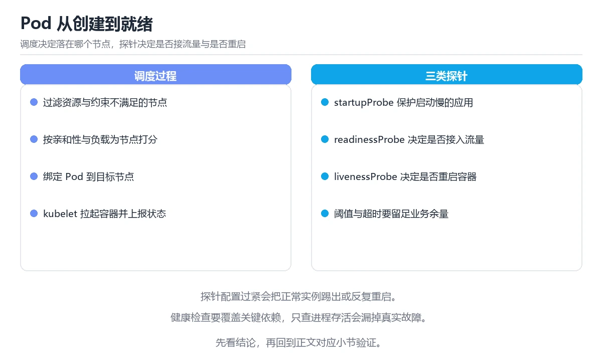

# 图解 Kubernetes 调度与探针

> 内容更新时间：2026-10-06 · 学习阶段：进阶 · 预计用时：45 分钟


## 本节知识框架

**课程定位**：所属分类 `visual_guide`（图解专题），课程主题 `图解 Kubernetes 调度与探针`，学习阶段 进阶，建议用时 45 分钟。

本课主线：Pod 一生、调度两步决策、三种探针分工与优雅下线。

**学完本课应当能够**
- 说清 `调度` 与 `优雅下线` 的含义与区别，并各举一个正例和一个反例。
- 用本课示例验证 `探针` 的行为，记录输入、输出与失败条件。
- 遇到「只写 limits 不写 requests」这类问题时，能说出触发条件与修复顺序。

### 从概念到验证的学习链条

1. `调度`：先掌握 在多个就绪任务之间分配 CPU、线程或执行机会，再用它解释 `优雅下线` 为什么会出现。
2. `优雅下线`：先掌握 实例从负载均衡摘除后等待连接和请求排空，再安全停止进程，再用它解释 `探针` 为什么会出现。
3. `探针`：先掌握 存活与就绪探针的判定决定容器是否重启、是否接收流量，慢启动应用要配启动探针，再用它解释 `资源请求` 为什么会出现。
4. `资源请求`：先掌握 requests 决定 Pod 被调度到哪个节点以及服务质量等级，设置过低会在高峰期被驱逐，再用它解释 本课示例的观察结果 为什么会出现。

**先修与衔接**：本课是「图解专题」分类的第 11 课。先修内容：《图解 HTTPS 证书链与 TLS 握手》。《图解 HTTPS 证书链与 TLS 握手》里的 `HTTPS`、`证书链` 是本课的前提。相关或后续课程：《图解 RAG 检索增强生成流程》、《Kubernetes 基础》。

### 完成判据

- **定义关**：不看正文也能说明 `调度` 是 在多个就绪任务之间分配 CPU、线程或执行机会，并指出一个反例。
- **机制关**：能按“输入 → 转换 → 输出 → 验证”复述 `图解 Kubernetes 调度与探针`，而不是只背结论。
- **示例关**：能运行或推演 `图解 Kubernetes 调度与探针` 的 `text` 示例，并说明一个真实出现的标识符或字面量。
- **证据关**：能从 `图解 Kubernetes 调度与探针` 的示例写出一个输入、处理、输出三元组，并说明它支持或反驳了本课的哪一条结论。
- **排错关**：能复现 只写 limits 不写 requests，记录现象并按 两者都写 修复。
- **迁移关**：能把 `Kubernetes`、`调度`、`探针`、`滚动更新` 放进一个与 `图解 Kubernetes 调度与探针` 不同的项目场景，并保持输入与验证条件可追踪。
- **复盘关**：学完 `图解 Kubernetes 调度与探针` 后，用一句话写下仍然不确定的结论，并列出下一次验证需要的输入、环境和成功判据。

### 复习清单

- [ ] 能不看正文复述本课核心术语，并指出一个边界或反例。
- [ ] 能运行或推演本课示例，记录输入、输出与失败现象。
- [ ] 能完成一次自测，并把错题对照错误表定位原因。

**本课配图**



## 核心概念定义

| 术语 | 操作性定义 | 常见边界与风险 |
| --- | --- | --- |
| 调度 | 在多个就绪任务之间分配 CPU、线程或执行机会。 | 易错：找不到调度或拉镜像问题；正确做法是先看事件再看日志。 |
| 优雅下线 | 实例从负载均衡摘除后等待连接和请求排空，再安全停止进程。 | 共享状态与调度顺序会改变结论，单线程或串行测试通过不等于并发下成立。 |
| 探针 | 存活与就绪探针的判定决定容器是否重启、是否接收流量，慢启动应用要配启动探针。 | 易错：频繁误判；正确做法是结合真实启动时间设置。 |
| 资源请求 | requests 决定 Pod 被调度到哪个节点以及服务质量等级，设置过低会在高峰期被驱逐。 | 只在「requests 决定 Pod 被调度到哪个节点以及服务质量等级，设置过低会在高峰期被驱逐」这一前提下成立，换输入或换环境要重新验证。 |

## 原理与运行机制

### 机制总览

| 阶段 | 关注对象 | 失败时应检查 |
| --- | --- | --- |
| 输入 | 调度 | 类型、范围、编码、版本或前置状态是否满足定义。 |
| 处理 | 优雅下线 | 顺序、可见性、锁、路由、事务或调度规则是否被破坏。 |
| 输出 | 探针 | 结果是否可复现，错误是否被正确传播而不是被吞掉。 |

**教材衔接：一句话说清**

Kubernetes 的核心是**声明期望状态 + 控制循环纠正**。
一个 Pod 从被创建到能接流量，要经过**调度、启动、探针检查、注册端点**四步。

**教材衔接：深入补充：图解 Kubernetes 调度与探针 的取舍与边界**

### 一、把概念放回真实约束

| 观察到的现象 | 背后的机制 | 验证方式 | 常见误判 |
| --- | --- | --- | --- |
| 延迟突然升高 | 队列堆积或重传 | 分段计时与指标对照 | 只盯平均值 |
| 状态看似随机 | 并发交错或缓存失效 | 固定随机种子复现 | 把时序问题当逻辑错误 |
| 结果与预期不符 | 默认值与边界规则 | 构造最小输入 | 忽略版本差异 |


### 机制拆解：每一步的输入、动作与输出

#### 1. `调度`
- 输入：`Kubernetes`；本步把 在多个就绪任务之间分配 CPU、线程或执行机会 当作判断规则。
- 动作：围绕 `调度` 保留中间状态，并记录它与 `优雅下线` 的对应关系。
- 输出：`优雅下线`，它可以被下一段代码、测试或记录继续使用。
- `调度` 的失败条件：当不看 describe 只看 logs时，会出现找不到调度或拉镜像问题。

#### 2. `优雅下线`
- 输入：`调度`；本步把 实例从负载均衡摘除后等待连接和请求排空，再安全停止进程 当作判断规则。
- 动作：围绕 `优雅下线` 保留中间状态，并记录它与 `探针` 的对应关系。
- 输出：`探针`，它可以被下一段代码、测试或记录继续使用。
- `优雅下线` 的失败条件：共享状态与调度顺序会改变结论，单线程或串行测试通过不等于并发下成立。

#### 3. `探针`
- 输入：`优雅下线`；本步把 存活与就绪探针的判定决定容器是否重启、是否接收流量，慢启动应用要配启动探针 当作判断规则。
- 动作：围绕 `探针` 保留中间状态，并记录它与 `资源请求` 的对应关系。
- 输出：`资源请求`，它可以被下一段代码、测试或记录继续使用。
- `探针` 的失败条件：当探针超时设置过短时，会出现频繁误判。

#### 4. `资源请求`
- 输入：`探针`；本步把 requests 决定 Pod 被调度到哪个节点以及服务质量等级，设置过低会在高峰期被驱逐 当作判断规则。
- 动作：围绕 `资源请求` 保留中间状态，并记录它与 `本课示例的最终结果` 的对应关系。
- 输出：`本课示例的最终结果`，它可以被下一段代码、测试或记录继续使用。
- `资源请求` 的失败条件：只在「requests 决定 Pod 被调度到哪个节点以及服务质量等级，设置过低会在高峰期被驱逐」这一前提下成立，换输入或换环境要重新验证。

### 复现实验记录

- 环境：`图解 Kubernetes 调度与探针` 使用 `text` 示例，固定 `Kubernetes`、`调度`、`探针`、`滚动更新` 作为第一组条件。
- 首轮输入：从示例中的第一个输入开始，预测 `调度` 会怎样变化。
- 基线观察：记录命令、输入、输出和错误原文，不用截图代替可复制的文本。
- 单变量修改：只改变 `Kubernetes`，观察 `资源请求` 是否仍满足定义。
- 失败注入：复现 只写 limits 不写 requests，确认现象是 节点超卖、Pod 被驱逐。
- 记录结论：把“修改前、修改后、预期变化、实际变化”写成四列表，这样复盘 `图解 Kubernetes 调度与探针` 时才能区分概念错误与实现错误。

## 典型应用场景

- **只写 limits 不写 requests**：典型现象是节点超卖、Pod 被驱逐；正确做法是两者都写。
- **liveness 检查外部依赖**：典型现象是依赖抖动引发重启风暴；正确做法是依赖检查放 readiness。
- **探针超时设置过短**：典型现象是频繁误判；正确做法是结合真实启动时间设置。
- **没有 startupProbe**：典型现象是启动慢被 liveness 杀掉；正确做法是加 startupProbe 保护。

### 最小验证场景

- 准备：保留 `text` 示例的原始输入，先记录 `图解 Kubernetes 调度与探针` 的基线输出和完整运行命令。
- 判定：新结果与 `图解 Kubernetes 调度与探针` 的基线不同不等于错误；只有当差异破坏了 `调度` 的定义或错误表中的约束，才判定为失败。

### 选择与边界

- 使用 `调度` 时，先满足它的定义：在多个就绪任务之间分配 CPU、线程或执行机会；易错：找不到调度或拉镜像问题；正确做法是先看事件再看日志。
- 使用 `优雅下线` 时，先满足它的定义：实例从负载均衡摘除后等待连接和请求排空，再安全停止进程；共享状态与调度顺序会改变结论，单线程或串行测试通过不等于并发下成立。
- 使用 `探针` 时，先满足它的定义：存活与就绪探针的判定决定容器是否重启、是否接收流量，慢启动应用要配启动探针；易错：频繁误判；正确做法是结合真实启动时间设置。
- 使用 `资源请求` 时，先满足它的定义：requests 决定 Pod 被调度到哪个节点以及服务质量等级，设置过低会在高峰期被驱逐；只在「requests 决定 Pod 被调度到哪个节点以及服务质量等级，设置过低会在高峰期被驱逐」这一前提下成立，换输入或换环境要重新验证。

## 代码/协议/SQL 示例

**教材衔接：一张图看懂 Pod 的一生**

```text
① 你提交 Deployment（期望副本数 3）
        │
        ▼
② Deployment → ReplicaSet → 创建 3 个 Pod 对象（Pending）
        │
        ▼
③ 调度器 kube-scheduler 选节点
   · 过滤：资源够不够、污点能否容忍、亲和性是否满足
   · 打分：资源均衡、尽量分散、镜像已缓存
        │
        ▼
④ kubelet 拉起容器
   · 拉镜像 → 创建容器 → 执行 startupProbe
        │
        ▼
⑤ 探针通过
   · readinessProbe 通过 → 加入 Service Endpoints（开始接流量）
   · livenessProbe 失败 → 重启容器
        │
        ▼
⑥ 对外提供服务（Running）
```

**教材衔接：调度器的两步决策**

```text
第一步：过滤（Filter）—— 排除不合适的节点
  ┌──────────────┐
  │ 节点 A 内存不足 │ ✗ 排除
  │ 节点 B 有污点    │ ✗ 排除
  │ 节点 C 满足条件  │ ✓ 保留
  │ 节点 D 满足条件  │ ✓ 保留
  └──────────────┘

第二步：打分（Score）—— 在合格节点里选最优
  节点 C：资源均衡 70 分
  节点 D：资源均衡 85 分，且镜像已缓存 +10
  → 选择节点 D
```

| 约束类型 | 例子 | 作用 |
| --- | --- | --- |
| 资源请求 | `requests.cpu: 500m` | 调度依据（不是 limit） |
| 节点选择器 | `nodeSelector: disktype=ssd` | 只调度到特定节点 |
| 亲和性 | `nodeAffinity` / `podAntiAffinity` | 靠拢或分散 |
| 污点与容忍 | `taints` / `tolerations` | 独占节点或隔离 |

```yaml
resources:
  requests: { cpu: 500m, memory: 512Mi }   # 调度按这个预留
  limits:   { cpu: "1",  memory: 1Gi }     # 上限，超了会被限制或杀掉

topologySpreadConstraints:                 # 让副本分散到不同节点
  - maxSkew: 1
    topologyKey: kubernetes.io/hostname
    whenUnsatisfiable: ScheduleAnyway
    labelSelector:
      matchLabels: { app: web }
```

**只写 limits 不写 requests 是常见错误**：调度器会按 0 请求处理，导致节点超卖。

**教材衔接：三种探针的分工与顺序**

```text
容器启动
   │
   ├─ startupProbe（启动慢的服务用）
   │     失败 → 重启容器；通过后不再执行
   │
   ├─ readinessProbe（能否接流量）
   │     失败 → 从 Endpoints 摘除，不重启
   │
   └─ livenessProbe（是否还活着）
         失败 → 重启容器
```

| 探针 | 检查什么 | 失败后果 | 典型配置 |
| --- | --- | --- | --- |
| startupProbe | 是否完成初始化 | 重启 | `failureThreshold: 30`，间隔 2s |
| readinessProbe | 能否处理请求 | 摘流量 | 依赖检查放这里 |
| livenessProbe | 进程是否卡死 | 重启 | 不要检查外部依赖 |

```yaml
readinessProbe:
  httpGet: { path: /healthz/ready, port: 8080 }
  initialDelaySeconds: 3
  periodSeconds: 5
  failureThreshold: 3

livenessProbe:
  httpGet: { path: /healthz/live, port: 8080 }
  periodSeconds: 10
  failureThreshold: 3

startupProbe:                # 启动慢时用它保护 liveness
  httpGet: { path: /healthz/live, port: 8080 }
  failureThreshold: 30
  periodSeconds: 2
```

**教材衔接：发布期间 Pod 的流转**

```text
滚动更新（maxSurge=1, maxUnavailable=0）

旧版本 [A1][A2][A3]
  ① 新建 B1 → ready 后加入 Endpoints      [A1][A2][A3][B1]
  ② 摘除 A1 → 等待在途请求结束              [A2][A3][B1]
  ③ 新建 B2 → ready 后加入                 [A2][A3][B1][B2]
  ④ 摘除 A2 …依此类推，直到全部替换为 B

全程可用副本数不低于 3，因此不中断服务
```

```yaml
strategy:
  type: RollingUpdate
  rollingUpdate:
    maxSurge: 1              # 最多多出 1 个
    maxUnavailable: 0        # 保证可用副本不减少
terminationGracePeriodSeconds: 30
```

**教材衔接：优雅下线的四步**

```text
1. Pod 变为 Terminating，从 Endpoints 摘除（停止新流量）
2. preStop 钩子执行（例如 sleep 5 秒，等负载均衡刷新）
3. 发送 SIGTERM 给容器主进程
4. 应用停止接收新请求、处理完在途请求后退出
   （超时未退出则 SIGKILL）
```

```yaml
lifecycle:
  preStop:
    exec:
      command: ["/bin/sh", "-c", "sleep 5"]
```

### 示例精读：先找证据，再改一个条件

- 在 `图解 Kubernetes 调度与探针` 中与 `调度` 对照：示例必须能支持 在多个就绪任务之间分配 CPU、线程或执行机会，否则说明这一段还缺少实现或验证步骤。
- 在 `图解 Kubernetes 调度与探针` 中与 `优雅下线` 对照：示例必须能支持 实例从负载均衡摘除后等待连接和请求排空，再安全停止进程，否则说明这一段还缺少实现或验证步骤。
- 在 `图解 Kubernetes 调度与探针` 中与 `探针` 对照：示例必须能支持 存活与就绪探针的判定决定容器是否重启、是否接收流量，慢启动应用要配启动探针，否则说明这一段还缺少实现或验证步骤。
- 在 `图解 Kubernetes 调度与探针` 中与 `资源请求` 对照：示例必须能支持 requests 决定 Pod 被调度到哪个节点以及服务质量等级，设置过低会在高峰期被驱逐，否则说明这一段还缺少实现或验证步骤。
- `图解 Kubernetes 调度与探针` 的示例没有抽取到函数调用或字面量；按行记录输入、控制流和输出，避免只背代码外形。

## 时间/空间复杂度或性能分析

**性能关注点（图解 Kubernetes 调度与探针）**：图解类课程的性能点在渲染与交互响应：记录首屏时间与交互延迟。

**测量方法**：以 `图解 Kubernetes 调度与探针` 的 `Kubernetes` 场景为对象，固定输入跑一遍记录基线，再把规模或并发度提高一个数量级复测；两次结果的差值与波动范围才是结论依据。

### 需要控制的变量与记录项

- `图解 Kubernetes 调度与探针` 的 `Kubernetes`：固定它的版本、输入范围和资源上限，分别记录速度、内存与失败率的变化。
- `图解 Kubernetes 调度与探针` 的 `调度`：固定它的版本、输入范围和资源上限，分别记录速度、内存与失败率的变化。
- `图解 Kubernetes 调度与探针` 的 `探针`：固定它的版本、输入范围和资源上限，分别记录速度、内存与失败率的变化。
- `图解 Kubernetes 调度与探针` 的 `滚动更新`：固定它的版本、输入范围和资源上限，分别记录速度、内存与失败率的变化。
- `图解 Kubernetes 调度与探针` 的 `优雅下线`：固定它的版本、输入范围和资源上限，分别记录速度、内存与失败率的变化。
- `图解 Kubernetes 调度与探针` 中 `调度` 的边界：易错：找不到调度或拉镜像问题；正确做法是先看事件再看日志。达到边界时不要外推，必须重新测量。
- `图解 Kubernetes 调度与探针` 中 `优雅下线` 的边界：共享状态与调度顺序会改变结论，单线程或串行测试通过不等于并发下成立。达到边界时不要外推，必须重新测量。
- `图解 Kubernetes 调度与探针` 中 `探针` 的边界：易错：频繁误判；正确做法是结合真实启动时间设置。达到边界时不要外推，必须重新测量。
- `图解 Kubernetes 调度与探针` 中 `资源请求` 的边界：只在「requests 决定 Pod 被调度到哪个节点以及服务质量等级，设置过低会在高峰期被驱逐」这一前提下成立，换输入或换环境要重新验证。达到边界时不要外推，必须重新测量。

## 常见误区与易错点

| 容易写错的做法 | 实际现象 | 原因与正确做法 |
| --- | --- | --- |
| 只写 limits 不写 requests | 节点超卖、Pod 被驱逐 | 两者都写 |
| liveness 检查外部依赖 | 依赖抖动引发重启风暴 | 依赖检查放 readiness |
| 探针超时设置过短 | 频繁误判 | 结合真实启动时间设置 |
| 没有 startupProbe | 启动慢被 liveness 杀掉 | 加 startupProbe 保护 |
| 没有 preStop | 发布期间偶发 502 | 加 preStop 等待摘流 |
| 副本全挤在同一节点 | 节点故障全挂 | 用反亲和或分散约束 |
| 镜像标签用 latest | 版本不可控 | 用 commit SHA |
| 不看 describe 只看 logs | 找不到调度或拉镜像问题 | 先看事件再看日志 |

### 现场 1：只写 limits 不写 requests

**症状**：节点超卖、Pod 被驱逐。

**根因与修复**：两者都写。

**自检**：在本课示例里复现「只写 limits 不写 requests」，改成两者都写后重跑；如果症状消失且失败路径按预期变化，说明定位正确。

### 现场 2：liveness 检查外部依赖

**症状**：依赖抖动引发重启风暴。

**根因与修复**：依赖检查放 readiness。

**自检**：在本课示例里复现「liveness 检查外部依赖」，改成依赖检查放 readiness后重跑；如果症状消失且失败路径按预期变化，说明定位正确。

### 现场 3：探针超时设置过短

**症状**：频繁误判。

**根因与修复**：结合真实启动时间设置。

**自检**：在本课示例里复现「探针超时设置过短」，改成结合真实启动时间设置后重跑；如果症状消失且失败路径按预期变化，说明定位正确。

### 现场 4：没有 startupProbe

**症状**：启动慢被 liveness 杀掉。

**根因与修复**：加 startupProbe 保护。

**自检**：在本课示例里复现「没有 startupProbe」，改成加 startupProbe 保护后重跑；如果症状消失且失败路径按预期变化，说明定位正确。

### 现场 5：没有 preStop

**症状**：发布期间偶发 502。

**根因与修复**：加 preStop 等待摘流。

**自检**：在本课示例里复现「没有 preStop」，改成加 preStop 等待摘流后重跑；如果症状消失且失败路径按预期变化，说明定位正确。

### 现场 6：副本全挤在同一节点

**症状**：节点故障全挂。

**根因与修复**：用反亲和或分散约束。

**自检**：在本课示例里复现「副本全挤在同一节点」，改成用反亲和或分散约束后重跑；如果症状消失且失败路径按预期变化，说明定位正确。

### 现场 7：镜像标签用 latest

**症状**：版本不可控。

**根因与修复**：用 commit SHA。

**自检**：在本课示例里复现「镜像标签用 latest」，改成用 commit SHA后重跑；如果症状消失且失败路径按预期变化，说明定位正确。

### 现场 8：不看 describe 只看 logs

**症状**：找不到调度或拉镜像问题。

**根因与修复**：先看事件再看日志。

**自检**：在本课示例里复现「不看 describe 只看 logs」，改成先看事件再看日志后重跑；如果症状消失且失败路径按预期变化，说明定位正确。

## 与其他知识点的关系

**教材衔接：常见异常状态对照**

| 状态 | 含义 | 排查方向 |
| --- | --- | --- |
| `Pending` | 没有合适节点 | 资源不足、污点、PVC 未绑定 |
| `ContainerCreating` | 正在拉镜像或挂卷 | 镜像仓库、密钥、存储 |
| `CrashLoopBackOff` | 容器反复退出 | 看 `logs --previous` 与探针配置 |
| `ImagePullBackOff` | 拉不到镜像 | 镜像名、镜像仓库凭据 |
| `Running` 但不接流量 | 就绪探针未通过 | 检查 readiness 路径与依赖 |
| `OOMKilled` | 超过内存 limit | 调大 limit 或修内存泄漏 |

```bash
kubectl get pods -o wide                        # 状态与所在节点
kubectl describe pod <pod>                      # 事件是排查关键
kubectl logs <pod> --previous                   # 崩溃前的日志
kubectl get events --sort-by=.lastTimestamp     # 集群事件时间线
kubectl top pod <pod>                           # 实际资源用量
```

- **先修**：`图解 HTTPS 证书链与 TLS 握手`。本课默认这些内容已经掌握。
- **相关或后续**：`图解 RAG 检索增强生成流程`、`Kubernetes 基础`。本课术语会在这些课程里继续使用。
- **术语归属**：`调度`、`优雅下线`、`探针` 的定义以本课「核心概念定义」为准，换到其他课程时先确认定义是否被改写。
- 同一分类的《图解并发调度：线程、协程与 Goroutine》也涉及 `调度`；两课衔接时先确认这个术语的定义是否一致。

### 先修与后续术语接口

- `Kubernetes 基础`：共享术语 `探针`、`调度`，共同关键词 `Kubernetes`、`探针`、`滚动更新`。
- `图解 HTTPS 证书链与 TLS 握手`：两者通过本分类的学习顺序衔接，阅读时重点比较各自的输入与失败条件。
- `图解 RAG 检索增强生成流程`：两者通过本分类的学习顺序衔接，阅读时重点比较各自的输入与失败条件。

### 容易混淆的相邻概念

- `调度` 与 `优雅下线`：前者强调 在多个就绪任务之间分配 CPU、线程或执行机会；后者强调 实例从负载均衡摘除后等待连接和请求排空，再安全停止进程。判断时分别检查两条定义的适用范围，不要只看名称相似就互换。
- `优雅下线` 与 `探针`：前者强调 实例从负载均衡摘除后等待连接和请求排空，再安全停止进程；后者强调 存活与就绪探针的判定决定容器是否重启、是否接收流量，慢启动应用要配启动探针。判断时分别检查两条定义的适用范围，不要只看名称相似就互换。
- `探针` 与 `资源请求`：前者强调 存活与就绪探针的判定决定容器是否重启、是否接收流量，慢启动应用要配启动探针；后者强调 requests 决定 Pod 被调度到哪个节点以及服务质量等级，设置过低会在高峰期被驱逐。判断时分别检查两条定义的适用范围，不要只看名称相似就互换。

## 自测题与参考答案

> 先独立作答，再对照参考答案；答案都能在本课正文、术语表或错误表里找到依据。

### 自测 1（概念复述）

不看正文，写出 `调度` 的操作性定义，并说明它与 `优雅下线` 的区别。

**参考答案**：在多个就绪任务之间分配 CPU、线程或执行机会。

`优雅下线` 的定位是：实例从负载均衡摘除后等待连接和请求排空，再安全停止进程；两者的差别要从适用对象与失败模式上说明。

### 自测 2（排错）

本课错误表记录了「只写 limits 不写 requests」这类做法。请写出它会出现的现象、根因，以及修复顺序。

**参考答案**：现象是节点超卖、Pod 被驱逐；正确做法是两者都写。修复时先复现现象并保留证据，再改动一处假设重跑，确认现象消失。

### 自测 3（动手验证）

运行本课的 `text` 示例，把其中的 `3` 换成一个边界值后重新运行，记录输出与错误信息。

**参考答案**：正常输入下 `text` 示例应当复现正文给出的结果；把 `3` 换成边界值后，如果结果改变或报错，先核对它是否满足 `图解 Kubernetes 调度与探针` 中`调度` 的适用范围，再检查错误表里是否有同类现象。

### 自测 4（代码阅读）

阅读本课开头的 `text` 示例，说明它体现了`调度` 的哪一条性质，并指出改动哪个输入会让这条性质不再成立。

**参考答案**：`调度` 的定义是 在多个就绪任务之间分配 CPU、线程或执行机会，示例正是在实现这条定义。改动与 `调度` 有关的一个输入后，如果结果不再符合 `图解 Kubernetes 调度与探针` 的正文描述，就说明该性质只在当前前提成立。

### 自测 5（迁移）

把 `图解 Kubernetes 调度与探针` 的方法迁移到自己的项目：围绕 `调度` 写出一个与错误表同类的风险点，并说明触发条件和检验方式。

**参考答案**：例如「不看 describe 只看 logs」，它会导致找不到调度或拉镜像问题；检验方式是按先看事件再看日志改一处再复现，确认现象消失且没有引入新的失败分支。

### 自测 6（对比）

用一个表格对比 `调度` 与 `优雅下线`：各写一行适用场景、一行失败表现。

**参考答案**：`调度` 的定义是在多个就绪任务之间分配 CPU、线程或执行机会；`优雅下线` 的定义是实例从负载均衡摘除后等待连接和请求排空，再安全停止进程。两者的失败表现分别对应本课错误表里与本术语相关的行。

### 自测 7（排错顺序）

面对「只写 limits 不写 requests」引发的问题，请把“复现 节点超卖、Pod 被驱逐 → 保留证据 → 两者都写 → 回归验证”四步写成可执行的检查清单。

**参考答案**：第一步按节点超卖、Pod 被驱逐复现；第二步记录输入、版本与完整报错；第三步按两者都写只改一处；第四步重跑并确认失败路径也按预期变化。

### 自测 8（边界判断）

针对 `资源请求`，分别写出“可以使用”的条件和“结论不再成立”的条件。

**参考答案**：只在「requests 决定 Pod 被调度到哪个节点以及服务质量等级，设置过低会在高峰期被驱逐」这一前提下成立，换输入或换环境要重新验证。 同时要把 `资源请求` 的定义 requests 决定 Pod 被调度到哪个节点以及服务质量等级，设置过低会在高峰期被驱逐 与实际输入逐项对照。

### 自测 9（机制重建）

不看正文，按输入、转换、输出、验证四段重建 `调度` → `优雅下线` → `探针` → `资源请求` 的作用链。

**参考答案**：起点是 `调度` 的定义 在多个就绪任务之间分配 CPU、线程或执行机会；中间每一步都保留可观察状态；终点由 `资源请求` 检查，失败时回到错误表定位第一个偏离定义的步骤。

### 自测 10（综合排错）

在 `图解 Kubernetes 调度与探针` 中，现象是 找不到调度或拉镜像问题。请围绕 不看 describe 只看 logs 写出最小复现、关键证据、修复动作和回归验证，并说明为什么不能只凭一次运行下结论。

**参考答案**：先复现 不看 describe 只看 logs，记录输入与完整错误；再按 先看事件再看日志 只改一处。回归时同时跑正常路径和边界路径，只有两次结果都可解释，才把修复视为完成。

### 自测 11（一分钟复述）

用每分钟约 200 字的速度复述 `图解 Kubernetes 调度与探针`：先给主问题，再按顺序说出 `调度`、`优雅下线`、`探针`、`资源请求`，最后给一个失败案例。

**自评标准**：主问题必须对应 Pod 一生、调度两步决策、三种探针分工与优雅下线；每个术语都要能接上一句定义或边界；失败案例必须写成可观察现象，不能用“可能有风险”代替证据。

## 术语速查

| 术语 | 一句话说明 |
| --- | --- |
| `调度` | 在多个就绪任务之间分配 CPU、线程或执行机会。 |
| `优雅下线` | 实例从负载均衡摘除后等待连接和请求排空，再安全停止进程。 |
| `探针` | 存活与就绪探针的判定决定容器是否重启、是否接收流量，慢启动应用要配启动探针。 |
| `资源请求` | requests 决定 Pod 被调度到哪个节点以及服务质量等级，设置过低会在高峰期被驱逐。 |

**术语关系**：`调度`（在多个就绪任务之间分配 CPU、线程或执行机会） → `优雅下线`（实例从负载均衡摘除后等待连接和请求排空） → `探针`（存活与就绪探针的判定决定容器是否重启、是否接收流量） → `资源请求`（requests 决定 Pod 被调度到哪个节点以及服务质量等级）。

## 考点精讲

`图解 Kubernetes 调度与探针` 的题库有 5 道题，下面逐题给出题干、正确项与判断依据：先自己作答，再核对正确项，最后回到正文对应小节复核。

### 考点 1：第 1 题

- **题目**：围绕“图解 Kubernetes 调度与探针”中的 Kubernetes、调度、探针，下列哪两项是本课强调的实践判断？
- **正确项**：验证 调度 时要固定版本并覆盖边界输入，结论才可复现；学习 Kubernetes 时要同时说明输入、输出和失败路径，不能只看正常流程
- **判断依据**：这道题落在术语 `调度` 上：在多个就绪任务之间分配 CPU、线程或执行机会。复习时把 `调度` 的定义、适用边界和一个反例一起说清楚，再回到「核心概念定义」核对原文。

### 考点 2：第 2 题

- **题目**：阅读 `图解 Kubernetes 调度与探针` 的 `调度` 示例。它服务于Pod 一生、调度两步决策、三种探针分工与优雅下线。代码中实际包含下列哪一项？
- **正确项**：这段示例用于说明本课术语 `调度` 的行为
- **判断依据**：这道题落在术语 `调度` 上：在多个就绪任务之间分配 CPU、线程或执行机会。复习时把 `调度` 的定义、适用边界和一个反例一起说清楚，再回到「核心概念定义」核对原文。

### 考点 3：第 3 题

- **题目**：startupProbe 的主要作用是？
- **正确项**：保护启动慢的服务
- **判断依据**：这道题检验本课主问题：Pod 一生、调度两步决策、三种探针分工与优雅下线。复习时先复述本课主问题，再举一个会让结论失效的输入。

### 考点 4：第 4 题

- **题目**：为了让滚动更新期间不中断服务，合理的策略配置是？
- **正确项**：maxSurge=1，maxUnavailable=0
- **判断依据**：这道题检验本课主问题：Pod 一生、调度两步决策、三种探针分工与优雅下线。复习时先复述本课主问题，再举一个会让结论失效的输入。

### 考点 5：第 5 题

- **题目**：填空：补齐下面这段术语说明中的空缺。课程 `Pod 一生、调度两步决策、三种探针分工与优雅下线。`，这段说明是：`____`：实例从负载均衡摘除后等待连接和请求排空，再安全停止进程。空缺处应填哪个术语？
- **正确项**：优雅下线
- **判断依据**：这道题落在术语 `调度` 上：在多个就绪任务之间分配 CPU、线程或执行机会。复习时把 `调度` 的定义、适用边界和一个反例一起说清楚，再回到「核心概念定义」核对原文。

### 考点 6：`调度`

- **要点**：在多个就绪任务之间分配 CPU、线程或执行机会。
- **调度 的边界**：易错：找不到调度或拉镜像问题；正确做法是先看事件再看日志。

### 考点 7：`优雅下线`

- **要点**：实例从负载均衡摘除后等待连接和请求排空，再安全停止进程。
- **优雅下线 的边界**：共享状态与调度顺序会改变结论，单线程或串行测试通过不等于并发下成立。

### 考点 8：`探针`

- **要点**：存活与就绪探针的判定决定容器是否重启、是否接收流量，慢启动应用要配启动探针。
- **探针 的边界**：易错：频繁误判；正确做法是结合真实启动时间设置。

### 考点 9：`资源请求`

- **要点**：requests 决定 Pod 被调度到哪个节点以及服务质量等级，设置过低会在高峰期被驱逐。
- **资源请求 的边界**：只在「requests 决定 Pod 被调度到哪个节点以及服务质量等级，设置过低会在高峰期被驱逐」这一前提下成立，换输入或换环境要重新验证。

### 考点 10：排错——只写 limits 不写 requests

- **现象**：节点超卖、Pod 被驱逐。
- **处理**：两者都写。

### 考点 11：排错——liveness 检查外部依赖

- **现象**：依赖抖动引发重启风暴。
- **处理**：依赖检查放 readiness。

### 考点 12：综合辨析——`调度` 与 `资源请求`

- **辨析点**：`调度` 的定义是 在多个就绪任务之间分配 CPU、线程或执行机会；`资源请求` 的定义是 requests 决定 Pod 被调度到哪个节点以及服务质量等级，设置过低会在高峰期被驱逐。
- **答题要求**：面对 `图解 Kubernetes 调度与探针` 的题目，先判断描述的是 `调度` 还是 `资源请求`，再归到对应定义，最后写出一个会让该定义失效的边界输入。

### 考点 13：排错评分点

- **现象分**：能写出 节点超卖、Pod 被驱逐，而不是只写“程序有错”。
- **证据分**：保留触发 只写 limits 不写 requests 的输入、版本和错误原文。
- **修复分**：按 两者都写 只改一处，并同时回归正常路径与边界路径。

## 内容元数据

- 内容版本：v2.0
- 最后更新：2026-10-06
- 学习阶段：进阶
- 适用环境：通用图解与系统原理
；本课聚焦 Kubernetes。
- 内容来源：内置结构化课程与工程实践整理
- 相关主题：Kubernetes、调度、探针、滚动更新、优雅下线
- 质量版本：P0 测验标准 + P1 覆盖扩展 + P2 体验补全

## 参考资料与复核

- 最后复核：2026-10-04
- 下次复核：2027-07-10
- 复核范围：版本兼容、API 行为、安全建议与工程实践
- 来源性质：官方文档、标准或权威教材；本课核对关键词：Kubernetes、调度、探针、滚动更新、优雅下线。

| 参考资料 | 本课用途 |
| --- | --- |
| [Kubernetes 架构](https://kubernetes.io/docs/concepts/architecture/) | 控制平面与节点流程 |
| [Mermaid 文档](https://mermaid.js.org/intro/) | 流程图、时序图与状态图 |
| [W3C 规范](https://www.w3.org/TR/) | Web 标准结构图 |

| [本课术语索引：图解 Kubernetes 调度与探针](#核心概念定义) | 按本课输入、术语边界和错误表现逐项核对 |
> 「图解 Kubernetes 调度与探针」的链接用于离线阅读后的延伸核对；App 不会自动联网。