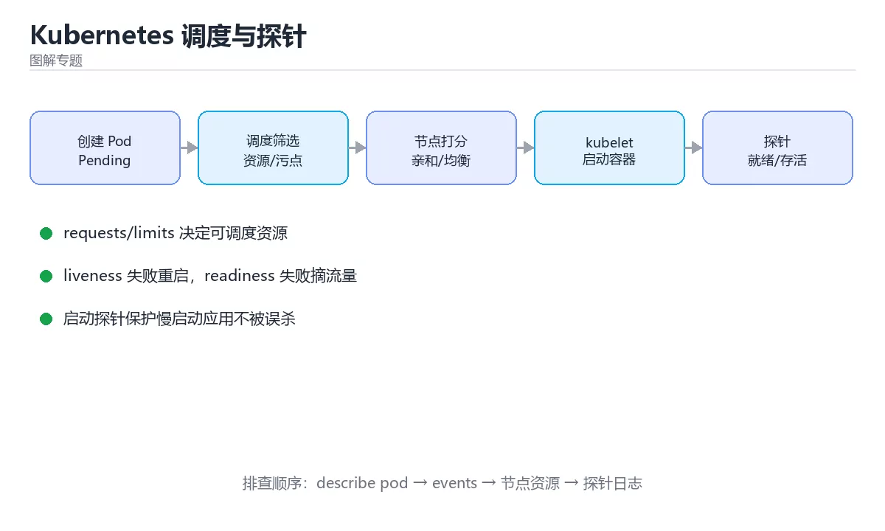

# 图解 Kubernetes 调度与探针

> 内容更新时间：2026-10-03



## 学习目标

- 能用自己的话解释图解 Kubernetes 调度与探针解决了什么问题，而不是只背术语。
- 能说清 「Kubernetes」、「调度」、「探针」、「滚动更新」 之间的关系，并分别举出一个例子。
- 能把本课知识放回「图解专题」的知识体系，说明它和相邻主题的边界。
- 能完成本课练习，并用验收标准检查自己的结果。

> 一句话摘要：Pod 一生、调度两步决策、三种探针分工与优雅下线。

## 前置知识

- 先完成上一课《图解 HTTPS 证书链与 TLS 握手》；如果已经掌握，可以直接用本课练习自测。
- 本课阶段：进阶。建议先掌握同一分类的基础课程，并能独立运行正文中的最小示例。
- 开始前先复习：Kubernetes、调度、探针。
- 如果某一步看不懂，先记录具体卡点，完成练习后再回头读一遍。

## 一句话说清

Kubernetes 的核心是**声明期望状态 + 控制循环纠正**。
一个 Pod 从被创建到能接流量，要经过**调度、启动、探针检查、注册端点**四步。

## 一张图看懂 Pod 的一生

```text
① 你提交 Deployment（期望副本数 3）
        │
        ▼
② Deployment → ReplicaSet → 创建 3 个 Pod 对象（Pending）
        │
        ▼
③ 调度器 kube-scheduler 选节点
   · 过滤：资源够不够、污点能否容忍、亲和性是否满足
   · 打分：资源均衡、尽量分散、镜像已缓存
        │
        ▼
④ kubelet 拉起容器
   · 拉镜像 → 创建容器 → 执行 startupProbe
        │
        ▼
⑤ 探针通过
   · readinessProbe 通过 → 加入 Service Endpoints（开始接流量）
   · livenessProbe 失败 → 重启容器
        │
        ▼
⑥ 对外提供服务（Running）
```

## 调度器的两步决策

```text
第一步：过滤（Filter）—— 排除不合适的节点
  ┌──────────────┐
  │ 节点 A 内存不足 │ ✗ 排除
  │ 节点 B 有污点    │ ✗ 排除
  │ 节点 C 满足条件  │ ✓ 保留
  │ 节点 D 满足条件  │ ✓ 保留
  └──────────────┘

第二步：打分（Score）—— 在合格节点里选最优
  节点 C：资源均衡 70 分
  节点 D：资源均衡 85 分，且镜像已缓存 +10
  → 选择节点 D
```

| 约束类型 | 例子 | 作用 |
| --- | --- | --- |
| 资源请求 | `requests.cpu: 500m` | 调度依据（不是 limit） |
| 节点选择器 | `nodeSelector: disktype=ssd` | 只调度到特定节点 |
| 亲和性 | `nodeAffinity` / `podAntiAffinity` | 靠拢或分散 |
| 污点与容忍 | `taints` / `tolerations` | 独占节点或隔离 |

```yaml
resources:
  requests: { cpu: 500m, memory: 512Mi }   # 调度按这个预留
  limits:   { cpu: "1",  memory: 1Gi }     # 上限，超了会被限制或杀掉

topologySpreadConstraints:                 # 让副本分散到不同节点
  - maxSkew: 1
    topologyKey: kubernetes.io/hostname
    whenUnsatisfiable: ScheduleAnyway
    labelSelector:
      matchLabels: { app: web }
```

**只写 limits 不写 requests 是常见错误**：调度器会按 0 请求处理，导致节点超卖。

## 三种探针的分工与顺序

```text
容器启动
   │
   ├─ startupProbe（启动慢的服务用）
   │     失败 → 重启容器；通过后不再执行
   │
   ├─ readinessProbe（能否接流量）
   │     失败 → 从 Endpoints 摘除，不重启
   │
   └─ livenessProbe（是否还活着）
         失败 → 重启容器
```

| 探针 | 检查什么 | 失败后果 | 典型配置 |
| --- | --- | --- | --- |
| startupProbe | 是否完成初始化 | 重启 | `failureThreshold: 30`，间隔 2s |
| readinessProbe | 能否处理请求 | 摘流量 | 依赖检查放这里 |
| livenessProbe | 进程是否卡死 | 重启 | 不要检查外部依赖 |

```yaml
readinessProbe:
  httpGet: { path: /healthz/ready, port: 8080 }
  initialDelaySeconds: 3
  periodSeconds: 5
  failureThreshold: 3

livenessProbe:
  httpGet: { path: /healthz/live, port: 8080 }
  periodSeconds: 10
  failureThreshold: 3

startupProbe:                # 启动慢时用它保护 liveness
  httpGet: { path: /healthz/live, port: 8080 }
  failureThreshold: 30
  periodSeconds: 2
```

## 发布期间 Pod 的流转

```text
滚动更新（maxSurge=1, maxUnavailable=0）

旧版本 [A1][A2][A3]
  ① 新建 B1 → ready 后加入 Endpoints      [A1][A2][A3][B1]
  ② 摘除 A1 → 等待在途请求结束              [A2][A3][B1]
  ③ 新建 B2 → ready 后加入                 [A2][A3][B1][B2]
  ④ 摘除 A2 …依此类推，直到全部替换为 B

全程可用副本数不低于 3，因此不中断服务
```

```yaml
strategy:
  type: RollingUpdate
  rollingUpdate:
    maxSurge: 1              # 最多多出 1 个
    maxUnavailable: 0        # 保证可用副本不减少
terminationGracePeriodSeconds: 30
```

## 优雅下线的四步

```text
1. Pod 变为 Terminating，从 Endpoints 摘除（停止新流量）
2. preStop 钩子执行（例如 sleep 5 秒，等负载均衡刷新）
3. 发送 SIGTERM 给容器主进程
4. 应用停止接收新请求、处理完在途请求后退出
   （超时未退出则 SIGKILL）
```

```yaml
lifecycle:
  preStop:
    exec:
      command: ["/bin/sh", "-c", "sleep 5"]
```

## 常见异常状态对照

| 状态 | 含义 | 排查方向 |
| --- | --- | --- |
| `Pending` | 没有合适节点 | 资源不足、污点、PVC 未绑定 |
| `ContainerCreating` | 正在拉镜像或挂卷 | 镜像仓库、密钥、存储 |
| `CrashLoopBackOff` | 容器反复退出 | 看 `logs --previous` 与探针配置 |
| `ImagePullBackOff` | 拉不到镜像 | 镜像名、镜像仓库凭据 |
| `Running` 但不接流量 | 就绪探针未通过 | 检查 readiness 路径与依赖 |
| `OOMKilled` | 超过内存 limit | 调大 limit 或修内存泄漏 |

```bash
kubectl get pods -o wide                        # 状态与所在节点
kubectl describe pod <pod>                      # 事件是排查关键
kubectl logs <pod> --previous                   # 崩溃前的日志
kubectl get events --sort-by=.lastTimestamp     # 集群事件时间线
kubectl top pod <pod>                           # 实际资源用量
```

## 新手最容易踩的八个坑

| 坑 | 现象 | 正确做法 |
| --- | --- | --- |
| 只写 limits 不写 requests | 节点超卖、Pod 被驱逐 | 两者都写 |
| liveness 检查外部依赖 | 依赖抖动引发重启风暴 | 依赖检查放 readiness |
| 探针超时设置过短 | 频繁误判 | 结合真实启动时间设置 |
| 没有 startupProbe | 启动慢被 liveness 杀掉 | 加 startupProbe 保护 |
| 没有 preStop | 发布期间偶发 502 | 加 preStop 等待摘流 |
| 副本全挤在同一节点 | 节点故障全挂 | 用反亲和或分散约束 |
| 镜像标签用 latest | 版本不可控 | 用 commit SHA |
| 不看 describe 只看 logs | 找不到调度或拉镜像问题 | 先看事件再看日志 |

## 本课小结
- Pod 的一生：**调度 → 启动 → 探针 → 接流量**，每一环都有对应的排查命令。
- 三种探针职责不同：**startup 保护启动、readiness 控制流量、liveness 负责重启**。
- 调度只认 `requests`，`limits` 决定上限，两者都要写。

## 动手练习

> 本课练习重点：围绕「Kubernetes、调度、探针」完成复述、实验和交付，每个结果都要能被别人检查。

先不看原图手绘流程，再标出状态变化，最后用自己的话解释关键一步。

### 练习 1：建立心智模型（10 分钟）

合上教程，用 3～5 句话回答：

1. 图解 Kubernetes 调度与探针解决了什么问题？
2. 如果没有它，会出现什么具体后果？
3. 它和「调度」是什么关系？

**验收标准**：至少出现一个本课关键词，并写出一个反例、边界条件或失效场景。

### 练习 2：做一次可控实验（20 分钟）

从正文中选一个最小示例，完成以下操作：

1. 先预测修改一个参数、输入或步骤后的结果。
2. 再实际执行或逐步推演，记录真实结果。
3. 如果结果与预测不同，写出差异原因。

**验收标准**：留下「原例 → 改动 → 预测 → 结果 → 原因」五步记录。

### 练习 3：交付一个小结果（30 分钟）

不看原图手绘一遍流程，再用自己的话指出图中的关键状态变化。

任务要求：

- 结果必须能被别人检查，不能只写“我已经理解了”。
- 至少覆盖「Kubernetes」和「调度」两个关键词。
- 写出 1 个仍然不确定的问题，以及下一步如何验证。

> 提示：时间有限时优先做练习 1 和练习 2；练习 3 可以拆成两次完成。

## 可运行练习

### 任务 1：先跑通，再解释

```bash
kubectl get pods -o wide                        # 状态与所在节点
kubectl describe pod <pod>                      # 事件是排查关键
kubectl logs <pod> --previous                   # 崩溃前的日志
kubectl get events --sort-by=.lastTimestamp     # 集群事件时间线
kubectl top pod <pod>                           # 实际资源用量
```

### 任务 2：只改一个条件

### 任务 3：迁移到自己的数据

用同一套思路处理一组你自己的数据或场景，保持输出格式与任务 1 一致。

## 故障现场

### 现场 1：本课的 Kubernetes 常规用例通过，但边界用例失败

**症状**：在本课的练习或生产场景里出现“本课的 Kubernetes 常规用例通过，但边界用例失败”。

**复现**：准备一组最小输入，只保留触发“本课的 Kubernetes 常规用例通过，但边界用例失败”的必要条件，连续运行两次确认结果稳定。

**定位**：围绕“Kubernetes 的前置条件与取值边界没有写进代码，默认值掩盖了空值和极值”检查调用链、输入数据和环境配置，先验证假设再改代码。

**预防**：把“本课的 Kubernetes 常规用例通过，但边界用例失败”写成一条自动化用例，并在本课的验收清单里保留对应检查项。

### 现场 2：本课的 调度 结果在两次运行之间不一致

**症状**：在本课的练习或生产场景里出现“本课的 调度 结果在两次运行之间不一致”。

**复现**：准备一组最小输入，只保留触发“本课的 调度 结果在两次运行之间不一致”的必要条件，连续运行两次确认结果稳定。

**定位**：围绕“调度 依赖了当前版本、执行顺序或共享状态，单次运行无法暴露差异”检查调用链、输入数据和环境配置，先验证假设再改代码。

**预防**：把“本课的 调度 结果在两次运行之间不一致”写成一条自动化用例，并在本课的验收清单里保留对应检查项。

### 现场 3：本课的验证只在开发机通过

**症状**：在本课的练习或生产场景里出现“本课的验证只在开发机通过”。

**定位**：围绕“环境版本、配置和输入规模与目标环境不同，Kubernetes 缺少可重复的验证记录”检查调用链、输入数据和环境配置，先验证假设再改代码。

## 深入补充：图解 Kubernetes 调度与探针 的取舍与边界

### 一、把概念放回真实约束

学习图解 Kubernetes 调度与探针时，最容易只记住结论而忽略前提。先写出三个约束：数据规模、时间预算、可接受的失败方式；再判断 Kubernetes 与 调度 在这些约束下是否仍然成立。只要约束改变，原来的最优解就可能变成错误解。

| 观察到的现象 | 背后的机制 | 验证方式 | 常见误判 |
| --- | --- | --- | --- |
| 延迟突然升高 | 队列堆积或重传 | 分段计时与指标对照 | 只盯平均值 |
| 状态看似随机 | 并发交错或缓存失效 | 固定随机种子复现 | 把时序问题当逻辑错误 |
| 结果与预期不符 | 默认值与边界规则 | 构造最小输入 | 忽略版本差异 |

### 二、三个容易混淆的边界

2. **把“平均值”当成“全部”**：Kubernetes 的指标好看，不代表尾部请求、冷启动或失败重试也好看。
3. **把“当前版本”当成“永久行为”**：调度 依赖的默认值、API 或性能特征都可能随版本变化，需要固定版本并保留回归用例。

### 三、一个生产场景

假设团队要在真实系统里使用图解 Kubernetes 调度与探针：第一周先做小流量验证，记录 Kubernetes 的基线与异常；第二周扩大输入规模，观察 调度 是否成为瓶颈；第三周再做故障演练，主动注入超时、重复请求和依赖不可用，确认系统能降级、能重试、能恢复。每一步都要留下指标、日志和结论，而不是只留下“感觉更快了”。

### 四、自测清单

- 能否用一句话说出图解 Kubernetes 调度与探针解决的核心问题与不适用场景？
- 能否画出 Kubernetes 的数据流或状态变化，并标出失败路径？
- 能否给出一个反例，证明某个看似合理的结论在边界条件下不成立？
- 能否写出一条可复现的验证命令，让别人独立得到相同结论？

## 本课复习清单

离开本课前，逐项确认：

- [ ] 不看解析，能说出「调度器为 Pod 选择节点时，依据的是哪个资源字段？」的判断依据。
- [ ] 不看解析，能说出「依赖服务（如数据库）不可用时，应该影响哪个探针？」的判断依据。
- [ ] 不看解析，能说出「startupProbe 的主要作用是？」的判断依据。
- [ ] 不看解析，能说出「为了让滚动更新期间不中断服务，合理的策略配置是？」的判断依据。
- [ ] 不看解析，能说出的判断依据。
- [ ] 至少运行一次本课示例，记录输入、输出和一个边界情况。
- [ ] 把本课最容易混淆的两个概念写成一句话对照。

| 复盘项 | 记录 |
| --- | --- |
| 已经能独立解释的考点 |  |
| 仍然说不清的概念 |  |
| 下一步验证动作 |  |

## 术语速查

| 术语 | 本课语境 |
| --- | --- |
| `requests.cpu: 500m` | \| 资源请求 \| `requests.cpu: 500m` \| 调度依据（不是 limit） \| |
| `nodeSelector: disktype=ssd` | \| 节点选择器 \| `nodeSelector: disktype=ssd` \| 只调度到特定节点 \| |
| `nodeAffinity` | \| 亲和性 \| `nodeAffinity` / `podAntiAffinity` \| 靠拢或分散 \| |
| `podAntiAffinity` | \| 亲和性 \| `nodeAffinity` / `podAntiAffinity` \| 靠拢或分散 \| |
| `taints` | \| 污点与容忍 \| `taints` / `tolerations` \| 独占节点或隔离 \| |
| `tolerations` | \| 污点与容忍 \| `taints` / `tolerations` \| 独占节点或隔离 \| |
| `failureThreshold: 30` | \| startupProbe \| 是否完成初始化 \| 重启 \| `failureThreshold: 30`，间隔 2s \| |
| `Pending` | \| `Pending` \| 没有合适节点 \| 资源不足、污点、PVC 未绑定 \| |
| `ContainerCreating` | \| `ContainerCreating` \| 正在拉镜像或挂卷 \| 镜像仓库、密钥、存储 \| |
| `CrashLoopBackOff` | \| `CrashLoopBackOff` \| 容器反复退出 \| 看 `logs --previous` 与探针配置 \| |
| `logs --previous` | \| `CrashLoopBackOff` \| 容器反复退出 \| 看 `logs --previous` 与探针配置 \| |
| `ImagePullBackOff` | \| `ImagePullBackOff` \| 拉不到镜像 \| 镜像名、镜像仓库凭据 \| |

## 考点精讲

### 考点 1：围绕“图解 Kubernetes 调度与探针”中的 Kubernetes、调度、探针，下列哪两项是本课强调的实践判断？

- **判断依据**：本课把图解 Kubernetes 调度与探针拆成概念、示例与故障现场三部分，因此判断 Kubernetes 时必须同时交代输入、输出和失败路径，这使“学习 Kubernetes 时要同时说明输入、输出和失败路径，不能只看正常流程”成立。在图解 Kubernetes 调度与探针里，判断 调度 时要固定版本与边界输入，所以“验证 调度 时要固定版本并覆盖边界输入，结论才可复现”才可复现。

### 考点 2：下面这段代码代码摘自「图解 Kubernetes 调度与探针」的正文示例。关于这段代码，下面哪一项说法与实际内容相符？

- **判断依据**：在「图解 Kubernetes 调度与探针」里，这段代码只做静态声明，没有循环、分支或可观察输出。这段代码出自「图解 Kubernetes 调度与探针」的正文示例，围绕Kubernetes、调度、探针展开；把输入或边界换成空值、极值或失败情况后，结论要以「图解 Kubernetes 调度与探针」的实际运行结果为准。

### 考点 3：startupProbe 的主要作用是？

- **判断依据**：在「图解 Kubernetes 调度与探针」里，保护启动慢的服务。startupProbe 通过之前，liveness 不会介入，从而保护慢启动服务。这道题的关键在「图解 Kubernetes 调度与探针」的Kubernetes、调度、探针：先确认题干“startupProbe 的主要作用”问的是哪一步，再排除偷换前提的选项。

### 考点 4：为了让滚动更新期间不中断服务，合理的策略配置是？

- **判断依据**：在「图解 Kubernetes 调度与探针」里，结论应落在「maxSurge=1，maxUnavailable=0」。先多起一个新副本并等它就绪，再摘除旧副本，可保证可用副本不减少。这道题的关键在「图解 Kubernetes 调度与探针」的Kubernetes、调度、探针：先确认题干“为了让滚动更新期间不中断服务”问的是哪一步，再排除偷换前提的选项。

### 考点 5：补全代码：「图解 Kubernetes 调度与探针」示例中，下面这行代码缺少哪个关键字或函数名？请填入 ____。

`____: 3`

- **判断依据**：空格应填写「failureThreshold」、「failurethreshold」。这道题的关键在「图解 Kubernetes 调度与探针」的Kubernetes、调度、探针：先确认题干“补全代码”问的是哪一步，再排除偷换前提的选项。把“failureThreshold”代回「图解 Kubernetes 调度与探针」里“图解 Kubernetes 调度与探针示例中”的例子核对，条件一旦改变，结论就要用Kubernetes、调度、探针重新推导。

## English Overview

**Title:** Kubernetes Scheduling Illustrated

**Summary:** Pod lifecycle, scheduling, probes and graceful shutdown.

**Category:** Visual Guide
**Level:** 进阶
**Key terms:** Kubernetes, 调度, 探针, 滚动更新, 优雅下线

## 内容元数据

- 内容版本：v2.0
- 最后更新：2026-10-03
- 学习阶段：进阶
- 适用环境：通用图解与系统原理
- 内容来源：内置结构化课程与工程实践整理
- 相关主题：Kubernetes、调度、探针、滚动更新、优雅下线
- 质量版本：P0 测验标准 + P1 覆盖扩展 + P2 体验补全

## 参考资料与复核

- 最后复核：2026-10-04
- 下次复核：2027-04-04
- 复核范围：版本兼容、API 行为、安全建议与工程实践
- 来源性质：官方文档、标准或权威教材；正文为离线教学重组

| 参考资料 | 本课用途 |
| --- | --- |
| [Kubernetes 架构](https://kubernetes.io/docs/concepts/architecture/) | 控制平面与节点流程 |
| [Mermaid 文档](https://mermaid.js.org/intro/) | 流程图、时序图与状态图 |
| [W3C 规范](https://www.w3.org/TR/) | Web 标准结构图 |

> 「图解 Kubernetes 调度与探针」的链接用于离线阅读后的延伸核对；App 不会自动联网。
