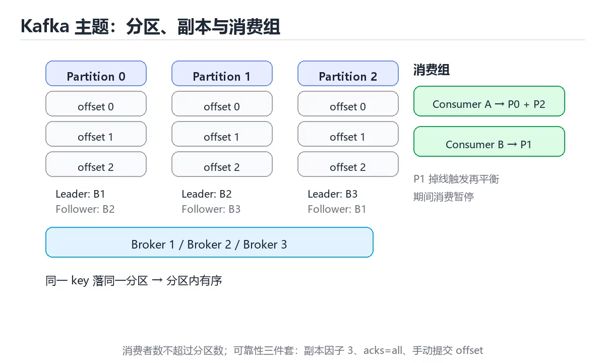
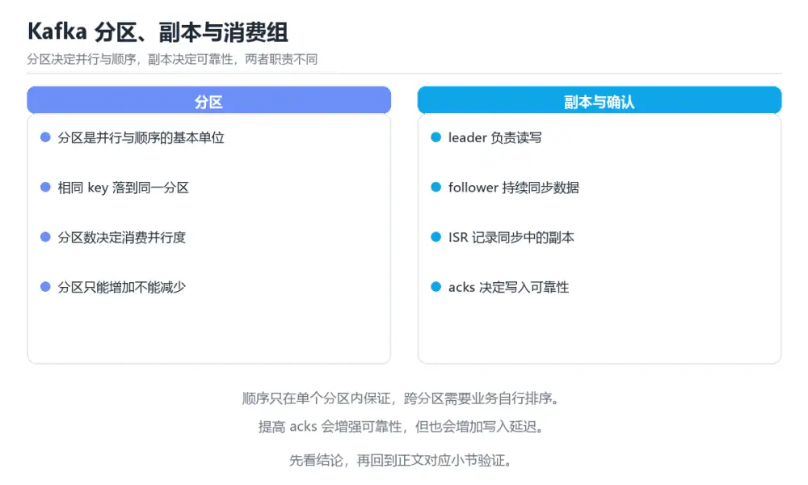

# 图解 Kafka 分区、副本与再平衡

> 内容更新时间：2026-10-06 · 学习阶段：进阶 · 预计用时：40 分钟

## 学习目标

- 能用自己的话解释图解 Kafka 分区、副本与再平衡解决了什么问题，而不是只背术语。
- 能说清 「Kafka」、「分区」、「再平衡」、「ISR」 之间的关系，并分别举出一个例子。
- 能把 Kafka 放回「图解 Kafka 分区、副本与再平衡」的知识体系，说明它和 分区 的边界。
- 能完成本课练习，并用验收标准检查自己的结果。

> 一句话摘要：分区与顺序、消费者组再平衡、ISR 副本机制与位点提交。

## 前置知识

- 先完成上一课《图解限流、熔断与降级》；如果已经掌握，可以直接用本课练习自测。
- 本课阶段：进阶。建议先完成「图解限流、熔断与降级」，或确认自己能独立跑通正文里的 idempotence 示例。
- 开始前先复习：Kafka、分区、再平衡。
- 卡在 Kafka 上时不要跳过：把输入、预期和实际输出写成三行，再回头读正文。



## 一句话说清

Kafka 用**分区**实现并行，用**副本**实现容错，用**消费者组**实现横向扩展。
再平衡（Rebalance）是这三者配合时的副作用：**分区重新分配期间，消费会短暂停顿**。

## 一张图看懂主题与分区

```text
Topic: orders（3 个分区，副本因子 2）

  Partition 0        Partition 1        Partition 2
  ┌──────────┐       ┌──────────┐       ┌──────────┐
  │ offset 0 │       │ offset 0 │       │ offset 0 │
  │ offset 1 │       │ offset 1 │       │ offset 1 │
  └──────────┘       └──────────┘       └──────────┘
   Leader: B1         Leader: B2         Leader: B3
   Follower: B2       Follower: B3       Follower: B1

  Broker 1 / Broker 2 / Broker 3
  每条消息只落在其中一个分区；分区内严格有序
```

| 概念 | 作用 |
| --- | --- |
| 分区 Partition | 并行单位，也是顺序单位 |
| 副本 Replica | 容错，Leader 挂掉由 ISR 中的 Follower 接管 |
| 偏移量 Offset | 分区内的消息序号，单调递增 |
| 消费者组 | 一组消费者共同消费一个主题 |

## 分区与顺序的关系

```text
同一个 key 总是落到同一分区（默认按 key 的哈希取模）

  key=user1 ──► Partition 0   ┐
  key=user2 ──► Partition 1   ├─ 同一 key 的消息严格有序
  key=user3 ──► Partition 2   ┘
  key=user1 ──► Partition 0

结论：需要「同一业务键有序」时，把业务键设为消息 key
```

**全局有序的唯一办法是所有消息进同一分区**，代价是并行度归零。

## 消费者组与再平衡

```text
初始状态：3 个分区，3 个消费者，一人一个分区

  Consumer A ── 分区 0
  Consumer B ── 分区 1
  Consumer C ── 分区 2

消费者 C 掉线 → 触发再平衡

  Consumer A ── 分区 0 与 2      ← 一人分到两个
  Consumer B ── 分区 1
```

```text
再平衡期间发生什么
  ① 组协调器撤销所有分区的分配（Stop-the-world）
  ② 重新分配分区
  ③ 消费者从各自提交的 offset 继续消费

代价：期间消费停顿；重复消费从上次提交点开始（至少一次语义）
```

| 触发原因 | 说明 |
| --- | --- |
| 消费者加入或离开 | 扩容、发布重启 |
| 消费者心跳超时 | GC 停顿或线程被阻塞 |
| 分区数变化 | 主题扩容 |
| 订阅关系变化 | 正则订阅匹配到新主题 |

**减少再平衡的三种手段**：延长会话超时、给消费者留足处理时间、避免频繁重启。

## 副本与 ISR

```text
ISR（In-Sync Replicas）：与 Leader 保持同步的副本集合

  Leader (B1)  ──写入──►  offset 100
  Follower B2  ──追上──►  offset 100   ✓ 在 ISR
  Follower B3  ──滞后──►  offset 92    ✗ 被移出 ISR

Leader 故障时：只从 ISR 中选新 Leader，避免丢已提交消息
```

| 参数 | 含义 | 建议 |
| --- | --- | --- |
| `replication.factor` | 副本数 | 生产至少 3 |
| `min.insync.replicas` | 最少同步副本数 | 设为 2（配合 acks=all） |
| `acks` | 生产端确认级别 | 关键数据用 `all` |
| `unclean.leader.election` | 是否允许非 ISR 当选 | 关键数据保持 false |

```properties
# 生产端：确保写入被至少 2 个副本确认
acks=all
min.insync.replicas=2
retries=2147483647
enable.idempotence=true
```

## 消费位点提交方式

| 方式 | 语义 | 风险 |
| --- | --- | --- |
| 自动提交 | 至少一次 | 处理前提交会丢消息 |
| 手动同步提交 | 至少一次 | 吞吐略降，最常用 |
| 手动异步提交 | 至少一次 | 提交失败需处理 |

```text
自动提交的经典事故
  提交间隔 5 秒 → 拉取消息 → 自动提交 offset → 处理失败 → 重启
  → 消息已被标记为消费过，实际未处理 → 丢消息

正确顺序：处理成功 → 手动提交 offset
```

## 常见错误与排查

| 坑 | 现象 | 正确做法 |
| --- | --- | --- |
| 分区数设太少 | 无法水平扩展 | 按目标吞吐预估，可后续扩容 |
| 分区数设太多 | 元数据与重建开销大 | 适度即可 |
| 消费者数超过分区数 | 多出的消费者空转 | 消费者数不超过分区数 |
| 处理时间超过心跳 | 频繁再平衡 | 调大超时或异步处理 |
| 自动提交 offset | 丢消息 | 手动提交 |
| `acks=1` 当强一致 | 主副本挂掉丢数据 | 用 `acks=all` |
| 允许非 ISR 选主 | 数据丢失 | 保持默认禁用 |
| 用 key 保证全局有序 | 只有单分区才全局有序 | 明确只需业务键有序 |



## 本课小结

- 分区既是**并行单位**也是**顺序单位**：要单键有序就把业务键设为 key。
- 再平衡会短暂停消费，减少它的关键是**稳定的消费者与合理超时**。
- 可靠性三件套：**副本因子 3、`acks=all`、手动提交 offset**。

## 补充：生产端可靠性、再平衡协议与容量估算

### 生产端的三道可靠性开关

```properties
# 1. 确认级别：全部 ISR 确认才算成功
acks=all

# 2. 幂等生产者：避免重试导致重复写入
enable.idempotence=true

# 3. 重试与顺序
retries=2147483647
max.in.flight.requests.per.connection=5   # 幂等开启时可放宽，仍保证顺序
```

| 配置组合 | 丢数据风险 | 重复风险 | 适用 |
| --- | --- | --- | --- |
| `acks=0` | 高 | 低 | 日志采集等可丢场景 |
| `acks=1` | 中（主副本故障即丢） | 中 | 一般业务 |
| `acks=all` + 幂等 | 低 | 低 | **订单、支付等关键数据** |

```text
注意：acks=all 只保证「写入成功」，不保证「消费一次」
  生产者 → 分区（不丢）→ 消费者仍可能重复处理
  因此消费端幂等依然必需
```

### 再平衡的两种协议

| 协议 | 行为 | 代价 |
| --- | --- | --- |
| Eager（传统） | 撤销全部分区再重新分配 | 全组短暂停消费 |
| Cooperative（增量） | 只迁移需要变动的分区 | 停顿更短，可多次轮次完成 |

```properties
# 使用增量再平衡（Kafka 2.4+ 消费者）
partition.assignment.strategy=org.apache.kafka.clients.consumer.CooperativeStickyAssignor
```

```text
减少再平衡的四个参数
  session.timeout.ms            会话超时（默认 45s）：太短会误判掉线
  heartbeat.interval.ms         心跳间隔（默认 3s）：应为会话超时的 1/3
  max.poll.interval.ms          两次 poll 最大间隔（默认 5min）：处理慢就调大
  max.poll.records              单次 poll 拉取条数：调小可降低单批处理时间
```

**排查口诀**：频繁再平衡时先看 `max.poll.interval.ms` 是否小于实际处理时间。

### ISR、HW 与 LEO

```text
LEO（Log End Offset）    某副本最后一条消息的下一个位置
HW（High Watermark）     所有 ISR 都已复制的最高位置

          Partition 0
  LEO(leader)      ─────────────► 120
  LEO(follower-1)  ────────────►  120
  LEO(follower-2)  ───────►       115
  HW               ───────►       115   ← 消费者只能读到 HW 之前的消息

含义：消费者读不到「尚未被足够副本确认」的消息，避免读到将来可能丢失的数据
```

### 分区数估算

```text
按吞吐估算
  目标吞吐 100 MB/s，单分区实测 20 MB/s
  → 至少 5 个分区；留一倍余量 → 10 个

按消费者并行度估算
  消费者数上限 = 分区数
  → 想让 12 个消费者都干活，分区数至少 12

经验补充
  · 分区数只增不减（减少需要重建主题）
  · 分区过多会增加元数据与再平衡开销，单集群常见上限几千个
  · 分区数应结合「峰值吞吐」而不是平均值
```

### 常用运维命令

```bash
# 查看主题分区与副本分布
kafka-topics.sh --describe --topic orders --bootstrap-server localhost:9092

# 查看消费组堆积（lag）
kafka-consumer-groups.sh --describe --group order-worker --bootstrap-server localhost:9092

# 增加分区（注意：会改变 key 的分区映射）
kafka-topics.sh --alter --topic orders --partitions 12 --bootstrap-server localhost:9092
```

```text
增加分区前必须评估
  · 同一 key 的新旧消息可能落到不同分区 → 破坏单键有序
  · 需要停机或做双写迁移才能安全扩容
```

### 自查清单

- [ ] 关键主题启用 `acks=all` 与幂等生产者
- [ ] 消费端实现幂等，不依赖「消息不会重复」
- [ ] 使用增量再平衡，并调好 poll 相关参数
- [ ] 能解释 HW 与 LEO 的关系
- [ ] 扩容分区前评估过 key 映射变化的影响

## 动手练习

> 本课练习重点：围绕「Kafka、分区、再平衡」完成复述、实验和交付，每个结果都要能被别人检查。

手绘 分区 的状态转移图，标出哪一步会写数据。

### 练习 1：建立心智模型（10 分钟）

合上教程，用 3～5 句话回答：

1. 图解 Kafka 分区、副本与再平衡解决了什么问题？
2. 如果没有它，会出现什么具体后果？
3. 它和「分区」是什么关系？

验收标准：回答里必须出现 Kafka，并写出一个让结论失效的边界条件。

### 练习 2：做一次可控实验（20 分钟）

从正文中选一个最小示例，完成以下操作：

1. 先预测修改一个参数、输入或步骤后的结果。
2. 再实际执行或逐步推演，记录真实结果。
3. 如果结果与预测不同，写出差异原因。

**验收标准**：把 idempotence 当作原例，改动一次分区的取值，记录命令、输出与差异原因；五步里缺任意一步都算未完成。

### 练习 3：交付一个小结果（30 分钟）

不看原图手绘一遍流程，再用自己的话指出图中的关键状态变化。

任务要求：

- 结果必须能被别人检查，不能只写“我已经理解了”。
- 至少覆盖「Kafka」和「分区」两个关键词。
- 写出 1 个仍然不确定的问题，以及下一步如何验证。

> 提示：时间有限时优先做练习 1 和练习 2；练习 3 可以拆成两次完成。

## 可运行练习

### 任务 1：先跑通，再解释

```bash
# 查看主题分区与副本分布
kafka-topics.sh --describe --topic orders --bootstrap-server localhost:9092

# 查看消费组堆积（lag）
kafka-consumer-groups.sh --describe --group order-worker --bootstrap-server localhost:9092

# 增加分区（注意：会改变 key 的分区映射）
kafka-topics.sh --alter --topic orders --partitions 12 --bootstrap-server localhost:9092
```

### 任务 2：只改一个条件

把「图解 Kafka 分区、副本与再平衡」的最小示例复制一份，只改一个条件再跑一次：

- 改动点：只调整 idempotence 的一个参数，其余条件一律不动。
- 预测：先写下「图解 Kafka 分区、副本与再平衡」在改动后的输出或错误信息，再运行。
- 记录：对照改动前后的结果，指出差异出在哪一步。
- 验收：换回原条件能复现原结果，改动只影响Kafka。

### 任务 3：迁移到自己的数据

换一个 分区 场景重做一次，确认结论不是只对示例数据成立。

## 故障现场

### 现场 1：分区数设太少

**症状**：在《图解 Kafka 分区、副本与再平衡》的复现场景中，无法水平扩展。

**根因**：触发点是把“分区数设太少”当成安全做法。它没有满足《图解 Kafka 分区、副本与再平衡》要求的前提，因此先表现为“无法水平扩展”；排查时先完整复现这一段，再核对输入、配置与依赖。

**修复**：针对《图解 Kafka 分区、副本与再平衡》的问题，按目标吞吐预估，可后续扩容。

**验证**：先在《图解 Kafka 分区、副本与再平衡》中记录“分区数设太少”留下的失败证据，再执行“按目标吞吐预估，可后续扩容”并重放；确认错误路径变为明确结果，且修复没有掩盖同类故障。

### 现场 2：消费者数超过分区数

**症状**：在《图解 Kafka 分区、副本与再平衡》的复现场景中，多出的消费者空转。

**根因**：当出现“消费者数超过分区数”时，执行路径已经绕过了《图解 Kafka 分区、副本与再平衡》的关键约束，最终以“多出的消费者空转”暴露出来；修复前必须先确认约束在哪里失效。

**修复**：针对《图解 Kafka 分区、副本与再平衡》的问题，消费者数不超过分区数。

**验证**：保留《图解 Kafka 分区、副本与再平衡》里触发“多出的消费者空转”的输入、版本和日志，按“消费者数不超过分区数”完成修改后原样重放；只有失败现象消失且相邻场景仍可解释，才保留改动。

### 现场 3：acks=1 当强一致

**症状**：在《图解 Kafka 分区、副本与再平衡》的复现场景中，主副本挂掉丢数据。

**根因**：触发点是把“acks=1 当强一致”当成安全做法。它没有满足《图解 Kafka 分区、副本与再平衡》要求的前提，因此先表现为“主副本挂掉丢数据”；排查时先完整复现这一段，再核对输入、配置与依赖。

**修复**：针对《图解 Kafka 分区、副本与再平衡》的问题，用 acks=all。

**验证**：保留《图解 Kafka 分区、副本与再平衡》里触发“主副本挂掉丢数据”的输入、版本和日志，按“用 acks=all”完成修改后原样重放；只有失败现象消失且相邻场景仍可解释，才保留改动。

## 深入补充：图解 Kafka 分区、副本与再平衡 的取舍与边界

### 一、把概念放回真实约束

学习图解 Kafka 分区、副本与再平衡时，最容易只记住结论而忽略前提。先写出三个约束：数据规模、时间预算、可接受的失败方式；再判断 Kafka 与 分区 在这些约束下是否仍然成立。只要约束改变，原来的最优解就可能变成错误解。

| 观察到的现象 | 背后的机制 | 验证方式 | 常见误判 |
| --- | --- | --- | --- |
| 延迟突然升高 | 队列堆积或重传 | 分段计时与指标对照 | 只盯平均值 |
| 状态看似随机 | 并发交错或缓存失效 | 固定随机种子复现 | 把时序问题当逻辑错误 |
| 结果与预期不符 | 默认值与边界规则 | 构造最小输入 | 忽略版本差异 |

### 二、三个容易混淆的边界

1. 澄清输入与目标。先写清「图解 Kafka 分区、副本与再平衡」要解决的问题、合法输入范围和成功标准，再进入后续步骤。
2. **把“平均值”当成“全部”**：Kafka 的指标好看，不代表尾部请求、冷启动或失败重试也好看。
3. **把“当前版本”当成“永久行为”**：分区 依赖的默认值、API 或性能特征都可能随版本变化，需要固定版本并保留回归用例。

### 三、一个生产场景

假设团队要在真实系统里使用图解 Kafka 分区、副本与再平衡：第一周先做小流量验证，记录 Kafka 的基线与异常；第二周扩大输入规模，观察 分区 是否成为瓶颈；第三周再做故障演练，主动注入超时、重复请求和依赖不可用，确认系统能降级、能重试、能恢复。每一步都要留下指标、日志和结论，而不是只留下“感觉更快了”。

### 四、自测清单

- 能否用一句话说出图解 Kafka 分区、副本与再平衡解决的核心问题与不适用场景？
- 能否画出 Kafka 的数据流或状态变化，并标出失败路径？
- 把 idempotence 的输入推到边界，说明本课哪一条结论会先失效。
- 能否写出一条可复现的验证命令，让别人独立得到相同结论？

## 本课复习清单

离开本课前，逐项确认：

- [ ] 不看解析，能说出「在 Kafka 中，要保证「同一用户的动作有序」，应该？」的判断依据。
- [ ] 不看解析，能说出「消费者组再平衡的主要代价是？」的判断依据。
- [ ] 不看解析，能说出「为避免「消息被标记已消费但实际未处理」，正确的提交顺序是？」的判断依据。
- [ ] 至少运行一次 idempotence 的示例，记录输入、输出和 Kafka 的边界情况。
- [ ] 把本课最容易混淆的两个概念写成一句话对照。

| 复盘项 | 记录 |
| --- | --- |
| 已经能独立解释的考点 |  |
| 仍然说不清的概念 |  |
| 下一步验证动作 |  |

## 术语速查

把「图解 Kafka 分区、副本与再平衡」里反复出现的术语集中放在一起。复习时先遮住右列，尝试用自己的话解释，再回到正文核对。

| 术语 | 一句话说明 |
| --- | --- |
| `Kafka` | 分布式追加日志与消息系统，用分区保存有序事件并支持多消费者扩展。 |
| `分区` | 把一份数据或流量按键切成多个相互独立的子集。 |
| `再平衡` | 再平衡（Rebalance）是这三者配合时的副作用：分区重新分配期间，消费会短暂停顿。 |
| `ISR` | Summary: Partitions, rebalancing, ISR replicas and offset commits.。 |

## 考点精讲

### 考点 1：多选辨析·Kafka

- **题目**：围绕“图解 Kafka 分区、副本与再平衡”中的 Kafka、分区、再平衡，下列哪两项是本课强调的实践判断？
- **判断依据**：本课把图解 Kafka 分区、副本与再平衡拆成概念、示例与故障现场三部分，因此判断 Kafka 时必须同时交代输入、输出和失败路径，这使“学习 Kafka 时要同时说明输入、输出和失败路径，不能只看正常流程”成立。在图解 Kafka 分区、副本与再平衡里，判断 分区 时要固定版本与边界输入，所以“验证 分区 时要固定版本并覆盖边界输入，结论才可复现”才可复现。

### 考点 2：代码补全·Kafka

- **题目**：这段代码是「图解 Kafka 分区、副本与再平衡」的示例片段，下面哪一项描述与它一致？
- **判断依据**：在「图解 Kafka 分区、副本与再平衡」里，这段代码只做静态声明，没有循环、分支或可观察输出。这段代码出自「图解 Kafka 分区、副本与再平衡」的正文示例，围绕Kafka、分区、再平衡展开；把输入或边界换成空值、极值或失败情况后，结论要以「图解 Kafka 分区、副本与再平衡」的实际运行结果为准。

### 考点 3：概念判断·acks=all

- **题目**：`acks=all` 配合 `min.insync.replicas=2` 的意义是？
- **判断依据**：在「图解 Kafka 分区、副本与再平衡」里，至少两个副本确认后才算写入成功。在「图解 Kafka 分区、副本与再平衡」里判断这道题，要把Kafka、分区、再平衡的条件、过程与失败路径逐项对齐，换成“acks=all 配合 min.in”这个场景，只有满足前提的结论才成立。回到「图解 Kafka 分区、副本与再平衡」的正文示例，用“acks=all 配合 min.in”走一遍Kafka、分区、再平衡的完整流程，能复现的结论才可以保留。

### 考点 4：概念判断·消息被标记已消费但实际未处理

- **题目**：为避免「消息被标记已消费但实际未处理」，正确的提交顺序是？
- **判断依据**：处理成功后再提交，失败时消息会被重新消费。在「图解 Kafka 分区、副本与再平衡」里，作答时，先用Kafka建立输入与输出的基线，再把先处理成功，再手动提交 offset代入边界条件核对，结论才能复现。在「图解 Kafka 分区、副本与再平衡」里，这道题要求区分概念与边界，「先处理成功，再手动提交 offset」只有在题干给出的前提下才成立，而「先提交 offset，再处理消息」、「完全依赖自动提交」缺少同一组条件。

### 考点 5：填空·Kafka

- **题目**：补全代码：「图解 Kafka 分区、副本与再平衡」示例中，下面这行代码缺少哪个关键字或函数名？请填入 ____。 `____.assignment.strategy=org.apache.kafka.clients.consumer.CooperativeStickyAssignor`
- **判断依据**：在「图解 Kafka 分区、副本与再平衡」里，partition。回到「图解 Kafka 分区、副本与再平衡」的正文示例，用“补全代码”走一遍Kafka、分区、再平衡的完整流程，能复现的结论才可以保留。回到Kafka、分区、再平衡本身再看一遍：只有“partition”与题干“Kafka”的前提一致，结论才成立。

## 复习与自测

- [ ] 能把「一句话说清」的判断标准套到一个新例子上。
- [ ] 能说清「一张图看懂主题与分区」的结论，并说出它的适用边界。
- [ ] 能用自己的话复述「分区与顺序的关系」，并各举一个正例和反例。
- [ ] 能解释「消费者组与再平衡」里最容易混淆的两个概念。
- [ ] 能不看正文写出「副本与 ISR」的关键步骤。
- [ ] 能用一句话说明「消费位点提交方式」解决什么问题。

## English Overview

**Title:** Kafka Partitions Illustrated

**Summary:** Partitions, rebalancing, ISR replicas and offset commits.

**Category:** Visual Guide
**Level:** 进阶
**Key terms:** Kafka, 分区, 再平衡, ISR, offset

## 内容元数据

- 内容版本：v2.0
- 最后更新：2026-10-06
- 学习阶段：进阶
- 适用环境：通用图解与系统原理；本课聚焦 Kafka。
- 内容来源：内置结构化课程与工程实践整理
- 相关主题：Kafka、分区、再平衡、ISR、offset
- 质量版本：P0 测验标准 + P1 覆盖扩展 + P2 体验补全

## 参考资料与复核

- 最后复核：2026-10-04
- 下次复核：2027-07-24
- 复核范围：版本兼容、API 行为、安全建议与工程实践
- 来源性质：官方文档、标准或权威教材；正文为离线教学重组

| 参考资料 | 本课用途 |
| --- | --- |
| [Kubernetes 架构](https://kubernetes.io/docs/concepts/architecture/) | 控制平面与节点流程 |
| [Mermaid 文档](https://mermaid.js.org/intro/) | 流程图、时序图与状态图 |
| [RFC Editor](https://www.rfc-editor.org/) | 协议状态机与报文流程 |

> 「图解 Kafka 分区、副本与再平衡」的链接用于离线阅读后的延伸核对；App 不会自动联网。
