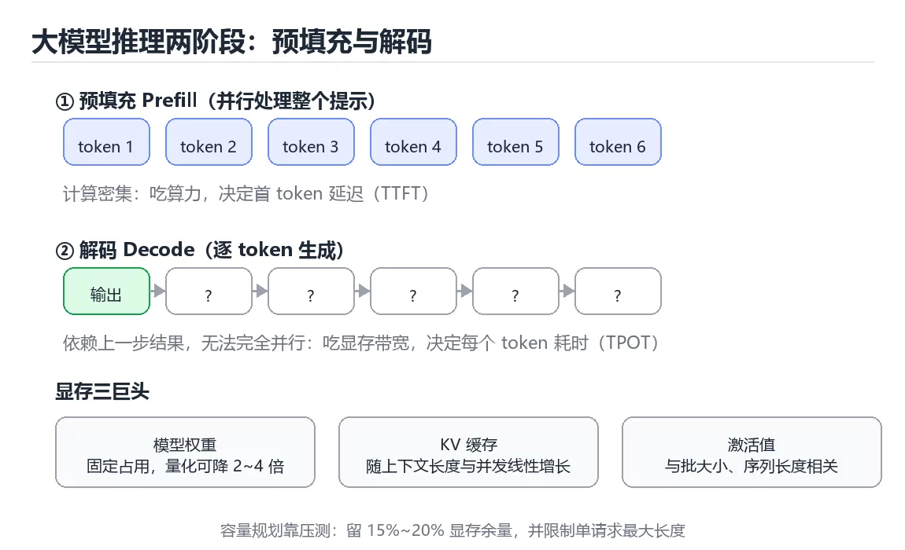
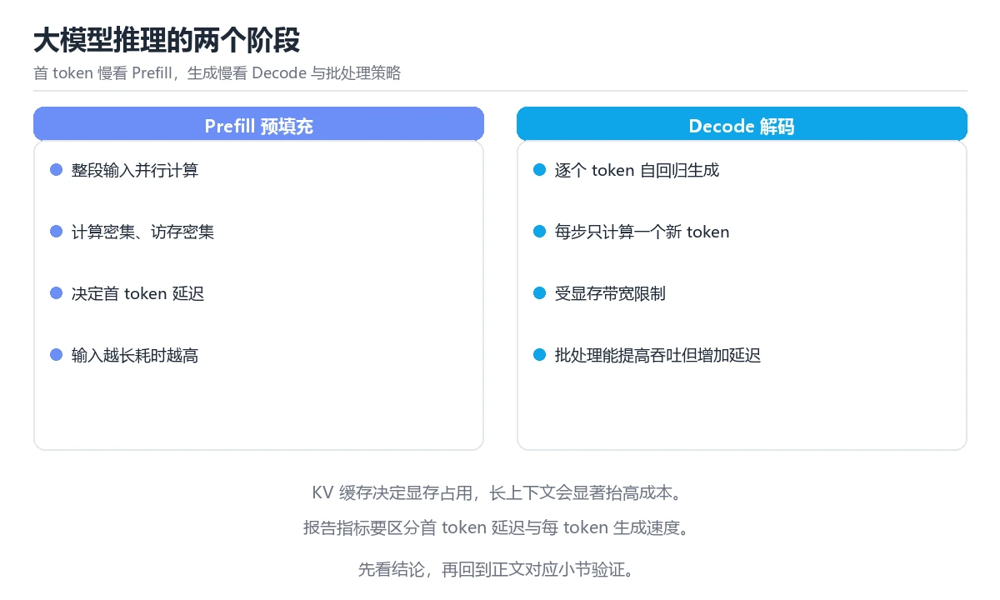

# 图解大模型推理与显存占用

> 内容更新时间：2026-10-06

## 学习目标

- 能用自己的话解释图解大模型推理与显存占用解决了什么问题，而不是只背术语。
- 能说清 「大模型」、「推理」、「显存」、「KV 缓存」 之间的关系，并分别举出一个例子。
- 能把本课知识放回「图解专题」的知识体系，说明它和相邻主题的边界。
- 能完成本课练习，并用验收标准检查自己的结果。

> 一句话摘要：预填充与解码两阶段、显存三巨头、四种优化与容量规划。

## 前置知识

- 先完成上一课《图解消息队列投递语义》；如果已经掌握，可以直接用本课练习自测。
- 本课阶段：进阶。建议先掌握同一分类的基础课程，并能独立运行正文中的最小示例。
- 开始前先复习：大模型、推理、显存。
- 如果某一步看不懂，先记录具体卡点，完成练习后再回头读一遍。



## 一句话说清

大模型推理分两个阶段：**预填充（读提示）与解码（逐个生成 token）**。
显存主要被三样东西吃掉：**模型权重、KV 缓存、中间激活**。

## 一张图看懂推理两阶段

```text
输入："请解释一下什么是二分查找"
        │
        ▼
① 预填充 Prefill（并行处理整个提示）
   · 一次性计算所有输入 token 的注意力
   · 计算密集，擅长并行，决定首 token 延迟（TTFT）
        │
        ▼
② 解码 Decode（逐个生成）
   · 每次只生成一个 token
   · 依赖上一步结果，无法完全并行
   · 决定每个 token 的输出速度（TPOT）
        │
        ▼
输出：二分查找是一种……

关键差异：预填充吃算力，解码吃显存带宽
```

| 指标 | 含义 | 主要受什么影响 |
| --- | --- | --- |
| TTFT | 首 token 延迟 | 提示长度、预填充算力 |
| TPOT | 每个输出 token 耗时 | 显存带宽、批大小 |
| 吞吐 | 每秒 token 数 | 批处理与并发调度 |

## 显存去哪了

```text
显存占用 ≈ 模型权重 + KV 缓存 + 激活值 + 框架开销

① 模型权重（最大头，固定）
   参数量 × 每参数字节数
   FP16：7B 模型 ≈ 14 GB
   INT8：7B 模型 ≈ 7 GB
   INT4：7B 模型 ≈ 3.5 GB

② KV 缓存（随对话增长）
   2 × 层数 × 头数 × 头维度 × 序列长度 × 批大小 × 字节数
   上下文越长、并发越高，占用越大

③ 激活值（临时，峰值决定能否跑起来）
   与批大小、序列长度相关

④ 框架开销（CUDA 上下文、碎片等，通常 1~2 GB）
```

```text
估算示例（大致量级，仅用于建立直觉）
  7B 模型 FP16 权重          ≈ 14 GB
  并发 8、上下文 4K 的 KV    ≈ 数 GB
  框架与激活                 ≈ 2~4 GB
  → 单卡 24 GB 可跑，但要控制并发与上下文长度
```

## 三个影响性能的关键变量

| 变量 | 变大时的影响 | 调优方向 |
| --- | --- | --- |
| 批大小 | 吞吐提升，但显存与延迟增加 | 找吞吐与延迟的平衡点 |
| 上下文长度 | 显存线性增长，注意力计算平方增长 | 截断、摘要、检索替代长上下文 |
| 量化精度 | 精度下降，显存与带宽需求下降 | INT8 常可接受，INT4 需实测 |

```text
注意力的代价随序列长度增长
  序列长度 1K  → 注意力计算量 ≈ 基线
  序列长度 4K  → 计算量约 16 倍
  序列长度 8K  → 计算量约 64 倍
因此「把整本手册塞进上下文」通常不是最优解，RAG 更划算
```

## 常见的四种优化手段

```text
① 量化：权重与 KV 缓存用更低精度
   · 显存下降、带宽压力下降
   · 需要验证效果是否可接受

② 批处理（Continuous Batching）：把多个请求拼批
   · 显著提升吞吐
   · 单请求延迟可能略升

③ KV 缓存复用：相同前缀（如系统提示）只算一次
   · 对固定系统提示的场景收益很大

④ 投机解码：小模型先猜，大模型批量校验
   · 生成速度可提升
   · 实现复杂，收益依场景而定
```

| 手段 | 收益 | 代价 |
| --- | --- | --- |
| 量化 | 显存与带宽 | 精度损失 |
| 连续批处理 | 吞吐 | 调度复杂度与延迟 |
| 前缀缓存 | 首 token 延迟 | 需要匹配前缀 |
| 投机解码 | 解码速度 | 额外模型与校验开销 |

## 容量规划示例

```text
已知：
  · 单卡显存 24 GB
  · 模型权重 FP16 占 14 GB
  · 框架开销 2 GB
  → 剩余约 8 GB 给 KV 缓存

估算：
  · 每 1K 上下文每并发约需 0.3 GB（示意值，需实测）
  → 约可支撑 8K 上下文 × 3 并发，或 4K × 6 并发

结论：显存决定并发上限，必须通过压测确定真实水位
```

**不要靠公式上线**：不同框架、不同注意力的实现差异很大，一定要压测。

## 四个常见故障与排查

| 现象 | 可能原因 | 排查方向 |
| --- | --- | --- |
| OOM（显存不足） | 并发过高、上下文过长、碎片 | 降并发、限长度、重启进程 |
| TTFT 突然增高 | 提示变长、缓存未命中 | 看提示长度与缓存命中率 |
| 吞吐上不去 | 批大小太小、频繁换入换出 | 调批处理与调度策略 |
| 输出变慢 | KV 缓存增长、显存带宽饱和 | 看序列长度与并发分布 |

```text
线上必须监控的四个指标
  · 显存使用率与峰值
  · TTFT 与 TPOT 的分位数（P95/P99）
  · 每秒生成 token 数（吞吐）
  · 请求排队时长与并发数
```

## 新手最容易踩的八个坑

| 坑 | 现象 | 正确做法 |
| --- | --- | --- |
| 按参数量直接估显存 | 上线即 OOM | 加上 KV 缓存与框架开销 |
| 无限加长上下文 | 显存暴涨、变慢 | 截断、摘要或用 RAG |
| 只调批大小不测延迟 | 用户体验变差 | 同时看吞吐与延迟分位 |
| 量化后不做评测 | 效果下降无人知 | 用评测集对比 |
| 忽略前缀缓存 | 重复计算系统提示 | 开启前缀或 KV 复用 |
| 只看平均值 | 长尾用户排队 | 看 P95 与 P99 |
| 不限制单请求长度 | 单请求拖垮全局 | 设最大输入与输出长度 |
| 不做压测就定并发 | 峰值直接 OOM | 压测确定并发上限 |



## 本课小结
- 推理两阶段：**预填充吃算力（决定 TTFT）、解码吃带宽（决定 TPOT）**。
- 显存三巨头：**权重、KV 缓存、激活**，后者随上下文与并发增长。
- 容量规划靠压测，不靠公式；上线必须限制长度与并发。

## 补充：采样参数、批处理调度与量化评估

### 四个采样参数怎么配合

| 参数 | 作用 | 典型取值 | 副作用 |
| --- | --- | --- | --- |
| temperature | 缩放概率分布，控制随机性 | 0（确定）~1（默认） | 过高会跑题、过低会重复 |
| top-k | 只从概率最高的 k 个里采样 | 20~100 | 太小会单调 |
| top-p（核采样） | 从累计概率达 p 的最小集合采样 | 0.9~0.95 | 与 top-k 同时用会互相限制 |
| 重复惩罚 | 降低已出现 token 的概率 | 1.0~1.2 | 过高会语句不通 |

```text
推荐的四种组合
  代码生成：temperature 0~0.2，top-p 0.95（几乎确定性）
  事实问答：temperature 0.2~0.3，top-p 0.9
  创意写作：temperature 0.7~1.0，top-p 0.95
  抽取结构化：temperature 0，配合 JSON schema 约束
```

### 两种批处理调度的差别

```text
静态批处理（static batching）
  [请求A: 生成200token][请求B: 生成20token][请求C: 生成80token]
  整批等最慢的那个完成 → B、C 早就算完却占着显存空转

连续批处理（continuous batching）
  一个槽位空出就立刻塞入新请求
  [A][B][C] → B 完成后立刻补入 D → 吞吐显著提升

效果：同硬件下吞吐常提升数倍，代价是调度复杂度与单请求延迟略升
```

| 指标 | 静态批处理 | 连续批处理 |
| --- | --- | --- |
| 吞吐 | 低 | 高 |
| 单请求延迟 | 受最长请求拖累 | 更平稳 |
| 显存效率 | 差（空转） | 好 |
| 实现复杂度 | 低 | 高 |

### KV 缓存量化与效果评估

```text
KV 缓存是长上下文的主要显存开销，量化它能显著扩容：
  FP16 KV → INT8 KV：显存约减半，精度影响通常可接受
  FP16 KV → INT4 KV：显存约减到 1/4，需要实测

评估方法（不能只看「感觉」）：
  ① 用固定评测集跑量化前后，对比准确率与一致性
  ② 关注长上下文任务（检索问答、长文档摘要）是否退化
  ③ 对比首 token 延迟与吞吐的变化
  ④ 抽样人工检查生成质量（流畅度、事实性）
```

### 投机解码的收益与前提

```text
原理：小模型快速猜 k 个 token，大模型一次前向批量校验
  · 猜对的部分直接采纳（省下多次前向）
  · 猜错的位置截断，从该处继续

收益取决于「小模型与大模型的一致性」：
  · 一致性高（如代码补全、模板化文本）→ 加速明显
  · 一致性低（创意写作）→ 收益有限甚至变慢
```

### 压力测试怎么做才有意义

```bash
# 关键：输入输出长度要贴近真实分布，否则结果没有参考价值
# 记录四个数：TTFT、TPOT、吞吐、显存峰值

# 阶梯加压：并发 1 → 4 → 8 → 16 → 32，观察拐点
for c in 1 4 8 16 32; do
  echo "并发 $c"
  # 用你的压测脚本发 N 个请求，输入 512 token、输出 128 token
done
```

| 观察点 | 含义 | 处理 |
| --- | --- | --- |
| TTFT 随并发陡增 | 排队严重 | 降并发或扩实例 |
| 吞吐到某点不再上升 | 达到显存/带宽上限 | 该点即为容量上限 |
| 显存接近上限 | 随时可能 OOM | 留 15%~20% 余量 |
| 长请求拖慢所有请求 | 缺少公平调度 | 限制单请求长度或分优先级 |

### 自查清单

- [ ] 能按任务类型给出采样参数组合
- [ ] 能解释连续批处理为什么吞吐更高
- [ ] 知道 KV 缓存量化前必须做效果评估
- [ ] 知道投机解码在什么场景收益最大
- [ ] 压测时输入输出长度贴近真实分布，并记录四个关键指标

## 动手练习

> 本课练习重点：围绕「大模型、推理、显存」完成复述、实验和交付，每个结果都要能被别人检查。

先不看原图手绘流程，再标出状态变化，最后用自己的话解释关键一步。

### 练习 1：建立心智模型（10 分钟）

合上教程，用 3～5 句话回答：

1. 图解大模型推理与显存占用解决了什么问题？
2. 如果没有它，会出现什么具体后果？
3. 它和「推理」是什么关系？

**验收标准**：至少出现一个本课关键词，并写出一个反例、边界条件或失效场景。

### 练习 2：做一次可控实验（20 分钟）

从正文中选一个最小示例，完成以下操作：

1. 先预测修改一个参数、输入或步骤后的结果。
2. 再实际执行或逐步推演，记录真实结果。
3. 如果结果与预测不同，写出差异原因。

**验收标准**：留下「原例 → 改动 → 预测 → 结果 → 原因」五步记录。

### 练习 3：交付一个小结果（30 分钟）

不看原图手绘一遍流程，再用自己的话指出图中的关键状态变化。

任务要求：

- 结果必须能被别人检查，不能只写“我已经理解了”。
- 至少覆盖「大模型」和「推理」两个关键词。
- 写出 1 个仍然不确定的问题，以及下一步如何验证。

> 提示：时间有限时优先做练习 1 和练习 2；练习 3 可以拆成两次完成。

## 可运行练习

### 任务 1：先跑通，再解释

```bash
# 关键：输入输出长度要贴近真实分布，否则结果没有参考价值
# 记录四个数：TTFT、TPOT、吞吐、显存峰值

# 阶梯加压：并发 1 → 4 → 8 → 16 → 32，观察拐点
for c in 1 4 8 16 32; do
  echo "并发 $c"
  # 用你的压测脚本发 N 个请求，输入 512 token、输出 128 token
done
```

**预期输出**：并发 $c

### 任务 2：只改一个条件

把「图解大模型推理与显存占用」的最小示例复制一份，只改一个条件再跑一次：

- 改动点：只把大模型的输入换成空值、极值或错误输入，其余保持不变。
- 预测：先写下「图解大模型推理与显存占用」在改动后的输出或错误信息，再运行。
- 记录：对照改动前后的结果，指出差异出在哪一步。
- 验收：换回原条件能复现原结果，改动只影响大模型。

### 任务 3：迁移到自己的数据

用同一套思路处理一组你自己的数据或场景，保持输出格式与任务 1 一致。

## 故障现场

### 现场 1：本课的 大模型 常规用例通过，但边界用例失败

**症状**：在本课的练习或生产场景里出现“本课的 大模型 常规用例通过，但边界用例失败”。

**复现**：准备一组最小输入，只保留触发“本课的 大模型 常规用例通过，但边界用例失败”的必要条件，连续运行两次确认结果稳定。

**定位**：围绕“大模型 的前置条件与取值边界没有写进代码，默认值掩盖了空值和极值”检查调用链、输入数据和环境配置，先验证假设再改代码。

**预防**：把“本课的 大模型 常规用例通过，但边界用例失败”写成一条自动化用例，并在本课的验收清单里保留对应检查项。

### 现场 2：本课的 推理 结果在两次运行之间不一致

**症状**：在本课的练习或生产场景里出现“本课的 推理 结果在两次运行之间不一致”。

**复现**：准备一组最小输入，只保留触发“本课的 推理 结果在两次运行之间不一致”的必要条件，连续运行两次确认结果稳定。

**定位**：围绕“推理 依赖了当前版本、执行顺序或共享状态，单次运行无法暴露差异”检查调用链、输入数据和环境配置，先验证假设再改代码。

**预防**：把“本课的 推理 结果在两次运行之间不一致”写成一条自动化用例，并在本课的验收清单里保留对应检查项。

### 现场 3：本课的验证只在开发机通过

**症状**：在本课的练习或生产场景里出现“本课的验证只在开发机通过”。

**定位**：围绕“环境版本、配置和输入规模与目标环境不同，大模型 缺少可重复的验证记录”检查调用链、输入数据和环境配置，先验证假设再改代码。

## 深入补充：图解大模型推理与显存占用 的取舍与边界

### 一、把概念放回真实约束

学习图解大模型推理与显存占用时，最容易只记住结论而忽略前提。先写出三个约束：数据规模、时间预算、可接受的失败方式；再判断 大模型 与 推理 在这些约束下是否仍然成立。只要约束改变，原来的最优解就可能变成错误解。

| 观察到的现象 | 背后的机制 | 验证方式 | 常见误判 |
| --- | --- | --- | --- |
| 延迟突然升高 | 队列堆积或重传 | 分段计时与指标对照 | 只盯平均值 |
| 状态看似随机 | 并发交错或缓存失效 | 固定随机种子复现 | 把时序问题当逻辑错误 |
| 结果与预期不符 | 默认值与边界规则 | 构造最小输入 | 忽略版本差异 |

### 二、三个容易混淆的边界

1. 澄清输入与目标。先写清「图解大模型推理与显存占用」要解决的问题、合法输入范围和成功标准，再进入后续步骤。
2. **把“平均值”当成“全部”**：大模型 的指标好看，不代表尾部请求、冷启动或失败重试也好看。
3. **把“当前版本”当成“永久行为”**：推理 依赖的默认值、API 或性能特征都可能随版本变化，需要固定版本并保留回归用例。

### 三、一个生产场景

假设团队要在真实系统里使用图解大模型推理与显存占用：第一周先做小流量验证，记录 大模型 的基线与异常；第二周扩大输入规模，观察 推理 是否成为瓶颈；第三周再做故障演练，主动注入超时、重复请求和依赖不可用，确认系统能降级、能重试、能恢复。每一步都要留下指标、日志和结论，而不是只留下“感觉更快了”。

### 四、自测清单

- 能否用一句话说出图解大模型推理与显存占用解决的核心问题与不适用场景？
- 能否画出 大模型 的数据流或状态变化，并标出失败路径？
- 能否给出一个反例，证明某个看似合理的结论在边界条件下不成立？
- 能否写出一条可复现的验证命令，让别人独立得到相同结论？

## 本课复习清单

离开本课前，逐项确认：

- [ ] 不看解析，能说出「大模型推理的预填充与解码阶段，主要差别是？」的判断依据。
- [ ] 不看解析，能说出「显存占用中，随对话上下文增长而变化的是？」的判断依据。
- [ ] 不看解析，能说出「把上下文从 1K 增加到 4K，注意力计算量大致如何变化？」的判断依据。
- [ ] 不看解析，能说出「上线前确定最大并发数，最可靠的方式是？」的判断依据。
- [ ] 不看解析，能说出的判断依据。
- [ ] 至少运行一次本课示例，记录输入、输出和一个边界情况。
- [ ] 把本课最容易混淆的两个概念写成一句话对照。

| 复盘项 | 记录 |
| --- | --- |
| 已经能独立解释的考点 |  |
| 仍然说不清的概念 |  |
| 下一步验证动作 |  |

## 术语速查

| 术语 | 本课语境 |
| --- | --- |
| `大模型` | 围绕“环境版本、配置和输入规模与目标环境不同，大模型 缺少可重复的验证记录”检查调用链、输入数据和环境配置，先验证假设再改代码。 |
| `推理` | 围绕“推理 依赖了当前版本、执行顺序或共享状态，单次运行无法暴露差异”检查调用链、输入数据和环境配置，先验证假设再改代码。 |
| `显存` | “图解大模型推理与显存占用”中的 大模型、推理、显存，下列哪两项是本课强调的实践判断。 |
| `KV 缓存` | 显存三巨头：权重、KV 缓存、激活，后者随上下文与并发增长。 |
| `量化` | 它在「图解大模型推理与显存占用」里是理解「量化」的关键术语，用来解释定义、适用条件与失败路径；它与大模型、推理共同决定这一节的判断边界。复习时回到正文示例核对输入、输出和验证方式。 |

## 考点精讲

### 考点 1：多选辨析·大模型

- **题目**：围绕“图解大模型推理与显存占用”中的 大模型、推理、显存，下列哪两项是本课强调的实践判断？
- **判断依据**：本课把图解大模型推理与显存占用拆成概念、示例与故障现场三部分，因此判断 大模型 时必须同时交代输入、输出和失败路径，这使“学习 大模型 时要同时说明输入、输出和失败路径，不能只看正常流程”成立。在图解大模型推理与显存占用里，判断 推理 时要固定版本与边界输入，所以“验证 推理 时要固定版本并覆盖边界输入，结论才可复现”才可复现。

### 考点 2：概念判断·大模型

- **题目**：显存占用中，随对话上下文增长而变化的是？
- **判断依据**：KV 缓存随序列长度与并发线性增长，是长上下文最容易被忽略的开销。「框架安装包」与「操作系统内核」与 GPU 显存无关。在「图解大模型推理与显存占用」里判断这道题，要把大模型、推理、显存的条件、过程与失败路径逐项对齐，换成“显存占用中”这个场景，只有满足前提的结论才成立。回到「图解大模型推理与显存占用」的正文示例，用“显存占用中”走一遍大模型、推理、显存的完整流程，能复现的结论才可以保留。

### 考点 3：代码补全·大模型

- **题目**：阅读「图解大模型推理与显存占用」正文里的这段代码代码，下面哪一项判断是正确的？
- **判断依据**：在「图解大模型推理与显存占用」里，题干的正确项是这段代码会产生可观察的输出，运行后能看到结果，在「图解大模型推理与显存占用」里要结合大模型核对输出是否符合预期。把输入或边界换成空值、极值或失败情况后，结论要以「图解大模型推理与显存占用」的实际运行结果为准。「图解大模型推理与显存占用」要求先交代大模型、推理、显存的前提再下结论，所以“这段代码会产生可观察的输出”只在题干“阅读图解大模型推理与显存占用正文里的这段代码代码”给定的条件下成立。

### 考点 4：概念判断·大模型

- **题目**：上线前确定最大并发数，最可靠的方式是？
- **判断依据**：不同框架与注意力实现的差异很大，必须实测。在「图解大模型推理与显存占用」里，作答时，先用大模型建立输入与输出的基线，再把压测找到显存与延迟的真实水位代入边界条件核对，结论才能复现。在「图解大模型推理与显存占用」里，这道题要求区分概念与边界，「压测找到显存与延迟的真实水位」只有在题干给出的前提下才成立，而「按参数量公式估算即可」、「参考别人的配置」缺少同一组条件。

### 考点 5：填空·大模型

- **题目**：补全代码：「图解大模型推理与显存占用」示例中，下面这行代码缺少哪个关键字或函数名？请填入 ____。 `代码生成：____ 0~0.2，top-p 0.95（几乎确定性）`
- **判断依据**：在「图解大模型推理与显存占用」里判断这道题，要把大模型、推理、显存的条件、过程与失败路径逐项对齐，换成“补全代码”这个场景，只有满足前提的结论才成立。“图解大模型推理与显存占用示例中”与「图解大模型推理与显存占用」的术语表相呼应，只有符合大模型、推理、显存约束的“temperature”才是正文支持的结论。

## English Overview

**Title:** LLM Inference and Memory

**Summary:** Prefill and decode, memory breakdown, optimizations and capacity.

**Category:** Visual Guide
**Level:** 进阶
**Key terms:** 大模型, 推理, 显存, KV 缓存, 量化

## 内容元数据

- 内容版本：v2.0
- 最后更新：2026-10-06
- 学习阶段：进阶
- 适用环境：通用图解与系统原理
- 内容来源：内置结构化课程与工程实践整理
- 相关主题：大模型、推理、显存、KV 缓存、量化
- 质量版本：P0 测验标准 + P1 覆盖扩展 + P2 体验补全

## 参考资料与复核

- 最后复核：2026-10-04
- 下次复核：2027-04-04
- 复核范围：版本兼容、API 行为、安全建议与工程实践
- 来源性质：官方文档、标准或权威教材；正文为离线教学重组

| 参考资料 | 本课用途 |
| --- | --- |
| [Kubernetes 架构](https://kubernetes.io/docs/concepts/architecture/) | 控制平面与节点流程 |
| [MDN 浏览器工作原理](https://developer.mozilla.org/docs/Web/Performance/How_browsers_work) | 从请求到渲染的流程 |
| [RFC Editor](https://www.rfc-editor.org/) | 协议状态机与报文流程 |

> 「图解大模型推理与显存占用」的链接用于离线阅读后的延伸核对；App 不会自动联网。

## 复习与迁移

复习目标：把「图解大模型推理与显存占用」的判断标准放回可复现的例子里。先自己作答，再对照依据；如果结论正确但理由不完整，回到正文补足前提。

### 概念复述

- 用一句话说明「图解大模型推理与显存占用」解决什么问题：预填充与解码两阶段、显存三巨头、四种优化与容量规划。
- 写出大模型、推理、显存之间的关系，并各举一个例子。
- 说出本课最容易混淆的两个概念，以及区分它们的判据。

### 正文逐节复核

- **一句话说清**：大模型推理分两个阶段：**预填充（读提示）与解码（逐个生成 token）**。
- **深入补充：图解大模型推理与显存占用 的取舍与边界**：学习图解大模型推理与显存占用时，最容易只记住结论而忽略前提。

### 测验回顾

1. 围绕“图解大模型推理与显存占用”中的 大模型、推理、显存，下列哪两项是本课强调的实践判断？
   - 依据：本课把图解大模型推理与显存占用拆成概念、示例与故障现场三部分，因此判断 大模型 时必须同时交代输入、输出和失败路径，这使“学习 大模型 时要同时说明输入、输出和失败路径，不能只看正常流程”成立。在图解大模型推理与显存占用里，判断 推理 时要固定版本与边界输入，所以“验证 推理 时要固定版本并覆盖边界输入，结论才可复现”才可复现。
2. 显存占用中，随对话上下文增长而变化的是？
   - 依据：KV 缓存随序列长度与并发线性增长，是长上下文最容易被忽略的开销。「框架安装包」与「操作系统内核」与 GPU 显存无关。在「图解大模型推理与显存占用」里判断这道题，要把大模型、推理、显存的条件、过程与失败路径逐项对齐，换成“显存占用中”这个场景，只有满足前提的结论才成立。回到「图解大模型推理与显存占用」的正文示例，用“显存占用中”走一遍大模型、推理、显存的完整流程，能复现的结论才可以保留。
3. 阅读「图解大模型推理与显存占用」正文里的这段代码代码，下面哪一项判断是正确的？
   - 依据：在「图解大模型推理与显存占用」里，题干的正确项是这段代码会产生可观察的输出，运行后能看到结果，在「图解大模型推理与显存占用」里要结合大模型核对输出是否符合预期。把输入或边界换成空值、极值或失败情况后，结论要以「图解大模型推理与显存占用」的实际运行结果为准。「图解大模型推理与显存占用」要求先交代大模型、推理、显存的前提再下结论，所以“这段代码会产生可观察的输出”只在题干“阅读图解大模型推理与显存占用正文里的这段代码代码”给定的条件下成立。
4. 上线前确定最大并发数，最可靠的方式是？
   - 依据：不同框架与注意力实现的差异很大，必须实测。在「图解大模型推理与显存占用」里，作答时，先用大模型建立输入与输出的基线，再把压测找到显存与延迟的真实水位代入边界条件核对，结论才能复现。在「图解大模型推理与显存占用」里，这道题要求区分概念与边界，「压测找到显存与延迟的真实水位」只有在题干给出的前提下才成立，而「按参数量公式估算即可」、「参考别人的配置」缺少同一组条件。
5. 补全代码：「图解大模型推理与显存占用」示例中，下面这行代码缺少哪个关键字或函数名？请填入 ____。

`代码生成：____ 0~0.2，top-p 0.95（几乎确定性）`
   - 依据：在「图解大模型推理与显存占用」里判断这道题，要把大模型、推理、显存的条件、过程与失败路径逐项对齐，换成“补全代码”这个场景，只有满足前提的结论才成立。“图解大模型推理与显存占用示例中”与「图解大模型推理与显存占用」的术语表相呼应，只有符合大模型、推理、显存约束的“temperature”才是正文支持的结论。

### 迁移练习

把「图解大模型推理与显存占用」的结论迁移到相邻主题，每次迁移都写清预测与证据：

1. 换输入：用大模型处理一组你自己的数据，对比教材示例的结果差异。
2. 换失败条件：制造一个推理相关的错误，说明如何从错误信息定位根因。
3. 换规模：把数据量或并发度提高一个数量级，说明「图解大模型推理与显存占用」的结论是否仍成立。
